1 IVE Introduction
------------------

### **1.1** **API List**

l NVT\_IVE\_Filter : General filter function

l NVT\_IVE\_Median : 3x3 Median filter function

l NVT\_IVE\_Min : 3x3 Min filter function

l NVT\_IVE\_Max : 3x3 Max filter function

l NVT\_IVE\_Sobel : 5x5 Sobel filter function

l NVT\_IVE\_Thresh : Image thresholding function

l NVT\_IVE\_Dilate : Image dilate function

l NVT\_IVE\_Erode : Image erode function

l NVT\_IVE\_Integ : Integral image function

l NVT\_IVE\_Canny : Canny edge function

l NVT\_IVE\_CSC : Color Space Conversion(CSC) function

l NVT\_IVE\_Histo : Histogram function

l NVT\_IVE\_NCC : Normalized Cross Correlation(NCC) function

2 API
-----

### 2.1 NVT\_IVE\_Filter

【Description】

Applying 7x7 general filter to input image.

【Function】

INT32 NVT\_IVE\_Filter (IVE\_SRC\_IMAGE\_S* pstSrc, IVE\_DST\_IMAGE\_S* pstDst, IVE\_FILTER\_CTRL_S* pstFltCtrl)

【Parameter】

|     |     |     |
| --- | --- | --- |
| **Parameter** | **Description** | **Input/Output** |
| pstSrc | Input image pointer | Input |
| pstDst | Output image pointer | Output |
| pstFltCtrl | General filter control pointer | Input |

|     |     |     |     |
| --- | --- | --- | --- |
| **Parameter** | **Data type** | **Alignment** | **Resolution** |
| pstSrc | U8C1 | 4 byte | 16x16~16383x8191 |
| pstDst | U8C1 | 4 byte | Same as pstSrc |

IVE\_FILTER\_CTRL_S

|     |     |     |
| --- | --- | --- |
| **Parameter** | **Data Type** | **Description** |
| u8Mask\[10\] | UINT8 | General filter Mask, range : 0~15 |

【Return Value】

|     |     |
| --- | --- |
| **Return Value** | **Description** |
| 0   | Success |
| Other values | Failure. See section “Error Code” for details |

【Requirement】

???????? Header file: libive.h

???????? Library file: libvendor_cv.a

【Notice】

l Filter index number as following Figure 2.2?1

Figure 2.2?1

??????????????? u8Mask\[0\]~ u8Mask\[9\] corresponds to index 0~9

l For image border pixels, mirror padding is applied in general filter process.

【Sample】

???????? hdal\\samples\\alg\_ive\_filter\\alg\_ive\_filter.c

【Efficiency】

l The execution time is proportional to the resolution of an image.

l The execution time of NVT\_IVE\_Filter is 634 , estimated by a sample (image resolution 516x376).

### 2.2 NVT\_IVE\_Median

【Description】

Applying 3x3 Median filter to input image.

【Function】

INT32 NVT\_IVE\_Median (IVE\_SRC\_IMAGE\_S* pstSrc, IVE\_DST\_IMAGE\_S* pstDst)

【Parameter】

|     |     |     |
| --- | --- | --- |
| **Parameter** | **Description** | **Input/Output** |
| pstSrc | Input image pointer | Input |
| pstDst | Output image pointer | Output |

|     |     |     |     |
| --- | --- | --- | --- |
| **Parameter** | **Data type** | **Alignment** | **Resolution** |
| pstSrc | U8C1 | 4 byte | 16x16~16383x8191 |
| pstDst | U8C1 | 4 byte | Same as pstSrc |

【Return Value】

|     |     |
| --- | --- |
| **Return Value** | **Description** |
| 0   | Success |
| Other values | Failure. See section “Error Code” for details |

【Requirement】

???????? Header file: libive.h

???????? Library file: libvendor_cv.a

【Notice】

l For image border pixels, mirror padding is applied in median filter process.

【Sample】

???????? hdal\\samples\\alg\_ive\_median\\alg\_ive\_median.c

【Efficiency】

l The execution time is proportional to the resolution of an image.

l The execution time of NVT\_IVE\_Median is 634 , estimated by sample (image resolution 516x376).

### 2.3 NVT\_IVE\_Min

【Description】

Applying 3x3 Min filter to input image.

【Function】

INT32 NVT\_IVE\_Min (IVE\_SRC\_IMAGE\_S* pstSrc, IVE\_DST\_IMAGE\_S* pstDst)

【Parameter】

|     |     |     |
| --- | --- | --- |
| **Parameter** | **Description** | **Input/Output** |
| pstSrc | Input image pointer | Input |
| pstDst | Output image pointer | Output |

|     |     |     |     |
| --- | --- | --- | --- |
| **Parameter** | **Data type** | **Alignment** | **Resolution** |
| pstSrc | U8C1 | 4 byte | 16x16~16383x8191 |
| pstDst | U8C1 | 4 byte | Same as pstSrc |

【Return Value】

|     |     |
| --- | --- |
| **Return Value** | **Description** |
| 0   | Success |
| Other values | Failure. See section “Error Code” for details |

【Requirement】

???????? Header file: libive.h

???????? Library file: libvendor_cv.a

【Notice】

l For image border pixels, mirror padding is applied in min filter process.

【Sample】

???????? hdal\\samples\\alg\_ive\_min\\alg\_ive\_min.c

【Efficiency】

l The execution time is proportional to the resolution of an image.

l The execution time of NVT\_IVE\_Min is 634 , estimated by sample (image resolution 516x376).

### 2.4 NVT\_IVE\_Max

【Description】

???????? Applying 3x3 Max filter to input image.

【Function】

INT32 NVT\_IVE\_Max (IVE\_SRC\_IMAGE\_S* pstSrc, IVE\_DST\_IMAGE\_S* pstDst)

【Parameter】

|     |     |     |
| --- | --- | --- |
| **Parameter** | **Description** | **Input/Output** |
| pstSrc | Input image pointer | Input |
| pstDst | Output image pointer | Output |

|     |     |     |     |
| --- | --- | --- | --- |
| **Parameter** | **Data type** | **Alignment** | **Resolution** |
| pstSrc | U8C1 | 4 byte | 16x16~16383x8191 |
| pstDst | U8C1 | 4 byte | Same as pstSrc |

【Return Value】

|     |     |
| --- | --- |
| **Return Value** | **Description** |
| 0   | Success |
| Other values | Failure. See section “Error Code” for details |

【Requirement】

???????? Header file: libive.h

???????? Library file: libvendor_cv.a

【Notice】

l For image border pixels, mirror padding is applied in max filter process.

【Sample】

hdal\\samples\\alg\_ive\_max\\alg\_ive\_max.c

【Efficiency】

l The execution time is proportional to the resolution of an image.

l The execution time of NVT\_IVE\_Max is 636 , estimated by sample (image resolution 516x376).

### 2.5 NVT\_IVE\_Sobel

【Description】

???????? Applying 5x5 Sobel filter to input image.

【Function】

INT32 NVT\_IVE\_Sobel (IVE\_SRC\_IMAGE\_S* pstSrc, IVE\_DST\_IMAGE\_S* pstDst, IVE\_SOBEL\_CTRL_S* pstSobelCtrl)

【Parameter】

|     |     |     |
| --- | --- | --- |
| **Parameter** | **Description** | **Input/Output** |
| pstSrc | Input image pointer | Input |
| pstDst | Output gradient x/y packed image pointer | Output |
| pstSobelCtrl | Edge filter parameter pointer | Input |

|     |     |     |     |
| --- | --- | --- | --- |
| **Parameter** | **Data type** | **Alignment** | **Resolution** |
| pstSrc | U8C1 | 4 byte | 16x16~16383x8191 |
| pstDst | S16C1 | 4 byte | 16x16~16383x8191 |

IVE\_SOBEL\_CTRL_S

|     |     |     |
| --- | --- | --- |
| **Parameter** | **Data Type** | **Description** |
| s8Mask\[25\] | S8  | Edge filter Mask, range : -15~15 |

【Return Value】

|     |     |
| --- | --- |
| **Return Value** | **Description** |
| 0   | Success |
| Other values | Failure. See section “Error Code” for details |

【Requirement】

???????? Header file: libive.h

???????? Library file: libvendor_cv.a

【Notice】

l ??????? User can set s8Mask for calculating gradient x, and the library will transpose and flip the mask for calculating gradient y. The mask index is shown as below:

|     |     |     |     |     |
| --- | --- | --- | --- | --- |
| 0   | 1   | 2   | 3   | 4   |
| 5   | 6   | 7   | 8   | 9   |
| 10  | 11  | 12  | 13  | 14  |
| 15  | 16  | 17  | 18  | 19  |
| 20  | 21  | 22  | 23  | 24  |

l User can set pstDst format as S16C1. If user set as S16C1, the output will be signed 8 bit gradient x/y packed format(gradient x signed 8bit + gradient y signed 8bit per pixel).

【Sample】

hdal\\samples\\alg\_ive\_sobel\\alg\_ive\_sobel.c

【Efficiency】

l The execution time is proportional to the resolution of an image.

l The execution time of NVT\_IVE\_Sobel is 657 , estimated by sample (image resolution 516x376).

### 2.6 NVT\_IVE\_Thresh

【Description】

NVT\_IVE\_Thresh applies two user-defined thresholds to partition an input image into a tenary image.

【Function】

INT32 NVT\_IVE\_Thresh (IVE\_SRC\_IMAGE\_S* pstSrc, IVE\_DST\_IMAGE\_S* pstDst, IVE\_THRESH\_CTRL_S* pstThrCtrl)

【Parameter】

|     |     |     |
| --- | --- | --- |
| **Parameter** | **Description** | **Input/Output** |
| pstSrc | Input image pointer | Input |
| pstDst | Output image pointer | Output |
| pstThrCtrl | Thresholding control pointer | Input |

|     |     |     |     |
| --- | --- | --- | --- |
| **Parameter** | **Data type** | **Alignment** | **Resolution** |
| pstSrc | U8C1 | 4 byte | 64x64~1920x1080 |
| pstDst | U8C1 | 4 byte | Same as pstSrc |

IVE\_THRESH\_CTRL_S

|     |     |     |
| --- | --- | --- |
| **Parameter** | **Data type** | **Description** |
| u8LutThresh\[15\] | U8  | 15 threshold levels: 0-255 (strictly increasing) |

【Return Value】

|     |     |
| --- | --- |
| **Return Value** | **Description** |
| 0   | Success |
| Other values | Failure. See section “Error Code” for details |

【Requirement】

???????? Header file: libive.h

???????? Library file: libvendor_cv.a

【Notice】

l NVT\_IVE\_Thresh partitions image pixels into a 4bits image by LutThresh. The value of each output pixel could be 0-15. Each output pixel (U8C1) is the packed format by two neighbor pixel (LSB 4bit represent odd pixel, MSB 4bit represent even pixel).

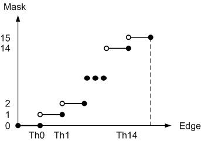

l Packed output format is shown as:

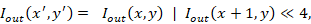

【Sample】

???????? hdal\\samples\\alg\_ive\_thresh\\alg\_ive\_thresh.c

【Efficiency】

l The execution time is proportional to the resolution of an image.

l The execution time of NVT\_IVE\_Thresh is 657 , estimated by sample (image resolution 316x316).

### 2.7 NVT\_IVE\_Dilate

【Description】

Image dilation uses a 5x5 structural element to expand the shapes contained in input image.

【Function】

INT32 NVT\_IVE\_Dilate (IVE\_SRC\_IMAGE\_S* pstSrc, IVE\_DST\_IMAGE\_S* pstDst, IVE\_MORPH\_CTRL_S\* pstDilateCtrl)

【Parameter】

|     |     |     |
| --- | --- | --- |
| **Parameter** | **Description** | **Input/Output** |
| pstSrc | Input image pointer | Input |
| pstDst | Output image pointer | Output |
| pstDilateCtrl | Dilation control pointer | Input |

|     |     |     |     |
| --- | --- | --- | --- |
| **Parameter** | **Data type** | **Alignment** | **Resolution** |
| pstSrc | U8C1 | 4 byte | 16x16~16383x8191 |
| pstDst | U8C1 | 4 byte | Same as pstSrc |

IVE\_MORPH\_CTRL_S

|     |     |     |
| --- | --- | --- |
| **Parameter** | **Data Type** | **Description** |
| u8Mask\[24\] | U8  | Structural element coefficients |

【Return Value】

|     |     |
| --- | --- |
| **Return Value** | **Description** |
| 0   | Success |
| Other values | Failure. See section “Error Code” for details |

【Requirement】

???????? Header file: libive.h

???????? Library file: libvendor_cv.a

【Notice】

l The coefficients of structural element must be 0 or 1.

l The 5x5 structural element is described by array **u8Mask** which contains 24 coefficients and the corresponding position in 2D space is

Dilation uses a specified structural element to slide whole image and the process can be described as below

_for each image pixel_ **p** in input image **I**in {

_max =_ **I**in(**p**)

_for(i=0; i<24; i++)_ {

_if(mask(i)==1 &&_ **I**in_(_**q**_(i)) > max)?_

_//_ **q**_(i)_ is the corresponding pixel of coefficient _i_

_// max =_ **I**in_(_**q**_(i))_

}

**I**out_(_**p**_) = max_

}

l For image border pixels, mirror padding is applied in dilation process.

【Sample】

???????? hdal\\samples\\alg\_ive\_dilate\\alg\_ive\_dilate.c

【Efficiency】

l The execution time is proportional to the resolution of an image.

l The execution time of NVT\_IVE\_Dilate is 440 , estimated by sample (image resolution 316x316).

### 2.8 NVT\_IVE\_Erode

【Description】

Image erosion uses a 5x5 structural element to reduce the shapes contained in input image.

【Function】

INT32 NVT\_IVE\_Erode (IVE\_SRC\_IMAGE\_S* pstSrc, IVE\_DST\_IMAGE\_S* pstDst, IVE\_MORPH\_CTRL_S* pstErodeCtrl)

【Parameter】

|     |     |     |
| --- | --- | --- |
| **Parameter** | **Description** | **Input/Output** |
| pstSrc | Input image | Input |
| pstDst | Output image | Output |
| pstErodeCtrl | Erosion control pointer | Input |

|     |     |     |     |
| --- | --- | --- | --- |
| **Parameter** | **Data type** | **Alignment** | **Resolution** |
| pstSrc | U8C1 | 4 byte | 16x16~16383x8191 |
| pstDst | U8C1 | 4 byte | Same as pstSrc |

IVE\_MORPH\_CTRL_S

|     |     |     |
| --- | --- | --- |
| **Parameter** | **Data Type** | **Description** |
| u8Mask\[24\] | U8  | Structural element coefficients |

【Return Value】

|     |     |
| --- | --- |
| **Return Value** | **Description** |
| 0   | Success |
| Other values | Failure. See section “Error Code” for details |

【Requirement】

???????? Header file: libive.h

???????? Library file: libvendor_cv.a

【Notice】

l ??????? The coefficients of structural element must be 0 or 1.

l The 5x5 structural element is described by array **u8Mask** which contains 24 coefficients and the corresponding position in 2D space is

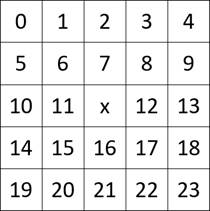

Erosion uses a specified structural element to slide whole image and the process can be described as below

_for each image pixel_ **p** in input image **I**in {

_min =_ **I**in(**p**)

_for(i=0; i<24; i++)_ {

_if(mask(i)==1 &&_ **I**in_(_**q**_(i)) < min)?_

_//_ **q**_(i)_ is the corresponding pixel of coefficient _i_

_// min =_ **I**in_(_**q**_(i))_

}

**I**out_(_**p**_) = min_

}

l For image border pixels, mirror padding is applied in erosion process.

【Sample】

???????? hdal\\samples\\alg\_ive\_erode\\alg\_ive\_erode.c

【Efficiency】

l The execution time is proportional to the resolution of an image.

l The execution time of NVT\_IVE\_Erode is 465 , estimated by sample (image resolution 316x316).

### 2.9 NVT\_IVE\_Integ

【Description】

This function calculates the sum of values in a rectangular subset of a grid:

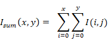

【Function】

INT32 NVT\_IVE\_Integ (IVE\_SRC\_IMAGE\_S* pstSrc, IVE\_DST\_IMAGE\_S* pstDst, IVE\_INTEG\_CTRL_S *pstIntegCtrl)

【Parameter】

|     |     |     |
| --- | --- | --- |
| **Parameter** | **Description** | **Input/Output** |
| pstSrc | Input image pointer | Input |
| pstDst | Output image pointer | Output |
| pstIntegCtrl | Integral control pointer | Input |

|     |     |     |     |
| --- | --- | --- | --- |
| **Parameter** | **Data type** | **Alignment** | **Resolution** |
| pstSrc | U8C1 | 4 byte | 16x16~1920x8191 |
| pstDst | U32C1 | 4 byte | Same as pstSrc |

IVE\_INTEG\_CTRL_S

|     |     |     |
| --- | --- | --- |
| **Parameter** | **Data Type** | **Description** |
| enInFormat | LIB\_IVE\_INTEGRAL\_IN\_FMT | 0: 1 channel  1: 2 channel packed |
| enOutFormat | LIB\_IVE\_INTEGRAL\_OUT\_FMT | 0: sum |

【Return Value】

|     |     |
| --- | --- |
| **Return Value** | **Description** |
| 0   | Success |
| Other values | Failure. See section “Error Code” for details |

【Requirement】

???????? Header file: libive.h

???????? Library file: libvendor_cv.a

【Notice】

???????? The input format supports 1 channel 8 bit / 2 channel 8 bit packed. The output format supports integral sum (32bit).

【Sample】

???????? Sample code : samples\\alg\_ive\_integral\\alg\_ive\_integral.c

【Efficiency】

l The execution time is proportional to the resolution of an image.

l The execution time of NVT\_IVE\_Integral is 10652 , estimated by sample (image resolution 316x316).

### 2.10 NVT\_IVE\_Canny

【Description】

NVT\_IVE\_Canny extract edges in a gray scale image by following steps

l Image smoothing

l Image gradient and gradient magnitude calculation

l Non-maximun suppression

【Function】

INT32 NVT\_IVE\_Canny (IVE\_SRC\_IMAGE\_S* pstSrc, IVE\_DST\_IMAGE\_S* pstDst, IVE\_CANNY\_CTRL_S* pstCannyCtrl)

【Parameter】

|     |     |     |
| --- | --- | --- |
| **Parameter** | **Description** | **Input/Output** |
| pstSrc | Input image pointer | Input |
| pstDst | Output image pointer | Output |
| pstCannyCtrl | Edge detection control pointer | Input |

|     |     |     |     |
| --- | --- | --- | --- |
| **Parameter** | **Data type** | **Alignment** | **Resolution** |
| pstSrc | U8C1 | 4 byte | 16x16~16383x8191 |
| pstDst | U8C1 | 4 byte | Same as pstSrc |

【Return Value】

|     |     |
| --- | --- |
| **Return Value** | **Description** |
| 0   | Success |
| Other values | Failure. See section “Error Code” for details |

【Requirement】

???????? Header file: libive.h

???????? Library file: libvendor_cv.a

【Notice】

l The edge detection process uses a 7x7 kernel to smooth input image. The smoothing kernel is described by an array with 10 elements, **s8Mask**, and the corresponding position in 2D space is

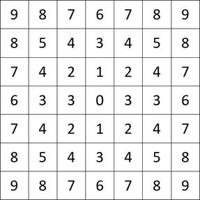

The valid value range of **s8Mask** is \[-15, 15\].

【Sample】

???????? hdal\\samples\\alg\_ive\_canny\\alg\_ive\_canny.c

【Efficiency】

l The execution time is proportional to the resolution of an image.

l The execution time of NVT\_IVE\_Canny is 458 , estimated by sample (image resolution 316x316).

### 2.11 NVT\_IVE\_CSC

【Description】

 NVT\_IVE\_CSC can do color space conversion from YUV to RGB or HSV or LAB.

【Function】

INT32 NVT\_IVE\_CSC (IVE\_SRC\_IMAGE\_S* pstSrc, IVE\_DST\_IMAGE\_S* pstDst, IVE\_CSC\_CTRL_S* pstCscCtrl)

【Parameter】

|     |     |     |
| --- | --- | --- |
| **Parameter** | **Description** | **Input/Output** |
| pstSrc | Input image pointer | Input |
| pstDst | Output image pointer | Output |
| pstCscCtrl | CSC control pointer | Input |

|     |     |     |     |
| --- | --- | --- | --- |
| **Parameter** | **Data type** | **Alignment** | **Resolution** |
| pstSrc | U8C1 | 4 byte | 16x16~4096x8191 |
| pstDst | U8C1 | 4 byte | Same as pstSrc |

IVE\_CSC\_CTRL_S

|     |     |     |
| --- | --- | --- |
| **Parameter** | **Data Type** | **Description** |
| enCSCMode | LIB\_IVE\_CSC_MODE | 0:  YUV2RGB  1:  YUV2HSV  2:  YUV2LAB |
| enOutFmt | LIB\_IVE\_CSC\_OUT\_FMT | 0:  PLANAR  1:  PACKED |
| enLabFmt | LIB\_IVE\_CSC\_LAB\_FMT | 0:  D65  1:  D50 |
| enRgbFmt | LIB\_IVE\_CSC\_RGB\_FMT | 0:  BT601  1:  BT709  2:  JPG encoder |

【Return Value】

|     |     |
| --- | --- |
| **Return Value** | **Description** |
| 0   | Success |
| Other values | Failure. See section “Error Code” for details |

【Requirement】

???????? Header file: libive.h

???????? Library file: libvendor_cv.a

【Notice】

l Only support YUV420SP(NV12)/YVU420SP(NV21)/YUV422 input

YUV420SP(NV12):

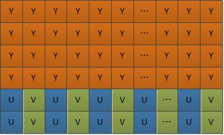

YVU420SP(NV21):

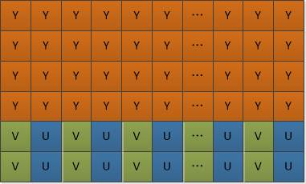

YUV422 support UYVY、YUYV、VYUY、YVYU 4 types.

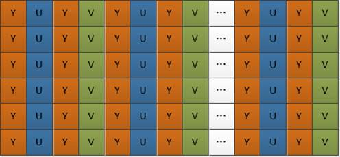

l Output format PLANAR/ PACKED as following figure

PLANAR:

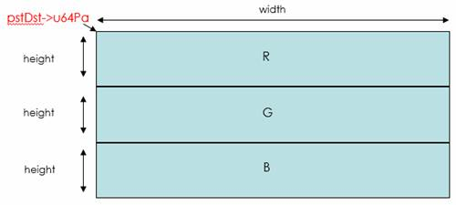

pstDst->u32Stride = width

PACKED:

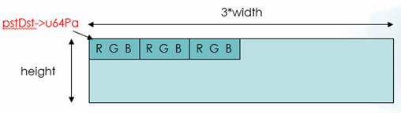

pstDst->u32Stride = 3*width

l YUV2RGB :  YUV->RGB ->Gamma Correction

YUV2HSV :  YUV ->RGB ->Gamma correction ->HSV

YUV2LAB :  YUV ->RGB ->Gamma correction ->LAB

enRgbFmt should be set for all enCSCMode.

【Sample】

???????? hdal\\samples\\alg\_ive\_csc\\alg\_ive\_csc.c

【Efficiency】

l The execution time is proportional to the resolution of an image.

l The execution time of NVT\_IVE\_Canny is 458 , estimated by sample (image resolution 512x376).

### 2.12 NVT\_IVE\_Histo

【Description】

???????? NVT\_IVE\_Histo can calculate histogram for input image.

【Function】

INT32 NVT\_IVE\_Histo (IVE\_SRC\_IMAGE\_S* pstSrc, IVE\_DST\_IMAGE\_S* pstDst)

【Parameter】

|     |     |     |
| --- | --- | --- |
| **Parameter** | **Description** | **Input/Output** |
| pstSrc | Input image pointer | Input |
| pstDst | Output histogram result pointer | Output |

|     |     |     |     |
| --- | --- | --- | --- |
| **Parameter** | **Data type** | **Alignment** | **Resolution** |
| pstSrc | U8C1 | 4 byte | 64x64~1920x1080 |
| pstDst | U8C1 | 4 byte | 1024 byte |

【Return Value】

|     |     |
| --- | --- |
| **Return Value** | **Description** |
| 0   | Success |
| Other values | Failure. See section “Error Code” for details |

【Requirement】

???????? Header file: libive.h

???????? Library file: libvendor_cv.a

【Notice】

l Histogram output size = 256(bin) x 4(byte) = 1024(byte)

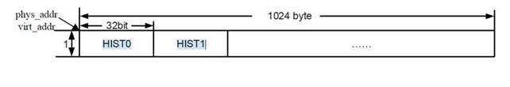

【Sample】

???????? hdal\\samples\\alg\_ive\_histo\\alg\_ive\_histo.c

【Efficiency】

l The execution time is proportional to the resolution of an image.

l The execution time of NVT\_IVE\_Histo is 756 , estimated by a sample (image resolution 512x376).

### 2.13 NVT\_IVE\_NCC

【Description】

???????? NVT\_IVE\_NCC can calculate normalized cross correlation. The formula is shown below:

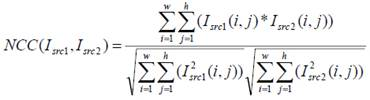

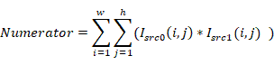

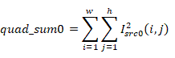

【Function】

INT32 NVT\_IVE\_NCC (IVE\_SRC\_IMAGE\_S* pstSrc1, IVE\_SRC\_IMAGE\_S* pstSrc2, IVE\_NCC\_INFO_S* pstDst)

【Parameter】

|     |     |     |
| --- | --- | --- |
| **Parameter** | **Description** | **Input/Output** |
| pstSrc1 | Input image pointer | Input |
| pstSrc2 | Input image pointer | Input |
| pstDst | Ouput NCC result pointer | Output |

|     |     |     |     |
| --- | --- | --- | --- |
| **Parameter** | **Data type** | **Alignment** | **Resolution** |
| pstSrc1 | U8C1 | 4 byte | 32x32~1920x1080 |
| pstSrc2 | U8C1 | 4 byte | Same as pstSrc1 |
| pstDst | Data structure | -   | -   |

IVE\_NCC\_INFO_S

|     |     |     |
| --- | --- | --- |
| **Parameter** | **Data Type** | **Description** |
| u64Numerator | UINT64 | NCC numerator |
| u64QuadSum1 | UINT64 | NCC quad sum from pstSrc1 |
| u64QuadSum2 | UINT64 | NCC quad sum from pstSrc2 |

【Return Value】

|     |     |
| --- | --- |
| **Return Value** | **Description** |
| 0   | Success |
| Other values | Failure. See section “Error Code” for details |

【Requirement】

???????? Header file: libive.h

???????? Library file: libvendor_cv.a

【Notice】

l After trigger NVT\_IVE\_NCC, calculation result is stored in pstDst.

【Sample】

???????? hdal\\samples\\alg\_ive\_ncc\\alg\_ive\_ncc.c

【Efficiency】

l The execution time is proportional to the resolution of an image.

l The execution time of NVT\_IVE\_NCC is 625 , estimated by a sample (image resolution 512x376).

3 Error Code
------------

|     |     |
| --- | --- |
| **Return value** | **Description** |
| LIB\_IVE\_OK | Execute success |
| LIB\_IVE\_ERR_PARAM | Lib IVE param setting failure |
| LIB\_IVE\_ERR_INIT | IVE hardware init failure |
| LIB\_IVE\_ERR_LOCK | IVE hardware lock failure |
| LIB\_IVE\_ERR_SET | IVE hardware set param  failure |
| LIB\_IVE\_ERR_GET | IVE hardware get param failure |
| LIB\_IVE\_ERR_TRIG | IVE hardware trigger failure |
| LIB\_IVE\_ERR_UNLOCK | IVE hardware unlock failure |
| LIB\_IVE\_ERR_UNINIT | IVE hardware uninit failure |

4 Revision History
------------------

|     |     |     |     |
| --- | --- | --- | --- |
| **Revision** | **Date** | **Author** | **Changes** |
| 1.0 | 2022/5/9 | Ethan Wang | First Version. |