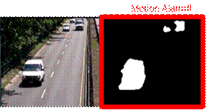
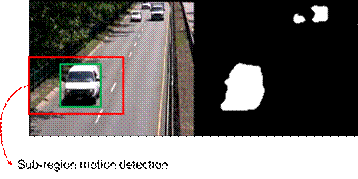
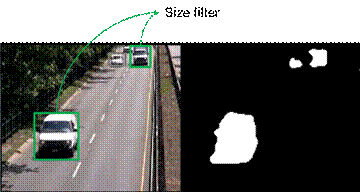
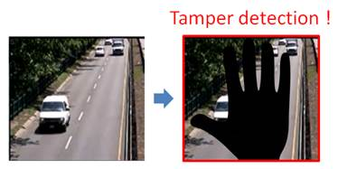
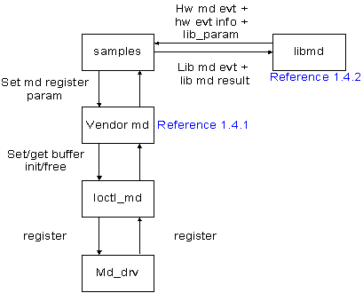

NT9833X MD User  Guide

1 Introduction
--------------

### 1.1 Overview

The motion detection supports applications including global motion detection, sub-region motion detection, motion object detection and tamper detection.

l **Global motion detection**

By using a fixed camera, global motion detection issues alarm if the area of moving objects is larger than the user-defined threshold.

Figure 1? Global motion detection

l **Sub-region motion detection**

By using a fixed camera, this function issues a sub-region  motion alarm if the area of moving objects in the user-defined regions is larger than the user-defined threshold.

 

Figure 2? Sub-region motion alarm

l **Motion objects detection**

By using a fixed camera, it detects moving objects if their areas are larger than a user-defined threshold.? It also reports the sizes and coordinates of detected moving objects.

 

Figure 3? Motion objects detection

l **Tamper detection**

By using a fixed camera, it issues a tamper alarm if the occlusion area is larger than a user-defined area threshold.

Figure 4: Tamper Detection

  

### 1.2 Motion detection steps

The steps of motion  detection functions are

Step. 1: Generating a initial background model by using the first few frames.

Step. 2: Micro block (MB) map is used in motion detection. The size of each MB can be 32x32 or 16x16. The algorithm determines a MB as a motion block if the variance of blocks  is higher than a predefined threshold.

Step. 3: Updating the background model by using current frame information.

Figure 5. The flowchart of MD algoritm

  

### 1.3 Process Flow

Figure 6. The process flow of MD

### 1.4 Parameters

MD has two major parameter types, as listed below

l The parameters of vendor MD are used to control MD hardware.

l The parameters of libmd are used to control MD software application.

l Please notice that the parameters of vendor MD should be set before setting the parameters of libmd.

#### 1.4.1 Parameters of vendor MD

l VENDOR\_MD\_CTRL: trigger setting of MD hardware

|     |     |     |     |
| --- | --- | --- | --- |
| Parameter | Range | Comment | Value |
| engine_enabled | 0, 1 | HW trigger setting | 0: close  1: open |

l VENDOR\_MD\_MDT_INFO: size information of MD hardware

|     |     |     |     |
| --- | --- | --- | --- |
| Parameter | Range | Comment | Value |
| phy_width | 32~3840 | Sensor resolution (width) | --  |
| phy_height | 16~2160 | Sensor resolution (height) | --  |
| phy\_mb\_x_size | 16, 32 | The x-size of micro-block (MB) for HW | Set 32 when the phy_height is bigger than 1088.  Set 16 when the phy_height is smaller than or equal to 1088. |
| phy\_mb\_y_size | 16, 32 | The y-size of MB for HW | Same value of phy\_mb\_x_size. |
| phy\_mb\_x_num |     | The number of MB in the MB-map at x-direction | phy_width/ phy\_mb\_x_size |
| phy\_mb\_y_num |     | The number of MB in the MB-map at y-direction | phy_height/ phy\_mb\_y_size |

l VENDOR\_MD\_MDT\_PARAM\_IDX: index of MD background model parameters

|     |     |
| --- | --- |
| id  | Comment |
| VENDOR\_MD\_MDT\_PARAM\_RST | Background model reset |
| VENDOR\_MD\_MDT\_PARAM\_TYPE | The method to construct background model |
| VENDOR\_MD\_MDT\_PARAM\_TIME_PERIOD | update time of background model  (only for MD2) |
| VENDOR\_MD\_MDT\_PARAM\_TBG | Weight threshold of background model |
| VENDOR\_MD\_MDT\_PARAM\_LVL_ALPHA | Learning rate for the fitting background model |
| VENDOR\_MD\_MDT\_PARAM\_LVL\_ONE\_MIN_ALPHA | Learning rate for the nun-fitting background model |
| VENDOR\_MD\_MDT\_PARAM\_LVL\_INIT\_WEIGHT | Initial weight of background model |
| VENDOR\_MD\_MDT\_PARAM\_LVL\_MODEL\_UPDATE | Update constraint of background model |
| VENDOR\_MD\_MDT\_PARAM\_LVL_TB | Threshold of foreground detection |
| VENDOR\_MD\_MDT\_PARAM\_LVL_SIGMA | Variance threshold of background model |
| VENDOR\_MD\_MDT\_PARAM\_LVL_TG | Threshold of background model update |
| VENDOR\_MD\_MDT\_PARAM\_LVL_PRUNE | Threshold to decrease weight for nun-fitting background model |
| VENDOR\_MD\_MDT\_PARAM\_LVL\_LUMA\_DIFF_THRES | Luminance variance threshold at refine stage (only for MD1) |
| VENDOR\_MD\_MDT\_PARAM\_LVL\_TEXT\_DIFF_THRES | Texture variance threshold at refine stage  (only for MD1) |
| VENDOR\_MD\_MDT\_PARAM\_LVL\_TEXT\_THRES | Texture strength threshold at refine stage  (only for MD1) |
| VENDOR\_MD\_MDT\_PARAM\_LVL\_TEXT\_RATIO_THRES | Texture coverage ratio threshold at refine stage (only for MD1) |
| VENDOR\_MD\_MDT\_PARAM\_LVL\_GM\_MD2_THRES | Background threshold  (only for MD2) |

l VENDOR\_MD\_MDT_PARAM: parameters of MD background model

|     |     |
| --- | --- |
| Parameter | Comment |
| out_id | Path id |
| level | Choose the selective model |
| id  | VENDOR\_MD\_MDT\_PARAM\_IDX |
| value | Parameter value |

l Value range of the VENDOR\_MD\_MDT_PARAM

|     |     |     |     |
| --- | --- | --- | --- |
| VENDOR\_MD\_MDT\_PARAM\_IDX | Range | Comment | Value |
| VENDOR\_MD\_MDT\_PARAM\_RST | 0, 1 | Reset MD background model | 0: no reset  1: reset |
| VENDOR\_MD\_MDT\_PARAM\_TYPE | 0, 1 | MD method type | 0: MD1 (HW)  (learning-based)  1: MD2 (HW) difference-based) |
| VENDOR\_MD\_MDT\_PARAM\_TIME_PERIOD | -   | Background update frame threshold  (only for MD2) | 10  |
| VENDOR\_MD\_MDT\_PARAM\_TBG | 1~32767 | Background model weight threshold  **Suggest not to modify the value.** | 29490 |
| VENDOR\_MD\_MDT\_PARAM\_LVL_ALPHA | 1~32767 | Background learning rate threshold when input fits model. Please set higher value when AE change obviously to avoid false alarm. | 32  |
| VENDOR\_MD\_MDT\_PARAM\_LVL\_ONE\_MIN_ALPHA | 1~32767 | Background learning rate threshold when input doesn’t fit model. | 32736 |
| VENDOR\_MD\_MDT\_PARAM\_LVL\_INIT\_WEIGHT | 1~32767 | Background model initial weight | 32  |
| VENDOR\_MD\_MDT\_PARAM\_LVL\_MODEL\_UPDATE | 0, 1 | Background model constraint update  **Suggest not to modify the value.** | 0   |
| VENDOR\_MD\_MDT\_PARAM\_LVL_TB | 1~31 | Background model fitting threshold. The MD is more sensitive when the value is lower. | 25  |
| VENDOR\_MD\_MDT\_PARAM\_LVL_SIGMA | 1~31 | Background model variance threshold. Set larger value to avoid false alarm when background luminance changes large. Please set the value lower when the MD result of detected object is broken. | 25  |
| VENDOR\_MD\_MDT\_PARAM\_LVL_TG | 1~31 | Background model count threshold.  **Suggest not to modify the value.** | 9   |
| VENDOR\_MD\_MDT\_PARAM\_LVL_PRUNE | 1~32767 | Weight decrease threshold for un-fitting model | 51  |
| VENDOR\_MD\_MDT\_PARAM\_LVL\_LUMA\_DIFF_THRES | 0~255 | Luminance variance threshold at refine stage (only for MD1) | 0   |
| VENDOR\_MD\_MDT\_PARAM\_LVL\_TEXT\_DIFF_THRES | 0~255 | Texture variance threshold at refine stage (only for MD1) | 0   |
| VENDOR\_MD\_MDT\_PARAM\_LVL\_TEXT\_THRES | 0~255 | Texture strength threshold at refine stage (only for MD1) | 0   |
| VENDOR\_MD\_MDT\_PARAM\_LVL\_TEXT\_RATIO_THRES | 0~127 | Texture coverage ratio threshold at refine stage (only for MD1) | 127 |
| VENDOR\_MD\_MDT\_PARAM\_LVL\_GM\_MD2_THRES | 0~255 | Background threshold (only for MD2) | 10  |

l VENDOR\_MD\_MDT\_MB\_LEVEL: region setting of the background model

|     |     |     |
| --- | --- | --- |
| Parameter | Range | Comment |
| x   | 0~max_width | x position of the left upper corner of the region (physical plane, Unit: pixel) |
| y   | 0~max_height | y position of the left upper corner of the region (physical plane, Unit: pixel) |
| width | 1~max_width | width of the left upper corner of the region (physical plane, Unit: pixel) |
| height | 1~max_height | height of the left upper corner of the region (physical plane, Unit: pixel) |
| level | 0~3 | The selective background model of the region |

l VENDOR\_MD\_TDT\_PARAM\_IDX: index of the tamper detection parameters

|     |     |
| --- | --- |
| id  | Comment |
| VENDOR\_MD\_TDT\_PARAM\_TYPE | Tamper detection method type |
| VENDOR\_MD\_TDT\_PARAM\_EDGE\_TEX\_THRES | Texture strength threshold |
| VENDOR\_MD\_TDT\_PARAM\_EDGE\_WIN\_THRES | Coverage of low texture strength threshold |
| VENDOR\_MD\_TDT\_PARAM\_AVG\_TEX\_THRES | Luminance strength threshold |
| VENDOR\_MD\_TDT\_PARAM\_AVG\_WIN\_THRES | Coverage of low luminance strength threshold |

l VENDOR\_MD\_MDT_PARAM: tamper detection parameters

|     |     |
| --- | --- |
| Parameter | Comment |
| out_id | Path id |
| id  | VENDOR\_MD\_TDT\_PARAM\_IDX |
| value | Parameter value |

l Value range of the tamper detection parameters

|     |     |     |     |
| --- | --- | --- | --- |
| VENDOR\_MD\_TDT\_PARAM\_IDX | Range | Comment | Default |
| VENDOR\_MD\_TDT\_PARAM\_TYPE | 0, 1 | Tamper detection method | 0: edge-based  1: intensity based |
| VENDOR\_MD\_TDT\_PARAM\_EDGE\_TEX\_THRES | 0~255 | Texture strength threshold | 25  |
| VENDOR\_MD\_TDT\_PARAM\_EDGE\_WIN\_THRES | 0~127 | Coverage of low texture strength threshold | 100 |
| VENDOR\_MD\_TDT\_PARAM\_AVG\_TEX\_THRES | 0~255 | Luminance strength threshold | 65  |
| VENDOR\_MD\_TDT\_PARAM\_AVG\_WIN\_THRES | 0~127 | Coverage of low luminance strength threshold | 100 |

l VENDOR_BUFFER : buffer information structure

|     |     |
| --- | --- |
| Parameter | Comment |
| paddr | Physical address |
| size | Buffer size |
| ddr_id | DDR_IDX |

l VENDOR\_MD\_BUFFER: buffer information of MD hardware

|     |     |
| --- | --- |
| Parameter | Comment |
| mb\_x\_num_max | Maximum width of the MB number(Unit: MB number) |
| mb\_y\_num_max | Maximum height of the MB number(Unit: MB number) |
| sta | MD HW statistics value buffer |
| event | MD HWmotion bitmap buffer |
| level | MD HW selective background model buffer |

l VENDOR\_MD\_PARAM\_ID: index of vendor\_md function

|     |     |
| --- | --- |
| id  | Comment |
| VENDOR\_MD\_CTRL_PARAM | MD HW control structure |
| VENDOR\_MD\_MOTION\_DETECT\_INFO | MD HW process size unit structure |
| VENDOR\_MD\_MOTION\_DETECT\_PARAM | MD HW background model parameter structure |
| VENDOR\_MD\_MOTION\_DETECT\_MB_LEVEL | MD HW background model selective model structure |
| VENDOR\_MD\_MOTION\_DETECT\_BUFFER | MD HW buffer structure |
| VENDOR\_MD\_TAMPER\_DETECT\_PARAM | MD HW tamper parameter structure |
| VENDOR\_MD\_RESULT_INFO | MD HW result structure |
| VENDOR\_MD\_REASSIGN_BUFFERS | MD reassign buffer API. When max MB num is larger than (1920/16, 1080/16) or want to shrink MD buffer size. Note: hdal default pool buffer size for MD is (120,67) and 8 channel. If you use reassign buffer, you should change the hdal default pool buffer size. |

#### 1.4.2 Parameters of libmd

l LIB\_MD\_AP_ENABLE: trigger setting of MD application:?

|     |     |     |
| --- | --- | --- |
| Parameter | Range | Comment |
| globel\_md\_alarm\_detect\_en | 0, 1 | Global motion alarm enable |
| subregion\_md\_alarm\_detect\_en | 0, 1 | Sub-region motion alarm enable |
| md\_obj\_detect_en | 0, 1 | Objects detection enable |
| md\_postprocess\_en | 0, 1 | Motionbitmap postprocess enable |

l LIB\_MD\_EVT_INFO: results of motion detection

|     |     |
| --- | --- |
| Parameter | Comment |
| p\_evt\_map | MD HW event bimap buffer |
| evt_sz | MD HW event bimap buffer size |
| timestamp | MD event timestamp |

l LIB\_MD\_MDT_INFO: size setting information of libmd

|     |     |     |     |
| --- | --- | --- | --- |
| Parameter | Range | Comment | Default |
| md_enabled | 0, 1 | Libmd enable | vendor_md engine_enabled should be enable firstly |
| vp_width | 1~3840 | User plane width | suggest to set as sensor setting |
| vp_height | 1~2160 | User plane height | suggest to set as sensor setting |
| vp\_mb\_x_size | 16, 32 | Width of MB size in the user plane | suggest to set the same value of phy\_mb\_x_size |
| vp\_mb\_y_size | 16, 32 | Height of MB size in the user plane | suggest to set the same value of phy\_mb\_y_size |
| vp\_mb\_x_num | -   | Width of MB number in the user plane | vp\_width / vp\_mb\_x\_size |
| vp\_mb\_y_num | -   | Height of MB number in the user plane | vp\_height / vp\_mb\_y\_size |
| phy\_mb\_x_size | 16, 32 | HW width of MB size | set the same as vendor_md |
| phy\_mb\_y_size | 16, 32 | HW height of MB size | set the same as vendor_md |
| phy\_mb\_x_num |     | Sensor_width/ phy\_mb\_x_size | set the same as vendor_md |
| phy\_mb\_y_num |     | Sensor_height/ phy\_mb\_y_size | set the same as vendor_md |

l LIB\_MD\_AP_POSTPROCESS: post-process type of libmd event

|     |     |     |     |
| --- | --- | --- | --- |
| Parameter | Range | Comment | Default |
| evt\_postprocess\_type | 0~7 | Motion event postprocess | 0: no  1: one erosion + two dilation  2: two dilation + one erosion  3: two dilation  4: one dilation  5: one erosion  6: one dilation + one erosion  7: one erosion + one dilation |

l LIB\_MD\_AP\_GLOBAL\_MOTION_ALARM: parameters of global motion alarm detection

|     |     |     |
| --- | --- | --- |
| Parameter | Range | Comment |
| motion\_alarm\_th | 0~100 | Global motion detection alarm area coverage ratio threshold (%).  MD is more sensitive when the value is lower. |
| ref\_cell\_en | 0, 1 | The detection result will reference p\_cell\_map or not. When the value is 1, the global motion alarm/ sub-region motion alarm/ object detection result will reference the p\_cell\_map. |
| p\_cell\_map | 0, 1 | The detection result will reference the buffer when the ref\_cell\_en=1. |
| cell\_map\_sz | vp\_mb\_x\_num* vp\_mb\_y\_num | The buffer size of the p\_cell\_map |

l LIB\_MD\_AP_SUBREGION: parameters of specified sub-region structure

|     |     |     |
| --- | --- | --- |
| Parameter | Range | Comment |
| enabled | 0, 1 | Sub-region motion detection alarm enable |
| x_start | 0~mb\_w\_num-1 | x position of the left upper corner of the region (virtual plane，Unit: macro block) |
| y_start | 0~mb\_h\_num-1 | y position of the left upper corner of the region (virtual plane，Unit: macro block) |
| x_end | 0~mb\_w\_num-1 | x position of the right under corner of the region (virtual plane，Unit: macro block) |
| y_end | 0~mb\_h\_num-1 | y position of the right under corner of the region (virtual plane，Unit: macro block) |
| alarm_th | 0~100 | Sub-region motion detection alarm area coverage ratio threshold (%).  MD is more sensitive when the value is lower. |

l LIB\_MD\_AP\_SUBREGION\_MOTION_ALARM: parameters of sub-region motion alarm detection

|     |     |     |
| --- | --- | --- |
| Parameter | Range | Comment |
| sub\_region\_num | 0~4 | Specified sub-region number |
| sub_region | -   | Specified sub-region structure |

l LIB\_MD\_AP_OBJ: size setting of minmum motion object

|     |     |     |
| --- | --- | --- |
| Parameter | Range | Comment |
| object_size | -   | Minimum size of detected moing objects (Unit: macro block) |

l LIB\_MD\_AP\_OBJ\_INFO: information of motion objects

|     |     |     |
| --- | --- | --- |
| Parameter | Range | Comment |
| start_x | 0~ vp_width | x position of the left upper corner of the motion object (virtual plane，Unit:pixel) |
| start_y | 0~vp_height | y position of the left upper corner of the motion object (virtual plane，Unit:pixel) |
| end_x | 0~ vp_width | x position of the right under corner of the motion object (virtual plane，Unit: macro block) |
| end_y | 0~vp_height | y position of the right under corner of the motion object (virtual plane，Unit: macro block) |
| label | 0~128 | Motion obect index |

l LIB\_MD\_MDT\_RESULT\_INFO: results information of the libmd

|     |     |     |     |
| --- | --- | --- | --- |
| Parameter | Range | Comment | Value |
| global\_motion\_alarm | 0, 1 | Global motion detection alarm | 0: no alarm  1: alarm |
| global\_motion\_alarm_num | 0~ vp\_mb\_x_num* vp\_mb\_y_num | Motion MB number |     |
| sub\_motion\_alarm | 0, 1 | Sub-region motion detection alarm | 0: no alarm  1: alarm |
| obj_num | 0~128 | Motion object number |     |
| obj | -   | Motion object structure |     |
| vp\_evt\_info | -   | Motion detection event map in the user plane |     |

l LIB\_MD\_PARAM_ID: index of libmd function

|     |     |
| --- | --- |
| Parameter | Comment |
| LIB\_MD\_MOTION\_DETECT\_INFO | Libmd set virtual/physical plane evt bitmap addr. Physical plane should be set the same as vendor\_md. Physical evt bitmap address is vendor\_md output result motion bitmap address. |
| evt bitmap addr為vendor_md output result | Libmd all detection application enable port |
| LIB\_MD\_AP\_ENABLE\_PARAM | Libmd postprocess enable |
| LIB\_MD\_AP\_POSTPROCESS\_PARAM | Libmd global motion detection enable |
| LIB\_MD\_AP\_GLOBAL\_MOTION\_ALARM\_PARAM | Libmd sub-region motion detection enable |
| LIB\_MD\_AP\_SUBREGION\_MOTION\_ALARM\_PARAM | Libmd motion object detection enable |
| LIB\_MD\_AP\_OBJ\_PARAM | Libmd result information |

**Note:** The MD model can lean the stable change of scene, such as river or twinkle light. If the user want to detect this kind of events, the parameters can be set as following:

l Model parameters

o tg=3

o tb=19

o alpha = 1024

l Refine process

o lum\_diff\_th=75

o tex\_diff\_th=50

o tex\_ratio\_th=50

### 1.5 Initilization of MD

l Vendor MD

The buffer of vender MD and HW internal parametesrs should be set by the API as following:

**_HD\_RESULT md\_init(void)_****_;_**

l Libmd

The buffer of libmd and software parametesrs should be set by the API as following:

**_HD_RESULT_** **_motion\_set\_ap_param(UINT32 path_id)_****_;_**

**_HD_RESULT_** **_lib\_md\_init(HD\_PATH\_ID path_id);_** // libmd buffer setting shoule be set after HW MD size setting which set through motion\_set\_ap_param.

### 1.6 Parameters Setting of MD

l Vendor MD

Vendor MD parameters should be set by the following API.

**_ret = vendor\_md\_set(video\_cap\[ch\], VENDOR\_MD\_CTRL\_PARAM, &md_cfg);_**

The content of **VENDOR\_MD\_PARAM_ID** is list in the section1.4.1.

l Libmd

The parameters of libmd should be set by the following API.

**_ret = lib\_md\_set(path\_id, LIB\_MD\_AP\_ENABLE\_PARAM, &mdt\_lib\_param\[idx\].mdt\_enable);_**

The content of **LIB\_MD\_PARAM_ID** is list in the section1.4.2.

### 1.7 Execution of MD

#### 1.7.1 vendor MD

Vendor MD application should be set by the following API.

// buffer and parameters intial setting

HD\_RESULT md\_init(void);

// create md_thread

static void \*md_thread(void \*arg);

//set and get vendor md API

ret = vendor\_md\_get(path\_id, VENDOR\_MD\_MOTION\_DETECT\_INFO, &mdt\_info);

ret = vendor\_md\_set(path\_id, VENDOR\_MD\_RESULT\_INFO, &result_info);

ret = vendor\_md\_get(path\_id, VENDOR\_MD\_RESULT\_INFO, &result_info);

#### 1.7.2 libmd

libmd application should be set by the following API.

// buffer and parameters intial setting

HD\_RESULT motion\_set\_ap\_param(UINT32 path_id);

HD\_RESULT lib\_md\_init(HD\_PATH\_ID path\_id);

// create md_thread

static void \*md_thread(void \*arg);

//set and get libmd API

ret = vendor\_md\_get(path\_id, VENDOR\_MD\_RESULT\_INFO, &result_info); **//libmd process should use vendor_md result as input**

vendor\_md\_get(path\_id, VENDOR\_MD\_RESULT\_INFO, &result_info)

ret = lib\_md\_set(path\_id, LIB\_MD\_MOTION\_DETECT\_INFO, &lib\_md_info);

ret = lib\_md\_get(path\_id, LIB\_MD\_RESULT\_INFO, &lib\_md\_rst);

### 1.8 Requirement of MD

l MD funtions only be applied by CPU and HW.

### 1.9 Limitation of MD

l MD shoud be used in the fixed-camera. If camera has been moved, MD function might output a false alarm event.

l MD function might output a false alarm event because of the zoom in/out of camera or the adjustment of auto white balance.

l The size of moving object should be larger than 1 micro-block (MB)

### 1.10 Test Flow of MD

l Check MD use in the fixed-camera scene

l Check MD event bitmap to check MD flow

l MD should be used after 3 frames to create initial background.  

2 Output
--------

### 2.1 Get Output Results of MD

l vendor MD

Vendor MD result should be set/got by the following API.

ret = vendor\_md\_set(path\_id, VENDOR\_MD\_RESULT\_INFO, &result_info);

ret = vendor\_md\_get(path\_id, VENDOR\_MD\_RESULT\_INFO, &result_info);

The structure of MD hardware result lists as following.

typedef struct \_VENDOR\_MD\_MDT\_RESULT_INFO {

UINT8???? ? *p\_evt\_map; ///< motion detection bitmap, size is evt_sz

UINT32????? evt_sz; ///< phy\_mb\_x\_num*phy\_mb\_y\_num MB

UINT8?????? tp_result; ///< tamper alarm

???? UINT32??? ? timestamp;

} VENDOR\_MD\_MDT\_RESULT\_INFO;

l libmd

libmd result should be set/got by the following API.

vendor\_md\_get(path\_id, VENDOR\_MD\_RESULT\_INFO, &result_info)

ret = lib\_md\_set(path\_id, LIB\_MD\_MOTION\_DETECT\_INFO, &lib\_md_info);

ret = lib\_md\_get(path\_id, LIB\_MD\_RESULT\_INFO, &lib\_md\_rst);

libmd result structure lists as following.

typedef struct \_LIB\_MD\_MDT\_RESULT_INFO {

UINT8???????? global\_motion\_alarm; ///< global motion alarm

???? UINT32??? ??? global\_motion\_alarm_num;?????? ???? ?????????///< global motion alarm num

UINT32??????? sub\_motion\_alarm\[LIB\_MD\_MAX\_SUB\_REGION_NUM\]; ///< sub-region motion alarm

UINT32??????? obj_num; ///< detect object number (max=128)

???? LIB\_MD\_AP\_OBJ\_INFO? obj\[LIB\_MD\_MAX\_OBJ\_NUM\];?????????? ????///< detect object info

???? LIB\_MD\_EVT\_INFO vp\_evt_info;

} LIB\_MD\_MDT\_RESULT\_INFO;

typedef struct \_LIB\_MD\_EVT\_INFO {

UINT8???? ?? *p\_evt\_map; ///< motion detection bitmap, size is evt_sz

UINT32?????? evt_sz; ///< mb\_x\_num*mb\_y\_num MB

???? UINT32??? ?? timestamp;

} LIB\_MD\_EVT_INFO;

typedef struct \_LIB\_MD\_AP\_OBJ_INFO {

UINT32??????? start_x; ///< obj rectangle left upper x position (virtual pixel)?

UINT32??????? start_y; ///< obj rectangle left upper y position (virtual pixel)?

UINT32??????? end_x; ///< obj rectangle right down x position (virtual pixel)?

UINT32??????? end_y; ///< obj rectangle right down y position (virtual pixel)?

UINT32??????? label; ///< obj label

} LIB\_MD\_AP\_OBJ\_INFO;

### 2.2 Print Output Results of MD

l Output Result of Global Motion Detection

UART will print the results as following when motion area in the whole scene is larger than user-defined threshold.

**_\>_** **_global motion alarm on ch_****_(specified channel)_****.**

l Output Result of Sub-region Motion Detection

UART will print the results as following when the motion area in one or more sub-regions is larger than user-defined threshold.

**_\>_** **_sub_region\[_****_specified region index_****_\] motion alarm on ch(_****_specified channel_****_)_****_._**

l Output Result of Motion Object Detection

UART will print the results as following when motion objects area are larger than minimum object user-defined threshold.

**_\> obj num:Motion object number_** **and _obj\[object index\]: start\_xy=\[left upper corner position of motion object\], end\_xy = \[right under corner position of motion object\], label = object label._**

l Output Result of Tamper Detection

UART will print the results as following when occlusion area is larger than user-defined threshold.

**_\>_** **_tamper_result:_****_1_** **_on ch_****_(specified channel)_****_._**

### 2.3 Limitation MD Hardware

l Maximum sensor resolution is 3840x2160.

l Maximum MB number of MD hardware are (mb\_x\_num, mb\_y\_num) = (256, 128) and minimum MB number of MD hardware are (mb\_x\_num, mb\_y\_num) = (2, 1).

l In the Vcap flow, MD doesn’t support the scale function.

### 2.4 Requirement of MD System

l The efficiency of MD function is associated with system loading. The ouput result of MD may be delayed when system is overloading.

### 2.5 Tuning of MD Parameters

l In the scene with the shortly changing of light, such as AE adjustment or turn-on and turn-off the light, please set the value of  _alpha_ higher. The side effect is that moving slowly object might be detected as background.

l Please set **_tb_**  to be higher for shadow. The side effect is that the detected forground of moving obeject might be broken. In this case, please also set “sigma” to be lower to fix the broken forground issue.

l The distance between moving object and camera should be farer than 30 cm. If the moving objects is too close to the camera, there might cause the false alarm of shadow.

l Please set lower **_tb_** when foreground luminance is similar background. However, the side effect is that the false alarm of shadow may be increase.

l Please see section 1.5 when you need to detect stable motion case.

l The MD function doesn’t support night view with IR-cut. In this case, there might be similar between background and foreground.

l There is no motion event when MD is creating intial background model. Also, MD will need longer time to create initial backgroung model if there are some moving objects in the initial scene.

l The size of moving object should be larger than 1 MB.

3 Q&A
-----

(1) How to check vendor MD version?

Ans:

echo md > /proc/hdal/flow

Execute AP

cat /proc/hdal/flow

(2) How to set the md sensitive?

Ans:

I. Use vendor\_md\_set API (the details describe in the 1.6 section and the section 1.4.1.

II. Tuning Guide document provide the tuning parameter suggestion. If any more question, please provide the video and parameters.

(3) How to solve sensor resolution change error?

Ans:

If you want to chage sensor reolution, please vendor\_md\_unint & vendor\_md\_int at fisrt and you might see liveview\_with\_md\_ctrl.c or liveview\_with\_md\_resolution.c

(4) How to check sensor interlace case?

Ans:

MD is field input. If input is interlace, please set the half of the sensor input height. You can see interlace case through command as following cat /proc/vcap316/vcap0/vg_info.

(5) Check AD mode (960H and 720) case

Ans:

I. Check AD output is full frame.

II. MD input size is the same as the AD output size. phy\_width andphy\_height should be calculate by AD output (might not be the size of sensor). The size setting check by /proc/vcap316/vcap0/vg_info?and vcap md (detal describe in question 6 ).

(6) If any setting question of the vendor\_md flow, please provide the log of vendor\_md flow by the following command.

Ans:

echo md > /proc/hdal/flow

Execute AP

cat /proc/hdal/flow

(7) How to check vcap md setting

Ans:

echo vcap_ch > /proc/vcap316/vcap0/vcap0.CHIP/md/event

(vcap\_ch and CHIP according to vg\_info)

cat /proc/vcap316/vcap0/vcap0. CHIP /md/region

cat /proc/vcap316/vcap0/vcap0. CHIP /md/param

(8) How to solve the mb num >(120,67)?

Ans:

I. modify hdal excel buffer size setting

II. open reassign_buffer

(9) How to use the level setting ?

Ans:

Each MB can be setted different level. Each level is mapping the set of background model. In nomal scene, all scene use the same level. In the scene which include both indoor and outdoor, you can set two level of the scene.

(10) Where is the tamper sample code?

Ans:

tamper sample code is liveview\_with\_md.c.

4 Revision History
------------------

|     |     |     |     |
| --- | --- | --- | --- |
| Revision | Date | Author | Changes |
| 0.1 | 2021/06/30 | Sophia | First formal version |
| 0.2 | 2021/07/02 | Sophia | Update document format and description |
| 0.3 | 2022/06/24 | Hunter | Modify the description of mb size and some wrong information. |