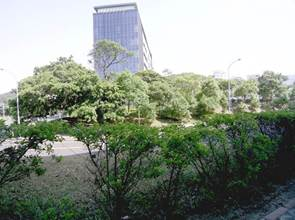
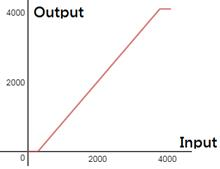
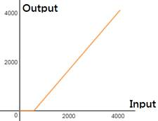
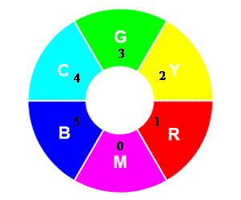
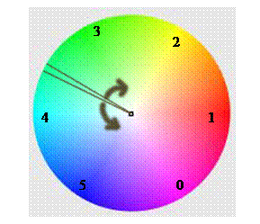
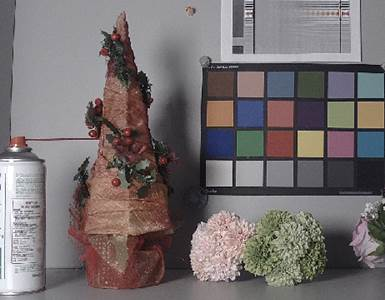
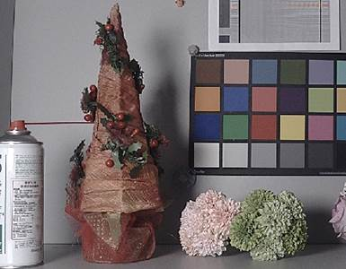

1 Overview
----------

LCD310 is the LCD controller of NT9833x. The following image processing modules are insided.

l Y Gamma

l YUV Adjustment

l Local Contrast Enhance

l Sharpen

2 IQ Tuning Guide
-----------------

### 2.1 Y Gamma

This feature is tone mapping and can be used to adjust the contrast, brightness and dynamic range of the image.

#### 2.1.1 Parameters

LCD310 Y Gamma divides the Y channel range from the darkest to the brightest and is equally divided into 16 blocks. Each block can be divided into up to 8 sub-blocks. The total number of all blocks must not exceed 32.

|     |     |     |     |
| --- | --- | --- | --- |
| **Parameter** | **Range** | **Def** | **Description** |
| **_gm_en_** | 0~1 | 1   | enable Y gamma |
| **_blk_idx\[16\]_** | 0~31 | 0   | Block first index |
| **_blk_split\[16\]_** | 0~3 | 0   | Block\[x\], Sub-block split  00 : no split.  01 : split to 2 sub-blocks  10 : split to 4 sub-blocks  11 : split to 8-blocks |
| **_Y_gm\[32\]_** | 0~4095 |     | Gamma table |

l **_gm_en:_** Y gamma enable/disable

l **_blk_idx:_** Sub-block index in each macro block. Corresponds to the index of the gamma table.

l **_blk_split:_** Each block is divided into sub-blocks.

**Ex. 1**：

Block0 is divided into 8 sub-block

Block1 is divided into 8 sub-block

Block2 is divided into 8 sub-block

Block3 is divided into 8 sub-block

Total Block no:

8 + 8 + 2 + 2 + 12(Block4~15)

= 32

The parameter settings are as follows：

blk_idx\[16\] = {0, 8, 16, 18, 20, 21, 22, 23, 24, 25, 26, 27, 28, 29, 30, 31};

blk_split\[16\] = {3, 3, 1, 1, 0, 0, 0, 0, 0, 0, 0, 0, 0, 0, 0, 0, 0};

Y_gm\[32\] = {32, 64, 96, 128, 160, 192, 224, 256, 288, 320, 352, 384, 416, 448, 480, 512, 640, 768, 896, 1024, 1280, 1536, 1792, 2048, 2304, 2560, 2816, 3072, 3328, 3584, 3840, 4095};

**Ex. 2**：

Block0 is divided into 4 sub-block

Block1 is divided into 4 sub-block

Block14 is divided into 4 sub-block

Block15 is divided into 4 sub-block

Total block no:

4 + 4 + 12(Block2~13) + 4 + 4

= 28 ?//※not necessary to equal to 32

The parameter settings are as follows：

blk_idx\[16\] = {0, 4, 8, 9, 10, 11, 12, 13, 14, 15, 16, 17, 18, 19, 20, 24};

blk_split\[16\] = {2, 2, 0, 0, 0, 0, 0, 0, 0, 0, 0, 0, 0, 0, 0, 2, 2};

Y_gm\[32\] = {64, 128, 192, 256,320, 384, 448, 512, 768, 1024, 1280, 1536, 1792, 2048, 2304, 2560, 2816, 3072, 3328, 3584, 3648, 3712, 3776, 3840, 3904, 3968, 4032, 4095, 4095, 4095, 4095, 4095}; ※The last for value will be dummy.

#### 2.1.2 Tuning Interface

###### Proc Command:

echo 0 1 0 "0x300,0x108,0x10a,0xc,0xd,0xe,0xf,0x10,0x11,0x12,0x13,0x14,0x15,0x116,0x218,0x21c" > ygamma

echo 0 1 1 "80,128,176,224,256,304,336,368,528,688,832,1008,1344,1680,2016,2336" > ygamma

echo 0 1 2 "2640,2912,3152,3376,3552,3712,3776,3840,3872,3904,3936,3968,4000,4032,4064,4080" > ygamma

### 2.2 YUV Adjustment

This function includes adjustments for brightness, contrast, hue, saturation, etc., as follows:

l Brightness:

n Setting Interface： proc

**Read :** cat /proc/flcd310/brightness

**Write:** echo &lt;plane 0&gt; &lt;brightness -127~127&gt; > brightness

|     |     |
| --- | --- |
| Parameter | Description |
| plane | Image plane. Fixed to be 0 (Video plane) |
| brightness | Brightness value. The larger value corressponds to brighter image. |

n Result：

|     |     |
| --- | --- |
| Brightness = 0 |  |
| Brightness = 25 |  |
| Brightness = -25 |  |

l Contrast: Map the image Y channel to adjust the image contrast.

n Setting Interface： /proc/flcd310/contrast

**Read:** cat /proc/flcd310/contrast

**Write:** echo &lt;plane 0~0&gt; &lt;contrast\_ratio 0~255&gt; &lt;contrast\_mode 0~2&gt; > /proc/flcd310/contrast

|     |     |
| --- | --- |
| Parameter | Description |
| plane | Image plane. Fixed to be 0 (Video plane) |
| contrast_ratio | Default = 128, The lager value corressponds to higher contrast. |
| contrast_mode | Mapping mode, explained as following: |

|     |     |     |
| --- | --- | --- |
| contrast_mode | mapping mode (contrast=150) | Feature |
| 0   |  | l No loss of shadow details, loss of highlight detail  l Overall brightness may increase. |
| 1   |  | l Dark details and highlight details are likely to be loss.  l Overall brightness will not be changed. |
| 2   |  | l No loss of detail in the highlights, details of the shadows and possible loss.  l The overall brightness may be dimmed. |

n Result：

|     |     |
| --- | --- |
| contrast = 170 |  |
| Contrast = 80 |  |

l Hue:

LCD310 divides the color picture into six blocks, which can adjust the hue and saturation for specific color blocks.

Index 0 ~ 5 respectively: Magenta, Red, Yellow, Green, Cyan, Blue.

n Setting Interface: ?/proc/flcd310/hue

**Read:** cat /proc/flcd310/hue

**Write:** echo &lt;plane 0~0&gt; &lt;hue_sat state 0/1&gt; &lt;hue0 -45~45&gt; &lt;hue1 -45~45&gt; &lt;hue2 -45~45&gt; &lt;hue3 -45~45&gt; &lt;hue4 -45~45&gt; &lt;hue5 -45~45&gt; > /proc/flcd310/hue

|     |     |
| --- | --- |
| Parameter | Description |
| plane | Image plane. Fixed to be 0 (Video plane) |
| hue_sat state | 1: enable, 0: diable hue saturation |
| hue0~5 | They are the rotation adjustment values of the following 6 large hue blocks. The preset value of 0 means no adjustment, and the positive/negative values are respectively inverse/clockwise rotation of the hue block.  Magenta, Red, Yellow, Green, Cyan, Blue |

l Saturation: Adjust the saturation of the picture.

LCD310 divides the color picture into six blocks, which can adjust the hue and saturation for specific color blocks.

Index 0 ~ 5 respectively: Magenta, Red, Yellow, Green, Cyan, Blue.

n Setting Interface： /proc/flcd310/hue_sat

**Read:** cat /proc/flcd310/hue_sat

**Write:** echo &lt;plane 0~0&gt; &lt;hue\_sat state 0/1&gt; &lt;hue\_sat0&gt; &lt;hue\_sat1&gt; &lt;hue\_sat2&gt; &lt;hue\_sat3&gt; &lt;hue\_sat4&gt; &lt;hue\_sat5&gt; > /proc/flcd310/hue\_sat

|     |     |
| --- | --- |
| Parameter | Description |
| plane | Image plane. Fixed to be 0 (Video plane) |
| hue_sat state | 1: enable, 0: diable hue saturation |
| hue_sat0~5 | The saturation adjustment values of the following six color. Set to 128 to indicate no adjustment. The larger the value, the higher the saturation.  Magenta, Red, Yellow, Green, Cyan, Blue |

n Result：

|     |     |
| --- | --- |
| hue_sat = 64 |  |
| hue_sat = 128 |  |
| hue_sat=164 |  |

### 2.3 Local Contrast Enhance

This feature enhances regional contrast.

Setting Interface： /proc/flcd310/ce

Read: cat /proc/flcd310/ce

Write: echo &lt;plane 0~0&gt; &lt;ce_state 0/1&gt; &lt;strength 0~1023&gt; > /proc/flcd310/ ce

|     |     |
| --- | --- |
| Parameter | Description |
| plane | Image plane. Fixed to be 0 (Video plane) |
| ce_state | 1: enable, 0: diable |
| strength | The strength of local contrast enhancement. |

n Result：

|     |     |
| --- | --- |
| strength = 0 |  |
| strength = 30 |  |

### 2.4 Sharpen

This function is an edge enhancement function that enhances the sharpness of the picture. Two-level sharpness enhancement core for reinforcement of thin and thick edges

n Setting Interface: /proc/flcd310/sharpness

**Read:** cat /proc/flcd310/sharpness

**Write:** echo &lt;plane 0&gt; &lt;enable 0/1&gt; &lt;hpf0\_5x5\_gain 0~1024&gt; &lt;hpf1\_5x5\_gain 0~1024&gt; > /proc/flcd310/sharpness

|     |     |
| --- | --- |
| Parameter | Description |
| plane | Image plane. Fixed to be 0 (Video plane) |
| enable | 1: enable, 0: diable |
| hpf0\_5x5\_gain | Enhance strength of thick edge. |
| hpf1\_5x5\_gain | Enhance strength of thin edge. |

n Result：

|     |     |
| --- | --- |
| Thin edge enhancement |  |
| Thick edge enhancement |  |

Revision Historys
-----------------

|     |     |     |     |
| --- | --- | --- | --- |
| **Revision** | **Date** | **Author** | **Changes** |
| 0.1.0 | 2021/01/20 | Allen Hsu | First version. |