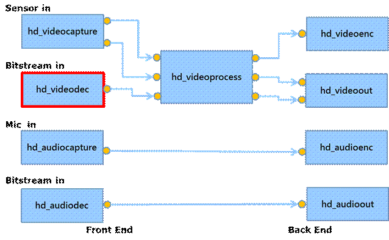
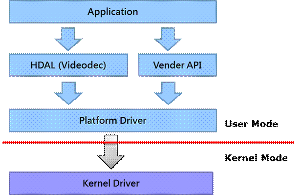
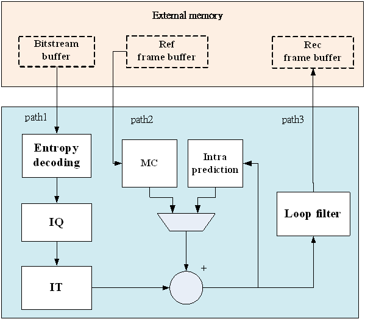
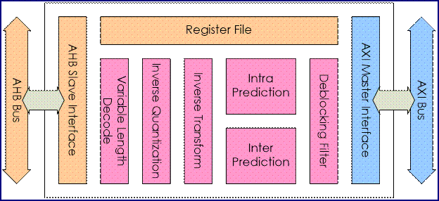
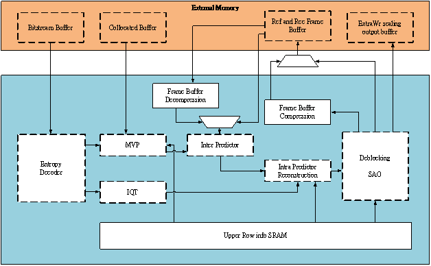
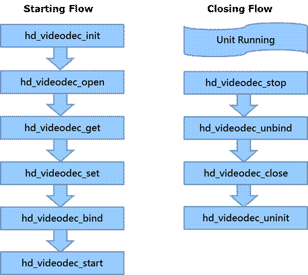
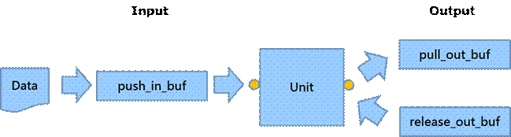
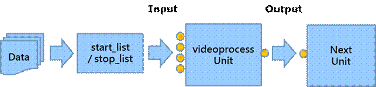

1 Introduction
--------------

The major purpose of hd_videodec is to get bitstream data from upper unit, and controls the video decoder to decode the bitstream data then return the YUV frame data which can be used for displaying. This document will talk about the red block in the following diagram. The device driver is not the main point in this document.

  

Module diagram is shown as below:

### 1.1 Block Diagram

#### 1.1.1 Block Diagram (NT9668X / NT9852X / NT9856X / NT98530)

The block diagram of H264/H265 codec is shown as below:

#### 1.1.2 Block Diagram (NT9831X / NT9832X / NT9833X / NT98331)

The block diagram of H264 codec is shown as below:

The block diagram of H265 codec is shown as below:

### 1.2 Basic Flow

The call sequence is needed to be done correctly for the unit. The standard starting flows of most modules are init, open, get, set and start. The standard closing flows of most modules are stop, unbind, close and uninit. The basic flow is shown as below.

Now, below section in this chapter is mainly about what things to do in those functions above.

### 1.3 Single Trigger Operation

Single trigger operation is used to trigger the unit to do one job, such as to grab one YUV frame from video capture; or encode one frame to bitstream by using video encoder. There are two types of functions for the input port and output port. The sequence for input port is new, push and release; the sequence for output port is pull and release. The flow is shown as below.

### 1.4 Multi List Operation

Multi list operation is used to send mulit bitstream simultaneously, it is very efficiency in the multi channels case. The flow is shown as below:

2 Functions Definition
----------------------

### 2.1 hd\_videodec\_init

\[Description\]

Initialize the unit

\[Syntax\]

HD\_RESULT hd\_videodec_init(VOID);

\[Parameter\]

|     |     |
| --- | --- |
| Value | Description |
| VOID | Not available |

\[Return Value\]

|     |     |
| --- | --- |
| Value | Description |
| HD_OK | Success |
| HD\_ERR\_NG | Failure |

### 2.2 hd\_videodec\_open

\[Description\]

Open the unit

\[Syntax\]

HD\_RESULT hd\_videodec\_open(HD\_IN\_ID in\_id, HD\_OUT\_ID out\_id, HD\_PATH\_ID* p\_path_id)

  

\[Parameter\]

|     |     |
| --- | --- |
| Value | Description |
| in_id | Id of input port. |
| out_id | Id of output port. |
| p\_path\_id | Pointer of the path id |

\[Return Value\]

|     |     |
| --- | --- |
| Value | Description |
| HD_OK | Success |
| HD\_ERR\_NG | Failure |

### 2.3 hd\_videodec\_get

\[Description\]

Get parameters from unit by path id

\[Syntax\]

HD\_RESULT hd\_videodec\_get(HD\_PATH\_ID path\_id, HD\_VIDEODEC\_PARAM\_ID id, VOID* p\_param)

\[Parameter\]

|     |     |
| --- | --- |
| Value | Description |
| path_id | The path id |
| id  | Id of parameters |
| p_param | Pointer of parameters |

\[Return Value\]

|     |     |
| --- | --- |
| Value | Description |
| HD_OK | Success |
| HD\_ERR\_NG | Failure |
| HD\_ERR\_NOT_SUPPORT | Not support this parameter |

### 2.4 hd\_videodec\_set

\[Description\]

Set parameters to unit by path id

\[Syntax\]

HD\_RESULT hd\_videodec\_set(HD\_PATH\_ID path\_id, HD\_VIDEODEC\_PARAM\_ID id, VOID* p\_param)

\[Parameter\]

|     |     |
| --- | --- |
| Value | Description |
| path_id | The path id |
| id  | Id of parameters |
| p_param | Pointer of parameters |

\[Return Value\]

|     |     |
| --- | --- |
| Value | Description |
| HD_OK | Success |
| HD\_ERR\_NG | Failure |
| HD\_ERR\_NOT_SUPPORT | Not support this parameter |

### 2.5 hd\_videodec\_bind

\[Description\]

Bind this unit with destination unit

\[Syntax\]

HD\_RESULT hd\_videodec\_bind(HD\_OUT\_ID out\_id, HD\_IN\_ID dest\_in\_id)

\[Parameter\]

|     |     |
| --- | --- |
| Value | Description |
| out_id | Id of output port. |
| dest\_in\_id | Id of the destination input port. |

\[Return Value\]

|     |     |
| --- | --- |
| Value | Description |
| HD_OK | Success |
| HD\_ERR\_NG | Failure |

### 2.6 hd\_videodec\_start

\[Description\]

Start the unit

\[Syntax\]

HD\_RESULT hd\_videodec\_start(HD\_PATH\_ID path\_id)

\[Parameter\]

|     |     |
| --- | --- |
| Value | Description |
| path_id | Pointer of the path id |

\[Return Value\]

|     |     |
| --- | --- |
| Value | Description |
| HD_OK | Success |
| HD\_ERR\_NG | Failure |

### 2.7 hd\_videodec\_stop

\[Description\]

Stop the unit

\[Syntax\]

HD\_RESULT hd\_videodec\_stop(HD\_PATH\_ID path\_id)

\[Parameter\]

|     |     |
| --- | --- |
| Value | Description |
| path_id | Pointer of the path id |

\[Return Value\]

|     |     |
| --- | --- |
| Value | Description |
| HD_OK | Success |
| HD\_ERR\_NG | Failure |

### 2.8 hd\_videodec\_unbind

\[Description\]

Unbind the unit

\[Syntax\]

HD\_RESULT hd\_videodec\_unbind (HD\_OUT\_ID out\_id)

\[Parameter\]

|     |     |
| --- | --- |
| Value | Description |
| out_id | Id of output port. |

\[Return Value\]

|     |     |
| --- | --- |
| Value | Description |
| HD_OK | Success |
| HD\_ERR\_NG | Failure |

### 2.9 hd\_videodec\_close

\[Description\]

Close the unit

\[Syntax\]

HD\_RESULT hd\_videodec\_close(HD\_PATH\_ID path\_id)

\[Parameter\]

|     |     |
| --- | --- |
| Value | Description |
| path_id | Pointer of the path id |

\[Return Value\]

|     |     |
| --- | --- |
| Value | Description |
| HD_OK | Success |
| HD\_ERR\_NG | Failure |

### 2.10 hd\_videodec\_uninit

\[Description\]

Uninitialize the unit

\[Syntax\]

HD\_RESULT hd\_videodec_uninit(VOID);

\[Parameter\]

|     |     |
| --- | --- |
| Value | Description |
| VOID | Not available |

\[Return Value\]

|     |     |
| --- | --- |
| Value | Description |
| HD_OK | Success |
| HD\_ERR\_NG | Failure |

### 2.11 hd\_videodec\_push\_in\_buf

\[Description\]

Push the video bitstream buffer to unit

\[Syntax\]

HD\_RESULT hd\_videodec\_push\_in\_buf(HD\_PATH\_ID path\_id, HD\_VIDEO\_BS* p\_in\_videodec\_bs, HD\_VIDEO\_FRAME* p\_user\_out\_video\_frame, INT32 wait\_ms);

\[Parameter\]

|     |     |
| --- | --- |
| Value | Description |
| path_id | The path id |
| p\_in\_videodec_bs | Pointer of the input bitstream buffer |
| p\_user\_out\_video\_frame | Pointer of the output frame buffer |
| wait_ms | Timeout value in microsecond |

\[Return Value\]

|     |     |
| --- | --- |
| Value | Description |
| HD_OK | Success |
| HD\_ERR\_NG | Failure |

### 2.12 hd\_videodec\_pull_out_buf

\[Description\]

Pull the video frame buffer from unit

\[Syntax\]

HD\_RESULT hd\_videodec\_pull\_out\_buf(HD\_PATH\_ID path\_id, HD\_VIDEO\_FRAME* p\_video\_frame, INT32 wait_ms);

\[Parameter\]

|     |     |
| --- | --- |
| Value | Description |
| path_id | The path id |
| p\_video\_frame | Pointer of the output frame buffer  \[Supplement\]  Only for \[NT9832X\]\[NT9833X\]\[NT98331\]  HD\_VIDEO\_FRAME* p\_video\_frame :: reserved\[\]  0: width of background dimension  1: height of background dimension |
| wait_ms | Timeout value in microsecond |

\[Return Value\]

|     |     |
| --- | --- |
| Value | Description |
| HD_OK | Success |
| HD\_ERR\_NG | General failure |
| HD\_ERR\_TIMEDOUT | Timeout occurred   (There is no decoded data in pull_out queue.) |
| HD\_ERR\_SYS | Operating system call failure |
| HD\_ERR\_FAIL | Decoding error occurred |

### 2.13 hd\_videodec\_release\_out\_buf

\[Description\]

Release the video frame buffer which is get from unit

\[Syntax\]

HD\_RESULT hd\_videodec\_release\_out\_buf(HD\_PATH\_ID path\_id, HD\_VIDEO\_FRAME* p\_video\_frame)

\[Parameter\]

|     |     |
| --- | --- |
| Value | Description |
| path_id | The path id |
| p\_video\_frame | Pointer of the output frame buffer |

\[Return Value\]

|     |     |
| --- | --- |
| Value | Description |
| HD_OK | Success |
| HD\_ERR\_NG | Failure |

### 2.14 hd\_videodec\_send_list

\[Description\]

Send(Push) multiple video bitstream buffers to each corresponding unit

\[Syntax\]

HD\_RESULT hd\_videodec\_send\_list(HD\_VIDEODEC\_SEND\_LIST *p\_videodec\_list, UINT32 num, INT32 wait\_ms);

\[Parameter\]

|     |     |
| --- | --- |
| Value | Description |
| p\_videodec\_list | Pointer of multiple bitstream buffers |
| num | Number of multiple bitstream buffers |
| wait_ms | Timeout value in microsecond |

\[Return Value\]

|     |     |
| --- | --- |
| Value | Description |
| HD_OK | Success |
| HD\_ERR\_NG | Failure |
| HD\_ERR\_PATH | Invalid path id |
| HD\_ERR\_TIMEDOUT | Timeout occured |

\[Difference\]

|     |     |
| --- | --- |
| Chip | Description |
| NT9668X  NT9852X  NT9856X  NT98530 | Not supported. |
| NT9831X  NT9832X  NT9833X  NT98331 | All functions are supported. |

### 2.15 hd\_videodec\_start_list

\[Description\]

Start multiple units to run

\[Syntax\]

HD\_RESULT hd\_videodec\_start\_list(HD\_PATH\_ID *path_id, UINT num);

\[Parameter\]

|     |     |
| --- | --- |
| Value | Description |
| path_id | The path id |
| num | Number of multiple units |

\[Return Value\]

|     |     |
| --- | --- |
| Value | Description |
| HD_OK | Success |
| HD\_ERR\_NG | Failure |

\[Difference\]

|     |     |
| --- | --- |
| Chip | Description |
| NT9668X  NT9852X  NT9856X  NT98530 | Not supported. |
| NT9831X  NT9832X  NT9833X  NT98331 | All functions are supported. |

### 2.16 hd\_videodec\_stop_list

\[Description\]

Stop multiple units running

\[Syntax\]

HD\_RESULT hd\_videodec\_stop\_list(HD\_PATH\_ID *path_id, UINT num);

  

\[Parameter\]

|     |     |
| --- | --- |
| Value | Description |
| path_id | The path id |
| num | Number of multiple units |

\[Return Value\]

|     |     |
| --- | --- |
| Value | Description |
| HD_OK | Success |
| HD\_ERR\_NG | Failure |

\[Difference\]

|     |     |
| --- | --- |
| Chip | Description |
| NT9668X  NT9852X  NT9856X  NT98530 | Not supported. |
| NT9831X  NT9832X  NT9833X  NT98331 | All functions are supported. |

3 Parameter IDs and Data Structures
-----------------------------------

### 3.1 Parameter IDs

The videodec provides the following parameter IDs:

l HD\_VIDEODEC\_PARAM_DEVCOUNT

o support get with ctrl path

o using HD_DEVCOUNT struct (device id max count)

l HD\_VIDEODEC\_PARAM_SYSCAPS

o support get with ctrl path

o using HD\_VIDEODEC\_SYSCAPS

l HD\_VIDEODEC\_PARAM\_PATH\_CONFIG

o support get/set with i/o path

o using HD\_VIDEODEC\_PATH_CONFIG

l HD\_VIDEODEC\_PARAM_STATUS

o support get/set with i/o path

o Using HD\_VIDEODEC\_STATUS

### 3.2 Data structure  definition

#### 3.2.1 HD\_VIDEODEC\_SYSCAPS

\[Description\]

Device capability.

\[Parameter\]

|     |     |
| --- | --- |
| Value | Description |
| dev_id | device id |
| chip_id | chip id of this device |
| max\_in\_count | max count of input of this device |
| max\_out\_count | max count of output of this device |
| dev_caps | capability of device, combine caps of HD\_DEVICE\_CAPS and HD\_VIDEODEC\_DEVCAPS |
| in_caps | capability of input, combine caps of HD\_VIDEO\_CAPS and HD\_VIDEODEC\_INCAPS |
| out_caps | capability of output, combine caps of HD\_VIDEO\_CAPS and HD\_VIDEODEC\_OUTCAPS |
| max_dim | max dimension of video decoder |
| max_bitrate | max bitrate of video decoder |

\[Difference\]

|     |     |
| --- | --- |
| Chip | Description |
| NT9668X  NT9852X  NT9856X  NT98530 | max\_in\_count = 16;  max\_out\_count = 16;  dev_caps =  ??????????????? HD\_CAPS\_PATHCONFIG;  in_caps\[0~16\] =  ??????????????? ?HD\_VIDEODEC\_CAPS_JPEG  ??????????????? ?\| HD\_VIDEODEC\_CAPS_H264  ??????????????? ?\| HD\_VIDEODEC\_CAPS_H265;  out_caps\[0~16\] =  ??????????????? ?HD\_VIDEO\_CAPS_YUV420  ??????????????? ?\| HD\_VIDEO\_CAPS_YUV422; |
| NT9831X  NT9832X  NT9833X  NT98331 | max\_in\_count = 128;  max\_out\_count = 128;  dev_caps =  ??????????????? HD\_CAPS\_LISTFUNC;  in_caps\[0~127\] =  ??????????????? ?HD\_VIDEODEC\_CAPS_JPEG  ??????????????? ?\| HD\_VIDEODEC\_CAPS_H264  ??????????????? ?\| HD\_VIDEODEC\_CAPS_H265;  out_caps\[0~127\] =  ??????????????? ?HD\_VIDEO\_CAPS_YUV420  ??????????????? ?\| HD\_VIDEO\_CAPS_YUV422; |

  

#### 3.2.2 HD_VIDEODEC_PATH_CONFIG

\[Description\]

Device configurations.

\[Parameter\]

|     |     |
| --- | --- |
| Value | Description |
| max_mem | maximum memory information,  see [HD\_VIDEODEC\_MAXMEM](#_HD_VIDEODEC_MAXMEM) |
| data_pool | pool memory information,  see [HD\_VIDEODEC\_POOL](#_HD_VIDEODEC_POOL) |

\[Difference\]

|     |     |
| --- | --- |
| Chip | Description |
| NT9668X  NT9852X  NT9856X  NT98530 | data_pool is not supported. |
| NT9831X  NT9832X  NT9833X  NT98331 | All parameters are supported. |

\[Apply Require\]

stop -> close -> open -> set -> start

#### 3.2.3 HD_VIDEODEC_MAXMEM

\[Description\]

Maximum memory allocation informations.

\[Parameter\]

|     |     |
| --- | --- |
| Value | Description |
| codec_type | Video codec type |
| dim | Video image dimension |
| frame_rate | Video frame rate |
| max_bitrate | Maximum bitrate support |
| bs_counts | Bitstream buffer counts |
| max\_ref\_num | Maximum reference number of video frame |
| ddr_id | The ddr id |
| max\_bs\_size | Maximum bitstream size (window size), 0 means AUTO calculating by system. |
| max\_multi\_slice_num | Maximum multiple slice number |
| reserved | Reserved for future using |

\[Difference\]

|     |     |
| --- | --- |
| Chip | Description |
| NT9668X  NT9852X  NT9856X | Only support codec_type and dim. |
| NT98530 | Only support codec\_type, dim and max\_ref_num. |
| NT9831X  NT9832X  NT9833X  NT98331 | All parameters are supported. |

\[Apply Require\]

stop -> close -> open -> set -> start

#### 3.2.4 HD_VIDEODEC_POOL

\[Description\]

Memory pool informations.

\[Parameter\]

|     |     |
| --- | --- |
| Value | Description |
| ddr_id | The ddr id |
| counts | Counts of buffer,  use HD\_VIDEODEC\_SET_COUNT to set.  (Take 30 fps as an example, a bit-stream is 1/30 of the playback time. The larger the setting, the longer the playback time that datain can cache.) |
| max_counts | Maximum counts of buffer,  use HD\_VIDEODEC\_SET_COUNT to set. |
| min_counts | Minimum counts of buffer,  use HD\_VIDEODEC\_SET_COUNT to set. |
| mode | Pool mode,  0: auto, 1: enable, 2: disable |

\[Apply Require\]

stop -> close -> open -> set -> start

\[Difference\]

|     |     |
| --- | --- |
| Chip | Description |
| NT9668X  NT9852X  NT9856X  NT98530 | Not supported. |
| NT9831X  NT9832X  NT9833X  NT98331 | All parameters are supported. |

#### 3.2.5 HD\_VIDEODEC\_USER_BS

\[Description\]

User video bitstream information

\[Parameter\]

|     |     |
| --- | --- |
| Value | Description |
| sign | Data signature,  use MAKEFOURCC('V','S','T','M') |
| p_next | Pointer to next meta |
| p\_bs\_buf | Pointer of bitstream buffer address pointer |
| bs\_buf\_size | Bitstream buffer size |
| retval | Reserved for future using |
| time_align | Playback timestamp alignment mode,  see HD\_VIDEODEC\_ALIGN |
| time_diff | Playback interval time (unit: microsecond) |
| timestamp | Decode bitstream timestamp to encode for transcode (unit: microsecond) |
| user_flag | User specific control flag,  use HD\_VIDEODEC\_FLAG_XXX definitions |
| reserved | Reserved for future using |

\[Difference\]

|     |     |
| --- | --- |
| Chip | Description |
| NT9668X  NT9852X  NT9856X  NT98530 | Not supported. |
| NT9831X  NT9832X  NT9833X  NT98331 | All parameters are supported. |

#### 3.2.6 HD\_VIDEODEC\_ALIGN

\[Description\]

Playback timestamp alignment information

\[State\]

|     |     |
| --- | --- |
| Value | Description |
| HD\_VIDEODEC\_TIME\_ALIGN\_ENABLE | (default) playback time align by LCD period (e.g. 60HZ should be 33333 us) |
| HD\_VIDEODEC\_TIME\_ALIGN\_DISABLE | Play timestamp by hd\_videodec\_send_list called |
| HD\_VIDEODEC\_TIME\_ALIGN\_USER | Start to play at previous play point + time_diff(us) |

\[Difference\]

|     |     |
| --- | --- |
| Chip | Description |
| NT9668X  NT9852X  NT9856X  NT98530 | Not supported. |
| NT9831X  NT9832X  NT9833X  NT98331 | All states are supported. |

#### 3.2.7 HD\_VIDEODEC\_STATUS

\[Description\]

Video decoder current status.

\[Parameter\]

|     |     |
| --- | --- |
| Value | Description |
| left_frames | Number of frames to be decoded. |
| reserved\_ref\_frame | Reserved reference frame when unbind unit.  **NOTE: Cannot be set when swtiching codec type.** |
| done_frames | Number of decoded frames |
| reserved\[0\] | Decode input available buffer counts.  Please refer to sample for usage,  playback\_with\_sync.c (code\\hdal\\samples\\media_flow) |
| reserved\[1~7\] | Reserved for future using. |

\[Difference\]

|     |     |
| --- | --- |
| Chip | Description |
| NT9668X  NT9852X  NT9856X  NT98530 | Not supported. |
| NT9831X  NT9832X  NT9833X  NT98331 | All states are supported. |

4 Trouble shooting
------------------

The videodec module supports two kinds of debug mechanism for user. User can use proc command or debug menu to debug.

### 4.1 Debug Menu (NT9668X / NT9852X / NT9856X / NT98530)

In application, call hd\_debug\_run_menu() to open the debug menu.

==============================

?HDAL

\-\-\-\-\-\-\-\-\-\-\-\-\-\-\-\-\-\-\-\-\-\-\-\-\-\-\-\-\-\-

?01 : AUDIOCAPTURE

?02 : AUDIOOUT

?03 : AUDIOENC

?04 : AUDIODEC

?05 : VIDEOCAPTURE

?06 : VIDEOOUT

?07 : VIDEOPROCESS

?08 : VIDEOENC

?09 : VIDEODEC

?10 : OSG

?11 : COMMON

?12 : UTIL

?13 : DEBUG

\-\-\-\-\-\-\-\-\-\-\-\-\-\-\-\-\-\-\-\-\-\-\-\-\-\-\-\-\-\-

?254 : Quit

?255 : Return

\-\-\-\-\-\-\-\-\-\-\-\-\-\-\-\-\-\-\-\-\-\-\-\-\-\-\-\-\-\-

Enter “9” to open VIDEODEC debug menu

==============================

VIDEODEC

\-\-\-\-\-\-\-\-\-\-\-\-\-\-\-\-\-\-\-\-\-\-\-\-\-\-\-\-\-\-

?01 : dump status

\-\-\-\-\-\-\-\-\-\-\-\-\-\-\-\-\-\-\-\-\-\-\-\-\-\-\-\-\-\-

?254 : Quit

?255 : Return

\-\-\-\-\-\-\-\-\-\-\-\-\-\-\-\-\-\-\-\-\-\-\-\-\-\-\-\-\-\-

Note: The items in the menu may vary for each chip.

#### 4.1.1 dump status

Enter “1” to show the status of videodec

Run: 01 : dump status

HDAL_VERSION: 00010001:00010001

\-\-\-\-\-\-\-\-\-\-\-\-\-\-\-\-\-\-\-\-\-\-\-\-\- VIDEODEC 0? PATH & BIND ------------------------------

in??? out?? state bind\_src????????????? bind\_dest

0???? 0???? START (null)??????????????? VIDEOPROC\_0\_IN_0

\-\-\-\-\-\-\-\-\-\-\-\-\-\-\-\-\-\-\-\-\-\-\-\-\- VIDEODEC 0? PATH CONFIG ------------------------------

in??? out?? max\_w max\_h? codec

0???? 0???? 640?? 480??? JPEG

\-\-\-\-\-\-\-\-\-\-\-\-\-\-\-\-\-\-\-\-\-\-\-\-\- VIDEODEC 0? IN FRAME ---------------------------------

in??? codec

0???? JPEG

As above, the debug menu shows the path & bind information, path_config , input frame / output bitstream information, more detail can see the table as below.

\[PATH & BIND\]

|     |     |     |
| --- | --- | --- |
| Status | Description | Value |
| In  | input id of path | 0 ~ \[max\_in\_count\] |
| out | output id of path | 0 ~ \[max\_out\_count\] |
| state | state of path | OFF/OPEN/START (default OFF) |
| bind_src | current binding source of input | bind: \[module\]_\[device\_id\]\_OUT_\[output_id\]  not-bind: (null) |
| bind_dest | current binding source of output | bind: \[module\]_\[device\_id\]\_IN_\[input_id\]  not-bind: (null) |

\[PATH CONFIG\]

|     |     |     |
| --- | --- | --- |
| Value | Description | Value |
| in  | input id of path | 0 ~ \[max\_in\_count\] |
| out | output id of path | 0 ~ \[max\_out\_count\] |
| max_w | maximum dimension width | 16 ~ 65532: user assign width  default 0 (n/a) |
| max_h | maximum dimension height | 16 ~ 65532: user assign height  default 0 (n/a) |

\[IN FRAME\]

|     |     |     |
| --- | --- | --- |
| Value | Description | Value |
| in  | input id | 0 ~ \[max\_in\_count\] |
| codec | current input video codec type | enum: user assign codec type  see HD\_VIDEO\_CODEC  default 0 (n/a) |

### 4.2 proc command (NT9668X / NT9852X / NT9856X / NT98530)

User can obtained debugging information from the proc file system of Linux.

#### 4.2.1 dump status

\[dump info\]

cat /proc/hdal/vdec/info

the result is exactly the same as [4.1.1 Dump status](#_dump_status)

Run: 01 : dump status

HDAL_VERSION: 00010001:00010001

\-\-\-\-\-\-\-\-\-\-\-\-\-\-\-\-\-\-\-\-\-\-\-\-\- VIDEODEC 0? PATH & BIND ------------------------------

in??? out?? state bind\_src????????????? bind\_dest

0???? 0???? START (null)??????????????? VIDEOPROC\_0\_IN_0

\-\-\-\-\-\-\-\-\-\-\-\-\-\-\-\-\-\-\-\-\-\-\-\-\- VIDEODEC 0? PATH CONFIG ------------------------------

in??? out?? max\_w max\_h? codec

0???? 0???? 640?? 480??? JPEG

\-\-\-\-\-\-\-\-\-\-\-\-\-\-\-\-\-\-\-\-\-\-\-\-\- VIDEODEC 0? IN FRAME ---------------------------------

in??? codec

0???? JPEG

#### 4.2.2 debug command

\[debug port\]

echo debug \[dev\] \[i/o\] \[mask\] \> /proc/hdal/adec/cmd

where \[dev\] = d0 , \[i/o\] = i0, i1, i2, ..., o0, o1, o2, ... , \[mask\] = show info mask

\[ Sample \]

echo debug d0 o0 mffff > /proc/hdal/vdec/cmd

this debug command can show more debug log on console

root@NVTEVM:/mnt/sd$ hd\_video\_playback 2

\[ 4183.595988\] hd_reset - begin

\[ 4183.601853\] hd_reset - end

HDAL_VERSION: 00010001:00010002

\[ 4183.657738\]

\[ 4183.657738\] hd: "vdodec".out\[0\]: open begin, state=0

\[ 4183.665326\] hd: "vdodec".out\[0\]: cmd OPEN

\[ 4183.678796\] hd: "vdodec".out\[0\]: open end, state=1

\[ 4183.685213\] hd: "vdodec".out\[0\]: set param(08000a05)=1

\[ 4183.708678\] hd: "vdodec".out\[0\]: set param(08000a00)=1

\[ 4183.716255\] hd: "vdodec".out\[0\]: set param(08000a00)=1

\[ 4183.722596\]

\[ 4183.722596\] hd: "vdodec".out\[0\]: bind begin, ("vdoprc0".in\[0\])

\[ 4183.732387\] hd: "vdodec".out\[0\]: cmd CONNECT

\[ 4183.737854\] hd: "vdodec".out\[0\]: cmd RDYSYNC

\[ 4183.748315\] hd: "vdodec".out\[0\]: bind end

\[ 4183.753391\]

\[ 4183.753391\] hd: "vdodec".out\[0\]: start begin, state=1

\[ 4183.761045\] hd: "vdodec".out\[0\]: cmd RDYSYNC

\[ 4183.771498\] hd: "vdodec".out\[0\]: cmd START

\[ 4183.782689\] hd: "vdodec".out\[0\]: start end, state=2

Enter q to exit

bs file: \[/mnt/sd/video\_bs\_640\_480\_jpeg.dat\]

bslen file: \[/mnt/sd/video\_bs\_640\_480\_jpeg.len\]

q

\[ 4188.409136\]

\[ 4188.409136\] hd: "vdodec".out\[0\]: stop begin, state=2

\[ 4188.416733\] hd: "vdodec".out\[0\]: cmd STOP

\[ 4188.429400\] hd: "vdodec".out\[0\]: stop end, state=1

\[ 4188.443260\]

\[ 4188.443260\] hd: "vdodec".out\[0\]: unbind begin, ("vdoprc0".in\[0\])

\[ 4188.451877\] hd: "vdodec".out\[0\]: cmd DISCONNECT

\[ 4188.457451\] hd: "vdodec".out\[0\]: unbind end

\[ 4188.462694\] hd: "vdodec".out\[0\]: set param(08000a05)=0

\[ 4188.468879\]

\[ 4188.468879\] hd: "vdodec".out\[0\]: close begin, state=1

\[ 4188.476533\] hd: "vdodec".out\[0\]: cmd CLOSE

\[ 4188.484832\] hd: "vdodec".out\[0\]: close end, state=0

#### 4.2.3 trace command

\[trace port\]

echo trace \[dev\] \[i/o\] \[mask\] \> /proc/hdal/adec/cmd

where \[dev\] = d0 , \[i/o\] = i0, i1, i2, ..., o0, o1, o2, ... , \[mask\] = show info mask

\[ Sample \]

echo trace d0 o0 mffff > /proc/hdal/vdec/cmd

this trace command could enable module internal debug message to know what’s going on for the VIDEODEC module.

#### 4.2.4 probe command

\[probe port\]

echo probe \[dev\] \[i/o\] \[mask\] \> /proc/hdal/adec/cmd

where \[dev\] = d0 , \[i/o\] = i0, i1, i2, ..., o0, o1, o2, ... , \[mask\] = show info mask

\[ Sample \]

echo probe d0 o0 mffff > /proc/hdal/vdec/cmd

this probe command could print per-data status

\[ 5310.074418\] hd: "vdodec".out\[0\] - NEW - new -- h=94001fc0 size=00070800 addr=94002000 OK

\[ 5310.085787\] hd: "vdodec".out\[0\] - PUSH - data -- h=94001fc0 t=000000013dd1c406 (YUV: 640x480.520c0420 94002000 9404d000 640 640)

\[ 5310.113972\] hd: "vdodec".out\[0\] - NEW - new -- h=9407afc0 size=00070800 addr=9407b000 OK

\[ 5310.125334\] hd: "vdodec".out\[0\] - PUSH - data -- h=9407afc0 t=000000013dd25e8e (YUV: 640x480.520c0420 9407b000 940c6000 640 640)

\[ 5310.153493\] hd: "vdodec".out\[0\] - NEW - new -- h=940f3fc0 size=00070800 addr=940f4000 OK

\[ 5310.164831\] hd: "vdodec".out\[0\] - PUSH - data -- h=940f3fc0 t=000000013dd2f8ef (YUV: 640x480.520c0420 940f4000 9413f000 640 640)

\[ 5310.192974\] hd: "vdodec".out\[0\] - NEW - new -- h=940f3fc0 size=00070800 addr=940f4000 OK

\[ 5310.204320\] hd: "vdodec".out\[0\] - PUSH - data -- h=940f3fc0 t=000000013dd39329 (YUV: 640x480.520c0420 940f4000 9413f000 640 640)

\[ 5310.232463\] hd: "vdodec".out\[0\] - NEW - new -- h=9407afc0 size=00070800 addr=9407b000 OK

\[ 5310.243803\] hd: "vdodec".out\[0\] - PUSH - data -- h=9407afc0 t=000000013dd42d6b (YUV: 640x480.520c0420 9407b000 940c6000 640 640)

\[ 5310.271956\] hd: "vdodec".out\[0\] - NEW - new -- h=94001fc0 size=00070800 addr=94002000 OK

\[ 5310.283296\] hd: "vdodec".out\[0\] - PUSH - data -- h=94001fc0 t=000000013dd4c7ac (YUV: 640x480.520c0420 94002000 9404d000 640 640)

#### 4.2.5 perf command

\[perf port\]

echo perf \[dev\] \[i/o\] \> /proc/hdal/adec/cmd

\[ Sample \]

echo perf d0 i0 > /proc/hdal/vdec/cmd

this perf command could print data count per second

\[ 5390.325791\] hd: "vdodec".in\[0\] - perf -- (VideoBs) 825 KByte/sec

\[ 5391.330332\] hd: "vdodec".in\[0\] - perf -- (VideoBs) 825 KByte/sec

\[ 5392.336753\] hd: "vdodec".in\[0\] - perf -- (VideoBs) 819 KByte/sec

\[ 5393.345119\] hd: "vdodec".in\[0\] - perf -- (VideoBs) 820 KByte/sec

#### 4.2.6 save command

\[save port\]

echo save \[dev\] \[i/o\] \[count\] > /proc/hdal/adec/cmd

where \[count\] means how many i/o datas to save

\[ Sample \]

echo save d0 i0 > /proc/hdal/vdec/cmd

this save command could save i/o data to SDCard for debug purpose.

\[ 5471.047725\] save i/o begin: "vdodec".in\[0\] count=1

\[ 5473.414755\] hd: "vdodec".in\[0\] - save -- h=9416dfc0 t=00000001478e2434 (VSTM: 1296e000 25874)

\[ 5473.443425\] hd: "vdodec".in\[0\] - save -- //mnt//sd//isf_? vdodec\_in\[0\]\_c0.bsv ok

\[ 5473.451859\] save port end

### 4.3 Proc Command (NT9631X / NT9832X / NT9833X / NT98331)

#### 4.3.1 dump setting

User can cat info file to dump module’s status.

\-\-\-\-\-\-\-\-\-\-\-\-\-\-\-\-\-\-\-\-\-\-\-\-\- VIDEODEC 0? PATH & BIND -----------------------------

in????? out???? state?? bind\_src??????????????? bind\_dest

0?????? 0?????? START?? -?????????????????????? VIDEOPROC\_4\_IN_0

0?????? 1?????? START?? -?????????????????????? VIDEOPROC\_5\_IN_0

0?????? 2?????? START?? -?????????????????????? VIDEOPROC\_6\_IN_0

0?????? 3?????? START?? -????????? ?????????????VIDEOPROC\_7\_IN_0

\-\-\-\-\-\-\-\-\-\-\-\-\-\-\-\-\-\-\-\-\-\-\-\-\- VIDEODEC 0? PATH POOL -----------------------------

out???? pool??? ddr\_id? count?? max\_count

0?????? 0?????? 0?????? 3.5???? 3.0

0?????? 1?????? 0?????? 3.5???? 3.0

1?????? 0?????? 0?????? 3.5???? 3.0

1?????? 1?????? 0?????? 3.5???? 3.0

2?????? 0?????? 0?????? 3.5???? 3.0

2?????? 1?????? 0?????? 3.5???? 3.0

3?????? 0?????? 0?????? 3.5???? 3.0

3?????? 1?????? 0?????? 3.5???? 3.0

\[PATH & BIND\]

|     |     |     |
| --- | --- | --- |
| Status | Description | Value |
| in  | input id of path | 0   |
| out | output id of path | 0 ~ \[max\_out\_count\] |
| state | state of path | OFF/OPEN/START (default OFF) |
| bind_src | current binding source of input | bind: \[module\]_\[device\_id\]\_OUT_\[output_id\]  not-bind: (null) |
| bind_dest | current binding source of output | bind: \[module\]_\[device\_id\]\_IN_\[input_id\]  not-bind: (null) |

### 4.4 Debug Menu  (NT9631X / NT9832X / NT9833X / NT98331)

#### 4.4.1 dump info

After enter debug menu, select 09 to enter this module’s sub-menu.

User can select 01 to dump module’s status shown as below.

\-\-\-\-\-\-\-\-\-\-\-\-\-\-\-\-\-\-\-\-\-\-\-\-\- VIDEODEC 0? PATH & BIND -----------------------------

in????? out???? state?? bind\_src??????????????? bind\_dest

0?????? 0?????? START?? -?????????????????????? VIDEOPROC\_4\_IN_0

0?????? 1?????? START?? -?????????????????????? VIDEOPROC\_5\_IN_0

0?????? 2?????? START?? -?????????????????????? VIDEOPROC\_6\_IN_0

0?????? 3?????? START?? -?????????????????????? VIDEOPROC\_7\_IN_0

\-\-\-\-\-\-\-\-\-\-\-\-\-\-\-\-\-\-\-\-\-\-\-\-\- VIDEODEC 0? PATH POOL -----------------------------

out???? pool??? ddr\_id? count?? max\_count

0?????? 0?????? 0?????? 3.5???? 3.0

0?????? 1?????? 0?????? 3.5???? 3.0

1?????? 0?????? 0?????? 3.5???? 3.0

1?????? 1?????? 0?????? 3.5???? 3.0

2?????? 0?????? 0?????? 3.5???? 3.0

2?????? 1?????? 0?????? 3.5???? 3.0

3?????? 0?????? 0?????? 3.5???? 3.0

3?????? 1?????? 0?????? 3.5?? ??3.0

5 Sample Codes
--------------

### 5.1 Video_playback

This sample code is used in NT9668X / NT9852X / NT9856X / NT98530. The **hd\_video\_playback** demonstrates how to use the single trigger operation to process the input image.

**/\* Allocate common buffer*/**

// config common pool (main)

mem\_cfg.pool\_info\[0\].type = HD\_COMMON\_MEM\_COMMON\_POOL;

mem\_cfg.pool\_info\[0\].blk\_size = DBGINFO\_BUFSIZE()+VDO\_YUV\_BUFSIZE(ALIGN\_CEIL\_64(VDO\_SIZE\_W), ALIGN\_CEIL\_64(VDO\_SIZE\_H), HD\_VIDEO\_PXLFMT_YUV420);? // align to 16 for rotate buffer

mem\_cfg.pool\_info\[0\].blk_cnt = 3;

mem\_cfg.pool\_info\[0\].ddr\_id = DDR\_ID0;

// config common pool for bs pushing in

mem\_cfg.pool\_info\[1\].type = HD\_COMMON\_MEM\_USER\_POOL_BEGIN;

mem\_cfg.pool\_info\[1\].blk\_size = BS\_BLK_SIZE;

mem\_cfg.pool\_info\[1\].blk_cnt = 1;

mem\_cfg.pool\_info\[1\].ddr\_id = DDR\_ID0;

ret = hd\_common\_mem\_init(&mem\_cfg);

**/\* Set dec path configuration */**

video\_path\_cfg.max\_mem.codec\_type = dec_type;

video\_path\_cfg.max\_mem.dim.w = p\_max_dim->w;

video\_path\_cfg.max\_mem.dim.h = p\_max_dim->h;

ret = hd\_videodec\_set(video\_dec\_path, HD\_VIDEODEC\_PARAM\_PATH\_CONFIG, &video\_path\_cfg);

if (ret != HD_OK) { return ret; }

**/\* Set dec parameter */**

video\_in\_param.codec\_type = dec\_type;

video\_in\_param.dim.w = p_dim->w;

video\_in\_param.dim.h = p_dim->h;

ret = hd\_videodec\_set(video\_dec\_path, HD\_VIDEODEC\_PARAM\_IN, &video\_in_param);

if (ret != HD_OK) { return ret; }

**/\* Set proc configuration */**

ret = hd\_videoproc\_open(0, HD\_VIDEOPROC\_0\_CTRL, &video\_proc_ctrl); //open this for device control

if (p\_max\_dim != NULL) {

video\_cfg\_param.pipe = HD\_VIDEOPROC\_PIPE_SCALE;

video\_cfg\_param.isp_id = 0;

video\_cfg\_param.ctrl_max.func = 0;

video\_cfg\_param.in_max.func = 0;

video\_cfg\_param.in\_max.dim.w = p\_max_dim->w;

video\_cfg\_param.in\_max.dim.h = p\_max_dim->h;

video\_cfg\_param.in\_max.pxlfmt = HD\_VIDEO\_PXLFMT\_YUV420;

video\_cfg\_param.in\_max.frc = HD\_VIDEO\_FRC\_RATIO(1,1);

ret = hd\_videoproc\_set(video\_proc\_ctrl, HD\_VIDEOPROC\_PARAM\_DEV\_CONFIG, &video\_cfg\_param);

???? if (ret != HD_OK) {

???????? return HD\_ERR\_NG;

???? }

}

video\_ctrl\_param.func = 0;

ret = hd\_videoproc\_set(video\_proc\_ctrl, HD\_VIDEOPROC\_PARAM\_CTRL, &video\_ctrl_param);

if (ret != HD_OK) { return ret;}

**/\* Set proc parameter */**

video\_out\_param.func = 0;

video\_out\_param.dim.w = p_dim->w;

video\_out\_param.dim.h = p_dim->h;

video\_out\_param.pxlfmt = HD\_VIDEO\_PXLFMT_YUV420;

video\_out\_param.dir = HD\_VIDEO\_DIR_NONE;

video\_out\_param.frc = HD\_VIDEO\_FRC_RATIO(1,1);

ret = hd\_videoproc\_set(video\_proc\_path, HD\_VIDEOPROC\_PARAM\_OUT, &video\_out_param);

if (ret != HD_OK) { return ret;}

**/\* Set out configuration */**

ret = hd\_videoout\_open(0, HD\_VIDEOOUT\_0\_CTRL, &video\_out_ctrl); //open this for device control

switch(out_type){

case 0:

???? videoout\_mode.output\_type = HD\_COMMON\_VIDEO\_OUT\_CVBS;

???? videoout\_mode.input\_dim = HD\_VIDEOOUT\_IN_AUTO;

???? videoout\_mode.output\_mode.cvbs= HD\_VIDEOOUT\_CVBS_NTSC;

break;

case 1:

???? videoout\_mode.output\_type = HD\_COMMON\_VIDEO\_OUT\_LCD;

???? videoout\_mode.input\_dim = HD\_VIDEOOUT\_IN_AUTO;

???? videoout\_mode.output\_mode.lcd = HD\_VIDEOOUT\_LCD_0;

break;

case 2:

???? videoout\_mode.output\_type = HD\_COMMON\_VIDEO\_OUT\_HDMI;

???? videoout\_mode.input\_dim = HD\_VIDEOOUT\_IN_AUTO;

???? videoout\_mode.output\_mode.hdmi= hdmi_id;

break;

default:

???? printf("not support out_type\\r\\n");

break;

}

ret = hd\_videoout\_set(video\_out\_ctrl, HD\_VIDEOOUT\_PARAM\_MODE, &videoout\_mode);

if (ret != HD_OK) { return ret;}

**/\* Set out parameter */**

video\_out\_param.dim.w = p_dim->w;

video\_out\_param.dim.h = p_dim->h;

video\_out\_param.pxlfmt = HD\_VIDEO\_PXLFMT_YUV420;

video\_out\_param.dir = HD\_VIDEO\_DIR_NONE;

ret = hd\_videoout\_set(video\_out\_path, HD\_VIDEOOUT\_PARAM\_IN, &video\_out_param);

if (ret != HD_OK) { return ret;}

memset((void *)&video\_out\_param,0,sizeof(HD\_VIDEOOUT\_IN));

ret = hd\_videoout\_get(video\_out\_path, HD\_VIDEOOUT\_PARAM\_IN, &video\_out_param);

if (ret != HD_OK) { return ret;}

**/\* Bind modules */**

hd\_videodec\_bind(HD\_VIDEODEC\_0\_OUT\_0, HD\_VIDEOPROC\_0\_IN\_0);

hd\_videoproc\_bind(HD\_VIDEOPROC\_0\_OUT\_0, HD\_VIDEOOUT\_0\_IN\_0);

**/\* start modules */**

hd\_videodec\_start(stream\[0\].dec_path);

hd\_videoproc\_start(stream\[0\].proc_path);

hd\_videoout\_start(stream\[0\].out_path);

**/\* Push in buffer */**

blk = hd\_common\_mem\_get\_block(HD\_COMMON\_MEM\_COMMON\_POOL, blk\_size, ddr\_id);

pa = hd\_common\_mem_blk2pa(blk);

va= hd\_common\_mem\_mmap(HD\_COMMON\_MEM\_MEM\_TYPE\_CACHE, pa, blk_size);

fread((void *)va, 1, length, bs_fd);

video\_bs.phy\_addr\[0\] = pa;

video_bs.size = length;

ret = hd\_videodec\_push\_in\_buf(p\_stream0->dec\_path, &video_bs, NULL, 0);

if (ret != HD_OK) { return ret; }

**/\* Release in buffer */**

hd\_common\_mem\_munmap((void *)va, blk\_size)

hd\_common\_mem\_release\_block(blk);

### 5.2 video_decode_only

This sample code is used in NT9668X / NT9852X / NT9856X / NT98530. The **hd\_videodec\_only** demonstrates how to use the single trigger operation to process the input image.

**/\* Allocate common buffer*/**

// config common pool (main)

mem\_cfg.pool\_info\[0\].type = HD\_COMMON\_MEM\_COMMON\_POOL;

mem\_cfg.pool\_info\[0\].blk\_size = DBGINFO\_BUFSIZE()+VDO\_YUV\_BUFSIZE(ALIGN\_CEIL\_64(VDO\_SIZE\_W), ALIGN\_CEIL\_64(VDO\_SIZE\_H), HD\_VIDEO\_PXLFMT_YUV420);? // align to 16 for rotate buffer

mem\_cfg.pool\_info\[0\].blk_cnt = 3;

mem\_cfg.pool\_info\[0\].ddr\_id = DDR\_ID0;

// config common pool for bs pushing in

mem\_cfg.pool\_info\[1\].type = HD\_COMMON\_MEM\_USER\_POOL_BEGIN;

mem\_cfg.pool\_info\[1\].blk\_size = BS\_BLK_SIZE;

mem\_cfg.pool\_info\[1\].blk_cnt = 1;

mem\_cfg.pool\_info\[1\].ddr\_id = DDR\_ID0;

ret = hd\_common\_mem\_init(&mem\_cfg);

**/\* Set dec path configuration */**

video\_path\_cfg.max\_mem.codec\_type = dec_type;

video\_path\_cfg.max\_mem.dim.w = p\_max_dim->w;

video\_path\_cfg.max\_mem.dim.h = p\_max_dim->h;

ret = hd\_videodec\_set(video\_dec\_path, HD\_VIDEODEC\_PARAM\_PATH\_CONFIG, &video\_path\_cfg);

if (ret != HD_OK) { return ret; }

**/\* Set dec parameter */**

video\_in\_param.codec\_type = dec\_type;

video\_in\_param.dim.w = p_dim->w;

video\_in\_param.dim.h = p_dim->h;

ret = hd\_videodec\_set(video\_dec\_path, HD\_VIDEODEC\_PARAM\_IN, &video\_in_param);

if (ret != HD_OK) { return ret; }

**/\* start modules */**

hd\_videodec\_start(stream\[0\].dec_path);

**/\* Push in buffer */**

blk = hd\_common\_mem\_get\_block(HD\_COMMON\_MEM\_COMMON\_POOL, blk\_size, ddr\_id);

pa = hd\_common\_mem_blk2pa(blk);

va= hd\_common\_mem\_mmap(HD\_COMMON\_MEM\_MEM\_TYPE\_CACHE, pa, blk_size);

fread((void *)va, 1, length, bs_fd);

video\_bs.phy\_addr\[0\] = pa;

video_bs.size = length;

ret = hd\_videodec\_push\_in\_buf(p\_stream0->dec\_path, &video_bs, NULL, 0);

if (ret != HD_OK) { return ret; }

**/\* Release in buffer */**

hd\_common\_mem\_munmap((void *)va, blk\_size)

hd\_common\_mem\_release\_block(blk);

**/\* Pull out buffer */**

ret = hd\_videodec\_pull\_out\_buf(p\_stream0->dec\_path, &data_pull, -1);

if (ret == HD_OK) {

???? hd\_videodec\_get(p\_stream0->dec\_path, HD\_VIDEODEC\_PARAM\_BUFINFO, &phy\_buf_main);

vir\_addr\_main = (UINT32)hd\_common\_mem\_mmap(HD\_COMMON\_MEM\_MEM\_TYPE\_CACHE,

phy\_buf\_main.buf\_info.phy\_addr,

phy\_buf\_main.buf\_info.buf\_size);

#define PHY2VIRT\_MAIN(pa) (vir\_addr\_main + (pa - phy\_buf\_main.buf\_info.phy_addr))

???? va = PHY2VIRT\_MAIN(data\_pull.phy_addr);

???? size = data_pull.size;

???? sprintf(filename, "dump\_frm\_main.dat");

???? save_output(filename, va, size);

}

**/\* Release out buffer */**

hd\_common\_mem\_munmap(vir\_addr\_main, phy\_buf\_main.buf\_info.buf_size);

hd\_videodec\_release\_out\_buf(p\_stream0->dec\_path, &data_pull);

### 5.3 user_videodec

This sample code is used in NT9831X / NT9832X / NT9833X / NT98331. The **user_videodec** demonstrates how to use the single trigger operation to process the input image.

**/\* Set parameters */**

config.max\_mem.dim.w = max\_frame_width;

config.max\_mem.dim.h = max\_frame_height;

config.max\_mem.frame\_rate = 30;

ret = hd\_videodec\_set(path\_id, HD\_VIDEODEC\_PARAM\_PATH_CONFIG, &config);

if (ret != HD_OK) {

???? printf("hd\_videodec\_set fail\\n");

???? goto exit;

}

**/\* Allocate in buffer */**

bs\_in\_buffer.ddr\_id = ddr\_id;

bs\_in\_buffer.size = BS\_BUF\_SIZE;

blk = hd\_common\_mem\_get\_block(pool, bs\_in\_buffer.size, ddr_id);

if (HD\_COMMON\_MEM\_VB\_INVALID_BLK == blk) {

???? printf("hd\_common\_mem\_get\_block fail\\r\\n");

???? ret =? HD\_ERR\_NG;

???? goto exit;

}

bs\_in\_buffer.phy\_addr = hd\_common\_mem\_blk2pa(blk);

if (bs\_in\_buffer.phy_addr == 0) {

???? printf("hd\_common\_mem_blk2pa fail, blk = %#lx\\r\\n", blk);

???? hd\_common\_mem\_release\_block(blk);

???? return HD\_ERR\_NG;

}

bs\_in\_buffer\_va = hd\_common\_mem\_mmap(HD\_COMMON\_MEM\_MEM\_TYPE_NONCACHE,

??????????????????????????????? bs\_in\_buffer.phy_addr,

??????????????????????????????? bs\_in\_buffer.size);

**/\* Allocate out buffer */**

blk = hd\_common\_mem\_get\_block(pool, frame\_buf\_size, ddr_id);

if (HD\_COMMON\_MEM\_VB\_INVALID_BLK == blk) {

???? printf("hd\_common\_mem\_get\_block fail\\r\\n");

???? ret =? HD\_ERR\_NG;

???? goto exit;

}

dec\_out\_buffer.phy\_addr\[0\] = hd\_common\_mem\_blk2pa(blk);

if (dec\_out\_buffer.phy_addr\[0\] == 0) {

???? printf("hd\_common\_mem_blk2pa fail, blk = %#lx\\r\\n", blk);

???? hd\_common\_mem\_release\_block(blk);

???? return HD\_ERR\_NG;

}

dec\_out\_buffer\_va = hd\_common\_mem\_mmap(HD\_COMMON\_MEM\_MEM\_TYPE_NONCACHE,

???????????????????????????????????????? dec\_out\_buffer.phy_addr\[0\],

???????????????????????????????????????? frame\_buf\_size);

**/\* Push in buffer */**

fscanf(bs\_len\_fd, "%d\\n", &length);

if (length > BS\_BUF\_SIZE) {

???? printf("User bitstream is too large. bs\_size(%d) > max(%d)\\n", length, BS\_BUF_SIZE);

???? goto exit;

}

fseek(bs\_fd, 0, SEEK\_SET);

fread((void *)bs\_in\_buffer\_va, 1, length, bs\_fd);

bs\_in\_buffer.size = length;

ret = hd\_videodec\_push\_in\_buf(path\_id, &bs\_in\_buffer, &dec\_out_buffer, 500);

if (ret != HD_OK) {

???? printf("hd\_videodec\_push\_in\_buf fail\\n");

???? goto exit;

}

**/\* Pull out buffer */**

ret = hd\_videodec\_pull\_out\_buf(path\_id, &dec\_out_buffer, 500);

if (ret != HD_OK) {

???? printf("hd\_videodec\_pull\_out\_buf fail\\n");

???? goto exit;

} else {

???? dec\_out\_buffer\_va = hd\_common\_mem\_mmap(HD\_COMMON\_MEM\_MEM\_TYPE_NONCACHE,

???????????????????????????????????????? dec\_out\_buffer.phy_addr\[0\],

???????????????????????????????????????? frame\_buf\_size);

???? sprintf(filename, "user\_dec\_%ldx%ld\_YUV420\_16x2.yuv",

dec\_out\_buffer.dim.w, dec\_out\_buffer.dim.h);

???? save\_output(filename, dec\_out\_buffer\_va, frame\_buf\_size);

}

**/\* Release in buffer */**

hd\_common\_mem\_munmap(bs\_in\_buffer\_va, frame\_buf\_size);

hd\_common\_mem\_release\_block((HD\_COMMON\_MEM\_VB\_BLK)bs\_in\_buffer.phy_addr);

**/\* Release out buffer */**

hd\_common\_mem\_munmap(dec\_out\_buffer\_va, frame\_buf\_size);

hd\_common\_mem\_release\_block((HD\_COMMON\_MEM\_VB\_BLK)dec\_out\_buffer.phy_addr\[0\]);

6 FAQ
-----

1. Why using hd\_videodec\_push\_in\_buf() but return error -19?

Answer:

o Check hd\_videodec\_start() is already called.

o If hd\_videodec\_start() is called, please check the order of hd\_videodec\_set

(HD\_VIDEODEC\_PARAM\_IN\_DESC) and hd\_videodec\_start(). Call

hd\_videodec\_set(HD\_VIDEODEC\_PARAM\_IN\_DESC) first, and then call

hd\_videodec\_start().

2. Why using hd\_videoproc\_pull\_out\_buf() to pull the yuv data from videodec, but return time out error -15?

Answer:

o Check the bitstream first. If the continuous incorrect frames exist in the bitstream,

video decode error happened and decoder not send the error YUV to vproc in

binding mode.  It caused time out error -15 if timeout value is set.

3. What values of width and height should I set for each codecs?

Answer:

o H264: width is aligned to 64, height is aligned to 16.

o H265: width is aligned to 64, height is aligned to 64.

o JPEG: width is aligned to 16, height is aligned to 16.

4. Is it possible to push yuv data from vdodec to vdoout directly?

Answer:

o For Achieving video playback function, vdec, vproc and vout are necessary. The

binding order is vdec, vproc, and then vout. Vproc scaled the resolution if the

resolution of YUV is differ to display device.

5. Is it possible to change the resolution when video decode is processing?

Answer:

o No, please call hd\_videodec\_stop() to stop decoder, set the new width/height, and

?? call hd\_videodec\_start() to start decoder again. Remember that config the

maximum width/height at beginning.

6. I set vdodec_maxpath = 17 in dtsi, why show warning message “dts max\_path=17 is larger than built-in max\_path=16”?

Answer:

o VDODEC\_MAX\_PATH\_NUM is defined as 16 in isf\_vdodec, which means video decode path maximum is 16. Please set vdodec_maxpath <= 16 in dtsi.