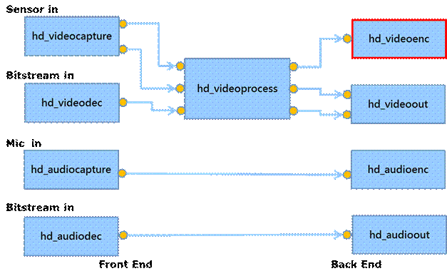
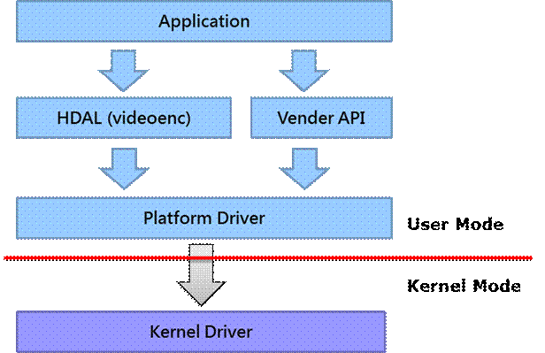
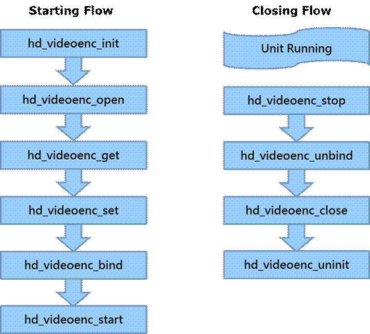
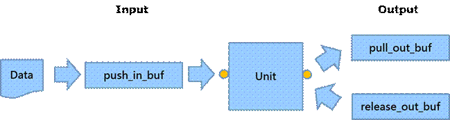
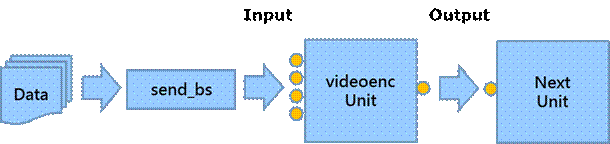

1 Introduction
--------------

The major purpose of hd_videoenc is to get YUV raw data from upper unit, and controls the video encoder to encode the YUV data then return the bitstream data which can be used for saving video files / online streaming. This document will talk about the red block in the following diagram. The device driver is not the main point in this document.

Module diagram is shown as below:

### 1.1 Basic Flow

The call sequence is needed to be done correctly for the unit. The standard starting flows of most modules are init, open, get, set, bind and start. The standard closing flows of most modules are stop, unbind, close and uninit. The basic flow is shown as below.

Now, below section in this chapter is mainly about what things to do in those functions above.

### 1.2 Single Trigger Operation

Single trigger operation is used to trigger the unit to do one job, such as to grab one YUV frame from video capture; then, encode one frame to bitstream by using video encoder. There are two types of functions for the input port and output port. The sequence for input port is push; the sequence for output port is pull and release. The flow is shown as below.

### 1.3 Multi Channel Operation

Multi channel operation is used to send multi bitstream simultaneously, it is very efficiency in the multi channels case. The flow is shown as below:

2 Parameter IDs and data structure definition
---------------------------------------------

The videoenc provides the following parameter IDs:

l HD\_VIDEOENC\_PARAM_DEVCOUNT

o support get with ctrl path

o using HD_DEVCOUNT struct (device id max count)

l HD\_VIDEOENC\_PARAM_SYSCAPS

o support get with ctrl path

o using HD\_VIDEOENC\_SYSCAPS struct (system capabilitiy)

l HD\_VIDEOENC\_PARAM\_PATH\_CONFIG

o support get/set with i/o path

o using HD\_VIDEOENC\_PATH_CONFIG struct

l HD\_VIDEOENC\_PARAM_BUFINFO

o support get with i/o path

o using HD\_VIDEOENC\_BUFINFO struct

l HD\_VIDEOENC\_PARAM_IN

o support get/set with i/o path

o using HD\_VIDEOENC\_IN struct

l HD\_VIDEOENC\_PARAM\_OUT\_ENC_PARAM

o support get/set with i/o path

o using HD\_VIDEOENC\_OUT struct

l HD\_VIDEOENC\_PARAM\_OUT\_VUI

o support get/set with i/o path

o using HD\_H26XENC\_VUI struct

l HD\_VIDEOENC\_PARAM\_OUT\_DEBLOCK

o support get/set with i/o path

o using HD\_H26XENC\_DEBLOCK struct

l HD\_VIDEOENC\_PARAM\_OUT\_RATE_CONTROL

o support get/set with i/o path

o using HD\_H26XENC\_RATE_CONTROL struct

l HD\_VIDEOENC\_PARAM\_OUT\_USR_QP

o support get/set with i/o path

o using HD\_H26XENC\_USR_QP struct

l HD\_VIDEOENC\_PARAM\_OUT\_SLICE_SPLIT

o support get/set with i/o path

o using HD\_H26XENC\_SLICE_SPLIT struct

l HD\_VIDEOENC\_PARAM\_OUT\_ENC_GDR

o support get/set with i/o path

o using HD\_H26XENC\_GDR struct

l HD\_VIDEOENC\_PARAM\_OUT\_ROI

o support get/set with i/o path

o using HD\_H26XENC\_ROI struct

l HD\_VIDEOENC\_PARAM\_OUT\_ROW_RC

o support get/set with i/o path

o using HD\_H26XENC\_ROW_RC struct

l HD\_VIDEOENC\_PARAM\_OUT\_AQ

o support get/set with i/o path

o using HD\_H26XENC\_AQ struct

l HD\_VIDEOENC\_PARAM\_OUT\_REQUEST_IFRAME

o support set with i/o path

o using HD\_H26XENC\_REQUEST_IFRAME struct

l HD\_VIDEOENC\_PARAM\_OUT\_TRIG_SNAPSHOT

o support set with i/o path

o using HD\_H26XENC\_TRIG_SNAPSHOT struct

l HD\_VIDEOENC\_PARAM\_IN\_STAMP_BUF

o support set with i/stamp path

o using HD\_OSG\_STAMP_BUF struct (stamp buffer parameter)

l HD\_VIDEOENC\_PARAM\_IN\_STAMP_IMG

o support set with i/stamp path

o using HD\_OSG\_STAMP_IMG struct (stamp image parameter)

l HD\_VIDEOENC\_PARAM\_IN\_STAMP_ATTR

o support get/set with i/stamp path

o using HD\_OSG\_STAMP_ATTR struct (stamp display attribute)

l HD\_VIDEOENC\_PARAM\_IN\_MASK_ATTR

o support get/set with i/mask path

o using HD\_OSG\_MASK_ATTR struct (mask display attribute)

l HD\_VIDEOENC\_PARAM\_IN\_MOSAIC_ATTR

o support get/set with i/mask path

o using HD\_OSG\_MOSAIC_ATTR struct (mosaic display attribute)

l HD\_VIDEOENC\_PARAM\_IN\_PALETTE_TABLE

o support get/set with i path

o using HD\_OSG\_PALETTE_TBL struct

### 2.1 General function

#### 2.1.1 hd\_videoenc\_init

\[Description\]

Initialize the unit

\[Syntax\]

HD\_RESULT hd\_videoenc_init(VOID);

\[Parameter\]

|     |     |
| --- | --- |
| Value | Description |
| VOID | Not available |

\[Return Value\]

|     |     |
| --- | --- |
| Value | Description |
| HD_OK | Success |
| HD\_ERR\_NG | Failure |

#### 2.1.2 hd\_videoenc\_open

\[Description\]

Open the unit

\[Syntax\]

HD\_RESULT hd\_videoenc\_open(HD\_IN\_ID in\_id, HD\_OUT\_ID out\_id, HD\_PATH\_ID* p\_path_id)

\[Parameter\]

|     |     |
| --- | --- |
| Value | Description |
| in_id | id of input port |
| out_id | id of output port |
| p\_path\_id | pointer of the path id |

\[Return Value\]

|     |     |
| --- | --- |
| Value | Description |
| HD_OK | Success |
| HD\_ERR\_NG | Failure |

\[Note\]

For OSG:

1. There are two kinds of OSG : ext and non-ext. ext poses less position limitation but consumes more CPU/DMA. ext is ideal for OSG with small resolution and high position flexibility.

2. Ext modifies input yuv buffer. If an input yuv buffer is feed to multiple streamings and each streaming should have its own OSG, don’t use ext.

3. One buffer mode can’t work with ext. It’s possible videoprocess and ext are updating the same yuv buffer and leads to broken streamings.

4. Compressed yuv can’t work with ext.

5. Currently, OSG on jpeg is implemented as ext. This means performance deterioration and input buffer pollution automatically apply to jpeg.

6. Built-in mask should be regarded as built-in stamp. This means all restrictions imposed to stamp also impose to mask. For example, a macro block can’t render a mask and a stamp in a layer. Opening HD\_MASK\_X after opening HD\_STAMP\_X would render HD\_STAMP\_X invalid unless opening HD\_MASK\_Y instead.

7. NT9853X has full built-in mask. Above note doesn’t hold for NT9853X. Built-in mask is rendered atop stamp.

8. If encoder rotation is supported and enabled, ext will be rotated.

9. OSG should be opened with HD\_MASK\_X, HD\_MASK\_EX\_X, HD\_STAMP\_X and HD\_STAMP\_EX\_X. Don’t use HD\_MASK(), HD\_MASK\_EX(), HD\_STAMP() or HD\_STAMP\_EX().

10. Ext OSG are rendered beneath non-ext OSG.

#### 2.1.3 hd\_videoenc\_get

\[Description\]

Get parameters from unit by path id

\[Syntax\]

HD\_RESULT hd\_videoenc\_get(HD\_PATH\_ID path\_id, HD\_VIDEOENC\_PARAM\_ID id, VOID* p\_param)

\[Parameter\]

|     |     |
| --- | --- |
| Value | Description |
| path_id | the path id |
| id  | id of parameters |
| p_param | pointer of parameters |

\[Return Value\]

|     |     |
| --- | --- |
| Value | Description |
| HD_OK | Success |
| HD\_ERR\_NG | Failure |
| HD\_ERR\_NOT_SUPPORT | Not support this parameter |

#### 2.1.4 hd\_videoenc\_set

\[Description\]

Set parameters to unit by path id

\[Syntax\]

HD\_RESULT hd\_videoenc\_set(HD\_PATH\_ID path\_id, HD\_VIDEOENC\_PARAM\_ID id, VOID* p\_param)

\[Parameter\]

|     |     |
| --- | --- |
| Value | Description |
| path_id | the path id |
| id  | id of parameters |
| p_param | pointer of parameters |

\[Return Value\]

|     |     |
| --- | --- |
| Value | Description |
| HD_OK | Success |
| HD\_ERR\_NG | Failure |
| HD\_ERR\_NOT_SUPPORT | Not support this parameter |

#### 2.1.5 hd\_videoenc\_bind

\[Description\]

Bind this unit with destination unit

\[Syntax\]

HD\_RESULT hd\_videoenc\_bind(HD\_OUT\_ID out\_id, HD\_IN\_ID dest\_in\_id)

\[Parameter\]

|     |     |
| --- | --- |
| Value | Description |
| out_id | id of output port. |
| dest\_in\_id | id of input port. |

\[Return Value\]

|     |     |
| --- | --- |
| Value | Description |
| HD_OK | Success |
| HD\_ERR\_NG | Failure |

#### 2.1.6 hd\_videoenc\_start

\[Description\]

Start the unit

\[Syntax\]

HD\_RESULT hd\_videoenc\_start(HD\_PATH\_ID path\_id)

\[Parameter\]

|     |     |
| --- | --- |
| Value | Description |
| path_id | pointer of the path id |

\[Return Value\]

|     |     |
| --- | --- |
| Value | Description |
| HD_OK | Success |
| HD\_ERR\_NG | Failure |

#### 2.1.7 hd\_videoenc\_stop

\[Description\]

Stop the unit

\[Syntax\]

HD\_RESULT hd\_videoenc\_stop(HD\_PATH\_ID path\_id)

\[Parameter\]

|     |     |
| --- | --- |
| Value | Description |
| path_id | pointer of the path id |

\[Return Value\]

|     |     |
| --- | --- |
| Value | Description |
| HD_OK | Success |
| HD\_ERR\_NG | Failure |

#### 2.1.8 hd\_videoenc\_unbind

\[Description\]

Unbind the unit

\[Syntax\]

HD\_RESULT hd\_videoenc\_unbind(HD\_OUT\_ID out\_id);

\[Parameter\]

|     |     |
| --- | --- |
| Value | Description |
| out_id | id of output port. |

\[Return Value\]

|     |     |
| --- | --- |
| Value | Description |
| HD_OK | Success |
| HD\_ERR\_NG | Failure |

#### 2.1.9 hd\_videoenc\_close

\[Description\]

Close the unit

\[Syntax\]

HD\_RESULT hd\_videoenc\_close(HD\_PATH\_ID path\_id)

\[Parameter\]

|     |     |
| --- | --- |
| Value | Description |
| path_id | pointer of the path id |

\[Return Value\]

|     |     |
| --- | --- |
| Value | Description |
| HD_OK | Success |
| HD\_ERR\_NG | Failure |

\[Note\]

For OSG:

1. OSGs will keep registered buffer until they are closed. Only after this API returns can application safely access/reclaim the buffer.

#### 2.1.10 hd\_videoenc\_uninit

\[Description\]

Uninitialize the unit

\[Syntax\]

HD\_RESULT hd\_videoenc_uninit(VOID);

\[Parameter\]

|     |     |
| --- | --- |
| Value | Description |
| VOID | Not available |

\[Return Value\]

|     |     |
| --- | --- |
| Value | Description |
| HD_OK | Success |
| HD\_ERR\_NG | Failure |

#### 2.1.11 hd\_videoenc\_push\_in\_buf

\[Description\]

Push the video frame buffer to unit

\[Syntax\]

HD\_RESULT hd\_videoenc\_push\_in\_buf(HD\_PATH\_ID path\_id, HD\_VIDEO\_FRAME* p\_in\_video\_frame, HD\_VIDEOENC\_BS* p\_user\_out\_videoenc\_bs, INT32 wait\_ms);

\[Parameter\]

|     |     |
| --- | --- |
| Value | Description |
| path_id | the path id |
| p\_in\_video_frame | pointer of the input video frame buffer |
| p\_user\_out\_videoenc\_bs | pointer of the output video bitstream buffer |
| wait_ms | timeout value in ms |

\[Return Value\]

|     |     |
| --- | --- |
| Value | Description |
| HD_OK | Success |
| HD\_ERR\_NG | Failure |

\[Note\]

p\_user\_out\_videoenc\_bs is optional. If this value is set, videoenc module uses it as the output buffer for bitstream, and the buffer should be released by user after using it; otherwise, if the value is NULL, videoenc will allocate the buffer internally, and user need to call hd\_videoenc\_release\_out\_buf API to release the buffer finally.

\[Note\]

If videoproc is NOT binding to videoenc, that is, SDK user call pull\_out YUV from videoproc and push\_in to videoenc to encode. Be sure to check YUV weight/height is equal to encoder weight/height.

If videoproc is binding to videoenc, the SDK will automatically check YUV & encoder setting. If the YUV weight/height is not correctly for encoding, SDK will automatically drop YUV.

But if videoproc is NOT binding to videoenc, the SDK will NOT automatically check YUV & encoder setting, SDK user should take responsibility for checking YUV weight/height and encoder setting. This is essential to check YUV & encoder settings while changing resolution, because the two module will NOT change to new setting at the same time. If YUV from videoproc is NOT match videoenc setting, the YUV should be dropped instead of pushing to videoenc.

#### 2.1.12 hd\_videoenc\_pull_out_buf

\[Description\]

Pull the video bitstream buffer from unit

\[Syntax\]

HD\_RESULT hd\_videoenc\_pull\_out\_buf (HD\_PATH\_ID path\_id, HD\_VIDEOENC\_BS* p\_videoenc\_bs, INT32 wait_ms);

\[Parameter\]

|     |     |
| --- | --- |
| Value | Description |
| path_id | the path id |
| p\_videoenc\_bs | pointer of the output video bitstream buffer |
| wait_ms | timeout value in ms |

\[Return Value\]

|     |     |
| --- | --- |
| Value | Description |
| HD_OK | Success |
| HD\_ERR\_NG | Failure |

#### 2.1.13 hd\_videoenc\_release\_out\_buf

\[Description\]

Release the video bitstream buffer which is get from unit

\[Syntax\]

HD\_RESULT hd\_videoenc\_release\_out\_buf (HD\_PATH\_ID path\_id, HD\_VIDEOENC\_BS* p\_videoenc\_bs)

\[Parameter\]

|     |     |
| --- | --- |
| Value | Description |
| path_id | the path id |
| p\_videoenc\_bs | pointer of the output video bitstream buffer |

\[Return Value\]

|     |     |
| --- | --- |
| Value | Description |
| HD_OK | Success |
| HD\_ERR\_NG | Failure |

### 2.2 Multi List Operation

Multi channel operation is used to send multi bitstream simultaneously, it is very efficiency in the multi channels case. The flow is shown as below:

#### 2.2.1 hd\_videoenc\_start_list

\[Description\]

Start to send multi bitstream data to the unit

\[Syntax\]

HD\_RESULT hd\_videoenc\_start\_list(HD\_PATH\_ID *path_id, UINT num);

\[Parameter\]

|     |     |
| --- | --- |
| Value | Description |
| path_id | the path id |
| num | number of bitstream data |

\[Return Value\]

|     |     |
| --- | --- |
| Value | Description |
| HD_OK | Success |
| HD\_ERR\_NG | Failure |

\[Difference\]

|     |     |
| --- | --- |
| Chip | Description |
| NT9668X  NT9852X  NT9856X  NT98530 | NOT supported. |
| NT9831X  NT9832X  NT9833X  NT98331 | All functions are supported. |

#### 2.2.2 hd\_videoenc\_stop_list

\[Description\]

Stop sending multi bitstream data to the unit

\[Syntax\]

HD\_RESULT hd\_videoenc\_stop\_list(HD\_PATH\_ID *path_id, UINT num);

\[Parameter\]

|     |     |
| --- | --- |
| Value | Description |
| path_id | the path id |
| num | number of bitstream data |

\[Return Value\]

|     |     |
| --- | --- |
| Value | Description |
| HD_OK | Success |
| HD\_ERR\_NG | Failure |

\[Difference\]

|     |     |
| --- | --- |
| Chip | Description |
| NT9668X  NT9852X  NT9856X  NT98530 | NOT supported. |
| NT9831X  NT9832X  NT9833X  NT98331 | All functions are supported. |

#### 2.2.3 hd\_videoenc\_poll_list

\[Description\]????????????????????????????????????

Query the bitstream status of all specifying channels

\[Syntax\]

HD\_RESULT hd\_videoenc\_poll\_list(HD\_VIDEOENC\_POLL\_LIST *p\_poll, UINT32 num, INT32 wait_ms);

\[Parameter\]

|     |     |
| --- | --- |
| Value | Description |
| p_poll | The path information of multi channels |
| num | Number of bitstream paths |
| wait_ms | The timeout value in millisecond while polling.  0: not wait  >0: wait time (in millisecond)  <0: wait forever or not supported |

\[Return Value\]

|     |     |
| --- | --- |
| Value | Description |
| HD_OK | Success |
| HD\_ERR\_NG | Failure |

\[Difference\]

|     |     |
| --- | --- |
| Chip | Description |
| NT9668X  NT9852X  NT9856X  NT98530 | Only revent.event is supported.  wait_ms < 0: wait forever |
| NT9831X  NT9832X  NT9833X  NT98331 | All functions are supported.  wait_ms < 0: not supported |

#### 2.2.4 hd\_videoenc\_recv_list

\[Description\]

Receive bitstream data for all channels

\[Syntax\]

HD\_RESULT hd\_videoenc\_recv\_list(HD\_VIDEOENC\_RECV\_LIST *p\_videoenc_list, UINT32 num);

\[Parameter\]

|     |     |
| --- | --- |
| Value | Description |
| p\_videoenc\_list | An array of bitstream structure to be filled for multi channels |
| num | The number of channels to retrieve bitstream |

\[Return Value\]

|     |     |
| --- | --- |
| Value | Description |
| HD_OK | Success |
| HD\_ERR\_NG | Failure |

\[Difference\]

|     |     |
| --- | --- |
| Chip | Description |
| NT9668X  NT9852X  NT9856X  NT98530 | NOT supported. |
| NT9831X  NT9832X  NT9833X  NT98331 | All functions are supported. |

### 2.3 Data structure  definition

#### 2.3.1 HD\_VIDEOENC\_PARAM_SYSCAPS

\[Description\]

System capability

\[Parameter\]

|     |     |
| --- | --- |
| Value | Description |
| dev_id | device id |
| chip_id | chip id of this device |
| max\_in\_count | max count of input of this device |
| max\_out\_count | max count of output of this device |
| dev_caps | capability of device, using HD\_DEVICE\_CAPS |
| in_caps | capability of input, using HD\_VIDEO\_CAPS |
| out_caps | capability of output, using HD\_VIDEOENC\_CAPS |
| max\_in\_stamp | max input stamp |
| max\_in\_stamp_ex | max input stamp_ex |
| max\_in\_mask | max input mask |
| max\_in\_mask_ex | max input mask_ex |

\[Difference\]

|     |     |
| --- | --- |
| Chip | Description |
| NT9668X  NT9852X  NT9856X  NT98530 | max\_in\_count? = 16;  max\_out\_count = 16;  dev_caps =  ??????????????? HD\_CAPS\_PATHCONFIG;  in_caps\[0~15\] =  ??????????????? HD\_VIDEO\_CAPS_YUV420  ??????????????? \| HD\_VIDEO\_CAPS_YUV422  ??????????????? \| HD\_VIDEO\_CAPS_COMPRESS  ??????????????? \| HD\_VIDEO\_CAPS\_DIR\_ROTATER  ??????????????? \| HD\_VIDEO\_CAPS\_DIR\_ROTATEL  ??????????????? \| HD\_VIDEO\_CAPS_STAMP  ??????????????? \| HD\_VIDEO\_CAPS_MASK;  out_caps\[0~15\] =  ??????????????? HD\_VIDEOENC\_CAPS_JPEG  ??????????????? \| HD\_VIDEOENC\_CAPS_H264  ??????????????? \| HD\_VIDEOENC\_CAPS_H265;  max\_in\_stamp = 32;  max\_in\_stamp_ex = 64;  max\_in\_mask = 8;  max\_in\_mask_ex = 16; |
| NT9831X  NT9832X  NT9833X  NT98331 | max\_in\_count = 64;  max\_out\_count = 64;  dev_caps =  ??????????????? HD\_CAPS\_PATHCONFIG  ??????????????? \| HD\_CAPS\_LISTFUNC;  in_caps\[0~63\] =  ??????????????? HD\_VIDEO\_CAPS_YUV420  ??????????????? \| HD\_VIDEO\_CAPS_YUV422  ??????????????? \| HD\_VIDEO\_CAPS\_DIR\_ROTATER  ??????????????? \| HD\_VIDEO\_CAPS\_DIR\_ROTATE180  ??????????????? \| HD\_VIDEO\_CAPS\_DIR\_ROTATEL  ??????????????? \| HD\_VIDEO\_CAPS_MASK;  out_caps\[0~63\] =  ??????????????? HD\_VIDEOENC\_CAPS_JPEG  ??????????????? \| HD\_VIDEOENC\_CAPS_H264  ??????????????? \| HD\_VIDEOENC\_CAPS_H265;  max\_in\_stamp = 0;  max\_in\_stamp_ex = 0;  max\_in\_mask = 0;  max\_in\_mask_ex = 0; |

#### 2.3.2 HD\_VIDEOENC\_PARAM\_PATH\_CONFIG

\[Description\]

Path configure

\[Parameter\]

|     |     |
| --- | --- |
| Value | Description |
| max_mem | maximum memory information. Using HD\_VIDEOENC\_MAXMEM struct |
| isp_id | ISP id. range: 0~7 or 0xffffffff = ignore |
| data_pool | pool memory information.  User can specify the size/count of buffers for encoder’s out-buffer. |

\[Difference\]

|     |     |
| --- | --- |
| Chip | Description |
| NT9668X  NT9852X  NT9856X  NT98530 | data_pool is not supported |
| NT9831X  NT9832X  NT9833X  NT98331 | max\_mem and isp\_id are not supported. |

\[Apply Require\]

stop -> close -> open -> set -> start

#### 2.3.3 HD\_VIDEOENC\_PARAM_BUFINFO

\[Description\]

Buffer information

\[Parameter\]

|     |     |
| --- | --- |
| Value | Description |
| buf_info | physical addr/size of bitstream buffer, for user space to mmap |

\[Difference\]

|     |     |
| --- | --- |
| Chip | Description |
| NT9668X  NT9852X  NT9856X  NT98530 | Function is supported. |
| NT9831X  NT9832X  NT9833X  NT98331 | Function is not supported. |

#### 2.3.4 HD\_VIDEOENC\_PARAM_IN

\[Description\]

Input parameters

\[Parameter\]

|     |     |
| --- | --- |
| Value | Description |
| dim | encode width/height, using HD_DIM struct |
| pxl_fmt | source format, using HD\_VIDEO\_PXLFMT struct |
| dir | input direction, using HD\_VIDEO\_DIR struct |
| frc | frame rate control |

\[Difference\]

|     |     |
| --- | --- |
| Chip | Description |
| NT9668X | the valid pxl_fmt values in H26X with  HD\_VIDEO\_PXLFMT_YUV420  HD\_VIDEO\_PXLFMT\_YUV420\_NVX1_H264(for H264 encode)  HD\_VIDEO\_PXLFMT\_YUV420\_NVX1_H265(for H265 encode)  and JPEG with  HD\_VIDEO\_PXLFMT_YUV420  HD\_VIDEO\_PXLFMT_YUV422 |
| NT9852X | the valid pxl_fmt values in H26X with  HD\_VIDEO\_PXLFMT_YUV420  HD\_VIDEO\_PXLFMT\_YUV420\_NVX2  and JPEG with  HD\_VIDEO\_PXLFMT_YUV420  HD\_VIDEO\_PXLFMT_YUV422 |
| NT9856X | the valid pxl_fmt values in H26X with  HD\_VIDEO\_PXLFMT_YUV420  HD\_VIDEO\_PXLFMT\_YUV420\_NVX2  and JPEG with  HD\_VIDEO\_PXLFMT_YUV420  HD\_VIDEO\_PXLFMT\_YUV420\_NVX2  HD\_VIDEO\_PXLFMT_YUV422 |
| NT98530 | the valid pxl_fmt values in H26X with  HD\_VIDEO\_PXLFMT_YUV420  HD\_VIDEO\_PXLFMT\_YUV420\_MB4  HD\_VIDEO\_PXLFMT\_YUV420\_NVX2  HD\_VIDEO\_PXLFMT\_YUV420\_NVX5  and JPEG with  HD\_VIDEO\_PXLFMT_YUV420  HD\_VIDEO\_PXLFMT\_YUV420\_NVX2  HD\_VIDEO\_PXLFMT_YUV422 |
| NT9831X  NT9832X | frc is not supported.  the valid pxl_fmt values in H26X with  HD\_VIDEO\_PXLFMT_YUV420  HD\_VIDEO\_PXLFMT\_YUV420\_NVX3  And JPEG with  HD\_VIDEO\_PXLFMT\_YUV420\_MB |
| NT9833X  NT98331 | the valid pxl_fmt values in H26X and jpeg with  HD\_VIDEO\_PXLFMT_YUV420  HD\_VIDEO\_PXLFMT\_YUV420\_NVX3 |

\[Apply Require\]

stop -> set -> start

\[Note\]

If videoproc is binding to videoenc, and HD\_VIDEOPROC\_OUT is set to default=0 (auto-sync parameters from videoenc), then remember to call start for videoproc

\[videoenc\] stop -> set -> start

\[videoproc\] start

#### 2.3.5 HD\_VIDEOENC\_PARAM\_IN\_FRC

\[Description\]

Input parameters

\[Parameter\]

|     |     |
| --- | --- |
| Value | Description |
| frc | frame rate control |

\[Difference\]

|     |     |
| --- | --- |
| Chip | Description |
| NT9668X  NT9852X  NT9856X  NT98530 | Function is supported. |
| NT9831X  NT9832X  NT9833X  NT98331 | Function is not supported. |

\[Apply Require\]

If change between (dst <= src) and (dst <= src)

set -> start

If change between (dst &lt;= src) and (dst &gt; src)? (both direction)

If change between (dst > src) and (dst > src)

stop -> set -> start

#### 2.3.6 HD\_VIDEOENC\_PARAM\_OUT\_ENC_PARAM

\[Description\]

Input frame

\[Parameter\]

|     |     |
| --- | --- |
| Value | Description |
| codec_type | codec type, using HD\_VIDEO\_CODEC struct |
| h26x | H26x config, using HD\_H26X\_CONFIG struct |
| jpeg | Jpeg config, using HD\_JPEG\_CONFIG struct |

\[Apply Require\]

stop -> set -> start

#### 2.3.7 HD\_VIDEOENC\_PARAM\_OUT\_VUI

\[Description\]

H26x vui settings

\[Parameter\]

|     |     |
| --- | --- |
| Value | Description |
| vui_en | enable vui. default: 0, range: 0~1 (0: disable, 1: enable) |
| sar_width | Horizontal size of the sample aspect ratio. default: 0, range: 0~65535 |
| sar_height | Vertical size of the sample aspect rat. default: 0, range: 0~65535 |
| matrix_coef | Matrix coefficients are used to derive the luma and Chroma signals from green, blue, and red primaries. default: 2, range: 0~255 |
| transfer_characteristics | The opto-electronic transfers characteristic of the source pictures. default: 2, range: 0~255 |
| colour_primaries | Chromaticity coordinates the source primaries. default: 2, range: 0~255 |
| video_format | Indicate the representation of pictures. default: 5, range: 0~7 |
| color_range | Indicate the black level and range of the luma and Chroma signals. default: 0, range: 0~1 (0: Not full range, 1: Full range) |
| timing\_present\_flag | timing info present flag. default: 0, range: 0~1 (0: disable, 1: enable) |

\[Apply Require\]

stop -> set -> start

#### 2.3.8 HD\_VIDEOENC\_PARAM\_OUT\_DEBLOCK

\[Description\]

H26x deblock settings

\[Parameter\]

|     |     |
| --- | --- |
| Value | Description |
| dis\_ilf\_idc | Disable loop filter in slice header. default: 0, range: 0~2 (0: Filter, 1: No Filter, 2: Slice Mode) |
| db_alpha | Alpha & C0 offset. default: 0, range: -12~12 |
| db_beta | Beta offset.?????? default: 0, range: -12~12 |

\[Difference\]

|     |     |
| --- | --- |
| Chip | Description |
| NT9668X | dis\_ilf\_idc-> across\_tile\_en is not supported |
| NT9852X  NT9856X  NT98530  NT9831X  NT9832X  NT9833X  NT98331 | All functions are supported. |

\[Apply Require\]

stop -> set -> start

#### 2.3.9 HD\_VIDEOENC\_PARAM\_OUT\_RATE_CONTROL

\[Description\]

H26x rate control settings

\[Parameter\]

|     |     |
| --- | --- |
| Value | Description |
| rc_mode | rate control mode. default: 1, range: 1~4 (1: CBR, 2: VBR, 3: FixQP, 4: EVBR), using HD\_VIDEOENC\_RC_MODE struct |
| cbr | parameter of rate control mode CBR, using HD\_H26XENC\_CBR struct |
| vbr | parameter of rate control mode VBR, using HD\_H26XENC\_VBR struct |
| fixqp | parameter of rate control mode FixQP, using HD\_H26XENC\_FIXQP struct |
| evbr | parameter of rate control mode EVBR, using HD\_H26XENC\_EVBR struct |

\[Apply Require\]

set -> start

#### 2.3.10 HD\_VIDEOENC\_PARAM\_OUT\_USR_QP

\[Description\]

H26x user qp settings

\[Parameter\]

|     |     |
| --- | --- |
| Value | Description |
| Enable | enable user qp. default: 0, range: 0~1 (0: disable, 1: enable) |
| qp\_map\_addr | buffer address of user qp map.  one byte per cu16  (bit\[0:7\] qp value. default: 26, range: 0~51)  two byte per cu16.  (bit\[0:5\] qp value (default: 0; if qp mode is 3 then qp value means fixed qp \[range: 0~51\], otherwise qp value means delta qp \[range: -32~31\]))  (bit\[6:7\] qp? mode (default: 0; 0: delta qp, 1: reserved, 2: delta qp \[disable AQ\], 3: fixed qp) |

\[Difference\]

|     |     |
| --- | --- |
| Chip | Description |
| NT9668X | qp\_map\_addr is one byte per cu16 |
| NT9852X  NT9856X  NT98530 | qp\_map\_addr is two bytes per cu16 |
| NT9831X  NT9832X  NT9833X  NT98331 | All functions are supported. |

\[Apply Require\]

set -> start

#### 2.3.11 HD\_VIDEOENC\_PARAM\_OUT\_SLICE_SPLIT

\[Description\]

H26x slice split

\[Parameter\]

|     |     |
| --- | --- |
| Value | Description |
| enable | enable multiple slice. default: 0, range: 0~1 (0: disable, 1: enable) |
| slice\_row\_num | number of macroblock/ctu rows occupied by a slice, range: 1 ~ number of macroblock/ctu row |

\[Apply Require\]

set -> start

#### 2.3.12 HD\_VIDEOENC\_PARAM\_OUT\_ENC_GDR

\[Description\]

H26x GDR settins

\[Parameter\]

|     |     |
| --- | --- |
| Value | Description |
| enable | enable gdr. default: 0, range: 0~1 (0: disable, 1: enable) |
| period | intra refresh period. default: 0, range: 0~0xFFFFFFFF (0: always refresh, others: intra refresh frame period) |
| number | intra refresh row number. default: 1, range: 1 ~ number of macroblock/ctu row |

\[Apply Require\]

set -> start

#### 2.3.13 HD\_VIDEOENC\_PARAM\_OUT\_ROI

\[Description\]

H26x ROI settings

\[Parameter\]

|     |     |
| --- | --- |
| Value | Description |
| roi\_qp\_mode | roi qp mode for all windows.? available value: HD\_VIDEOENC\_QPMODE\_FIXED\_QP(default) / HD\_VIDEOENC\_QPMODE\_DELTA, using HD\_VIDEOENC_QPMODE struct |
| st_roi | roi window settings. ROIs can be overlaid, and the priority of the ROIs is based on index number, index 0 is highest priority and index 9 is lowest. Using HD\_H26XENC\_ROI_WIN struct |

\[Difference\]

|     |     |
| --- | --- |
| Chip | Description |
| NT9668X | st_roi is not supported. |
| NT9852X  NT9856X  NT98530 | All functions are supported. |
| NT9831X  NT9832X  NT9833X  NT98331 | roi\_qp\_mode is not supported. |

\[Apply Require\]

set -> start

#### 2.3.14 HD\_VIDEOENC\_PARAM\_OUT\_ROW_RC

\[Description\]

H26x row rc settings

\[Parameter\]

|     |     |
| --- | --- |
| Value | Description |
| enable | enable row rc. default: 1, range: 0~1 (0: disable, 1: enable) |
| i\_qp\_range | row-level rata control. default: 2, range: 0~15 |
| i\_qp\_step | row-level rata control. default: 1, range: 0~15 |
| p\_qp\_range | qp range of P frame for row-level rata control. default: 4, range: 0~15 |
| p\_qp\_step | qp step? of P frame for row-level rata control. default: 1, range: 0~15 |
| min\_i\_qp | min qp of I frame for row-level rata control. default:? 1, range: 0~51 |
| max\_i\_qp | max qp of I frame for row-level rata control. default: 51, range: 0~51 |
| min\_p\_qp | min qp of P frame for row-level rata control. default:? 1, range: 0~51 |
| max\_p\_qp | max qp of P frame for row-level rata control. default: 51, range: 0~51 |

\[Difference\]

|     |     |
| --- | --- |
| Chip | Description |
| NT9668X  NT9852X  NT9856X  NT98530 | i\_qp\_range: qp range of I&P frame.  i\_qp\_step: qp step of I&P frame.  p\_qp\_range, p\_qp\_step, min\_i\_qp, max\_i\_qp, min\_i\_qp and max\_i\_qp are not supported. |
| NT9831X  NT9832X  NT9833X  NT98331 | i\_qp\_range: qp range of I frame.  i\_qp\_step: qp step of I frame. |

\[Apply Require\]

set -> start

#### 2.3.15 HD\_VIDEOENC\_PARAM\_OUT\_AQ

\[Description\]

H26x aq settings

\[Parameter\]

|     |     |
| --- | --- |
| Value | Description |
| enable | AQ enable. default: 0, range: 0~1 (0: disable, 1: enable) |
| i_str | aq strength of I frame. default: 3, range: 1~8 |
| p_str | aq strength of P frame. default: 1, range: 1~8 |
| max\_delta\_qp | max delta qp of aq. |
| min\_delta\_qp | min delta qp of aq. |
| depth | AQ depth. default: 2, range(H.264): 2, range(H.265): 0~2 (0: cu64, 1: cu32, 2: cu16) |
| thd_table | non-linear AQ mapping table. range: -512~511, default: {-120,-112,-104, -96, -88, -80, -72, -64, -56, -48, -40, -32, -24, -16, -8, 7, 15, 23, 31, 39,47, 55, 63, 71, 79, 87, 95, 103, 111, 119}  for ( dqp = -15; dqp < 15; dqp++ ) if ( Cu.RelativeTextureComplexity(x\_str) <= thd\_table\[dqp+15\] ) break; Cu.DeltaQP\_AQ = MIN ( MAX (min\_delta\_qp, dqp), max\_delta_qp ); |

\[Difference\]

|     |     |
| --- | --- |
| Chip | Description |
| NT9668X  NT9852X  NT9856X  NT98530 | max\_delta\_qp range 0~8 (default: 6).  min\_delta\_qp range -8~0 (default: -6).  depth and thd_table are not supported. |
| NT9831X  NT9832X  NT9833X  NT98331 | max\_delta\_qp range 0~15 (default: 6).  min\_delta\_qp range -15~0 (default: -6). |

\[Apply Require\]

set -> start

#### 2.3.16 HD\_VIDEOENC\_PARAM\_OUT\_REQUEST_IFRAME

\[Description\]

H26x request I-frame

\[Parameter\]

|     |     |
| --- | --- |
| Value | Description |
| enable | request i-frame enable. default: 0, range: 0~1 (0: disable, 1: enable) |

\[Apply Require\]

set -> start

#### 2.3.17 HD\_VIDEOENC\_PARAM\_OUT\_TRIG_SNAPSHOT

\[Description\]

H26x trigger snapshot

\[Parameter\]

|     |     |
| --- | --- |
| Value | Description |
| phy_addr | \[w\]physical address of encoded data (user provide memory space to put JPEG result) |
| size | \[w\]user buffer size provided  \[r\]real size of encoded data |

\[Apply Require\]

set

#### 2.3.18 HD\_VIDEOENC\_PARAM\_IN\_STAMP_BUF

\[Description\]

Stamp buffer settings

\[Parameter\]

|     |     |
| --- | --- |
| Value | Description |
| type | ping pong buffer or single buffer, using HD\_OSG\_BUF_TYPE |
| size | buffer's size in byte |
| p_addr | buffer's physical address |
| ddr_id | p_addr’s ddr id |

\[Difference\]

|     |     |
| --- | --- |
| Chip | Description |
| NT9668X  NT9852X  NT9856X  NT98530 | ddr_id is not supported. |
| NT9831X  NT9832X  NT9833X  NT98331 | All functions are not supported. |

\[Apply Require\]

stop -> set -> start

\[Note\]

For NT9668X / NT9852X / NT9856X / NT98530:

2. Different OSGs can share the same buffer to save memory

3. Double buffer requires “2 * max OSG resolution * sizeof(short)” while single buffer requires only “max OSG resolution* sizeof(short)”. But single buffer suffers from blinking when image is updated.

4. The starting address and length should be (2 x cpu cache line) aligned for ping pong buffer (128 or 64 bytes) and cpu cache line aligned for single buffer(64 or 32 bytes).

5. If stamp will be rendered on mjpg or jpeg, width must be extended to multiple of 4 to calculate buffer size.

#### 2.3.19 HD\_VIDEOENC\_PARAM\_IN\_STAMP_IMG

\[Description\]

Stamp image settings

\[Parameter\]

|     |     |
| --- | --- |
| Value | Description |
| fmt | RGB565/ARGB1555/ARGB4444/ARGB8888/  Using HD\_VIDEO\_PXLFMT struct |
| dim | image's width and height, using HD_DIM struct |
| p_addr | image's bitmap content |
| ddr_id | p_addr’s ddr id |

\[Difference\]

|     |     |
| --- | --- |
| Chip | Description |
| NT9668X | Palette and ddr_id are not supported. |
| NT9852X  NT9856X  NT98530 | ddr_id Is not supported. |
| NT9831X  NT9832X  NT9833X  NT98331 | All functions are supported |

\[Apply Require\]

set

\[Note\]

For NT9668X / NT9852X / NT9856X / NT98530:

1. Only RGB565/ARGB1555/ARGB4444 are supported

2. Image width is best to be multiple of 4 bytes for best compatibility. For example, image width of an argb1555 is multiple of 2 and image width of a palette2 (a pixels takes 2 bits) is multiple of 16.

3. Image height is best to be multiple of 2 for best compatibility.

4. In addition to the whole image width and height, every color area(e.g. timestamp and border)’s width and height should be multiple of 2.

5. hd\_videoenc\_get retrieves free buffer(not accessed by hardware) for OSG of ping pong buffer

For NT9831X / NT9832X / NT98331

1\. User needs to use external OSG for JPEG codec. Please refer to hd_videoout.doc.

#### 2.3.20 HD\_VIDEOENC\_PARAM\_IN\_STAMP_ATTR

\[Description\]

Stamp attr settings

\[Parameter\]

|     |     |
| --- | --- |
| Value | Description |
| align_type | to which corner is stamp aligned  Using HD\_OSG\_ALIGN_TYPE struct |
| alpha | (DISP)alpha value |
| position | (DISP)stamp's x,y position, using HD_IPOINT struct |
| colorkey_en | colorkey used to filter background |
| colorkey_val | filtered background color |
| qp_en | does stamp have its own qp |
| qp_fix | qp_val is fixed or relative to streaming qp |
| qp_val | qp value |
| layer | set layer attribute for videoenc |
| region | set region attribute for videoenc |
| gcac_enable | (GCAC)gcac enable |
| gcac\_blk\_width | unit width of GCAC |
| gcac\_blk\_height | unit height of GCAC. Note: OSG dim / (gcac\_blk\_width* gcac\_blk\_height) must less than 64 |

\[Difference\]

|     |     |
| --- | --- |
| Chip | Description |
| NT9668X | alpha only for rgb565.  align\_type, gcac\_enable, gcac\_blk\_width and gcac\_blk\_width are not supported. |
| NT9852X  NT9856X  NT98530 | alpha for argb4444, argb1555, rgb565.  align\_type, gcac\_enable, gcac\_blk\_width and gcac\_blk\_width are not supported. |
| NT9831X  NT9832X  NT9833X  NT98331 | colorkey\_en, colorkey\_val, qp\_en, qp\_fix, qp_val, layer and region are not supported. |

\[Apply Require\]

set

\[Note\]

For NT9668X / NT9852X / NT9856X / NT98530:

1. align\_type, gcac\_* are not supported

2. For ARGB4444, alpha field is not applicable. For ARGB1555. alpha\[3..0\] is for pixels of A = 0 and alpha\[7..4\] is for pixels of A = 1. For best compatibility, set alpha to 0xf0. Other values may lead to missing stamp or opaque background.

3. X y are best to be multiple of 2 for best compatibility. For h264, any 16\*16 macro block can have only one OSG. For h265, any 64\*64 macro block can have only one OSG.

4. If two OSGs are inside a macro block or even overlapped, they must be in different layer(currently, there are only two layers : 0 and 1. Layer 1 will be rendered above layer 0.)

5. region is a serial number(each layer has 16 regions : 0 ~ 15)

6. qp_* are used to resolve conflicting qp value between streaming and OSG.

7. Ext stamp doesn’t support colorkey\_en, colorkey\_val, qp\_en, qp\_fix, qp\_val, layer, region, gcac\_enable, gcac\_blk\_width, gcac\_blk\_height

8. Ext stamp opened with higher HD\_STAMP\_EX value will override ext stamps with lower value

For NT9831X / NT9832X / NT9833X / NT98331:

1.x/y need to be multiple of 2 for best compatibility.

2\. For NT9831X / NT9832X / NT98331, user needs to use external OSG for JPEG codec. Please refer to hd_videoout.doc.

#### 2.3.21 HD\_VIDEOENC\_PARAM\_IN\_MASK_ATTR

\[Description\]

Mask attribute settings

\[Parameter\]

|     |     |
| --- | --- |
| Value | Description |
| type | mask is solid or hollow. Using HD\_OSG\_MASK_TYPE |
| color | mask color in rgb, mask palette index |
| alpha | mask transparency |
| position | 4 vertices' position, using HD_UPOINT struct |
| thickness | border width for hollow mask |

\[Difference\]

|     |     |
| --- | --- |
| Chip | Description |
| NT9668X | only support ext mask. |
| NT9852X | support builtin mask and builtin mask should be set through vendor\_videoenc\_set |
| NT9853X | support builtin mask and builtin mask should be set through hd\_videoenc\_set. Irregular rectangle is supported. |
| NT9831X  NT9832X  NT9833X  NT98331 | color and thickness are not supported. |

\[Apply Require\]

set

\[Note\]

For NT9668X / NT9852X / NT9856X / NT98530:

1. position\[0\] should be the top left. Others should be in clockwise order.

2. thickness should be multiple of 2

3. Hollow mask takes more time to complete than solid mask. Don’t set over 4 hollow masks in a path.

4. mask opened with higher HD\_MASK\_EX value will override ext masks with lower value

5. DDR consumption is proportional to ext mask’s area. This is true even for hollow ext masks with thin border.

For NT9831X / NT9832X / NT9833X / NT98331

1\. JPEG doesn’t have relative engine, so user needs to use external OSG for JPEG mask. Please refer to hd_videoout.doc.

#### 2.3.22 HD\_VIDEOENC\_PARAM\_IN\_MOSAIC_ATTR

\[Description\]

Mosaic attribute settings

\[Parameter\]

|     |     |
| --- | --- |
| Value | Description |
| Type | mask is solid or inversion. Using HD\_OSG\_MASK_TYPE struct |
| Alpha | mask alpha blending. range: 0 ~ 256 (0: foreground, 256: background) |
| mosaic\_blk\_w | witdh of internal block |
| mosaic\_blk\_h | height of internal block |
| position | 4 vertices' position, using HD_UPOINT struct |

\[Difference\]

|     |     |
| --- | --- |
| Chip | Description |
| NT9853X | type and alpha are not supported. |
| NT9831X  NT9832X  NT9833X  NT98331 | All functions are supported. |

\[Apply Require\]

set

\[Note\]

For NT9668X / NT9852X / NT9856X / NT98530:

1. Mosaic is not supported

For NT9831X / NT9832X / NT9833X / NT98331

1\. JPEG doesn’t have relative engine, so user needs to use external OSG for JPEG mosaic. Please refer to hd_videoout.doc.

#### 2.3.23 HD\_VIDEOENC\_PARAM\_IN\_PALETTE_TABLE

\[Description\]

Palette table settings

\[Parameter\]

|     |     |
| --- | --- |
| Value | Description |
| pal_y | palette colors y. range: 0 ~ 255 |
| pal_cb | palette colors cb. range: 0 ~ 255 |
| pal_cr | palette colors cr. range: 0 ~ 255 |

\[Difference\]

|     |     |
| --- | --- |
| Chip | Description |
| NT9668X  NT9852X  NT9856X  NT98530 | All functions are not supported. |
| NT9831X  NT9832X  NT9833X  NT98331 | All functions are supported. |

\[Apply Require\]

set

For NT9831X / NT9832X / NT9833X / NT98331

1\. JPEG doesn’t have relative engine, so user needs to use external OSG for JPEG palette table. Please refer to hd_videoout.doc.

#### 2.3.24 HD\_VIDEOENC\_PARAM\_FUNC\_CONFIG

\[Description\]

Function configure

\[Parameter\]

|     |     |
| --- | --- |
| Value | Description |
| ddr_id | Configure which ddr to work & output bitstream |
| in_func | additional function of in (bit-wise mask). enable ONEBUFF/ LOWLATENCY mode. |

\[Difference\]

|     |     |
| --- | --- |
| Chip | Description |
| NT9668X | ddr\_id and in\_func  are not supported. |
| NT9852X  NT9856X  NT98530 | All functions are supported. |
| NT9831X  NT9832X  NT9833X  NT98331 | ddr\_id and in\_func are not supported. |

#### 2.3.25 HD\_VIDEOENC\_POLL_LIST

\[Description\]

The polling item including path information

Use this type to form an array in hd\_videoenc\_poll_list() to get the results for all paths.

\[Parameter\]

|     |     |
| --- | --- |
| Value | Description |
| path_id | path ID |
| revent | The returned event value |

\[Difference\]

|     |     |
| --- | --- |
| Chip | Description |
| NT9668X  NT9852X  NT9856X  NT98530 | NOT supported. |
| NT9831X  NT9832X  NT9833X  NT98331 | Supported. |

#### 2.3.26 HD\_VIDEOENC\_USER_BS

\[Description\]

Video bitstream data and relative information

\[Parameter\]

|     |     |
| --- | --- |
| Value | Description |
| sign | signature = MAKEFOURCC('V','S','T','M') |
| p_next | pointer to next meta |
| vcodec_format | Encoded format of video frame |
| pack_num | Pack number in video frame |
| timestamp | Encode bs timestamp |
| frame_type | The frame type |
| svc\_layer\_type | svc layer type |
| video_pack | Pack array of encoded data |
| psnr_info | The PSNR information |
| blk_info | The block partition information |
| newbs_flag | Flag notification of new seting |
| qp  | The qp value |
| slice_offset | multi-slice offset 0~VENC\_USER\_SLICE_MAX |
| p\_user\_buf | Bitstream buffer pointer |
| user\_buf\_size | AP provide bs_buf max size |

\[Difference\]

|     |     |
| --- | --- |
| Chip | Description |
| NT9668X  NT9852X  NT9856X  NT98530 | NOT supported. |
| NT9831X  NT9832X  NT9833X  NT98331 | Supported. |

#### 2.3.27 HD\_VIDEOENC\_RECV_LIST

\[Description\]

The video bitstream item including path information

Use this type to form an array in hd\_videoenc\_recv_list() to get the video bitstreams for all paths.

\[Parameter\]

|     |     |
| --- | --- |
| Value | Description |
| path_id | path ID |
| user_bs | video encode user bitstream |
| retval | less than 0: recv bistream fail. |

\[Difference\]

|     |     |
| --- | --- |
| Chip | Description |
| NT9668X  NT9852X  NT9856X  NT98530 | NOT supported. |
| NT9831X  NT9832X  NT9833X  NT98331 | Supported. |

#### 2.3.28 HD\_H26X\_CONFIG

\[Description\]

The basic parameters for H264/H265.

\[Parameter\]

|     |     |
| --- | --- |
| Value | Description |
| gop_num | I-frame period |
| chrm\_qp\_idx | chroma qp offset |
| sec\_chrm\_qp_idx | Second chroma QP offset |
| ltr_interval | Long-term reference frame interval   0: all long-term reference to IDR frame, 1: reference latest long-term reference frame |
| ltr\_pre\_ref | Long-term reference setting |
| gray_en | Encode color to gray |
| source_output | Source output |
| profile | Profile IDC |
| level_idc | Level IDC |
| svc_layer | SVC Layer |
| entropy_mode | Entropy coding method |

#### 2.3.29 HD\_JPEG\_CONFIG

\[Description\]

The basic parameters for JPEG.

\[Parameter\]

|     |     |
| --- | --- |
| Value | Description |
| retstart_interval | Specifies the interval between RSTn markers, in Minimum Coded Units (MCUs). This marker is followed by two bytes indicating the fixed size so it can be treated like any other variable size segment.   Restart interval default setting is zero. The user can setting interval value from 0 to image size/256. |
| image_quality | Specify the picture quality |

3 Trouble shooting
------------------

The hd_videoenc provides a useful feature to debug, it is called debug menu.

### 3.1 debug  menu (NT9668X / NT9852X / NT9856X / NT98530)

In application, call hd\_debug\_run_menu() to open the debug menu.

==============================

?HDAL

\-\-\-\-\-\-\-\-\-\-\-\-\-\-\-\-\-\-\-\-\-\-\-\-\-\-\-\-\-\-

?01 : AUDIOCAPTURE

?02 : AUDIOOUT

?03 : AUDIOENC

?04 : AUDIODEC

?05 : VIDEOCAPTURE

?06 : VIDEOOUT

?07 : VIDEOPROCESS

?08 : VIDEOENC

?09 : VIDEODEC

?10 : OSG

?11 : COMMON

?12 : UTIL

?13 : DEBUG

\-\-\-\-\-\-\-\-\-\-\-\-\-\-\-\-\-\-\-\-\-\-\-\-\-\-\-\-\-\-

?254 : Quit

?255 : Return

\-\-\-\-\-\-\-\-\-\-\-\-\-\-\-\-\-\-\-\-\-\-\-\-\-\-\-\-\-\-

Enter “8” to open VIDEOENC debug menu

==============================

?VIDEOENC

\-\-\-\-\-\-\-\-\-\-\-\-\-\-\-\-\-\-\-\-\-\-\-\-\-\-\-\-\-\-

?01 : dump status

?02 : enc info

?03 : rc info ON

?04 : rc info OFF

\-\-\-\-\-\-\-\-\-\-\-\-\-\-\-\-\-\-\-\-\-\-\-\-\-\-\-\-\-\-

?254 : Quit

?255 : Return

\-\-\-\-\-\-\-\-\-\-\-\-\-\-\-\-\-\-\-\-\-\-\-\-\-\-\-\-\-\-

Note: The items in the menu may vary for each chip.

#### 3.1.1 dump status

Enter “1” to show the status of videoenc

Run: 01 : dump status

HDAL_VERSION: 00010001:00010001

\-\-\-\-\-\-\-\-\-\-\-\-\-\-\-\-\-\-\-\-\-\-\-\-\- VIDEOENC 0? PATH & BIND ------------------------------

in??? out?? state bind\_src????????????? bind\_dest

0???? 0???? START VIDEOPROC\_0\_OUT_0???? (null)

\-\-\-\-\-\-\-\-\-\-\-\-\-\-\-\-\-\-\-\-\-\-\-\-\- VIDEOENC 0? PATH CONFIG ------------------------------

in??? out?? max\_w max\_h? svc? ltr? rotate? bitrate?? enc_ms

0???? 0???? 1920? 1080??? 2??? 1????? 0??? 2097152?? 3000

\-\-\-\-\-\-\-\-\-\-\-\-\-\-\-\-\-\-\-\-\-\-\-\-\- VIDEOENC 0? IN FRAME ---------------------------------

in??? w???? h???? pxlfmt? frc?? dir

0???? 1920? 1080? YUV420? 1/1?? ....

\-\-\-\-\-\-\-\-\-\-\-\-\-\-\-\-\-\-\-\-\-\-\-\-\- VIDEOENC 0? OUT BS -----------------------------------

\-\-\- \[H26x\] ---

out?? codec? gop? ltr\_int? ltr\_ref? gray? src_out? profile? level? svc? entropy

0???? H265?? 15?? 0??????? 0??????? 0???? 0??????? MAIN???? 150? ??0??? CABAC

\-\-\-\-\-\-\-\-\-\-\-\-\-\-\-\-\-\-\-\-\-\-\-\-\- VIDEOENC 0? VUI --------------------------------------

out?? vui\_en? sar\_w? sar\_h? mat\_c? tran\_c? col\_prim? vid\_fmt? col\_rng? time_pre

0???? 0?????? .....? .....? .....? ......? ........? .......? .......? ........

\-\-\-\-\-\-\-\-\-\-\-\-\-\-\-\-\-\-\-\-\-\-\-\-\- VIDEOENC 0? DEBLOCK ----------------------------------

out?? dis\_ilf\_idc? alpha? beta

0???? 0??????????? 0????? 0

\-\-\-\-\-\-\-\-\-\-\-\-\-\-\-\-\-\-\-\-\-\-\-\-\- VIDEOENC 0? RC ---------------------------------------

out?? mode? bitrate? fr? I(int/min/max)? P(int/min/max)? sta? ip_w

0???? CBR?? 2097152? 30?? ( 26/ 10/ 45)?? ( 26/ 10/ 45)? 4??? 0

\-\-\-\-\-\-\-\-\-\-\-\-\-\-\-\-\-\-\-\-\-\-\-\-\- VIDEOENC 0? USER QP ----------------------------------

out?? en? map_addr

0???? 0?? ........

\-\-\-\-\-\-\-\-\-\-\-\-\-\-\-\-\-\-\-\-\-\-\-\-\- VIDEOENC 0? SLICE SPLIT ------------------------------

out?? en? row_num

0???? 0?? .......

\-\-\-\-\-\-\-\-\-\-\-\-\-\-\-\-\-\-\-\-\-\-\-\-\- VIDEOENC 0? GDR --------------------------------------

out?? en? period? row_num

0???? 0?? ......? .......

\-\-\-\-\-\-\-\-\-\-\-\-\-\-\-\-\-\-\-\-\-\-\-\-\- VIDEOENC 0? ROI --------------------------------------

out?? qp_mode? win? qp? rect(x,y,w,h)

\-\-\-\-\-\-\-\-\-\-\-\-\-\-\-\-\-\-\-\-\-\-\-\-\- VIDEOENC 0? ROW RC -----------------------------------

out?? en? qp\_rng? qp\_step

0???? 1?? 2?????? 1

\-\-\-\-\-\-\-\-\-\-\-\-\-\-\-\-\-\-\-\-\-\-\-\-\- VIDEOENC 0? AQ ---------------------------------------

out?? en? i\_str? p\_str? max\_delta? min\_delta

0???? 0?? .....? .....? .........? .........

\-\-\-\-\-\-\-\-\-\-\-\-\-\-\-\-\-\-\-\-\-\-\-\-\- VIDEOENC 0? IN WORK STATUS --------------------------

in??? PUSH? drop? wrn?? err?? PROC? drop? wrn?? err?? REL

0???? 30?? ??0??? ??0???? 0???? 30??? ?0???? 0???? ?0???? 30

\-\-\-\-\-\-\-\-\-\-\-\-\-\-\-\-\-\-\-\-\-\-\-\-\- VIDEOENC 0? OUT WORK STATUS -------------------------

out?? NEW?? drop? wrn?? err?? PROC? drop? wrn?? err?? PUSH? drop? wrn?? err

0???? ?30??? 0???? ?0???? 0???? 30?? ??0???? 0?? ???0???? 30?? ?0??? ??0???? 0

\-\-\-\-\-\-\-\-\-\-\-\-\-\-\-\-\-\-\-\-\-\-\-\-\- VIDEOENC 0? USER WORK STATUS -------------------------

out?? PULL?? drop? wrn?? err?? REL

0??? ?30???? ?0??? ??0???? 0???? 30

As above, the debug menu shows the path & bind information, path_config , input frame / output bitstream information.

The detail for each count value is as following,

  

\[IN\]

|     |     |     |     |
| --- | --- | --- | --- |
| IN  | PUSH | =>  | get YUV from previous unit / user push_in |
| err | (1) module is NOT start   ??? (2) for auto-bind mod, check YUV lineoffset is wrong |
| wrn | (1) YUV ping-pong buffer if full   ??? (2) bitstream buffer is full, drop this YUV |
| drop | (1) module is stop, drop any YUV that is not processed |
| PROC | =>  | prepare to encode |
| err | (1) encode fail |
| wrn | (1) N/A |
| drop | (1) N/A |
| REL | =>  | release YUV |

\[OUT\]

|     |     |     |     |
| --- | --- | --- | --- |
| OUT | NEW | =>  | search for bitstream buffer to put encode result |
| err | (1) N/A |
| wrn | (1) bitstream buffer is full, could not encode this YUV |
| drop | (1) N/A |
| PROC | =>  | prepare to encode |
| err | (1) encode fail |
| wrn | (1) N/A |
| drop | (1) N/A |
| PUSH | =>  | push encoded bitstream to pull queue (for user pull later) |
| err | (1) N/A |
| wrn | (1) pull queue is full |
| drop | (1) N/A |

\[USER\]

|     |     |     |     |
| --- | --- | --- | --- |
| USER | PULL | =>  | user call hd\_videoenc\_pull\_out\_buf() to get bitstream |
| err | (1) N/A |
| wrn | (1) pull fail due to timeout |
| drop | (1) N/A |
| REL | =>  | user call hd\_videoenc\_release\_out\_buf() to release bitstream |

#### 3.1.2 enc info

Enter “2” and then enter which path to show encoder information

Run: 02 : enc info

Please enter which path (0~15)? =>

: 0

\[ 2855.827904\] \[VDOENC\]\[0\] Codec = H265, RC Mode = CBR, W = 1920, H = 1080, BitRate = 2097152, Fps = 30, Gop = 15, SVC = 0, IQP = (26, 10, 45), PQP = (26, 10, 45), Static = 4, Weight = 0, RowRc = (1, 2, 1), SmartRoi = 0, LTR = (0, 0), DB = (0, 0, 0), VUI = (0, 1, 1, 2, 2, 2, 5, 0, 0), 3DNR Callback = 0x7ed68f20, AQ = (0, 3, 1, 36, 6, -6, 0), Rotate = 0, GDR = (0, 0, 1), SLICE = (0, 1), QPMap = (0, 80000000), Enc(Drop, In, Out, Re-Enc, Err) = (0, 8444, 8444, 0, 0)

As above, the debug menu shows the encoder settings for certain path.

#### 3.1.3 rc info on

Enter “3” and then enter which path to START dump rate control information

Run: 03 : rc info ON

Please enter which path (0~15)? =>

: 0

\[ 3034.766550\] h265Enc_DumpRcInfo:mode CBR, frame rate 30/1, gop 15, GOP bitrate 1048576, QP (I 10/45, P 10/45), cur qp 23 (23)

\[ 3035.795426\] dal\_h265enc\_encodeone:\[H265ENC\]\[0\]

\[ 3035.799832\] h265Enc_DumpRcInfo:mode CBR, frame rate 30/1, gop 15, GOP bitrate 1048576, QP (I 10/45, P 10/45), cur qp 24 (24)

\[ 3036.828812\] dal\_h265enc\_encodeone:\[H265ENC\]\[0\]

\[ 3036.833193\] h265Enc_DumpRcInfo:mode CBR, frame rate 30/1, gop 15, GOP bitrate 1048576, QP (I 10/45, P 10/45), cur qp 26 (26)

\[ 3037.862142\] dal\_h265enc\_encodeone:\[H265ENC\]\[0\]

\[ 3037.866552\] h265Enc_DumpRcInfo:mode CBR, frame rate 30/1, gop 15, GOP bitrate 1048576, QP (I 10/45, P 10/45), cur qp 24 (24)

As above, the debug menu START dump rate control information.

#### 3.1.4 rc info off

Enter “4” and then enter which path to STOP dump rate control information

Run: 04 : rc info OFF

Please enter which path (0~15)? =>

: 0

As above, the debug menu STOP dump rate control information.

### 3.2 proc command (NT9668X / NT9852X / NT9856X / NT98530)

#### 3.2.1 dump status

\[dump info\]

Cat /proc/hdal/venc/info

the result is exactly the same as [3.1.1 Dump status](#_Dump_status)

root@NVTEVM:~$ cat /proc/hdal/venc/info

HDAL_VERSION: 00010001:00010001

\-\-\-\-\-\-\-\-\-\-\-\-\-\-\-\-\-\-\-\-\-\-\-\-\- VIDEOENC 0? PATH & BIND ------------------------------

in??? out?? state bind\_src????????????? bind\_dest

0???? 0???? START VIDEOPROC\_0\_OUT_0???? (null)

\-\-\-\-\-\-\-\-\-\-\-\-\-\-\-\-\-\-\-\-\-\-\-\-\- VIDEOENC 0? PATH CONFIG ------------------------------

in??? out?? max\_w max\_h? svc? ltr? rotate? bitrate?? enc_ms

0???? 0???? 1920? 1080??? 2??? 1????? 0??? 2097152?? 3000

\-\-\-\-\-\-\-\-\-\-\-\-\-\-\-\-\-\-\-\-\-\-\-\-\- VIDEOENC 0? IN FRAME ---------------------------------

in??? w???? h???? pxlfmt? frc?? dir

0???? 1920? 1080? YUV420? 1/1?? ....

\-\-\-\-\-\-\-\-\-\-\-\-\-\-\-\-\-\-\-\-\-\-\-\-\- VIDEOENC 0? OUT BS -----------------------------------

\-\-\- \[H26x\] ---

out?? codec? gop? ltr\_int? ltr\_ref? gray? src_out? profile? level? svc? entropy

0???? H265?? 15?? 0??????? 0??????? 0???? 0??????? MAIN???? 150??? 0??? CABAC

\-\-\-\-\-\-\-\-\-\-\-\-\-\-\-\-\-\-\-\-\-\-\-\-\- VIDEOENC 0? VUI --------------------------------------

out?? vui\_en? sar\_w? sar\_h? mat\_c? tran\_c? col\_prim? vid\_fmt? col\_rng? time_pre

0???? 0?????? .....? .....? .....? ......? ........? .......? .......? ........

\-\-\-\-\-\-\-\-\-\-\-\-\-\-\-\-\-\-\-\-\-\-\-\-\- VIDEOENC 0? DEBLOCK ----------------------------------

out?? dis\_ilf\_idc? alpha? beta

0???? 0??????????? 0????? 0

\-\-\-\-\-\-\-\-\-\-\-\-\-\-\-\-\-\-\-\-\-\-\-\-\- VIDEOENC 0? RC ---------------------------------------

out?? mode? bitrate? fr? I(int/min/max)? P(int/min/max)? sta? ip_w

0???? CBR?? 2097152? 30?? ( 26/ 10/ 45)?? ( 26/ 10/ 45)? 4??? 0

\-\-\-\-\-\-\-\-\-\-\-\-\-\-\-\-\-\-\-\-\-\-\-\-\- VIDEOENC 0? USER QP ----------------------------------

out?? en? map_addr

0???? 0?? ........

\-\-\-\-\-\-\-\-\-\-\-\-\-\-\-\-\-\-\-\-\-\-\-\-\- VIDEOENC 0? SLICE SPLIT ------------------------------

out?? en? row_num

0???? 0?? .......

\-\-\-\-\-\-\-\-\-\-\-\-\-\-\-\-\-\-\-\-\-\-\-\-\- VIDEOENC 0? GDR --------------------------------------

out?? en? period? row_num

0???? 0?? ......? .......

\-\-\-\-\-\-\-\-\-\-\-\-\-\-\-\-\-\-\-\-\-\-\-\-\- VIDEOENC 0? ROI --------------------------------------

out?? qp_mode? win? qp? rect(x,y,w,h)

\-\-\-\-\-\-\-\-\-\-\-\-\-\-\-\-\-\-\-\-\-\-\-\-\- VIDEOENC 0? ROW RC -----------------------------------

out?? en? qp\_rng? qp\_step

0???? 1?? 2?????? 1

\-\-\-\-\-\-\-\-\-\-\-\-\-\-\-\-\-\-\-\-\-\-\-\-\- VIDEOENC 0? AQ ---------------------------------------

out?? en? i\_str? p\_str? max\_delta? min\_delta

0???? 0?? .....? .....? .........? .........

\-\-\-\-\-\-\-\-\-\-\-\-\-\-\-\-\-\-\-\-\-\-\-\-\- VIDEOENC 0? IN WORK STATUS --------------------------

in??? PUSH? drop? wrn?? err?? PROC? drop? wrn?? err?? REL

0???? 30??? ?0???? 0??? ??0???? 30??? ?0???? 0??? ??0???? 30

\-\-\-\-\-\-\-\-\-\-\-\-\-\-\-\-\-\-\-\-\-\-\-\-\- VIDEOENC 0? OUT WORK STATUS -------------------------

out?? NEW ??drop? wrn?? err?? PROC? drop? wrn?? err?? PUSH? drop? wrn?? err

0???? ?30??? 0???? ?0???? 0???? 30?? ??0???? 0?? ???0???? 30?? ?0??? ??0???? 0

\-\-\-\-\-\-\-\-\-\-\-\-\-\-\-\-\-\-\-\-\-\-\-\-\- VIDEOENC 0? USER WORK STATUS -------------------------

out?? PULL?? drop? wrn?? err? ?REL

0???? 30?? ???0??? ??0???? 0???? 30

#### 3.2.2 debug command

\[debug port\]

echo debug \[dev\] \[i/o\] \[mask\] > /proc/hdal/venc/cmd

where \[dev\] = d0 , \[i/o\] = i0, i1, i2, ..., o0, o1, o2, ... , \[mask\] = show info mask

\[ Sample \]

echo debug d0 o0 mfff > /proc/hdal/venc/cmd

this debug command can show more debug log on console

root@NVTEVM:/mnt/sd$ hd\_video\_record

\[ 4376.440341\] hd_reset - begin

\[ 4376.445192\] hd_reset - end

HDAL_VERSION: 00010001:00010001

\[ 4376.467841\]

\[ 4376.467841\]? "vdoenc".out\[0\]: open begin, state=0

\[ 4376.475047\]? "vdoenc".out\[0\]: cmd OPEN

\[ 4376.479852\] \_ISF\_VdoEnc\_ImgCap\_Open:bIs\_NMI\_ImgCap_ON = 0

\[ 4376.485364\]? "vdoenc".out\[0\]: open end, state=1

\[ 4376.490942\] ?"vdoenc".out\[0\]: set param(0000f000)=2

\[ 4376.496720\] ?"vdoenc".out\[0\]: set param(0000f005)=3000

\[ 4376.502745\]? "vdoenc".out\[0\]: set param(0000f039)=0

\[ 4376.508512\] ?"vdoenc".out\[0\]: set param(0000f004)=2

\[ 4376.514284\] \[VDOENC\]\[0\] Set max alloc size, codec = 2, w = 1920, h = 1080, byterate = 262144, recformat = 7, rotate = 0, svc = 2, ltr = 1, snapshot size = 0, codec size = 9581988, enc buf size = 786432

\[ 4376.532280\]? "vdoenc".out\[0\]: set vdo-size(1920,1080) vdo-format(520C0420) vdo-dir(0)

\[ 4376.540977\]? "vdoenc".out\[0\]: set vdo-framerate(1,1)

enc_type=0

\[ 4377.711187\]? "vdoenc".out\[0\]: set param(0000f015)=0

\[ 4377.717186\]? "vdoenc".out\[0\]: set param(0000f018)=1

\[ 4377.722982\]? "vdoenc".out\[0\]: set param(0000f01c)=0

\[ 4377.728742\]? "vdoenc".out\[0\]: set param(0000f023)=0

\[ 4377.734515\]? "vdoenc".out\[0\]: set param(0000f03d)=0

\[ 4377.740272\]? "vdoenc".out\[0\]: set param(0000f03e)=0

\[ 4377.748686\]? "vdoenc".out\[0\]: set param(0000f03f)=0

\[ 4377.754662\]? "vdoenc".out\[0\]: set param(0000f040)=0

\[ 4377.760429\]? "vdoenc".out\[0\]: set param(0000f041)=0

\[ 4377.767241\]? "vdoenc".out\[0\]: set param(0000f000)=3

\[ 4377.773002\]? "vdoenc".out\[0\]: set param(0000f001)=1

\[ 4377.779520\] ?"vdoenc".out\[0\]: set param(0000f005)=3000

\[ 4377.785535\]? "vdoenc".out\[0\]: set param(0000f008)=0

\[ 4377.791287\] ?"vdoenc".out\[0\]: set param(0000f009)=15

\[ 4377.797124\]? "vdoenc".out\[0\]: set param(0000f00a)=7

\[ 4377.802874\]? "vdoenc".out\[0\]: set param(0000f014)=0

\[ 4377.808624\] ?"vdoenc".out\[0\]: set param(0000f030)=0

\[ 4377.815039\]? "vdoenc".out\[0\]: set param(0000f035)=0

\[ 4377.820793\] ?"vdoenc".out\[0\]: set param(0000f03a)=150

\[ 4377.826717\]? "vdoenc".out\[0\]: set param(0000f03b)=1

\[ 4377.832467\]? "vdoenc".out\[0\]: set param(0000f03c)=0

\[ 4377.839343\]

\[ 4377.839343\]? "vdoenc".out\[0\]: start begin, state=1

\[ 4377.846625\]? "vdoenc".out\[0\]: cmd RDYSYNC

\[ 4377.851524\] ?"vdoenc".out\[0\]: cmd START

\[ 4377.856325\] \[VDOENC\]\[0\] Action = 0, Codec = 3, Mode = 7, Size = (1920, 1080), Fr = 30, Trig = 1, Alloc size = (0, 3239692, 786432), Enc Buf = (3000 ms, 0 ms, 0x95575f0c, 0x95635f08, 0x95635f08, 786428), Min Size(I, P) = (393216, 262144)

\[ 4377.877363\] dal\_h265enc\_init:\[H265ENC\]\[0\] Init Codec = (0x9525f000, 3239692), W = 1920, H = 1080, Prof = 1, Br = 2097152, Fps = 30, Gop = 15, SVC = 0, IQP = (26, 10, 45), PQP = (26, 10, 45), Sta = 4, Wei = 0, RowRc = (1, 2, 1), LTR = (0, 0), MultiT = 0, Rot = 0, FastSr = 0, ColorR = 0, Mode = 0, SEI = 0

\[ 4377.904386\] h26x_open:H26X Version = 0x20161211

\[ 4377.909023\] \_h265enc\_setratecontrol:\[H265ENC\]\[0\] Set CBR

\[ 4377.914457\]? "vdoenc".out\[0\]: start end, state=2

\[ 4377.920980\]? "vdoenc".out\[0\]: get param(0000f037)=329641984

\[ 4377.927623\]? "vdoenc".out\[0\]: get param(0000f038)=10384808

Enter q to exit

\[ 4377.936965\] dal\_h265enc\_encodeone:\[H265ENC\]\[0\] Reset I OK, idx = 0, Frame Type = 3, Frame = (0x95575f0c, 258106), Buf = (0x95575f0c, 0x95635f08), t = 103465566 us

dump main bitstream to file (/mnt/sd/dump\_bs\_main.dat) ....

if you want to stop, enter "q" to exit !!

#### 3.2.3 trace command

\[trace port\]

echo trace \[dev\] \[i/o\] \[mask\] > /proc/hdal/venc/cmd

where \[dev\] = d0 , \[i/o\] = i0, i1, i2, ..., o0, o1, o2, ... , \[mask\] = show info mask

\[ Sample \]

echo trace d0 o0 mfff > /proc/hdal/venc/cmd

this trace command could enable module internal debug message to know what’s going on for the VIDEOENC module.

#### 3.2.4 probe command

\[probe port\]

echo probe \[dev\] \[i/o\] \[mask\] > /proc/hdal/venc/cmd

where \[dev\] = d0 , \[i/o\] = i0, i1, i2, ..., o0, o1, o2, ... , \[mask\] = show info mask

\[ Sample \]

echo probe d0 o0 mffff > /proc/hdal/venc/cmd

this probe command could print per-data status

\[ 5692.621611\] "vdoenc".out\[0\] - NEW - new -- h=9558697c size=00000000 addr=9558697c OK

\[ 5692.631780\] "vdoenc".out\[0\] - PUSH - rel -- h=9558697c (result=0) OK

\[ 5692.652093\] "vdoenc".out\[0\] - NEW - new -- h=9558779c size=00000000 addr=9558779c OK

\[ 5692.662281\] "vdoenc".out\[0\] - PUSH - rel -- h=9558779c (result=0) OK

\[ 5692.682488\] "vdoenc".out\[0\] - NEW - new -- h=95588474 size=00000000 addr=95588474 OK

\[ 5692.691369\] "vdoenc".out\[0\] - PUSH - rel -- h=95588474 (result=0) OK

\[ 5692.718160\] "vdoenc".out\[0\] - NEW - new -- h=95589084 size=00000000 addr=95589084 OK

\[ 5692.729104\] "vdoenc".out\[0\] - PUSH - rel -- h=95589084 (result=0) OK

\[ 5692.749191\] "vdoenc".out\[0\] - NEW - new -- h=95589e88 size=00000000 addr=95589e88 OK

\[ 5692.758027\] "vdoenc".out\[0\] - PUSH - rel -- h=95589e88 (result=0) OK

\[ 5692.785621\] "vdoenc".out\[0\] - NEW - new -- h=9558a9f0 size=00000000 addr=9558a9f0 OK

\[ 5692.796616\] "vdoenc".out\[0\] - PUSH - rel -- h=9558a9f0 (result=0) OK

#### 3.2.5 perf command

\[perf port\]

echo perf \[dev\] \[i/o\] > /proc/hdal/venc/cmd

\[ Sample \]

echo perf d0 i0 > /proc/hdal/venc/cmd

this perf command could print data count per second

\[?? 37.463860\] "vdoenc".in\[0\] Perf! -- (Video) 30 Frame/sec

\[?? 38.495429\] "vdoenc".in\[0\] Perf! -- (Video) 30 Frame/sec

\[?? 39.495233\] "vdoenc".in\[0\] Perf! -- (Video) 30 Frame/sec

#### 3.2.6 save command

\[save port\]

echo save \[dev\] \[i/o\] \[count\] > /proc/hdal/venc/cmd

where \[count\] means how many i/o datas to save

\[ Sample \]

echo perf d0 i0 1 > /proc/hdal/venc/cmd

this save command could save i/o data to SDCard for debug purpose.

\[? 140.135994\] save i/o begin: "vdoenc".in\[0\] count=1

\[? 140.153779\] "vdoenc".in\[0\] Save -- h=94f5bfc0 t=00000000099334e3 (YUV: 1920x1080.520c0420 94f5c000 95156400 1920 1920)

\[? 141.330243\] "vdoenc".in\[0\] Save -- //mnt//sd//isf_? vdoenc\_in\[0\]\_520c0420\_1920\_1080\_1920\_c208.vdo ok

\[? 141.340271\] save port end

### 3.3 OSG proc command

#### 3.3.1 dump status

cat /proc/hdal/osg/info to show the status of OSG and focus on VIDEOENC

\-\-\-\-\-\-\-\-\-\-\-\-\-\-\-\-\-\-\-\-\-\-\-\-\- VIDEOENC 0 BUFFER ------------------------------------

pid???? type??? fmt???? w?????? h?????? addr??? ????size??????? draw

0?????? pp????? 4444??? 1000??? 200???? 13a55000??? 400000????? 1

0?????? pp????????????? ?0?????? ?0?????? 13ab6a80??? 400000????? 0

\-\-\-\-\-\-\-\-\-\-\-\-\-\-\-\-\-\-\-\-\-\-\-\-\- VIDEOENC 0 STAMP -------------------------------------

pid???? start?? x? ?????y?????? alpha?? cken??? ckval?? layer?? rgn

0?????? 1?????? ?0?????? 0?????? 255???? ?0?????? ?0?????? 0?????? ?0

\-\-\-\-\-\-\-\-\-\-\-\-\-\-\-\-\-\-\-\-\-\-\-\-\- VIDEOENC 0 MASK --------------------------------------

pid???? start?? x?????? y?????? w?????? h?????? solid?? thick?? color?????????? alpha

0?????? 1?????? ?500???? 0?????? 100???? 120???? 1?????? 0?????? ff0000????????? 255

As above, the debug menu shows buffer, stamp and mask configuration of all videoenc’s OSGs. Most values are simply from hd\_videoenc\_set and self-explained. pid serves as an internal serial number and is mainly used to associate stamp and buffer information. start reflects if hd\_videoenc\_start/hd\_videoenc\_stop had been applied to that OSG.

#### 3.3.2 change status

OSG attr can be changed through debug menu while buffer and image can’t because buffer and image typically require a buffer which can’t be created by shell console. To change an OSG’s attr, echo _data_ \> /proc/hdal/osg/cmd. Below are the format of _data_:

1. For stamp: phase osg pid io start x y alpha cken ckval layer region  
example: to set the 5th stamp of output id 3 of videoenc to position\[1024,512\] and layer(1) region(8), run “echo videoenc stamp 5 3 1 1024 512 255 0 0 1 8”

2. For mask : phase osg pid io start x y w h solid thick color alpha  
example: to set the 5th green mask of output id 3 of videoenc to position\[1024,512\] and size 256x128, run “echo videoenc mask 5 3 1 1024 512 256 128 1 0 0x0FF00 255”

### 3.4 Debug menu (NT9831X / NT9832X / NT9833X / NT98331)

#### 3.4.1 dump status

In application, call hd\_debug\_run_menu() to open the debug menu.

Run: 01 : dump status

\-\-\-\-\-\-\-\-\-\-\-\-\-\-\-\-\-\-\-\-\-\-\-\-\- VIDEOENC 0? PATH & BIND -----------------------------

in????? out???? state?? bind\_src??????????????? bind\_dest

0?????? 0?????? START?? VIDEOCAP\_0\_OUT_1??????? -

0?????? 1?????? START?? VIDEOCAP\_1\_OUT_1??????? -

0?????? 2?????? START?? VIDEOCAP\_2\_OUT_1??????? -

0?????? 3?????? START?? VIDEOCAP\_3\_OUT_1??????? -

0?????? 4?????? START?? VIDEOCAP\_0\_OUT_2??????? -

0?????? 5?????? START?? VIDEOCAP\_1\_OUT_2??????? -

0?????? 6?????? START?? VIDEOCAP\_2\_OUT_2??????? -

0?????? 7?????? START?? VIDEOCAP\_3\_OUT_2??????? -

\-\-\-\-\-\-\-\-\-\-\-\-\-\-\-\-\-\-\-\-\-\-\-\-\- VIDEOENC 0? IN FRAME -----------------------------

in????? w?????? h?????? pxlfmt

0?????? 1920??? 1080??? YUV420

1?????? 1920??? 1080??? YUV420

2?????? 1920??? 1080??? YUV420

3?????? 1920??? 1080??? YUV420

4?????? 960???? 480???? YUV420_NVX3

5?????? 960???? 480???? YUV420_NVX3

6?????? 960???? 480???? YUV420_NVX3

7?????? 960???? 480???? YUV420_NVX3

\-\-\-\-\-\-\-\-\-\-\-\-\-\-\-\-\-\-\-\-\-\-\-\-\- VIDEOENC 0? OUT FRAME -----------------------------

in????? codec?? gop???? profile svc???? level?? entropy

0?????? -?????? -?????? 0001??? -??????? -

1?????? -?????? -?????? 0001??? -??????? -

2?????? -?????? -?????? 0001??? -??????? -

3?????? -?????? -?????? 0001??? -??????? -

4?????? - ??????-?????? 0001??? -??????? -

5?????? -?????? -?????? 0001??? -??????? -

6?????? -?????? -?????? 0001??? -??????? -

7?????? -?????? -?????? 0001??? -??????? -

\-\-\-\-\-\-\-\-\-\-\-\-\-\-\-\-\-\-\-\-\-\-\-\-\- VIDEOENC 0? RC -----------------------------

in????? mode??? base?? ?incr??? bitrate

0?????? CBR???? 0025??? 0001??? 4096Kbps

1?????? CBR???? 0025??? 0001??? 4096Kbps

2?????? CBR???? 0025??? 0001??? 4096Kbps

3?????? CBR???? 0025??? 0001??? 4096Kbps

4?????? CBR???? 0025??? 0001??? 1024Kbps

5?????? CBR???? 0025??? 0001??? 1024Kbps

6?????? CBR???? 0025??? 0001??? 1024Kbps

7?????? CBR???? 0025??? 0001??? 1024Kbps

### 3.5 proc command (NT9831X / NT9832X / NT9833X)

#### 3.5.1 dump status

\[dump info\]

Cat /proc/videograph/hdal_setting

the result is similar to [3.1.1 Dump status](#_Dump_status)

root@NVTEVM:/$ cat /proc/videograph/hdal_setting

========================== VIDEOCAP 0? SYSCAP ==========================

w?????? h?????? fps???? scaling

1920??? 1080??? 25????? 4088

\-\-\-\-\-\-\-\-\-\-\-\-\-\-\-\-\-\-\-\-\-\-\-\-\- VIDEOCAP 0? PATH & BIND -----------------------------

in????? out???? state?? bind\_src??????????????? bind\_dest

0?????? 0?????? START?? -?????????????????????? VIDEOENC\_0\_IN_0

\-\-\-\-\-\-\-\-\-\-\-\-\-\-\-\-\-\-\-\-\-\-\-\-\- VIDEOCAP 0? OUT FRAME -----------------------------

out???? w?????? h?????? pxlfmt

0???? ??1920??? 1080??? YUV420_NVX3

\-\-\-\-\-\-\-\-\-\-\-\-\-\-\-\-\-\-\-\-\-\-\-\-\- VIDEOCAP 0? PATH POOL -----------------------------

out???? pool??? ddr\_id? count?? max\_count

0?????? 0?????? 0?????? 4.0???? 4.0

\-\-\-\-\-\-\-\-\-\-\-\-\-\-\-\-\-\-\-\-\-\-\-\-\- VIDEOENC 0? PATH & BIND -----------------------------

in????? out???? state?? bind\_src??????????????? bind\_dest

0?????? 0?????? START?? VIDEOCAP\_0\_OUT_0??????? -

\-\-\-\-\-\-\-\-\-\-\-\-\-\-\-\-\-\-\-\-\-\-\-\-\- VIDEOENC 0? IN FRAME -----------------------------

in????? w?????? h?????? pxlfmt

0?????? 1920??? 1080??? YUV420_NVX3

\-\-\-\-\-\-\-\-\-\-\-\-\-\-\-\-\-\-\-\-\-\-\-\-\- VIDEOENC 0? OUT FRAME -----------------------------

in????? codec?? gop???? profile svc???? level?? entropy

0?????? -?????? -?????? 1992728576??? -??????? CABAC

\-\-\-\-\-\-\-\-\-\-\-\-\-\-\-\-\-\-\-\-\-\-\-\-\- VIDEOENC 0? RC -----------------------------

in????? mode??? base??? incr??? bitrate

0?????? CBR???? 0030??? 0001??? 2048Kbps

4 Sample Codes
--------------

### 4.1 hd\_videoenc\_only

This sample code is used in NT9668X / NT9852X / NT9856X / NT98530. The **hd\_videoenc\_only** demonstrates how to use the single trigger operation to process the input image.

**/\* Allocate common buffer */**

? mem\_cfg.pool\_info\[0\].type???? = HD\_COMMON\_MEM\_COMMON\_POOL;

? mem\_cfg.pool\_info\[0\].blk\_size = YUV\_BLK_SIZE;

? mem\_cfg.pool\_info\[0\].blk\_cnt? = MAX\_YUV\_BLK\_CNT;

? mem\_cfg.pool\_info\[0\].ddr\_id?? = DDR\_ID0;

? ret = hd\_common\_mem\_init(&mem\_cfg);

**/\* set enc path configuration */**

? video\_path\_config.max\_mem.codec\_type = HD\_CODEC\_TYPE_H265;

? video\_path\_config.max\_mem.max\_dim.w? = 1920;

? video\_path\_config.max\_mem.max\_dim.h? = 1080;

? video\_path\_config.max_mem.bitrate??? = 2 * 1024 * 1024; // 2 Mb/s = 512 MB/s

? video\_path\_config.max\_mem.enc\_buf_ms = 3000;

? video\_path\_config.max\_mem.svc\_layer? = HD\_SVC\_4X;

? video\_path\_config.max_mem.ltr??????? = TRUE;

? video\_path\_config.max_mem.rotate???? = FALSE;

? video\_path\_config.max\_mem.source\_output?? = FALSE;

? video\_path\_config.isp_id???????????? = 0;

? ret = hd\_videoenc\_set(video\_enc\_path0, HD\_VIDEOENC\_PARAM\_PATH\_CONFIG, &video\_path\_config);

**/\* set enc parameters */**

? //\-\-\- HD\_VIDEOENC\_PARAM_IN ---

? video\_in\_param.dir???? = HD\_VIDEO\_DIR_NONE;

? video\_in\_param.pxl\_fmt = HD\_VIDEO\_PXLFMT\_YUV420;

? video\_in\_param.dim.w?? = main_dim.w;

? video\_in\_param.dim.h?? = main_dim.h;

? ret = hd\_videoenc\_set(video\_enc\_path0, HD\_VIDEOENC\_PARAM\_IN, &video\_in_param);

? //\-\-\- HD\_VIDEOENC\_PARAM\_OUT\_ENC_PARAM ---

? video\_out\_param.codec\_type???????? = HD\_CODEC\_TYPE\_H264;

? video\_out\_param.h26x.profile?????? = HD\_H264E\_HIGH_PROFILE;

? video\_out\_param.h26x.level\_idc???? = HD\_H264E\_LEVEL\_5_1;

? video\_out\_param.h26x.gop_num?????? = 15;

? video\_out\_param.h26x.ltr_interval? = 0;

? video\_out\_param.h26x.ltr\_pre\_ref?? = 0;

? video\_out\_param.h26x.gray_en?????? = 0;

? video\_out\_param.h26x.source_output = 0;

? video\_out\_param.h26x.svc\_layer???? = HD\_SVC_DISABLE;

? video\_out\_param.h26x.entropy\_mode? = HD\_H264E\_CABAC\_CODING;

? ret = hd\_videoenc\_set(video\_enc\_path0, HD\_VIDEOENC\_PARAM\_OUT\_ENC\_PARAM, &video\_out_param);

? //\-\-\- HD\_VIDEOENC\_PARAM\_OUT\_RATE_CONTROL ---

? rc\_param.rc\_mode???????????? = HD\_RC\_MODE_CBR;

? rc_param.cbr.bitrate???????? = 2 * 1024 * 1024;

? rc\_param.cbr.frame\_rate_base = 30;

? rc\_param.cbr.frame\_rate_incr = 1;

? rc\_param.cbr.init\_i_qp?????? = 26;

? rc\_param.cbr.min\_i_qp??????? = 10;

? rc\_param.cbr.max\_i_qp??????? = 45;

? rc\_param.cbr.init\_p_qp?????? = 26;

? rc\_param.cbr.min\_p_qp??????? = 10;

? rc\_param.cbr.max\_p_qp?? ?????= 45;

? rc\_param.cbr.static\_time???? = 4;

? rc\_param.cbr.ip\_weight?????? = 0;

? ret = hd\_videoenc\_set(video\_enc\_path0, HD\_VIDEOENC\_PARAM\_OUT\_RATE\_CONTROL, &rc\_param);

**/\* Push in buffer */**

? blk = hd\_common\_mem\_get\_block(HD\_COMMON\_MEM\_COMMON\_POOL, blk\_size, ddr\_id);

? pa = hd\_common\_mem_blk2pa(blk);

? va = (UINT32)hd\_common\_mem\_mmap(HD\_COMMON\_MEM\_MEM\_TYPE\_CACHE, pa, blk_size);

? fread((void *)va, 1, yuv\_size, fd\_yuv);

? video_frame.sign??????? = MAKEFOURCC('V','F','R','M');

? video\_frame.p\_next????? = NULL;

? video\_frame.ddr\_id????? = ddr_id;

? video\_frame.pxlfmt????? = HD\_VIDEO\_PXLFMT\_YUV420;

? video\_frame.dim.w?????? = VDO\_SIZE_W;

? video\_frame.dim.h?????? = VDO\_SIZE_H;

? video_frame.count?????? = 0;

? video_frame.timestamp?? = 0;

? video\_frame.loff\[0\]???? = VDO\_SIZE_W; // Y

? video\_frame.loff\[1\]???? = VDO\_SIZE_W; // UV

? video\_frame.phy\_addr\[0\] = pa;? ????????????????????????????// Y

? video\_frame.phy\_addr\[1\] = pa + VDO\_SIZE\_W*VDO\_SIZE\_H;? // UV pack

? video_frame.blk???????? = blk;

? ret = hd\_videoenc\_push\_in\_buf(video\_enc\_path0, &video_frame, NULL, 0);

//\-\-\- release buffer ---

? hd\_common\_mem\_release\_block(blk);

? hd\_common\_mem\_munmap((void *)va, blk\_size);

**/\* pull out buffer */**

? ret = hd\_videoenc\_pull\_out\_buf(video\_enc\_path0, &data_pull, -1);

? if (ret == HD_OK) {

? ???? hd\_videoenc\_get(video\_enc\_path0, HD\_VIDEOENC\_PARAM\_BUFINFO, &phy\_buf_main);

?????? vir\_addr\_main = (UINT32)hd\_common\_mem\_mmap(HD\_COMMON\_MEM\_MEM\_TYPE\_CACHE,

phy\_buf\_main.buf\_info.phy\_addr,

phy\_buf\_main.buf\_info.buf\_size);

#define PHY2VIRT\_MAIN(pa) (vir\_addr\_main + (pa - phy\_buf\_main.buf\_info.phy_addr))

for (j=0; j< data\_pull.pack\_num; j++) {

?????????? va ??= PHY2VIRT\_MAIN(data\_pull.video\_pack\[j\].phy\_addr);

?????????? size = data\_pull.video\_pack\[j\].size;

?????????? fwrite(va, 1, size, fd_bs);

?????? }

???????? //\-\-\- release buffer ---

ret = hd\_videoenc\_release\_out\_buf(video\_enc\_path0, &data_pull);

hd\_common\_mem\_munmap((void *)vir\_addr\_main, phy\_buf\_main.buf\_info.buf_size);

}

### 4.2 user_videoenc

This sample code is used in NT9831X / NT9832X / NT9833X. The **user_videoenc** demonstrates how to use the single trigger operation to process the input image.

typedef struct {

? union {

?????? HD\_VIDEO\_FRAME frame;

?????? HD\_VIDEOENC\_BS bs;

? };

? UINT64 pool;

? int size;

? HD\_COMMON\_MEM\_DDR\_ID ddr_id;

? HD\_COMMON\_MEM\_VB\_BLK blk;

? void *va;

? UINT32 pa;

} app\_buffer\_t;

typedef struct \_USER\_VIDEOENC {

? app\_buffer\_t enc\_in\_buffer\[MAX\_IN\_FRAME_COUNT\];

? int mem_fd;

? HD\_PATH\_ID videoenc\_path\_id;

} USER_VIDEOENC;

void save_output(char \*filename, void \*data, int size)

{

? FILE *pfile;

? if ((pfile = fopen(filename, "wb")) == NULL) {

?????? printf("\[ERROR\] Open File %s failed!!\\n", filename);

?????? exit(1);

? }

? fwrite(data, 1, size, pfile);

? fclose(pfile);

? printf("Write file: %s\\n", filename);

}

int read\_input(char \*filename, void \*buffer, int max\_buf\_size, int read\_size)

{

? FILE *pfile;

? INT ret;

? if ((pfile = fopen(filename, "rb")) == NULL) {

?????? printf("\[ERROR\] Open File %s failed!!\\n", filename);

?????? exit(1);

? }

**? //if read_size is zero, read whole file.**

? if (read_size == 0) {

? ??? fseek(pfile, 0, SEEK_END);

? ??? read_size = ftell(pfile);

?????? fseek(pfile, 0, SEEK_SET);

? }

? if (read\_size > max\_buf_size)

?????? read\_size = max\_buf_size;

? if (read_size > 0) {

?????? ret = fread(buffer, 1, read_size, pfile);

? }

? fclose(pfile);

? return ret;

}

HD\_RESULT allocate\_buffer(UINT64 pool, int size, HD\_COMMON\_MEM\_DDR\_ID ddr\_id, app\_buffer\_t *p\_app_buf)

{

? HD\_RESULT ret = HD\_OK;

? HD\_COMMON\_MEM\_VB\_BLK blk;

? UINT32 pa, sign;

? VOID *va;

? p\_app\_buf->pool = pool;

? p\_app\_buf->size = size;

? p\_app\_buf->ddr\_id = ddr\_id;

? blk = hd\_common\_mem\_get\_block(pool, size, ddr_id);

? if (HD\_COMMON\_MEM\_VB\_INVALID_BLK == blk) {

?????? printf("hd\_common\_mem\_get\_block fail\\r\\n");

?????? ret = HD\_ERR\_NG;

?????? goto exit;

? }

? pa = hd\_common\_mem_blk2pa(blk);

? if (pa == 0) {

?????? printf("hd\_common\_mem_blk2pa fail, blk = %#lx\\r\\n", blk);

?????? hd\_common\_mem\_release\_block(blk);

?????? ret = HD\_ERR\_NG;

?????? goto exit;

? }

? va = hd\_common\_mem\_mmap(HD\_COMMON\_MEM\_MEM\_TYPE\_NONCACHE, pa, size);

? p\_app\_buf->blk = blk;

? p\_app\_buf->va = va;

? p\_app\_buf->pa = pa;

? sign = p\_app\_buf->frame.sign;

? if (sign == MAKEFOURCC('V','F','R','M')) {

?????? p\_app\_buf->frame.phy_addr\[0\] = pa;

? } else {

?????? p\_app\_buf->bs.video\_pack\[0\].phy\_addr = pa;

? }

exit:

? return ret;

}

HD\_RESULT free\_buffer(app\_buffer\_t *p\_app\_buf)

{

? HD\_RESULT hd\_ret;

? hd\_ret = hd\_common\_mem\_munmap(p\_app\_buf->va, p\_app\_buf->size);

? if (hd\_ret != HD\_OK) {

?????? printf("hd\_common\_mem_munmap fail\\r\\n");

?????? goto exit;

? }

? hd\_ret = hd\_common\_mem\_release\_block((HD\_COMMON\_MEM\_VB\_BLK)p\_app_buf->blk);

? if (hd\_ret != HD\_OK) {

?????? printf("hd\_common\_mem_munmap fail\\r\\n");

?????? goto exit;

? }

exit:

? return hd_ret;

}

HD\_RESULT prepare\_buffers(USER\_VIDEOENC *p\_usr_videoenc)

{

? INT i, x, y, raw\_frame\_size;

? UINT16 *pixel;

? HD\_VIDEO\_FRAME *p_frame;

? HD\_RESULT ret = HD\_OK;

? for (i = 0; i < MAX\_IN\_FRAME_COUNT; i++) {

?????? p\_frame = &p\_usr\_videoenc->enc\_in_buffer\[i\].frame;

?????? p_frame->sign = MAKEFOURCC('V','F','R','M');

?????? p\_frame->ddr\_id = 0;

?????? p\_frame->dim.w = RAW\_FRAME_WIDTH;

?????? p\_frame->dim.h = RAW\_FRAME_HEIGHT;

?????? p\_frame->pxlfmt = HD\_VIDEO\_PXLFMT\_YUV420;

?????? raw\_frame\_size = p\_frame->dim.w * p\_frame->dim.h * 2;

?????? ret = allocate\_buffer(HD\_COMMON\_MEM\_ENC\_CAP\_OUT\_POOL, raw\_frame\_size, p\_frame->ddr\_id, &p\_usr\_videoenc->enc\_in_buffer\[i\]);

?????? if (ret != 0) {

?????????? goto exit;

?????? }

?????? read\_input(RAW\_FRAME\_FILE, p\_usr\_videoenc->enc\_in\_buffer\[i\].va, FRAME\_BUF_SIZE, 0);

**????? // Set moving black block**

?????? for (y = 300; y < 330; y ++)

?????? for (x = (i * 10 + 300); x < (i * 10 + 330); x ++) {

?????????? pixel = (unsigned short *) (p\_usr\_videoenc->enc\_in\_buffer\[i\].va + ((y * p_frame->dim.w) + x) * 2);

?????????? *pixel = 0x1080;

?????? }

? }

exit:

? return ret;

}

HD\_RESULT return\_buffers(USER\_VIDEOENC *p\_usr_videoenc)

{

? INT i;

? HD\_RESULT ret = HD\_OK;

? for (i = 0; i < MAX\_IN\_FRAME_COUNT; i++) {

?????? ret = free\_buffer(&p\_usr\_videoenc->enc\_in_buffer\[i\]);

?????? if (ret != HD_OK) {

?????????? printf("free_buffer fail\\n");

?????????? break;

?????? }

? }

? return ret;

}

HD\_RESULT set\_param(USER\_VIDEOENC *p\_usr_videoenc)

{

? HD\_RESULT ret = HD\_OK;

? HD\_VIDEOENC\_IN video\_in\_param;

? HD\_VIDEOENC\_OUT enc_param;

? HD\_H26XENC\_RATE\_CONTROL rc\_param;

? //set main stream param

? video\_in\_param.dim.w = RAW\_FRAME\_WIDTH;

? video\_in\_param.dim.h = RAW\_FRAME\_HEIGHT;

? ret = hd\_videoenc\_set(p\_usr\_videoenc->videoenc\_path\_id, HD\_VIDEOENC\_PARAM\_IN, &video\_in_param);

? if (ret != HD_OK) {

?????? printf("hd\_videoenc\_set(HD\_VIDEOENC\_PARAM_IN) fail\\n");

?????? goto exit;

? }

? ret = hd\_videoenc\_get(p\_usr\_videoenc->videoenc\_path\_id, HD\_VIDEOENC\_PARAM\_OUT\_ENC\_PARAM, &enc\_param);

? if (ret != HD_OK) {

?????? printf("hd\_videoenc\_get(HD\_VIDEOENC\_PARAM\_OUT\_ENC_PARAM) fail\\n");

?????? goto exit;

? }

? enc\_param.codec\_type = HD\_CODEC\_TYPE_H264;

? enc\_param.h26x.gop\_num = 60;

? ret = hd\_videoenc\_set(p\_usr\_videoenc->videoenc\_path\_id, HD\_VIDEOENC\_PARAM\_OUT\_ENC\_PARAM, &enc\_param);

? if (ret != HD_OK) {

?????? printf("hd\_videoenc\_set(HD\_VIDEOENC\_PARAM\_OUT\_ENC_PARAM) fail\\n");

?????? goto exit;

? }

? ret = hd\_videoenc\_get(p\_usr\_videoenc->videoenc\_path\_id, HD\_VIDEOENC\_PARAM\_OUT\_RATE\_CONTROL, &rc\_param);

? if (ret != HD_OK) {

?????? printf("hd\_videoenc\_get(HD\_VIDEOENC\_PARAM\_OUT\_RATE_CONTROL) fail\\n");

?????? goto exit;

? }

? rc\_param.rc\_mode = HD\_RC\_MODE_CBR;

? rc\_param.cbr.frame\_rate_base = 30;?? //fps = 30/1 = 30

? rc\_param.cbr.frame\_rate_incr = 1;

? rc_param.cbr.bitrate = 2048 * 1024;

? ret = hd\_videoenc\_set(p\_usr\_videoenc->videoenc\_path\_id, HD\_VIDEOENC\_PARAM\_OUT\_RATE\_CONTROL, &rc\_param);

? if (ret != HD_OK) {

?????? printf("hd\_videoenc\_set(HD\_VIDEOENC\_PARAM\_OUT\_RATE_CONTROL) fail\\n");

?????? goto exit;

? }

exit:

? return ret;

}

int encode\_the\_buffer(USER\_VIDEOENC *p\_usr_videoenc)

{

? INT i, pattern\_idx, bs\_max_size;

? FILE *bs_file;

? HD\_VIDEOENC\_BS video_bitstream;

? app\_buffer\_t bs\_out\_buffer;

? HD\_RESULT ret = HD\_OK;

? **//open files for writing**

? if ((bs\_file = fopen(OUT\_BS_FILE, "wb")) == NULL) {

?????? printf("\[ERROR\] Open File %s failed!!\\n", OUT\_BS\_FILE);

?????? exit(1);

? }

? **//prepare bitstream buffer**

? bs\_max\_size = BS\_BUF\_SIZE;

? bs\_out\_buffer.bs.sign = MAKEFOURCC('V','S','T','M');

? bs\_out\_buffer.bs.video\_pack\[0\].size = bs\_max_size;

? bs\_out\_buffer.bs.ddr_id = 0;

? ret = allocate\_buffer(HD\_COMMON\_MEM\_ENC\_CAP\_OUT\_POOL, bs\_max\_size, bs\_out\_buffer.bs.ddr\_id, &bs\_out\_buffer);

? if (ret != 0) {

?????? printf("allocate_buffer fail\\n");

?????? goto exit;

? }

? **//encode frames for LOOP_COUNT times**

? pattern_idx = 0;

? for (i = 0; i < LOOP_COUNT; i++) {

?????? bs\_out\_buffer.bs.video\_pack\[0\].size = bs\_max_size;

?????? **//trigger it**

?????? ret = hd\_videoenc\_push\_in\_buf(p\_usr\_videoenc->videoenc\_path\_id, &p\_usr\_videoenc->enc\_in\_buffer\[pattern\_idx++\].frame, &(bs\_out_buffer.bs), 500);

?????? if (ret != HD_OK) {

?????????? printf("hd\_videoenc\_push\_in\_buf fail\\n");

?????????? goto exit;

?????? }

?????? **//get the result**

?????? ret = hd\_videoenc\_pull\_out\_buf(p\_usr\_videoenc->videoenc\_path\_id, &video_bitstream, 500);

?????? if (ret != HD_OK) {

?????????? printf("hd\_videoenc\_pull\_out\_buf fail\\n");

?????? } else {

?????????? INT bs\_size = 0, pack\_num, pa_offset;

?????????? for (pack\_num = 0; pack\_num < video\_bitstream.pack\_num; pack_num++) {

??????????????? pa\_offset = video\_bitstream.video\_pack\[pack\_num\].phy\_addr - bs\_out_buffer.pa;

??????????????? bs\_size += fwrite(bs\_out\_buffer.va+pa\_offset, 1, video\_bitstream.video\_pack\[pack\_num\].size, bs\_file);

?????????? }

?????????? printf(" Encode output size: %d\\n", bs_size);

?????? }

?????? if (pattern\_idx >= MAX\_IN\_FRAME\_COUNT)

?????????? pattern_idx = 0;

? }

? **//free bitstream buffer**

? ret = free\_buffer(&bs\_out_buffer);

? if (ret != HD_OK) {

?????? printf("free_buffer fail\\n");

? }

exit:

? if (bs_file)

?????? fclose(bs_file);

? return ret;

}

int main(int argc, char *argv\[\])

{

? HD\_RESULT ret = HD\_OK;

? USER\_VIDEOENC usr\_videoenc;

? memset(&usr\_videoenc, 0, sizeof(usr\_videoenc));

? usr\_videoenc.mem\_fd = -1;

? if ((usr\_videoenc.mem\_fd = open("/dev/mem", O\_RDWR | O\_SYNC)) < 0) {

?????? printf("open /dev/mem failed.\\n");

?????? goto exit;

? }

? **//init hdal and open modules**

? ret = hd\_common\_init(1);

? if (ret != HD_OK) {

?????? printf("hd\_common\_init fail\\n");

?????? goto exit;

? }

? ret = hd\_videoenc\_init();

? if (ret != HD_OK) {

?????? printf("hd\_videoenc\_init fail\\n");

?????? goto exit;

? }

? ret = hd\_videoenc\_open(HD\_VIDEOENC\_0\_IN\_0, HD\_VIDEOENC\_0\_OUT\_0, &usr\_videoenc.videoenc\_path_id);

? if (ret != HD_OK) {

?????? printf("hd\_videoenc\_open fail\\n");

?????? goto exit;

? }

? **//setup encoder parameters**

? ret = set\_param(&usr\_videoenc);

? if (ret < 0) {

?????? printf("set_param fail\\n");

?????? goto exit;

? }

? **//generate source frame for encoding**

? ret = prepare\_buffers(&usr\_videoenc);

? if (ret < 0) {

?????? printf("prepare_buffers fail\\n");

?????? goto exit;

? }

? **//encode the frames**

? ret = encode\_the\_buffer(&usr_videoenc);

? if (ret < 0) {

?????? printf("encode\_the\_buffer fail\\n");

?????? goto exit;

? }

? **//release source frames**

? ret = return\_buffers(&usr\_videoenc);

? if (ret < 0) {

?????? printf("return_buffers fail\\n");

?????? goto exit;

? }

exit:

? **//close modules, release resources and exit hdal**

? ret = hd\_videoenc\_close(usr\_videoenc.videoenc\_path_id);

? if (ret != HD_OK) {

?????? printf("hd\_videoenc\_close fail\\n");

?????? return -1;

? }

? ret = hd\_videoenc\_uninit();

? if (ret != HD_OK) {

?????? printf("hd\_videoenc\_uninit fail\\n");

?????? return -1;

? }

? ret = hd\_common\_uninit();

? if (ret != HD_OK) {

?????? printf("hd\_common\_uninit fail\\n");

?????? return -1;

? }

? if (usr\_videoenc.mem\_fd != -1) {

?????? close(usr\_videoenc.mem\_fd);

? }

? return 0;

5 FAQ (NT9668X / NT9852X / NT9856X / NT98530)
---------------------------------------------

1. What is the differnece from HD\_VIDEOENC\_PARAM\_PATH\_CONFIG.max\_mem and HD\_VIDEOENC\_PARAM\_OUT\_ENC\_PARAM?

Answer:

n HD\_VIDEOENC\_PARAM\_PATH\_CONFIG.max\_mem sets "Maximum requirement", while HD\_VIDEOENC\_PARAM\_OUT\_ENC\_PARAM sets current encode settings.

n For example, you may set PATH\_CONFIG.max\_mem.max\_dim as 1920x1080. Then you can set HD\_VIDEOENC_IN.dim as any resolution smaller than 1920x1080.

n Another example, you may set PATH\_CONFIG.max\_mem.ltr as TRUE. Then you can set HD\_VIDEOENC\_PARAM\_OUT\_ENC\_PARAM.h26x.ltr\_interval > 0 to enable LTR, or, you can set ltr_interval = 0 to disable LTR.

n But if you set PATH\_CONFIG.max\_mem.ltr as FALSE, then you can only set HD\_VIDEOEC\_PARAM\_0UT\_ENC\_PARAM.h26x.ltr\_interval = 0.

n PATH_CONFIG set maximum requirement, if you don't need certain function, you should not set the function as TRUE because this will alloc extra memory.

2 svc\_layer, ltr, source\_output => each of those function will alloc extra YUV420 buffer to support function.

2. What control flow should I apply for each param for hd\_videoenc\_set()?

n stop -> close -> open -> set -> start

2 HD\_VIDEOENC\_PARAM\_PATH\_CONFIG

O because this will involve memory re-alloc.

n stop -> set -> start

2 HD\_VIDEOENC\_PARAM_IN

O If videoproc is binding to videoenc, and videoproc.out setting=0 (auto sync videoenc settings), you have to call videoproc_start to sync videoenc new settings.

2 HD\_VIDEOENC\_PARAM\_OUT\_ENC_PARAM

2 HD\_VIDEOENC\_PARAM\_OUT\_VUI

2 HD\_VIDEOENC\_PARAM\_OUT\_DEBLOCK

2 HD\_VIDEOENC\_PARAM\_IN\_FRC

O If change between (dst &lt;= src) and (dst &gt; src)? (both direction)

O If change between (dst > src) and (dst > src)

n set -> start

2 HD\_VIDEOENC\_PARAM\_OUT\_RATE_CONTROL

2 HD\_VIDEOENC\_PARAM\_OUT\_USR_QP

2 HD\_VIDEOENC\_PARAM\_OUT\_SLICE_SPLIT

2 HD\_VIDEOENC\_PARAM\_OUT\_ENC_GDR

2 HD\_VIDEOENC\_PARAM\_OUT\_ROI

2 HD\_VIDEOENC\_PARAM\_OUT\_ROW_RC

2 HD\_VIDEOENC\_PARAM\_OUT\_AQ

2 HD\_VIDEOENC\_PARAM\_OUT\_REQUEST_IFRAME

2 HD\_VIDEOENC\_PARAM\_OUT\_TRIG_SNAPSHOT

2 HD\_VIDEOENC\_PARAM\_IN\_FRC

O If change between (dst <= src) and (dst <= src)

3. Is there anything I should take care for codec JPG with HD\_VIDEOENC\_PARAM_IN.dir rotate90/270?

n Yes : because JPG rotate depends on gximage library

2 You have to alloc extra YUV buffer. On the other word, hd\_common\_mem\_init() for YUV buffer, set blk\_cnt from 3 to 4

2 Also, the YUV buffer width/height MUST be ALIGN\_CEIL\_16.

4. Calling hd\_videoenc\_open() failed with return value HD\_ERR\_IO, what does it mean?

n It means that user is accessing invalid HD\_IN\_ID or HD\_OUT\_ID. It possibly occurs due to configuration for maxpath in dts file is smaller than needed path.

n For example, in dts file, user set vdoenc\_maxpath = 4, but calling hd\_videoenc\_open(HD\_VIDEOENC\_0\_IN_4, … ) is invalid !!  
=\> because dts max_path = 4, but attempt to open path 5  
=\> if user really need to open path 5, user have to modify dts file for vdoenc_maxpath = 5

5. Can an osd image shared between videoprocess, videoenc and videoout?

n Yes : Just set the same p\_addr value of HD\_OSG\_STAMP\_BUF to videoprocess, videoenc and videoout pathid.

n Subsequent upate through any pathid with automatically reflect on other pathid

6. Why an osd/mask disappear without error or warning message?

n In any macro block, only an osd will be rendered in a layer.

n Since there are only two layers, this means at most two images can be rendered in a macro block

n In h264, a macro block is 16x16

n In h265, a macro block is 64x64

n Osd on layer 0 will be rendered above layer 1

7. Any constrain on osd image and buffer?

n Width of an image is best to be 4 aligned

n Height of an image is best to be 2 aligned

n Buffer address is best to be 128 aligned

8. Ex stamp and mask consume much system resource. Any advice on the number?

n It’s hard to say. System with heavy loading has less margin for ex stamp and mask

n For a 30fps system, 4 ex stamps or 4 ex masks are safe

9. How to set alpha for an osd image

n This is conditional to image formats

n Alpha of argb4444 is completely determined by pixel’s 4-bits alpha value

n Alpha of argb1555 is determined by pixel’s 1-bit alpha value and the alpha field of HD\_OSG\_STAMP\_ATTR. If pixel’s alpha value is 0, bits 3 ~ bits 0 of HD\_OSG\_STAMP\_ATTR’s alpha field determines transparency. If pixel’s alpha value is 1, bits 7 ~ bits 4 of HD\_OSG\_STAMP_ATTR’s alpha field determines transparency

n Alpha of rgb565 is completely determined by the alpha field of HD\_OSG\_STAMP_ATTR.

10. If an osd is configured with ping pong buffer. Is it possible to directly draw the free buffer?

n Yes

n Use HD\_VIDEOENC\_PARAM\_IN\_STAMP_IMG to get the physical address of the free buffer

n Draw this free buffer

n Apply the drawing by set HD\_VIDEOENC\_PARAM\_IN\_STAMP\_IMG. The p\_addr field of HD\_OSG\_STAMP_IMG should be the same physical address.

11. I set vdoenc_maxpath = 17 in dtsi, why show warning message “dts max\_path=17 is larger than built-in max\_path=16”?

n VDOENC\_MAX\_PATH\_NUM is defined as 16 in isf\_vdoenc, which means video encode path maximum is 16. Please set vdoenc_maxpath <= 16 in dtsi.

12. OSG nvt-mem-tbl.dtsi

n In nvt-mem-tbl.dtsi of cfg\_model, stamp\_maximg, vdoenc\_maxstamp and vdoenc\_maxmask determine osd numbers.

???? \\configs\\Linux\\cfg_xxx\\nvt-mem-tbl.dtsi  
_???? **hdal-maxpath-cfg** {_

 stamp_maximg???? = &lt;16&gt;;

???????? vdoenc_maxstamp? = &lt;32 16&gt;;

???????? vdoenc_maxmask?? = &lt;0? 64&gt;;

n stamp_maximg is the max number of stamps across videoprocess, videoencoder and videoout. 16 means vproc, venc and vout can create up to 16 stamps. There is no limit on this number.

n vdoenc_maxstamp is the max number of stamps on videoenc. The left number is for built-in stamp and the right number is for ext stamp. Max left number is 32 and max right number is 16

n vdoenc_maxmask is the max number of masks on videoenc. The left number is for built-in mask and the right number is for ext mask. Since videoenc has no built-in osd, the left number is always 0. Max right number is 64

13. To update an existing OSG, simply set image. No need to start OSG, stop OGG or reset buffer.

14. If a buffer is shared among many OSG, updating through any of OSG also refreshes other OSG. No need to update every OSG with the same share buffer.

15. To setup a new buffer on OSG with shared buffer, all OSG with this shared buffer should be stopped and closed.