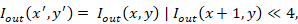
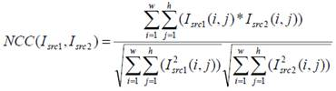

## 1 IVE Introduction

### **1.1 API List**

 NVT_IVE_Filter : General filter function

 NVT_IVE_Median : 3x3 Median filter function

 NVT_IVE_Min : 3x3 Min filter function

 NVT_IVE_Max : 3x3 Max filter function

 NVT_IVE_Sobel : 5x5 Sobel filter function

 NVT_IVE_Thresh : Image thresholding function

 NVT_IVE_Dilate : Image dilate function

 NVT_IVE_Erode : Image erode function

 NVT_IVE_Integ : Integral image function

 NVT_IVE_Canny : Canny edge function

 NVT_IVE_CSC : Color Space Conversion (CSC) function

 NVT_IVE_Histo : Histogram function

 NVT_IVE_NCC : Normalized Cross Correlation (NCC) function

## 2 Flow

Using LibIVE, main flow as following flow chart

|   |                                                                                                  |
|---|--------------------------------------------------------------------------------------------------|
|   |  |

 vendor_ive_init : Before running task, this function will open engine clock. Only need to execute this function once, do not execute repeatly.

 vendor_ive_uninit : After running task, this function will close engine clock. Only need to execute this function once, do not execute repeatly.

## 3 API

### 3.1 NVT_IVE_Filter

【Description】

Applying 7x7 general filter to input image.

【Function】

INT32 NVT_IVE_Filter (IVE_SRC_IMAGE_S\* pstSrc, IVE_DST_IMAGE_S\* pstDst, IVE_FILTER_CTRL_S\* pstFltCtrl)

【Parameter】

| **Parameter** | **Description**                | **Input/Output** |
|---------------|--------------------------------|------------------|
| pstSrc        | Input image pointer            | Input            |
| pstDst        | Output image pointer           | Output           |
| pstFltCtrl    | General filter control pointer | Input            |

| **Parameter** | **Data type** | **Alignment** | **Resolution**    |
|---------------|---------------|---------------|-------------------|
| pstSrc        | U8C1          | 4 byte        | 16x16\~16383x8191 |
| pstDst        | U8C1          | 4 byte        | Same as pstSrc    |

IVE_FILTER_CTRL_S

| **Parameter** | **Data Type** | **Description**                    |
|---------------|---------------|------------------------------------|
| u8Mask[10]    | UINT8         | General filter Mask, range : 0\~15 |

【Return Value】

| **Return Value** | **Description**                               |
|------------------|-----------------------------------------------|
| 0                | Success                                       |
| Other values     | Failure. See section “Error Code” for details |

【Requirement】

Header file: libive.h

Library file: libvendor_cv.a

【Notice】

 Filter index number as following Figure 2.21

Figure 2.21

u8Mask[0]\~ u8Mask[9] corresponds to index 0\~9

 For image border pixels, mirror padding is applied in general filter process.

【Sample】

hdal\\samples\\alg_ive_filter\\alg_ive_filter.c

【Efficiency】

 The execution time is proportional to the resolution of an image.

 The execution time of NVT_IVE_Filter is 532 , estimated by a sample (image resolution 516x376).

### 3.2 NVT_IVE_Median

【Description】

Applying 3x3 Median filter to input image.

【Function】

INT32 NVT_IVE_Median (IVE_SRC_IMAGE_S\* pstSrc, IVE_DST_IMAGE_S\* pstDst)

【Parameter】

| **Parameter** | **Description**      | **Input/Output** |
|---------------|----------------------|------------------|
| pstSrc        | Input image pointer  | Input            |
| pstDst        | Output image pointer | Output           |

| **Parameter** | **Data type** | **Alignment** | **Resolution**    |
|---------------|---------------|---------------|-------------------|
| pstSrc        | U8C1          | 4 byte        | 16x16\~16383x8191 |
| pstDst        | U8C1          | 4 byte        | Same as pstSrc    |

【Return Value】

| **Return Value** | **Description**                               |
|------------------|-----------------------------------------------|
| 0                | Success                                       |
| Other values     | Failure. See section “Error Code” for details |

【Requirement】

Header file: libive.h

Library file: libvendor_cv.a

【Notice】

 For image border pixels, mirror padding is applied in median filter process.

【Sample】

hdal\\samples\\alg_ive_median\\alg_ive_median.c

【Efficiency】

 The execution time is proportional to the resolution of an image.

 The execution time of NVT_IVE_Median is 540 , estimated by sample (image resolution 516x376).

### 3.3 NVT_IVE_Min

【Description】

Applying 3x3 Min filter to input image.

【Function】

INT32 NVT_IVE_Min (IVE_SRC_IMAGE_S\* pstSrc, IVE_DST_IMAGE_S\* pstDst)

【Parameter】

| **Parameter** | **Description**      | **Input/Output** |
|---------------|----------------------|------------------|
| pstSrc        | Input image pointer  | Input            |
| pstDst        | Output image pointer | Output           |

| **Parameter** | **Data type** | **Alignment** | **Resolution**    |
|---------------|---------------|---------------|-------------------|
| pstSrc        | U8C1          | 4 byte        | 16x16\~16383x8191 |
| pstDst        | U8C1          | 4 byte        | Same as pstSrc    |

【Return Value】

| **Return Value** | **Description**                               |
|------------------|-----------------------------------------------|
| 0                | Success                                       |
| Other values     | Failure. See section “Error Code” for details |

【Requirement】

Header file: libive.h

Library file: libvendor_cv.a

【Notice】

 For image border pixels, mirror padding is applied in min filter process.

【Sample】

hdal\\samples\\alg_ive_min\\alg_ive_min.c

【Efficiency】

 The execution time is proportional to the resolution of an image.

 The execution time of NVT_IVE_Min is 536 , estimated by sample (image resolution 516x376).

### 3.4 NVT_IVE_Max

【Description】

Applying 3x3 Max filter to input image.

【Function】

INT32 NVT_IVE_Max (IVE_SRC_IMAGE_S\* pstSrc, IVE_DST_IMAGE_S\* pstDst)

【Parameter】

| **Parameter** | **Description**      | **Input/Output** |
|---------------|----------------------|------------------|
| pstSrc        | Input image pointer  | Input            |
| pstDst        | Output image pointer | Output           |

| **Parameter** | **Data type** | **Alignment** | **Resolution**    |
|---------------|---------------|---------------|-------------------|
| pstSrc        | U8C1          | 4 byte        | 16x16\~16383x8191 |
| pstDst        | U8C1          | 4 byte        | Same as pstSrc    |

【Return Value】

| **Return Value** | **Description**                               |
|------------------|-----------------------------------------------|
| 0                | Success                                       |
| Other values     | Failure. See section “Error Code” for details |

【Requirement】

Header file: libive.h

Library file: libvendor_cv.a

【Notice】

 For image border pixels, mirror padding is applied in max filter process.

【Sample】

hdal\\samples\\alg_ive_max\\alg_ive_max.c

【Efficiency】

 The execution time is proportional to the resolution of an image.

 The execution time of NVT_IVE_Max is 541 , estimated by sample (image resolution 516x376).

### 3.5 NVT_IVE_Sobel

【Description】

Applying 5x5 Sobel filter to input image.

【Function】

INT32 NVT_IVE_Sobel (IVE_SRC_IMAGE_S\* pstSrc, IVE_DST_IMAGE_S\* pstDst, IVE_SOBEL_CTRL_S\* pstSobelCtrl)

【Parameter】

| **Parameter** | **Description**                          | **Input/Output** |
|---------------|------------------------------------------|------------------|
| pstSrc        | Input image pointer                      | Input            |
| pstDst        | Output gradient x/y packed image pointer | Output           |
| pstSobelCtrl  | Edge filter parameter pointer            | Input            |

| **Parameter** | **Data type** | **Alignment** | **Resolution**    |
|---------------|---------------|---------------|-------------------|
| pstSrc        | U8C1          | 4 byte        | 16x16\~16383x8191 |
| pstDst        | S16C1         | 4 byte        | 16x16\~16383x8191 |

IVE_SOBEL_CTRL_S

| **Parameter** | **Data Type** | **Description**                   |
|---------------|---------------|-----------------------------------|
| s8Mask[25]    | S8            | Edge filter Mask, range : -15\~15 |

【Return Value】

| **Return Value** | **Description**                               |
|------------------|-----------------------------------------------|
| 0                | Success                                       |
| Other values     | Failure. See section “Error Code” for details |

【Requirement】

Header file: libive.h

Library file: libvendor_cv.a

【Notice】

 User can set s8Mask for calculating gradient x, and the library will transpose and flip the mask for calculating gradient y. The mask index is shown as below:

| 0  | 1  | 2  | 3  | 4  |
|----|----|----|----|----|
| 5  | 6  | 7  | 8  | 9  |
| 10 | 11 | 12 | 13 | 14 |
| 15 | 16 | 17 | 18 | 19 |
| 20 | 21 | 22 | 23 | 24 |

 User can set pstDst format as S16C1. If user set as S16C1, the output will be signed 8 bit gradient x/y packed format(gradient x signed 8bit + gradient y signed 8bit per pixel).

【Sample】

hdal\\samples\\alg_ive_sobel\\alg_ive_sobel.c

【Efficiency】

 The execution time is proportional to the resolution of an image.

 The execution time of NVT_IVE_Sobel is 556 , estimated by sample (image resolution 516x376).

### 3.6 NVT_IVE_Thresh

【Description】

NVT_IVE_Thresh applies two user-defined thresholds to partition an input image into a tenary image.

【Function】

INT32 NVT_IVE_Thresh (IVE_SRC_IMAGE_S\* pstSrc, IVE_DST_IMAGE_S\* pstDst, IVE_THRESH_CTRL_S\* pstThrCtrl)

【Parameter】

| **Parameter** | **Description**              | **Input/Output** |
|---------------|------------------------------|------------------|
| pstSrc        | Input image pointer          | Input            |
| pstDst        | Output image pointer         | Output           |
| pstThrCtrl    | Thresholding control pointer | Input            |

| **Parameter** | **Data type** | **Alignment** | **Resolution**   |
|---------------|---------------|---------------|------------------|
| pstSrc        | U8C1          | 4 byte        | 64x64\~1920x1080 |
| pstDst        | U8C1          | 4 byte        | Same as pstSrc   |

IVE_THRESH_CTRL_S

| **Parameter**   | **Data type** | **Description**                                  |
|-----------------|---------------|--------------------------------------------------|
| u8LutThresh[15] | U8            | 15 threshold levels: 0-255 (strictly increasing) |

【Return Value】

| **Return Value** | **Description**                               |
|------------------|-----------------------------------------------|
| 0                | Success                                       |
| Other values     | Failure. See section “Error Code” for details |

【Requirement】

Header file: libive.h

Library file: libvendor_cv.a

【Notice】

 NVT_IVE_Thresh partitions image pixels into a 4bits image by LutThresh. The value of each output pixel could be 0-15. Each output pixel (U8C1) is the packed format by two neighbor pixel (LSB 4bit represent odd pixel, MSB 4bit represent even pixel).

 Packed output format is shown as:

【Sample】

hdal\\samples\\alg_ive_thresh\\alg_ive_thresh.c

【Efficiency】

 The execution time is proportional to the resolution of an image.

 The execution time of NVT_IVE_Thresh is 500 , estimated by sample (image resolution 316x316).

### 3.7 NVT_IVE_Dilate

【Description】

Image dilation uses a 5x5 structural element to expand the shapes contained in input image.

【Function】

INT32 NVT_IVE_Dilate (IVE_SRC_IMAGE_S\* pstSrc, IVE_DST_IMAGE_S\* pstDst, IVE_MORPH_CTRL_S\* pstDilateCtrl)

【Parameter】

| **Parameter** | **Description**          | **Input/Output** |
|---------------|--------------------------|------------------|
| pstSrc        | Input image pointer      | Input            |
| pstDst        | Output image pointer     | Output           |
| pstDilateCtrl | Dilation control pointer | Input            |

| **Parameter** | **Data type** | **Alignment** | **Resolution**    |
|---------------|---------------|---------------|-------------------|
| pstSrc        | U8C1          | 4 byte        | 16x16\~16383x8191 |
| pstDst        | U8C1          | 4 byte        | Same as pstSrc    |

IVE_MORPH_CTRL_S

| **Parameter** | **Data Type** | **Description**                 |
|---------------|---------------|---------------------------------|
| u8Mask[24]    | U8            | Structural element coefficients |

【Return Value】

| **Return Value** | **Description**                               |
|------------------|-----------------------------------------------|
| 0                | Success                                       |
| Other values     | Failure. See section “Error Code” for details |

【Requirement】

Header file: libive.h

Library file: libvendor_cv.a

【Notice】

 The coefficients of structural element must be 0 or 1.

 The 5x5 structural element is described by array **u8Mask** which contains 24 coefficients and the corresponding position in 2D space is

Dilation uses a specified structural element to slide whole image and the process can be described as below

*for each image pixel* **p** in input image **I**in {

*max =* **I**in(**p**)

*for(i=0; i\<24; i++)* {

*if(mask(i)==1 &&* **I**in*(***q***(i)) \> max)*

*//* **q***(i)* is the corresponding pixel of coefficient *i*

*// max =* **I**in*(***q***(i))*

}

**I**out*(***p***) = max*

}

 For image border pixels, mirror padding is applied in dilation process.

【Sample】

hdal\\samples\\alg_ive_dilate\\alg_ive_dilate.c

【Efficiency】

 The execution time is proportional to the resolution of an image.

 The execution time of NVT_IVE_Dilate is 346 , estimated by sample (image resolution 316x316).

### 3.8 NVT_IVE_Erode

【Description】

Image erosion uses a 5x5 structural element to reduce the shapes contained in input image.

【Function】

INT32 NVT_IVE_Erode (IVE_SRC_IMAGE_S\* pstSrc, IVE_DST_IMAGE_S\* pstDst, IVE_MORPH_CTRL_S\* pstErodeCtrl)

【Parameter】

| **Parameter** | **Description**         | **Input/Output** |
|---------------|-------------------------|------------------|
| pstSrc        | Input image             | Input            |
| pstDst        | Output image            | Output           |
| pstErodeCtrl  | Erosion control pointer | Input            |

| **Parameter** | **Data type** | **Alignment** | **Resolution**    |
|---------------|---------------|---------------|-------------------|
| pstSrc        | U8C1          | 4 byte        | 16x16\~16383x8191 |
| pstDst        | U8C1          | 4 byte        | Same as pstSrc    |

IVE_MORPH_CTRL_S

| **Parameter** | **Data Type** | **Description**                 |
|---------------|---------------|---------------------------------|
| u8Mask[24]    | U8            | Structural element coefficients |

【Return Value】

| **Return Value** | **Description**                               |
|------------------|-----------------------------------------------|
| 0                | Success                                       |
| Other values     | Failure. See section “Error Code” for details |

【Requirement】

Header file: libive.h

Library file: libvendor_cv.a

【Notice】

 The coefficients of structural element must be 0 or 1.

 The 5x5 structural element is described by array **u8Mask** which contains 24 coefficients and the corresponding position in 2D space is

Erosion uses a specified structural element to slide whole image and the process can be described as below

*for each image pixel* **p** in input image **I**in {

*min =* **I**in(**p**)

*for(i=0; i\<24; i++)* {

*if(mask(i)==1 &&* **I**in*(***q***(i)) \< min)*

*//* **q***(i)* is the corresponding pixel of coefficient *i*

*// min =* **I**in*(***q***(i))*

}

**I**out*(***p***) = min*

}

 For image border pixels, mirror padding is applied in erosion process.

【Sample】

hdal\\samples\\alg_ive_erode\\alg_ive_erode.c

【Efficiency】

 The execution time is proportional to the resolution of an image.

 The execution time of NVT_IVE_Erode is 352 , estimated by sample (image resolution 316x316).

### 3.9 NVT_IVE_Integ

【Description】

This function calculates the sum of values in a rectangular subset of a grid:

【Function】

INT32 NVT_IVE_Integ (IVE_SRC_IMAGE_S\* pstSrc, IVE_DST_IMAGE_S\* pstDst, IVE_INTEG_CTRL_S \*pstIntegCtrl)

【Parameter】

| **Parameter** | **Description**          | **Input/Output** |
|---------------|--------------------------|------------------|
| pstSrc        | Input image pointer      | Input            |
| pstDst        | Output image pointer     | Output           |
| pstIntegCtrl  | Integral control pointer | Input            |

| **Parameter** | **Data type** | **Alignment** | **Resolution**   |
|---------------|---------------|---------------|------------------|
| pstSrc        | U8C1          | 4 byte        | 16x16\~1920x8191 |
| pstDst        | U32C1         | 4 byte        | Same as pstSrc   |

IVE_INTEG_CTRL_S

| **Parameter** | **Data Type**            | **Description**                  |
|---------------|--------------------------|----------------------------------|
| enInFormat    | LIB_IVE_INTEGRAL_IN_FMT  | 0: 1 channel 1: 2 channel packed |
| enOutFormat   | LIB_IVE_INTEGRAL_OUT_FMT | 0: sum                           |

【Return Value】

| **Return Value** | **Description**                               |
|------------------|-----------------------------------------------|
| 0                | Success                                       |
| Other values     | Failure. See section “Error Code” for details |

【Requirement】

Header file: libive.h

Library file: libvendor_cv.a

【Notice】

The input format supports 1 channel 8 bit / 2 channel 8 bit packed. The output format supports integral sum (32bit).

【Sample】

Sample code : samples\\alg_ive_integral\\alg_ive_integral.c

【Efficiency】

 The execution time is proportional to the resolution of an image.

 The execution time of NVT_IVE_Integral is 694 , estimated by sample (image resolution 316x316).

### 3.10 NVT_IVE_Canny

【Description】

NVT_IVE_Canny extract edges in a gray scale image by following steps

 Image smoothing

 Image gradient and gradient magnitude calculation

 Non-maximun suppression

【Function】

INT32 NVT_IVE_Canny (IVE_SRC_IMAGE_S\* pstSrc, IVE_DST_IMAGE_S\* pstDst, IVE_CANNY_CTRL_S\* pstCannyCtrl)

【Parameter】

| **Parameter** | **Description**                | **Input/Output** |
|---------------|--------------------------------|------------------|
| pstSrc        | Input image pointer            | Input            |
| pstDst        | Output image pointer           | Output           |
| pstCannyCtrl  | Edge detection control pointer | Input            |

| **Parameter** | **Data type** | **Alignment** | **Resolution**    |
|---------------|---------------|---------------|-------------------|
| pstSrc        | U8C1          | 4 byte        | 16x16\~16383x8191 |
| pstDst        | U8C1          | 4 byte        | Same as pstSrc    |

【Return Value】

| **Return Value** | **Description**                               |
|------------------|-----------------------------------------------|
| 0                | Success                                       |
| Other values     | Failure. See section “Error Code” for details |

【Requirement】

Header file: libive.h

Library file: libvendor_cv.a

【Notice】

 The edge detection process uses a 7x7 kernel to smooth input image. The smoothing kernel is described by an array with 10 elements, **s8Mask**, and the corresponding position in 2D space is

The valid value range of **s8Mask** is [-15, 15].

【Sample】

hdal\\samples\\alg_ive_canny\\alg_ive_canny.c

【Efficiency】

 The execution time is proportional to the resolution of an image.

 The execution time of NVT_IVE_Canny is 367 , estimated by sample (image resolution 316x316).

### 3.11 NVT_IVE_CSC

【Description】

NVT_IVE_CSC can do color space conversion from YUV to RGB or HSV or LAB.

【Function】

INT32 NVT_IVE_CSC (IVE_SRC_IMAGE_S\* pstSrc, IVE_DST_IMAGE_S\* pstDst, IVE_CSC_CTRL_S\* pstCscCtrl)

【Parameter】

| **Parameter** | **Description**      | **Input/Output** |
|---------------|----------------------|------------------|
| pstSrc        | Input image pointer  | Input            |
| pstDst        | Output image pointer | Output           |
| pstCscCtrl    | CSC control pointer  | Input            |

| **Parameter** | **Data type** | **Alignment** | **Resolution**   |
|---------------|---------------|---------------|------------------|
| pstSrc        | U8C1          | 4 byte        | 16x16\~4096x8191 |
| pstDst        | U8C1          | 4 byte        | Same as pstSrc   |

IVE_CSC_CTRL_S

| **Parameter** | **Data Type**       | **Description**                  |
|---------------|---------------------|----------------------------------|
| enCSCMode     | LIB_IVE_CSC_MODE    | 0: YUV2RGB 1: YUV2HSV 2: YUV2LAB |
| enOutFmt      | LIB_IVE_CSC_OUT_FMT | 0: PLANAR 1: PACKED              |
| enLabFmt      | LIB_IVE_CSC_LAB_FMT | 0: D65 1: D50                    |
| enRgbFmt      | LIB_IVE_CSC_RGB_FMT | 0: BT601 1: BT709 2: JPG encoder |

【Return Value】

| **Return Value** | **Description**                               |
|------------------|-----------------------------------------------|
| 0                | Success                                       |
| Other values     | Failure. See section “Error Code” for details |

【Requirement】

Header file: libive.h

Library file: libvendor_cv.a

【Notice】

 Only support YUV420SP(NV12)/YVU420SP(NV21)/YUV422 input

YUV420SP(NV12):

YVU420SP(NV21):

YUV422 support UYVY、YUYV、VYUY、YVYU 4 types.

 Output format PLANAR/ PACKED as following figure

PLANAR:

pstDst-\>u32Stride = width

PACKED:

pstDst-\>u32Stride = 3\*width

 YUV2RGB : YUV-\>RGB -\>Gamma Correction

YUV2HSV : YUV -\>RGB -\>Gamma correction -\>HSV

YUV2LAB : YUV -\>RGB -\>Gamma correction -\>LAB

enRgbFmt should be set for all enCSCMode.

【Sample】

hdal\\samples\\alg_ive_csc\\alg_ive_csc.c

【Efficiency】

 The execution time is proportional to the resolution of an image.

 The execution time of NVT_IVE_Canny is 569 , estimated by sample (image resolution 512x376).

### 3.12 NVT_IVE_Histo

【Description】

NVT_IVE_Histo can calculate histogram for input image.

【Function】

INT32 NVT_IVE_Histo (IVE_SRC_IMAGE_S\* pstSrc, IVE_DST_IMAGE_S\* pstDst)

【Parameter】

| **Parameter** | **Description**                 | **Input/Output** |
|---------------|---------------------------------|------------------|
| pstSrc        | Input image pointer             | Input            |
| pstDst        | Output histogram result pointer | Output           |

| **Parameter** | **Data type** | **Alignment** | **Resolution**   |
|---------------|---------------|---------------|------------------|
| pstSrc        | U8C1          | 4 byte        | 64x64\~1920x1080 |
| pstDst        | U8C1          | 4 byte        | 1024 byte        |

【Return Value】

| **Return Value** | **Description**                               |
|------------------|-----------------------------------------------|
| 0                | Success                                       |
| Other values     | Failure. See section “Error Code” for details |

【Requirement】

Header file: libive.h

Library file: libvendor_cv.a

【Notice】

 Histogram output size = 256(bin) x 4(byte) = 1024(byte)

【Sample】

hdal\\samples\\alg_ive_histo\\alg_ive_histo.c

【Efficiency】

 The execution time is proportional to the resolution of an image.

 The execution time of NVT_IVE_Histo is 644 , estimated by a sample (image resolution 512x376).

### 3.13 NVT_IVE_NCC

【Description】

NVT_IVE_NCC can calculate normalized cross correlation. The formula is shown below:

【Function】

INT32 NVT_IVE_NCC (IVE_SRC_IMAGE_S\* pstSrc1, IVE_SRC_IMAGE_S\* pstSrc2, IVE_NCC_INFO_S\* pstDst)

【Parameter】

| **Parameter** | **Description**          | **Input/Output** |
|---------------|--------------------------|------------------|
| pstSrc1       | Input image pointer      | Input            |
| pstSrc2       | Input image pointer      | Input            |
| pstDst        | Ouput NCC result pointer | Output           |

| **Parameter** | **Data type**  | **Alignment** | **Resolution**   |
|---------------|----------------|---------------|------------------|
| pstSrc1       | U8C1           | 4 byte        | 32x32\~1920x1080 |
| pstSrc2       | U8C1           | 4 byte        | Same as pstSrc1  |
| pstDst        | Data structure | -             | -                |

IVE_NCC_INFO_S

| **Parameter** | **Data Type** | **Description**           |
|---------------|---------------|---------------------------|
| u64Numerator  | UINT64        | NCC numerator             |
| u64QuadSum1   | UINT64        | NCC quad sum from pstSrc1 |
| u64QuadSum2   | UINT64        | NCC quad sum from pstSrc2 |

【Return Value】

| **Return Value** | **Description**                               |
|------------------|-----------------------------------------------|
| 0                | Success                                       |
| Other values     | Failure. See section “Error Code” for details |

【Requirement】

Header file: libive.h

Library file: libvendor_cv.a

【Notice】

 After trigger NVT_IVE_NCC, calculation result is stored in pstDst.

【Sample】

hdal\\samples\\alg_ive_ncc\\alg_ive_ncc.c

【Efficiency】

 The execution time is proportional to the resolution of an image.

 The execution time of NVT_IVE_NCC is 537 , estimated by a sample (image resolution 512x376).

## 4 Error Code

| **Return value**   | **Description**                |
|--------------------|--------------------------------|
| LIB_IVE_OK         | Execute success                |
| LIB_IVE_ERR_PARAM  | Lib IVE param setting failure  |
| LIB_IVE_ERR_INIT   | IVE hardware init failure      |
| LIB_IVE_ERR_LOCK   | IVE hardware lock failure      |
| LIB_IVE_ERR_SET    | IVE hardware set param failure |
| LIB_IVE_ERR_GET    | IVE hardware get param failure |
| LIB_IVE_ERR_TRIG   | IVE hardware trigger failure   |
| LIB_IVE_ERR_UNLOCK | IVE hardware unlock failure    |
| LIB_IVE_ERR_UNINIT | IVE hardware uninit failure    |

## 5 Revision History

| **Revision** | **Date** | **Author** | **Changes**                                                                                   |
|--------------|----------|------------|-----------------------------------------------------------------------------------------------|
| 1.0          | 2022/5/9 | Ethan Wang | First Version.                                                                                |
| 1.1          | 2022/8/2 | Ethan Wang | 1. Add initialized & uninitialized IVE’s function. 2. Update execution time of each function. |
