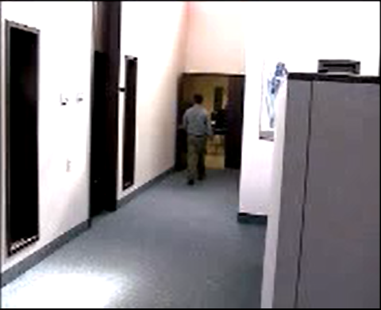
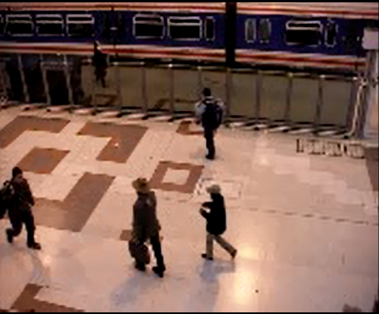
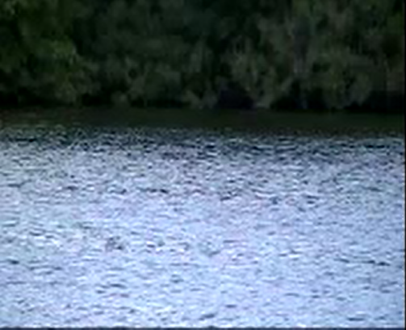
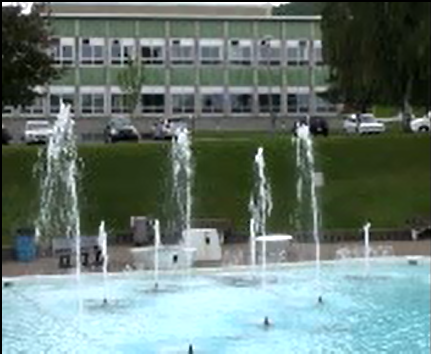
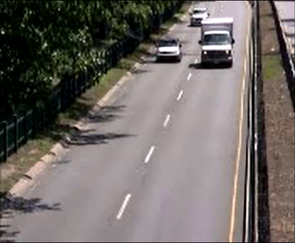
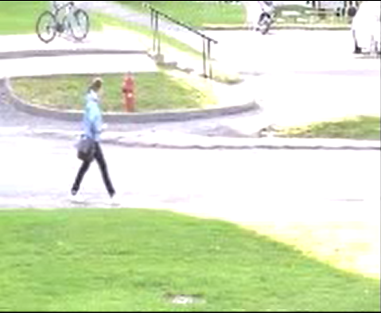
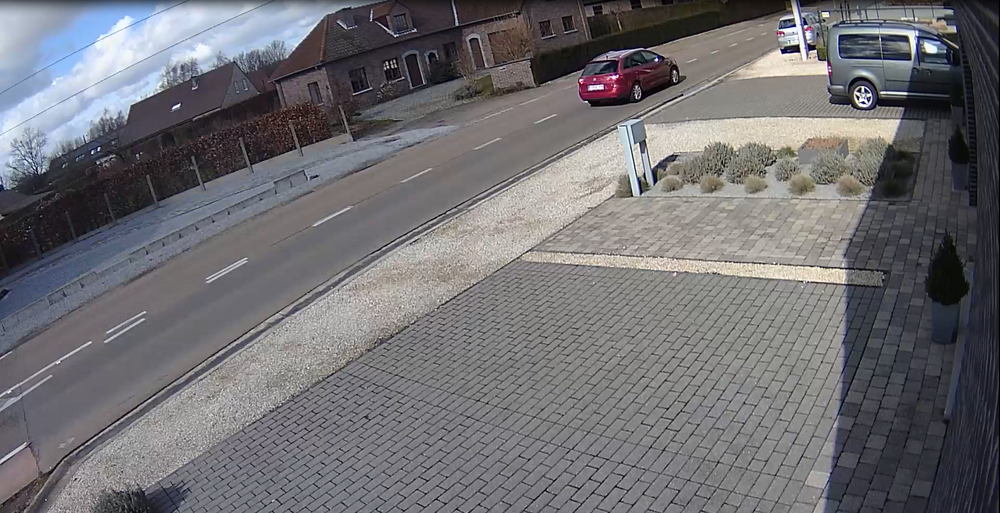
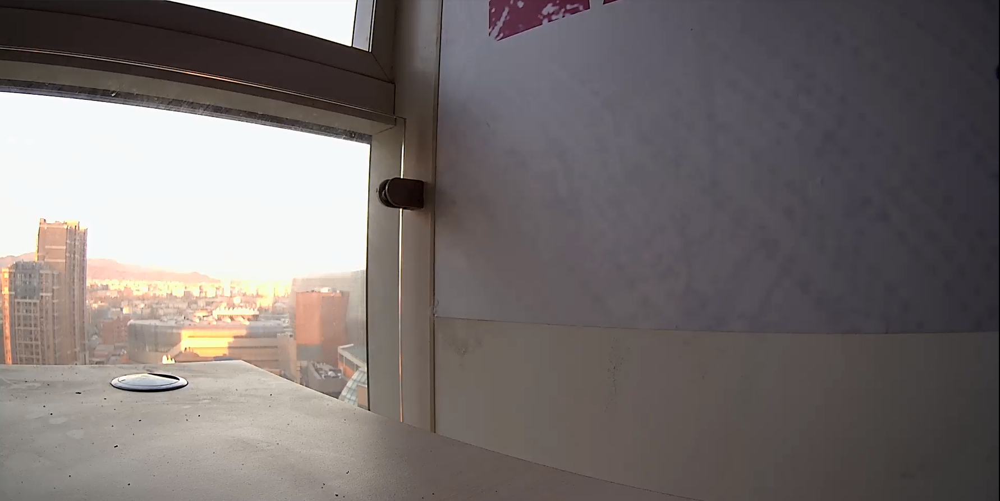

## Ten Sets of MD Parameters

### Overview

We provide 10 sets of parameters of MD model for different sensitive degree (1\~10, and 10 means the most sensitive parameters set). MD with a more sensitive parameter set can produce results with a lower miss rate and higher false alarm.

### Scene Test

The MD performance is evaluated using video tests and real-world tests.

-   Video test
    -   Indoor

         

        Shadow remove = 1 Shadow remove = 0

    -   Stable moving scene

         

    -   Outdoor

         

    -   Dramatic AE changes scene

         

-   Real-world tests
    -   Un-moving object. (e.g. a statue in the room)
    -   Repetitively change of scenarios. (e.g. two images are played alternately every 15 seconds)
    -   Progressive change of light in the scene.
    -   Objects which keep moving in the scene.

### Test Result

| sensitive | ALPHA | TB | SIGMA | Shadow remove |
|-----------|-------|----|-------|---------------|
| 10        | 32    | 11 | 7     | 0             |
| 9         | 65    | 11 | 7     | 0             |
| 8         | 164   | 11 | 7     | 0             |
| 7         | 262   | 11 | 7     | 0             |
| 6         | 320   | 11 | 7     | 1             |
| 5         | 320   | 16 | 7     | 1             |
| 4         | 320   | 25 | 7     | 1             |
| 3         | 640   | 25 | 7     | 1             |
| 2         | 1200  | 11 | 7     | 1             |
| 1         | 1200  | 25 | 7     | 1             |

| DEFAULT                     |   |   |   |
|-----------------------------|---|---|---|
| TBG = 29490                 |   |   |   |
| ONE_MIN_ALPHA = 32768-ALPHA |   |   |   |
| INIT_WEIGHT=7               |   |   |   |
| MODEL_UPDATE =0             |   |   |   |
| TG=9                        |   |   |   |
| PRUNE=ALPHA\*1.6            |   |   |   |

| **Shadow remove = 0** |   |   |
|-----------------------|---|---|
| LUMA_DIFF_THRES =0    |   |   |
| TEXT_DIFF_THRES=0     |   |   |
| TEXT_THRES=50         |   |   |
| TEXT_RATIO_THRES=127  |   |   |

| **Shadow remove = 1** |   |   |
|-----------------------|---|---|
| LUMA_DIFF_THRES =30   |   |   |
| TEXT_DIFF_THRES=50    |   |   |
| TEXT_THRES=50         |   |   |
| TEXT_RATIO_THRES=50   |   |   |

### Tuning Suggestion

-   In the case of dramatic light change or moving shadow, a higher *ALPHA* value is suggested to reduce the false alarm. However, the side effect is that a slowly moving object might be detected as background.
-   In the case of dark shadow, a higher *TB* value is suggested. The side effect is that the detected foreground of object might be broken.
-   If the result of motion detection is not stable, we suggest to adjust *TG* to get a more stable result.

### Scene Suggestion

-   MD is not suitable for the moment when turning on or turning off the light. The results of MD should be skipped at this moment for about 10 seconds.
-   MD should be used with a fixed-camera which captures a stable scene. Once camera moves, MD might need more time to get a stable background model.
-   The size of a detected moving object should be larger than 1 micro-block (MB)

## Revision History

| **Revision** | **Date**   | **Author** | **Changes**                            |
|--------------|------------|------------|----------------------------------------|
| 0.1          | 2021/06/30 | Sophia     | First formal version                   |
| 0.2          | 2021/07/02 | Sophia     | Update document format and description |
