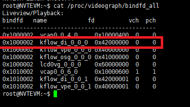
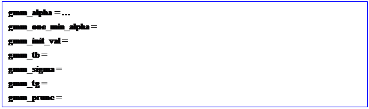
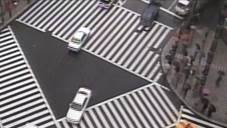
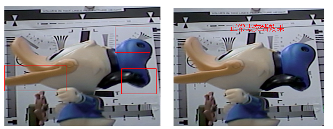
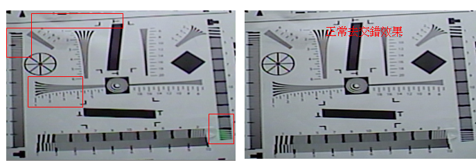
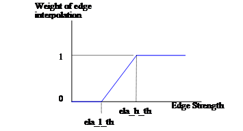

## System Control

### 1.1 Parameter Description

| **Parameter** | **Range** | **Def** | **Description**                                                                                                                                    |
|---------------|-----------|---------|----------------------------------------------------------------------------------------------------------------------------------------------------|
| ch_fd         |           |         | Video graph use ch_fd to represent the connected video engine of each channel. User can fine tune parameter of each video engine by setting ch_fd. |

### 1.2 Setting Interface

#### 1.2.1 Proc

Proc command designates the desired camera to be fine tuned by camera channel’s fd.

######  /proc/videograph/di/ch_fd

**[Description]**

Read or write the current camera channel, and it only needs to set once, the following parameters will work on this channel.

The following proc command will list all ch_fd of the current video engine.

**[Command]**

**Write :**

| **proc command**                       | **Target Parameter**    |
|----------------------------------------|-------------------------|
| echo [fd] \> /proc/videograph/di/ch_fd | **Fw Internal Pointer** |

Read : cat /proc/videograph/di/ch_fd

**![文字方塊: Command : echo [fd] \> /proc/videograph/di/ch_fd Current channel = ch_fd ](nvt_media/2908b0054f8994b811ea259059987363.png)**

## 2 GMM

The motion detection module in DI module is not used for motion detection alarm; instead, it provides the motion detection information to DI algorithm to increase the interpolation accuracy of transforming interlace image to progressive image.

#### 2.1.1 Parameter Description

Table 31 MD Parameter List

| **Parameter**     | **Range**     | **Def** | **Description**                                                                                                                          |
|-------------------|---------------|---------|------------------------------------------------------------------------------------------------------------------------------------------|
| gmm_alpha         | 0\~32767      | 32      | Update speed of background model( fit model).                                                                                            |
| gmm_one_min_alpha | 0\~32767      | 32736   | Update speed of background model(non-fit model). Recommend value = 2\^15- gmm_alpha                                                      |
| gmm_init_val      | 0\~255        | 7       | The restart learining weighting of the background model.                                                                                 |
| gmm_tb            | 0\~15         | 9       | Evaluate the similar level with the current background model to decide whether it is foreground.                                         |
| gmm_sigma         | 0\~31         | 11      | The standard deviation for the newly generated model. It will influence the model tolerance.                                             |
| gmm_tg            | 0\~15         | 9       | Threshold for evaluating whether the model need to be updated.                                                                           |
| gmm_prune         | -217 \~ 217-1 | -8207   | prune = -(alpha \* CT)\*8191/256; weight attenuation value CT – complexity reduction prior, this is related to number of samples. CT = 8 |

######  Advance description:

 **gmm_alpha**：update speed of background model  
If “gmm_alpha” set too large, it will easily to misjudge the motion object to background. For de-interlace application, it will result in fractured image. If “gmm_alpha” set too small, it will easily to misjudge tiny light/shadow change to motion object. For de-interlace application, it will result in blur image.  
For indoor(without light/shadow change) scene, the recommend value is 32. For other scenes with light/shadow change, it is recommend to properly increase this value(not larger than 327). For outdoor scene, due to the influence of light/shadow change need to be excluded, the recommend value is between 327\~1200.

 **gmm_sigma**：The standard deviation of model. The parameter “gmm_tb” and “gmm_sigma” are used to decide the static model together. The larger the “gmm_sigma”, the more easily to be determined as static object.

 **gmm_tb**：“gmm_sigma” and “gmm_tb” will influence the completion of motion detection. If the detected motion block of motion object is fractured(not continuous), it is recommend to properly increase “ gmm_tb”.

 **gmm_purne：**The smaller(more negative) “gmm_purne”, the quicker learning speed of new model. However, for small motion, it will more easily to be misjudged to background. And it will also influence the motion detection sensitivity(the same as “gmm_alpha”), it is recommend to adopt default value, and using “gmm_alpha” to fine tune sensitivity.

### 2.2 Setting Interface

#### 2.2.1 Proc

######  /proc/videograph/di/gmm/dump_info

**[Description]**

Read all GMM parameters of the current camera channel.

**[Command]**

**Write : Not Support**

**Read : cat /proc/videograph/di/gmm/dump_info**

**Output: **

######  /proc/videograph/di/gmm/enable

**[Description]**

Read or witer the GMM enable status of the current camera channel.

**[Command]**

**Write :**

| **proc command**                                           | **Target Parameter** |
|------------------------------------------------------------|----------------------|
| **echo [enable 0 \~ 1] \> /proc/videograph/di/gmm/enable** | **gmm_en**           |

**Read : cat /proc/videograph/di/gmm/enable**

**Output: ![文字方塊: Command : echo [enable 0\~1] \> /proc/videograph/di/gmm/enable channel \<ch_no\> = gmm_en ](nvt_media/5839dec46b55b4dfe46ad71063d323d6.png)**

######  /proc/videograph/di/gmm/alpha

**[Description]**

Read or write the GMM/alpha parameter of the current camera channel.

**[Command]**

**Write :**

| **proc command**                                             | **Target Parameter** |
|--------------------------------------------------------------|----------------------|
| **echo [alpha 0 \~ 32767] \> /proc/videograph/di/gmm/alpha** | **gmm_alpha**        |

**Read : cat /proc/videograph/di/gmm/alpha**

**Output: ![文字方塊: Command : echo [alpha 0\~32767] \> /proc/videograph/di/gmm/alpha gmm_alpha = gmm_alpha ](nvt_media/75b1f637d8157c80819daf498de42f28.png)**

######  /proc/videograph/di/gmm/one_alpha

**[Description]**

Read or write the GMM parameter of the current camera channel.

**[Command]**

**Write :**

| **proc command**                                                 | **Target Parameter**  |
|------------------------------------------------------------------|-----------------------|
| **echo [alpha 0 \~ 32767] \> /proc/videograph/di/gmm/one_alpha** | **gmm_one_min_alpha** |

**Read : cat /proc/videograph/di/gmm/one_alpha**

**Output: ![文字方塊: Command : echo [alpha 0 \~ 32767] \> /proc/videograph/di/gmm/one_alpha gmm_one_min_alpha = gmm_one_min_alpha ](nvt_media/d30c7982ca60400f098e351f1a718a82.png)**

######  /proc/videograph/di/gmm/init_val

**[Description]**

Read or write the GMM parameter of the current camera channel.

**[Command]**

**Write :**

| **proc command**                                          | **Target Parameter** |
|-----------------------------------------------------------|----------------------|
| **echo [value 0 \~ 255] \> /proc/videograph/di/init_val** | **gmm_init_val**     |

**Read : cat /proc/videograph/di/gmm/init_val**

**Output: ![文字方塊: Command: echo [value 0 \~ 255] \> /proc/videograph/di/init_val gmm_init_val = gmm_init_val ](nvt_media/2a1ae062d6732e0fee393d9cc77631e7.png)**

######  /proc/videograph/di/gmm/tb

**[Description]**

Read or write the GMM/gmm_tb parameter of the current camera channel.

**[Command]**

**Write :**

| **proc command**                                    | **Target Parameter** |
|-----------------------------------------------------|----------------------|
| **echo [tb 0 \~ 15] \> /proc/videograph/di/gmm/tb** | **gmm_tb**           |

**Read : cat /proc/videograph/di/gmm/tb**

**Output: ![文字方塊: Command : echo [tb 0 \~ 15] \> /proc/videograph/di/gmm/tb gmm_tb = gmm_tb ](nvt_media/15046c9be18238463572d0ebeb8c4333.png)**

######  /proc/videograph/di/gmm/sigma

**[Description]**

Read or write the GMM/sigma parameter of the current camera channel.

**[Command]**

**Write :**

| **proc command**                                        | **Target Parameter** |
|---------------------------------------------------------|----------------------|
| **echo [sigma 0\~31] \> /proc/videograph/di/gmm/sigma** | **gmm_sigma**        |

**Read : cat /proc/videograph/di/gmm/sigma**

**Output: ![文字方塊: Command : echo [sigma 0\~31] \> /proc/videograph/di/gmm/sigma gmm_sigma = gmm_sigma ](nvt_media/22bfd47a9e659cbed19349e646e48ee7.png)**

######  /proc/videograph/di/gmm/tg

**[Description]**

Read or write the GMM/gmm_tg parameter of the current camera channel.

**[Command]**

**Write :**

| **proc command**                                    | **Target Parameter** |
|-----------------------------------------------------|----------------------|
| **echo [tg 0 \~ 15] \> /proc/videograph/di/gmm/tg** | **gmm_tg**           |

**Read : cat /proc/videograph/di/gmm/tg**

**Output: ![文字方塊: Command : echo [tg 0\~15] \> /proc/videograph/di/gmm/tg gmm_tg = gmm_tg ](nvt_media/d911454b607d1206dece42d28c44ee4f.png)**

######  /proc/videograph/di/gmm/prune

**[Description]**

Read or write the GMM/gmm_prune parameter of the current camera channel.

**[Command]**

**Write :**

| **proc command**                                                        | **Target Parameter** |
|-------------------------------------------------------------------------|----------------------|
| **echo [prune** -131072 \~ 131071**] \> /proc/videograph/di/gmm/prune** | **gmm_prune**        |

**Read : cat /proc/videograph/di/gmm/prune**

**Output: ![文字方塊: Command : echo [prune -131072\~131071] \> /proc/videograph/di/gmm/prune gmm_prune = gmm_prune ](nvt_media/921a037e16fe097e0ad25931ef364171.png)**

## 3 TMNR

This is temporal noise reduction module(abbreviation is TMNR). Although this function is temporal noise reduction, its major purpose is to increase the interpolation accuracy of transforming interlace image to progressive image. If user need to enhance the temporal denoise strength of video, it is recommend to use TMNR in VPE. Please note that the concept and parameter of DI/TMNR and VPE/TMNR is totally different.

### 3.1 Parameter Description

Table 41 TMNR Parameter List

| **Parameter**     | **Range** | **Def** | **Description**                                                                                                                                                                                                                                                                                                      |
|-------------------|-----------|---------|----------------------------------------------------------------------------------------------------------------------------------------------------------------------------------------------------------------------------------------------------------------------------------------------------------------------|
| tmnr_en           | 0\~1      | 1       | TMNR ON                                                                                                                                                                                                                                                                                                              |
| tmnr_learn_en     | 0\~1      | 1       | Enable internal TMNR library for automatically calculating noise level                                                                                                                                                                                                                                               |
| y_var             | 0\~64     | 20      | Luma pixel 3DNR strength                                                                                                                                                                                                                                                                                             |
| cb_var            | 0\~64     | 12      | Cb pixel 3DNR strength Please refer to advance description.                                                                                                                                                                                                                                                          |
| cr_var            | 0\~64     | 12      | Cr pixel 3DNR strength Please refer to advance description                                                                                                                                                                                                                                                           |
| k                 | 1\~8      | 3       | Adjust the threshold for determining motion object. Please refer to advance description.                                                                                                                                                                                                                             |
| auto_k            | 0\~1      | 0       | Enable function for firmware automatically fine tune K.                                                                                                                                                                                                                                                              |
| auto_k_hi         | 2\~5      | 5       | Automatically fine tune the upper limit of K.                                                                                                                                                                                                                                                                        |
| auto_k_lo         | 1\~3      | 2       | Automatically fine tune the lower limit of K.                                                                                                                                                                                                                                                                        |
| trade_thres       | 0\~128    | 64      | The blending weight of external var and internal var.                                                                                                                                                                                                                                                                |
| suppress_strength | 2\~64     | 24      | The maximum NR mask strength of static point.                                                                                                                                                                                                                                                                        |
| nf                | 1\~6      | 5       | The normalized parameter of variance of internal calculation. The larger the “nf”, the smaller the NR strength calculated by internal.                                                                                                                                                                               |
| var_offset        | 0\~15     | 2       | The maximum variance difference of neighbor block.                                                                                                                                                                                                                                                                   |
| motion_var        | 1\~20     | 8       | The variance of motion block. This value influence the temporal noise reduction strength of motion block. The recommend value is Y_var / 3.                                                                                                                                                                          |
| motion_th_mult    | 1\~100    | 3       | The threshold for determining whether it is motion block. The smaller the value, the more easily to be determined as motion block. The recommend value is 2\~3.                                                                                                                                                      |
| tmnr_fcs_en       | 0\~1      | 0       | Enable temporal false color suppression function. Please refer to advance description.                                                                                                                                                                                                                               |
| tmnr_fcs_th       | 0\~255    | 16      | Threshold for determining temporal false color.                                                                                                                                                                                                                                                                      |
| tmnr_fcs_weight   | 0\~16     | 8       | Strength of temporal false color suppression.                                                                                                                                                                                                                                                                        |
| dpr_en            | 0\~1      | 0       | TMNR temporal DPC ON/OFF                                                                                                                                                                                                                                                                                             |
| dpr_motion_th     | 0\~255    | 64      | Threshold for determining whether it is temporal defect pixel. The smaller the “dpr_motion_th”, the more easily to be determined as temporal defect pixel.                                                                                                                                                           |
| dpr_cnt_th        | 0\~15     | 1       | Threshold for determing temporal defect pixel, if the number of surrounding defect pixel is smaller than “dpr_cnt_th”, it is determined as defect pixel. The larger the value, the more easily to be determined as temporal defect pixel. The default value is 1, representing only deals with single defect pixel.  |
| dpr_mode          | 0\~1      |       0 | The defect mode of TMNR temporal defect pixel. 0: Temporal defect mode 1: Spatial defect mode                                                                                                                                                                                                                        |

######  Advance description：

 **y_var, cb_var, cr_var:** Noise Level set by external. The noise level set by external and calculate by internal will be blended by “trade_threshold”, and the blended noise level is the noise base to determine whether it is motion object. This parameter can also be considered as 3DNR strength.

 **k**: The parameter to adjust threshold for determining motion object. The recommend value is 2\~3. The larger the k, the more easily to be determined as static object, the noise is more stable, but it might have ghost. On the contrary, the smaller the k, the more easily to be determined as motion object, but the noise is more obvious. If “auto_k” is enabled, this parameter is invalid.

 **auto_k, auto_k_lo, auto_k_hi**: When noise is badly serious, this function could accelerate the speed to become noise stable. If enable this function, the firmware will automatically calculate “k”, the calculated “k” will be smaller than auto_k_hi and larger than auto_k_lo. It is recommend to enable “auto_k”, set “auto_k_hi” = 5 and “auto_k_low” = 2.

 **motion_var**: The noise level of motion object. The larger the “motion_var”, the less noise of motion object, but it might have ghost. The recommend value is y_var/3, it should not larger than 20, and the default value is 5.

 **motion_th_mult**: Threshold for determining whether it is motion object. The smaller the “motion_th_mult”, the more easily to be determined as motion object. The recommend value is 2-3.

 **tmnr_fcs_en**: TMNR enable high frequency false color suppression funcrtion ON/OFF. Normally, it is recommend to set OFF, if camera has false color, then enable it. The false color phenomenon is as follows:

| **FCS off**                                                                                                              | **FCS on**                                                                                                               |
|--------------------------------------------------------------------------------------------------------------------------|--------------------------------------------------------------------------------------------------------------------------|
|  |  |

 **tmnr_fcs_th**: Threshold for determining whether it is high frequency false color, the default value is 10.

 **tmnr_fcs_weight:** The strength of FCS. The larger the “tmnr_fcs_weight”, the stronger strength of FCS, but it might have color ghost. It is recommend smaller than 8 to avoid having color ghost.

### 3.2 Setting Interface

#### 3.2.1 Proc

######  /proc/videograph/di/tmnr/dump_info

**[Description]**

Read all TMNR parameters of the current camera channel.

**[Command]**

**Write : Not Support**

**Read : cat /proc/videograph/di/tmnr/dump_info**

**Output: **

######  /proc/videograph/di/tmnr/enable

**[Description]**

Read or write the TMNR/tmnr_en parameters of the current camera channel.

**[Command]**

**Write :**

| **proc command**                                            | **Target Parameter**                                                           |
|-------------------------------------------------------------|--------------------------------------------------------------------------------|
| **echo [enable 0 \~ 2] \> /proc/videograph/di/tmnr/enable** | **tmnr_en** **0: TMNR enabled by HDAL** **1: TMNR enable** **2: TMNR disable** |

**Read : cat /proc/videograph/di/tmnr/enable**

**Output: ![文字方塊: Command : echo [enable 0\~2] \> /proc/videograph/di/tmnr/enable 0: TMNR enabled by HDAL 1: TMNR enable 2: TMNR disable tmnr_en = tmnr_en ](nvt_media/0f663cff56bed7bb38340acfa54f2b99.png)**

######  /proc/videograph/di/tmnr/tmnr_learn_en

**[Description]**

Read or write the TMNR/tmnr_learn_en parameter of the current camera channel.

**[Description]**

**Write :**

| **proc command**                                                        | **Target Parameter** |
|-------------------------------------------------------------------------|----------------------|
| **echo [tmnr_learn_en 0\~1] \> /proc/videograph/di/tmnr/tmnr_learn_en** | **tmnr_learn_en**    |

**Read : cat /proc/videograph/di/tmnr/tmnr_learn_en**

**Output: ![文字方塊: Command : echo [tmnr_learn_en 0\~1] \> /proc/videograph/di/tmnr/tmnr_learn_en tmnr_learn_en = tmnr_learn_en ](nvt_media/8ee6662a00afa513c9b2a51c7f0fa9b7.png)**

######  /proc/videograph/di/tmnr/var

**[Description]**

Read or write the TMNR/y, cb, cr var parameter of the current camera channel.

**[Command]**

**Write :**

| **proc command**                                                                     | **Target Parameter**      |
|--------------------------------------------------------------------------------------|---------------------------|
| **echo [y_var 0\~64] [cb_var 0\~64] [cr_var 0\~64] \> /proc/videograph/di/tmnr/var** | **y_var, cb_var, cr_var** |

**Read : cat /proc/videograph/di/tmnr/var**

**Output: ![文字方塊: Command : echo [y_var 0\~64] [cb_var 0\~64] [cr_var 0\~64] \> /proc/videograph/di/tmnr/var Y_var = y_var Cb_var = cb_var Cr_var = cr_var ](nvt_media/f808a5bd6c23b1012856ba901bbeb70a.png)**

######  /proc/videograph/di/tmnr/k

**[Description]**

Read or write the TMNR/k parameter of the current camera channel.

**[Command]**

**Write :**

| **proc command**                                | **Target Parameter** |
|-------------------------------------------------|----------------------|
| **echo [k 1\~8] \> /proc/videograph/di/tmnr/k** | **k**                |

**Read : cat /proc/videograph/di/tmnr/k**

**Output: ![文字方塊: Command : echo [k 1\~8] \> /proc/videograph/di/tmnr/k k = k ](nvt_media/9004747c9056fd63e0f5dd8c1d9b73da.png)**

######  /proc/videograph/di/tmnr/auto_k

**[Description]**

Read or write the TMNR/auto_k related parameter of the current camera channel.

**[Command]**

**Write :**

| **proc command**                                                                   | **Target Parameter**   |
|------------------------------------------------------------------------------------|------------------------|
| **echo [auto_k 0 \~ 1] [k_hi 1\~8] [k_lo 1\~8]\> /proc/videograph/di/tmnr/auto_k** | **auto_k, k_hi, k_lo** |

**Read : cat /proc/videograph/di/tmnr/auto_k**

**Output: ![文字方塊: Command : echo [auto_k 0\~1] [k_hi 1\~8] [k_lo 1\~8]\> /proc/videograph/di/tmnr/auto_k auto_k = auto_k k_hi = k_hi k_lo = k_lo ](nvt_media/ab72147ebc0f3d5a19d19af91207ea39.png)**

######  /proc/videograph/di/tmnr/trade_th

**[Description]**

Read or write the TMNR/trade_threshold parameter of the current camera channel.

**[Command]**

**Write :**

| **proc command**                                            | **Target Parameter** |
|-------------------------------------------------------------|----------------------|
| **echo [th 0 \~ 128] \> /proc/videograph/di/tmnr/trade_th** | **trade_threshold**  |

**Read : cat /proc/videograph/di/tmnr/trade_th**

**Output: ![文字方塊: Command : echo [th 0\~128] \> /proc/videograph/di/tmnr/trade_th trade_threshold = trade_threshold ](nvt_media/d2e3c59fd9c8fc78892042d4912c6d7e.png)**

######  /proc/videograph/di/tmnr/supp_str

**[Description]**

Read or write the TMNR/suppress_strength parameter of the current camera channel.

**[Command]**

**Write :**

| **proc command**                                          | **Target Parameter**  |
|-----------------------------------------------------------|-----------------------|
| **echo [str 2\~64] \> /proc/videograph/di/tmnr/supp_str** | **suppress_strength** |

**Read : cat /proc/videograph/di/tmnr/supp_str**

**Output: ![文字方塊: Command : echo [str 2\~64] \> /proc/videograph/di/tmnr/supp_str suppress_strength = suppress_strength ](nvt_media/06045a15d3d0479660fcc0cca8b634b4.png)**

######  /proc/videograph/di/tmnr/nf

**[Description]**

Read or write the TMNR/NF (Normalize Factor) parameter of the current camera channel.

**[Command]**

**Write :**

| **proc command**                                    | **Target Parameter** |
|-----------------------------------------------------|----------------------|
| **echo [nf 1 \~ 6] \> /proc/videograph/di/tmnr/nf** | **nf**               |

**Read : cat /proc/videograph/di/tmnr/nf**

**Output: ![文字方塊: Command : echo [nf 1 \~ 6] \> /proc/videograph/di/tmnr/nf NF = nf ](nvt_media/f1e368cb45faf293dd598356fcb6551f.png)**

######  /proc/videograph/di/tmnr/var_offset

**[Description]**

Read or write the TMNR/var_offset parameter of the current camera channel.

**[Command]**

**Write :**

| **proc command**                                                   | **Target Parameter** |
|--------------------------------------------------------------------|----------------------|
| **echo [var_offset 0\~15] \> /proc/videograph/di/tmnr/var_offset** | **var_offset**       |

**Read : cat /proc/videograph/di/tmnr/var_offset**

**Output: ![文字方塊: Command : echo [var_offset 0\~15] \> /proc/videograph/di/tmnr/var_offset var_offset = var_offset ](nvt_media/1a3e24efb2cea3e9fbed466b6b725051.png)**

######  /proc/videograph/di/tmnr/motion_var

**[Description]**

Read or write the TMNR/motion_var parameter of the current camera channel.

**[Command]**

**Write :**

| **proc command**                                                     | **Target Parameter** |
|----------------------------------------------------------------------|----------------------|
| **echo [motion_var 1 \~ 20] \> /proc/videograph/di/tmnr/motion_var** | **motion_var**       |

**Read : cat /proc/videograph/di/tmnr/motion_var**

**Output: ![文字方塊: Command : echo [motion_var 1\~20] \> /proc/videograph/di/tmnr/motion_var motion_var = motion_var ](nvt_media/e614dce05a72a164db6acac53d135c93.png)**

######  /proc/videograph/di/tmnr/motion_th_mult

**[Description]**

Read or write the TMNR/motion_th_mult parameter of the current camera channel.

**[Command]**

**Write :**

| **proc command**                                                            | **Target Parameter** |
|-----------------------------------------------------------------------------|----------------------|
| **echo [motion_th_mult 0\~128] \> /proc/videograph/di/tmnr/motion_th_mult** | **motion_th_mult**   |

**Read : cat /proc/videograph/di/tmnr**/**motion_th_mult**

**Output: ![文字方塊: Command : echo [motion_th_mult 0 \~ 128] \> /proc/videograph/di/tmnr/motion_th_mult motion_th_mult = motion_th_mult ](nvt_media/e5a7150477547b9bffa92b994cc0ddec.png)**

######  /proc/videograph/di/tmnr/tmnr_fcs

**[Description]**

Read or write the TMNR/FCS related parameter of the current camera channel.

**[Command]**

**Write :**

| **proc command**                                                                               | **Target Parameter**                                    |
|------------------------------------------------------------------------------------------------|---------------------------------------------------------|
| **echo [enable 0\~1] [fcs_th 0\~255] [fcs_weight 0\~16] \> /proc/videograph/di/tmnr/tmnr_fcs** | **tmnr_fcs_en,**  **tmnr_fcs_th,**  **tmnr_fcs_weight** |

**Read : cat /proc/videograph/di/tmnr**/**tmnr_fcs**

**Output: ![文字方塊: Command : echo [enable 0\~1] [fcs_th 0\~255] [fcs_weight 0\~16] \> /proc/videograph/di/tmnr/tmnr_fcs tmnr_fcs_en = tmnr_fcs_en tmnr_fcs_th = tmnr_fcs_th tmnr_fcs_weight = tmnr_fcs_weight ](nvt_media/db41c2709351cb23422a34b2e007a2a6.png)**

######  /proc/videograph/di/tmnr/dpr

**[Description]**

Read or writer the TMNR/DPR related parameter of the current camera channel.

**[Command]**

**Write :**

| **proc command**                                                                                         | **Target Parameter**                                          |
|----------------------------------------------------------------------------------------------------------|---------------------------------------------------------------|
| **echo [dpr_en 0\~1] [motion_th 0\~255] [cnt_th 0\~16] [dpr_mode 0\~1] \> /proc/videograph/di/tmnr/dpr** | **dpr_en,** **dpr_motion_th,**  **dpr_cnt_th,**  **dpr_mode** |

**Read : cat /proc/videograph/di/tmnr/dpr**

**Output: ![文字方塊: Command : echo [dpr_en 0\~1] [motion_th 0\~255] [cnt_th 0\~16] [dpr_mode 0\~1] \> /proc/videograph/di/tmnr/dpr dpr_en = dpr_en dpr_motion_th = dpr_motion_th dpr_cnt_th = dpr_cnt_th dpr_mode = dpr_mode ](nvt_media/f4c49131063c319d382d41d1926fd795.png)**

## 4 De-Interlace (DI)

The dynamic de-interlace method is to detect where is the motion object in the image and where is the static object in the image. For static block in the image using field de-interlace to get the completely resolution in vertical direction, and for motion block in the image using single field de-interlace to avoid sawtooth and ghost phenomenon. The following are common abnormal phenomenons which caused by de-interlace, it needs to adjust parameter to get the best image performance.

Table 51 sawtooth phenomen caused by motion object misjudge to static object

Table 52 resolution decreased phenomenon caused by static object misjudge to motion object

### 4.1 Parameter Description

(The blue text is the part of the parameter difference between this module and the 9831x series, please pay special attention)

Table 53 DI Parameter List

| **Parameter**            | **Range**  | **Def** | **Description**                                                                                                                                                                                                                      |
|--------------------------|------------|---------|--------------------------------------------------------------------------------------------------------------------------------------------------------------------------------------------------------------------------------------|
| top_motion_en            | 0\~1       | 1       | Enable the motion detection of top field.                                                                                                                                                                                            |
| bot_motion_en            | 0\~1       | 1       | Enable the motion detection of bottom field.                                                                                                                                                                                         |
| auto_th_en               | 0\~1       | 1       | Based on Y to automatically generate “md_th”. If this function is enabled, the parameter “md_th” is invalid.                                                                                                                         |
| strong_md_en             | 0\~1       | 1       | Enable “strong_md” function. If “md” is larger than “strong_md_th”, it is determined as motion block, no matter the motion block is continuous or not.                                                                               |
| mmb_en                   | 0\~1       | 1       | Enable motion macro block(mmb) determine mechanism. Single mb is motion does not mean it is necessary mmb, it needs to be determined with other mb.                                                                                  |
| smb_en                   | 0\~1       | 1       | Enable static macro block(smb) determine mechanism. (The pixel in smb still has possibility to be motion)                                                                                                                            |
| emb_en                   | 0\~1       | 1       | Enable extend macro block(emb) determine mechanism, the smb will further perform emb to avoid fratured image.                                                                                                                        |
| lmb_en                   | 0\~1       | 1       | Enable line macro block(lmb) determine mechanism. (mb is texture in line form)                                                                                                                                                       |
| pmmb_en                  | 0\~1       | 1       | Enable pmmb detection, “tm_di” must be enable.                                                                                                                                                                                       |
| corner_detect_en         | 0\~1       | 1       | Determine whether it is corner pixel, if it is corner pixel, replace the pixel with average of the upper pixel and lower pixel.                                                                                                      |
| di_gmm_motion_en         | 0\~1       | 1       | Reference gmm’s motion result. Motion = (DI motion \|\| GMM motion)                                                                                                                                                                  |
| all_motion               | 0\~1       | 0       | Debug mode. Set all image as motion.                                                                                                                                                                                                 |
| all_static               | 0\~1       | 0       | Debug mode, set all image as static.                                                                                                                                                                                                 |
| strong_edge              | 0\~255     | 40      | Threshold for determining strong edge.                                                                                                                                                                                               |
| strong_md_th             | 0\~255     | 40      | Threshold for determining strong motion. if (pixel diff \> strong_md_th) =\> motion                                                                                                                                                  |
| md_th                    | 0\~255     | 10      | Threshold for determining whether pixel is motion.                                                                                                                                                                                   |
| line_admit               | 0\~15      | 4       | Threshold for determining whether it is line pixel. If number of continuous similar point is larger than line_admit, it is determined as line pixel.                                                                                 |
| lmb_th                   | 0\~255     | 6       | Threshold for determining whether it is line mb. If line pixel in mb is larger than “lmb_th”, it is determined as line mb.                                                                                                           |
| mmb_th                   | 0\~255     | 16      | Threshold for determining whether it is mmb. If larger than “mmb_th”, it is motion.                                                                                                                                                  |
| smb_th                   | 0\~255     | 4       | Threshold for determining whether it is smb. If larger than “smb_th”, it is static.                                                                                                                                                  |
| emb_th                   | 0\~255     | 8       | Threshold for determining whether it is emb. If larger than “emb_th”, it is extend mb.                                                                                                                                               |
| ela_h_th                 | 0\~255     | 60      | The break point of edge strength weighting map. Please refer to advance description.                                                                                                                                                 |
| ela_l_th                 | 0\~255     | 20      | The break point of edge strength weighting map. Please refer to advance description.                                                                                                                                                 |
| mmb_scene_change_en      | 0\~1       | 1       | Enable the scene change detection of mmb. When it is determined as scene changed, the algorithm will set all image as motion status to avoid fratured image.                                                                         |
| mmb_scene_change_th      | 0\~2\^16-1 | 1080    | Threshold for determining whether it is scene changed. When the number of mmb is larger than this threshold, it is determined as scene changed.                                                                                      |
| ch0_row1_status_ctrl     | 0\~3       | 0       | Control with special treatment for first row in even field 2’b00 : Automatic processing by DI. 2’b01: Same as process that DI handle a still object 2’b10: Same as process that DI handle a motion object 2’b11: Fill it with black. |
| ch1_row1_status_ctrl     | 0\~3       | 0       | Control with special treatment for first row in odd field 2’b00 : Automatic processing by DI. 2’b01: Same as process that DI handle a still object 2’b10: Same as process that DI handle a motion object 2’b11: Fill it with black.  |
| ch0_last_row_status_ctrl | 0\~3       | 0       | Control with special treatment for last row in even field 2’b00 : Automatic processing by DI. 2’b01: Same as process that DI handle a still object 2’b10: Same as process that DI handle a motion object 2’b11: Fill it with black.  |
| ch1_last_row_status_ctrl | 0\~3       | 0       | Control with special treatment for last row in odd field 2’b00 : Automatic processing by DI. 2’b01: Same as process that DI handle a still object 2’b10: Same as process that DI handle a motion object 2’b11: Fill it with black.   |

######  Advance desciption

 lmb_admit : When horizontal line in static object appears as broken line(uncontinuous line) or has uneven phenomenon, it is recommend to properly decrease this value.

 lmb_th : When horizontal line in static object appears as broken line(uncontinuous line) or has uneven phenomenon, it is recommend to properly decrease this value. This value should larger or equal to “line_admin”.

 mmb_th : When the edge of motion object easily has broken phenomenon, it might be the motion object edge be determined as static, properly decrease this value could improve this phenomenon.

 emb_th : When the motion small object(such as falling beans or high frequency thin line) has broken phenomenon, properly decrease this value could improve this phenomenon, increase the sensitivity of small object.

 smb \_th : When static text(thin line) or trademark have discontinuous line or uneven phenomenon(caused by static point misjudge to motion point, and adopt interpolation result), properly decrease this value can let it more easily to be determined as static object.

 ela_h_th, ela_l_th: Based on Edge strength to decide use directional interpolation or average interpolation. The relationship please refer the following figure. Normally, it is recommend to use default value.

### 4.2 Setting Interface

#### 4.2.1 Proc

######  /proc/videograph/di/di/dump_info

**[Description]**

Read all DIE parameters of the current camera channel.

**[Command]**

**Write : Not Support**

**Read : cat /proc/videograph/di/di/dump_info**

**Output: **

######  /proc/videograph/di/di/motion_en

**[Description]**

Read or write the DI/top_motion_en, bot_motion_en parameter of the current camera channel.

**[Command]**

**Write :**

| **proc command**                                                                       | **Target Parameter**             |
|----------------------------------------------------------------------------------------|----------------------------------|
| **echo [top_motion_en 0\~1] [bot_motion_en 0\~1] \> /proc/videograph/di/di/motion_en** | **top_motion_en, bot_motion_en** |

**Read : cat /proc/videograph/di/di/motion_en**

**Output: ![文字方塊: Command: echo [top_motion_en 0\~1] [bot_motion_en 0\~1] \> /proc/videograph/di/di/motion_en top_motion_en = top_motion_en bot_motion_en = bot_motion_en ](nvt_media/aef72cc0a9bac542ebd73da9c506ab49.png)**

######  /proc/videograph/di/di/md_th

**[Description]**

Read or write the DIE/md_th parameter of the current camera channel.

**[Command]**

**Write :**

| **proc command**                                                           | **Target Parameter**                                                |
|----------------------------------------------------------------------------|---------------------------------------------------------------------|
| **echo [auto_th_en 0 \~ 1] [md_th 0\~255]\> /proc/videograph/di/di/md_th** | auto_md_en, md_th ※ When “auto_md_en” is 1, “md_th” is not working. |

**Read : cat /proc/videograph/di/di/md_th**

**Output: ![文字方塊: Command : echo [auto_th_en 0 \~ 1] [md_th 0\~255]\> /proc/videograph/di/di/md_th auto_th_en = auto_th_en md_th = md_th ](nvt_media/bb47e818feb59d6a2925f75d82ea9493.png)**

######  /proc/videograph/di/di/strong_md

**[Description]**

Read or write the DI/strong_md related parameters of the current channel.

**[Command]**

**Write :**

| **proc command**                                                                        | **Target Parameter**           |
|-----------------------------------------------------------------------------------------|--------------------------------|
| **echo [strong_md_en 0 \~ 1] [strong_md_th 0\~255]\> /proc/videograph/di/di/strong_md** | **strong_md_en, strong_md_th** |

**Read : cat /proc/videograph/di/di/strong_md**

**Output: ![文字方塊: Command : echo [strong_md_en 0 \~ 1] [strong_md_th 0\~255]\> /proc/videograph/di/di/strong_md strong_md_en = strong_md_en strong_md_th = strong_md_th ](nvt_media/0e33416c6dd1bce19a60a5c5952b3349.png)**

######  /proc/videograph/di/di/strong_edge

**[Description]**

Read or write the DI/strong_edge parameter of the cuurent camera channel.

**[Command]**

**Write :**

| **proc command**                                                   | **Target Parameter** |
|--------------------------------------------------------------------|----------------------|
| **echo [strong_edge 0\~255]\> /proc/videograph/di/di/strong_edge** | **strong_edge**      |

**Read : cat /proc/videograph/di/di/strong_edge**

**Output: ![文字方塊: Command : echo [strong_edge 0\~255]\> /proc/videograph/di/di/strong_edge strong_edge = strong_edge ](nvt_media/d49ca677c656859817b3d5e167763d15.png)**

######  /proc/videograph/di/di/corner_detect_en

**[Description]**

Read or write the DI/corner_detect_en parameter of the current camera channel.

**[Command]**

**Write :**

| **proc command**                                                     | **Target Parameter** |
|----------------------------------------------------------------------|----------------------|
| **echo [corner_det_en 0\~1]\> /proc/videograph/di/di/corner_det_en** | **corner_detect_en** |

**Read : cat /proc/videograph/di/di/corner_det_en**

**Output: ![文字方塊: Command : echo [corner_det_en 0\~1]\> /proc/videograph/di/di/corner_det_en corner_detect_en = corner_detect_en  ](nvt_media/95c651bc2f5bb5d8d51ddaa7ec1cbef5.png)**

######  /proc/videograph/di/di/line_admit

**[Description]**

Read or write the DI/line_admit parameter of the current camera channel.

**[Command]**

**Write :**

| **proc command**                                                | **Target Parameter** |
|-----------------------------------------------------------------|----------------------|
| **echo [line_admit 0\~15]\> /proc/videograph/di/di/line_admit** | **line_admit**       |

**Read : cat /proc/videograph/di/di/line_admit**

**Output: ![文字方塊: Command : echo [line_admit 0\~15]\> /proc/videograph/di/di/line_admit line_admit = line_admit ](nvt_media/35e99c986117309aa54df20f1f928793.png)**

######  /proc/videograph/di/di/all_motion_static

**[Description]**

Read or write the DI/all_motion, all_static parameter of the current camera channel.

**[Command]**

**Write :**

| **proc command**                                                                         | **Target Parameter**                                     |
|------------------------------------------------------------------------------------------|----------------------------------------------------------|
| **echo [all_motion 0\~1] [all_static 0\~1] \> /proc/videograph/di/di/all_motion_static** | **all_motion, all_static** ※Should not be both set to 1. |

**Read : cat /proc/videograph/di/di/all_motion_static**

**Output: ![文字方塊: Command : echo [all_motion 0\~1] [all_static 0\~1] \> /proc/videograph/di/di/all_motion_static all_motion = all_motion  all_static = all_static  ](nvt_media/75586f6ef139d86cfcacbaa2ceb1fd19.png)**

######  /proc/videograph/di/di/di_gmm_motion_en

**[Description]**

Read or write the DI/di_gmm_motion_en of the current camera channel.

**[Command]**

**Write :**

| **proc command**                                                  | **Target Parameter** |
|-------------------------------------------------------------------|----------------------|
| **echo [enable 0\~1] \> /proc/videograph/di/di/di_gmm_motion_en** | **di_gmm_motion_en** |

**Read : cat /proc/videograph/di/di/di_gmm_motion_en**

**Output: ![文字方塊: Command : echo [enable 0\~1] \> /proc/videograph/di/di/di_gmm_motion_en di_gmm_motion_en = di_gmm_motion_en ](nvt_media/c747d602035487ce92a1acdc2c5c2e3d.png)**

######  /proc/videograph/di/di/mmb_param

**[Description]**

Read or write the DI/mmb related parameter of the current camera channel.

**[Command]**

**Write :**

| **proc command**                                                                          | **Target Parameter**                                     |
|-------------------------------------------------------------------------------------------|----------------------------------------------------------|
| **echo [mmb_en 0\~1] [pmmb_en 0\~1] [mmb_th 0\~255] \> /proc/videograph/di/di/mmb_param** | **mmb_en,**  **pmmb_en,(mmb_en should be 1)** **mmb_th** |

**Read : cat /proc/videograph/di/di/mmb_param**

**Output: ![文字方塊: Command : echo [mmb_en 0\~1] [pmmb_en 0\~1] [mmb_th 0\~255] \> /proc/videograph/di/di/mmb_param mmb_en = mmb_en pmmb_en = pmmb_en  mmb_th = mmb_th  ](nvt_media/6128bdcc944846b23b17b1edbd577019.png)**

######  /proc/videograph/di/di/mmb_scene_change

**[Description]**

Read or write the DI/mmb scene change related parameter of the current camera channel.

**[Command]**

**Write :**

| **proc command**                                                                                      | **Target Parameter**                              |
|-------------------------------------------------------------------------------------------------------|---------------------------------------------------|
| **echo [scene_change_en 0\~1] [scene_change_th 0\~65535] \> /proc/videograph/di/di/mmb_scene_change** | **mmb_scene_change_en,**  **mmb_scene_change_th** |

**Read : cat /proc/videograph/di/di/mmb_scene_change**

**Output: ![文字方塊: Command : echo [scene_change_en 0\~1] [scene_change_th 0\~65535] \> /proc/videograph/di/di/mmb_scene_change mmb_scene_change_en = mmb_scene_change_en mmb_scene_change_th = mmb_scene_change_th ](nvt_media/428224485bf0422c3e0219efdeffec0d.png)**

######  /proc/videograph/di/di/smb_param

**[Description]**

Read or write the DI/smb related parameter of the current camera channel.

**[Command]**

**Write :**

| **proc command**                                                           | **Target Parameter**    |
|----------------------------------------------------------------------------|-------------------------|
| **echo [smb_en 0\~1] [smb_th 0\~255] \> /proc/videograph/di/di/smb_param** | **smb_en,**  **smb_th** |

**Read : cat /proc/videograph/di/di/smb_param**

**Output: ![文字方塊: Command : echo [smb_en 0\~1] [smb_th 0\~255] \> /proc/videograph/di/di/smb_param smb_en = smb_en smb_th = smb_th  ](nvt_media/1aeb39cf6b38cd16d623efeeadb3797e.png)**

######  /proc/videograph/di/di/emb_param

**[Description]**

Read or write the DI/emb related parameter of the current camera channel.

**[Command]**

**Write :**

| **proc command**                                                           | **Target Parameter**    |
|----------------------------------------------------------------------------|-------------------------|
| **echo [emb_en 0\~1] [emb_th 0\~255] \> /proc/videograph/di/di/emb_param** | **emb_en,**  **smb_th** |

**Read : cat /proc/videograph/di/di/emb_param**

**Output: ![文字方塊: Command : echo [emb_en 0\~1] [emb_th 0\~255] \> /proc/videograph/di/di/emb_param emb_en = emb_en emb_th = emb_th  ](nvt_media/461a0a4a5b32b360e28bb73373505cde.png)**

######  /proc/videograph/di/di/lmb_param

**[Description]**

Read or write the DIE/lmb related parameter of the current camera channel.

**[Command]**

**Write :**

| **proc command**                                                           | **Target Parameter**    |
|----------------------------------------------------------------------------|-------------------------|
| **echo [lmb_en 0\~1] [lmb_th 0\~255] \> /proc/videograph/di/di/lmb_param** | **lmb_en,**  **lmb_th** |

**Read : cat /proc/videograph/di/di/lmb_param**

**Output: ![文字方塊: Command : echo [lmb_en 0\~1] [lmb_th 0\~255] \> /proc/videograph/di/di/lmb_param lmb_en = lmb_en lmb_th = lmb_th  ](nvt_media/ce0f86c7b083eb16d4009e041fe4e52e.png)**

######  /proc/videograph/di/di/ela_th

**[Description]**

Read or write the DIE/ela_h_th, ela_l_th related parameter of the current camera channel.

**[Command]**

**Write :**

| **proc command**                                                          | **Target Parameter**        |
|---------------------------------------------------------------------------|-----------------------------|
| **echo [ela_hi 0\~255] [ela_lo 0\~255] \> /proc/videograph/di/di/ela_th** | **ela_h_th,**  **ela_l_th** |

**Read : cat /proc/videograph/di/di/ela_th**

**Output: ![文字方塊: Command : echo [ela_hi 0\~255] [ela_lo 0\~255] \> /proc/videograph/di/di/ela_th ela_h_th = ela_h_th ela_l_th = ela_l_th  ](nvt_media/37e95702deec8bbb56dcafb1e9194d17.png)**

######  /proc/videograph/di/di/row_status_ctrl

**[描述]**

Read or write the DEI/row1_status_ctrl, last_row_status_ctrl related parameter of the current camera channel.

**[語法]**

**Write :**

| **proc command**                                                                                                                                                           | **目標參數**                                                                                                     |
|----------------------------------------------------------------------------------------------------------------------------------------------------------------------------|------------------------------------------------------------------------------------------------------------------|
| **echo [ch0_row1_status_ctrl 0\~3] [ch1_row1_status_ctrl 0\~3] [ch0_last_row_status_ctrl 0\~3] [ch1_last_row_status_ctrl 0\~3] \> /proc/videograph/di/di/row_status_ctrl** | **ch0_row1_status_ctrl,**  **ch1_row1_status_ctrl,** **ch0_last_row_status_ctrl,** **ch1_last_row_status_ctrl,** |

**Read : cat /proc/videograph/di/di/row_status_ctrl**

**Output: ![文字方塊: Command : echo [ch0_row1_status_ctrl 0\~3] [ch1_row1_status_ctrl 0\~3] [ch0_last_row_status_ctrl 0\~3] [ch1_last_row_status_ctrl 0\~3] \> /proc/videograph/di/di/row_status_ctrl ch0_row1_status_ctrl = ch0_row1_status_ctrl ch1_row1_status_ctrl = ch1_row1_status_ctrl ch0_last_row_status_ctrl = ch0_last_row_status_ctrl ch1_last_row_status_ctrl = ch1_last_row_status_ctrl 0 : Automatic processing by DI. 1: Same as process that DI handle a still object 2: Same as process that DI handle a motion object 3: Fill it with black. ](nvt_media/8f3d89a9b1622585dccaeae4917832cd.png)**

## 5 Revision History

| **Version** | **Date**   | **Advisor** | **Description** |
|-------------|------------|-------------|-----------------|
| 0.1.0       | 2021/01/20 | Allen Hsu   | First version.  |
