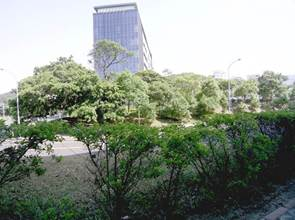
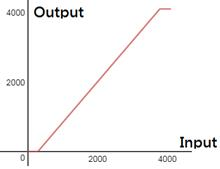
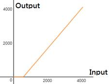
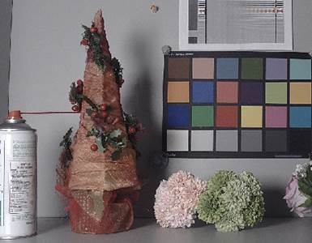
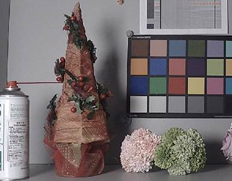

## 1 Overview

LCD310 is the LCD controller of NT9833x. The following image processing modules are insided.

 Y Gamma

 YUV Adjustment

 Local Contrast Enhance

 Sharpen

### 

## 2 IQ Tuning Guide

### 2.1 Y Gamma

This feature is tone mapping and can be used to adjust the contrast, brightness and dynamic range of the image.

#### 2.1.1 Parameters

LCD310 Y Gamma divides the Y channel range from the darkest to the brightest and is equally divided into 16 blocks. Each block can be divided into up to 8 sub-blocks. The total number of all blocks must not exceed 32.

| **Parameter**     | **Range** | **Def** | **Description**                                                                                                       |
|-------------------|-----------|---------|-----------------------------------------------------------------------------------------------------------------------|
| **gm_en**         | 0\~1      | 1       | enable Y gamma                                                                                                        |
| **blk_idx[16]**   | 0\~31     | 0       | Block first index                                                                                                     |
| **blk_split[16]** | 0\~3      | 0       | Block[x], Sub-block split 00 : no split. 01 : split to 2 sub-blocks 10 : split to 4 sub-blocks 11 : split to 8-blocks |
| **Y_gm[32]**      | 0\~4095   |         | Gamma table                                                                                                           |

 **gm_en:** Y gamma enable/disable

 **blk_idx:** Sub-block index in each macro block. Corresponds to the index of the gamma table.

 **blk_split:** Each block is divided into sub-blocks.

**Ex. 1**：

Block0 is divided into 8 sub-block

Block1 is divided into 8 sub-block

Block2 is divided into 8 sub-block

Block3 is divided into 8 sub-block

Total Block no:

8 + 8 + 2 + 2 + 12(Block4\~15)

= 32

The parameter settings are as follows：

blk_idx[16] = {0, 8, 16, 18, 20, 21, 22, 23, 24, 25, 26, 27, 28, 29, 30, 31};

blk_split[16] = {3, 3, 1, 1, 0, 0, 0, 0, 0, 0, 0, 0, 0, 0, 0, 0, 0};

Y_gm[32] = {32, 64, 96, 128, 160, 192, 224, 256, 288, 320, 352, 384, 416, 448, 480, 512, 640, 768, 896, 1024, 1280, 1536, 1792, 2048, 2304, 2560, 2816, 3072, 3328, 3584, 3840, 4095};

**Ex. 2**：

Block0 is divided into 4 sub-block

Block1 is divided into 4 sub-block

Block14 is divided into 4 sub-block

Block15 is divided into 4 sub-block

Total block no:

4 + 4 + 12(Block2\~13) + 4 + 4

= 28 //※not necessary to equal to 32

The parameter settings are as follows：

blk_idx[16] = {0, 4, 8, 9, 10, 11, 12, 13, 14, 15, 16, 17, 18, 19, 20, 24};

blk_split[16] = {2, 2, 0, 0, 0, 0, 0, 0, 0, 0, 0, 0, 0, 0, 0, 2, 2};

Y_gm[32] = {64, 128, 192, 256,320, 384, 448, 512, 768, 1024, 1280, 1536, 1792, 2048, 2304, 2560, 2816, 3072, 3328, 3584, 3648, 3712, 3776, 3840, 3904, 3968, 4032, 4095, 4095, 4095, 4095, 4095}; ※The last for value will be dummy.

#### 2.1.2 Tuning Interface

###### Proc Command:

echo 0 1 0 "0x300,0x108,0x10a,0xc,0xd,0xe,0xf,0x10,0x11,0x12,0x13,0x14,0x15,0x116,0x218,0x21c" \> ygamma

echo 0 1 1 "80,128,176,224,256,304,336,368,528,688,832,1008,1344,1680,2016,2336" \> ygamma

echo 0 1 2 "2640,2912,3152,3376,3552,3712,3776,3840,3872,3904,3936,3968,4000,4032,4064,4080" \> ygamma

### 2.2 YUV Adjustment

This function includes adjustments for brightness, contrast, hue, saturation, etc., as follows:

 Brightness:

 Setting Interface： proc

**Read :** cat /proc/flcd310/brightness

**Write:** echo \<plane 0\> \<brightness -127\~127\> \> brightness

| Parameter  | Description                                                        |
|------------|--------------------------------------------------------------------|
| plane      | Image plane. Fixed to be 0 (Video plane)                           |
| brightness | Brightness value. The larger value corressponds to brighter image. |

 Result：

| Brightness = 0   |  |
|------------------|------------------------------------------------------------------------------------------------------------------------------|
| Brightness = 25  |  |
| Brightness = -25 |  |

 Contrast: Map the image Y channel to adjust the image contrast.

 Setting Interface： /proc/flcd310/contrast

**Read:** cat /proc/flcd310/contrast

**Write:** echo \<plane 0\~0\> \<contrast_ratio 0\~255\> \<contrast_mode 0\~2\> \> /proc/flcd310/contrast

| Parameter      | Description                                                     |
|----------------|-----------------------------------------------------------------|
| plane          | Image plane. Fixed to be 0 (Video plane)                        |
| contrast_ratio | Default = 128, The lager value corressponds to higher contrast. |
| contrast_mode  | Mapping mode, explained as following:                           |

| contrast_mode | mapping mode (contrast=150)                                                                                                  | Feature                                                                                                                  |
|---------------|------------------------------------------------------------------------------------------------------------------------------|--------------------------------------------------------------------------------------------------------------------------|
| 0             |  |  No loss of shadow details, loss of highlight detail  Overall brightness may increase.                                 |
| 1             |  |  Dark details and highlight details are likely to be loss.  Overall brightness will not be changed.                    |
| 2             |  |  No loss of detail in the highlights, details of the shadows and possible loss.  The overall brightness may be dimmed. |

 Result：

| contrast = 170 |  |
|----------------|------------------------------------------------------------------------------------------------------------------------------|
| Contrast = 80  |  |

 Hue:

LCD310 divides the color picture into six blocks, which can adjust the hue and saturation for specific color blocks.

Index 0 \~ 5 respectively: Magenta, Red, Yellow, Green, Cyan, Blue.

 Setting Interface: /proc/flcd310/hue

**Read:** cat /proc/flcd310/hue

**Write:** echo \<plane 0\~0\> \<hue_sat state 0/1\> \<hue0 -45\~45\> \<hue1 -45\~45\> \<hue2 -45\~45\> \<hue3 -45\~45\> \<hue4 -45\~45\> \<hue5 -45\~45\> \> /proc/flcd310/hue

| Parameter     | Description                                                                                                                                                                                                                                                    |
|---------------|----------------------------------------------------------------------------------------------------------------------------------------------------------------------------------------------------------------------------------------------------------------|
| plane         | Image plane. Fixed to be 0 (Video plane)                                                                                                                                                                                                                       |
| hue_sat state | 1: enable, 0: diable hue saturation                                                                                                                                                                                                                            |
| hue0\~5       | They are the rotation adjustment values of the following 6 large hue blocks. The preset value of 0 means no adjustment, and the positive/negative values are respectively inverse/clockwise rotation of the hue block. Magenta, Red, Yellow, Green, Cyan, Blue |

 Saturation: Adjust the saturation of the picture.

LCD310 divides the color picture into six blocks, which can adjust the hue and saturation for specific color blocks.

Index 0 \~ 5 respectively: Magenta, Red, Yellow, Green, Cyan, Blue.

 Setting Interface： /proc/flcd310/hue_sat

**Read:** cat /proc/flcd310/hue_sat

**Write:** echo \<plane 0\~0\> \<hue_sat state 0/1\> \<hue_sat0\> \<hue_sat1\> \<hue_sat2\> \<hue_sat3\> \<hue_sat4\> \<hue_sat5\> \> /proc/flcd310/hue_sat

| Parameter     | Description                                                                                                                                                                                 |
|---------------|---------------------------------------------------------------------------------------------------------------------------------------------------------------------------------------------|
| plane         | Image plane. Fixed to be 0 (Video plane)                                                                                                                                                    |
| hue_sat state | 1: enable, 0: diable hue saturation                                                                                                                                                         |
| hue_sat0\~5   | The saturation adjustment values of the following six color. Set to 128 to indicate no adjustment. The larger the value, the higher the saturation. Magenta, Red, Yellow, Green, Cyan, Blue |

 Result：

| hue_sat = 64  |  |
|---------------|------------------------------------------------------------------------------------------------------------------------------|
| hue_sat = 128 |  |
| hue_sat=164   |  |

### 2.3 Local Contrast Enhance

This feature enhances regional contrast.

Setting Interface： /proc/flcd310/ce

Read: cat /proc/flcd310/ce

Write: echo \<plane 0\~0\> \<ce_state 0/1\> \<strength 0\~1023\> \> /proc/flcd310/ ce

| Parameter | Description                                 |
|-----------|---------------------------------------------|
| plane     | Image plane. Fixed to be 0 (Video plane)    |
| ce_state  | 1: enable, 0: diable                        |
| strength  | The strength of local contrast enhancement. |

 Result：

| strength = 0  |  |
|---------------|------------------------------------------------------------------------------------------------------------------------------|
| strength = 30 |  |

### 2.4 Sharpen

This function is an edge enhancement function that enhances the sharpness of the picture. Two-level sharpness enhancement core for reinforcement of thin and thick edges

 Setting Interface: /proc/flcd310/sharpness

**Read:** cat /proc/flcd310/sharpness

**Write:** echo \<plane 0\> \<enable 0/1\> \<hpf0_5x5_gain 0\~1024\> \<hpf1_5x5_gain 0\~1024\> \> /proc/flcd310/sharpness

| Parameter     | Description                              |
|---------------|------------------------------------------|
| plane         | Image plane. Fixed to be 0 (Video plane) |
| enable        | 1: enable, 0: diable                     |
| hpf0_5x5_gain | Enhance strength of thick edge.          |
| hpf1_5x5_gain | Enhance strength of thin edge.           |

 Result：

| Thin edge enhancement  |  |
|------------------------|------------------------------------------------------------------------------------------------------------------------------|
| Thick edge enhancement |  |

## Revision Historys

| **Revision** | **Date**   | **Author** | **Changes**    |
|--------------|------------|------------|----------------|
| 0.1.0        | 2021/01/20 | Allen Hsu  | First version. |
|              |            |            |                |
|              |            |            |                |
|              |            |            |                |
|              |            |            |                |
|              |            |            |                |
|              |            |            |                |
