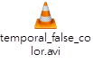
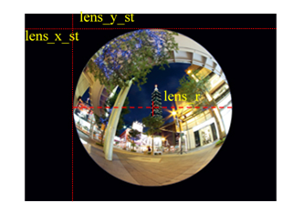

## 1 Overview

Figure 11 NT9833x Video Flow

VPE is an independent image processing engine in YUV domain, and it performs some pre-processing process before LCD display or encoder to improve the image quality. The related modules are as follows:

 Spatial Noise Reduction Module(SPNR, using MRNR method)

 Tempoarl Noise Reduction Module(TMNR)

 Sharpen Module(SHP)

 Scaling Module(SCA)

※ The 9833x series has removed DCE and DCTG.

※ In the following description, the area shown in blue is the same module as the 9831x series but the parameters are different. Please pay special attention)

Figure 12 VPE Image Processing Flow

## 2 System Control

The processing sequence of Sharpen, SPNR(using MRNR method) and TMNR is changeable, and user can change the processing sequence depends on different camera charateristic to achieve the best image quality.

### 2.1 Parameter Description

| **Parameter** | **Range** | **Def** | **Description**                                                                                                                                                                            |
|---------------|-----------|---------|--------------------------------------------------------------------------------------------------------------------------------------------------------------------------------------------|
| ch_fd         |           |         | Video graph use ch_fd to represent the connected video engine of each channel. User can fine tune parameter of each video engine by setting ch_fd.                                         |
| pipe_mode     | 0\~5      | 0       | Set module processing sequence. 0 : MRNR -\> TMNR -\> Sharpen 1 : MRNR-\> Sharpen -\> TMNR 2 : Sharpen -\> MRNR -\> TMNR 3 : SHP-\>TMNR-\>MRNR 4 : TMNR-\>MRNR-\>SHP 5 : TMNR-\>SHP-\>MRNR |

### 2.2 Setting Interface

#### 2.2.1 Proc

######  /proc/videograph/vpe/ch_fd

**[Description]**

Read or write the current camera channel, and it only needs to set once, the following SHP, MRNR, TMNR parameters will work on this channel.

The following proc command will list all ch_fd of the current video engine:

**[Command]**

**Write :**

| **proc command**                         | **Target Parameter**    |
|------------------------------------------|-------------------------|
| echo [fd ] \> /proc/videograph/vpe/ch_fd | **Fw Internal Pointer** |

Read : cat /proc/videograph/vpe/ch_fd

**![Command : echo [fd] \> /proc/videograph/vpe/ch_fd Current channel = \<ch_fd\> ](nvt_media/345f6fd54a7fb4c49c6fac5ef0c31540.png)**

######  /proc/videograph/vpe/pipe_mode

[Description]

Read or write the execsuting sequence of SHP, MRNR and TMNR.

[Command]

Write :

| **proc command**                                    | **Target Parameter**                                                                                                                       |
|-----------------------------------------------------|--------------------------------------------------------------------------------------------------------------------------------------------|
| echo [pipe_mode ] \> /proc/videograph/vpe/pipe_mode | **src_ppo_idx**  **mrnr_ppi_idx**  **mrnr_ppo_idx**  **tmnr_ppi_idx**  **tmnr_ppo_idx**  **shp_ppi_idx**  **shp_ppo_idx**  **sca_ppi_idx** |

Read : cat /proc/videograph/vpe/pipe_mode

![Command : echo [pipe_mode] \> /proc/videograph/vpe/pipe_mode Current pipe_mode = [pipe_mode] mode : 0 : MRNR-\> TMNR-\> SHP 1 : MRNR-\> SHP-\>TMNR 2 : SHP-\> MRNR -\> TMNR 3 : SHP-\>TMNR-\>MRNR 4 : TMNR-\>MRNR-\>SHP 5 : TMNR-\>SHP-\>MRNR ](nvt_media/4c5b91599a24bfa0f3ec9af7994ca086.png)

## 3 Spatial Noise Reduction

This is spatial noise reduction module(abbreviation is “SPNR”). It will divide the image into high frequency part and middle frequency part, performing noise reduction process respectively, then combine together to achieve the purpose of noise reduction and retain detail.

### 3.1 Overview

Major processing flow is as follows :

Figure 31 The SPNR processing flow.

Major processing flow :

1\. Divide the input image into high frequency image and middle frequency image.

2\. Determine and label whether the processing pixel is on the edge.

3\. Perform edge smooth process on high frequency image and middle frequency image, respectively.

4\. Perform flat region noise reduction process on middle frequency image.

5\. Use high/middle frequency image which had performed noise reduction process to reconstruct image.

### 3.2 Parameter Description

(The blue text is the part of the parameter difference between this module and the 9831x series, please pay special attention)

Table 31 SPNR Parameter List

| **Parameter**             | **Range** | **Def**                                                            | **Description**                                                                                                                                                                                                                                                                                                              |
|---------------------------|-----------|--------------------------------------------------------------------|------------------------------------------------------------------------------------------------------------------------------------------------------------------------------------------------------------------------------------------------------------------------------------------------------------------------------|
| t_y_edge_detection [2][8] | 0\~1023   | 161,322,483,447, 419,320,195,130, 108,215,308,272, 246,185,125,100 | Y threshold for determining whether the current processing pixel is on the edge.  It has eight thresholds mapping to pixel brightness from dark to bright, respectively. [0][0\~7] is the threshold from dark to bright for high frequency image. [1][0\~7] is the threshold from dark to bright for middle frequency image. |
| t_cb_edge_detection       | 0\~1023   | 0,249                                                              | Cb threshold for determining whether the current processing pixel is on the edge. Only works in middle frequency image.                                                                                                                                                                                                      |
| t_cr_edge_detection [2]   | 0\~1023   | 0,249                                                              | Cr threshold for determining whether the current processing pixel is on the edge. Only works in middle frequency image.                                                                                                                                                                                                      |
| t_y_edge_smoothing[2][8]  | 0\~255    | 66,132,161,149, 140,107,80,53, 44,88,103,91, 82,62,51,41           | Y threshold for determining whether it will perform smooth process.  It has eight thresholds mapping to pixel brightness from dark to bright, respectively. [0][0\~7] is the threshold from dark to bright for high frequency image. [1][0\~7] is the threshold from dark to bright for middle frequency image.              |
| t_cb_edge_smoothing [2]   | 0\~255    | 0,153                                                              | Cb threshold for determining whether it will perform smooth process. Only works in middle frequency image.                                                                                                                                                                                                                   |
| t_cr_edge_smoothing [2]   | 0\~255    | 0,153                                                              | Cr threshold for determining whether it will perform smooth process. Only works in middle frequency image.                                                                                                                                                                                                                   |
| nr_strength_y[2]          | 0\~15     | {0, 0}                                                             | The denoise strength of spatial domain on Y channel. [0] is denoise strength for high frequency image. [1] is denoise strength for middle frequency image.                                                                                                                                                                   |
| nr_strength_c             | 0\~15     | {0, 10}                                                            | The denoise strength of spatial domain on Cb/Cr channel. Only works in middle frequency image.                                                                                                                                                                                                                               |

**Advance description**:

 edge_smoothing : When SPNR performs smooth process, it will calculate weighting sum of neighbor pixels along the edge direction, if the difference between the neighbor pixel and center pixel is larger than threshold, this neighbor pixel will not be used in the smooth process. The smooth process of Y/Cb/Cr are the same.

### 3.3 Setting Interface

#### 3.3.1 Proc

######  /proc/videograph/vpe/mrnr/dump_info

**[Description]**

Read all SPNR(using MRNR method) parameters of the current camera channel.

**[Command]**

**Write : Not support.**

**Read : cat /proc/videograph/vpe/mrnr/dump_info**

**Output: ![channel \<ch_no\> = enable/disable t_y_edge_detection[0][8] = t_y_edge_detection[0][0] ….[0][7] t_y_edge_detection[1][8] = t_y_edge_detection[1][0] ….[1][7] t_cb_edge_detection = t_cb_edge_detection t_cr_edge_detection = t_cr_edge_detection t_y_edge_smoothing[0][8] = t_y_edge_smoothing[0][0]……[0][7] t_y_edge_smoothing[1][8] = t_y_edge_smoothing[1][0]……[1][7] t_cb_edge_smoothing = t_cb_edge_smoothing t_cr_edge_smoothing = t_cr_edge_smoothing nr_strength_y[2] = nr_strength_y[0], nr_strength_y[0] nr_strength_c = nr_strength_c ](nvt_media/d72297f41ad766983c7c4d1cdfc3d07f.png)**

######  /proc/videograph/vpe/mrnr/mrnr_en

**[Description]**

Read or write the MRNR enable status of the current camera channel.

**[Command]**

**Write :**

| **proc command**                                               | **Target Parameter** |
|----------------------------------------------------------------|----------------------|
| **echo [mrnr_en (0\~1)] \> /proc/videograph/vpe/mrnr/mrnr_en** | **mrnr_en**          |

**Read : cat /proc/videograph/vpe/mrnr/mrnr_en**

**Output: ![Command : echo [ch_en (0\~1)] \> /proc/videograph/vpe/mrnr/mrnr_en](nvt_media/985a39377df0412dabf995f72202fec8.png)**

######  /proc/videograph/vpe/mrnr/t_xx_edge_det

**[Description]**

Read or write edge_detection parameters.

**[Command]**

**Write :**

| **proc command**                                                                 | **Target Parameter**          |
|----------------------------------------------------------------------------------|-------------------------------|
| echo [t_y_edge_det[0][0] …..[0][7]] \> /proc/videograph/vpe/mrnr/ t_y_edge_det_1 | **t_y_edge_detection[0\~7]**  |
| echo [t_y_edge_det[1][0] …..[1][7]] \> /proc/videograph/vpe/mrnr/ t_y_edge_det_2 | **t_y_edge_detection[8\~15]** |
| echo [t_cb_edge_det] \> /proc/videograph/vpe/mrnr/ t_cb_edge_det                 | **t_cb_edge_detection[0\~1]** |
| echo [t_cr_edge_det] \> /proc/videograph/vpe/mrnr/ t_cr_edge_det                 | **t_cr_edge_detection[0\~1]** |

**Read :**

**cat /proc/videograph/vpe/mrnr/**t_y_edge_det_1

**cat /proc/videograph/vpe/mrnr/**t_y_edge_det_2

**cat /proc/videograph/vpe/mrnr/**t_cb_edge_det_1

**cat /proc/videograph/vpe/mrnr/**t_cr_edge_det_1

**Output :**

**![Command : echo [t_y_edge_det[0][0] …….. [0][7] \> /proc/videograph/vpe/mrnr/ t_y_edge_det_1 echo [t_y_edge_det[1][0] …….. [0][7] \> /proc/videograph/vpe/mrnr/ t_y_edge_det_2 echo [t_cb_edge_det \> /proc/videograph/vpe/mrnr/ t_cb_edge_det echo [t_cr_edge_det \> /proc/videograph/vpe/mrnr/ t_cr_edge_det =============================================================== t_y_edge_det1 = t_y_edge_detection [0] [0] …………….[0][7] t_y_edge_det2 = t_y_edge_detection [1] [0]…………….. [0][7] t_cb_edge_det = t_cb_edge_detection t_cr_edge_det = t_cb_edge_detection  ](nvt_media/e0b1e0451304b8e493b50d457dedaf15.png)**

######  /proc/videograph/vpe/mrnr/t_xx_edge_smooth

**[Description]**

Read or write edge_smoothing parameters.

**[Command]**

**Write :**

| **proc command**                                                                                          | **Target Parameter**            |
|-----------------------------------------------------------------------------------------------------------|---------------------------------|
| echo [t_y_edge_smooth[0][0]] ……..[t_y_edge_smooth [0][7]] \> /proc/videograph/vpe/mrnr/ t_y_edge_smooth_1 | **t_y_edge\_ smoothing[0\~7]**  |
| echo [t_y_edge_smooth[1][0] …….. [t_y_edge_smooth[1] [7]] \> /proc/videograph/vpe/mrnr/t_y_edge_smooth_2  | **t_y_edge\_ smoothing[8\~16]** |
| echo [t_cb_edge_smooth] \> /proc/videograph/vpe/mrnr/ t_cb_edge_smooth                                    | **t_cb_edge_smoothing[0\~1]**   |
| echo [t_cr_edge_smooth] \> /proc/videograph/vpe/mrnr/ t_cr_edge_smooth                                    | **t_cr_edge\_ smoothing[0\~1]** |

**Read :**

cat /proc/videograph/vpe/mrnr/t_y_edge_smooth_1

cat /proc/videograph/vpe/mrnr/t_y_edge_smooth_2

cat /proc/videograph/vpe/mrnr/t_cb_edge_smooth

cat /proc/videograph/vpe/mrnr/t_cr_edge_smooth

**Output :**

**![Command : echo [t_y_edge_smooth[0]] …….. [t_y_edge_smooth [7]] \> /proc/videograph/vpe/mrnr/t_y_edge_smooth_1 … =============================================================== t_y_edge_smooth1 = t_y_edge_smoothing[0][0] ……………. [0][7] t_y_edge_smooth1 = t_y_edge_smoothing [1][0]…………….. [0][7] t_cb_edge_smooth = t_cb_edge_smoothing t_cr_edge_smooth = t_cr_edge_smoothing ](nvt_media/e6b93d0cdf2689ae83987edb20c0f6a1.png)**

######  /proc/videograph/vpe/mrnr/nr_strength

**[Description]**

Read or write nr_strength parameters on Y/C channel.

**[Command]**

**Write :**

| **proc command**                                                                            | **Target Parameter**                   |
|---------------------------------------------------------------------------------------------|----------------------------------------|
| echo [strength_y[0]] [strength_y [1]] [strength_c] \> /proc/videograph/vpe/mrnr/nr_strength | **nr_strength_y[0\~1], nr_strength_c** |

**Read : cat /proc/videograph/vpe/mrnr/ nr_strength**

**Output :**

**![Command : echo [strength_y[0]] [strength_y [1]] [strength_c]] \> /proc/videograph/vpe/mrnr/nr_strength =============================================================== nr_strength_y = nr_strength_y[0], strength_y [1] nr_strength_c= nr_strength_c ](nvt_media/15a98e5805343f50ff484410334beebe.png)**

#### 3.3.2 Vendor API

**[Description]**

Get and set the 2DNR parameters corresponding to current path_id.

**[Command]**

**Get：**

HD_RESULT vendor_video_get(HD_PATH_ID path_id, VENDOR_VIDEO_DN_2D, VENDOR_VIDEO_PARAM_MRNR \*p_param);

**Set：**

HD_RESULT vendor_video_set(HD_PATH_ID path_id, VENDOR_VIDEO_DN_2D, VENDOR_VIDEO_PARAM_MRNR \*p_param);

**[Definition]**

**![typedef struct \_VENDOR_VIDEO_MRNR { 	UINT32 mrnr_en;  					///\< MRNR ON/OFF 	UINT32 t_y_edge_detection[2][8]; 	///\< Edge pixel detection threshold of Y{layer1\~layer2}, 0\~1023 	UINT32 t_cb_edge_detection; 		///\< Edge pixel detection threshold of Cb{layer2}, 0\~1023 	UINT32 t_cr_edge_detection; 		///\< Edge pixel detection threshold of Cr{layer2}, 0\~1023 	UINT32 t_y_edge_smoothing[2][8]; 	///\< Edge pixel smoothing threshold of Y: {layer1\~layer2}, 0\~255 	UINT32 t_cb_edge_smoothing; 		///\< Edge pixel smoothing threshold of Cb: {layer2}, 0\~255 	UINT32 t_cr_edge_smoothing;			///\< Edge pixel smoothing threshold of Cr: {layer2}, 0\~255 	UINT32 nr_strength_y[2]; 			///\< Strength of noise reduction of Y: {layer1\~layer2}, 0\~15 	UINT32 nr_strength_c; 				///\< Strength of noise reduction of CbCr: {layer2}, 0\~15 } VENDOR_VIDEO_PARAM_MRNR; ](nvt_media/4fa5602c7f38e0c8590485b95e1c6a99.png)**

## 4 Temporal Noise Reduction (TMNR)

This is temporal noise reduction module(abbreviation is “TMNR”). The major function is to eliminate temporal noise in the image.

### 4.1 Overview

The concept of TMNR algorithm is to determine whether the pixel status is static(MotionLevel=0) or motion(MotionLevel=2) by Motion Detect module. The static region perform 3DNR to reduce the temporal noise, and the motion region will not perform 3DNR to prevent from having ghost, instead, it will perform 2DNR to reduce noise. The transition region between static region and motion region will combine the result of 2DNR and 3DNR by weighting.

### 4.2 Parameter description

(The blue text is the part of the parameter difference between this module and the 9831x series, please pay special attention)

Table 41 TMNR Parameter List

| **Parameter**              | **Range** | **Default**                       | **Description**                                                                                                                                                                                                                                                                                                                            |
|----------------------------|-----------|-----------------------------------|--------------------------------------------------------------------------------------------------------------------------------------------------------------------------------------------------------------------------------------------------------------------------------------------------------------------------------------------|
| **tmnr_en**                | 0\~1      | 1                                 | TMNR ON/OFF                                                                                                                                                                                                                                                                                                                                |
| **luma_dn_en**             | 0\~1      | 1                                 | Y channel TMNR ON/OFF                                                                                                                                                                                                                                                                                                                      |
| **chroma_dn_en**           | 0\~1      | 1                                 | Cb/Cr channel TMNR ON/OFF                                                                                                                                                                                                                                                                                                                  |
| **tmnr_fcs_en**            | 0\~1      | 0                                 | Temporal de-false color function ON/OFF It only works when “chroma_dn_en” is set to 1. Please refer to advance description.                                                                                                                                                                                                                |
| **nr_str_y_3d**            | 0\~32     | 8                                 | Y channel temporal NR strength                                                                                                                                                                                                                                                                                                             |
| **nr_str_y_2d**            | 0\~32     | 16                                | Y channel spatial NR strength of motion object                                                                                                                                                                                                                                                                                             |
| **nr_str \_c_3d**          | 0\~32     | 16                                | Cb/Cr channel temporal NR strength                                                                                                                                                                                                                                                                                                         |
| **nr_str \_c_2d**          | 0\~32     | 16                                | Cb/Cr channel spatial NR strength of motion object                                                                                                                                                                                                                                                                                         |
| **blur_str_y**             | 0\~2      | 1                                 | Y image blurred strength 0: No blur 1: low-strength blur 2: high-strength blur ※It is recommend to set enable, if the executing sequence of 3DNR is after Sharpness; otherwise, it is recommend to set disable. For DVR/NVR application, due to in most case the front-end camera had perfomed sharpen process, it is recommend to set 1.  |
| **center_wzero_y_2d_en**   | 0\~1      | 1                                 | Set to enable represents when performing the 2DNR, the weighting of center point is 0. It will increase NR strength, but might lose detail. Due to 2DNR only works on motion region, the detail loss is not obvious, it is recommend to fix enable.                                                                                        |
| **center_wzero_y_3d_en**   | 0\~1      | 1                                 | Set to enable represents when performing 3DNR, the weighting of center point is 0. It is recommend to fix enable.                                                                                                                                                                                                                          |
| **small_vibrat_supp_y_en** | 0\~1      | 0                                 | Y channel small vibration suppresiioon ON/OFF. This function will enhance suppression on small vibration noise to make the image more stable. However, it also causes slower ghost removal. It is recommend to enable at normal luminance, and disable at dark luminance.                                                                  |
| **avoid_residue_th_y**     | 1\~4      | 2                                 | Upper threshold for Y channel small noise putting back. If **err_compensate** = 0, bigger this value will cause smaller temporal noise. On the other hand, if err_compensate = 1, bigger this value will cause bigger temporal noise.                                                                                                      |
| **avoid_residue_th_c**     | 1\~4      | 1                                 | Upper threshold for Vb/Cr channel small noise putting back. If **err_compensate** = 0, bigger this value will cause smaller temporal noise. On the other hand, if err_compensate = 1, bigger this value will cause bigger temporal noise.                                                                                                  |
| **display_motion_map_en**  | 0\~1      | 0                                 | Debug mode. Show motion detection result on the image to assist to judge the correctness of motion detect parameters. Please refer to advance description.                                                                                                                                                                                 |
| **motion_map_channel**     | 0\~4      | 0                                 | Select debug signal channel. 0: Y channel 1: Cb channel 2: Cr channel 3: temporal de-false color Cb channel 4: temporal de-false color Cr channel                                                                                                                                                                                          |
| **y_base[8]**              | 0\~16320  | {146,147,107,110,102,104,104,104} | y_base[0]-[7] are NoiseSAD mapping to pixel brightness from dark to bright. When performing 2DNR, the internal algorithm will automatically fine tune strength based on y_base. The larger the y_base, the stronger strength of 2DNR of motion object. It is recommend to increase y_base as sensor gain increases.                        |
| **motion_level_th_y_k1**   | 0\~32     | 8                                 | Threshold (motion_level_th_y_k1\*Y_NOISE) for determining transition region on Y channel. Y_NOISE please refer to advance description.                                                                                                                                                                                                     |
| **motion_level_th_y_k2**   | 0\~32     | 8                                 | Threshold (motion_level_th_y_k2\*Y_NOISE) for determining motion region on Y channel.  K2 must larger or equal to K1.                                                                                                                                                                                                                      |
| **y_coefa[8]**             | 0\~48     | {0,0,0,0,0,0,0,0}                 | The slope of NoiseSAD from flat region to detail region on Y channel. y_coefa[0]-[7] mapping to pixel brightness from dark to bright.                                                                                                                                                                                                      |
| **y_coefb[8]**             | 0\~16320  | {27,27,20,12,7,10,10,10}          | NoiseSAD of flat region on Y channel. y_coefb[0]-[7] mapping to pixel brightness from dark to bright.                                                                                                                                                                                                                                      |
| **y_std[8]**               | 0\~16320  | {20,70,70,70,70,50,28,18}         | The standard deviation of NoiseSAD on Y channel. y_std[0]-[7] mapping to pixel brightness from dark to bright.                                                                                                                                                                                                                             |
| **motion_level_th_c_k1**   | 0\~32     | 8                                 | Threshold for determining transition region on Cb/Cr channel.                                                                                                                                                                                                                                                                              |
| **motion_level_th_c_k2**   | 0\~32     | 8                                 | Threshold for determining motion region on Cb/Cr channel, K2 must larger or equal to K1.                                                                                                                                                                                                                                                   |
| **cb_mean[8]**             | 0\~6375   | {33,33,34,32,29,28,28,28}         | The NoiseSAD mean value on Cb channel. cb_mean[0]-[7] mapping to pixel brightness from dark to bright.                                                                                                                                                                                                                                     |
| **cb_std[8]**              | 0\~6375   | {10,9,10,10,9,9,9,9}              | The standard deviation of NoiseSAD on Cb channel. cb_std[0]-[7] mapping to pixel brightness from dark to bright.                                                                                                                                                                                                                           |
| **cr_mean[8]**             | 0\~6375   | {23,23,25,23,20,20,21,21}         | The NoiseSAD mean value on Cr channel. cr_mean[0]-[7] mapping to pixel brightness from dark to bright.                                                                                                                                                                                                                                     |
| **cr_std[8]**              | 0\~6375   | {7,7,8,7,7,77,7}                  | The standard deviation of NoiseSAD on Cr channel. cr_std[0]-[7] mapping to pixel brightness from dark to bright.                                                                                                                                                                                                                           |
| **lut_y_3d_1_Th[4]**       | 0\~127    | {11,33,55,77}                     | Lut of Y channel 3D_1 filter Please refer to advance description.                                                                                                                                                                                                                                                                          |
| **lut_y \_3d_2_Th[4]**     | 0\~127    | {40,14,7,3}                       | Lut of Y channel 3D_2 filter Please refer to advance description.                                                                                                                                                                                                                                                                          |
| **lut_y_2d_Th[4]**         | 0\~127    | {11,33,55,77}                     | Lut of Y channel 2D filter Please refer to advance description.                                                                                                                                                                                                                                                                            |
| **lut_c_3d_Th[4]**         | 0\~127    | {37,19,11,7}                      | Lut of Cb/Cr channel 3D filter Please refer to advance description.                                                                                                                                                                                                                                                                        |
| **lut_c_2d_Th[4]**         | 0\~127    | {11,33,55,77}                     | Lut of Cb/Cr channel 2D filter Please refer to advance description.                                                                                                                                                                                                                                                                        |
| **tmnr_fcs_str**           | 0\~15     | 4                                 | The strength of temporal de-false color function.                                                                                                                                                                                                                                                                                          |
| **tmnr_fcs_th**            | 0\~255    | 32                                | Threshold for the difference between the previous frame and the current frame to determine whether it is false color.                                                                                                                                                                                                                      |
| **dithering_en**           | 0\~1      | 1                                 | Dithering enable. This function can be used to eliminate slight power noise or flicker phenomenon.                                                                                                                                                                                                                                         |
| **dithering_bit_y**        | 0\~3      | 2                                 | Y channel random bit number. The higher the value, the stronger the ability to eliminate the power noiser and filcker phenomenon, but the picture may appear larger fine noise.                                                                                                                                                            |
| **dithering_bit_u**        | 0\~3      | 1                                 | U channel random bit number. The higher the value, the stronger the ability to eliminate the power noiser and filcker phenomenon, but the picture may appear larger fine noise.                                                                                                                                                            |
| **dithering_bit_v**        | 0\~3      | 1                                 | V channel random bit number. The higher the value, the stronger the ability to eliminate the power noiser and filcker phenomenon, but the picture may appear larger fine noise.                                                                                                                                                            |
| **err_compensate**         | 0\~1      | 1                                 | YC Compression error compensation.  0: Antiflicker mode. (Larger anti-flicker effect) 1: Compensation mode. (Data Compression Error Compensation)                                                                                                                                                                                          |

**Advance Description:**

 **tmnr_fcs_en:** Temporal de-false color ON/OFF. This function will eliminate color-flash phenomenon in high frequency region.

| **FCS off**                                                                                                                  | **FCS on**                                                                                                                   |
|------------------------------------------------------------------------------------------------------------------------------|------------------------------------------------------------------------------------------------------------------------------|
|  |  |

****

 **display_motion_map_en:**。

Motion region will label with red color, static region will label with black color, and transition region will label with white color.

| Original image                                                                                                               | Motion Map                                                                                                                   |
|------------------------------------------------------------------------------------------------------------------------------|------------------------------------------------------------------------------------------------------------------------------|
|  |  |

 **Y_NOISE:** Block SAD is the summation of pixel difference between the previous frame and current frame at the same location. If the Block SAD is larger than K2\*NoiseSAD_STD(NoiseSAD_STD is the input parameter), it determines as motion region. If the Block SAD is smaller than K1\*NoiseSAD_STD, it determines as static region. If the Block SAD is larger than K1\*NoiseSAD_STD and smaller than K2\*NoiseSAD_STD, it determines as transition region.

As follows :

 Cb_NOISE, Cr_NOISE:

Different from Y channel, the NoiseSAD of Cb/Cr channel has no relationship with detail. Therefore, it has no slope parameter.

 **lut_Y_3d_1_Th:** Weighting Lut for stage 1 3DNR on Y channel, the x-axis is delta difference of neighbor pixel, the y-axis is weighting. As the following figure, the larger the difference, the smaller the weighting. The smaller the difference, the larger the weighting. Then, based on each weighting to perform weighting sum.

****

 **lut_Y_3d_2_Th:** Weighting Lut for Stage 2 3DNR on Y channel, the x-axis is difference of the reference point between the previous frame and current frame, the y-axis is weighting. As the following figure, those with smaller difference might be static region, and set smaller weighting, the output will close to the reference frame. On the contrast, those with larger difference might be motion region, and set larger weighting, the output will close to the current frame.

****

 **lut_Y_2d_Th:** Weighting Lut of neighbor pixel for 2DNR on Y channel, the x-axis is difference, the y-axis is weighting. As the following figure, the larger the difference, the smaller the weighting. The smaller the difference, the larger the weighting. Then, based on each weighting to perform weighting sum.

****

 **lut_c_3d_Th:** Suppression Level Lut for 3DNR on Cb/Cr channel, the x-axis is the difference of the reference point between the previous frame and current frame, the y-axis is the suppression level. The concept is the same with “**LUT_Y_3d_2_Th**”.

 **lut_c_2d_Th:** Weighting Lut of neighbor pixel for 2DNR on Cb/Cr channel, the x-axis is difference, the y-axis is weighting. The concept is the same with “**lut_Y_2d_Th**”.

### 4.3 Setting Interface

#### 4.3.1 Proc

######  /proc/videograph/vpe/tmnr/dump_info

**[Description]**

Read all parameters of the current camera channel.

**[Command]**

**Write : Not support.**

**Read :**

cat /proc/videograph/vpe/tmnr/dump_info

**Output :**

**![luma_dn_en = luma_dn_en chroma_dn_en = chroma_dn_en tmnr_fcs_en = tmnr_fcs_en nt_str_y_3d = nt_str_y_3d nr_str_y_2d = nr_str_y_2d nr_str_c_3d = nr_str_c_3d nr_str_c_2d = nr_str_c_2d blur_str_y = blur_str_y center_wzero_y_2d_en = center_wzero_y_2d_en center_wzero_y_3d_en = center_wzero_y_3d_en small_vibrat_supp_y_en = small_vibrat_supp_y_en avoid_residue_th_y = avoid_residue_th_y avoid_residue_th_c = avoid_residue_th_c y_base[8] = y_base[0] ….. y_base[7] motion_level_th_y = motion_leve_tTh_y_k1, motion_level_th_y_k2 motion_level_th_c = motion_level_th_c_k1, motion_level_th_c_k2 y_coefa[8] = y_coefa[0] …y_coefa[7] y_coefb[8] = y_coefb[0] …y_coefb[7] y_std[8] = y_std[0] …y_std[7] cb_mean[8] = cb_mean[0] …. cb_mean[7] cb_std[8] = cb_std[0]……..cb_std[7] cr_mean[8] = cr_mean[0] …. cr_mean[7] cr_std[8] = cr_std[0]……..cr_std[7] lut_y_3d_1_th[4] = lut_y_3d_1_th[0]  ….. lut_y_3d_1_th[3] lut_y_3d_2_th[4] = lut_y_3d_2_th[0]  ….. lut_y_3d_2_th[3] lut_y_2d_th[4] = lut_y_2d_th[0]……lut_y_2d_th[3] lut_c_3d_th[4] = lut_c_3d_th[0]……. lut_c_3d_th[3] lut_c_2d_th[4] = lut_c_2d_th[0]…….. lut_c_2d_th[3] tmnr_fcs_str = tmnr_fcs_str tmnr_fcs_th = tmnr_fcs_th dithering_en = dithering_en dithering_bit_y = dithering_bit_y dithering_bit_u = dithering_bit_u dithering_bit_v = dithering_bit_v err_compensate = err_compensate ](nvt_media/3a3791f710e979f3a06e0a26eff76e80.png)**

######  /proc/videograph/vpe/tmnr/ch_en_status

**[Description]**

Read or write the enable status of the current channel.

**[Command]**

**Write :**

| **proc command**                                                              | **Target Parameter**                            |
|-------------------------------------------------------------------------------|-------------------------------------------------|
| echo [luma_en] [chroma_en] [fcs_en] \> /proc/videograph/vpe/tmnr/ch_en_status | **luma_dn_en** **chroma_dn_en** **tmnr_fcs_en** |

**Read :**

**cat /proc/videograph/vpe/tmnr/ch_en_status**

**Output :**

**![Command :  echo [luma_en] [chroma_en] [fcs_en] \> /proc/videograph/vpe/tmnr/ch_en_status =============================================================== luma_en = luma_dn_en chroma_en = chroma_dn_en fcs_en = tmnr_fcs_en ](nvt_media/09550c83b4f1fedadfdcf65260205a45.png)**

######  /proc/videograph/vpe/tmnr/nr_strength

**[Description]**

Read or write the TMNR strength of the current channel.

**[Command]**

**Write :**

| **proc command**                                                                          | **Target Parameter**                                      |
|-------------------------------------------------------------------------------------------|-----------------------------------------------------------|
| echo [y_3d_str] [y_2d_str] [c_3d_str] [c_2d_str] \> /proc/videograph/vpe/tmnr/nr_strength | **nr_str_y_3d, nr_str_y_2d** **nr_str_c_3d, nr_str_c_2d** |

**Read :**

**cat /proc/videograph/vpe/tmnr/nr_strength**

**Output :**

**![Command :  echo [y_3d_str] [y_2d_str] [c_3d_str] [c_2d_str] \> /proc/videograph/vpe/tmnr//proc/videograph/vpe/tmnr/nr_strength =============================================================== nr_str_y_3d = nr_str_y_3d nr_str_y_2d = nr_str_y_2d nr_str_c_3d = nr_str_c_3d nr_str_c_2d = nr_str_c_2d ](nvt_media/768d595e9fecf97fde36194a105d3f88.png)**

######  /proc/videograph/vpe/tmnr/y_base

**[Description]**

Read or write the base noise level of TMNR of the current channel.

**[Command]**

**Write :**

| **proc command**                                                         | **Target Parameter** |
|--------------------------------------------------------------------------|----------------------|
| echo [y_base0] [y_base1]………[y_base7] \> /proc/videograph/vpe/tmnr/y_base | **y_base[0]\~[7]**   |

**Read :**

**cat /proc/videograph/vpe/tmnr/y_base**

**Output :**

**![Command :  echo [y_base0] [y_base1]………[y_base7] \> /proc/videograph/vpe/tmnr/y_base =============================================================== TMNR Noise Y_base = y_base[0]…………y_base[7] ](nvt_media/6bd128e5bedf990cf5d42712c8c0285a.png)**

######  /proc/videograph/vpe/tmnr/motion_level_th

**[Description]**

Read or write the noise model parameters of TMNR of the current channel.

**[Command]**

**Write :**

| **proc command**                                                              | **Target Parameter**                                                                                |
|-------------------------------------------------------------------------------|-----------------------------------------------------------------------------------------------------|
| echo [y_k1] [y_k2] [c_k1] [c_k2] \> /proc/videograph/vpe/tmnr/motion_level_th | **motion_level_th_y_k1** **motion_level_th_y_k2** **motion_level_th_c_k1** **motion_level_th_c_k2** |

**Read :**

**cat /proc/videograph/vpe/tmnr/motion_level_th**

**Output :**

**![Command :  echo [y_k1] [y_k2] [c_k1] [c_k2] \> /proc/videograph/vpe/tmnr/motion_level_th =============================================================== TMNR motion level th = motion_level_th_y_k1, motion_level_th_y_k2, motion_level_th_c_k1, motion_level_th_c_k2, ](nvt_media/c55fc3fe19d9561d486f55e5d3ba2109.png)**

######  /proc/videograph/vpe/tmnr/y_coeffa

**[Description]**

Read or write the noise model parameters of TMNR of the current channel.

**[Command]**

**Write :**

| **proc command**                                                                 | **Target Parameter** |
|----------------------------------------------------------------------------------|----------------------|
| echo [y_coeffa0] [y_coeffa1]………[y_coeffa7] \> /proc/videograph/vpe/tmnr/y_coeffa | **y_coeffa[0]\~[7]** |

**Read :**

**cat /proc/videograph/vpe/tmnr/y_coeffa**

**Output :**

**![Command :  echo [y_coeffa0] [y_coeffa1]………[y_coeffa7] \> /proc/videograph/vpe/tmnr/y_coeffa =============================================================== TMNR Noise model y_coeffa = y_coeffa[0]…………y_coeffa[7] ](nvt_media/75e98476c139374c62e0f49db46cc1f9.png)**

######  /proc/videograph/vpe/tmnr/y_coeffb

**[Description]**

Read or write the noise model parameters of TMNR of the current channel.

**[Command]**

**Write :**

| **proc command**                                                                 | **Target Parameter** |
|----------------------------------------------------------------------------------|----------------------|
| echo [y_coeffb0] [y_coeffb1]………[y_coeffb7] \> /proc/videograph/vpe/tmnr/y_coeffb | **y_coeffb[0]\~[7]** |

**Read :**

**cat /proc/videograph/vpe/tmnr/y_coeffb**

**Output :**

**![Command :  echo [y_coeffb0] [y_coeffb1]………[y_coeffb7] \> /proc/videograph/vpe/tmnr/y_coeffb =============================================================== TMNR Noise model y_coeffb = y_coeffb[0]…………y_coeffb[7] ](nvt_media/fddca35ec34f6d020253b4d4b6bcc376.png)**

######  /proc/videograph/vpe/tmnr/y_std

**[Description]**

Read or write the noise model parameters of TMNR of the current channel.

**[Command]**

**Write :**

| **proc command**                                                     | **Target Parameter** |
|----------------------------------------------------------------------|----------------------|
| echo [y_std0] [y_std1]………[y_std7] \> /proc/videograph/vpe/tmnr/y_std | **y_std[0]\~[7]**    |

**Read :**

**cat /proc/videograph/vpe/tmnr/y_std**

**Output :**

**![Command :  echo [y_std0] [y_std1]………[y_std7] \> /proc/videograph/vpe/tmnr/y_std =============================================================== TMNR Noise model y_std = y_std[0]…………y_std[7] ](nvt_media/80c6f7df342b9d65e32d57d00279244a.png)**

######  /proc/videograph/vpe/tmnr/cb_mean

**[Description]**

Read or write the noise model parameters of TMNR of the current channel.

**[Command]**

**Write :**

| **proc command**                                                              | **Target Parameter** |
|-------------------------------------------------------------------------------|----------------------|
| echo [cb_mean0] [cb_mean1]………[cb_mean 7] \> /proc/videograph/vpe/tmnr/cb_mean | **cb_mean[0]\~[7]**  |

**Read :**

**cat /proc/videograph/vpe/tmnr/cb_mean**

**Output :**

**![Command :  echo [cb_mean0] [cb_mean1]………[cb_mean 7] \> /proc/videograph/vpe/tmnr/cb_mean =============================================================== TMNR Noise model cb_mean = cb_mean[0]…………cb_mean[7] ](nvt_media/10e901a3ca1db84914ad37d7c2b97524.png)**

######  /proc/videograph/vpe/tmnr/cb_std

**[Description]**

Read or write the noise model parameters of TMNR of the current channel.

**[Command]**

**Write :**

| **proc command**                                                         | **Target Parameter** |
|--------------------------------------------------------------------------|----------------------|
| echo [cb_std0] [cb_std1]………[cb_std7] \> /proc/videograph/vpe/tmnr/cb_std | **cb_std[0]\~[7]**   |

**Read :**

**cat /proc/videograph/vpe/tmnr/cb_std**

**Output :**

**![Command :  echo [cb_std0] [cb_std1]………[cb_std7] \> /proc/videograph/vpe/tmnr/cb_std =============================================================== TMNR Noise model cb_std = cb_std[0]…………cb_std[7] ](nvt_media/69ce186d9a745f704f8ba93d426ddaca.png)**

######  /proc/videograph/vpe/tmnr/cr_mean

**[Description]**

Read or write the noise model parameters of TMNR of the current channel.

**[Command]**

**Write :**

| **proc command**                                                            | **Target Parameter** |
|-----------------------------------------------------------------------------|----------------------|
| echo [cr_mean0] [cr_mean1]………[cr_std7] \> /proc/videograph/vpe/tmnr/cr_mean | **cr_std[0]\~[7]**   |

**Read :**

**cat /proc/videograph/vpe/tmnr/cr_mean**

**Output :**

**![Command :  echo [cr_mean0] [cr_mean1]………[cr_std7] \> /proc/videograph/vpe/tmnr/cr_mean =============================================================== TMNR Noise model cr_mean = cr_mean[0]…………cr_mean[7] ](nvt_media/6fe2dc9d7b3e3837c606ed4b459e1a52.png)**

######  /proc/videograph/vpe/tmnr/cr_std

**[Description]**

Read or write the noise model parameters of TMNR of the current channel.

**[Command]**

**Write :**

| **proc command**                                                           | **Target Parameter** |
|----------------------------------------------------------------------------|----------------------|
| echo [cr_std0] [cr_std1]………[cr_std7] ] \> /proc/videograph/vpe/tmnr/cr_std | **cr_std[0]\~[7]**   |

**Read :**

**cat /proc/videograph/vpe/tmnr/cr_std**

**Output :**

**![Command :  echo [cr_std0] [cr_std1]………[cr_std7] \> /proc/videograph/vpe/tmnr/cr_std =============================================================== TMNR Noise model cr_std = cr_std[0]…………cr_std[7] ](nvt_media/c628d64edc2fc04822c91d63d7e103c0.png)**

######  /proc/videograph/vpe/tmnr/lut_y_3d_1_th

**[Description]**

Read or write the 3D noise reduction parameters of TMNR of the current channel.

**[Command]**

**Write :**

| **proc command**                                                        | **Target Parameter**      |
|-------------------------------------------------------------------------|---------------------------|
| echo [th0] [th1] [th2] [th3] \> /proc/videograph/vpe/tmnr/lut_y_3d_1_th | **lut_y_3d_1_th[0]\~[3]** |

**Read :**

**cat /proc/videograph/vpe/tmnr/lut_y_3d_1_th**

**Output :**

**![Command :  echo [th0] [th1] [th2] [th3] \> /proc/videograph/vpe/tmnr/lut_y_3d_1_th =============================================================== TMNR lut_y_3d_1_th = lut_y_3d_1_th[0]…th[3] ](nvt_media/268c93946a69a0fd76057af14ca3795f.png)**

######  /proc/videograph/vpe/tmnr/lut_y_3d_2_th

**[Description]**

Read or write the 3D noise reduction parameters of TMNR of the current channel.

**[Command]**

**Write :**

| **proc command**                                                        | **Target Parameter**      |
|-------------------------------------------------------------------------|---------------------------|
| echo [th0] [th1] [th2] [th3] \> /proc/videograph/vpe/tmnr/lut_y_3d_2_th | **lut_y_3d_2_th[0]\~[3]** |

**Read :**

**cat /proc/videograph/vpe/tmnr/lut_y_3d_2_th**

**Output :**

**![Command :  echo [th0] [th1] [th2] [th3] \> /proc/videograph/vpe/tmnr/lut_y_3d_2_th =============================================================== TMNR lut_y_3d_2_th = lut_y_3d_2_th[0]…th[3] ](nvt_media/e25cd97631a24b547eacbcb025197722.png)**

######  /proc/videograph/vpe/tmnr/lut_y_2d_th

**[Description]**

Read or write the 2D noise reduction parameters of TMNR of the current channel.

**[Command]**

**Write :**

| **proc command**                                                      | **Target Parameter**    |
|-----------------------------------------------------------------------|-------------------------|
| echo [th0] [th1] [th2] [th3] \> /proc/videograph/vpe/tmnr/lut_y_2d_th | **lut_y_2d_th[0]\~[3]** |

**Read :**

cat /proc/videograph/vpe/tmnr/lut_y_2d_th

**Output :**

**![Command :  echo [th0] [th1] [th2] [th3] \> /proc/videograph/vpe/tmnr/lut_y_2d_th =============================================================== TMNR lut_y_2d_th = lut_y_2d_th[0]…th[3] ](nvt_media/9dbbc459ee42388fde5bc5915241bebc.png)**

######  /proc/videograph/vpe/tmnr/lut_c_3d_th

**[Description]**

Read or write the 3D noise reduction parameters of 3DNR of the current channel.

**[Command]**

**Write :**

| **proc command**                                                      | **Target Parameter**    |
|-----------------------------------------------------------------------|-------------------------|
| echo [th0] [th1] [th2] [th3] \> /proc/videograph/vpe/tmnr/lut_c_3d_th | **lut_c_3d_th[0]\~[3]** |

**Read :**

**cat /proc/videograph/vpe/tmnr/lut_c_3d_th**

**Output :**

**![Command :  echo [th0] [th1] [th2] [th3] \> /proc/videograph/vpe/tmnr/lut_c_3d_th =============================================================== TMNR lut_c_3d_th = lut_c_3d_th[0]…th[3] ](nvt_media/22f6a72b3c99a043f1f28953e24c0675.png)**

######  /proc/videograph/vpe/tmnr/lut_c_2d_th

**[Description]**

Read or write the 2D noise reduction parameters of TMNR of the current channel.

**[Command]**

**Write :**

| **proc command**                                                      | **Target Parameter**    |
|-----------------------------------------------------------------------|-------------------------|
| echo [th0] [th1] [th2] [th3] \> /proc/videograph/vpe/tmnr/lut_c_2d_th | **lut_c_2d_th[0]\~[3]** |

**Read :**

**cat /proc/videograph/vpe/tmnr/lut_c_2d_th**

**Output :**

**![Command :  echo [th0] [th1] [th2] [th3] \> /proc/videograph/vpe/tmnr/lut_c_2d_th =============================================================== TMNR lut_c_3d_th = lut_c_2d_th[0]…th[3] ](nvt_media/eccd84ba96ee7b0cd3deb28f70561a46.png)**

######  /proc/videograph/vpe/tmnr/fcs_str

**[Description]**

Read or write the false color suppression strength of TMNR of the current channel.

**[Command]**

**Write :**

| **proc command**                                             | **Target Parameter** |
|--------------------------------------------------------------|----------------------|
| echo [fcs_str (0\~15) ] \> /proc/videograph/vpe/tmnr/fcs_str | **tmnr_fcs_str**     |

**Read :**

cat /proc/videograph/vpe/tmnr/fcs_str

**Output :**

**![Command :  echo [fcs_str (0\~15) ] \> /proc/videograph/vpe/tmnr/fcs_str =============================================================== TMNR FCS strength = tmnr_fcs_str ](nvt_media/ecfc3523ee584744cb422354ec4dc999.png)**

######  /proc/videograph/vpe/tmnr/fcs_th

**[Description]**

Read or write the threshold for determining whether it is false color of TMNR of the current channel.

**[Command]**

**Write :**

| **proc command**                                            | **Target Parameter** |
|-------------------------------------------------------------|----------------------|
| echo [fcs_th (0\~255) ] \> /proc/videograph/vpe/tmnr/fcs_th | **tmnr_fcs_th**      |

**Read :**

cat /proc/videograph/vpe/tmnr/fcs_th

**Output :**

**![Command :  echo [fcs_th (0\~255) ] \> /proc/videograph/vpe/tmnr/fcs_th =============================================================== TMNR FCS th = tmnr_fcs_th ](nvt_media/37fc49a81c70f3b107ddef170784c675.png)**

######  /proc/videograph/vpe/tmnr/motion_map

**[Description]**

Read or write the motion map of TMNR of the current channel.

**[Command]**

**Write :**

| **proc command**                                                                                                                                                                                                                                                                             | **Target Parameter**                              |
|----------------------------------------------------------------------------------------------------------------------------------------------------------------------------------------------------------------------------------------------------------------------------------------------|---------------------------------------------------|
| echo [map_en (0\~1)] \> [map_idx] \> /proc/videograph/vpe/tmnr/motion_map map_en: 0: display_motion_map_en = 0 1: display_motion_map_en = 1 map_idx :  0: motion_map_channel=Y  1: motion_map_channel=Cb  2: motion_map_channel=Cr 3: motion_map_channel=FCS_Cb 4: motion_map_channel=FCS_Cr | **display_motion_map_en,** **motion_map_channel** |

**Read :**

cat /proc/videograph/vpe/tmnr/motion_map

**Output :**

**![Command :  echo [map_en (0\~1)] [map_idx (0\~4)] \> /proc/videograph/vpe/tmnr/motion_map =============================================================== TMNR motion_map :  map_en = display_motion_map_en  map_channel = motion_map_channel ](nvt_media/be17015b01c8659ef32e7043afbd1aa8.png)**

######  /proc/videograph/vpe/tmnr/diff_blur_str

**[Description]**

Read or write the Diff. image blur strength of TMNR of the current channel.

**[Command]**

**Write :**

| **proc command**                                                                      | **Target Parameter** |
|---------------------------------------------------------------------------------------|----------------------|
| echo [str (0\~2)] \> /proc/videograph/vpe/tmnr/diff_blur_str str: blur strength 0 \~2 | **blur_str_y**       |

**Read :**

cat /proc/videograph/vpe/tmnr/diff_blur_str

**Output :**

**![Command :  echo [str (0\~2)] \> /proc/videograph/vpe/tmnr/diff_blur_str =============================================================== diff_blur_str = blur_str_y ](nvt_media/19c2dd23da8cd8be55ee8a7219499f88.png)**

######  /proc/videograph/vpe/tmnr/avoid_residue_th

**[Description]**

Read or write the Diff. image blur strength of TMNR of the current channel.

**[Command]**

**Write :**

| **proc command**                                                                                           | **Target Parameter**                       |
|------------------------------------------------------------------------------------------------------------|--------------------------------------------|
| echo [avoid_residue_th_y (1\~4)] [avoid_residue_th_c (1\~4)] \> /proc/videograph/vpe/tmnr/avoid_residue_th | **avoid_residue_th_y, avoid_residue_th_c** |

**Read :**

cat /proc/videograph/vpe/tmnr/avoid_residue_th

**Output :**

**![Command :  echo [avoid_residue_th_y (1\~4)] [avoid_residue_th_c (1\~4)] \> /proc/videograph/vpe/ avoid_residue_th =============================================================== avoid_residue_th_y= avoid_residue_th_y,  avoid_residue_th_c= avoid_residue_th_c ](nvt_media/6350b2166fe44c45d51e8e99746f6264.png)**

######  /proc/videograph/vpe/tmnr/dithering

**[Description]**

Read or write the dithering relative parameters of the current channel.

**[Command]**

**Write :**

| **proc command**                                                                                                                             | **Target Parameter**                                                         |
|----------------------------------------------------------------------------------------------------------------------------------------------|------------------------------------------------------------------------------|
| echo [dithering_en (0\~1)] [dithering_bit_y (0\~7)] [dithering_bit_u (0\~7)] [dithering_bit_v (0\~7)] \> /proc/videograph/vpe/tmnr/dithering | **dithering_en** **dithering_bit_y** **dithering_bit_u** **dithering_bit_v** |

**Read :**

cat /proc/videograph/vpe/tmnr/ dithering

**Output :**

**![Command :  echo [dithering_en (0\~1)] [dithering_bit_y (0\~7)] [dithering_bit_u (0\~7)] [dithering_bit_v (0\~7)] \> /proc/videograph/vpe/tmnr/dithering =============================================================== dithering_en = dithering_en, dithering_bit_y = dithering_bit_y, dithering_bit_u = dithering_bit_u, dithering_bit_v = dithering_bit_v ](nvt_media/53a52c65628da411d953d26a30f9965a.png)**

######  /proc/videograph/vpe/tmnr/err_compensate

**[Description]**

Read or write the err_compensate parameter of the current channel.

**[Command]**

**Write :**

| **proc command**                                                         | **Target Parameter** |
|--------------------------------------------------------------------------|----------------------|
| echo [err_compensate (0\~1)] \> /proc/videograph/vpe/tmnr/err_compensate | **err_compensate**   |

**Read :**

cat /proc/videograph/vpe/tmnr/err_compensate

**Output :**

**![Command :  echo [err_compensate (0\~1)] \> /proc/videograph/vpe/tmnr/err_compensate =============================================================== err_compensate = err_compensate ](nvt_media/0686819ca931732fdfd5750de0ac9201.png)**

#### 4.3.2 Vendor API

**[Description]**

Get and set the TMNR parameters corresponding to current path_id.

**[Command]**

**Get：**

HD_RESULT vendor_video_get(HD_PATH_ID path_id, VENDOR_VIDEO_TMNR_CTRL, VENDOR_VIDEO_PARAM_TMNR_EXT \*p_param);

**Set：**

HD_RESULT vendor_video_set(HD_PATH_ID path_id, VENDOR_VIDEO_DN_2D, VENDOR_VIDEO_PARAM_TMNR_EXT \*p_param);

**[Definition]**

**![typedef struct \_VENDOR_VIDEO_PARAM_TMNR_EXT { 	UINT32 tmnr_en;  		///\< 3DNR ON/OFF 	UINT32 luma_dn_en;  	///\< Y channel 3DNR ON/OFF 	UINT32 chroma_dn_en;  	///\< CbCr channel 3DNR ON/OFF 	UINT32 nr_str_y_3d; 	///\< Y channel temporal NR strength, 0\~32 	UINT32 nr_str_y_2d; 	///\< Y channel spatial NR strength, 0\~32 	UINT32 nr_str_c_3d; 	///\< CbCr channel temporal NR strength, 0\~32 	UINT32 nr_str_c_2d; 	///\< CbCr channel spatial NR strength, 0\~32 	UINT32 blur_str_y; 		///\< Difference Y image blurred strength (0: No blur, 1: low-strength blur, 2: high-strength blur) 	UINT32 center_wzero_y_2d_en; 	///\< Apply zero to center weight of Y spatial Bilateral filter 	UINT32 center_wzero_y_3d_en; 	///\< Apply zero to center weight of Y temporal Bilateral filter 	UINT32 small_vibrat_supp_y_en; 	///\< Y channel small vibration suppression ON/OF 	UINT32 avoid_residue_th_y; 		///\< 1\~4 	UINT32 avoid_residue_th_c; 		///\< 1\~4 	UINT32 display_motion_map_en; 	///\< Display motion level map ON/OFF 	UINT32 motion_map_channel; 		///\< Channel selection for motion level map display (0:Y, 1:Cb, 2:Cr) 	UINT32 motion_level_th_y_k1; 	///\< Y channel match level threshold 1 adjustment, 0\~32 	UINT32 motion_level_th_y_k2; 	///\< Y channel match level threshold 2 adjustment, 0\~32 AND K2 \> K1 	UINT32 motion_level_th_c_k1; 	///\< CbCr channel match level threshold 1 adjustment, 0\~32 	UINT32 motion_level_th_c_k2; 	///\< CbCr channel match level threshold 2 adjustment, 0\~32 AND K2 \> K1 	UINT32 lut_y_3d_1_th[4]; 		///\< LUT of Y channel 3d_1 filter, 0\~127 	UINT32 lut_y_3d_2_th[4]; 		///\< LUT of CbCr channel 3d filter, 0\~127 	UINT32 lut_y_2d_th[4]; 			///\< LUT of Y channel 2d filter, 0\~127 	UINT32 lut_c_3d_th[4]; 			///\< LUT of CbCr channel 3d filter, 0\~127 	UINT32 lut_c_2d_th[4]; 			///\< LUT of CbCr channel 2d filter, 0\~127 	UINT32 y_base[8]; 				///\< Y channel noise model parameter: base noise level, 0 \~16320 	UINT32 y_coefa[8]; 				///\< Y channel noise model parameter: slope of line, 0\~48, Regard 16 as slope 1.0 	UINT32 y_coefb[8]; 				///\< Y channel noise model parameter: intercept of line, 0 \~16320 	UINT32 y_std[8]; 				///\< Y channel noise model parameter: noise standard deviation, 0 \~16320 	UINT32 cb_mean[8]; 				///\< Cb channel noise model parameter: noise mean, 0 \~6375 	UINT32 cb_std[8]; 				///\< Cb channel nosie model parameter: noise standard deviation, 0 \~6375 	UINT32 cr_mean[8]; 				///\< Cr channel noise model parameter: noise mean, 0 \~6375 	UINT32 cr_std[8]; 				///\< Cr channel nosie model parameter: noise standard deviation, 0 \~6375 	UINT32 tmnr_fcs_en;  	        ///\< TMNR False Color Supression enable, \*\*chroma_dn_en shoulde be 1 	UINT32 tmnr_fcs_str;   			///\< TMNR_False Color Supression strength 	UINT32 tmnr_fcs_th;         	///\< TMNR False Color Supression threshold 	//new in nt98321 	UINT8 dithering_en;   			///\< source dithering switch. 0\~1. default  0 	UINT8 dithering_bit_y;			///\< Y-channel dithering range. 0\~3. default 2 	UINT8 dithering_bit_u;			///\< U-channel dithering range. 0\~3. default 1 	UINT8 dithering_bit_v;			///\< V-channel dithering range. 0\~3. default 1 	UINT8 err_compensate;			///\< err compensation method option. 0\~1. default 1 } VENDOR_VIDEO_PARAM_TMNR_EXT; ](nvt_media/467058e8b66afda80edc56cadd2f178c.png)**

## 5 Sharpen (SHP)

This is texture enhancement module.

### 5.1 Overview

This algorithm adopts inverse gamma information and after gamma information to perform texture enhancement, respectively, to improve the enhancement strength not smooth problem of the bright/dark region. Besides, it adopts 3x3 and 5x5 filter to enhance thin edge and thick edge, repectively, to take care of the detail and contrast of image. Calculating “Edge Weight” to determine this is detail region or flat region(thinner edge) and automatically adjusting weighting of detail enhancement result and flat region enhancement result to take care of texture enhancement and avoid noise enhancement. The “Halo clip” is used to control the overshootong phenomenon caused by edge enhancement.

The major flow please refer to the following figure:

Parameter Description

Table 51 SHP Parameter List

| **Parameter**           | **Range** | **Def**                                                              | **Description**                                                                                                                                                                                                                                                                                                                                                                                                                                                                                              |
|-------------------------|-----------|----------------------------------------------------------------------|--------------------------------------------------------------------------------------------------------------------------------------------------------------------------------------------------------------------------------------------------------------------------------------------------------------------------------------------------------------------------------------------------------------------------------------------------------------------------------------------------------------|
| **sharpen_en**          | 0\~1      | 0                                                                    | Edge enhance ON/OFF                                                                                                                                                                                                                                                                                                                                                                                                                                                                                          |
| **edge_weight_src_sel** | 0\~1      | 0                                                                    | Select the image source to calculate “Edge Weight ”.  0: after gamma, 1: inverse gamma. Please refer to description.                                                                                                                                                                                                                                                                                                                                                                                         |
| **edge_weight_th**      | 0\~255    | 2                                                                    | Threshold for calculating “Edge Weight”, those smaller than threshold will be considered as flat region, and the output all adopt flat region enhancement result.                                                                                                                                                                                                                                                                                                                                            |
| **edge_weight_gain**    | 0\~255    | 175                                                                  | Adjust the weighting of detail enhancement result and flat region(thin edge) enhancement result. Based on the setting of “noise_level+noise_curve” to adjust EdgeWeight for different pixel brightness. The larger the Edge Weight, the larger weighting of detail enhancement result, repersenting the edge enhance is more stronger(more noise). In the contrast, the smaller the edge weight, the larger weighting of flat region enhancement result, representing the edge enhancement is less stronger. |
| **noise_level**         | 0\~255    | 25                                                                   | Please refer to advance description.                                                                                                                                                                                                                                                                                                                                                                                                                                                                         |
| **noise_curve[17]**     | 0\~255    | {50, 50, 50, 48, 47, 44, 39, 38, 37, 36, 35, 35, 35, 35, 35, 35, 35} | Please refer to advance description.                                                                                                                                                                                                                                                                                                                                                                                                                                                                         |
| **blend_inv_gamma**     | 0\~128    | 64                                                                   | The blending weight of inverse gamma edge enhancement result and after gamma edge enhancement result. This parameter is equal to adjust the ratio of edge enhancement between bright region and dark region, let the edge enhancement level of bright region and dark region is more even. The larger the value, the stronger strength of bright region enhancement, but the weaker strength of dark region enhancement.                                                                                     |
| **edge_sharp_str1**     | 0\~255    | 25                                                                   | Adjust the strength of thin edge enhancement                                                                                                                                                                                                                                                                                                                                                                                                                                                                 |
| **edge_sharp_str2**     | 0\~255    | 10                                                                   | Adjust the strength of thick edge enhancement                                                                                                                                                                                                                                                                                                                                                                                                                                                                |
| **flat_sharp_str**      | 0\~255    | 0                                                                    | Adjust the strength of flat region(thin detail) enhancement.                                                                                                                                                                                                                                                                                                                                                                                                                                                 |
| **coring_th**           | 0\~255    | 0                                                                    | Threshold for determing whether to perform enhancement. For those edge value smaller than threshold, they will not perform edge enhancement to avoid enhancing noise.                                                                                                                                                                                                                                                                                                                                        |
| **bright_halo_clip**    | 0\~128    | 32                                                                   | Remove bright halo edge caused by edge enhancement. The smaller the “bright_halo_clip”, the less bright halo edge, but the sharpness might be decreased.                                                                                                                                                                                                                                                                                                                                                     |
| **dark_halo_clip**      | 0\~128    | 96                                                                   | Remove dark halo edge caused by edge enhancement. The smaller the “dark_halo_clip”, the less dark halo edge, but the sharpness might be decreased.                                                                                                                                                                                                                                                                                                                                                           |

**Advance description**

 **noise_level, noise_curve[17]:**

noise_level = noise_level + NoiseofPixel, wherein the NoiseofPixel is the y-axis of noise_curve.

The noise_curve may depend on the pixel brightness to set the noise size, respectively. Normally, human eyes are less sensitive to the noise in high bright region; thus, it can set small value to increase the edge enhancement strength to enhance detail. It is recommend to use the following default value. If user want to adjust the noise size at all Y range(0-255), it just needs to adjust noise_level.

Default value:

**edge_weight_src_sel** =0

noise_curve[17] ={50,50,50,48,47,44,39,38,37,36,35,35,35,35,35,35,35}

 More strengthen on detail in bright region to avoid enhancing noise.

**edge_weight_src_sel** =1

noise_curve[17] = {0, 38, 46, 51, 54, 57, 59, 61, 62, 62, 62, 62, 62, 62, 62, 62, 62}

 More strengthen on detail in dark region to enhance thin detail, but the noise in dark region will be enhanced, either.

### 5.2 Setting Interface

#### 5.2.1 Proc

######  /proc/videograph/vpe/sharpen/dump_info

**[Description]**

Read all Sharpen parameters of the current camera channel.

**[Command]**

**Write : Not support.**

Read : cat /proc/videograph/vpe/sharpen/dump_info

**![Current channel = \<ch_no\> edge_weight_src_sel = edge_weight_src_sel edge_weight_th = edge_weight_th edge_weight_gain = edge_weight_gain noise_level = noise_level noise_curve[17] = noise_curve[0] ………. noise_curve[16] blend_inv_gamma = blend_inv_gamma edge_sharp_str1 = edge_sharp_str1 edge_sharp_str2 = edge_sharp_str2 flat_sharp_str = flat_sharp_str coring_th = coring_th bright_halo_clip = bright_halo_clip dark_halo_clip = dark_halo_clip ](nvt_media/bca0689a84fdcebf8f8dc924d453900c.png)**

######  /proc/videograph/vpe/sharpen/sharp_en

**[Description]**

Read or write the enable status of the cuurent channel.

**[Command]**

**Write :**

| **proc command**                                                  | **Target Parameter** |
|-------------------------------------------------------------------|----------------------|
| echo [ sharp_en (0\~1) ] \> /proc/videograph/vpe/sharpen/sharp_en | **sharpen_en**       |

**Read :**

**cat /proc/videograph/vpe/sharpen/shp_en**

**Output :**

**![Command :  echo [ sharp_en (0\~1) ] \> /proc/videograph/vpe/sharpen/sharp_en =============================================================== sharpen_en = sharpen_en ](nvt_media/39b984a3c4b6f21084a3a2d6d517721a.png)**

######  /proc/videograph/vpe/sharpen/edge_weight_src_sel

**[Description]**

Read or write the sharpen parameter of the current channel.

**[Command]**

**Write :**

| **proc command**                                                             | **Target Parameter**    |
|------------------------------------------------------------------------------|-------------------------|
| echo [src_sel (0 \~ 1) ] \> /proc/videograph/vpe/sharpen/edge_weight_src_sel | **edge_weight_src_sel** |

**Read :**

cat /proc/videograph/vpe/sharpen/edge_weight_src_sel

**Output :**

**![Command :  echo [src_sel (0 \~ 1)] \> /proc/videograph/vpe/sharpen/edge_weight_src_sel =============================================================== edge_weight_src_sel = edge_weight_src_sel 0: after gamma 1: before gamma ](nvt_media/8464e715393461b16e4bfac013244441.png)**

######  /proc/videograph/vpe/sharpen/edge_weigt_gain

**[Description]**

Read or write the sharpen parameter of the current channel.

**[Command]**

**Write :**

| **proc command**                                                       | **Target Parameter** |
|------------------------------------------------------------------------|----------------------|
| echo [gain (0\~255) ] \> /proc/videograph/vpe/sharpen/edge_weight_gain | **edge_weight_gain** |

**Read :**

cat /proc/videograph/vpe/sharpen/edge_weight_gain

**Output :**

**![Command :  echo [gain (0\~255)] \> /proc/videograph/vpe/sharpen/edge_weight_gain =============================================================== edge_weight_gain = edge_weight_gain ](nvt_media/69e0da18d64e10c56145bd154a4fa4d1.png)**

######  /proc/videograph/vpe/sharpen/edge_weight_th

**[Description]**

Read or write the sharpen parameter of the current channel.

**[Command]**

**Write :**

| **proc command**                                                   | **Target Parameter** |
|--------------------------------------------------------------------|----------------------|
| echo [th (0\~255) ] \> /proc/videograph/vpe/sharpen/edge_weight_th | **edge_weight_th**   |

**Read :**

cat /proc/videograph/vpe/sharpen/edge_weight_th

**Output :**

**![Command :  echo [th (0\~255)] \> /proc/videograph/vpe/sharpen/edge_weight_th =============================================================== edge_weight_th = edge_weight_th ](nvt_media/9ab62ba186600909f4692b1389707f2d.png)**

######  /proc/videograph/vpe/sharpen/blend_inv_gamma

**[Description]**

Read or write the sharpen parameter of the current channel.

**[Command]**

**Write :**

| **proc command**                                                    | **Target Parameter** |
|---------------------------------------------------------------------|----------------------|
| echo [th (0\~128) ] \> /proc/videograph/vpe/sharpen/blend_inv_gamma | **blend_inv_gamma**  |

**Read :**

cat /proc/videograph/vpe/sharpen/blend_inv_gamma

**Output :**

****

######  /proc/videograph/vpe/sharpen/edge_sharp_str

**[Description]**

Read or write the sharpen parameter of the current channel.

**[Command]**

**Write :**

| **proc command**                                                                    | **Target Parameter**                    |
|-------------------------------------------------------------------------------------|-----------------------------------------|
| echo [str1 (0\~255)] [str2 (0\~255)] \> /proc/videograph/vpe/sharpen/edge_sharp_str | **edge_sharp_str1** **edge_sharp_str2** |

**Read :**

cat /proc/videograph/vpe/sharpen/edge_sharp_str

**Output :**

**![Command :  echo [str1 (0\~255)] [str2 (0\~255)] \> /proc/videograph/vpe/sharpen/edge_sharp_str =============================================================== sharp_str1 = edge_sharp_str1 sharp_str2 = edge_sharp_str2 ](nvt_media/f527ca6cdd978c92644a1649219bfa15.png)**

######  /proc/videograph/vpe/sharpen/flat_sharp_str

**[Description]**

Read or write the sharpen parameter of the current channel.

**[Command]**

**Write :**

| **proc command**                                                   | **Target Parameter** |
|--------------------------------------------------------------------|----------------------|
| echo [str (0\~255)] \> /proc/videograph/vpe/sharpen/flat_sharp_str | **flat_sharp_str**   |

**Read :**

cat /proc/videograph/vpe/sharpen/flat_sharp_str

**Output :**

**![Command :  echo [str (0\~255)] \> /proc/videograph/vpe/sharpen/flat_sharp_str =============================================================== flat_sharp_str = flat_sharp_str ](nvt_media/8d4317b3b413193dbfb83accac1061d2.png)**

######  /proc/videograph/vpe/sharpen/coring_th

**[Description]**

Read or write the sharpen parameter of the current channel.

**[Command]**

**Write :**

| **proc command**                                                    | **Target Parameter** |
|---------------------------------------------------------------------|----------------------|
| echo [coring_th (0\~255)] \> /proc/videograph/vpe/sharpen/coring_th | **coring_th**        |

**Read :**

cat /proc/videograph/vpe/sharpen/coring_th

**Output :**

**![Command :  echo [coring_th (0\~255)] \> /proc/videograph/vpe/sharpen/coring_th =============================================================== coring_th = coring_th ](nvt_media/6e9656ee40f7e27c925db4f6f1bd1578.png)**

######  /proc/videograph/vpe/sharpen/halo_clip

**[Description]**

Read or write the sharpen parameter of the current channel.

**[Command]**

**Write :**

| **proc command**                                                                          | **Target Parameter**                    |
|-------------------------------------------------------------------------------------------|-----------------------------------------|
| echo [bright_clip (0\~128)] [dark_clip(0\~128)] \> /proc/videograph/vpe/sharpen/halo_clip | **bright_halo_clip** **drak_halo_clip** |

**Read :**

cat /proc/videograph/vpe/sharpen/halo_clip

**Output :**

**![Command :  echo [bright_clip (0\~128)] [dark_clip(0\~128)] \> /proc/videograph/vpe/sharpen/halo_clip =============================================================== Bright_halo_clip = bright_halo_clip Dark_halo_clip = dark_halo_clip ](nvt_media/bdfab9ed3520a910e37dafe38db53c2c.png)**

######  /proc/videograph/vpe/sharpen/noise_curve

**[Description]**

Read or write the sharpen parameter of the current channel.

**[Command]**

**Write :**

| **proc command**                                                                                         | **Target Parameter** |
|----------------------------------------------------------------------------------------------------------|----------------------|
| echo [noise_curve[0] (0\~255)]…. [noise_curve [16] (0\~255)] \> /proc/videograph/vpe/sharpen/noise_curve | **noise_curve[17]**  |

**Read :**

cat /proc/videograph/vpe/sharpen/noise_curve

**Output :**

**![Command :  echo [noise_curve[0] (0\~255)]…. [noise_curve [16] (0\~255)] \> /proc/videograph/vpe/sharpen/noise_curve =============================================================== noise_curve = noise_curve[0] ……….noise_curve[16] ](nvt_media/a4d1c9eed73e939c6fedeef38a58741f.png)**

#### 5.2.2 Vendor API

**[Description]**

Get and set the sharpen parameters corresponding to current path_id.

**[Command]**

**Get：**

HD_RESULT vendor_video_get(HD_PATH_ID path_id, VENDOR_VIDEO_SHARP, VENDOR_VIDEO_PARAM_SHARP \*p_param);

**Set：**

HD_RESULT vendor_video_set(HD_PATH_ID path_id, VENDOR_VIDEO_SHARP, VENDOR_VIDEO_PARAM_SHARP \*p_param);

**[定義]**

**![typedef struct \_VENDOR_VIDEO_PARAM_SHARP { 	UINT32 sharp_en;  			///\< Sharpness ON/OFF 	UINT32 edge_weight_src_sel; ///\< Select source of edge weight calculation, 0\~1 	UINT32 edge_weight_th; 		///\< Edge weight coring threshold, 0\~255 	UINT32 edge_weight_gain; 	///\< Edge weight gain, 0\~255 	UINT32 noise_level; 		///\< Noise Level, 0\~255 	UINT32 noise_curve[17]; 	///\< 17 control points of noise modulation curve, 0\~255 	UINT32 blend_inv_gamma; 	///\< Blending ratio of HPF results, 0\~128 	UINT32 edge_sharp_str1; 	///\< Sharpen strength1 of edge region, 0\~255 	UINT32 edge_sharp_str2; 	///\< Sharpen strength2 of edge region, 0\~255 	UINT32 flat_sharp_str; 		///\< Sharpen strength of flat region,0\~255 	UINT32 coring_th; 			///\< Coring threshold, 0\~255 	UINT32 bright_halo_clip; 	///\< Bright halo clip ratio, 0\~255 	UINT32 dark_halo_clip; 		///\< Dark halo clip ratio, 0\~255 } VENDOR_VIDEO_PARAM_SHARP; ](nvt_media/9f694946460e815026a0616e4c81de0f.png)**

## 6 Edge Smoothing (ES)

This module is edge smoothing. The main function is to eliminate aliasing in the picture to improve the smoothness of the picture.

### 6.1 Overview

The characteristics of this algorithm are to effectively smooth the edges of the input image, correct the jaggedness in the edge area of the input image, and avoid the Sharpen module to enhance the degree of jaggedness in the image edge again. The algorithm divides the input image into edge area and detail area, calculates the direction of the edge on the edge area, and then performs LPF convolution adaptively along the edge direction to smooth the edge of the image. The Edge Mask can be adjusted to avoid high-frequency areas being blurred due to smoothing.

Please refer to the following figure for the main process:

### 6.2 Parameter Description

Table 61 ES Parameter List

| **Parameter**                 | **Range** | **Def** | **Description**                                                                                                                                                                                                                                                                                                          |
|-------------------------------|-----------|---------|--------------------------------------------------------------------------------------------------------------------------------------------------------------------------------------------------------------------------------------------------------------------------------------------------------------------------|
| **edge_smooth_en**            | 0\~1      | 0       | Edge smooth enable                                                                                                                                                                                                                                                                                                       |
| **edge_smooth_y_edeng_th_lo** | 0\~255    | 10      | Adjust the strength threshold of detail areas in the picture Please refer to the advanced instructions                                                                                                                                                                                                                   |
| **edge_smooth_y_edeng_th_hi** | 0\~255    | 70      | Adjust the strength threshold of the edge area in the picture Please refer to the advanced instructions                                                                                                                                                                                                                  |
| **edge_smooth_y_ew_lo**       | 0\~255    | 2       | Adjust the smoothing strength weight of detail areas in the picture Please refer to the advanced instructions                                                                                                                                                                                                            |
| **edge_smooth_y_ew_hi**       | 0\~255    | 32      | Adjust the suppression threshold for the smoothing of high-frequency areas in the picture. The larger the value, the easier it is to determine and smooth the high-frequency area. Therefore, the larger the value, the smoother the high-frequency area, and the smaller the value, the clearer the high-frequency area |
| **edge_smooth_y_edi_th**      | 0\~63     | 31      | Suppresses the strength of smoothing in the high-frequency region. The larger the value, the stronger the smoothing in the high-frequency region.                                                                                                                                                                        |
| **edge_smooth_y_ds_str**      | 0\~7      | 5       | Adjust the strength of the smoothing filter in the picture. The larger the value, the stronger the smoothing degree.                                                                                                                                                                                                     |

**Advance description:**

 **edge_smooth_y_edeng_th_lo, edge_smooth_y_edeng_th_hi, edge_smooth_y_ew_lo, edge_smooth_y_ew_hi:** The strength of edge smooth is controlled by the edge energy intensity of the input image, where edge_smooth_y_edeng_th_hi and edge_smooth_y_edeng_th_lo are the ranges that set the edge area and the detail area, and edge_smooth_y_ew_hi and edge_smooth_y_ew_lo set the smoothness strength of the edge area and detail area. The larger the number, the stronger of the smoothness.

The relationship between the edge area and the detail area is a continuous linear change, and the corresponding relationship is shown in the following figure:

### 6.3 Setting Interface

#### 6.3.1 Proc

######  /proc/videograph/vpe/es/param

**[Description]**

Read all edge smoothing parameters of the current camera channel.

**[Command]**

**Write : Not support.**

Read : cat /proc/videograph/vpe/es/param

****

######  /proc/videograph/vpe/es/edge_smooth_en

**[Description]**

Set the edge smooth switch of the current camera channel.

**[Command]**

**Write :**

| **proc command**                                                       | **Target Parameter** |
|------------------------------------------------------------------------|----------------------|
| echo [edge_smooth_en (0\~1)] \> /proc/videograph/vpe/es/edge_smooth_en | **edge_smooth_en**   |

######  /proc/videograph/vpe/es/edge_smooth_out_sel

**[Description]**

Set the edge smooth debugging switch of the current camera channel.

**[Command]**

**Write :**

| **proc command**                                                                 | **Target Parameter**    |
|----------------------------------------------------------------------------------|-------------------------|
| echo [edge_smooth_out_sel (0\~1)] \> /proc/videograph/vpe/es/edge_smooth_out_sel | **edge_smooth_out_sel** |

**Read :**

cat /proc/videograph/vpe/es/edge_smooth_out_sel

**Output :**

**![Command :  echo [edge_smooth_out_sel (0\~1)] \> /proc/videograph/vpe/es/edge_smooth_out_sel =============================================================== edge_smooth_out_sel  = edge_smooth_out_sel ](nvt_media/035b8c77c7a72b3943aab22b95dde0d1.png)**

######  /proc/videograph/vpe/es/edge_smooth_th

**[Description]**

Set the edge smooth related threshold of the current camera channel.

**[Command]**

**Write :**

| **proc command**                                                                                                                       | **Target Parameter**                                                                                       |
|----------------------------------------------------------------------------------------------------------------------------------------|------------------------------------------------------------------------------------------------------------|
| echo [y_edeng_th_lo (0\~255)] [y_edeng_th_hi (0\~255)] [y_ew_lo (0\~255)] [y_ew_hi (0\~255)] \> /proc/videograph/vpe/es/edge_smooth_th | **edge_smooth_y_edeng_th_l** **edge_smooth_y_edeng_th_hi** **edge_smooth_y_ew_lo** **edge_smooth_y_ew_hi** |

**Read :**

cat /proc/videograph/vpe/es/edge_smooth_th

**Output :**

**![Command :  echo [y_edeng_th_lo (0\~255)] [y_edeng_th_hi (0\~255)] [y_ew_lo (0\~255)] [y_ew_hi (0\~255)] \> /proc/videograph/vpe/es/edge_smooth_th =============================================================== y_edeng_th_l = edge_smooth_y_edeng_th_l y_edeng_th_hi = edge_smooth_y_edeng_th_hi y_ew_lo = edge_smooth_y_ew_lo y_ew_hi = edge_smooth_y_ew_hi ](nvt_media/ae9290b3936e08f5a1d1014acf15c75e.png)**

######  /proc/videograph/vpe/es/edge_smooth_y_edi_th

**[Description]**

Set the edge smooth mask related parameters of the current camera channel.

**[Command]**

**Write :**

| **proc command**                                                                    | **Target Parameter**     |
|-------------------------------------------------------------------------------------|--------------------------|
| echo [edge_smooth_y_edi_th (0\~63)] \> /proc/videograph/vpe/es/edge_smooth_y_edi_th | **edge_smooth_y_edi_th** |

**Read :**

cat /proc/videograph/vpe/es/edge_smooth_y_edi_th

**Output :**

**![Command :  echo [edge_smooth_y_edi_th (0\~63)] \> /proc/videograph/vpe/es/edge_smooth_ds_str =============================================================== edge_smooth_y_edi_th = edge_smooth_y_edi_th ](nvt_media/db9dcd7b8c84f1e36c14c94f5c733929.png)**

######  /proc/videograph/vpe/es/edge_smooth_y_ds_str

**[Description]**

Sets the filter strength of the edge smooth of the current camera channel.

**[Command]**

**Write :**

| **proc command**                                                                   | **Target Parameter**     |
|------------------------------------------------------------------------------------|--------------------------|
| echo [edge_smooth_y_ds_str (0\~7)] \> /proc/videograph/vpe/es/edge_smooth_y_ds_str | **edge_smooth_y_ds_str** |

**Read :**

cat /proc/videograph/vpe/es/edge_smooth_y_ds_str

**Output :**

**![Command :  echo [edge_smooth_y_ds_str (0\~7)] \> /proc/videograph/vpe/es/edge_smooth_y_ds_str =============================================================== edge_smooth_y_ds_str = edge_smooth_y_ds_str ](nvt_media/eb98a68438be272a7239b5cbc605448c.png)**

#### 6.3.2 Vendor API

**[Description]**

Get and set the edge smooth parameters corresponding to current path_id.

**[Command]**

**Get：**

HD_RESULT vendor_video_get(HD_PATH_ID path_id, VENDOR_VIDEO_EDGE_SMOOTH, VENDOR_VIDEO_PARAM_SHARP \*p_param);

**Set：**

HD_RESULT vendor_video_set(HD_PATH_ID path_id, VENDOR_VIDEO_EDGE_SMOOTH, VENDOR_VIDEO_PARAM_SHARP \*p_param);

**[Definition]**

**![typedef struct \_VENDOR_VIDEO_PARAM_EDGE_SMOOTH { 	UINT8 edge_smooth_en; 			// Edge smooth enable, ON/OFF 	UINT8 edge_smooth_y_edeng_th_lo;	// luma layer edge energy low threshold, 0\~255 	UINT8 edge_smooth_y_edeng_th_hi;	// luma layer edge energy high threshold, 0\~255 	UINT8 edge_smooth_y_ew_lo;		// luma layer edge weighting curve low value, 0\~32 	UINT8 edge_smooth_y_ew_hi;		// luma layer edge weighting curve high value, 0\~32 	UINT8 edge_smooth_y_edi_th;		// luma layer edge mask threshold, 0\~63 	UINT8 edge_smooth_y_ds_str;       // luma layer edge directed smoothing filter strength, 0 \~ 7 } VENDOR_VIDEO_PARAM_EDGE_SMOOTH; ](nvt_media/ca49968ce025beff2b943ebab91ae871.png)**

## 7 Scaling (SCA)

Inupt/Output low pass filter process with different resolution. The recommend maximum scaling down ratio is 8, and the recommend maximum scaling up ratio is 8.

### 7.1 Overview

This is image scaling module, the major concept is interpolation and smooth process.

### 7.2 Parameter Description

Table 71 SCA Parameter List

| **Parameter**            | **Range** | **Def**       | **Description**                                                                                                                                                                                                                                                                                                                                                                                                |
|--------------------------|-----------|---------------|----------------------------------------------------------------------------------------------------------------------------------------------------------------------------------------------------------------------------------------------------------------------------------------------------------------------------------------------------------------------------------------------------------------|
| **sca_y_luma_algo_en**   | 0\~3      | 0             | Algorithm select for vertical luma scaler. 0: judge by HW algorithm 1: select the nearest point on the left side 2: select the left side point and perform low pass filter process 3: the same as option 0 It is recommend to set 0.                                                                                                                                                                           |
| **sca_x_luma_algo_en**   | 0\~3      | 0             | Algorithm select for horizontal luma scaler. 0: judge by HW algorithm 1: select the nearest point on the left side 2: select the left side point and perform low pass filter process 3: the same as option 0 It is recommend to set 0.                                                                                                                                                                         |
| **sca_y_chroma_algo_en** | 0\~3      | 0             | Algorithm select for vertical chroma scaler. 0: judge by HW algorithm 1: select the nearest point on the left side 2: bilinear interpolation 3: average It is recommend to set 0.                                                                                                                                                                                                                              |
| **sca_x_chroma_algo_en** | 0\~3      | 0             | Algorithm select for horizontal chroma scaler. 0: judge by HW algorithm 1: select the nearest point on the left side 2: bilinear interpolation 3: average It is recommend to set 0.                                                                                                                                                                                                                            |
| **sca_map_sel**          | 0\~1      | 0             | Select scaler source mapping format.  0: without 0.5 pixel distance shift(start from the 0th pixel of image image) 1: with 0.5 pixel distance shift(start from the 0.5th pixel of image image) If set to 1, when the size of input image and output image is the same or the size is multiple of 2, the scaling performance of output image will similar to perform low pass filter. It is recommend to set 0. |
| **sca_ceffH_0\~3**       | -128\~127 | [0, 0, 0, 64] | LPF coefficient in horizontal direction. Please refer to advance description. ※The software limit range is between -128\~127, to reduce memory usage.                                                                                                                                                                                                                                                          |
| **sca_ceffv_0\~3**       | -128\~127 | [0, 0, 0, 64] | LPF coefficient in vertical direction. Please refer to advance description. ※The software limit range is between -128\~127, to reduce memory usage.                                                                                                                                                                                                                                                            |
| **des_drt**              | 0, 2,3    | 0             | YUV domain transform 0: bypass 2: PC level to TV level (Y: 16\~235 / C:16\~240) 3: TV level to PC level (Y: 0\~235 C:0\~255) 255: decide by job parameter of AP rather than driver (default value is 255, other settings are used for debug)                                                                                                                                                                   |

**Advance description:**

 **sca_ceffH_0\~3, sca_ceffV_0\~3:** LPF coefficients in horizontal direction and vertical direction. User can adjust LPF coefficients to fine tune sawtooth phenomenon in oblique line caused by scaling.

Table 72 Scaler Low pass filter default parameter list

| **Scaling Ratio (R)** | **HCoef0** | **HCoef1** | **HCoef2** | **HCoef3** | **VCoef0** | **VCoef1** | **VCoef2** | **VCoef3** |
|-----------------------|------------|------------|------------|------------|------------|------------|------------|------------|
| **≧ 1x**              | 0          | 0          | 0          | 64         | 0          | 0          | 0          | 64         |
| **1 \< R ≦ 1.25x**    | 0          | 0          | 3          | 58         | 0          | 0          | 3          | 58         |
| **1.25 \< R ≦ 1.5x**  | 0          | 0          | 7          | 50         | 0          | 0          | 7          | 50         |
| **1.5 \< R ≦ 1.75x**  | 0          | 0          | 11         | 42         | 0          | 0          | 11         | 42         |
| **1.75 \< R ≦ 2x**    | 0          | 1          | 13         | 36         | 0          | 1          | 13         | 36         |
| **2 \< R ≦ 2.25x**    | 0          | 1          | 15         | 32         | 0          | 1          | 15         | 32         |
| **2.25 \< R ≦ 2.5x**  | 0          | 2          | 15         | 30         | 0          | 2          | 15         | 30         |
| **2.5 \< R ≦ 2.75x**  | 0          | 3          | 15         | 28         | 0          | 3          | 15         | 28         |
| **2.75 \< R ≦ 3x**    | 0          | 4          | 15         | 26         | 0          | 4          | 15         | 26         |
| **3 \< R ≦ 3.25x**    | 1          | 4          | 15         | 24         | 1          | 4          | 15         | 24         |
| **3.25 \< R ≦ 3.5x**  | 1          | 5          | 15         | 22         | 1          | 5          | 15         | 22         |
| **3.5 \< R ≦ 3.75x**  | 2          | 7          | 14         | 18         | 2          | 7          | 14         | 18         |
| **3.75 \< R ≦ 4x**    | 3          | 8          | 13         | 16         | 3          | 8          | 13         | 16         |
| **4 \< R ≦ 5x**       | 4          | 8          | 13         | 14         | 4          | 8          | 13         | 14         |
| **5 \< R ≦ 6x**       | 4          | 9          | 12         | 14         | 4          | 9          | 12         | 14         |
| **6x \< R ≦ 7x**      | 6          | 9          | 11         | 12         | 6          | 9          | 11         | 12         |
| **7x \< R**           | 6          | 9          | 11         | 12         | 6          | 9          | 11         | 12         |

### 7.3 Setting Interface

#### 7.3.1 Proc

######  /proc/videograph/vpe/sca/param

**[Description]**

Read all SCA parameters of the cuurent scaling ratio

**[Command]**

**Write : Not support.**

Read : cat /proc/videograph/vpe/sca/param

****

######  /proc/videograph/vpe/sca/ctrl_param

**[Description]**

Set SCA controlling parameter for specific ratio.

**[Command]**

**Write :**

| **proc command**                                                                                                 | **Target Parameter**                                                                                                                                                                                                                                                                                   |
|------------------------------------------------------------------------------------------------------------------|--------------------------------------------------------------------------------------------------------------------------------------------------------------------------------------------------------------------------------------------------------------------------------------------------------|
| echo [sca_luma_algo (0\~3)] [sca_chroma_algo (0\~3)] [sca_map_sel (0\~1)] \> /proc/videograph/vpe/sca/ctrl_param | index: Target ratio The command “sca_luma_algo” set parameters “sca_y_luma_algo_en” and “sca_x_luma_algo_en” at the same time. The command “sca_chroma_algo” set parameters “sca_y_chroma_algo_en” and “sca_x_chroma_algo_en” at the same time. The command “sca_map_sel” set “sca_map_sel” parameter. |

Read : Not support

######  /proc/videograph/vpe/sca/lpf_param

**[Description]**

Set SCA low pass filter parameter for specific ratio.

**[Command]**

**Write :**

| **proc command**                                                                                                                                                         | **Target Parameter**                                                                                                                   |
|--------------------------------------------------------------------------------------------------------------------------------------------------------------------------|----------------------------------------------------------------------------------------------------------------------------------------|
| echo [index (0\~16)] [coeffH[0]] [coeffH[1]] [coeffH[2]] ]coeffH[3]] [coeffV[0]] [coeffV[1]] [coeffV[2]] [coeffV[3]] (-128 \~ 127) \> /proc/videograph/vpe/sca/lpf_param | index: Target ratio coeffH : sca_ceffH[4] coeffV: sca_ceffV[4] ※The software limit range is between -128\~127, to reduce memory usage. |

Read : Not support

######  /proc/videograph/vpe/sca/yuv_range

**[Description]**

Read or write YUV range of SCA at each one of the channel.

**※Parameter can be set by put job of AP depends on channel requests, it is not recommend to be set by this proc command or ioctl to avoid conflicts. This command is used for debugging.**

**[Command]**

**Write :**

| **proc command**                                                                                                                           | **Target Parameter** |
|--------------------------------------------------------------------------------------------------------------------------------------------|----------------------|
| echo [fd range] \> /proc/videograph/vpe/sca /yuv_range yuv_range: 0, 2, 3, 255 (disable) ※disable represent AP directly control parameters | **des_drt**          |

**Read :**

cat /proc/videograph/vpe/sca/yuv_range

**Output :**

****

#### 7.3.2 Vendor API

**[Description]**

Get and set the scaling parameters corresponding to current path_id.

**[Command]**

**Get：**

HD_RESULT vendor_video_get(HD_PATH_ID path_id, VENDOR_VIDEO_SCA, VENDOR_VIDEO_PARAM_SCA_SET \*p_param);

**Set：**

HD_RESULT vendor_video_set(HD_PATH_ID path_id, VENDOR_VIDEO_SCA, VENDOR_VIDEO_PARAM_SCA_SET \*p_param);

**[Definition]**

**![typedef struct \_VENDOR_VIDEO_PARMA_SCA_CTRL { 	INT32 sca_ceffH[4]; 				///\< LPF coefficient in horizontal direction 	INT32 sca_ceffV[4]; 				///\< LPF coefficient in vertical direction } VENDOR_VIDEO_PARMA_SCA_CTRL; typedef struct \_VENDOR_VIDEO_PARAM_SCA_SET { 	UINT8 sca_y_luma_algo_en; 			///\< Algorithm select for vertical luma scaler 	UINT8 sca_x_luma_algo_en; 			///\< Algorithm select for horizontal luma scaler 	UINT8 sca_y_chroma_algo_en; 		///\< Algorithm select for vertical chroma scaler 	UINT8 sca_x_chroma_algo_en; 		///\< Algorithm select for horizontal chroma scaler 	UINT8 sca_map_sel; 					///\< Scaler source mapping format select 	VENDOR_VIDEO_PARMA_SCA_CTRL sca_1000x_param;  ///\< scaling parameter for scaling ratio 1.00x 	VENDOR_VIDEO_PARMA_SCA_CTRL sca_1250x_param;  ///\< scaling parameter for scaling ratio 1.25x 	VENDOR_VIDEO_PARMA_SCA_CTRL sca_1500x_param;  ///\< scaling parameter for scaling ratio 1.50x 	VENDOR_VIDEO_PARMA_SCA_CTRL sca_1750x_param;  ///\< scaling parameter for scaling ratio 1.75x 	VENDOR_VIDEO_PARMA_SCA_CTRL sca_2000x_param;  ///\< scaling parameter for scaling ratio 2.00x 	VENDOR_VIDEO_PARMA_SCA_CTRL sca_2250x_param;  ///\< scaling parameter for scaling ratio 2.25x 	VENDOR_VIDEO_PARMA_SCA_CTRL sca_2500x_param;  ///\< scaling parameter for scaling ratio 2.50x 	VENDOR_VIDEO_PARMA_SCA_CTRL sca_2750x_param;  ///\< scaling parameter for scaling ratio 2.75x 	VENDOR_VIDEO_PARMA_SCA_CTRL sca_3000x_param;  ///\< scaling parameter for scaling ratio 3.00x 	VENDOR_VIDEO_PARMA_SCA_CTRL sca_3250x_param;  ///\< scaling parameter for scaling ratio 3.25x 	VENDOR_VIDEO_PARMA_SCA_CTRL sca_3500x_param;  ///\< scaling parameter for scaling ratio 3.50x 	VENDOR_VIDEO_PARMA_SCA_CTRL sca_3750x_param;  ///\< scaling parameter for scaling ratio 3.75x 	VENDOR_VIDEO_PARMA_SCA_CTRL sca_4000x_param;  ///\< scaling parameter for scaling ratio 4.00x 	VENDOR_VIDEO_PARMA_SCA_CTRL sca_5000x_param;  ///\< scaling parameter for scaling ratio 5.00x 	VENDOR_VIDEO_PARMA_SCA_CTRL sca_6000x_param;  ///\< scaling parameter for scaling ratio 6.00x 	VENDOR_VIDEO_PARMA_SCA_CTRL sca_7000x_param;  ///\< scaling parameter for scaling ratio 7.00x 	VENDOR_VIDEO_PARMA_SCA_CTRL sca_8000x_param;  ///\< scaling parameter for scaling ratio 8.00x } VENDOR_VIDEO_PARAM_SCA_SET; ](nvt_media/a77683f007884f902d5afafec7a83b40.png)**

## 8 Distortion Correction Engine (DCE)

### 8.1 Overview

This is lens distortion calibration module, it can perform calibration on wide-angle lens and fish-eye lens.

### 8.2 DCE Parameter Description

Table 81 DCE Parameter List

| **Parameter** | **Range**   | **Def** | **Description**                                                                                                                                                                                                                                                                                                                |
|---------------|-------------|---------|--------------------------------------------------------------------------------------------------------------------------------------------------------------------------------------------------------------------------------------------------------------------------------------------------------------------------------|
| **dce_mode**  | 0\~1        | 0       | Select distortion function 0: GDC lens calibration 1: 2DLUT self-define XY coordinate distortion                                                                                                                                                                                                                               |
| **lut2d_sz**  | 0\~5        | 0       | Size selection of 2D look-up table. The larger the size, the more precision to describe distortion. 0: 9x9 3: 65x65 4: 129x129 5: 257x257                                                                                                                                                                                      |
| **lsb_rand**  | 0\~1        | 0       | LSB 2 bit random generation for internal 10 bit-\>8 bit image. 0: fixed fill 0 1: random generate 0\~3                                                                                                                                                                                                                         |
| **fovbound**  | 0\~1        | 0       | FOV boundary process method selection. When the distortion result can not fill the total output image, select different way to proceed the exceed range. 0: Replace out of boundary pixels with duplicate nearest pixel 1: Replace out of boundary pixels with bound pixels                                                    |
| **boundy**    | 0\~1023     | 0       | Bound value for Y component(u8.2)                                                                                                                                                                                                                                                                                              |
| **boundu**    | 0\~1023     | 0       | Bound value for U component(u8.2)                                                                                                                                                                                                                                                                                              |
| **boundv**    | 0\~1023     | 0       | Bound value for V component(u8.2)                                                                                                                                                                                                                                                                                              |
| **cent_x_s**  | 213-1       | 0       | Define lens center of x-axis. It is recommend to set width/2.                                                                                                                                                                                                                                                                  |
| **cent_y_s**  | 213-1       | 0       | Define lens center of y-axis. It is recommend to set height/2.                                                                                                                                                                                                                                                                 |
| **xdist**     | 0\~4095     | 0       | X input distance factor, for oval shape modeling. It is recommend to set 4095, which is suitable for most situation.                                                                                                                                                                                                           |
| **ydist**     | 0\~4095     | 0       | Y input distance factor, for oval shape modeling. It is recommend to set 4095, which is suitable for most situation.                                                                                                                                                                                                           |
| **geo_lut**   | 0\~65535    | 0       | The GEO deformation gain table, a total of 65 points, indicates the magnification of each pixel in the image at a different distance from the deformation center (magnification = 65535 \* input radius / output radius), the gainbase is 65535, please refer to Note 2 for the gain table example.  Value range：[0, 65535]。 |
| **normfact**  | 0\~255      | 128     | Radius normalization factor. Normfact = 1 \<\< (normbit + 7) / R2                                                                                                                                                                                                                                                              |
| **normbit**   | 0\~31       | 31      | Radius normalization shift bit. R2 = (width/2)2+(height/2)2 The total bit number of R2 is normbit. Example: 9602+5402 = 1213200 (21 bits)                                                                                                                                                                                      |
| **fovgain**   | 0\~4095     | 0       | Adjust the scaling ratio of the final distortion coordinate to preserve FOV. Scale down factor for FOV preservation. Due to it will effect the calibration performance, it is recommend to set 1024.                                                                                                                           |
| **hfact**     | 0 \~ 224 -1 | 0       | Horizontal scaling factor for 2DLut scaling up(u0.24). ((2DLUT horizontal pixel number – 1) \<\< 24) / (width – 1)                                                                                                                                                                                                             |
| **vfact**     | 0 \~ 224 -1 | 0       | Vertical scaling factor for 2DLut scaling up(u0.24). ((2DLUT vertical pixel number – 1) \<\< 24) / (height – 1)                                                                                                                                                                                                                |
| **xofs_i**    | 0\~127      | 0       | 2DLut x offset, integer part. It is recommend to set 0, if user need to adjust the DCE performance, user need to change the 2DLUT value.                                                                                                                                                                                       |
| **xofs_f**    | 0\~224-1    | 0       | 2DLut x offset, fraction part. It is recommend to set 0, if user need to adjust the DCE performance, user need to change the 2DLUT value.                                                                                                                                                                                      |
| **yofs_i**    | 0\~127      | 0       | 2DLut y offset, integer part. It is recommend to set 0, if user need to adjust the DCE performance, user need to change the 2DLUT value.                                                                                                                                                                                       |
| **yofs_f**    | 0\~224-1    | 0       | 2DLut y offset, fraction part. It is recommend to set 0, if user need to adjust the DCE performance, user need to change the 2DLUT value.                                                                                                                                                                                      |

**[Note 1]**

Adjust geo_fov_gain, the left side is 1024, the right side is 1320, you can observe the increase in the field of view on the right side.

 

**[Note 2]**

The example of the GEO deformation gain table, from left to right, corresponds to the deformation amount from the center of the image to the edge. This parameter group indicates that the larger the deformation amount toward the edge is. This example is a barrel deformation correction.

R is the distance from the center of the image to each point. This distance can be understood as the radius of the circle.

Ri represents the radius of each point of the input (before correction) image.

Ro represents the radius of each point of the output (corrected) image.

RoMax represents the longest distance from the center of the output image to the four corners. If the center of the image falls at 1/2 of the width and height, the four corners are all equal, and they are the longest distances. 

### 8.3 Setting Interface

#### 8.3.1 Proc

######  /proc/videograph/vpe/dce/dump_info

**[Description]**

Read all DCE parameters at the current camera channel.

**[Command]**

**Write : Not support.**

Read : cat /proc/videograph/vpe/dce/dump_info

**![dce_en = 0 dce_mode = 1 lut2d_sz = 3 lut2d_vaddr = 0x0000000000000000 lut2d_paddr = 0x0 lsb_rand = 0 fovbound = 1 boundy = 512 boundu = 512 boundv = 512 cent_x_s = 720 cent_y_s = 720 xdist = 4095 ydist = 4095 normfact = 0 normbit = 0 fovgain = 1024 hfact = 745654 vfact = 745654 xofs_i = 0 xofs_f = 0 yofs_i = 0 yofs_f = 0 geo_lut[i]=0 geo_lut[i]=0 geo_lut[i]=0 geo_lut[i]=0 geo_lut[i]=0  geo_lut[i]=0 geo_lut[i]=0 geo_lut[i]=0 geo_lut[i]=0 geo_lut[i]=0  geo_lut[i]=0 geo_lut[i]=0 geo_lut[i]=0 geo_lut[i]=0 geo_lut[i]=0  geo_lut[i]=0 geo_lut[i]=0 geo_lut[i]=0 geo_lut[i]=0 geo_lut[i]=0  geo_lut[i]=0 geo_lut[i]=0 geo_lut[i]=0 geo_lut[i]=0 geo_lut[i]=0  geo_lut[i]=0 geo_lut[i]=0 geo_lut[i]=0 geo_lut[i]=0 geo_lut[i]=0  geo_lut[i]=0 geo_lut[i]=0 geo_lut[i]=0 geo_lut[i]=0 geo_lut[i]=0  geo_lut[i]=0 geo_lut[i]=0 geo_lut[i]=0 geo_lut[i]=0 geo_lut[i]=0  geo_lut[i]=0 geo_lut[i]=0 geo_lut[i]=0 geo_lut[i]=0 geo_lut[i]=0  geo_lut[i]=0 geo_lut[i]=0 geo_lut[i]=0 geo_lut[i]=0 geo_lut[i]=0  geo_lut[i]=0 geo_lut[i]=0 geo_lut[i]=0 geo_lut[i]=0 geo_lut[i]=0  geo_lut[i]=0 geo_lut[i]=0 geo_lut[i]=0 geo_lut[i]=0 geo_lut[i]=0  geo_lut[i]=0 geo_lut[i]=0 geo_lut[i]=0 geo_lut[i]=0 geo_lut[i]=0 ](nvt_media/092d2baee490b37a0c7566574f16572b.png)**

######  /proc/videograph/vpe/dce/ch_en

**[Description]**

Read or write the enable status of the current channel.

**[Command]**

**Write :**

| **proc command**                                      | **Target Parameter** |
|-------------------------------------------------------|----------------------|
| echo [ dc_en 0\~1 ] \> /proc/videograph/vpe/dce/ch_en | **dc_en**            |

**Read :**

**cat /proc/videograph/vpe/dce/ch_en**

**Output :**

****

#### 8.3.2 Vendor API

**[Description]**

Get and set the dce parameters corresponding to current path_id.

**[Command]**

Get：

HD_RESULT vendor_video_get(HD_PATH_ID path_id, VENDOR_VIDEOPROC_DEWARP_INFO, VENDOR_DEWARP_INFO \*p_param);

Set：

HD_RESULT c(HD_PATH_ID path_id, VENDOR\_ VENDOR_VIDEOPROC_DEWARP_INFO, VENDOR_DEWARP_INFO \*p_param);

**[Define]**

**![typedef struct \_VENDOR_DEWARP_CTRL { 	BOOL dc_enable; 	BOOL dctg_enable; } VENDOR_DEWARP_CTRL; typedef enum \_VENDOR_DEWARP_MODE { 	VENDOR_DEWARP_DEWARP_MODE_GDC	= 0, 	VENDOR_DEWARP_DEWARP_MODE_2DLUT	= 1, 	ENUM_DUMMY4WORD(VENDOR_DEWARP_DEWARP_MODE) } VENDOR_DEWARP_MODE; typedef struct \_VENDOR_DEWARP_DGC_PARM { 	INT32 cent_x_s;		///\< Lens center of x axis (signed) 	INT32 cent_y_s;    	///\< Lens center of y axis (signed) 	UINT32 lens_r;		///\< Radius of Lens 	UINT32 xdist;  		///\< X input distance factor, for oval shape modeling 	UINT32 ydist;  		///\< Y input distance factor, for oval shape modeling 	UINT8 normfact;  	///\< Radius normalization factor (u1.7) 	UINT8 normbit;  	     ///\< Radius normalization shift bit 	UINT16 geo_lut[VENDOR_GEO_LUT_X]; ///\< GDC look-up table } VENDOR_DEWARP_DGC_PARM; typedef struct \_VENDOR_DEWARP_2DLUT_PARM { 	UINT8 lut2d_sz;		///\< Size selection of 2D look-up table, 0:9x9, 3:65x65 	UINT32 hfact;  		///\< Horizontal scaling factor for 2DLut scaling up (u0.24) 	UINT32 vfact;  		///\< Vertical scaling factor for 2DLut scaling up (u0.24) 	UINT8 xofs_i;  		///\< 2DLUT x offset, integer part 	UINT32 xofs_f;     	///\< 2DLUT x offset, fraction part 	UINT8 yofs_i;  		///\< 2DLUT y offset, integer part 	UINT32 yofs_f;    	///\< 2DLUT xy offset, fraction part } VENDOR_DEWARP_2DLUT_PARM; typedef struct \_VENDOR_DEWARP_FOV_PARM { 	UINT8 fovbound;  	///\< FOV boundary process method selection 	UINT16 boundy;   	///\< Bound value for Y component (u8.2) 	UINT16 boundu;   	///\< Bound value for U component (u8.2) 	UINT16 boundv;   	///\< Bound value for V component (u8.2) 	UINT16 fovgain;   	///\< Scale down factor for FOV preservation (u2.10) } VENDOR_DEWARP_FOV_PARM;  ](nvt_media/0be8effdc1c24786da737cc7c600c61c.png)**

**![typedef struct \_VENDOR_DEWARP_INFO { 	VENDOR_DEWARP_MODE mode; 	VENDOR_DEWARP_DGC_PARM dgc; 	VENDOR_DEWARP_2DLUT_PARM lut2d; 	VENDOR_DEWARP_FOV_PARM fov; } VENDOR_DEWARP_INFO; typedef struct \_VENDOR_DEWARP_2DLUT_TABLE { 	UINT32 tbl[VENDOR_GEO_LUT]; } VENDOR_DEWARP_2DLUT_TABLE; ](nvt_media/1202e370cb47177ad86d4bf2626ea70a.png)**

## 9 DC Table Generator(DCTG)

### 9.1 Overview

For perspective projection application, in order to increase the convenience of usage, DCTG module let user to set the desired angle and size with an instinct way to generate DCTG parameters automatically. Whenever this function is enabled, manual set DCE 2D-LUT function will be invalid.

**[Note]**

When using DCTG function, user needs to set two parameters enable, one is dc_enable, the other is dctg_en.

Please refer to the following description:

The “theta” is the top/bottom angle.

The “phi” is the rotate angle.

The “rot_y” is the rotate offset of (x, z) plane towards Y-axis.

The “rot_z” is the rotate offset of (x, y) plane towards Z-axis.

Generate LUT:

Define the rotate angle of FOV by phi_st/phi_ed, and then rotate to FOV location by rot_y.

Define the top/bottom angle of FOV by theta_st/theta_ed, and then rotate to FOV location by rot_z.

### 9.2 Parameter Description

Table 91 DCTG parameter list

| **Parameter**  | **Range**                     | **Def** | **Description**                                                                                         |
|----------------|-------------------------------|---------|---------------------------------------------------------------------------------------------------------|
| **dctg_en**    | 0-1                           | 0       | DCTG ON/OFF                                                                                             |
| **mount_type** | 0\~1                          | 0       | Camera mount type.  0: Ceiling mount 1: Floor mount                                                     |
| **lut2d_sz**   | 0, 3                          | 3       | Select size of 2D look-up table, this parameter must the same with DCE parameter. 0: 9x9 3: 65x65       |
| **lens_r**     | 0\~215-1                      | 0       | Valid radius of fish-eye lens, the unit is pixel. Please refer to advance description.                  |
| **lens_x_st**  | 0\~214-1                      | 0       | The start x position of fish-eye lens at the source image, the unit is pixel.                           |
| **lens_y_st**  | 0\~214-1                      | 0       | The start y position of fish-eye lens at the source image, the unit is pixel.                           |
| **theta_st**   | -180 \~ 180 (-\*pi \~ \*pi)   | 0       | FOV theta start radian.                                                                                 |
| **theta_ed**   | -180 \~ 180 (-\*pi \~ \*pi)   | 0       | FOV theta end radian. theta_end \> theta_st: normal image theta_end \< theta_st: flip image             |
| **phi_st**     | -360 \~ 360 (-2\*pi \~ 2\*pi) | 0       | OV phi start radian.                                                                                    |
| **phi_ed**     | -360 \~ 360 (-2\*pi \~ 2\*pi) | 0       | FOV phi end radian. (-2\*pi \~ 2\*pi) phi_end \> theta_st: normal image phi_end \< theta_st: flip image |
| **rot_z**      | -360 \~ 360 (-2\*pi \~ 2\*pi) | 0       | Z-axis rotate radian                                                                                    |
| **rot_y**      | -360 \~ 360 (-2\*pi \~ 2\*pi) | 0       | Y-zxis rotate radian.                                                                                   |

**Advance description:**

 **lens_r:** The valid radius of fish-eye device.

 **lens_x_st :** The start x position of fish-eye lens at the source image, the unit is pixel.

 **lens_y_st :** The start y position of fish-eye lens at the source image, the unit is pixel.

### 9.3 Setting Interface

#### 9.3.1 Proc

######  /proc/videograph/vpe/dctg/dump_info

**[Description]**

Read all dctg parameters of the current channel.

**[Command]**

**Write : Not support.**

Read : cat /proc/videograph/vpe/dctg/dump_info

****

######  /proc/videograph/vpe/dctg/ch_en

**[Description]**

Set dctg enable.

**[Command]**

**Write :**

| **proc command**                                  | **Target Parameter** |
|---------------------------------------------------|----------------------|
| echo [dctg_en] \> /proc/videograph/vpe/dctg/ch_en | dctg_en: dctg enable |

**Read :**

cat /proc/videograph/vpe/dctg/ch_en

**Output :**

****

######  /proc/videograph/vpe/dctg/phi

**[Description]**

Set FOV phi start radian

**[Command]**

**Write :**

| **proc command**                                | **Target Parameter**                                                       |
|-------------------------------------------------|----------------------------------------------------------------------------|
| echo [st] [ed] \> /proc/videograph/vpe/dctg/phi | st: FOV phi start radian ed : FOV phi end radian ※angle range: -360 \~ 360 |

**Read :**

cat /proc/videograph/vpe/dctg/phi

**Output :**

****

######  /proc/videograph/vpe/dctg/rot

**[Description]**

Set Z-axis and Y-zxis rotate radian.

**[Command]**

**Write :**

| **proc command**                               | **Target Parameter**                                                       |
|------------------------------------------------|----------------------------------------------------------------------------|
| echo [z] [y] \> /prc/videograph/vpe/dctg/rot   | z: Z-axis rotate radian. y: Y-zxis rotate radian ※angle range: -360 \~ 360 |

**Read :**

cat /proc/videograph/vpe/dctg/rot

**Output :**

######  /proc/videograph/vpe/dctg/theta

**[Description]**

Set FOV theta start radian.

**[Command]**

**Write :**

| **proc command**                                   | **目標參數**                                                                    |
|----------------------------------------------------|---------------------------------------------------------------------------------|
| echo [st] [ed] \> /prc/videograph/vpe/dctg/theta   | st: FOV theta start radian. ed : FOV theta end radian ※angle range: -180 \~ 180 |

**Read :**

cat /proc/videograph/vpe/dctg/theta

**Output :**

****

#### 9.3.2 Vendor API

**[Description]**

Get and set the dctg parameters corresponding to current path_id.

**[Command]**

Get：

HD_RESULT vendor_videoproc_get(HD_PATH_ID path_id, VENDOR_VIDEOPROC_DEWARP_DCTG_INFO, VENDOR_DEWARP_DCTG_INFO \*p_param);

Set：

HD_RESULT vendor_videoproc_set(HD_PATH_ID path_id, VENDOR_VIDEOPROC_DEWARP_DCTG_INFO, VENDOR_DEWARP_DCTG_INFO \*p_param);

**[Define]**

**![typedef struct \_VENDOR_DEWARP_CTRL { 	BOOL dc_enable; 	BOOL dctg_enable; } VENDOR_DEWARP_CTRL; typedef struct \_VENDOR_DEWARP_DCTG_INFO {         VENDOR_DEWARP_DCTG_MODE mode;         VENDOR_DEWARP_DCTG_LENS_PARM lens;         VENDOR_DEWARP_DCTG_FOV_PARM fov; } VENDOR_DEWARP_DCTG_INFO; typedef enum \_VENDOR_DEWARP_DCTG_MODE { 	VENDOR_DEWARP_DCTG_MODE_90	= 0, 	VENDOR_DEWARP_DCTG_MODE_360	= 1, 	ENUM_DUMMY4WORD(VENDOR_DEWARP_DCTG_MODE) } VENDOR_DEWARP_DCTG_MODE; typedef struct \_VENDOR_DEWARP_DCTG_LENS_PARM {         UINT8 mount_type;         ///\< Camera mount type. 0:Ceiling mount, 1:Floor mount         UINT8 lut2d_sz;         ///\< Size selection of 2D look-up table, 0:9x9, 3:65x65, should the same with DCE setting.         UINT32 lens_r;          ///\< Radius of Lens         UINT32 lens_x_st;     ///\< Lens start x position at a source image         UINT32 lens_y_st;     ///\< Lens start y position at a source image } VENDOR_DEWARP_DCTG_LENS_PARM; typedef struct \_VENDOR_DEWARP_DCTG_FOV_PARM {         INT32 theta_st;           ///\< FOV theta start radian (s4.16) Range: -\*pi \~ \*pi         INT32 theta_ed;          ///\< FOV theta end radian (s4.16) Range: -\*pi \~ \*pi         INT32 phi_st;                  ///\< FOV phi start radian (s4.16) Range: -2\*pi \~ 2\*pi         INT32 phi_ed;                ///\< FOV phi end radian (s4.16) Range: -2\*pi \~ 2\*pi         INT32 rot_z;               ///\< Z-axis rotate radian (s4.16) Range: -2\*pi \~ 2\*pi         INT32 rot_y;                   ///\< Y-axis rotate radian (s4.16) Range: -2\*pi \~ 2\*pi } VENDOR_DEWARP_DCTG_FOV_PARM; ](nvt_media/09c7efa7cceba6a16dadc74f01901739.png)**

## 10 Revise History

| **Version** | **Date**   | **Advisor** | **Description**                    |
|-------------|------------|-------------|------------------------------------|
| 0.1.00      | 2021/01/20 | Allen Hsu   | First version.                     |
| 0.2.00      | 2021/3/26  | Allen Hsu   | Add description of Vendor command. |
| 0.3.00      | 2022/4/11  | Mina Wang   | Add description for dce and dctg   |
