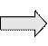

## 1 Introduction

Vendor API is an extended library for HDAL. Some features dedicated for the specific IC will not list in the HDAL API but in vendor API. Please refer to this document to know the detail.

## 2 Parameter IDs and data structure definition

**Videocap**

**None**

**Videodec**

 VENDOR_VIDEODEC_PARAM_JPEG_WORK_BUFFER

 support set/get with i/o path

 using VENDOR_VIDEODEC_JPEG_WORK_BUFFER struct

 VENDOR_VIDEODEC_PARAM_FREE_JPEG_WORK_BUFFER

 support set with i/o path

 using VENDOR_VIDEODEC_JPEG_WORK_BUFFER struct

 VENDOR_VIDEODEC_PARAM_SUB_YUV_RATIO

 support set/get with i/o path

 using VENDOR_VIDEODEC_SUB_YUV struct

 VENDOR_VIDEODEC_PARAM_QP_CONFIG

 support set/get with i/o path

 using VENDOR_VIDEODEC_QP_CONFIG struct

 VENDOR_VIDEODEC_PARAM_H26X_OUT

 support set/get with i/o path

 using VENDOR_VIDEODEC_H26X_OUT struct

 VENDOR_VIDEODEC_PARAM_SYSCAPS

 support get with i/o path

 using VENDOR_VIDEODEC_SYSCAPS struct

**Videoenc**

 VENDOR_VIDEOENC_PARAM_OSG_SEL

 support get/set with i/o path

 using VENDOR_VIDEOENC_OSG struct

 VENDOR_VIDEOENC_PARAM_MIN_COMPRESS_RATIO

 support get/set with i/o path

 using VENDOR_VDOENC_MIN_COMPRESS_RATIO struct

**Videoout**

 VENDOR_VIDEOOUT_PARAM_WRITEBACK

 support get/set with i/o path

 using VENDOR_VIDEOOUT_WRITEBACK struct

 VENDOR_VIDEOOUT_PARAM_WIN_LAYER_ATTR,

 support get/set with i/o path

 using VENDOR_VIDEOOUT_WIN_LAYER_ATTR struct

 VENDOR_VIDEOOUT_PARAM_MODE

 support get/set with i/o path

 using VENDOR_VIDEOOUT_MODE struct

**Videoprocess**

 VENDOR_VIDEOPROC_STATUS

 support set with i/o path

 using VENDOR_VDOPROC_STATUS struct

 VENDOR_VIDEOPROC_USER_FLAG

 support set with i/o path

 using UINT32 struct

 VENDOR_VIDEOPROC_SUB_RATIO_THLD

 support set/get with i/o path

 using VENDOR_VDOPROC_SUB_RATIO_THLD struct

 VENDOR_VIDEOPROC_USR_INIT_FRAME

 support set with i/o path

 using VENDOR_VDOPROC_USR_INIT_FRAME_INFO struct

**Audioio**

 VENDOR_UNDERRUN_CNT

 support get with i/o path

 using VENDOR_AUDIOIO_UNDERRUN_CONFIG struct

 VENDOR_AUDIOIO_PARAM_SYSCAPS

 support get with i/o path

 using VENDOR_AUDIOIO_PARAM_SYSCAPS struct

 VENDOR_AUDIOIO_STATUS

 support get with i/o path

 using VENDOR_AUDIOIO_STATUS struct

 VENDOR_AUDIOIO_INIT_CFG

 support set/get with i/o path

 using VENDOR_AUDIOIO_INIT_I2S_CFG struct

 VENDOR_AUDIOIO_AOUT_LB_DEV_ID

 support get with i/o path

 using VENDOR_AUDIOIO_AOUT_LB_DEV_INFO struct

 VENDOR_AUDIOIO_SYNC_TIME

 support set with i/o path

 using VENDOR_AUDIOIO_SYNC_TIME_INFO struct

### 2.1 Videocap function and data structure definition

#### 2.1.1 Function: vendor_videocap_get

[Description]

Get parameters from unit by path id

[Syntax]

HD_RESULT vendor_videocap_get (HD_PATH_ID path_id, VENDOR_VIDEOENC_PARAM_ID id, VOID\* p_param)

[Parameter]

| Value   | Description           |
|---------|-----------------------|
| path_id | the path id           |
| id      | id of parameters      |
| p_param | pointer of parameters |

[Return Value]

| Value              | Description                |
|--------------------|----------------------------|
| HD_OK              | Success                    |
| HD_ERR_NG          | Failure                    |
| HD_ERR_NOT_SUPPORT | Not support this parameter |

#### 2.1.2 Function: vendor_videocap_set

[Description]

Set parameters to unit by path id

[Syntax]

HD_RESULT vendor_videocap_set (HD_PATH_ID path_id, VENDOR_VIDEOENC_PARAM_ID id, VOID\* p_param)

[Parameter]

| Value   | Description           |
|---------|-----------------------|
| path_id | the path id           |
| id      | id of parameters      |
| p_param | pointer of parameters |

[Return Value]

| Value              | Description                |
|--------------------|----------------------------|
| HD_OK              | Success                    |
| HD_ERR_NG          | Failure                    |
| HD_ERR_NOT_SUPPORT | Not support this parameter |

#### 2.1.3 Function: vendor_videocap_push_in_buf

[Description]

trigger mode: given a buffer to get yuv data out.

flow mode: given an additional buffer to get yuv data out. (It will influence the already bound path.)

**It suggests that after 2 or more different buffers are pushed, then vendor_videocap_pull_out_buf starts to get done buffer.**

Note: There is another application to get yuv data out without given buffer, hd_videocap_pull_out_buf(). But, hd_videocap_release_out_buf() should be called to return yuv data buffer.

[Syntax]

HD_RESULT vendor_videocap_push_in_buf(HD_PATH_ID path_id, HD_VIDEO_FRAME\* p_video_frame, INT32 wait_ms)

[Parameter]

| Value         | Description                                                                    |
|---------------|--------------------------------------------------------------------------------|
| path_id       | the path id                                                                    |
| p_video_frame | settings for getting data, must including width/height/pxlfmt/physical address |
| wait_ms       | mini-seconds to get callback result                                            |

[Return Value]

| Value        | Description                               |
|--------------|-------------------------------------------|
| HD_OK        | Success                                   |
| HD_ERR_DEV   | Wrong device id                           |
| HD_ERR_PARAM | Wrong input settings                      |
| HD_ERR_NOBUF | Not enough buffer for outputting yuv data |

#### 2.1.4 Function: vendor_videocap_pull_out_buf

[Description]

trigger mode: pull out the yuv data buffer.

flow mode: pull out the yuv data buffer which is pushed-in by vendor_videocap_push_in_buf( ).

[Syntax]

HD_RESULT vendor_videocap_pull_out_buf(HD_PATH_ID path_id, HD_VIDEO_FRAME\* p_video_frame, INT32 wait_ms)

[Parameter]

| Value         | Description                                                                    |
|---------------|--------------------------------------------------------------------------------|
| path_id       | the path id                                                                    |
| p_video_frame | settings for getting data, must including width/height/pxlfmt/physical address |
| wait_ms       | mini-seconds to get callback result                                            |

[Return Value]

| Value           | Description                           |
|-----------------|---------------------------------------|
| HD_OK           | Success                               |
| HD_ERR_DEV      | Wrong device id                       |
| HD_ERR_PARAM    | Wrong input settings                  |
| HD_ERR_TIMEDOUT | Vcap module is still busy, need retry |
| HD_ERR_SYS      | Vcap module is not ready              |
| HD_ERR_FAIL     | this job is failed from vcap driver   |

#### 2.1.5 Structure: VENDOR_VIDEOCAP_CROPCTRL_INFO

[Description]

Support an option to apply crop information.

[Parameter]

| Value | Description                            |
|-------|----------------------------------------|
| rect  | Crop rectangular, including x, y, w, h |
| coord | Background rectangular                 |

[Apply Require]

| open-\>set-\>get |
|------------------|

#### 2.1.6 Structure: VENDOR_VIDEOCAP_SYSCAPS

[Description]

Get videocap system capability information through user-specified type/mode.

[Parameter]

| Value         | Description                        |
|---------------|------------------------------------|
| wanted_pxlfmt | [input] vcap out fmt               |
| min_dim       | [output] min width/height          |
| max_dim       | [output] max width/height          |
| crop_min_dim  | [output] min crop width/height     |
| output_align  | [output] alignment of width/height |

[Apply Require]

| open-\> get |
|-------------|

### 2.2 Videodec function and data structure definition

#### 2.2.1 Function: vendor_videodec_get

[Description]

Get parameters from unit by path id

[Syntax]

HD_RESULT vendor_videodec_get (HD_PATH_ID path_id, VENDOR_VIDEODEC_PARAM_ID id, VOID\* p_param)

[Parameter]

| Value   | Description           |
|---------|-----------------------|
| path_id | the path id           |
| id      | id of parameters      |
| p_param | pointer of parameters |

[Return Value]

| Value              | Description                |
|--------------------|----------------------------|
| HD_OK              | Success                    |
| HD_ERR_NG          | Failure                    |
| HD_ERR_NOT_SUPPORT | Not support this parameter |

#### 2.2.2 Function: vendor_videodec_set

[Description]

Set parameters to unit by path id

[Syntax]

HD_RESULT vendor_videodec_set (HD_PATH_ID path_id, VENDOR_VIDEODEC_PARAM_ID id, VOID\* p_param)

[Parameter]

| Value   | Description           |
|---------|-----------------------|
| path_id | the path id           |
| id      | id of parameters      |
| p_param | pointer of parameters |

[Return Value]

| Value              | Description                |
|--------------------|----------------------------|
| HD_OK              | Success                    |
| HD_ERR_NG          | Failure                    |
| HD_ERR_NOT_SUPPORT | Not support this parameter |

#### 2.2.3 Structure: VENDOR_VIDEODEC_JPEG_WORK_BUFFER

[Description]

This function is not supported on NT9833x.

#### 2.2.4 Structure: VENDOR_VIDEODEC_FREE_JPEG_WORK_BUFFER

[Description]

This function is not supported on NT9833x.

#### 2.2.5 Structure: VENDOR_VIDEODEC_SUB_YUV

[Description]

Set/get videodec sub-yuv ratio.

[Parameter]

| Value | Description   |
|-------|---------------|
| ratio | Sub-yuv ratio |

[Apply Require]

| set / get |
|-----------|

#### 2.2.6 Structure: VENDOR_VIDEODEC_QP_CONFIG

[Description]

Set/get videodec qp value configuration.

[Parameter]

| Value    | Description                  |
|----------|------------------------------|
| qp_value | Quantization parameter value |

[Apply Require]

| set / get |
|-----------|

#### 2.2.7 Structure: VENDOR_VIDEODEC_H26X_OUT

[Description]

Set/get videodec H.26x output format configuration.

[Parameter]

| Value     | Description             |
|-----------|-------------------------|
| first_out | H.26x first output mode |
| extra_out | H.26x extra output mode |

[Apply Require]

| set / get |
|-----------|

#### 2.2.8 Structure: VENDOR_VIDEODEC_SYSCAPS

[Description]

Get videodec system capability information through user-specified type/mode.

[Parameter]

| Value          | Description                                                 |
|----------------|-------------------------------------------------------------|
| usr_codec_type | [user_input] user codec type to get system capabilitys      |
| usr_first_mode | [user_input] user first output mode (compress / uncompress) |
| usr_extra_mode | [user_input] user extra output mode (compress / uncompress) |
| first_align    | [output] first output buffer dimension alignment            |
| extra_align    | [output] extra output buffer dimension alignment            |
| first_pxlfmt   | [output] first output buffer pixel format                   |
| extra_pxlfmt   | [output] extra output buffer pixel format                   |
| min_dim        | [output] minimum dimension                                  |
| max_dim        | [output] maximum dimension                                  |

[Apply Require]

| get |
|-----|

### 2.3 Videoenc function and data structure definition

#### 2.3.1 Function: vendor_videoenc_get

[Description]

Get parameters from unit by path id

[Syntax]

HD_RESULT vendor_videoenc_get (HD_PATH_ID path_id, VENDOR_VIDEOENC_PARAM_ID id, VOID\* p_param)

[Parameter]

| Value   | Description           |
|---------|-----------------------|
| path_id | the path id           |
| id      | id of parameters      |
| p_param | pointer of parameters |

[Return Value]

| Value              | Description                |
|--------------------|----------------------------|
| HD_OK              | Success                    |
| HD_ERR_NG          | Failure                    |
| HD_ERR_NOT_SUPPORT | Not support this parameter |

#### 2.3.2 Function: vendor_videoenc_set

[Description]

Set parameters to unit by path id

[Syntax]

HD_RESULT vendor_videoenc_set (HD_PATH_ID path_id, VENDOR_VIDEOENC_PARAM_ID id, VOID\* p_param)

[Parameter]

| Value   | Description           |
|---------|-----------------------|
| path_id | the path id           |
| id      | id of parameters      |
| p_param | pointer of parameters |

[Return Value]

| Value              | Description                |
|--------------------|----------------------------|
| HD_OK              | Success                    |
| HD_ERR_NG          | Failure                    |
| HD_ERR_NOT_SUPPORT | Not support this parameter |

#### 2.3.3 Structure: VENDOR_VIDEOENC_OSG

[Description]

Support an option to choose internal or external OSG

[Parameter]

| Value        | Description                            |
|--------------|----------------------------------------|
| external_osg | select which osg 1:3d osg 0:encode osg |

[Apply Require]

| stop -\> close -\> open -\> set -\> start  |
|--------------------------------------------|

#### 2.3.4 Structure: VENDOR_VIDEOENC_MIN_COMPRESS_RATIO

[Description]

Set initial compress ratio for different QP

[Parameter]

| Value      | Description                                       |
|------------|---------------------------------------------------|
| codec_type | select the codec by HD_VIDEO_CODEC type           |
| qp_ratio   | Set the qp ratio by VENDOR_VIDEOENC_QP_RATIO type |

[Apply Require]

| stop -\> close -\> open -\> set -\> start  |
|--------------------------------------------|

#### 2.3.5 Structure: VENDOR_JPEGENC_PARAM_RATE_CONTROL

[Description]

JPEG rate control parameters

[Parameter]

| Value           | Description                                              |
|-----------------|----------------------------------------------------------|
| Vbr_mode        | 0: CBR, 1: VBR, 2: FixQP                                 |
| base_qp         | Base qp value  (range 1\~100, not used when FixQP)       |
| min_quality     | Minimum quality  (range 1\~100, not used when FixQP)     |
| max_quality     | Maximum quality  (range 1\~100, not used when FixQP)     |
| bitrate         | bitrate  (max 128M, not used when FixQP)                 |
| frame_rate_base | Frame rate base                                          |
| frame_rate_incr | Frame rate incr  (fps = frame_rate_base/frame_rate_incr) |

[Apply Require]

| stop -\> close -\> open -\> set / get -\> start  |
|--------------------------------------------------|

#### 2.3.6 Structure: VENDOR_VIDEOENC_SYSCAPS

[Description]

Get videoenc system capability information through user-specified codec type

[Parameter]

| Value          | Description                                                 |
|----------------|-------------------------------------------------------------|
| usr_codec_type | [user_input] user codec type to get system capabilitys      |
| min_dim        | [output] minimum dimension                                  |
| max_dim        | [output] maximum dimension                                  |
| fmt_cnt        | [output] supported input format count                       |
| fmt_align      | [output] supported input format and corresponding alignment |

[Apply Require]

| stop -\> close -\> open -\> get -\> start  |
|--------------------------------------------|

### 2.4 Videoout function and data structure definition

#### 2.4.1 Function: vendor_videoout_get

[Description]

Get parameters from unit by path id

[Syntax]

HD_RESULT vendor_videoout_get (HD_PATH_ID path_id, VENDOR_VIDEOOUT_PARAM_ID id, VOID\* p_param)

[Parameter]

| Value   | Description           |
|---------|-----------------------|
| path_id | the path id           |
| id      | id of parameters      |
| p_param | pointer of parameters |

[Return Value]

| Value      | Description                   |
|------------|-------------------------------|
| HD_OK      | Success                       |
| HD_ERR_NG  | Failure                       |
| HD_ERR_SYS | Operating system call failure |

#### 2.4.2 Function: vendor_videoout_set

[Description]

Set parameters to unit by path id

[Syntax]

HD_RESULT vendor_videoout_set (HD_PATH_ID path_id, VENDOR_VIDEOOUT_PARAM_ID id, VOID\* p_param)

[Parameter]

| Value   | Description           |
|---------|-----------------------|
| path_id | the path id           |
| id      | id of parameters      |
| p_param | pointer of parameters |

[Return Value]

| Value      | Description                   |
|------------|-------------------------------|
| HD_OK      | Success                       |
| HD_ERR_NG  | Failure                       |
| HD_ERR_SYS | Operating system call failure |

#### 2.4.3 Structure: VENDOR_VIDEOOUT_WRITEBACK

[Description]

Duplicate videoout0 image to dst_lcd_id

[Parameter]

| Value      | Description                                  |
|------------|----------------------------------------------|
| enabled    | 0:disable 1:enable                           |
| wb_lx      | x start pixel (two-pixel alignment), Left x  |
| wb_ty      | y start line, Top Y, range: 0 \~ 12          |
| wb_rx      | x start pixel (two-pixel alignment), Right x |
| wb_by      | y start line, Bottom Y, range: 0 \~ 12       |
| wb_width   | write back width size                        |
| wb_height  | write back height size                       |
| dst_lcd_id | write back to lcdid                          |

[Apply Require]

| stop -\> close -\> open -\> set  |
|----------------------------------|

#### 2.4.4 Structure: VENDOR_VIDEOOUT_WIN_LAYER_ATTR

[Description]

Set win order

[Parameter]

| Value | Description       |
|-------|-------------------|
| layer | 0\~7:layer number |

[Apply Require]

| stop -\> close -\> open -\> set  |
|----------------------------------|

#### 2.4.5 Structure: VENDOR_VIDEOOUT_MODE

[Description]

Set videoout mode for special mode:1440x900/1680x1050/1920x1200

[Parameter]

| Value       | Description                                    |
|-------------|------------------------------------------------|
| output_type | HD_COMMON_VIDEO_OUT_TYPE                       |
| input_dim   | VENDOR_VIDEOOUT_INPUT_DIM                      |
| output_mode | VENDOR_VIDEOOUT_HDMI_ID VENDOR_VIDEOOUT_VGA_ID |

[Apply Require]

| stop -\> close -\> open -\> set  |
|----------------------------------|

#### 2.4.6 Structure: VENDOR_VIDEOOUT_EDID

[Description]

Get videoout support edid value

[Parameter]

| Value                         | Description             |
|-------------------------------|-------------------------|
| val [VENDOR_VIDEOOUT_EDID_NU] | Return edid value       |
| valid_num                     | Get support edid number |

[Apply Require]

| open -\> get  |
|---------------|

#### 2.4.7 Structure: VENDOR_VIDEOOUT_EDID_CAP

[Description]

Get monitor edid data

[Parameter]

| Value           | Description                     |
|-----------------|---------------------------------|
| hdmi_edid       | VENDOR_EDID_TBL                 |
| VENDOR_EDID_TBL | Store edid data and info        |
| edid_length     | Edid data size                  |
| edid[512]       | Edid array                      |
| is_valid        | Indicate edid info is valid     |
| w/h             | Valid edid info dim             |
| refresh_rate    | Valid edid info refresh rate    |
| is_progress     | Valid edid info progress format |
| aspect_rate     | Valid edid info aspect rate     |

[Apply Require]

| open -\> get  |
|---------------|

#### 2.4.8 Structure: VENDOR_VIDEOOUT_SYSCAPS

[Description]

Get videoout system capability information through user-specified lcd_id.

[Parameter]

| Value           | Description                                  |
|-----------------|----------------------------------------------|
| lcd_id          | [input] 0: lcd310, 1: lcd310 lite, 2: lcd210 |
| pxlfmt_cnt      | [output] count of total pxlfmts              |
| support_pxlfmt1 | [output] 1st supporting format               |
| support_pxlfmt2 | [output] 2nd supporting format               |
| support_pxlfmt3 | [output] 3rd supporting format               |

[Apply Require]

| open-\> get |
|-------------|

### 2.5 Videoprocess function and data structure definition

#### 2.5.1 Function: vendor_videoproc_get

[Description]

Get parameters from unit by path id

[Syntax]

HD_RESULT vendor_videoproc_get (HD_PATH_ID path_id, VENDOR_VIDEOPROC_PARAM_ID id, VOID\* p_param)

[Parameter]

| Value   | Description           |
|---------|-----------------------|
| path_id | the path id           |
| id      | id of parameters      |
| p_param | pointer of parameters |

[Return Value]

| Value              | Description                |
|--------------------|----------------------------|
| HD_OK              | Success                    |
| HD_ERR_NG          | Failure                    |
| HD_ERR_NOT_SUPPORT | Not support this parameter |

#### 2.5.2 Function: vendor_videoproc_set

[Description]

Set parameters to unit by path id

[Syntax]

HD_RESULT vendor_videoproc_set (HD_PATH_ID path_id, VENDOR_VIDEOPROC_PARAM_ID id, VOID\* p_param)

[Parameter]

| Value   | Description           |
|---------|-----------------------|
| path_id | the path id           |
| id      | id of parameters      |
| p_param | pointer of parameters |

[Return Value]

| Value              | Description                |
|--------------------|----------------------------|
| HD_OK              | Success                    |
| HD_ERR_NG          | Failure                    |
| HD_ERR_NOT_SUPPORT | Not support this parameter |

#### 2.5.3 Structure: VENDOR_VDOPROC_STATUS

[Description]

Get vproc available input buffer count

[Parameter]

| Value       | Description                  |
|-------------|------------------------------|
| dti_buf_cnt | available input buffer count |

[Apply Require]

| open -\> get |
|--------------|

#### 2.5.4 Structure: VENDOR_VDOPROC_SUB_RATIO_THLD

[Description]

Get/set sub-yuv ratio threshold for vproc unit.

[Parameter]

| Value | Description                            |
|-------|----------------------------------------|
| numer | numerator of sub-yuv ratio threshold   |
| denom | denominator of sub-yuv ratio threshold |

[Apply Require]

| open -\> get -\> set |
|----------------------|

#### 2.5.5 Structure: VENDOR_VIDEOPROC_USR_INIT_FRAME_INFO

[Description]

Pre-specify the first input frame for this videoproc.

This is used for playback feature, the frame is shown before decoder has started and the first bitstream data is decoded.

[Parameter]

| Value | Description             |
|-------|-------------------------|
| image | The pre-specified frame |

#### 2.5.6 vendor_videoprocess_pull_in_buf

[Description]

Pull the input video buffer from unit

[Syntax]

HD_RESULT vendor_videoproc_pull_in_buf(HD_PATH_ID path_id, HD_VIDEO_FRAME\* p_video_frame, INT32 wait_ms);

[Parameter]

| Value         | Description                        |
|---------------|------------------------------------|
| path_id       | the path id                        |
| p_video_frame | pointer of the output video buffer |
| wait_ms       | timeout value in ms                |

[Return Value]

| Value     | Description |
|-----------|-------------|
| HD_OK     | Success     |
| HD_ERR_NG | Failure     |

#### 2.5.7 vendor_videoprocess_release_in_buf

[Description]

Release the video frame buffer which is get from unit

[Syntax]

HD_RESULT vendor_videoproc_release_in_buf(HD_PATH_ID path_id, HD_VIDEO_FRAME\* p_video_frame)

[Parameter]

| Value         | Description                        |
|---------------|------------------------------------|
| path_id       | the path id                        |
| p_video_frame | pointer of the output video buffer |

[Return Value]

| Value     | Description |
|-----------|-------------|
| HD_OK     | Success     |
| HD_ERR_NG | Failure     |

#### 2.5.8 Structure: VENDOR_DEWARP_2DLUT_TABLE

[Description]

2D_lut table is made by the rsc tool. Set 2D_lut table for vpe module to map.

[Parameter]

| Value | Description   |
|-------|---------------|
| tbl   | 65x68x UINT32 |

More details of 2D_lut and dctg, please refer to Chapter 3.

[Apply Require]

| open -\> get -\> set |
|----------------------|

 

2D_lut example.

#### 2.5.9 Structure: VENDOR_DEWARP_MODE

[Description]

Not used now.

#### 2.5.10 Structure: VENDOR_DEWARP_DGC_PARM

[Description]

Gdc information. (DGC is a typo). User should get this information from vpe module. Only cent_x_s, cent_y_s, and lens_r parameters are suggested to be changed.

[Parameter]

| Value       | Description                                 |
|-------------|---------------------------------------------|
| cent_x_s    | lens center of x axis                       |
| cent_y_s    | lens center of y axis                       |
| lens_r      | the radius of image, half of pattern height |
| xdist       | Fixed                                       |
| Ydist       | Fixed                                       |
| normfact    | Fixed                                       |
| normbit     | Fixed                                       |
| geo_lut[65] | gdc look-up table                           |

More details of gdc parameters, please refer to Chapter 3.

#### 2.5.11 Structure: VENDOR_DEWARP_2DLUT_PARM

[Description]

2D_lut parameters. Only lut2d_sz could be changed to 3 (65x65).

[Parameter]

| Value    | Description                     |
|----------|---------------------------------|
| lut2d_sz | size selection, 0: 9x9, 3:65x65 |
| hfact    | Fixed                           |
| vfact    | Fixed                           |
| xofs_i   | 2D-lut x offset (integer)       |
| xofs_f   | 2D-lut x offset (fraction)      |
| yofs_i   | 2D-lut y offset (integer)       |
| yofs_f   | 2D-lut y offset (fraction)      |

#### 2.5.12 Structure: VENDOR_DEWARP_FOV_PARM

[Description]

Fov parameters. Not used now.

#### 2.5.13 Structure: VENDOR_DEWARP_INFO

[Description]

Dewarp paramters.

[Parameter]

| Value                    | Description    |
|--------------------------|----------------|
| VENDOR_DEWARP_MODE       | Section 2.5.8  |
| VENDOR_DEWARP_DGC_PARM   | Section 2.5.9  |
| VENDOR_DEWARP_2DLUT_PARM | Section 2.5.10 |
| VENDOR_DEWARP_FOV_PARM   | Section 2.5.11 |

[Apply Require]

| open -\> get -\> set |
|----------------------|

#### 2.5.14 Structure: VENDOR_DEWARP_DCTG_MODE

[Description]

Set VENDOR_DEWARP_DCTG_MODE_360, when doing 2D_lut.

[Parameter]

| Value                       | Description |
|-----------------------------|-------------|
| VENDOR_DEWARP_DCTG_MODE_90  | Do DCTG     |
| VENDOR_DEWARP_DCTG_MODE_360 | Do 2D_lut   |

#### 2.5.15 Structure: VENDOR_DEWARP_DCTG_LENS_PARM

[Description]

DCTG lens parameters.

[Parameter]

| Value      | Description                     |
|------------|---------------------------------|
| mount_type | 0: ceiling, 1: floor            |
| lut2d_sz   | size selection, 0: 9x9, 3:65x65 |
| lens_r     | radius of lens                  |
| lens_x_st  | lens start x position           |
| lens_y_st  | lens start y position           |

lut2d_sz in VENDOR_DEWARP_DCTG_LENS_PARM should be equal to lut2d_sz in VENDOR_DEWARP_2DLUT_PARM.

#### 2.5.16 Structure: VENDOR_DEWARP_DCTG_FOV_PARM

[Description]

Not used now.

#### 2.5.17 Structure: VENDOR_DEWARP_DCTG_INFO

[Description]

DCTG information.

[Parameter]

| Value                        | Description    |
|------------------------------|----------------|
| VENDOR_DEWARP_DCTG_MODE      | Section 2.5.13 |
| VENDOR_DEWARP_DCTG_LENS_PARM | Section 2.5.14 |
| VENDOR_DEWARP_DCTG_FOV_PARM  | Section 2.5.15 |

[Apply Require]

| open -\> get -\> set |
|----------------------|

#### 2.5.18 Structure: VENDOR_DEWARP_CTRL

[Description]

Dewarp engine on/off. After setting VENDOR_DEWARP_INFO and VENDOR_DEWARP_DCTG_INFO, set VENDOR_DEWARP_CTRL to start vpe dewarp action.

[Parameter]

| Value       | Description                   |
|-------------|-------------------------------|
| dc_enable   | Use 2D_lut, On. Use dctg, On. |
| dctg_enable | Use dctg, On. Use 2D_lut, OFF |

The difference between 2D_lut and dctg, please refer to Chapter 3.

[Apply Require]

| open -\> get -\> set |
|----------------------|

Sample codes: liveview_with_dewarp.c and playback_with_dewarp.c show how the setting works.

### 2.6 Audioio function and data structure definition

#### 2.6.1 Function: vendor_audioio_get

[Description]

Get parameters from unit by path id

[Syntax]

HD_RESULT vendor_audioio_get (HD_PATH_ID path_id, VENDOR_AUDIOIO_PARAM_ID id, VOID\* p_param)

[Parameter]

| Value   | Description           |
|---------|-----------------------|
| path_id | the path id           |
| id      | id of parameters      |
| p_param | pointer of parameters |

[Return Value]

| Value              | Description                |
|--------------------|----------------------------|
| HD_OK              | Success                    |
| HD_ERR_NG          | Failure                    |
| HD_ERR_NOT_SUPPORT | Not support this parameter |
| HD_ERR_PATH        | Invalid path id            |

#### 2.6.2 Function: vendor_audioio_set

[Description]

Set parameters to unit by path id

[Syntax]

HD_RESULT vendor_audioio_set (HD_PATH_ID path_id, VENDOR_AUDIOIO_PARAM_ID id, VOID\* p_param)

[Parameter]

| Value   | Description           |
|---------|-----------------------|
| path_id | the path id           |
| id      | id of parameters      |
| p_param | pointer of parameters |

[Return Value]

| Value              | Description                |
|--------------------|----------------------------|
| HD_OK              | Success                    |
| HD_ERR_NG          | Failure                    |
| HD_ERR_NOT_SUPPORT | Not support this parameter |

#### 2.6.3 Function: vendor_audioio_set_livesound

[Description]

This function supports to send command to lower driver to start/stop livesound function with specified pathid without any binding operation.

You still need to set audio parameters such as HD_AUDIOCAP_PARAM_IN and HD_AUDIOOUT_PARAM_IN before using this function.

[Syntax]

HD_RESULT vendor_audioio_set_livesound(HD_PATH_ID acap_path_id, HD_PATH_ID aout_path_id, UINT on_off)

[Parameter]

| Value        | Description                                                     |
|--------------|-----------------------------------------------------------------|
| acap_path_id | The audiocapture path id                                        |
| aout_path_id | The audioout path id                                            |
| on_off       | To start or stop livesound 0: stop livesound 1: start livesound |

[Return Value]

| Value       | Description                           |
|-------------|---------------------------------------|
| HD_OK       | Success                               |
| HD_ERR_PATH | Wrong pathid                          |
| HD_ERR_NG   | Fail to send command to lower driver. |

#### 2.6.4 Structure: VENDOR_AUDIOIO_UNDERRUN_CONFIG

[Description]

This structure describes the internal audio status such as underrun, ongoing, and done counts. This structure is only used for audiocap or audioout.

VENDOR_AUDIOIO_STATUS_INFO is an alias of this structure.

[Parameter]

| Value        | Description                                                                                                                                                                                                                                                                                  |
|--------------|----------------------------------------------------------------------------------------------------------------------------------------------------------------------------------------------------------------------------------------------------------------------------------------------|
| underrun_cnt | The times of buffer that underrun has happened. For audiocap, it means no buffer for receiving incoming audio PCM. You may lose audio data. For audioout, it means no PCM data for playing. You may hear nothing or staccato wave.                                                           |
| ongoing_cnt  | The counts of buffers that doesn’t process. For audiocap, it is the count of buffer that is waiting for receiving incoming PCM data. For audioout, it is the count of buffer in the queue waiting for playing. You can tell if the audio playback is done by checking this value until zero. |
| done_cnt     | The count of buffers that is processed. For audiocap, it means the count of buffers already filled with PCM data but hasn’t received by APP.  For audioout, this value is meaningless.                                                                                                       |

[Apply Require]

| open -\> get |
|--------------|

#### 2.6.5 Structure: VENDOR_AUDIOIO_STATUS_INFO

VENDOR_AUDIOIO_STATUS_INFO is an alias of VENDOR_AUDIOIO_UNDERRUN_CONFIG. Please refer to 2.6.4 for details.

#### 2.6.6 Structure: VENDOR_AUDIOIO_AOUT_LB_DEV_INFO

[Description]

The structure fills the loopback HDAL dev_id of the calling path(audioout path).

[Parameter]

| Value  | Description                                    |
|--------|------------------------------------------------|
| dev_id | The loopback HDAL dev_id of this audioout path |

[Apply Require]

| open -\> get |
|--------------|

#### 2.6.7 Structure: VENDOR_AUDIOIO_SYNC_TIME_INFO

[Description]

Fill this structure to specify the target channel for synchronize time of output data.

[Parameter]

| Value       | Description                                    |
|-------------|------------------------------------------------|
| sync_target | The target pathid for synchronizing time with. |

[Apply Require]

| open -\> set |
|--------------|

### 2.7 Gfx function and data structe definition

#### 2.7.1 Structure: VENDOR_GFX_SYSCAPS

[Description]

Get gfx system capability information.

[Parameter]

| Value       | Description                     |
|-------------|---------------------------------|
| scl_rate    | get system max scaling factor   |
| min_dim     | get min input /output dimension |
| max_dim     | get max input /output dimension |
| image_align | get align limitation            |

#### 2.7.2 Function: vendor_gfx_get_syscaps

[Description]

Get VENDOR_GFX_SYSCAPS value

[Syntax]

HD_RESULT vendor_gfx_get_syscaps(VENDOR_GFX_SYSCAPS \*p_param)

[Parameter]

| Value   | Description           |
|---------|-----------------------|
| p_param | pointer of parameters |

[Return Value]

| Value              | Description                |
|--------------------|----------------------------|
| HD_OK              | Success                    |
| HD_ERR_NG          | Failure                    |
| HD_ERR_NOT_SUPPORT | Not support this parameter |

### 2.8 Vendor common function and data structe definition

#### 2.8.1 Function: vendor_common_mem_get_block_with_name

[Description]

Get memory block with name

[Syntax]

HD_COMMON_MEM_VB_BLK vendor_common_mem_get_block_with_name(HD_COMMON_MEM_POOL_TYPE pool_type, UINT32 blk_size, HD_COMMON_MEM_DDR_ID ddr, CHAR \*usr_name)

[Parameter]

| Value     | Description          |
|-----------|----------------------|
| pool_type | Value of pool type   |
| blk_size  | Value of memory size |
| ddr       | Value of ddr id      |
| usr_name  | Block name           |

[Return Value]

| Value                        | Description |
|------------------------------|-------------|
| HD_COMMON_MEM_VB_BLK         | Success     |
| HD_COMMON_MEM_VB_INVALID_BLK | Failure     |

#### 2.8.2 Function: vendor_common_clear_pool_blk

[Description]

Free all memory block with pool type and ddrid

[Syntax]

HD_RESULT vendor_common_clear_pool_blk(HD_COMMON_MEM_POOL_TYPE pool_type, INT ddrid)

[Parameter]

| Value     | Description        |
|-----------|--------------------|
| pool_type | Value of pool type |
| ddrid     | Value of ddr id    |

[Return Value]

| Value      | Description                  |
|------------|------------------------------|
| HD_OK      | Success                      |
| HD_ERR_NG  | Failure to find pool by type |
| HD_ERR_SYS | Failure to free all blk      |

### 2.9 Distortion Correction Engine (DCE)

#### 2.9.1 Overview

This is lens distortion calibration module, it can perform calibration on wide-angle lens and fish-eye lens.

#### 2.9.2 DCE Parameter Description

| Parameter | Range       | Default | Description                                                                                                                                                                                                                                                                 |
|-----------|-------------|---------|-----------------------------------------------------------------------------------------------------------------------------------------------------------------------------------------------------------------------------------------------------------------------------|
| dce_mode  | 0\~1        | 0       | Select distortion function 0: GDC lens calibration 1: 2DLUT self-define XY coordinate distortion                                                                                                                                                                            |
| lut2d_sz  | 0\~3        | 0       | Size selection of 2D look-up table. The larger the size, the more precision to describe distortion. 0: 9x9 1: (not supported) 2: (not supported) 3: 65x65                                                                                                                   |
| lsb_rand  | 0\~1        | 0       | LSB 2 bit random generation for internal 10 bit-\>8 bit image. 0: fixed fill 0 1: random generate 0\~3                                                                                                                                                                      |
| fovbound  | 0\~1        | 0       | FOV boundary process method selection. When the distortion result can not fill the total output image, select different way to proceed the exceed range. 0: Replace out of boundary pixels with duplicate nearest pixel 1: Replace out of boundary pixels with bound pixels |
| boundy    | 0\~1023     | 0       | Bound value for Y component(u8.2)                                                                                                                                                                                                                                           |
| boundu    | 0\~1023     | 0       | Bound value for U component(u8.2)                                                                                                                                                                                                                                           |
| boundv    | 0\~1023     | 0       | Bound value for V component(u8.2)                                                                                                                                                                                                                                           |
| cent_x_s  | 213-1       | 0       | Define lens center of x-axis. It is recommend to set width/2.                                                                                                                                                                                                               |
| cent_y_s  | 213-1       | 0       | Define lens center of y-axis. It is recommend to set height/2.                                                                                                                                                                                                              |
| xdist     | 0\~4095     | 0       | X input distance factor, for oval shape modeling. It is recommend to set 4095, which is suitable for most situation.                                                                                                                                                        |
| ydist     | 0\~4095     | 0       | Y input distance factor, for oval shape modeling. It is recommend to set 4095, which is suitable for most situation.                                                                                                                                                        |
| normfact  | 0\~255      | 128     | Radius normalization factor. Normfact = 1 \<\< (normbit + 7) / R2                                                                                                                                                                                                           |
| normbit   | 0\~31       | 31      | Radius normalization shift bit. R2 = (width/2)2+(height/2)2 The total bit number of R2 is normbit. Example: 9602+5402 = 1213200 (21 bits)                                                                                                                                   |
| fovgain   | 0\~4095     | 0       | Adjust the scaling ratio of the final distortion coordinate to preserve FOV. Scale down factor for FOV preservation. Due to it will effect the calibration performance, it is recommend to set 1024.                                                                        |
| hfact     | 0 \~ 224 -1 | 0       | Horizontal scaling factor for 2DLut scaling up(u0.24). ((2DLUT horizontal pixel number – 1) \<\< 24) / (width – 1)                                                                                                                                                          |
| vfact     | 0 \~ 224 -1 | 0       | Vertical scaling factor for 2DLut scaling up(u0.24). ((2DLUT vertical pixel number – 1) \<\< 24) / (height – 1)                                                                                                                                                             |
| xofs_i    | 0\~127      | 0       | 2DLut x offset, integer part. It is recommend to set 0, if user need to adjust the DCE performance, user need to change the 2DLUT value.                                                                                                                                    |
| xofs_f    | 0\~224-1    | 0       | 2DLut x offset, fraction part. It is recommend to set 0, if user need to adjust the DCE performance, user need to change the 2DLUT value.                                                                                                                                   |
| yofs_i    | 0\~127      | 0       | 2DLut y offset, integer part. It is recommend to set 0, if user need to adjust the DCE performance, user need to change the 2DLUT value.                                                                                                                                    |
| yofs_f    | 0\~224-1    | 0       | 2DLut y offset, fraction part. It is recommend to set 0, if user need to adjust the DCE performance, user need to change the 2DLUT value.                                                                                                                                   |

### 2.10 DC Table Generator

For perspective projection application, in order to increase the convenience of usage, DCTG module let user to set the desired angle and size with an instinct way to generate DCE parameters automatically.

#### 2.10.1 Overview

DCTG generate DCE 2D-LUT for perspective projection. Whenever this function is enabled, manual set DCE 2D-LUT function will be invalid.

Please refer to the following description:

The “theta” is the top/bottom angle.

The “phi” is the rotate angle.

The “rot_y” is the rotate offset of (x, z) plane towards Y-axis.

The “rot_z” is the rotate offset of (x, y) plane towards Z-axis.

Generate LUT:

Define the rotate angle of FOV by phi_st/phi_ed, and then rotate to FOV location by rot_y.

Define the top/bottom angle of FOV by theta_st/theta_ed, and then rotate to FOV location by rot_z.

#### 2.10.2 DCTG Parameter Description

| Parameter  | Range                               | Default | Description                                                                                                                             |
|------------|-------------------------------------|---------|-----------------------------------------------------------------------------------------------------------------------------------------|
| dctg_en    | 0\~1                                | 0       | DCTG ON/OFF ※ DCTG and dce_2d_lut_en cannot be enabled at the same time.                                                                |
| mount_type | 0\~1                                | 0       | Camera mount type.  0: Ceiling mount 1: Floor mount                                                                                     |
| lut2d_sz   | 0\~1                                | 0       | Select size of 2D look-up table, this parameter must the same with DCE parameter. 0: 9x9 1: (not supported) 2: (not supported) 3: 65x65 |
| lens_r     | 0\~215-1                            | 0       | Valid radius of fish-eye lens, the unit is pixel. Please refer to advance description.                                                  |
| lens_x_st  | 0\~214-1                            | 0       | The start x position of fish-eye lens at the source image, the unit is pixel.                                                           |
| lens_y_st  | 0\~214-1                            | 0       | The start y position of fish-eye lens at the source image, the unit is pixel.                                                           |
| theta_st   | s4.16 -220 \~ 220-1                 | 0       | FOV theta start radian. (-\*pi \~ \*pi)                                                                                                 |
| theta_ed   | s4.16 -220 \~ 220-1 (-\*pi \~ \*pi) | 0       | FOV theta end radian. (-\*pi \~ \*pi) theta_end \> theta_st: normal image theta_end \< theta_st: flip image                             |
| phi_st     | s4.16 -220 \~ 220-1                 | 0       | FOV phi start radian. (-2\*pi \~ 2\*pi)                                                                                                 |
| phi_ed     | s4.16 -220 \~ 220-1                 | 0       | FOV phi end radian. (-2\*pi \~ 2\*pi) phi_end \> theta_st: normal image phi_end \< theta_st: flip image                                 |
| rot_z      | s4.16 -220 \~ 220-1                 | 0       | Z-axis rotate radian. (-2\*pi \~ 2\*pi)                                                                                                 |
| rot_y      | s4.16 -220 \~ 220-1                 | 0       | Y-zxis rotate radian. (-2\*pi \~ 2\*pi)                                                                                                 |

#### 2.10.3 Advance description:

 **lens_r:** The valid radius of fish-eye device

 **lens_x\_**st : The start x position of fish-eye lens at the source image, the unit is pixel.

 **lens_y_st :** The start y position of fish-eye lens at the source image, the unit is pixel. 
