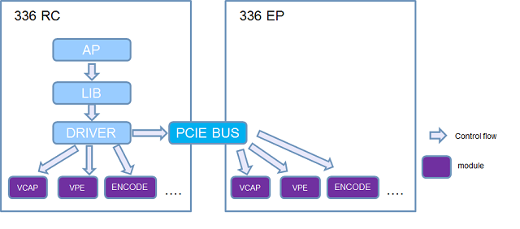
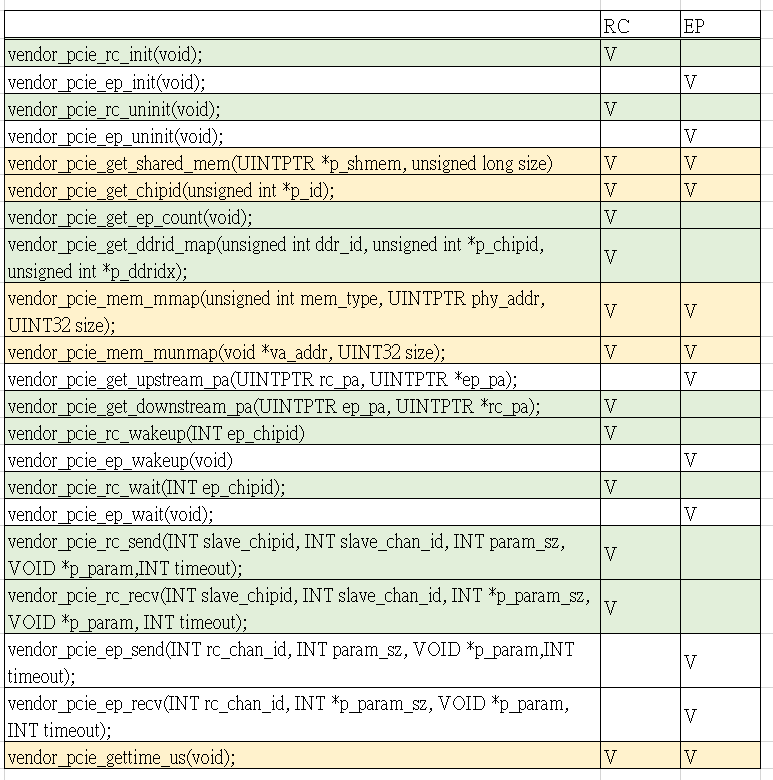
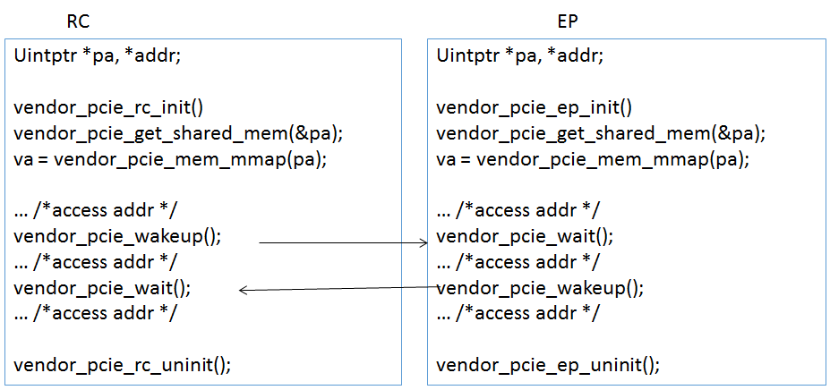

## Introduction

PCIE Bus connects RC to EPs. HDAL media flow could be centrally controlled by RC site. However, data could be transferred from RC to one EP, or from one EP to RC. Please refer to NT9833x_PCIe_User_Guide_en.doc to get some basic concepts about PCIe.



Fig 1. PCIE Bus diagram

Some features about data-transfer between different chips are defined in this document. Data in shared memory could be transferred through PCIe. “Downstream” means data from RC (Root Complex) to EP (End Point). “Upstream” means data from EP to RC. Please refer to the following figure.


Fig 2. PCIe Proprietary

## Parameter IDs and data structure definition

### Vendor PCIe function and data structure definition

#### Function: vendor_pcie_rc_init

[Description]

Initialize parameters in RC, such as buffers, and so on. Only be executed in RC.

[Syntax]

INT vendor_pcie_rc_init(void)

[Parameter]

| Value | Description |
|-------|-------------|
| void  | none        |

[Return Value]

| Value | Description |
|-------|-------------|
| 0     | Success     |
| -1    | Failure     |

#### Function: vendor_pcie_ep_init

[Description]

Initialize parameters in EP.

[Syntax]

INT vendor_pcie_ep_init(void)

[Parameter]

| Value | Description |
|-------|-------------|
| void  | none        |

[Return Value]

| Value | Description |
|-------|-------------|
| 0     | Success     |
| -1    | Failure     |

#### Function: vendor_pcie_rc_uninit

[Description]

Un-initialize parameters in RC.

[Syntax]

INT vendor_pcie_rc_init(void)

[Parameter]

| Value | Description |
|-------|-------------|
| void  | none        |

[Return Value]

| Value | Description |
|-------|-------------|
| 0     | Success     |
| -1    | Failure     |

#### Function: vendor_pcie_ep_uninit

[Description]

Un-nitialize parameters in EP.

[Syntax]

INT vendor_pcie_ep_uninit(void)

[Parameter]

| Value | Description |
|-------|-------------|
| void  | none        |

[Return Value]

| Value | Description |
|-------|-------------|
| 0     | Success     |
| -1    | Failure     |

#### Function: vendor_pcie_get_chipid

[Description]

Get self chipid. RC as 0.

[Syntax]

HD_RESULT vendor_pcie_get_chipid(unsigned int \*p_id);

[Parameter]

| Value | Description |
|-------|-------------|
| p_id  | chip_id     |

[Return Value]

| Value     | Description |
|-----------|-------------|
| HD_OK     | Success     |
| HD_ERR_NG | Failure     |

#### 

#### Function: vendor_pcie_get_shared_mem

[Description]

Get a specific buffer that RC and EP could both access.

[Syntax]

HD_RESULT vendor_pcie_get_shared_mem(UINTPTR \*p_shmem, unsigned long \*size);

[Parameter]

| Value   | Description       |
|---------|-------------------|
| p_shmem | pointer to buffer |
| size    | pointer to size   |

[Return Value]

| Value     | Description |
|-----------|-------------|
| HD_OK     | Success     |
| HD_ERR_NG | Failure     |

#### Function: vendor_pcie_get_ep_count

[Description]

Get EP counts. If count is zero, it means only RC.

[Syntax]

INT vendor_pcie_get_ep_count(void);

[Parameter]

| Value | Description |
|-------|-------------|
| void  | none        |

[Return Value]

| Value | Description    |
|-------|----------------|
| count | If 0, only RC. |

#### Function: vendor_pcie_get_ddrid_map

[Description]

Input a ddr_id to lookup in which chip.

[Syntax]

HD_RESULT vendor_pcie_get_ddrid_map(unsigned int ddr_id, unsigned int \*p_chipid, unsigned int \*p_ddridx);

[Parameter]

| Value    | Description    |
|----------|----------------|
| ddr_id   | input ddr_id   |
| p_chipid | output chip_id |
| p_ddridx | output ddr_idx |

[Return Value]

| Value     | Description |
|-----------|-------------|
| HD_OK     | Success     |
| HD_ERR_NG | Failure     |

#### Function: vendor_pcie_mem_mmap

[Description]

Get virtual address by inputing physical address with size.

[Syntax]

void \*vendor_pcie_mem_mmap(UINTPTR phy_addr, UINT32 size);

[Parameter]

| Value    | Description        |
|----------|--------------------|
| phy_addr | a physical address |
| size     | mapping size       |

[Return Value]

| Value   | Description               |
|---------|---------------------------|
| void \* | return a virtual address. |

#### Function: vendor_pcie_mem_munmap

[Description]

Unmap vitual address with size.

[Syntax]

HD_RESULT vendor_pcie_mem_munmap(void \*va_addr, UINT32 size);

[Parameter]

| Value   | Description      |
|---------|------------------|
| va_addr | a vitual address |
| size    | mapping size     |

[Return Value]

| Value     | Description |
|-----------|-------------|
| HD_OK     | Success     |
| HD_ERR_NG | Failure     |

#### Function: vendor_pcie_get_upstream_pa

[Description]

Input physical address in RC. It will be transferred to new physical address for EP to access.

[Syntax]

HD_RESULT vendor_pcie_get_upstream_pa(UINTPTR rc_pa, UINTPTR \*ep_pa);

[Parameter]

| Value   | Description                              |
|---------|------------------------------------------|
| rc_pa   | Input physical address in RC             |
| \*ep_pa | Output physical address for EP to access |

[Return Value]

| Value     | Description |
|-----------|-------------|
| HD_OK     | Success     |
| HD_ERR_NG | Failure     |

#### Function: vendor_pcie_get_downstream_pa

[Description]

Input physical address in EP. It will be transferred to new physical address for RC to access.

[Syntax]

HD_RESULT vendor_pcie_get_downstream_pa(UINTPTR ep_pa, UINTPTR \*rc_pa);

[Parameter]

| Value   | Description                              |
|---------|------------------------------------------|
| ep_pa   | Input physical address in EP             |
| \*rc_pa | Output physical address for RC to access |

[Return Value]

| Value     | Description |
|-----------|-------------|
| HD_OK     | Success     |
| HD_ERR_NG | Failure     |

#### Function: vendor_pcie_rc_wakeup

[Description]

It is executed in RC, and it wakes up a specific EP.

[Syntax]

HD_RESULT vendor_pcie_rc_wakeup(INT ep_chipid);

[Parameter]

| Value | Description |
|-------|-------------|
| INT   | ep_chipid   |

[Return Value]

| Value     | Description |
|-----------|-------------|
| HD_OK     | Success     |
| HD_ERR_NG | Failure     |

#### Function: vendor_pcie_ep_wakeup

[Description]

It is executed in EP, it wakes up RC.

[Syntax]

HD_RESULT vendor_pcie_ep_wakeup(void);

[Parameter]

| Value | Description |
|-------|-------------|
| void  | none        |

[Return Value]

| Value     | Description |
|-----------|-------------|
| HD_OK     | Success     |
| HD_ERR_NG | Failure     |

#### Function: vendor_pcie_rc_wait

[Description]

It is executed in RC, it waits for a specific EP.

[Syntax]

HD_RESULT vendor_pcie_rc_wakeup(INT ep_chipid);

[Parameter]

| Value | Description |
|-------|-------------|
| INT   | ep_chipid   |

[Return Value]

| Value     | Description |
|-----------|-------------|
| HD_OK     | Success     |
| HD_ERR_NG | Failure     |

#### Function: vendor_pcie_ep_wait

[Description]

It is executed in EP, and it waits for RC.

[Syntax]

HD_RESULT vendor_pcie_ep_wakeup(void);

[Parameter]

| Value | Description |
|-------|-------------|
| void  | none        |

[Return Value]

| Value     | Description |
|-----------|-------------|
| HD_OK     | Success     |
| HD_ERR_NG | Failure     |

#### Function: vendor_pcie_rc_send

[Description]

RC sends some data to a specific EP by a specific channel. Also, set timeout interval in mini-seconds.

[Syntax]

HD_RESULT vendor_pcie_rc_send(INT ep_chipid, INT ep_chan_id, INT param_sz, VOID \*p_param,INT timeout);

[Parameter]

| Value      | Description            |
|------------|------------------------|
| ep_chipid  | a chip id of EP        |
| ep_chan_id | a channel id of EP     |
| param_sz   | size of data           |
| p_param    | some parameters        |
| timeout    | timeout interval in ms |

[Return Value]

| Value     | Description |
|-----------|-------------|
| HD_OK     | Success     |
| HD_ERR_NG | Failure     |

#### Function: vendor_pcie_rc_recv

[Description]

RC receives some data from a specific EP by a specific channel. Also, set timeout interval in mini-seconds.

[Syntax]

HD_RESULT vendor_pcie_rc_recv(INT ep_chipid, INT ep_chan_id, INT \*param_sz, VOID \*p_param,INT timeout);

[Parameter]

| Value      | Description            |
|------------|------------------------|
| ep_chipid  | a chip id of EP        |
| ep_chan_id | a channel id of EP     |
| \*param_sz | get size of data       |
| p_param    | some parameters        |
| timeout    | timeout interval in ms |

[Return Value]

| Value     | Description |
|-----------|-------------|
| HD_OK     | Success     |
| HD_ERR_NG | Failure     |

#### Function: vendor_pcie_ep_send

[Description]

EP sends some data to the RC by a specific channel. Also, set timeout interval in mini-seconds.

[Syntax]

HD_RESULT vendor_pcie_ep_send(INT rc_chan_id, INT param_sz, VOID \*p_param,INT timeout);

[Parameter]

| Value      | Description            |
|------------|------------------------|
| rc_chan_id | a channel id of RC     |
| param_sz   | size of data           |
| p_param    | some parameters        |
| timeout    | timeout interval in ms |

[Return Value]

| Value     | Description |
|-----------|-------------|
| HD_OK     | Success     |
| HD_ERR_NG | Failure     |

#### Function: vendor_pcie_ep_recv

[Description]

EP receives some data from the RC by a specific channel. Also, set timeout interval in mini-seconds.

[Syntax]

HD_RESULT vendor_pcie_rc_recv(INT ep_chipid, INT ep_chan_id, INT \*param_sz, VOID \*p_param,INT timeout);

[Parameter]

| Value      | Description            |
|------------|------------------------|
| ep_chipid  | a chip id of EP        |
| ep_chan_id | a channel id of EP     |
| \*param_sz | get size of data       |
| p_param    | some parameters        |
| timeout    | timeout interval in ms |

[Return Value]

| Value     | Description |
|-----------|-------------|
| HD_OK     | Success     |
| HD_ERR_NG | Failure     |

#### Function: vendor_pcie_gettime_us

[Description]

Get system time in us.

[Syntax]

unsigned long vendor_pcie_gettime_us(void);

[Parameter]

| Value | Description |
|-------|-------------|
| void  | none        |

[Return Value]

| Value         | Description                  |
|---------------|------------------------------|
| unsigned long | System time in micro-second. |

#### Summary

A summary for API user shows as below. The functions in green rows are executed in RC only. The functions in yellow rows could be executed in RC/EPs.



### Pseudo code for Data Transfer

The following figure shows pseudo code for data transfer freely. RC/EP could use wakeup/wait to transfer any data. It suggests that data is put in other buffer, just some messages are put in pcie shared memory to inform other users.



## How to change buffer size for PCIe

Find the nvt-mem-tbl.dtsi for wanted product.

For example, configs/Linux/cfg_TEST_FPGA/nvt-mem-tbl.dtsi

```
	/* Linux system memory region*/
	memory { device_type = "memory"; reg = <0x0 0x00000000 0x0 0x08000000>; };	
...
 nvt-pcie-lib-cfg {
  compatible = "nvt,nvt-pcie-lib";
  rc_shm_size = <0x0 0x00100000>; /* [SIZE-H] [SIZE-L] */
 #default size is 1MB. 
  ep_alloc_mem = <0x1 0x0 0x18000000 0x0 0x08000000 
/* < [CHIPID] [ADDR-H] [ADDR-L] [SIZE-H] [SIZE-L] */
  >;
 }; 
...

	
```

The default setting for using PCIe buffer shows as below,


User could change the size of each block when inserting kdrv_cc_event.ko. For example,

“modprobe kdrv_cc_event.ko ai_buffer_size=0 pcie_xfer_size=80000”, set ai_buffer to 0KB, pcie_xfer_buffer to 512KB, then other_buffer will be 512KB.
