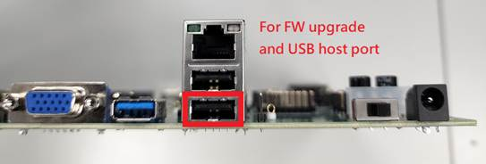
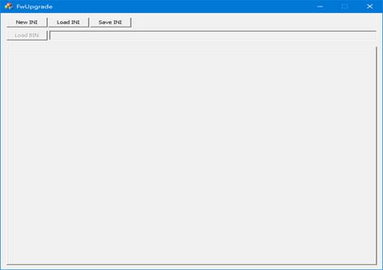

## 1 Introduction

This document describes the overview of the NT9833x DVR/NVR SDK. It introduces the software/hardware requirements, step-by-step instructions to setup the development environment and how to build and run the image. Chapter 4 introduces the boot up sequence. Chapter 5 introduces the concept of HDAL APIs and gives several sample codes to explain these APIs usage.

## 2 Environment Overview

### 2.1 General Description

This SDK will use Linux OS as development environment. To install Ubuntu OS, please refer *NT9833x_SDK_Pure_Linux_Programming_Guide_en.pdf*.

After Linux OS installed, unpack SDK package under Linux, then you can build your DVR/NVR firmware. When your Firmware is ready, connect EVB to PC, and upgrade it to EVB.

### 2.2 SDK Package

Using the following instructions to decompress SDK package under Linux:

**\$ tar -jxvf NT9833x_SDK_release_{VERSION}.tar.bz2**

You will get the folder tree as below:

├── hardware hardware document folder

├── board

├── document HW application note, and PCB/EVB document

├── chip

├── document chip datasheet

├── software software folder

├── board Linux SDK package and loader

├── document Linux and HDAL library document

├── chip

├── document chip document

├── pc PC upgrade, display and IQ tools.

├── document PC tool document

├──Disclaimer.pdf Disclaimer document

### 2.3 System Board Connection

1\. 12V input

2\. eth1

3\. Top: eth0; middle: Not use; bottom: USB 2.0

4\. USB 3.0

5\. VGA output

6\. HDMI output

7\. USB 2.0

8\. UART console

9\. Boot sequence switch

To update FW on the system board, please follow the following steps.

1\. Connect UART console port to PC.

2\. Connect 12V to power connector.

3\. Connect the bottom USB port to PC.

4\. Set J20 to 0, J21 to 1 and J22 to 0 to enter UART FW upgrade mode. And set J20 to 0, J21 to 0 and J22 to 1 to boot from NAND flash.

5\. Connect HDMI output to your display device.

Please refer to *NT9833x_Quick_Bringup_User_Guide_en.pdf* for detail information about the FW update.

#### 2.3.1 98633 EVB

The 98633 board is different from the 98336 board, please refer to the below figure or refer to *NT98633_NVR_EVB_User Guide_V1.0.pdf* to setup the hardware environment.

## 3 Environment Setup

### 3.1 Cross Compiler Setup

Toolchain:

 glib: aarch64-ca53-linux-gnueabihf-8.4

Please install the toolchain as following command

**\$ sudo tar –jxvf aarch64-ca53-linux-gnueabihf-8.4.tar.bz2 -C /opt**

If you want to change path, please modify the *CROSS_TOOLCHAIN_PATH* parameter in the *build/envsetup.sh*.

### 3.2 SDK Setup

Using the following instructions to decompress SDK pack under Linux.

**\$tar –jxvf na51090_linux_sdk.tar.bz2**

You will get the folder tree as below:

├──na51090_linux_sdk…………………………..Used to put unpacked SDK source code,

├── BSP ……………………………………………...Include linux, busybox, uboot and rootfs source

├── build ……………………………………………..scripts for the environment setup

├── code ………………………………………………HDAL linux drivers and sample code

├── configs……………………………………………Model settings

├── Makefile…………………………………………Top level Makefile

├── tools……………………………………………….target board tool

Before each opened a new Terminal window needs to compiler environment setting, the relevant variables set up, please follow the below instructions to finish it,

**\$ cd na51090_linux_sdk**

**\$ source build/envsetup.sh**

Please do a complete compilation for first time.

Select your model:

**\$lunch**

List your nvt build setting

**\$get_stuff_forenvironment**

Build overall system:

**\$make all**

### 3.3 Build Image

After the *“make all”* command. It will generate the images under *“na51090_linux_sdk/output”* folder. The details are listed as below:

├── na51090_linux_sdk/………………………………… Put unpacked source code and image

├── Makefile………………………………………. Top level Makefile

├── output/………………………………………….. Compiled output image

├── packed/

├── FW98336A.bin………………… nvtpack image (All-in-one image)

├── preburn_image/ …………………….… the pre-burn images, you can copy these files into \\DFUTools\\image, and burn into the system board via DFU tool.

├── raw/ …………………………………………. raw format of the output image

├── Image.bin……………………………….. Linux Image

├── u-boot.bin………………………………… uboot image with nvt checksum

├── u-boot.lz.bin…………………………… uboot image (LZ compressed)

├── u-boot.lzma.bin……………………… uboot image (LZMA compressed)

├── rootfs.ramdisk.bin……………………. ramdisk image (rootfs)

├── rootfs_1.rw.ubifs.bin…………………. rootfs overlay

├── DVRxxxxxxx.bin………………………… mnt\\mtd partition

├── nvt-all.bin…………………………………. linux kernel fdt

├── atf.bin…………………………..…………. arm-trusted-​firmware

├── FW98336A.ini……………..…………. the layout to pack to FW98336A.bin

The na51090_linux_sdk folder has a top level *Makefile*, it supports many of the make command, such as “*make linux*” is to compile linux-kernel, “*make uboot*” can compile u-boot, “*make rootfs*”…you can use “*make help*” to find what its commands are support. **Please use top level Makefile to do SDK compilation to avoid some link error occurred**. Its help description is as follows:

\$ make help

make help -\> show make command info

make all -\> build all

make linux -\> build linux-kernel

make linuxram -\> build linux-kernel with ramdisk support

make modules -\> build built-in kernel modules

make driver -\> build NVT linux driver modules

make atf -\> build ARM trusted firmware

make uboot -\> build loader(uboot)

make optee_os -\> build OPTEE kernel

make optee_client -\> build OPTEE client

make library -\> build library

make busybox -\> build busybox

make rootfs -\> build rootfs

make app -\> build applications

make tools -\> build tools

make sample -\> build sample code

make post -\> run postprocessing script

make pack -\> Generate nvtpack image and preburn images

make publish -\> remove some sources for publish

=====================================================

make linux_config -\> config linux-kernel

make linux_config_gcov-\> modify kernel config for code coverage tool

make uboot_config -\> config uboot

make busybox_config -\> config busybox

make linux_header -\> generate linux-kernel out of tree headers

=====================================================

make clean -\> clean all

make linux_clean -\> clean linux-kernel & built-in kernel modules

make driver_clean -\> clean NVT linux driver modules

make atf_clean -\> clean ARM trusted firmware

make uboot_clean -\> clean loader(uboot)

make optee_os_clean -\> clean optee kernel

make optee_client_clean -\> clean optee client application

make library_clean -\> clean library

make busybox_clean -\> clean busybox

make rootfs_clean -\> clean rootfs

make app_clean -\> clean applications

make tools_clean -\> clean tools

make sample_clean -\> clean sample code

make post_clean -\> run postprocessing clean script

make pack_clean -\> Remove nvtpack image

=====================================================

### 3.4 Run the First Sample

After “*make all*”, you can get the images in *“na51090_linux_sdk/output”*. And to try the images, you can select the jumper setting in EVB to enter FW upgrade mode first, and then use the following tool “*FwUpgrade.exe*” to burn the images into the flash memory.

The all-in-one image (\\na51090_linux_sdk\\output\\packed\\FW98336A.bin) is packed by the description in \\na51090_linux_sdk\\configs\\Linux\\cfg_XXX\\nvt-nvtpack.dtsi:

| /\*  \* Novatek Ltd. BSP part of dts  \*/   \&nand {   /\*\*   \* partition_name is \$1 as in partition_\$1 is referred   \* to nvt-na51090-storage-partition. dtsi  \*/  nvtpack {  ver = "NVTPACK_FW_INI_16072017"; /\* Fixed \*/  method = \<1\>; /\* Fixed \*/  index {  id0 { partition_name = "loader"; source_file = ""; }; /\* Fixed \*/  id1 { partition_name = "fdt"; source_file = "nvt-all.bin"; }; /\* Fixed \*/  id2 { partition_name = "fdt.restore"; source_file = ""; }; /\* Fixed \*/  id3 { partition_name = "atf"; source_file = "atf.bin"; };  id4 { partition_name = "uboot"; source_file = "u-boot.bin"; };  id5 { partition_name = "uenv"; source_file = ""; };  id6 { partition_name = "kernel"; source_file = "Image.bin"; };  id7 { partition_name = "rootfs"; source_file = "rootfs.ramdisk.bin"; };  id8 { partition_name = "rootfs1"; source_file = "rootfs_1.rw.ubifs.bin"; };  id9 { partition_name = "app"; source_file = "DVR_16CH.nand.ubifs.bin"; };  };  }; }; |
|-----------------------------------------------------------------------------------------------------------------------------------------------------------------------------------------------------------------------------------------------------------------------------------------------------------------------------------------------------------------------------------------------------------------------------------------------------------------------------------------------------------------------------------------------------------------------------------------------------------------------------------------------------------------------------------------------------------------------------------------------------------------------------------------------------------------------------------------------------------------------------------------------------------------------------------------------------------------------------------------------------|

And the partition order must be the same as \\na51090_linux_sdk\\configs\\Linux\\cfg_XXX\\nvt-storage-partition.dtsi.

After the upgrade is done, power on the target board, you can get the sample in the “*/mnt/mtd*” folder. And you can run the first sample code:

*root@NVTEVM:/mnt/mtd\$ ./liveview_1div_to_4div*

**Note: You may run the “display_with_change_mode” first to select your LCD resolution.**

The more sample codes are placed in “*na51090_linux_sdk/code/hdal/samples*”.

For more information about the firmware upgrade tool, you can refer to the document “*NT9833x_Quick_Bringup_User_Guide_en.pdf*”.

## 4 Boot-up Sequence

### 4.1 Overview of Booting Procedure

The following figure shows the booting sequence of NT9833x SDK. When the NT9833x system is powered on, the embedded ROM code is executed. The ROM code loads the loader code from the flash into the embedded SRAM and then executes the loader. The loader initializes DDR and loads FDT, ATF, OPTEE(optional) and uboot from the flash into DDR and jump into ATF. The ATF runs the arm trusted firmware and boot OPTEE(optional) and then jump into the uboot. The uboot initializes the basic hardware and loads linux image from the flash into DDR, and then bring up the linux kernel. Two stages during the linux bring up: the vg_boot.sh add the device modules into the linux kernel and the module_init initiates the external devices, such as AD, audio and the displayer.

### 4.2 vg_boot.sh

The script file “vg_boot.sh”:

| \#boot_ver=v1.5 \#chipver=\`head -1 /proc/pmu/chipver\` \#chipid=\`echo \$chipver \| cut -c 1-4\` echo ----------------------------------------------------------- echo " Boot DVR_16CH" echo ----------------------------------------------------------- echo "/sbin/mdev" \> /proc/sys/kernel/hotplug   MODEL_PATH=\$(dirname \$MODEL) MODEL_NAME="\${MODEL_PATH\#\#\*/}" AD_MODULE="techpoint" echo This model is \$MODEL_NAME   modprobe nvt_dmasys modprobe log log_ksize=4096 crash_notify=/mnt/mtd/crash.sh \#crash to execute /mnt/mtd/crash.sh echo /tmp \> /proc/videograph/dumplog \#change log path to /tmp   modprobe kdrv_cc_event modprobe ms max_channels=16 modprobe em max_channels=16   modprobe lcd_codec modprobe nvt_tve100 modprobe nvt_hdmi20 modprobe flcd300-common modprobe flcd300-pip gui_ddr=0 suspend_state=1  modprobe flcd300-pip1 gui_ddr=0 suspend_state=1 modprobe flcd200-common modprobe flcd200-pip gui_ddr=0 suspend_state=1     echo i2c 0x10011 \> /proc/nvt_info/nvt_pinmux/pinmux_set \## [NT98336 SYS] 16CH, camera support to 1080P@30, 4M@15, 5M@10 \#if [ "\$AD_MODULE" == "techpoint" ]; then  \## modprobe tp28xx_kdrv drv_mode=0 dev_num=2 ibus=0,1 iaddr=0x88,0x8a vout_mode=3,3 video_mux=1 vout_xcap=0x03040000,0x01020000 vout_vi=0x03040000,0x01020000 clk_dly=0x00000000,0x00000000 clk_inv=0x01010000,0x01010000 ch_map=2 clk_used=0x1 rstb_used=106 clk_driving=2  \#else  \## modprobe nvp6158_kdrv drv_mode=0 dev_num=2 ibus=0,0 iaddr=0x60,0x62 vout_mode=4,4 vout_xcap=0x0201,0x0403 vout_vi=0x0201,0x0403 vout_cdly=0x0606,0x0606 clk_dly=0x0000,0x0000 clk_inv=0x0000,0x0000 ch_map=1 clk_used=0x1 rstb_used=106 clk_driving=2 \#fi  modprobe tp28xx_kdrv dev_num=4 ibus=0,0,1,1 iaddr=0x88,0x8a,0x8c,0x8e vout_mode=3,3,3,3 video_mux=1 vout_xcap=0x0201,0x0304,0x0506,0x0708 vout_vi=0x0201,0x0304,0x0506,0x0708 vout_cdly=0x0300,0x0300,0x0300,0x0200 ch_map=1 clk_used=0xf clk_driving=2    modprobe vcap316_common modprobe vcap316_host0 sync_time_div=90   modprobe kdrv_vpe modprobe kflow_vpe mod_init=1 max_chip_num=1 max_eng_num=2 max_minor_num=127 max_md_lv_num=16 max_total_cam_ch=85 sw_bal_mode=1   modprobe nvt_audio modprobe kflow_audio   modprobe kdrv_dei modprobe kflow_dei max_chip_num=2 max_eng_num=1 max_minor_num=64 max_total_cam_ch=85   modprobe kdrv_jpg jpeg_enc_max_chn=53 jpeg_dec_max_chn=32 modprobe kdrv_venc h26x_enc_max_width=2560 h26x_enc_max_height=1440 max_total_cam_ch=53 modprobe nvt_vencrc modprobe kflow_videoenc modprobe h26xdec h26xd_max_width=2560 h26xd_max_height=1440 max_total_cam_ch=32 modprobe kflow_videodec   modprobe kdrv_osg modprobe kflow_osg modprobe kdrv_ssca modprobe kdrv_age modprobe kflow_gfx   modprobe kdrv_ai modprobe kflow_cnn modprobe kflow_nue modprobe kflow_nue2 modprobe kflow_cpu modprobe kflow_dsp modprobe kflow_ai_net   modprobe gs max_channels=16 modprobe usr_proc modprobe vpd quiet=0 max_channels=16 modprobe ddr_arb echo doing mdev-s mdev -s echo done!!   \## Syntax: module_init [dtb_file] [is_dump_dts] [is_init_videocap] [is_init_videoout] [is_init_audio] [is_show_logo] if [ "\$AD_MODULE" == "techpoint" ]; then  /mnt/mtd/module_init /mnt/mtd/cfg_DVR_16CH.dtb 0 1 1 1 0 & else  /mnt/mtd/module_init /mnt/mtd/cfg_DVR_16CH.dtb 0 2 1 1 0 & fi |
|-----------------------------------------------------------------------------------------------------------------------------------------------------------------------------------------------------------------------------------------------------------------------------------------------------------------------------------------------------------------------------------------------------------------------------------------------------------------------------------------------------------------------------------------------------------------------------------------------------------------------------------------------------------------------------------------------------------------------------------------------------------------------------------------------------------------------------------------------------------------------------------------------------------------------------------------------------------------------------------------------------------------------------------------------------------------------------------------------------------------------------------------------------------------------------------------------------------------------------------------------------------------------------------------------------------------------------------------------------------------------------------------------------------------------------------------------------------------------------------------------------------------------------------------------------------------------------------------------------------------------------------------------------------------------------------------------------------------------------------------------------------------------------------------------------------------------------------------------------------------------------------------------------------------------------------------------------------------------------------------------------------------------------------------------------------------------------------------------------------------------------------------------------------------------------------------------------------------------------------------------------------------------------------------------------------------------------------------------------------------------------------------------------------------------------------------------------------------------------------------------------------------------------------------------------------------------------------------------------------------------------------------------------------------------------------------------------------------------------------------------------------------------------------------------------------------------------------------------------------------------------------------------------------------------------------------------------------------------------------------------------------------------------------------------------------------------------------------------------------------------------------------------------------------------------------------------------------------------------------------------------------------------------------------------------------------------------------|

The vg_boot.sh insert the device modules into the linux kernel and finally run the module_init program to initiate the video input/output. For more information about the parameters of the device module, please refer to *NT9833x_Module_Parameters_en.pdf*.

### 4.3 module_init.c

The main functions of *module_init.c* are the buffer management and the external devices handling. The following figure shows the program flow of *module_init.c*.

#### 4.3.1 Memory Pool Setup

9833x system memory placement descripts in the file *nvt-mem-tbl.dtsi*:

| /\* Linux system memory region\*/ memory { device_type = "memory"; reg = \<0x0 0x00000000 0x0 0x2FD00000\>; /\* [addr-H] [addr-L] [size-H] [size-L] \*/ };   hdal-memory {  \#address-cells = \<4\>;  \#size-cells = \<2\>;  media {  reg = \< 0x0 0x0 0x0 0x2FD00000 0x0 0x10300000 /\* DDR ID H, L ADDR H, L, SIZE H, L \*/  0x0 0x1 0x1 0x00000000 0x0 0x40000000 /\* DDR ID H, L ADDR H, L, SIZE H, L \*/  \>;  }; };   /\* To config the nvt chip mapping relationship \*/ nvt_chip_mapping { \#address-cells = \<4\>; \#size-cells = \<2\>;  dram_map {  reg = \<  0x0 0x0 0x0 0x00000000 0x0 0x40000000 /\* DDR ID, CHIPID, ADDR H, L, SIZE H, L \*/  0x1 0x0 0x1 0x00000000 0x0 0x40000000 /\* DDR ID, CHIPID, ADDR H, L, SIZE H, L \*/  \>;  }; }; |
|-------------------------------------------------------------------------------------------------------------------------------------------------------------------------------------------------------------------------------------------------------------------------------------------------------------------------------------------------------------------------------------------------------------------------------------------------------------------------------------------------------------------------------------------------------------------------------------------------------------------------------------------------------------------------------------------------------------------------------------------------------------|

And about the memory pool placement in HDAL, you can use *DVR_XXX.xls* to calculate the pool size, and then copy the results into the *cfg_DVR_XXX.dts*.

The HDAL memory is used in the HDAL and the module drivers. The following figure shows three scenarios for using the HDAL memory.

The *assign_pool_addr()* in *module_init.c* will assign the physical address to each pool, and the memory placement will be as:

#### 4.3.2 Video Output Setup

The *videoout0_setup()*, *videoout1_setup()* and *videoout2_setup()* setup the video output for HDMI/VGA/CVBS:

1\. *hd_videoout_set(, HD_VIDEOOUT_PARAM_DEV_CONFIG, )* to setup the control parameters, such as the width, the height, the buffer address of the video plane and the GUI plane.

2\. *hd_videoout_set(, HD_VIDEOOUT_PARAM_FB_FMT,)* to set the video format of the frame buffer of the plane.

3\. *hd_videoout_set(, HD_VIDEOOUT_PARAM_FB_ENABLE, )* to enable the plane.

To set the video output for the same and different source, you can modify the *mode* and the *homology* parameters in the file *cfg_DVR_XXX.dts*.

| HDMI and VGA are from the same source.                                                                 | HDMI and VGA are from the different source.                                                                                                                         |
|--------------------------------------------------------------------------------------------------------|---------------------------------------------------------------------------------------------------------------------------------------------------------------------|
| videoout0 {/\*lcd300\*/ mode = "HD_COMMON_VIDEO_OUT_HDMI", … homology = "HD_COMMON_VIDEO_OUT_VGA"; … } | videoout0 {/\*lcd300\*/ mode = "HD_COMMON_VIDEO_OUT_HDMI", … homology = ""; … } videoout1 {/\*lcd300 lite\*/ mode = "HD_COMMON_VIDEO_OUT_VGA", … homology = ""; … } |

#### 4.3.3 Video Input Setup

The main procedure of the *videocap_module_init_tp()/videocap_module_init_nvp()* are as the following:

1\. Initiate the AD device. For example, open *"/dev/tp2823dev"* device node.

| ret = vendor_ad_init(ad_dev_name); if (ret != HD_OK) goto exit; |
|-----------------------------------------------------------------|

2\. Get the AD information, and organize this information as host, vi and channel information, and set them to the capture.

| ret = vendor_ad_get(VENDOR_AD_PARAM_TP28XX_DEVICE_INFO, \&dev_info); … /\* vcap host init, to specify vcap system vi usage and prepare requirement memory \*/ memset(&vcap_host, 0, sizeof(vcap_host)); vcap_host.host = 0;//only support 0 vcap_host.md.enable = dt_hdal_spec.vcap_host.md.enable; vcap_host.md.mb_x_num_max = dt_hdal_spec.vcap_host.md.mb_x_num_max; vcap_host.md.mb_y_num_max = dt_hdal_spec.vcap_host.md.mb_y_num_max; vcap_host.md.buf_src = dt_hdal_spec.vcap_host.md.buf_src; for (i = 0; i\< dev_info.dev_num; i++) {  for(j = 0; j\< VENDOR_AD_TP28XX_VOUT_MAX; j++) {  ...  vcap_host.vi[vcap_host.nr_of_vi].chip = VENDOR_AD_PLAT_VI_TO_CHIP_ID(dev_info.dev[i].vout[j].vi - 1);  vcap_host.vi[vcap_host.nr_of_vi].vcap = VENDOR_AD_PLAT_VI_TO_CHIP_VCAP_ID(dev_info.dev[i].vout[j].vi - 1);  vcap_host.vi[vcap_host.nr_of_vi].vi = VENDOR_AD_PLAT_VI_TO_VCAP_VI_ID(dev_info.dev[i].vout[j].vi - 1);   ...  } } ... ret = hd_videocap_drv_set(HD_VIDEOCAP_DRV_PARAM_INIT_HOST, \&vcap_host); ... /\* VCAP VI Register \*/ for (i=0; i\<dev_info.dev_num; i++) {  for (j=0; j\<VENDOR_AD_TP28XX_CHANNELS_PER_CHIP; j++) {  ...  memset(&vcap_vi, 0, sizeof(vcap_vi));  vcap_vi.chip = VENDOR_AD_PLAT_VI_TO_CHIP_ID(dev_info.dev[i].vout[j].vi - 1);  vcap_vi.vcap = VENDOR_AD_PLAT_VI_TO_CHIP_VCAP_ID(dev_info.dev[i].vout[j].vi - 1);  vcap_vi.vi = VENDOR_AD_PLAT_VI_TO_VCAP_VI_ID(dev_info.dev[i].vout[j].vi - 1);  vcap_vi.global.src = dev_info.dev[i].vout[j].xcap - 1;  vcap_vi.global.format = HD_VIDEOCAP_VI_FMT_BT656;  vcap_vi.global.id_extract = HD_VIDEOCAP_VI_CHID_EAV_SAV;  ...  ret = hd_videocap_drv_set(HD_VIDEOCAP_DRV_PARAM_REGISTER_VI, \&vcap_vi);  } } ... /\* VCH ID \*/ for (i=0; i\<dev_info.dev_num; i++) {  for (j=0; j\<VENDOR_AD_TP28XX_CHANNELS_PER_CHIP; j++) {  ...  memset(&ch_param, 0, sizeof(ch_param));  ch_param.chip = dev_info.dev[i].vin[j].chip;  ch_param.vcap = dev_info.dev[i].vin[j].vcap;  ch_param.vi = dev_info.dev[i].vin[j].vi;  ch_param.ch = dev_info.dev[i].vin[j].ch;  ch_param.value = dev_info.dev[i].vin[j].vch_id;  ch_param.pid = HD_VIDEOCAP_VI_CH_PARAM_VCH_ID;  ...  ret = hd_videocap_drv_set(HD_VIDEOCAP_DRV_PARAM_VI_CH_PARAM, \&ch_param);  } } |
|-------------------------------------------------------------------------------------------------------------------------------------------------------------------------------------------------------------------------------------------------------------------------------------------------------------------------------------------------------------------------------------------------------------------------------------------------------------------------------------------------------------------------------------------------------------------------------------------------------------------------------------------------------------------------------------------------------------------------------------------------------------------------------------------------------------------------------------------------------------------------------------------------------------------------------------------------------------------------------------------------------------------------------------------------------------------------------------------------------------------------------------------------------------------------------------------------------------------------------------------------------------------------------------------------------------------------------------------------------------------------------------------------------------------------------------------------------------------------------------------------------------------------------------------------------------------------------------------------------------------------------------------------------------------------------------------------------------------------------------------------------------------------------------------------------------------------------------------------------------------------------------------------------------------------------------------------------------------------------------------------------------------------------------------------------------------------------------------------------------------------------------------------------------------------------------------------------------------------------------------------|

3\. Polling and notify the channel video norm switch.

| ret = vendor_ad_get(VENDOR_AD_PARAM_TP28XX_VIDEO_NORM, \&video_norm); ... /\* check video norm \*/ if (memcmp(&video_norm, \&p_init_info-\>g_ch_norm[i][j], sizeof(video_norm)) == 0)  goto chk_loss;   ch_norm.chip = dev_info.dev[i].vin[j].chip; ch_norm.vcap = dev_info.dev[i].vin[j].vcap; ch_norm.vi = dev_info.dev[i].vin[j].vi; ... ret = hd_videocap_drv_set(HD_VIDEOCAP_DRV_PARAM_VI_CH_NORM3, \&ch_norm); ... memcpy(&p_init_info-\>g_ch_norm[i][j], \&video_norm, sizeof(video_norm)); |
|----------------------------------------------------------------------------------------------------------------------------------------------------------------------------------------------------------------------------------------------------------------------------------------------------------------------------------------------------------------------------------------------------------------------------------------------------------------------------------------------------|

4\. Polling and notify the channel video loss.

| ret = vendor_ad_get(VENDOR_AD_PARAM_TP28XX_VIDEO_LOSS, \&ch_loss); ... /\* check video loss \*/ if (ch_loss.is_lost == p_init_info-\>g_ch_loss[i][j])  continue; ch_param.chip = dev_info.dev[i].vin[j].chip; ch_param.vcap = dev_info.dev[i].vin[j].vcap; ch_param.vi = dev_info.dev[i].vin[j].vi; ch_param.pid = HD_VIDEOCAP_VI_CH_PARAM_VLOS; ... ret = hd_videocap_drv_set(HD_VIDEOCAP_DRV_PARAM_VI_CH_PARAM, \&ch_param); ... p_init_info-\>g_ch_loss[i][j] = ch_loss.is_lost; |
|-------------------------------------------------------------------------------------------------------------------------------------------------------------------------------------------------------------------------------------------------------------------------------------------------------------------------------------------------------------------------------------------------------------------------------------------------------------------------------------|

## 5 Hardware Device Abstraction Layer (HDAL)

### 5.1 Concept

HDAL is the acronym of Hardware Device Abstraction Layer. It replaces the part being occupied by HAL (Hardware Abstraction Layer) in existing SW Architecture for the device transparent from independent devices and platforms, including the product, IP Camera, DVR and NVR.

For the existing HAL, it is created in the Chip-dependent structure, therefore when the chip is changed to Novatek or others, the APIs of HAL have to be changed depending on the change of chip at times. It is the object of HDAL to replace HAL and perform the function using Chip-independent Common API. Moreover, by providing only the header of HDAL API to chip venders and letting them implement the contents by themselves, the Middleware developers can implement this even though they are not aware of technological details. That is the HDAL is the common modules with common reused APIs, there is vendor interfaces for the customization for the dependent appliance, like AI or image quality modules.

There are 2 types of modules, the streaming and utility modules. The streaming modules defined for audio input, video input, audio output, video output, audio encoder, video encoder, audio decoder, video decoder and video processing. The streaming module is the code to control the flow of video or audio content sent in compressed or raw form over the Internet or device. If the modules are not related with streaming, we called utility modules. That is to perform, like initialize the HDAL, graphics functions, debug functions and etc.

Streaming modules:

| Module       | Function                                                                                                                                                                                                                                                                                                                                    |
|--------------|---------------------------------------------------------------------------------------------------------------------------------------------------------------------------------------------------------------------------------------------------------------------------------------------------------------------------------------------|
| HD_VIDEOCAP  | As it is for the video input features, it performs the feature of informing the video input state information.                                                                                                                                                                                                                              |
| HD_VIDEOOUT  | It performs the controlling related to Video output which is connected like to the Panel or HDMI and the Video Post controlling features                                                                                                                                                                                                    |
| HD_VIDEOENC  | It provides the APIs which can control the Video Encoder.                                                                                                                                                                                                                                                                                   |
| HD_VIDEODEC  | It takes the charge of filtering the Video, Video Decoding and the feature of controlling video Decoder.                                                                                                                                                                                                                                    |
| HD_VIDEOPROC | Being divided as the video processing feature separately, it is the API which sets the Resolution, Video Size and Video Position and performs the frame rate conversion feature. The main feature is video process controlling however, the features of which the video out are controlled separately should be performed by this instance. |
| HD_AUDIOCAP  | As it is for the audio input features, it performs the feature of informing the audio input setting and state information.                                                                                                                                                                                                                  |
| HD_AUDIOOUT  | It performs the auxiliary output features of Audio. The Audio auxiliary output refers like to Analog Audio output and HDMI digital output.                                                                                                                                                                                                  |
| HD_AUDIOENC  | It provides the APIs which can control the Audio Encoder.                                                                                                                                                                                                                                                                                   |
| HD_AUDIODEC  | It takes the charge of Audio Decoding and the feature of controlling Audio Decoder flow and format.                                                                                                                                                                                                                                         |

Utility modules:

| Module    | Function                                                                            |
|-----------|-------------------------------------------------------------------------------------|
| hd_gfx    | In charge of functions related to Graphic plane.                                    |
| hd_debug  | In charge of debug function, like HDAL Debug Menu entry point.                      |
| hd_logger | Directive printf function to difference interfaces.                                 |
| hd_util   | Supplies utility function which could be used in HDAL such as key input, Print etc. |

Basic APIs:

| API name        | Description                                                                                                                                                                                                                                                                                                                                                                                                                                                                                                                                                                                                                                               |
|-----------------|-----------------------------------------------------------------------------------------------------------------------------------------------------------------------------------------------------------------------------------------------------------------------------------------------------------------------------------------------------------------------------------------------------------------------------------------------------------------------------------------------------------------------------------------------------------------------------------------------------------------------------------------------------------|
| hd_xxx_init()   | Responsible for initializing the class, especially for the global setting. Generally it is Called only once at system initialization, or when memory state changes.                                                                                                                                                                                                                                                                                                                                                                                                                                                                                       |
| hd_xxx_uninit() | Responsible for un-initializing the global setting of the class. Generally it is Called only once at system un-initialization, or when memory state changes.                                                                                                                                                                                                                                                                                                                                                                                                                                                                                              |
| hd_xxx_open()   | Responsible for opening an instance from the class. Generally it is Called after the class was initialized. The function is used to call for opening multiple instances.                                                                                                                                                                                                                                                                                                                                                                                                                                                                                  |
| hd_xxx_close()  | Responsible for closing an instance of the class. Generally it is Called to close the instance setting. The instance will be removed after calling this function.                                                                                                                                                                                                                                                                                                                                                                                                                                                                                         |
| hd_xxx_bind()   | Each Instance is called up when it is connected with fore-end or back-end of Instance. Generally, relevant Instance ID and front terminal Instance ID are used for input parameter, but for some instances, additional input parameter is needed.  Call for hd_xxx_bind() function is only valid under Disconnect status and if tried to Connect to change connection status without disconnecting at Bind status, Error will occur.                                                                                                                                                                                                                      |
| hd_xxx_unbind() | It is called up when unbind is required after each instance is connected. Since only the concerned instance’s ID will be given as parameter, the hd_xxx_unbind() disconnects the front and back connection as referring to the concerned Instance’s ID.                                                                                                                                                                                                                                                                                                                                                                                                   |
| hd_xxx_get()    | It is used upon taking the information of each Instance’s settings. This API is used when taking the previous setting information before calling up the hd_xxx_set() and then changing only the settings value to be changed. The using method will be displayed along with the hd_xxx_set() example.                                                                                                                                                                                                                                                                                                                                                     |
| hd_xxx_set()    | It is used upon setting the information for each instance settings. There is the structure for the instance-wise setting information, in order to change the setting information, call the hd_xxx_get() to get the structure for the previous setting information and then change only the value which is wished to be changed and then call up the hd_xxx_set().  If the hd_xxx_get() is called up after calling up hd_xxx_init(), the settings value will be all entered in to the HD_INVALID. If the setting variable in the implementation part of the hd_xxx_set() is HD_INVALID, it should be implemented not to set the variable but to skip it.   |

For more information, please refer to the document “*Novatek HDAL Programmer's Guide.pdf*”.

### 5.2 Sample Codes

#### 5.2.1 Encode

**I. encode_with_nr.c**

Stream Flow:

| root@NVTEVM:\~\$ **cat /proc/videograph/graph** entity (jobs) pool name (done buffers/max buffers) ----------------------------------------------------------- vcap0_0_4_0 (4) (enc_cap_out_ddr0, --, --, --) (0/4)  -\>\*kflow_osg_0_0_10 (0) (enc_cap_out_ddr0, --, --, --) (0/0)  -\>h26xenc_0_0_0 (0) (enc_out_ddr0, --, --, --) (0/4)  -\>dataout_0_0_0 (0) |
|------------------------------------------------------------------------------------------------------------------------------------------------------------------------------------------------------------------------------------------------------------------------------------------------------------------------------------------------------------------|

Sample code flow:

1\. Initiate the HDAL.

| ret = hd_common_init(1); //the parameter is reserved for the future. |
|----------------------------------------------------------------------|

2\. Initiate the capture and the encoder modules.

| if ((ret = hd_videocap_init()) != HD_OK) {  return ret; } if ((ret = hd_videoenc_init()) != HD_OK) {  return ret; } |
|---------------------------------------------------------------------------------------------------------------------|

3\. Open the capture and the encoder modules.

| if ((ret = hd_videocap_open(SAMPLE_VCAP_IN_ID, SAMPLE_VCAP_OUT_ID, \&p_streams-\>cap0_path_id)) != HD_OK) {  return ret; } if ((ret = hd_videoenc_open(SAMPLE_VENC_IN_ID, SAMPLE_VENC_OUT_ID, \&p_streams-\>enc0_path_id)) != HD_OK) {  return ret; } |
|-------------------------------------------------------------------------------------------------------------------------------------------------------------------------------------------------------------------------------------------------------|

4\. Initiate the video process, such as Noise Reduction.

| ret = vendor_video_init(streams.videoenc_path); if (ret != HD_OK) {  goto exit; } |
|-----------------------------------------------------------------------------------|

5\. Set the capture configure and parameters. **The data_pool (the buffer name is enc_cap_out_ddr0) is allocated from the HD_COMMON_MEM_ENC_CAP_OUT_POOL, the buffer size of the capture output is fixed and the counts/max_counts should not be larger than “YUV buffer count” in the “encode” sheet of DVR_xch.xls. Only one data_pool is valid for the capture, so data_pool[1\~3].mode must set to disable.**

| *//use HD_VIDEOCAP_PARAM_PATH_CONFIG to set the memory pool configure.* cap_config.data_pool[0].mode = HD_VIDEOCAP_POOL_ENABLE; cap_config.data_pool[0].ddr_id = SAMPLE_VCAP_DDR_ID; cap_config.data_pool[0].counts = HD_VIDEOCAP_SET_COUNT(4, 0); cap_config.data_pool[0].max_counts = HD_VIDEOCAP_SET_COUNT(4, 0);   cap_config.data_pool[1].mode = HD_VIDEOCAP_POOL_DISABLE; cap_config.data_pool[2].mode = HD_VIDEOCAP_POOL_DISABLE; cap_config.data_pool[3].mode = HD_VIDEOCAP_POOL_DISABLE;   ret = hd_videocap_set(cap_path_id, HD_VIDEOCAP_PARAM_PATH_CONFIG, \&cap_config);   *//use HD_VIDEOCAP_PARAM_OUT to set the output dimension and the pixel format.* ret = hd_videocap_set(cap_path_id, HD_VIDEOCAP_PARAM_OUT, \&cap_out); |
|----------------------------------------------------------------------------------------------------------------------------------------------------------------------------------------------------------------------------------------------------------------------------------------------------------------------------------------------------------------------------------------------------------------------------------------------------------------------------------------------------------------------------------------------------------------------------------------------------------------------------------------------------------------------------------------------------------------------------------------------|

6\. Set the encoder configure and parameters. **The data_pool (the buffer name is enc_out_ddr0) is allocated from the HD_COMMON_MEM_ENC_OUT_POOL. And only one data_pool is valid for the encoder, so data_pool[1\~3].mode must set to disable.**

| *//use HD_VIDEOENC_PARAM_PATH_CONFIG to set the memory pool configure.* enc_config.data_pool[0].mode = HD_VIDEOENC_POOL_ENABLE; enc_config.data_pool[0].ddr_id = 0; enc_config.data_pool[0].counts = HD_VIDEOENC_SET_COUNT(4, 0); enc_config.data_pool[0].max_counts = HD_VIDEOENC_SET_COUNT(4, 0); enc_config.data_pool[1].mode = HD_VIDEOENC_POOL_DISABLE; enc_config.data_pool[2].mode = HD_VIDEOENC_POOL_DISABLE; enc_config.data_pool[3].mode = HD_VIDEOENC_POOL_DISABLE;   ret = hd_videoenc_set(enc_path_id, HD_VIDEOENC_PARAM_PATH_CONFIG, \&enc_config);   *//use HD_VIDEOENC_PARAM_IN to set the input dimension and the pixel format.* ret = hd_videoenc_set(enc_path_id, HD_VIDEOENC_PARAM_IN, \&video_in_param); *//use HD_VIDEOENC_PARAM_OUT_ENC_PARAM to set the parameters of the codec.* ret = hd_videoenc_set(enc_path_id, HD_VIDEOENC_PARAM_OUT_ENC_PARAM, \&enc_param); *//use HD_VIDEOENC_PARAM_OUT_RATE_CONTROL to set the parameters of the rate control.* ret = hd_videoenc_set(enc_path_id, HD_VIDEOENC_PARAM_OUT_RATE_CONTROL, \&rc_param); |
|-----------------------------------------------------------------------------------------------------------------------------------------------------------------------------------------------------------------------------------------------------------------------------------------------------------------------------------------------------------------------------------------------------------------------------------------------------------------------------------------------------------------------------------------------------------------------------------------------------------------------------------------------------------------------------------------------------------------------------------------------------------------------------------------------------------------------------------------------------------------------------------------------------------------------------------------------------------------------------------------------------------------------------------------------------------------------|

7\. Bind the capture and the encoder modules, and then the stream will flow from the capture to the encoder.

| ret = hd_videocap_bind(SAMPLE_VCAP_OUT_ID, SAMPLE_VENC_IN_ID); if (ret != HD_OK) {  printf("videocap bind fail\\n");  goto exit; } |
|------------------------------------------------------------------------------------------------------------------------------------|

8\. Start the capture and the encoder modules.

| ret = hd_videocap_start(streams.cap0_path_id); if (ret != HD_OK) {  printf("start cap fail\\n");  goto exit; } ret = hd_videoenc_start(streams.enc0_path_id); if (ret != HD_OK) {  printf("start enc fail\\n");  goto exit; } |
|-------------------------------------------------------------------------------------------------------------------------------------------------------------------------------------------------------------------------------|

9\. Create a thread to encode the stream from the capture. The main procedure in this thread is using the *hd_videoenc_poll_list()* API to check the stream is ready or not. If the stream is ready, use *hd_videoenc_recv_list()* API to receive it.

| static void \*encode_thread(void \*arg) {  ...  while (0 == p_streams-\>enc_exit) {  ret = hd_videoenc_poll_list(poll_list, MAX_BITSTREAM_NUM, 500);  ...  if ((ret = hd_videoenc_recv_list(recv_list, MAX_BITSTREAM_NUM)) \< 0) {  printf("Error return value %d\\n", ret);  } else {  for (i = 0; i \< MAX_BITSTREAM_NUM; i++) {  //process the receive the encoded bitstreams  }  }  }  ... } |
|--------------------------------------------------------------------------------------------------------------------------------------------------------------------------------------------------------------------------------------------------------------------------------------------------------------------------------------------------------------------------------------------------|

10\. Wait the key press ‘q’ to exit the thread.

11\. Stop the capture and the encoder modules.

| if (HD_OK != hd_videocap_stop(streams.cap0_path_id)) {  printf("stop cap fail\\n"); } if (HD_OK != hd_videoenc_stop(streams.enc0_path_id)) {  printf("stop enc fail\\n"); } |
|-----------------------------------------------------------------------------------------------------------------------------------------------------------------------------|

12\. Unbind the capture and the encoder modules.

| if (HD_OK != hd_videocap_unbind(SAMPLE_VCAP_OUT_ID)) {  printf("hd_videocap_unbind fail\\n"); } |
|-------------------------------------------------------------------------------------------------|

13\. Close the capture and the encoder modules.

| if ((ret = hd_videocap_close(p_streams-\>cap0_path_id)) != HD_OK) {  return ret; } if ((ret = hd_videoenc_close(p_streams-\>enc0_path_id)) != HD_OK) { return ret; } |
|----------------------------------------------------------------------------------------------------------------------------------------------------------------------|

14\. Un-initiate the capture and the encoder modules.

| if ((ret = hd_videocap_uninit()) != HD_OK) { return ret; } if ((ret = hd_videoenc_uninit()) != HD_OK) { return ret; } |
|-----------------------------------------------------------------------------------------------------------------------|

15\. Un-initiate the HDAL.

| ret = hd_common_uninit(); |
|---------------------------|

**II. encode_with_osg.c**

Stream flow:

| root@NVTEVM:\~\$ **cat /proc/videograph/graph** entity (jobs) pool name (done buffers/max buffers) ----------------------------------------------------------- vcap0_0_4_0 (4) (enc_cap_out_ddr0, --, --, --) (0/4)  -\>\*kflow_osg_0_0_10 (0) (enc_cap_out_ddr0, --, --, --) (0/0)  -\>h26xenc_0_0_0 (0) (enc_out_ddr0, --, --, --) (0/4)  -\>dataout_0_0_0 (1)   root@NVTEVM:\~\$ **cat /proc/hdal/flow** ...  hd_videoenc_set(IN_STAMP_IMG):  path_id(0x22008201)  pxlfmt(0x21101555) dim(400,100) ddr(0) pa(0x1655a000) hd_videoenc_set(IN_STAMP_ATTR):  path_id(0x22008201)  type(0) alpha(7) pos(0,0)  gcac_en(0) gcac_w(64) gcac_h(32)  pa(0x1655a000) ddr(0)  ... |
|---------------------------------------------------------------------------------------------------------------------------------------------------------------------------------------------------------------------------------------------------------------------------------------------------------------------------------------------------------------------------------------------------------------------------------------------------------------------------------------------------------------------------------------------------------------------------------------------------------------------------------------------------------------------------|

The sample code flow is the same as the “*encode_with_nr.c*”, except for the additional function of OSG.

1\. Open the OSG stamp module.

| if ((ret = hd_videoenc_open(HD_VIDEOENC_IN(SAMPLE_VENC_DEV_ID, HD_STAMP(i)), SAMPLE_VENC_OUT_ID, \&p_streams-\>stamp_path_id[i])) != HD_OK) { return ret; } |
|-------------------------------------------------------------------------------------------------------------------------------------------------------------|

2\. Set the OSG parameters.

| *//use HD_VIDEOENC_PARAM_IN_STAMP_IMG to set OSG image dimension and the pixel format.* img.p_addr = p_stamp-\>pa; img.dim.w = p_stamp-\>dim.w; img.dim.h = p_stamp-\>dim.h; img.ddr_id = SAMPLE_STAMP_DDR_ID; img.fmt = HD_VIDEO_PXLFMT_ARGB1555; ret = hd_videoenc_set(stamp_path_id, HD_VIDEOENC_PARAM_IN_STAMP_IMG, \&img);   *//use HD_VIDEOENC_PARAM_IN_STAMP_ATTR to set alpha, align, background dimension…* attr.align_type = HD_OSG_ALIGN_TYPE_TOP_LEFT; attr.alpha = ALPHA_100; attr.position.x = p_pos-\>x; attr.position.y = p_pos-\>y; attr.gcac_enable = 0; attr.gcac_blk_width = 64; attr.gcac_blk_height = 32; ret = hd_videoenc_set(stamp_path_id, HD_VIDEOENC_PARAM_IN_STAMP_ATTR, \&attr); |
|----------------------------------------------------------------------------------------------------------------------------------------------------------------------------------------------------------------------------------------------------------------------------------------------------------------------------------------------------------------------------------------------------------------------------------------------------------------------------------------------------------------------------------------------------------------------------------------------------------------------------------------------------------------------------------------------------------------|

3\. Start the OSG module. After starting the module, the OSG image will paste on the encoded stream.

| ret = hd_videoenc_start(streams.stamp_path_id[idx]); if (ret != HD_OK) { printf("start enc stamp fail = %d\\n", ret); goto exit; } |
|------------------------------------------------------------------------------------------------------------------------------------|

4\. Run the *encode_thread()* and wait ‘q’ key to exit the program.

5\. Stop the OSG module.

| if (HD_OK != hd_videoenc_stop(streams.stamp_path_id[idx])) { printf("stop enc stamp [%ld] fail\\n", idx); } |
|-------------------------------------------------------------------------------------------------------------|

6\. Close the OSG stamp module.

| if ((ret = hd_videoenc_close(p_streams-\>stamp_path_id[i])) != HD_OK) { return ret; } |
|---------------------------------------------------------------------------------------|

**III. encode_with_mask.c**

Stream flow:

| root@NVTEVM:\~\$ **cat /proc/videograph/graph** entity (jobs) pool name (done buffers/max buffers) ----------------------------------------------------------- vcap0_0_4_0 (4) (enc_cap_out_ddr0, --, --, --) (0/4)  -\>\*kflow_osg_0_0_10 (0) (enc_cap_out_ddr0, --, --, --) (0/0)  -\>h26xenc_0_0_0 (0) (enc_out_ddr0, --, --, --) (0/4)  -\>dataout_0_0_0 (1)   root@NVTEVM:\~\$ **cat /proc/hdal/flow** ... hd_videoenc_set(IN_MASK_ATTR):  path_id(0x2200e201)  type(0x1) alpha(128) color(0)  pos0(0,0) pos1(64,0) pos2(64,32) pos3(0,32) hd_videoenc_start:  path_id(0x2200e201) ... hd_videoenc_set(IN_MOSAIC_ATTR):  path_id(0x2200e601)  type(0x1) alpha(256) blk_wh(32,32)  pos0(240,135) pos1(368,135) pos2(368,263) pos3(240,263) hd_videoenc_start:  path_id(0x2200e601) ... |
|--------------------------------------------------------------------------------------------------------------------------------------------------------------------------------------------------------------------------------------------------------------------------------------------------------------------------------------------------------------------------------------------------------------------------------------------------------------------------------------------------------------------------------------------------------------------------------------------------------------------------------------------------------------------------------------------------------------------------------------------------------------------------------------------|

The sample code flow is the same as the “*encode_with_nr.c*”, except for the additional functions of the capture mask and the encode mask.

1\. Open the modules of the capture mask and the encode mask.

| *//Open the module of the capture make.* if ((ret = hd_videocap_open(SAMPLE_VCAP_IN_ID, HD_VIDEOCAP_OUT(SAMPLE_VCAP_DEV_ID, HD_MASK(i)), \&p_streams-\>cap0_mask_path[i])) != HD_OK) { return ret; }   *//Open the module of the encoder make.* if ((ret = hd_videoenc_open(HD_VIDEOENC_IN(SAMPLE_VENC_DEV_ID, HD_MASK(i)), SAMPLE_VENC_OUT_ID, \&p_streams-\>mask_mosaic_id[i])) != HD_OK) { return ret; } |
|-------------------------------------------------------------------------------------------------------------------------------------------------------------------------------------------------------------------------------------------------------------------------------------------------------------------------------------------------------------------------------------------------------------|

2\. Set the parameters of the capture mask and the encode mask.

| *//use HD_VIDEOCAP_PARAM_OUT_MASK_ATTR to set the capture mask type, alpha, color, position…* HD_OSG_MASK_ATTR mask = {0}; mask.type = HD_OSG_MASK_TYPE_SOLID; mask.alpha = 255; mask.color = idx; mask.position[0].x = (idx % 2) \* (p_dim-\>w / 2) + p_dim-\>w / 8; mask.position[0].y = (idx / 2) \* (p_dim-\>h / 2); mask.position[1].x = mask.position[0].x + 64; mask.position[1].y = mask.position[0].y; mask.position[2].x = mask.position[1].x; mask.position[2].y = mask.position[1].y + 64; mask.position[3].x = mask.position[0].x; mask.position[3].y = mask.position[2].y; ret = hd_videocap_set(vcap_mask_path_id, HD_VIDEOCAP_PARAM_OUT_MASK_ATTR, \&mask);   *//use HD_VIDEOENC_PARAM_IN_MASK_ATTR to set the encoder mask type, alpha, color, position…* HD_OSG_MASK_ATTR mask_attr = {0}; mask_attr.type = HD_OSG_MASK_TYPE_SOLID; mask_attr.color = idx; mask_attr.alpha = 128; //50% transparent mask_attr.position[0].x = (idx % 2) \* (p_dim-\>w / 2); mask_attr.position[0].y = (idx / 2) \* (p_dim-\>h / 2); mask_attr.position[1].x = mask_attr.position[0].x + (mask_w); mask_attr.position[1].y = mask_attr.position[0].y; mask_attr.position[2].x = mask_attr.position[1].x; mask_attr.position[2].y = mask_attr.position[1].y + (mask_h); mask_attr.position[3].x = mask_attr.position[2].x - (mask_w); mask_attr.position[3].y = mask_attr.position[2].y ; ret = hd_videoenc_set(mask_path_id, HD_VIDEOENC_PARAM_IN_MASK_ATTR, \&mask_attr);   *//use HD_VIDEOENC_PARAM_IN_MOSAIC_ATTR to set the encoder mosaic type, alpha, background color, position…* HD_OSG_MOSAIC_ATTR mosaic_attr = {0}; mosaic_attr.type = HD_OSG_MASK_TYPE_SOLID; mosaic_attr.alpha = 256; //100% background mosaic_attr.mosaic_blk_w = mosaic_blk_w; mosaic_attr.mosaic_blk_h = mosaic_blk_h; mosaic_attr.position[0].x = (idx % 2) \* (p_dim-\>w / 2) + (p_dim-\>w / 8) + 100; mosaic_attr.position[0].y = (idx / 2) \* (p_dim-\>h / 2) + (p_dim-\>h / 8) + 100; mosaic_attr.position[1].x = mosaic_attr.position[0].x + (mosaic_blk_w)\*4; mosaic_attr.position[1].y = mosaic_attr.position[0].y; mosaic_attr.position[2].x = mosaic_attr.position[1].x; mosaic_attr.position[2].y = mosaic_attr.position[1].y + (mosaic_blk_h)\*4; mosaic_attr.position[3].x = mosaic_attr.position[2].x - (mosaic_blk_w)\*4; mosaic_attr.position[3].y = mosaic_attr.position[2].y; ret = hd_videoenc_set(mosaic_path_id, HD_VIDEOENC_PARAM_IN_MOSAIC_ATTR, \&mosaic_attr); |
|---------------------------------------------------------------------------------------------------------------------------------------------------------------------------------------------------------------------------------------------------------------------------------------------------------------------------------------------------------------------------------------------------------------------------------------------------------------------------------------------------------------------------------------------------------------------------------------------------------------------------------------------------------------------------------------------------------------------------------------------------------------------------------------------------------------------------------------------------------------------------------------------------------------------------------------------------------------------------------------------------------------------------------------------------------------------------------------------------------------------------------------------------------------------------------------------------------------------------------------------------------------------------------------------------------------------------------------------------------------------------------------------------------------------------------------------------------------------------------------------------------------------------------------------------------------------------------------------------------------------------------------------------------------------------------------------------------------------------------------------------------------------------------------------------------------------------------------------------------------------------------------------------------------------------------------------------------------------------------------------------------------------------------------------------------------------------------------------------------------------------------------------------------------------------------------------------------------------------------------------------------------------------------------------------------------------------------------------------------------------------------------------------------------------------------------------------------------------------|

3\. Start the modules of the capture mask and the encode mask. After starting these modules, the mask images will paste on the encoded stream.

| *//Start the module of the capture make.* cur_path_id = p_path_id_list[mask_idx]; ret = hd_videocap_start(cur_path_id);   *//Start the module of the encoder make.* ret = hd_videoenc_start(p_path_id[idx]); |
|--------------------------------------------------------------------------------------------------------------------------------------------------------------------------------------------------------------|

4\. Run the *encode_thread()* and wait ‘q’ key to exit the program. And you can press ‘e’ key to use *hd_videocap_start()*/*hd_videocap_stop()* to switch the capture mask to ON or OFF. And you can also press ‘y’ key to use *hd_videoenc_set()* to update the position of the encode mask, and then use *hd_videoenc_start()* to activate the new position parameters.

5\. Stop the modules of the capture mask and the encode mask.

| *//Stop the module of the capture make.* if (HD_OK != hd_videocap_stop(streams.cap0_mask_path[mask_idx])) { printf("stop vcap mask [%d] fail\\n", mask_idx); }   *//Stop the module of the encoder make.* if (HD_OK != hd_videoenc_stop(streams.mask_mosaic_id[mask_idx])) { printf("stop enc mask [%d] fail\\n", mask_idx); } |
|--------------------------------------------------------------------------------------------------------------------------------------------------------------------------------------------------------------------------------------------------------------------------------------------------------------------------------|

6\. Close the modules of the capture mask and the encode mask.

| *//Close the module of the capture make.* if ((ret = hd_videocap_close(p_streams-\>cap0_mask_path[i])) != HD_OK) { return ret; }   *//Close the module of the encoder make.* if ((ret = hd_videoenc_close(p_streams-\>mask_mosaic_id[i])) != HD_OK) { return ret; } |
|---------------------------------------------------------------------------------------------------------------------------------------------------------------------------------------------------------------------------------------------------------------------|

#### 5.2.2 Liveview

The stream flow of the sample code “*liveview_1div_to_4div.c*”:

| root@NVTEVM:\~\$ **cat /proc/videograph/graph** entity (jobs) pool name (done buffers/max buffers) ----------------------------------------------------------- vcap0_0_4_0 (3) (disp0_cap_out_ddr0, --, --, --) (0/4)  -\>kflow_vpe_0_0_0 (0) (disp0_in_ddr0, --, --, --) (0/3)  -\>\*kflow_osg_0_0_0 (0) (disp0_in_ddr0, --, --, --) (0/0)  -\>lcd0vg_0_0_0 (2) vcap0_0_6_0 (3) (disp0_cap_out_ddr0, --, --, --) (0/4)  -\>kflow_vpe_0_0_1 (0) (disp0_in_ddr0, --, --, --) (0/3) vcap0_0_0_0 (3) (disp0_cap_out_ddr0, --, --, --) (0/4)  -\>kflow_vpe_0_0_2 (0) (disp0_in_ddr0, --, --, --) (0/3) vcap0_0_2_0 (3) (disp0_cap_out_ddr0, --, --, --) (0/4)  -\>kflow_vpe_0_0_3 (0) (disp0_in_ddr0, --, --, --) (0/3) |
|---------------------------------------------------------------------------------------------------------------------------------------------------------------------------------------------------------------------------------------------------------------------------------------------------------------------------------------------------------------------------------------------------------------------------------------------------------------------------------------------------------------------------------------------------------------------------------------------------------------------------------------------------------------------------------------------------------------------|

Sample code flow:

1\. Initiate the HDAL.

| ret = hd_common_init(1); //the parameter is reserved for the future. |
|----------------------------------------------------------------------|

2\. Initiate the capture, the video process and the video out modules.

| if ((ret = hd_videocap_init()) != HD_OK) {  return ret; } if ((ret = hd_videoproc_init()) != HD_OK) { return ret; } if ((ret = hd_videoout_init()) != HD_OK) { return ret; } |
|------------------------------------------------------------------------------------------------------------------------------------------------------------------------------|

3\. Open the capture, the video process and the video out modules. **HD_VIDEOOUT_OUT(0, 0) indicates the video output 0 (LCD300) and HD_VIDEOOUT_OUT(1, 0) indicates the video output 1 (LCD200). In cfg_DVR_xxx.dts, the default setting ‘videoout0…homology = "HD_COMMON_VIDEO_OUT_VGA";’ of the HDMI and VGA are set to homology, it means HD_VIDEOOUT_OUT(0, 0) indicates to output to HDMI and VGA simultaneously.** *HD_VIDEOOUT_0_CTRL* indicates the HDMI control, and we can use *hd_videoout_get()* to get LCD capability.

| for (i = 0; i \< SAMPLE_LV_COUNT; i++) { if((ret = hd_videocap_open(HD_VIDEOCAP_IN(i, 0), HD_VIDEOCAP_OUT(i, 0), \&p_liveview_info-\>cap_path[i])) != HD_OK) return ret; if((ret = hd_videoproc_open(HD_VIDEOPROC_IN(i, 0), HD_VIDEOPROC_OUT(i, 0), \&p_liveview_info-\>proc_path[i])) != HD_OK) return ret; if((ret = hd_videoout_open(HD_VIDEOOUT_IN(0, i), HD_VIDEOOUT_OUT(0, 0), \&p_liveview_info-\>out_path[i])) != HD_OK) return ret; } if ((ret = hd_videoout_open(0, HD_VIDEOOUT_0_CTRL, \&p_liveview_info-\>out_ctrl)) != HD_OK) return ret; |
|--------------------------------------------------------------------------------------------------------------------------------------------------------------------------------------------------------------------------------------------------------------------------------------------------------------------------------------------------------------------------------------------------------------------------------------------------------------------------------------------------------------------------------------------------------|

4\. Set the capture configure and parameters. **The data_pool (the buffer name is disp0_cap_out_ddr0) is allocated from the HD_COMMON_MEM_DISP0_CAP_OUT_POOL, the buffer size of the capture output is fixed and the counts/max_counts should not be larger than “Capture Count” in the “Display” sheet of DVR_xch.xls. Only one data_pool is valid for the capture, so data_pool[1\~3].mode must set to disable.**

| *//use HD_VIDEOCAP_PARAM_PATH_CONFIG to set the memory pool configure.* cap_config.data_pool[0].mode = HD_VIDEOCAP_POOL_ENABLE; cap_config.data_pool[0].ddr_id = 0; cap_config.data_pool[0].counts = HD_VIDEOCAP_SET_COUNT(4, 0); cap_config.data_pool[0].max_counts = HD_VIDEOCAP_SET_COUNT(4, 0); cap_config.data_pool[1].mode = HD_VIDEOCAP_POOL_DISABLE; cap_config.data_pool[2].mode = HD_VIDEOCAP_POOL_DISABLE; cap_config.data_pool[3].mode = HD_VIDEOCAP_POOL_DISABLE; ret = hd_videocap_set(liveview_info.cap_path[i], HD_VIDEOCAP_PARAM_PATH_CONFIG, \&cap_config);   *//use HD_VIDEOCAP_PARAM_OUT to set the output dimension and the pixel format.* ret = hd_videocap_set(cap_path_id, HD_VIDEOCAP_PARAM_OUT, \&cap_out); |
|---------------------------------------------------------------------------------------------------------------------------------------------------------------------------------------------------------------------------------------------------------------------------------------------------------------------------------------------------------------------------------------------------------------------------------------------------------------------------------------------------------------------------------------------------------------------------------------------------------------------------------------------------------------------------------------------------------------------------------------|

**5.** Set the video process configure and parameters. **The data_pool (the buffer name is disp0_in_ddr0) is allocated from the HD_COMMON_MEM_DISPLAY_IN_POOL, the buffer size of the video process output is fixed and the counts/max_counts should not be larger than “Display Count” in the “Display” sheet of DVR_xch.xls. And only one data_pool is valid for the video process, so data_pool[1\~3].mode must set to disable.**

| *//use HD_VIDEOPROC_PARAM_DEV_CONFIG to set the memory pool configure.* vpe_config.data_pool[0].mode = HD_VIDEOPROC_POOL_ENABLE; vpe_config.data_pool[0].ddr_id = 0; vpe_config.data_pool[0].counts = HD_VIDEOPROC_SET_COUNT(3, 0); vpe_config.data_pool[0].max_counts = HD_VIDEOPROC_SET_COUNT(3, 0); vpe_config.data_pool[1].mode = HD_VIDEOPROC_POOL_DISABLE; vpe_config.data_pool[2].mode = HD_VIDEOPROC_POOL_DISABLE; vpe_config.data_pool[3].mode = HD_VIDEOPROC_POOL_DISABLE; ret = hd_videoproc_set(liveview_info.proc_path[i], HD_VIDEOPROC_PARAM_DEV_CONFIG, \&vpe_config);   *//use HD_VIDEOPROC_PARAM_OUT to set the position, dimension, background dimension…* proc_out.rect.x = 0; proc_out.rect.y = 0; proc_out.rect.w = liveview_info.lcd_syscaps.input_dim.w; proc_out.rect.h = liveview_info.lcd_syscaps.input_dim.h; proc_out.bg.w = liveview_info.lcd_syscaps.input_dim.w; proc_out.bg.h = liveview_info.lcd_syscaps.input_dim.h; proc_out.pxlfmt = fb_fmt.fmt; proc_out.dir = HD_VIDEO_DIR_NONE; ret = hd_videoproc_set(liveview_info.proc_path[i], HD_VIDEOPROC_PARAM_OUT, \&proc_out); |
|----------------------------------------------------------------------------------------------------------------------------------------------------------------------------------------------------------------------------------------------------------------------------------------------------------------------------------------------------------------------------------------------------------------------------------------------------------------------------------------------------------------------------------------------------------------------------------------------------------------------------------------------------------------------------------------------------------------------------------------------------------------------------------------------------------------------------------------------------------------------------------------------------------------------------------------------------------------------------------------------------------------------------------------------------------------------------------------------------------------|

6\. Set the parameters of the video out module.

| *//use HD_VIDEOOUT_PARAM_IN_WIN_ATTR to set the position, dimension, and visible.* win.rect.x = 0; win.rect.y = 0; win.rect.w = liveview_info.lcd_syscaps.input_dim.w; win.rect.h = liveview_info.lcd_syscaps.input_dim.h; win.visible = 1; ret = hd_videoout_set(liveview_info.out_path[i], HD_VIDEOOUT_PARAM_IN_WIN_ATTR, \&win); |
|-------------------------------------------------------------------------------------------------------------------------------------------------------------------------------------------------------------------------------------------------------------------------------------------------------------------------------------|

7\. Bind the capture, the video process and the video out modules, and then the video stream will flow from the capture to the video out.

| if ((ret = hd_videocap_bind(HD_VIDEOCAP_OUT(i, 0), HD_VIDEOPROC_IN(i, 0))) != HD_OK) { return ret; } if ((ret = hd_videoproc_bind(HD_VIDEOPROC_OUT(i, 0), HD_VIDEOOUT_IN(0, i))) != HD_OK) { return ret; } |
|------------------------------------------------------------------------------------------------------------------------------------------------------------------------------------------------------------|

8\. Start the capture, the video process and the video out modules. The different between *hd_videoXXX_start_list()* and *hd_videoXXX_start()* is that *hd_videoXXX_start_list()* will start a “list” of XXX modules.

| if ((ret = hd_videocap_start_list(liveview_info.cap_path, SAMPLE_LV_COUNT)) != HD_OK) { return ret; } if ((ret = hd_videoproc_start_list(liveview_info.proc_path, SAMPLE_LV_COUNT)) != HD_OK) { return ret; } if ((ret = hd_videoout_start_list(liveview_info.out_path, SAMPLE_LV_COUNT)) != HD_OK) { return ret; } |
|---------------------------------------------------------------------------------------------------------------------------------------------------------------------------------------------------------------------------------------------------------------------------------------------------------------------|

9\. After starting the modules, the video stream will flow from the capture module via the video process module to the video out module. If you press ‘y’ key, it will toggle single window and 2x2 grid windows by changing the parameters of the video process and the video out modules. And then use *hd_videoXXX_start_list()* to activate the new parameters.

10\. Wait the key press ‘q’ to exit the thread.

11\. Stop the capture, the video process and the video out modules.

| if ((ret = hd_videocap_stop_list(liveview_info.cap_path, SAMPLE_LV_COUNT)) != HD_OK) { return ret; } if ((ret = hd_videoproc_stop_list(liveview_info.proc_path, SAMPLE_LV_COUNT)) != HD_OK) { return ret; } if ((ret = hd_videoout_stop_list(liveview_info.out_path, SAMPLE_LV_COUNT)) != HD_OK) { return ret; } |
|------------------------------------------------------------------------------------------------------------------------------------------------------------------------------------------------------------------------------------------------------------------------------------------------------------------|

12\. Unbind the capture, the video process and the video out modules.

| if ((ret = hd_videocap_unbind(HD_VIDEOCAP_OUT(i, 0))) != HD_OK) { return ret; } if ((ret = hd_videoproc_unbind(HD_VIDEOPROC_OUT(i, 0))) != HD_OK) { return ret; } |
|-------------------------------------------------------------------------------------------------------------------------------------------------------------------|

13\. Close the capture, the video process and the video out modules.

| if ((ret = hd_videocap_close(liveview_info.cap_path[i])) != HD_OK) { return ret; } if ((ret = hd_videoproc_close(liveview_info.proc_path[i])) != HD_OK) { return ret; } if ((ret = hd_videoout_close(liveview_info.out_path[i])) != HD_OK) { return ret; } |
|------------------------------------------------------------------------------------------------------------------------------------------------------------------------------------------------------------------------------------------------------------|

14\. Un-initiate the capture, the video process and the video out modules.

| if ((ret = hd_videocap_uninit()) != HD_OK) { return ret; } if ((ret = hd_videoproc_uninit()) != HD_OK) { return ret; } if ((ret = hd_videoout_uninit()) != HD_OK) { return ret; } |
|-----------------------------------------------------------------------------------------------------------------------------------------------------------------------------------|

15\. Un-initiate the HDAL.

| ret = hd_common_uninit(); |
|---------------------------|

#### 5.2.3 Playback

The stream flow of the sample code “*playback_1div_to_4div.c*”:

| root@NVTEVM:\~\$ **cat /proc/videograph/graph** entity (jobs) pool name (done buffers/max buffers) ----------------------------------------------------------- datain_0_0_0 (1) (disp_dec_in_ddr0, --, --, --) (5/8)  -\>decode_0_0_0 (1) (disp_dec_out_ddr0, disp_dec_out_ratio_ddr0, --, --) (2/3)  -\>kflow_vpe_0_0_0 (0) (disp0_in_ddr0, --, --, --) (0/3)  -\>\*kflow_osg_0_0_0 (0) (disp0_in_ddr0, --, --, --) (0/0)  -\>lcd0vg_0_0_0 (2) datain_0_0_1 (0) (disp_dec_in_ddr0, --, --, --) (5/8)  -\>decode_0_0_1 (1) (disp_dec_out_ddr0, disp_dec_out_ratio_ddr0, --, --) (2/3)  -\>kflow_vpe_0_0_1 (0) (disp0_in_ddr0, --, --, --) (0/3) datain_0_0_2 (0) (disp_dec_in_ddr0, --, --, --) (5/8)  -\>decode_0_0_2 (1) (disp_dec_out_ddr0, disp_dec_out_ratio_ddr0, --, --) (2/3)  -\>kflow_vpe_0_0_2 (0) (disp0_in_ddr0, --, --, --) (0/3) datain_0_0_3 (0) (disp_dec_in_ddr0, --, --, --) (5/8)  -\>decode_0_0_3 (1) (disp_dec_out_ddr0, disp_dec_out_ratio_ddr0, --, --) (2/3)  -\>kflow_vpe_0_0_3 (0) (disp0_in_ddr0, --, --, --) (0/3) |
|-------------------------------------------------------------------------------------------------------------------------------------------------------------------------------------------------------------------------------------------------------------------------------------------------------------------------------------------------------------------------------------------------------------------------------------------------------------------------------------------------------------------------------------------------------------------------------------------------------------------------------------------------------------------------------------------------------------------------------------------------------------------------------------------------------------------------------------------------------------------------------------------------------------------------------------------------------------------------------------------------------------------------------------------------|

Sample code flow:

1\. Initiate the HDAL.

| ret = hd_common_init(1); //the parameter is reserved for the future. |
|----------------------------------------------------------------------|

2\. Initiate the video decoder, the video process, the video out and the video encoder modules.

| if ((ret = hd_videodec_init()) != HD_OK) { return ret; } if ((ret = hd_videoproc_init()) != HD_OK) { return ret; } if ((ret = hd_videoout_init()) != HD_OK) { return ret; } if ((ret = hd_videoenc_init()) != HD_OK) { return ret; } |
|--------------------------------------------------------------------------------------------------------------------------------------------------------------------------------------------------------------------------------------|

3\. Open the video decoder, the video process, the video out and the video encoder modules. The video process 0 \~ (*MAX_BITSTREAM_NUM* – 1) are used for the bitstream decode to the video out, and the video process *MAX_BITSTREAM_NUM* is used for the bitstream decode to the video encoder for JPEG.

| for (i = 0; i \< MAX_BITSTREAM_NUM; i++) { if ((ret = hd_videodec_open(HD_VIDEODEC_IN(0, i), HD_VIDEODEC_OUT(0, i), \&p_playback_info-\>video_dec[i])) != HD_OK) return ret; if ((ret = hd_videoproc_open(HD_VIDEOPROC_IN(i, 0), HD_VIDEOPROC_OUT(i, 0), \&p_playback_info-\>video_proc[i])) != HD_OK) return ret; if ((ret = hd_videoout_open(HD_VIDEOOUT_IN(0, i), HD_VIDEOOUT_OUT(0, 0), \&p_playback_info-\>video_out[i])) != HD_OK) return ret; } if ((ret = hd_videoproc_open(HD_VIDEOPROC_IN(MAX_BITSTREAM_NUM, 0), HD_VIDEOPROC_OUT(MAX_BITSTREAM_NUM, 0), \&p_playback_info-\>video_proc[MAX_BITSTREAM_NUM])) != HD_OK) { return ret; } if ((ret = hd_videoenc_open(HD_VIDEOENC_0_IN_0, HD_VIDEOENC_0_OUT_0, \&p_playback_info-\>video_enc)) != HD_OK) { return ret; } if ((ret = hd_videoout_open(0, HD_VIDEOOUT_0_CTRL, \&p_playback_info-\>video_out_ctrl)) != HD_OK) //open this for device control return ret; |
|------------------------------------------------------------------------------------------------------------------------------------------------------------------------------------------------------------------------------------------------------------------------------------------------------------------------------------------------------------------------------------------------------------------------------------------------------------------------------------------------------------------------------------------------------------------------------------------------------------------------------------------------------------------------------------------------------------------------------------------------------------------------------------------------------------------------------------------------------------------------------------------------------------------------------|

**4.** Set the decoder configure and parameters. **The max_mem (the buffer name is disp_dec_in_ddr0) is allocated from the HD_COMMON_MEM_DISP_DEC_IN_POOL. Only two data_pool are valid for the decoder, so data_pool[2\~3].mode must set to disable. The first data_pool (the buffer name is disp_dec_out_ddr0) is allocated from the HD_COMMON_MEM_DISP_DEC_OUT_POOL, the counts/max_counts should not be larger than “YUV Buffer count” in the “decode” sheet of DVR_xch.xls. The second data_pool (the buffer name is disp_dec_out_ratio_ddr0) is allocated from the HD_COMMON_MEM_DISP_DEC_OUT_RATIO_POOL, the counts/max_counts should not be larger than “YUV Buffer count” in the “decode” sheet of DVR_xch.xls. While enable data_pool[1].mode, the decoder will output two different sizes of the frame, one is original size, the other is 1/4 of the original size (the decode ratio frame must set to 0.25 in the “decode” sheet of DVR_xch.xls.). The small size frame is used for the multi-grid display on LCD to reduce the VPE scaling bandwidth.**

| dec_config.max_mem.dim.w = ALIGN_CEIL(playback_info.video_pattern[i].img_width); dec_config.max_mem.dim.h = ALIGN_CEIL(playback_info.video_pattern[i].img_height); dec_config.max_mem.frame_rate = playback_info.video_pattern[i].frame_rate; dec_config.max_mem.bs_counts = 8; dec_config.max_mem.codec_type = HD_CODEC_TYPE_H265; dec_config.max_mem.max_ref_num = 1;   dec_config.data_pool[0].mode = HD_VIDEODEC_POOL_ENABLE; dec_config.data_pool[0].ddr_id = 0; dec_config.data_pool[0].counts = HD_VIDEODEC_SET_COUNT(3, 0); dec_config.data_pool[0].max_counts = HD_VIDEODEC_SET_COUNT(3, 0); dec_config.data_pool[1].mode = HD_VIDEODEC_POOL_ENABLE; dec_config.data_pool[1].ddr_id = 0; dec_config.data_pool[1].counts = HD_VIDEODEC_SET_COUNT(3, 0); dec_config.data_pool[1].max_counts = HD_VIDEODEC_SET_COUNT(3, 0); dec_config.data_pool[2].mode = HD_VIDEODEC_POOL_DISABLE; dec_config.data_pool[3].mode = HD_VIDEODEC_POOL_DISABLE; ret = hd_videodec_set(playback_info.video_dec[i], HD_VIDEODEC_PARAM_PATH_CONFIG, \&dec_config); |
|-----------------------------------------------------------------------------------------------------------------------------------------------------------------------------------------------------------------------------------------------------------------------------------------------------------------------------------------------------------------------------------------------------------------------------------------------------------------------------------------------------------------------------------------------------------------------------------------------------------------------------------------------------------------------------------------------------------------------------------------------------------------------------------------------------------------------------------------------------------------------------------------------------------------------------------------------------------------------------------------------------------------------------------------------------|

5\. Set the video process configure and parameters.

| *//use HD_VIDEOPROC_PARAM_DEV_CONFIG to set the memory pool configure.* vpe_config.data_pool[0].mode = HD_VIDEOPROC_POOL_ENABLE; vpe_config.data_pool[0].ddr_id = 0; vpe_config.data_pool[0].counts = HD_VIDEOPROC_SET_COUNT(3, 0); vpe_config.data_pool[0].max_counts = HD_VIDEOPROC_SET_COUNT(3, 0); vpe_config.data_pool[1].mode = HD_VIDEOPROC_POOL_DISABLE; vpe_config.data_pool[2].mode = HD_VIDEOPROC_POOL_DISABLE; vpe_config.data_pool[3].mode = HD_VIDEOPROC_POOL_DISABLE; ret = hd_videoproc_set(playback_info.video_proc[i], HD_VIDEOPROC_PARAM_DEV_CONFIG, \&vpe_config);   *//use HD_VIDEOPROC_PARAM_OUT to set the position, dimension, background dimension…* proc_out.rect.x = 0; proc_out.rect.y = 0; proc_out.rect.w = playback_info.lcd_syscaps.input_dim.w; proc_out.rect.h = playback_info.lcd_syscaps.input_dim.h; proc_out.bg.w = playback_info.lcd_syscaps.input_dim.w; proc_out.bg.h = playback_info.lcd_syscaps.input_dim.h; proc_out.pxlfmt = fb_fmt.fmt; proc_out.dir = HD_VIDEO_DIR_NONE; ret = hd_videoproc_set(playback_info.video_proc[i], HD_VIDEOPROC_PARAM_OUT, \&proc_out); |
|------------------------------------------------------------------------------------------------------------------------------------------------------------------------------------------------------------------------------------------------------------------------------------------------------------------------------------------------------------------------------------------------------------------------------------------------------------------------------------------------------------------------------------------------------------------------------------------------------------------------------------------------------------------------------------------------------------------------------------------------------------------------------------------------------------------------------------------------------------------------------------------------------------------------------------------------------------------------------------------------------------------------------------------------------------------------------------------------------------------|

6\. Set the parameters of the video out module.

| *//use HD_VIDEOOUT_PARAM_IN_WIN_ATTR to set the position, dimension, and visible.* win.rect.x = 0; win.rect.y = 0; win.rect.w = playback_info.lcd_syscaps.input_dim.w; win.rect.h = playback_info.lcd_syscaps.input_dim.h; win.visible = 1; ret = hd_videoout_set(playback_info.video_out[i], HD_VIDEOOUT_PARAM_IN_WIN_ATTR, \&win); |
|--------------------------------------------------------------------------------------------------------------------------------------------------------------------------------------------------------------------------------------------------------------------------------------------------------------------------------------|

7\. Set the encoder parameters.

| *//use HD_VIDEOENC_PARAM_IN to set the input dimension and the pixel format.* ret = hd_videoenc_set(enc_path_id, HD_VIDEOENC_PARAM_IN, \&video_in_param); *//use HD_VIDEOENC_PARAM_OUT_ENC_PARAM to set the parameters of the codec.* ret = hd_videoenc_set(enc_path_id, HD_VIDEOENC_PARAM_OUT_ENC_PARAM, \&enc_param); *//use HD_VIDEOENC_PARAM_OUT_RATE_CONTROL to set the parameters of the rate control.* ret = hd_videoenc_set(enc_path_id, HD_VIDEOENC_PARAM_OUT_RATE_CONTROL, \&rc_param); |
|---------------------------------------------------------------------------------------------------------------------------------------------------------------------------------------------------------------------------------------------------------------------------------------------------------------------------------------------------------------------------------------------------------------------------------------------------------------------------------------------------|

8\. Bind the video decoder, the video process and the video out modules, and then the video stream will flow from the decoder to the video out.

| for (i = 0; i \< MAX_BITSTREAM_NUM; i++) { if ((ret = hd_videodec_bind(HD_VIDEODEC_OUT(0, i), HD_VIDEOPROC_IN(i, 0))) != HD_OK) { return ret; } if ((ret = hd_videoproc_bind(HD_VIDEOPROC_OUT(i, 0), HD_VIDEOOUT_IN(0, i))) != HD_OK) { return ret; } } |
|---------------------------------------------------------------------------------------------------------------------------------------------------------------------------------------------------------------------------------------------------------|

9\. Start the video decoder, the video process and the video out modules.

| if ((ret = hd_videodec_start_list(playback_info.video_dec, MAX_BITSTREAM_NUM)) != HD_OK) { return ret; } if ((ret = hd_videoproc_start_list(playback_info.video_proc, MAX_BITSTREAM_NUM)) != HD_OK) { return ret; } if ((ret = hd_videoout_start_list(playback_info.video_out, MAX_BITSTREAM_NUM)) != HD_OK) { return ret; } |
|------------------------------------------------------------------------------------------------------------------------------------------------------------------------------------------------------------------------------------------------------------------------------------------------------------------------------|

10\. Create a thread to read the h.265 bitstream files, and then uses *hd_videodec_send_list()* to send the bitstream to the decode module. The YUV output from the decode module will flow to the video out module via the video process module.

| static void \*playback_thread(void \*arg) {  ...  while (1) {  ...  fread(data[ch], 1, length, bs_fd[ch]);  video_bs[ch].path_id = playback_info-\>video_dec[ch]; video_bs[ch].user_bs.p_bs_buf = data[ch]; video_bs[ch].user_bs.bs_buf_size = length; … hd_videodec_send_list(video_bs, MAX_BITSTREAM_NUM, 1000); …  }  ... } |
|--------------------------------------------------------------------------------------------------------------------------------------------------------------------------------------------------------------------------------------------------------------------------------------------------------------------------------|

11\. If you press ‘y’ key, it will toggle single window and 2x2 grid windows by changing the parameters of the video process and the video out modules.

12\. If you press ‘p’ key, it will snapshot one JPEG file. **This sample will demo how to use the push/pull APIs to scale and encode a single frame.** Compare with the binding mode, this single mode must prepare the input/output buffer of the modules first.

| HD_RESULT pull_decout_and_scale_jpg(VIDEO_PLAYBACK playback_info, int enc_num) {  …  *// Pull out the output buffer of the decoder module* ret = hd_videodec_pull_out_buf(dec_path_id, \&out_buffer, 500); … *// prepare the input buffer of the video process for scaling*  scale_in_va = (UINT32)hd_common_mem_mmap(HD_COMMON_MEM_MEM_TYPE_NONCACHE, scale_in_pa, scale_in_blk_size); … *// set the crop input parameters of the video process* ret = hd_videoproc_set(proc_path_id, HD_VIDEOPROC_PARAM_IN_CROP, (void \*)&crop); … *// set the output parameters of the video process* ret = hd_videoproc_set(proc_path_id, HD_VIDEOPROC_PARAM_OUT, (void \*)&out); … *// Push the decode output buffer into the video process module* scale_out_va = (UINT32)hd_common_mem_mmap(HD_COMMON_MEM_MEM_TYPE_NONCACHE, scale_out_pa, scale_out_blk_size); scale_in_buffer.phy_addr[0] = scale_in_pa; scale_out_buffer.phy_addr[0] = scale_out_pa; ret = hd_videoproc_push_in_buf(proc_path_id, \&scale_in_buffer, \&scale_out_buffer, 500);  …   *// Pull out the output buffer of the video process module* ret = hd_videoproc_pull_out_buf(proc_path_id, \&scale_out_buffer, 500); … *// Push the video process output buffer into the encode module* ret = hd_videoenc_push_in_buf(videoenc_path_id, \&enc_in_buffer.frame, &(bs_out_buffer.bs), 500);  …   *// pull out the output buffer of the encode module* ret = hd_videoenc_pull_out_buf(videoenc_path_id, \&video_bitstream, 500); *// save to the JPEG file* fwrite(bs_out_buffer.va, 1, video_bitstream.video_pack[0].size, bs_file);  … } |
|-------------------------------------------------------------------------------------------------------------------------------------------------------------------------------------------------------------------------------------------------------------------------------------------------------------------------------------------------------------------------------------------------------------------------------------------------------------------------------------------------------------------------------------------------------------------------------------------------------------------------------------------------------------------------------------------------------------------------------------------------------------------------------------------------------------------------------------------------------------------------------------------------------------------------------------------------------------------------------------------------------------------------------------------------------------------------------------------------------------------------------------------------------------------------------------------------------------------------------------------------------------------------------------------------------------------------------------------------------------------------------------------------------------------------------------------------------------------------------------------------------------------------------------------------------------------------------------------------------|

13\. Wait the key press ‘q’ to exit the thread.

14\. Stop the video decoder, the video process and the video out modules.

| if ((ret = hd_videodec_stop_list(playback_info.video_dec, MAX_BITSTREAM_NUM)) != HD_OK) { return ret; } if ((ret = hd_videoproc_stop_list(playback_info.video_proc, MAX_BITSTREAM_NUM)) != HD_OK) { return ret; } if ((ret = hd_videoout_stop_list(playback_info.video_out, MAX_BITSTREAM_NUM)) != HD_OK) { return ret; } |
|---------------------------------------------------------------------------------------------------------------------------------------------------------------------------------------------------------------------------------------------------------------------------------------------------------------------------|

15\. Unbind the video decoder, the video process and the video out modules.

| for (i = 0; i \< MAX_BITSTREAM_NUM; i++) { if ((ret = hd_videodec_unbind(HD_VIDEODEC_OUT(0, i))) != HD_OK) { return ret; } if ((ret = hd_videoproc_unbind(HD_VIDEOPROC_OUT(i, 0))) != HD_OK) { return ret; } } |
|----------------------------------------------------------------------------------------------------------------------------------------------------------------------------------------------------------------|

16\. Close the video decoder, the video process, the video out and the video encoder modules.

| for (i = 0; i \< MAX_BITSTREAM_NUM; i++) { if ((ret = hd_videodec_close(p_playback_info.video_dec[i])) != HD_OK) { return ret; } if ((ret = hd_videoproc_close(p_playback_info.video_proc[i])) != HD_OK) { return ret; } if ((ret = hd_videoout_close(p_playback_info.video_out[i])) != HD_OK) { return ret; } } if ((ret = hd_videoproc_close(p_playback_info.video_proc[MAX_BITSTREAM_NUM])) != HD_OK) { return ret; } if ((ret = hd_videoenc_close(p_playback_info.video_enc)) != HD_OK) { return ret; } if ((ret = hd_videoout_close(p_playback_info.video_out_ctrl)) != HD_OK) { return ret; } |
|-----------------------------------------------------------------------------------------------------------------------------------------------------------------------------------------------------------------------------------------------------------------------------------------------------------------------------------------------------------------------------------------------------------------------------------------------------------------------------------------------------------------------------------------------------------------------------------------------------|

17\. Un-initiate the video decoder, the video process, the video out and the video encoder modules.

| if ((ret = hd_videodec_uninit()) != HD_OK) { return ret; } if ((ret = hd_videoproc_uninit()) != HD_OK) { return ret; } if ((ret = hd_videoout_uninit()) != HD_OK) { return ret; } if ((ret = hd_videoenc_uninit()) != HD_OK) { return ret; } |
|----------------------------------------------------------------------------------------------------------------------------------------------------------------------------------------------------------------------------------------------|

18\. Un-initiate the HDAL.

| ret = hd_common_uninit(); |
|---------------------------|

#### 5.2.4 Display to Encode

The stream flow of the sample code “*display_to_encode.c*”:

| root@NVTEVM:\~\$ **cat /proc/videograph/graph** entity (jobs) pool name (done buffers/max buffers) ----------------------------------------------------------- vcap0_0_4_0 (2) (disp0_cap_out_ddr0, --, --, --) (1/4)  -\>kflow_vpe_0_0_0 (0) (disp0_in_ddr0, --, --, --) (0/3)  -\>\*kflow_osg_0_0_0 (0) (disp0_in_ddr0, --, --, --) (0/0)  -\>lcd0vg_0_0_0 (2)  -\>kflow_vpe_0_0_4 (0) (enc_scl_out_ddr0, --, --, --) (0/4)  -\>\*kflow_osg_0_0_10 (0)(enc_scl_out_ddr0, --, --, --) (0/0)  -\>h26xenc_0_0_0 (0) (enc_out_ddr0, --, --, --) (0/4)  -\>dataout_0_0_0 (1) vcap0_0_6_0 (3) (disp0_cap_out_ddr0, --, --, --) (0/4)  -\>kflow_vpe_0_0_1 (0) (disp0_in_ddr0, --, --, --) (0/3) vcap0_0_0_0 (3) (disp0_cap_out_ddr0, --, --, --) (0/4)  -\>kflow_vpe_0_0_2 (0) (disp0_in_ddr0, --, --, --) (0/3) vcap0_0_2_0 (3) (disp0_cap_out_ddr0, --, --, --) (0/4)  -\>kflow_vpe_0_0_3 (0) (disp0_in_ddr0, --, --, --) (0/3) |
|------------------------------------------------------------------------------------------------------------------------------------------------------------------------------------------------------------------------------------------------------------------------------------------------------------------------------------------------------------------------------------------------------------------------------------------------------------------------------------------------------------------------------------------------------------------------------------------------------------------------------------------------------------------------------------------------------------------------------------------------------------------------------------------------------------------------------------------------------------------------------------------------------------------------------|

Sample code flow:

1\. Initiate the HDAL.

| ret = hd_common_init(1); //the parameter is reserved for the future. |
|----------------------------------------------------------------------|

2\. Initiate the capture, the video process, the video out and the video encoder modules.

| if ((ret = hd_videocap_init()) != HD_OK) { return ret; } if ((ret = hd_videoproc_init()) != HD_OK) { return ret; } if ((ret = hd_videoout_init()) != HD_OK) { return ret; } if ((ret = hd_videoenc_init()) != HD_OK) { return ret; } |
|--------------------------------------------------------------------------------------------------------------------------------------------------------------------------------------------------------------------------------------|

3\. Open the capture, the video process, the video out and the video encoder modules. 0 \~ (*MAX_BITSTREAM_NUM* – 1) modules are used for capturing the video frames and display on LCD, and *MAX_BITSTREAM_NUM* modules are used for encoding the video out to be as h.265 file.

| for (i = 0; i \< MAX_VI_NU; i++) { if((ret = hd_videocap_open(HD_VIDEOCAP_IN(i, 0), HD_VIDEOCAP_OUT(i, 0), \&p_disp_to_enc-\>video_cap[i])) != HD_OK) return ret; if((ret = hd_videoproc_open(HD_VIDEOPROC_IN(i, 0), HD_VIDEOPROC_OUT(i, 0), \&p_disp_to_enc-\>video_proc[i])) != HD_OK) return ret; if((ret = hd_videoout_open(HD_VIDEOOUT_IN(p_disp_to_enc-\>lcd_devid, i), HD_VIDEOOUT_OUT(p_disp_to_enc-\>lcd_devid, 0), \&p_disp_to_enc-\>video_out[i])) != HD_OK) return ret; } if ((ret = hd_videoproc_open(HD_VIDEOPROC_IN(i, 0), HD_VIDEOPROC_OUT(i, 0), \&p_disp_to_enc-\>vpe_path[0])) != HD_OK) { return ret; } if ((ret = hd_videoenc_open(HD_VIDEOENC_IN(0, 0), HD_VIDEOENC_OUT(0, 0), \&p_disp_to_enc-\>enc_path[0])) != HD_OK) { return ret; } if ((ret = hd_videoout_open(0, HD_VIDEOOUT_CTRL(p_disp_to_enc-\>lcd_devid), \&p_disp_to_enc-\>video_out_ctrl)) != HD_OK) //open this for device control return ret; |
|------------------------------------------------------------------------------------------------------------------------------------------------------------------------------------------------------------------------------------------------------------------------------------------------------------------------------------------------------------------------------------------------------------------------------------------------------------------------------------------------------------------------------------------------------------------------------------------------------------------------------------------------------------------------------------------------------------------------------------------------------------------------------------------------------------------------------------------------------------------------------------------------------------------------------------|

4\. Set the capture configure and parameters.

| *//use HD_VIDEOCAP_PARAM_PATH_CONFIG to set the memory pool configure.* cap_config.data_pool[0].mode = HD_VIDEOCAP_POOL_ENABLE; cap_config.data_pool[0].ddr_id = SAMPLE_VCAP_DDR_ID; cap_config.data_pool[0].counts = HD_VIDEOCAP_SET_COUNT(4, 0); cap_config.data_pool[0].max_counts = HD_VIDEOCAP_SET_COUNT(4, 0); cap_config.data_pool[1].mode = HD_VIDEOCAP_POOL_DISABLE; cap_config.data_pool[2].mode = HD_VIDEOCAP_POOL_DISABLE; cap_config.data_pool[3].mode = HD_VIDEOCAP_POOL_DISABLE;   ret = hd_videocap_set(cap_path_id, HD_VIDEOCAP_PARAM_PATH_CONFIG, \&cap_config);   *//use HD_VIDEOCAP_PARAM_OUT to set the output dimension and the pixel format.* ret = hd_videocap_set(cap_path_id, HD_VIDEOCAP_PARAM_OUT, \&cap_out); |
|--------------------------------------------------------------------------------------------------------------------------------------------------------------------------------------------------------------------------------------------------------------------------------------------------------------------------------------------------------------------------------------------------------------------------------------------------------------------------------------------------------------------------------------------------------------------------------------------------------------------------------------------------------------------------------------------------------------------------------------------|

5\. Set the video process configure and parameters.

| *//use HD_VIDEOPROC_PARAM_DEV_CONFIG to set the memory pool configure.* vpe_config.data_pool[0].mode = HD_VIDEOPROC_POOL_ENABLE; vpe_config.data_pool[0].ddr_id = 0; vpe_config.data_pool[0].counts = HD_VIDEOPROC_SET_COUNT(3, 0); vpe_config.data_pool[0].max_counts = HD_VIDEOPROC_SET_COUNT(3, 0); vpe_config.data_pool[1].mode = HD_VIDEOPROC_POOL_DISABLE; vpe_config.data_pool[2].mode = HD_VIDEOPROC_POOL_DISABLE; vpe_config.data_pool[3].mode = HD_VIDEOPROC_POOL_DISABLE; ret = hd_videoproc_set(p_disp_to_enc-\>video_proc[i], HD_VIDEOPROC_PARAM_DEV_CONFIG, \&vpe_config);   *//use HD_VIDEOPROC_PARAM_OUT to set the position, dimension, background dimension…* ret = hd_videoproc_set(playback_info.video_proc[i], HD_VIDEOPROC_PARAM_OUT, \&proc_out); |
|--------------------------------------------------------------------------------------------------------------------------------------------------------------------------------------------------------------------------------------------------------------------------------------------------------------------------------------------------------------------------------------------------------------------------------------------------------------------------------------------------------------------------------------------------------------------------------------------------------------------------------------------------------------------------------------------------------------------------------------------------------------------------|

6\. Set the parameters of the video out module.

| *//use HD_VIDEOOUT_PARAM_IN_WIN_ATTR to set the position, dimension, and visible.* win.rect.x = (i % 2) \* (p_disp_to_enc-\>lcd_syscaps.input_dim.w / 2); win.rect.y = (i / 2) \* (p_disp_to_enc-\>lcd_syscaps.input_dim.h / 2); win.rect.w = (p_disp_to_enc-\>lcd_syscaps.input_dim.w / 2); win.rect.h = (p_disp_to_enc-\>lcd_syscaps.input_dim.h / 2); win.visible = 1; ret = hd_videoout_set(p_disp_to_enc-\>video_out[i], HD_VIDEOOUT_PARAM_IN_WIN_ATTR, \&win); |
|----------------------------------------------------------------------------------------------------------------------------------------------------------------------------------------------------------------------------------------------------------------------------------------------------------------------------------------------------------------------------------------------------------------------------------------------------------------------|

7\. Set the encoder parameters.

| *//use HD_VIDEOENC_PARAM_IN to set the input dimension and the pixel format.* ret = hd_videoenc_set(p_disp_to_enc-\>enc_path[0], HD_VIDEOENC_PARAM_IN, \&video_in_param); *//use HD_VIDEOENC_PARAM_OUT_ENC_PARAM to set the parameters of the codec.* ret = hd_videoenc_set(p_disp_to_enc-\>enc_path[0], HD_VIDEOENC_PARAM_OUT_ENC_PARAM, \&enc_param); *//use HD_VIDEOENC_PARAM_OUT_RATE_CONTROL to set the parameters of the rate control.* ret = hd_videoenc_set(p_disp_to_enc-\>enc_path[0], HD_VIDEOENC_PARAM_OUT_RATE_CONTROL, \&rc_param); |
|---------------------------------------------------------------------------------------------------------------------------------------------------------------------------------------------------------------------------------------------------------------------------------------------------------------------------------------------------------------------------------------------------------------------------------------------------------------------------------------------------------------------------------------------------|

8\. First, bind the capture, the video process and the video out modules, and then the video stream will flow from the capture to the video out. Second, bind the video out, the video process and the video encoder modules, and then the video stream will flow from the video out to the video encoder module.

| for (i = 0; i \< MAX_VI_NU; i++) { if ((ret = hd_videocap_bind(HD_VIDEOCAP_OUT(i, 0), HD_VIDEOPROC_IN(i, 0))) != HD_OK) { return ret; } if ((ret = hd_videoproc_bind(HD_VIDEOPROC_OUT(i, 0), HD_VIDEOOUT_IN(p_disp_to_enc-\>lcd_devid, i))) != HD_OK) { return ret; } }   //connect liveview to encode if ((ret = hd_videoout_bind(HD_VIDEOOUT_OUT(p_disp_to_enc-\>lcd_devid, 0), HD_VIDEOPROC_IN(i, 0))) != HD_OK) { return ret; } if ((ret = hd_videoproc_bind(HD_VIDEOPROC_OUT(i, 0), HD_VIDEOENC_IN(0, 0))) != HD_OK) { return ret; } |
|-------------------------------------------------------------------------------------------------------------------------------------------------------------------------------------------------------------------------------------------------------------------------------------------------------------------------------------------------------------------------------------------------------------------------------------------------------------------------------------------------------------------------------------------|

9\. Start the capture, the video process, the video out and the video encoder modules.

| if ((ret = hd_videocap_start_list(p_disp_to_enc-\>video_cap, MAX_VI_NU)) != HD_OK) { return ret; }   if ((ret = hd_videoproc_start_list(p_disp_to_enc-\>video_proc, MAX_VI_NU)) != HD_OK) { return ret; }   if ((ret = hd_videoout_start_list(p_disp_to_enc-\>video_out, MAX_VI_NU)) != HD_OK) { return ret; } if ((ret = hd_videoproc_start_list(p_disp_to_enc-\>vpe_path, 1)) != HD_OK) { return ret; }   if ((ret = hd_videoenc_start_list(p_disp_to_enc-\>enc_path, 1)) != HD_OK) { return ret; } |
|-------------------------------------------------------------------------------------------------------------------------------------------------------------------------------------------------------------------------------------------------------------------------------------------------------------------------------------------------------------------------------------------------------------------------------------------------------------------------------------------------------|

10\. Create a thread to encode the stream from the video output. The main procedure in this thread is using the *hd_videoenc_poll_list()* API to check the stream is ready or not. If the stream is ready, use *hd_videoenc_recv_list()* API to receive it.

| static void \*encode_thread(void \*arg) {  ...  while (p_disp_to_enc-\>enc_exit == 0) { //check bitstream status before receiving ret = hd_videoenc_poll_list(poll_list, MAX_BITSTREAM_NUM, 500);  ...  if ((ret = hd_videoenc_recv_list(recv_list, MAX_BITSTREAM_NUM)) \< 0) { printf("Error return value %d\\n", ret); } else { for (i = 0; i \< MAX_BITSTREAM_NUM; i++) {  //Write the receive the encoded bitstreams to file  }  }  }  ... |
|------------------------------------------------------------------------------------------------------------------------------------------------------------------------------------------------------------------------------------------------------------------------------------------------------------------------------------------------------------------------------------------------------------------------------------------------|
| }                                                                                                                                                                                                                                                                                                                                                                                                                                              |

11\. Wait the key press ‘q’ to exit the thread.

12\. Stop the capture, the video process, the video out and the video encoder modules.

| if ((ret = hd_videocap_stop_list(p_disp_to_enc-\>video_cap, MAX_VI_NU)) != HD_OK) { return ret; } if ((ret = hd_videoproc_stop_list(p_disp_to_enc-\>video_proc, MAX_VI_NU)) != HD_OK) { return ret; } if ((ret = hd_videoout_stop_list(p_disp_to_enc-\>video_out, MAX_VI_NU)) != HD_OK) { return ret; } if ((ret = hd_videoproc_stop_list(p_disp_to_enc-\>vpe_path, 1)) != HD_OK) { return ret; } if ((ret = hd_videoenc_stop_list(p_disp_to_enc-\>enc_path, 1)) != HD_OK) { return ret; } |
|--------------------------------------------------------------------------------------------------------------------------------------------------------------------------------------------------------------------------------------------------------------------------------------------------------------------------------------------------------------------------------------------------------------------------------------------------------------------------------------------|

13\. Unbind the capture and the encoder modules.

| for (i = 0; i \< MAX_VI_NU; i++) { if ((ret = hd_videocap_unbind(HD_VIDEOCAP_OUT(i, 0))) != HD_OK) { return ret; } if ((ret = hd_videoproc_unbind(HD_VIDEOPROC_OUT(i, 0))) != HD_OK) { return ret; } } if ((ret = hd_videoout_unbind(HD_VIDEOOUT_OUT(p_disp_to_enc-\>lcd_devid, 0))) != HD_OK) { return ret; } if ((ret = hd_videoproc_unbind(HD_VIDEOPROC_OUT(i, 0))) != HD_OK) { return ret; } |
|--------------------------------------------------------------------------------------------------------------------------------------------------------------------------------------------------------------------------------------------------------------------------------------------------------------------------------------------------------------------------------------------------|

14\. Close the capture, the video process, the video out and the video encoder modules.

| for (i = 0; i \< MAX_VI_NU; i++) { if ((ret = hd_videocap_close(p_disp_to_enc-\>video_cap[i])) != HD_OK) { return ret; } if ((ret = hd_videoproc_close(p_disp_to_enc-\>video_proc[i])) != HD_OK) { return ret; } if ((ret = hd_videoout_close(p_disp_to_enc-\>video_out[i])) != HD_OK) { return ret; } } if ((ret = hd_videoproc_close(p_disp_to_enc-\>vpe_path[0])) != HD_OK) { return ret; } if ((ret = hd_videoenc_close(p_disp_to_enc-\>enc_path[0])) != HD_OK) { return ret; } if ((ret = hd_videoout_close(p_disp_to_enc-\>video_out_ctrl)) != HD_OK) { return ret; } |
|-----------------------------------------------------------------------------------------------------------------------------------------------------------------------------------------------------------------------------------------------------------------------------------------------------------------------------------------------------------------------------------------------------------------------------------------------------------------------------------------------------------------------------------------------------------------------------|

15\. Un-initiate the capture, the video process, the video out and the video encoder modules.

| if ((ret = hd_videocap_uninit()) != HD_OK) { return ret; } if ((ret = hd_videoproc_uninit()) != HD_OK) { return ret; } if ((ret = hd_videoout_uninit()) != HD_OK) { return ret; } if ((ret = hd_videoenc_uninit()) != HD_OK) { return ret; } |
|----------------------------------------------------------------------------------------------------------------------------------------------------------------------------------------------------------------------------------------------|

16\. Un-initiate the HDAL.

| ret = hd_common_uninit(); |
|---------------------------|

## 6 Appendix

### 6.1 Video Format

The following table lists the available video formats for the video path and HDAL APIs.

| **Path/APIs**                   | **Available Video Format (HD_VIDEO_PXLFMT_XXX)** |
|---------------------------------|--------------------------------------------------|
| VCAP_OUT                        | YUV422_ONE, YUV420                               |
| VCAP_OUT (compress mode)        | YUV420_NVX3, YUV422_NVX3                         |
| VOUT_IN                         | YUV420, YUV422_ONE                               |
| VOUT_IN (compress mode)         | YUV420_NVX3, YUV422_NVX3                         |
| VPE_IN                          | YUV420, YUV422_ONE                               |
| VPE_IN (compress mode)          | YUV420_NVX3, YUV420_NVX4                         |
| VPE_OUT                         | YUV420, YUV422_ONE                               |
| VPE_OUT (compress mode)         | YUV420_NVX3                                      |
| VENC_IN (JPEG)                  | YUV420                                           |
| VENC_IN (JPEG) (compress mode)  | YUV420_NVX3                                      |
| VENC_IN (H.265)                 | YUV420                                           |
| VENC_IN (H.265) (compress mode) | YUV420_NVX3                                      |
| VENC_IN (H.264)                 | YUV420                                           |
| VENC_IN (H.264) (compress mode) | YUV420_NVX3                                      |
| VENC OSG                        | ARGB1555                                         |
| VDEC_OUT (JPEG)                 | YUV420                                           |
| VDEC_OUT (H.265)                | YUV420_NVX4, YUV420_NVX3 (ratio)                 |
| VDEC_OUT (H.264)                | YUV420_NVX4, YUV420_NVX3 (ratio)                 |
| OSG IN                          | ARGB1555, ARGB8888                               |
| OSG OUT                         | YUV420, YUV422_NVX3                              |
| hd_gfx_xxx() APIs               | ARGB1555, ARGB8888, YUV422_ONE, YUV420           |
| HD_VIDEOPROC_PARAM_PATTERN_IMG  | YUV422_ONE                                       |
| HD_VIDEOENC_PARAM_IN_STAMP_IMG  | ARGB1555, ARGB8888                               |
| HD_VIDEOOUT_PARAM_OUT_STAMP_IMG | ARGB1555, ARGB8888                               |
| HD_VIDEOOUT_PARAM_CLEAR_WIN     | YUV422_ONE                                       |
