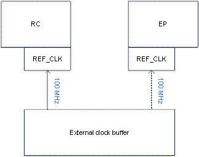

## 1 PCIe basic concepts

### 1.1 PCIe cascade

Two NT9833x can be cascaded over PCIe to perform more powerful functions. Jobs on the RC (root complex), can be dispatched to EP (endpoint) to accomplish. The communication of data is through shared memory and interrupt notification which implemented by HDAL.

Once two chips are cascaded, it can be seen as a chip with double HW engines and double CPUs. However, to access memory of a remote chip, a remote memory address needs to be converted to a local mapped physical address, or called a PCIe address. The following sections will introduce the mapping concepts and remote read/write definitions.

### 1.2 Mapping concepts

To access memory of a remote chip, a remote address should be converted to a local PCIe address. A mapped PCIe address represents resources of outer PCIe devices, including a cascaded NT9833x EP.

As the figure shown below, on RC side the lower addresses are used by local dram and peripheral IO, while the upper addresses are used for remote PCIe resources, such as EP dram or EP peripherals. On the other hand, the lower addresses on EP side are used by local dram and peripherals of EP. And the upper addresses are mapped to dram and peripherals of RC.

We call the direction from RC to EP “downstream” and the opposite direction as “upstream”. Because RC stands for “root complex” which is on the top of PCIe connections.

Moreover, a dram region could be composed of multiple DDR blocks. The first DDR of dram is index 0, and the second DDR is index 1, etc.

### 1.3 Remote read / write

RC (Root Complex) and EP (Endpoint) either could be the role of local or remote. Where the driver or application is executing in, that side is called the local side. And its opposite side is called the remote side.

If data is transferred from local to remote, it is called “Remote write”. On the contrary, if data is moved from remote to local, it is called “Remote read”.

## 2 Kernel configurations

The below introduces kernel configurations about NVT PCIe Library.

CONFIG_NVT_PCIE_LIB is the configuration to enable NVT PCIe Library. NVT PCIe Library provides status querying, address conversion between RC and EP, and a common shared memory. It is transparent to PCIe HW. If EP does not exist, relative APIs will get an error returned, but not compiler errors.

CONFIG_NVT_PCIE_CASCADE_DRV is the driver to handle HW dependent initialization of PCIe cascade. It is a proprietary driver of NVT. The implementation is different from Linux common framework. Please note that it depends on “NVT_PCIE_LIB” and “!PCI”. It means NVT PCIe cascade driver requires NVT PCIe Library to provide services for upper layers. And if Linux PCIe common framework is enabled, NVT PCIe cascade driver will be disabled automatically.

~~~~~~~~~~~~~~~~~~~~~~~~~~~~~~~~~~~~~~~~~~~~~~~~~~~~~~~~~~~~~~~~~~~~~~~~~~~~~~~~
CONFIG_NVT_PCIE_LIB:                          
Novatek PCIe Library.                         
Symbol: NVT_PCIE_LIB [=y]                     
Type  : bool                                  
Prompt: Novatek PCIe Library                  
  Location:                                   
    -> Device Drivers                         
      -> SOC (System On Chip) specific Drivers
        -> NovaTek SoC drivers                
          -> NovaTek SoC Basic drivers        
~~~~~~~~~~~~~~~~~~~~~~~~~~~~~~~~~~~~~~~~~~~~~~~~~~~~~~~~~~~~~~~~~~~~~~~~~~~~~~~~

~~~~~~~~~~~~~~~~~~~~~~~~~~~~~~~~~~~~~~~~~~~~~~~~~~~~~~~~~~~~~~~~~~~~~~~~~~~~~~~~
CONFIG_NVT_PCIE_CASCADE_DRV:                                                                                             
                                                                                                                         
Novatek PCIe cascade.                                                                                                    
                                                                                                                         
Symbol: NVT_PCIE_CASCADE_DRV [=y]                                                                                        
Type  : bool                                                                                                             
Prompt: Novatek PCIe cascade                                                                                             
  Location:                                                                                                              
    -> Device Drivers                                                                                                    
      -> SOC (System On Chip) specific Drivers                                                                           
        -> NovaTek SoC drivers                                                                                           
          -> NovaTek SoC Basic drivers                                                                                   
            -> Novatek PCIe Library (NVT_PCIE_LIB [=y])                                                                  
  Defined at drivers/soc/nvt/basic/Kconfig:24                                                                            
  Depends on: (ARCH_NVT_IVOT_V7 || ARCH_NVT_IVOT_V8 [=y]) && NVT_PCIE_LIB [=y] && NVT_IVOT_PLAT_NA51090 [=y] && !PCI [=n]
~~~~~~~~~~~~~~~~~~~~~~~~~~~~~~~~~~~~~~~~~~~~~~~~~~~~~~~~~~~~~~~~~~~~~~~~~~~~~~~~

## 3 Device tree configurations

### 3.1 nvt-pcie-cascade-drv

There are two device tree nodes (“nvt_pcie: pcie@2,f04f0000” and “nvt_ep0”) to describe pcie hw behavior in the file nvt-peri.dtsi. In most time, it is not needed/encouraged to modify these device tree nodes. Parameters may be modified are:

#### 3.1.1 “dma-ranges” in “nvt_pcie: pcie@2,f04f0000”

“dma-ranges” is used to describe memory/register exported by RC to EP. Its format has 4 fields: type (don’t care now), pcie address, system address, and size. For example, below line represents map pcie address 0xC_0000_0000 to 33x internal address 0x0_0000_0000 with size 0x2_0000_0000:

*0x83000000 0x0C 0x00000000 0x00 0x00000000 0x02 0x00000000 /\* RC MAU \*/*

~~~~~~~~~~~~~~~~~~~~~~~~~~~~~~~~~~~~~~~~~~~~~~~~~~~~~~~~~~~~~~~~~~~~~~~~~~~~~~~~
nvt_pcie: pcie@2,f04f0000 {
                compatible = "nvt,nvt_pcie_drv";
…
                #interrupt-cells = <3>;
                interrupt-controller;
                interrupt-parent = <&gic>;
                #address-cells = <3>;
                #size-cells = <2>;
                dma-ranges = <0x83000000 0x0C 0x00000000 0x00 0x00000000 0x02 0x00000000 /* RC MAU */
                                0x83000001 0x0E 0x00000000 0x02 0xF0000000 0 0x10000000>; /* RC APB */
/*              refclk-out = <0>;       */
};
~~~~~~~~~~~~~~~~~~~~~~~~~~~~~~~~~~~~~~~~~~~~~~~~~~~~~~~~~~~~~~~~~~~~~~~~~~~~~~~~

#### 3.1.2 “reg” in “nvt_ep0”

“reg” is used to describe pcie address mapping of EP internal resource. It expects fixed sequence to describe mapping of MAU, ATU, APB registers. Its format has 2 fields: pcie address, and size (The internal system address is not allowed to modify). For example, below line represents map pcie address 0x4_0000_0000 to EP MAU with size 0x2_0000_0000.

*0x04 0x00000000 0x02 0x00000000 /\* MAU \*/*

~~~~~~~~~~~~~~~~~~~~~~~~~~~~~~~~~~~~~~~~~~~~~~~~~~~~~~~~~~~~~~~~~~~~~~~~~~~~~~~~
nvt_ep0 {
                reg = <0x04 0x00000000 0x02 0x00000000                  /* MAU */
                                0x06 0x10000000 0x00 0x10000000         /* ATU */
                                0x06 0x20000000 0x00 0x10000000>;       /* APB */
        };
~~~~~~~~~~~~~~~~~~~~~~~~~~~~~~~~~~~~~~~~~~~~~~~~~~~~~~~~~~~~~~~~~~~~~~~~~~~~~~~~

#### 3.1.3 “refclk-out” in “nvt_pcie: pcie@2,f04f0000”

PCIe spec defines a differential clock signal as clock source of each pcie device (i.e. RC, EP). Novatek suggests use external clock buffer IC to generate 100 MHz refclk to 33x RC/EP

33x RC can be configured to output 100 MHz to cascaded EP by device tree parameter “refclk-out”. However, 33x refclk jitter may exceeds 300ppm defined by PCIe spec. Use it by your own risk!!

Requirements of outputting REFCLK are:

1\. Bootstrap BS[10] should be tied to LOW

(for detail bootstrap description, please refer to NT9833x datasheet)

| 10 | **PCIE_REFCLK_BOOT_SEL** Select REFCLK source (This will effect default value of register PCIE_REFCLK_SRC) 0: from MPLL5 1: from REFCLK pad |
|----|---------------------------------------------------------------------------------------------------------------------------------------------|

2\. Enable refclk-out at device tree node:

~~~~~~~~~~~~~~~~~~~~~~~~~~~~~~~~~~~~~~~~~~~~~~~~~~~~~~~~~~~~~~~~~~~~~~~~~~~~~~~~
nvt_pcie: pcie@2,f04f0000 {
                compatible = "nvt,nvt_pcie_drv";
…
                #interrupt-cells = <3>;
                interrupt-controller;
                interrupt-parent = <&gic>;
                #address-cells = <3>;
                #size-cells = <2>;
                dma-ranges = <0x83000000 0x0C 0x00000000 0x00 0x00000000 0x02 0x00000000 /* RC MAU */
                                0x83000001 0x0E 0x00000000 0x02 0xF0000000 0 0x10000000>; /* RC APB */
              refclk-out = <1>; 
};
~~~~~~~~~~~~~~~~~~~~~~~~~~~~~~~~~~~~~~~~~~~~~~~~~~~~~~~~~~~~~~~~~~~~~~~~~~~~~~~~

### 3.2 nvt-pcie-lib

The relative configurations are defined by node “nvt-pcie-lib-cfg” in the file nvt-mem-tbl-common.dtsi.

“rc_shm_size” represents the shared memory size. This memory space is allocated from kernel memory at RC side. And the physical address will be passed to EP side through internal registers.

“ep_alloc_mem” represents EP memory regions which can be allocated by RC users. That means these memory regions belong to EP, but RC users can allocate and put some data directly to these regions through PCIe. This kind of allocation should use nvt-pcie-lib API to accomplish.

~~~~~~~~~~~~~~~~~~~~~~~~~~~~~~~~~~~~~~~~~~~~~~~~~~~~~~~~~~~~~~~~~~~~~~~~~~~~~~~~
nvt-pcie-lib-cfg {
        compatible = "nvt,nvt-pcie-lib";
        rc_shm_size = <0x0 0x00100000>; /* [SIZE-H] [SIZE-L] */
        ep_alloc_mem = <0x1 0x0 0x18000000 0x0 0x08000000>; /* < [CHIPID] [ADDR-H] [ADDR-L] [SIZE-H] [SIZE-L] */
};
~~~~~~~~~~~~~~~~~~~~~~~~~~~~~~~~~~~~~~~~~~~~~~~~~~~~~~~~~~~~~~~~~~~~~~~~~~~~~~~~

## 4 nvt-pcie-lib API introduction

### 4.1 Address conversion

#### 4.1.1 nvtpcie_get_upstream_pa

[Description]

From the view of EP side, get a mapped physical address to an upstream physical address of RC.

[Syntax]

phys_addr_t nvtpcie_get_upstream_pa(nvtpcie_chipid_t ep_chipid, phys_addr_t rc_pa);

[Parameter]

| Value     | Description            |
|-----------|------------------------|
| ep_chipid | EP chip id             |
| rc_pa     | Physical address of RC |

[Return Value]

| Value                   | Description                 |
|-------------------------|-----------------------------|
| NVTPCIE_INVALID_PA (-1) | Failure                     |
| Other values            | The mapped physical address |

#### 4.1.2 nvtpcie_get_downstream_pa

[Description]

From the view of RC side, get a mapped physical address to a downstream physical address of EP.

[Syntax]

phys_addr_t nvtpcie_get_downstream_pa(nvtpcie_chipid_t ep_chipid, phys_addr_t ep_pa);

[Parameter]

| Value     | Description            |
|-----------|------------------------|
| ep_chipid | EP chip id             |
| ep_pa     | Physical address of EP |

[Return Value]

| Value                   | Description                 |
|-------------------------|-----------------------------|
| NVTPCIE_INVALID_PA (-1) | Failure                     |
| Other values            | The mapped physical address |

#### 4.1.3 nvtpcie_get_pcie_addr

[Description]

Get a mapped physical address on the local chip. If the target DDR id is at the same chip as the local chip, the tar_pa is just returned. Otherwise, a mapped address will be returned, which is converted automatically by the given parameters. Please note that the returned address is on the view of the local chip.

[Syntax]

phys_addr_t nvtpcie_get_pcie_addr(nvtpcie_chipid_t loc_chipid, nvtpcie_ddrid_t tar_ddrid, phys_addr_t tar_pa);

[Parameter]

| Value      | Description             |
|------------|-------------------------|
| loc_chipid | Local chip id           |
| tar_ddrid  | target DDR id           |
| tar_pa     | target physical address |

[Return Value]

| Value                   | Description                 |
|-------------------------|-----------------------------|
| NVTPCIE_INVALID_PA (-1) | Failure                     |
| Other values            | The mapped physical address |

#### 4.1.4 nvtpcie_get_mapped_pa

[Description]

Get a mapped physical address on the local chip automatically by the given parameters. The returned address could be upstream or downstream depending on the direction of the local chip id and the target chip id.

[Syntax]

phys_addr_t nvtpcie_get_mapped_pa(nvtpcie_chipid_t loc_chipid, nvtpcie_chipid_t tar_chipid, phys_addr_t tar_pa);

[Parameter]

| Value      | Description             |
|------------|-------------------------|
| loc_chipid | Local chip id           |
| tar_chipid | Target chip id          |
| tar_pa     | Target physical address |

[Return Value]

| Value                   | Description                 |
|-------------------------|-----------------------------|
| NVTPCIE_INVALID_PA (-1) | Failure                     |
| Other values            | The mapped physical address |

#### 4.1.5 nvtpcie_get_unmapped_pa

[Description]

Get an unmapped physical address by the given chip id and the mapped address. This is used to revert a mapped address to its original physical address of the target chip. The target chip id can be get from ret_map_chipid. If it is not needed, please set it NULL.

[Syntax]

phys_addr_t nvtpcie_get_unmapped_pa(nvtpcie_chipid_t loc_chipid, phys_addr_t mapped_pa, nvtpcie_chipid_t \*ret_map_chipid);

[Parameter]

| Value          | Description                                    |
|----------------|------------------------------------------------|
| loc_chipid     | Local chip id                                  |
| mapped_pa      | A mapped physical address                      |
| ret_map_chipid | The mapped chip (optional, NULL if not needed) |

[Return Value]

| Value                   | Description                   |
|-------------------------|-------------------------------|
| NVTPCIE_INVALID_PA (-1) | Failure                       |
| Other values            | The unmapped physical address |

### 4.2 Shared memory

#### 4.2.1 nvtpcie_shmem_dump

[Description]

Dump the shared memory data by a specific length.

[Syntax]

void nvtpcie_shmem_dump(unsigned long length);

[Parameter]

| Value  | Description                  |
|--------|------------------------------|
| length | The length size to be dumped |

[Return Value]

None

#### 4.2.2 nvtpcie_shmem_get_va

[Description]

Get the virtual address of the shared memory.

[Syntax]

void \*nvtpcie_shmem_get_va(void);

[Parameter]

None

[Return Value]

| Value        | Description                          |
|--------------|--------------------------------------|
| NULL         | Failure                              |
| Other values | The virtual address of shared memory |

#### 4.2.3 nvtpcie_shmem_get_pa

[Description]

Get the physical address of the shared memory.

[Syntax]

phys_addr_t nvtpcie_shmem_get_pa(void);

[Parameter]

None

[Return Value]

| Value                   | Description                           |
|-------------------------|---------------------------------------|
| NVTPCIE_INVALID_PA (-1) | Failure                               |
| Other values            | The physical address of shared memory |

#### 4.2.4 nvtpcie_shmem_get_size

[Description]

Get the shared memory size.

[Syntax]

unsigned long nvtpcie_shmem_get_size(void);

[Parameter]

None

[Return Value]

| Value        | Description                |
|--------------|----------------------------|
| 0            | Failure. No shared memory. |
| Other values | The size of shared memory  |

### 4.3 EP utility

#### 4.3.1 nvtpcie_alloc_epmem

[Description]

Allocate a memory region from EP to use at RC. The output parameter ret_ep_pa is the mapped physical address at RC side. And the returned value is the virtual address of that physical address. To get the virtual address, an “ioremap” operation is applied when the API is called. You can use this address in kernel-space directly without mapping again.

[Syntax]

void \*nvtpcie_alloc_epmem(nvtpcie_chipid_t ep_chipid, unsigned long alloc_size, phys_addr_t \*ret_ep_pa);

[Parameter]

| Value      | Description                              |
|------------|------------------------------------------|
| ep_chipid  | EP chip id                               |
| alloc_size | The size to be allocated                 |
| ret_ep_pa  | The physical address of allocated memory |

[Return Value]

| Value        | Description                             |
|--------------|-----------------------------------------|
| NULL         | Failure                                 |
| Other values | The virtual address of allocated memory |

#### 4.3.2 nvtpcie_downstream_active

[Description]

Check whether the downstream EP is active or not at RC side.

[Syntax]

int nvtpcie_downstream_active(nvtpcie_chipid_t ep_chipid);

[Parameter]

| Value     | Description |
|-----------|-------------|
| ep_chipid | EP chip id  |

[Return Value]

| Value | Description |
|-------|-------------|
| 1     | active      |
| 0     | inactive    |

#### 4.3.3 nvtpcie_get_ep_count

[Description]

Get the active EP count

[Syntax]

int nvtpcie_get_ep_count(void);

[Parameter]

None

[Return Value]

| Value        | Description |
|--------------|-------------|
| 0            | Failure     |
| Other values | EP numbers  |

### 4.4 Mapping Info.

#### 4.4.1 nvtpcie_get_ddrid

[Description]

Get the DDR id by the given parameters. The input physical address “loc_pa” could be a real DDR region or a mapped PCIe region.

[Syntax]

nvtpcie_ddrid_t nvtpcie_get_ddrid(nvtpcie_chipid_t loc_chipid, phys_addr_t loc_pa);

[Parameter]

| Value      | Description            |
|------------|------------------------|
| loc_chipid | Local chip id          |
| loc_pa     | Local physical address |

[Return Value]

| Value        | Description |
|--------------|-------------|
| DDR_ID_MAX   | Failure     |
| Other values | DDR id      |

#### 4.4.2 nvtpcie_get_ddrid_map

[Description]

Convert a specific DDR id to its chip id and the DDR index.

[Syntax]

int nvtpcie_get_ddrid_map(nvtpcie_ddrid_t ddrid, nvtpcie_chipid_t \*out_chipid, nvtpcie_ddrid_t \*out_ddridx);

[Parameter]

| Value      | Description      |
|------------|------------------|
| ddrid      | DDR id           |
| out_chipid | Output chip id   |
| out_ddridx | Output DDR index |

[Return Value]

| Value | Description |
|-------|-------------|
| 0     | Success     |
| -1    | Failure     |

### 4.5 Misc.

#### 4.5.1 nvtpcie_get_my_chipid

[Description]

Get the current chip id. (RC or EPn)

[Syntax]

nvtpcie_chipid_t nvtpcie_get_my_chipid(void);

[Parameter]

None

[Return Value]

| Value   | Description                    |
|---------|--------------------------------|
| Chip id | The chip id at the caller side |

#### 4.5.2 nvtpcie_edma_copy

[Description]

Copy data across PCIe using eDMA. The source and destination chip ids are assumed to be different.

[Syntax]

int nvtpcie_edma_copy(nvtpcie_chipid_t src_chipid, phys_addr_t src_pa, nvtpcie_chipid_t dst_chipid, phys_addr_t dst_pa, unsigned long len);

[Parameter]

| Value      | Description                         |
|------------|-------------------------------------|
| src_chipid | Chip id of the source               |
| src_pa     | Physical address of the source      |
| dst_chipid | Chip id of the destination          |
| dst_pa     | Physical address of the destination |
| len        | Size to be copied                   |

[Return Value]

| Value | Description |
|-------|-------------|
| 0     | Success     |
| -1    | Failure     |

### 4.6 /proc interface

A “/proc” interface is provided for debugging or dumping some information. To list all commands, you can “cat” the “/proc/nvt-pcie-lib/help” node. To trigger a command, please use “echo [your command] \>” to the “/proc/nvt-pcie-lib/cmd” node. The below demonstrates how to use it.

#### 4.6.1 List all commands

~~~~~~~~~~~~~~~~~~~~~~~~~~~~~~~~~~~~~~~~~~~~~~~~~~~~~~~~~~~~~~~~~~~~~~~~~~~~~~~~
root@NVTEVM:/$ cat /proc/nvt-pcie-lib/help
cmd_list:
dump
perf
test
version
~~~~~~~~~~~~~~~~~~~~~~~~~~~~~~~~~~~~~~~~~~~~~~~~~~~~~~~~~~~~~~~~~~~~~~~~~~~~~~~~

#### 4.6.2 Show version

~~~~~~~~~~~~~~~~~~~~~~~~~~~~~~~~~~~~~~~~~~~~~~~~~~~~~~~~~~~~~~~~~~~~~~~~~~~~~~~~
root@NVTEVM:/$ echo version > /proc/nvt-pcie-lib/cmd
[  190.162430] PROC_CMD: [version], size 8
[  190.168264] nvt-pcie-lib: 0.0.16
~~~~~~~~~~~~~~~~~~~~~~~~~~~~~~~~~~~~~~~~~~~~~~~~~~~~~~~~~~~~~~~~~~~~~~~~~~~~~~~~

#### 4.6.3 Show configurations

~~~~~~~~~~~~~~~~~~~~~~~~~~~~~~~~~~~~~~~~~~~~~~~~~~~~~~~~~~~~~~~~~~~~~~~~~~~~~~~~
root@NVTEVM:/$ echo dump > /proc/nvt-pcie-lib/cmd
PROC_CMD: [dump], size 5
 
rc_dumpmap
              local_pa,               size,             name, ep_chipid, ep_pa
[0] 0x0000000400000000, 0x0000000200000000,              mau,         1, 0x0000000000000000
[1] 0x0000000620000000, 0x0000000010000000,              apb,         1, 0x00000002F0000000
[2] 0x0000000000000000, 0x0000000000000000,           (null),         0, 0x0000000000000000
[3] 0x0000000000000000, 0x0000000000000000,           (null),         0, 0x0000000000000000
[4] 0x0000000000000000, 0x0000000000000000,           (null),         0, 0x0000000000000000
[5] 0x0000000000000000, 0x0000000000000000,           (null),         0, 0x0000000000000000
[6] 0x0000000000000000, 0x0000000000000000,           (null),         0, 0x0000000000000000
[7] 0x0000000000000000, 0x0000000000000000,           (null),         0, 0x0000000000000000
[8] 0x0000000000000000, 0x0000000000000000,           (null),         0, 0x0000000000000000
[9] 0x0000000000000000, 0x0000000000000000,           (null),         0, 0x0000000000000000
[10] 0x0000000000000000, 0x0000000000000000,           (null),         0, 0x0000000000000000
[11] 0x0000000000000000, 0x0000000000000000,           (null),         0, 0x0000000000000000
[12] 0x0000000000000000, 0x0000000000000000,           (null),         0, 0x0000000000000000
[13] 0x0000000000000000, 0x0000000000000000,           (null),         0, 0x0000000000000000
[14] 0x0000000000000000, 0x0000000000000000,           (null),         0, 0x0000000000000000
[15] 0x0000000000000000, 0x0000000000000000,           (null),         0, 0x0000000000000000
[16] 0x0000000000000000, 0x0000000000000000,           (null),         0, 0x0000000000000000
[17] 0x0000000000000000, 0x0000000000000000,           (null),         0, 0x0000000000000000
 
ep_upmap
              local_pa,               size,             name, rc_pa
[0] 0x0000000C00000000, 0x0000000200000000,              mau, 0x0000000000000000
[1] 0x0000000E00000000, 0x0000000010000000,              apb, 0x00000002F0000000
 
ddr_map
       ddrid,   chipid,   ddridx,          chip_base,       size
[0]        0,        0,        0, 0x0000000000000000, 0x40000000
[1]        1,        0,        1, 0x0000000100000000, 0x40000000
[2]        2,        1,        0, 0x0000000000000000, 0x40000000
[3]        3,        1,        1, 0x0000000100000000, 0x40000000
[4]        0,        0,        0, 0x0000000000000000, 0x00000000
[5]        0,        0,        0, 0x0000000000000000, 0x00000000
[6]        0,        0,        0, 0x0000000000000000, 0x00000000
[7]        0,        0,        0, 0x0000000000000000, 0x00000000
 
ep_allocmem
   ep_chipid,        ep_local_pa,       size,          rc_map_pa,          rc_map_va
[0]        1, 0x0000000018000000, 0x08000000, 0x0000000418000000, 0xFFFFFF8010000000
[1]        0, 0x0000000000000000, 0x00000000, 0x0000000000000000, 0x0000000000000000
[2]        0, 0x0000000000000000, 0x00000000, 0x0000000000000000, 0x0000000000000000
[3]        0, 0x0000000000000000, 0x00000000, 0x0000000000000000, 0x0000000000000000
[4]        0, 0x0000000000000000, 0x00000000, 0x0000000000000000, 0x0000000000000000
[5]        0, 0x0000000000000000, 0x00000000, 0x0000000000000000, 0x0000000000000000
[6]        0, 0x0000000000000000, 0x00000000, 0x0000000000000000, 0x0000000000000000
[7]        0, 0x0000000000000000, 0x00000000, 0x0000000000000000, 0x0000000000000000
 
dump va=FFFFFF8008D4D000, pa=2C100000 length=00000100 to console:
2C100000 : 00000000 00000000 00000000 00000000  ...............
2C100010 : 00000000 00000000 00000000 00000000  ...............
2C100020 : 00000000 00000000 00000000 00000000  ...............
2C100030 : 00000000 00000000 00000000 00000000  ...............
2C100040 : 00000000 00000000 00000000 00000000  ...............
2C100050 : 00000000 00000000 00000000 00000000  ...............
2C100060 : 00000000 00000000 00000000 00000000  ...............
2C100070 : 00000000 00000000 00000000 00000000  ...............
2C100080 : 00000000 00000000 00000000 00000000  ...............
2C100090 : 00000000 00000000 00000000 00000000  ...............
2C1000A0 : 00000000 00000000 00000000 00000000  ...............
2C1000B0 : 00000000 00000000 00000000 00000000  ...............
2C1000C0 : 00000000 00000000 00000000 00000000  ...............
2C1000D0 : 00000000 00000000 00000000 00000000  ...............
2C1000E0 : 00000000 00000000 00000000 00000000  ...............
2C1000F0 : 00000000 00000000 00000000 00000000  ...............
 
 
nvtpcie_get_ep_count = 1
~~~~~~~~~~~~~~~~~~~~~~~~~~~~~~~~~~~~~~~~~~~~~~~~~~~~~~~~~~~~~~~~~~~~~~~~~~~~~~~~

#### 4.6.4 Run a self-test

Please note that a self-test may occupy system resources or conflict with other running services. Only run a self-test under a debug environment.

~~~~~~~~~~~~~~~~~~~~~~~~~~~~~~~~~~~~~~~~~~~~~~~~~~~~~~~~~~~~~~~~~~~~~~~~~~~~~~~~
root@NVTEVM:/$ echo test > /proc/nvt-pcie-lib/cmd
PROC_CMD: [test], size 5
 
nvtpcie_get_ddrid_map
 
ddr_map
       ddrid,   chipid,   ddridx,          chip_base,       size
[0]        0,        0,        0, 0x0000000000000000, 0x40000000
[1]        1,        0,        1, 0x0000000100000000, 0x40000000
[2]        2,        1,        0, 0x0000000000000000, 0x40000000
[3]        3,        1,        1, 0x0000000100000000, 0x40000000
[4]        0,        0,        0, 0x0000000000000000, 0x00000000
[5]        0,        0,        0, 0x0000000000000000, 0x00000000
[6]        0,        0,        0, 0x0000000000000000, 0x00000000
[7]        0,        0,        0, 0x0000000000000000, 0x00000000
nvtpcie_get_ep_count = 1
 
nvtpcie_get_ddrid test
chipid 0, pa 0x0000000001110000 => ddrid 0
chipid 0, pa 0x0000000042220000 => ddrid 8
chipid 0, pa 0x00000002F0110084 => ddrid 8
chipid 0, pa 0x0000000401110000 => ddrid 2
chipid 0, pa 0x0000000442220000 => ddrid 8
chipid 0, pa 0x0000000620110000 => ddrid 8
chipid 1, pa 0x0000000001110000 => ddrid 2
chipid 1, pa 0x0000000042220000 => ddrid 8
chipid 1, pa 0x00000002F0110084 => ddrid 8
chipid 1, pa 0x0000000C01110000 => ddrid 0
chipid 1, pa 0x0000000C42220000 => ddrid 8
chipid 1, pa 0x0000000E00110000 => ddrid 8
 
nvtpcie_get_upstream_pa
ep_chipid 1, rc_pa 0x0000000001110000, ep_ups_pa 0x0000000C01110000
ep_chipid 1, rc_pa 0x0000000042220000, ep_ups_pa 0x0000000C42220000
ep_chipid 1, rc_pa 0x00000002F0110084, ep_ups_pa 0x0000000E00110084
 
nvtpcie_get_downstream_pa
ep_chipid 1, ep_pa 0x0000000001110000, rc_down_pa 0x0000000401110000
ep_chipid 1, ep_pa 0x0000000042220000, rc_down_pa 0x0000000442220000
ep_chipid 1, ep_pa 0x00000002F0110084, rc_down_pa 0x0000000620110084
_nvtpcie_reg_test pa 0x620110084
org_val = 0x0
new_val = 0x12345678
chk_val = 0x0
 
nvtpcie_get_pcie_addr
     local: loc_chipid 0, tar_ddrid 0, tar_pa 0x0000000001110000, pcie_pa 0x0000000001110000
downstream: loc_chipid 0, tar_ddrid 2, tar_pa 0x0000000001110000, pcie_pa 0x0000000401110000
  upstream: loc_chipid 1, tar_ddrid 0, tar_pa 0x0000000001110000, pcie_pa 0x0000000C01110000
 
nvtpcie_get_mapped_pa and nvtpcie_get_unmapped_pa
 
nvtpcie_shmem_xxx test
shmem pa 0x000000002C100000, va 0xFFFFFF8008D4D000, size 0x100000
 
nvtpcie_alloc_epmem
 
ep_allocmem
   ep_chipid,        ep_local_pa,       size,          rc_map_pa,          rc_map_va
[0]        1, 0x0000000018000000, 0x08000000, 0x0000000418000000, 0xFFFFFF8010000000
[1]        0, 0x0000000000000000, 0x00000000, 0x0000000000000000, 0x0000000000000000
[2]        0, 0x0000000000000000, 0x00000000, 0x0000000000000000, 0x0000000000000000
[3]        0, 0x0000000000000000, 0x00000000, 0x0000000000000000, 0x0000000000000000
[4]        0, 0x0000000000000000, 0x00000000, 0x0000000000000000, 0x0000000000000000
[5]        0, 0x0000000000000000, 0x00000000, 0x0000000000000000, 0x0000000000000000
[6]        0, 0x0000000000000000, 0x00000000, 0x0000000000000000, 0x0000000000000000
[7]        0, 0x0000000000000000, 0x00000000, 0x0000000000000000, 0x0000000000000000
alloc_epmem 1: ep_chipid 1, len 65536, p_rc_va 0xFFFFFF8010282000, ret_ep_pa 0x0000000018282000
alloc_epmem 2: ep_chipid 1, len 65536, p_rc_va 0xFFFFFF8010292000, ret_ep_pa 0x0000000018292000
alloc_epmem 3: ep_chipid 1, len 65536, p_rc_va 0xFFFFFF80102A2000, ret_ep_pa 0x00000000182A2000
 
nvtpcie_downstream_active
ep_chipid 1, is_active 1
 
nvtpcie_edma_copy test
edma_copy: chip 0 pa 0x0000000001110000 => chip 1 pa 0x0000000001110000
edma_copy: chip 1 pa 0x0000000001110000 => chip 0 pa 0x0000000001110000
edma test done
root@NVTEVM:/$
~~~~~~~~~~~~~~~~~~~~~~~~~~~~~~~~~~~~~~~~~~~~~~~~~~~~~~~~~~~~~~~~~~~~~~~~~~~~~~~~

#### 4.6.5 Run a performance test

A series of performance tests will be performed sequentially. Each test is performed 10 times, and the average value will be shown at the end.

~~~~~~~~~~~~~~~~~~~~~~~~~~~~~~~~~~~~~~~~~~~~~~~~~~~~~~~~~~~~~~~~~~~~~~~~~~~~~~~~
root@NVTEVM:/$ echo perf > /proc/nvt-pcie-lib/cmd
PROC_CMD: [perf], size 5
 
[REMOTE READ (edma)]
loop_num 10, 1048576 bytes, dur_us 1202
loop_num 9, 1048576 bytes, dur_us 1199
loop_num 8, 1048576 bytes, dur_us 1200
loop_num 7, 1048576 bytes, dur_us 1199
loop_num 6, 1048576 bytes, dur_us 1199
loop_num 5, 1048576 bytes, dur_us 1200
loop_num 4, 1048576 bytes, dur_us 1199
loop_num 3, 1048576 bytes, dur_us 1199
loop_num 2, 1048576 bytes, dur_us 1199
loop_num 1, 1048576 bytes, dur_us 1199
avg: 953250 KB/s (10485760 bytes / 11995 us)
 
[REMOTE READ (memcpy_fromio)]
loop_num 10, 1048576 bytes, dur_us 139336
loop_num 9, 1048576 bytes, dur_us 139164
loop_num 8, 1048576 bytes, dur_us 139908
loop_num 7, 1048576 bytes, dur_us 140222
loop_num 6, 1048576 bytes, dur_us 139864
loop_num 5, 1048576 bytes, dur_us 139374
loop_num 4, 1048576 bytes, dur_us 139845
loop_num 3, 1048576 bytes, dur_us 140014
loop_num 2, 1048576 bytes, dur_us 139935
loop_num 1, 1048576 bytes, dur_us 140179
avg: 7505 KB/s (10485760 bytes / 1397841 us)
 
[LOCAL READ (memcpy_fromio)]
loop_num 10, 1048576 bytes, dur_us 764
loop_num 9, 1048576 bytes, dur_us 765
loop_num 8, 1048576 bytes, dur_us 718
loop_num 7, 1048576 bytes, dur_us 718
loop_num 6, 1048576 bytes, dur_us 700
loop_num 5, 1048576 bytes, dur_us 719
loop_num 4, 1048576 bytes, dur_us 806
loop_num 3, 1048576 bytes, dur_us 706
loop_num 2, 1048576 bytes, dur_us 805
loop_num 1, 1048576 bytes, dur_us 709
avg: 1497965 KB/s (10485760 bytes / 7410 us)
 
[REMOTE WRITE (edma)]
loop_num 10, 1048576 bytes, dur_us 1179
loop_num 9, 1048576 bytes, dur_us 1176
loop_num 8, 1048576 bytes, dur_us 1176
loop_num 7, 1048576 bytes, dur_us 1176
loop_num 6, 1048576 bytes, dur_us 1176
loop_num 5, 1048576 bytes, dur_us 1176
loop_num 4, 1048576 bytes, dur_us 1175
loop_num 3, 1048576 bytes, dur_us 1176
loop_num 2, 1048576 bytes, dur_us 1176
loop_num 1, 1048576 bytes, dur_us 1175
avg: 953250 KB/s (10485760 bytes / 11761 us)
 
[REMOTE WRITE (memcpy_toio)]
loop_num 10, 1048576 bytes, dur_us 4298
loop_num 9, 1048576 bytes, dur_us 4285
loop_num 8, 1048576 bytes, dur_us 4288
loop_num 7, 1048576 bytes, dur_us 4285
loop_num 6, 1048576 bytes, dur_us 4285
loop_num 5, 1048576 bytes, dur_us 4287
loop_num 4, 1048576 bytes, dur_us 4285
loop_num 3, 1048576 bytes, dur_us 4285
loop_num 2, 1048576 bytes, dur_us 4300
loop_num 1, 1048576 bytes, dur_us 4304
avg: 249660 KB/s (10485760 bytes / 42902 us)
 
[LOCAL WRITE (memcpy_toio)]
loop_num 10, 1048576 bytes, dur_us 716
loop_num 9, 1048576 bytes, dur_us 726
loop_num 8, 1048576 bytes, dur_us 743
loop_num 7, 1048576 bytes, dur_us 722
loop_num 6, 1048576 bytes, dur_us 714
loop_num 5, 1048576 bytes, dur_us 722
loop_num 4, 1048576 bytes, dur_us 714
loop_num 3, 1048576 bytes, dur_us 715
loop_num 2, 1048576 bytes, dur_us 714
loop_num 1, 1048576 bytes, dur_us 700
avg: 1497965 KB/s (10485760 bytes / 7186 us)
~~~~~~~~~~~~~~~~~~~~~~~~~~~~~~~~~~~~~~~~~~~~~~~~~~~~~~~~~~~~~~~~~~~~~~~~~~~~~~~~

## 5 uboot init flow

PCIe link and mapping are initialized in uboot phase. It is located at u-boot/board/novatek/nvt-na51090-a64/nvt_pcie/nvt_pcie_mapping.c. In most cases, you are not required to touch this file. However, if you need to understand how it works, below flow chart can give you a brief view of PCIe init:

## 6 Trouble shooting

### 6.1 Which driver support running on RC and controlling hw on EP?

Ans: These system drivers can support: GPIO, USB host, pinctrl, clock, I2C, wdt, PWM, adc, uart, DDR arbiter, efuse, thermal, SATA. For HDAL related driver, please refer to HDAL documents.

### 6.2 I concern there are any error on PCIe bus. If there any way to observe errors below transaction layer?

Ans: You can cat file pcie_sts under /proc/nvt_pcie.

~~~~~~~~~~~~~~~~~~~~~~~~~~~~~~~~~~~~~~~~~~~~~~~~~~~~~~~~~~~~~~~~~~~~~~~~~~~~~~~~
root@NVTEVM:/proc/nvt_pcie$ cat pcie_sts
[  448.049669]
[  448.051302]
[  448.051302]  Error count:
[  448.055655] uncorr_error_cnt: 0
[  448.058875] rx_error_cnt: 0
[  448.061790]
[  448.061790]  =====================
[  448.066951] 0x2F08B301C: 0x  370004
[  448.070535] 0x2F08B3018: 0x    1707
[  448.074104]
[  448.074104]  =====================
[  448.079233]
[  448.079233]  Test RAS D.E.S --- event count analysis function
[  448.086643] Grp 0 :
[  448.086651] 0 [EBUF Overflow            ]: 0x       0,
[  448.088746] 1 [EBUF Under-run           ]: 0x       0,
[  448.093978] 2 [Decode Error             ]: 0x       0,
[  448.099194] 3 [Running Disparity Error  ]: 0x       0,
[  448.104435] 4 [SKP OS Parity Error      ]: 0x       0,
[  448.109649] 5 [SYNC Header Error        ]: 0x       0,
[  448.114881] 6 [Rx Valid de-assertion    ]: 0x       0,
[  448.120106]
[  448.126899] Grp 1 :
[  448.126904] 0 [Reserved                 ]: 0x       0,
[  448.128998] 1 [Reserved                 ]: 0x       0,
[  448.134228] 2 [Reserved                 ]: 0x       0,
[  448.139443] 3 [Reserved                 ]: 0x       0,
[  448.144683] 4 [Reserved                 ]: 0x       0,
[  448.149912] 5 [Detect EI Infer          ]: 0x       0,
[  448.155127] 6 [Receiver Error           ]: 0x       0,
[  448.160368] 7 [Rx Recovery Request      ]: 0x       0,
[  448.165584] 8 [N_FTS Timeout            ]: 0x       0,
[  448.170814] 9 [Framing Error            ]: 0x       0,
[  448.176029] 10 [Deskew Error             ]: 0x       0,
[  448.181266]
[  448.188132] Grp 2 :
[  448.188137] 0 [BAD TLP                  ]: 0x       0,
[  448.190247] 1 [LCRC Error               ]: 0x       0,
[  448.195461] 2 [BAD DLLP                 ]: 0x       0,
[  448.200701] 3 [Replay Number Rollover   ]: 0x       0,
[  448.205916] 4 [Replay Timeout           ]: 0x       0,
[  448.211146] 5 [Rx Nak DLLP              ]: 0x       0,
[  448.216360] 6 [Tx Nak DLLP              ]: 0x       0,
[  448.221600] 7 [Retry TLP                ]: 0x       0,
[  448.226812]
[  448.233607] Grp 3 :
[  448.233612] 0 [FC Timeout               ]: 0x       0,
[  448.235707] 1 [Poisoned TLP             ]: 0x       0,
[  448.240948] 2 [ECRC Error               ]: 0x       0,
[  448.246163] 3 [Unsupported Request      ]: 0x       0,
[  448.251393] 4 [Completer Abort          ]: 0x       0,
[  448.256608] 5 [Completion Timeout       ]: 0x       0,
[  448.261846]
~~~~~~~~~~~~~~~~~~~~~~~~~~~~~~~~~~~~~~~~~~~~~~~~~~~~~~~~~~~~~~~~~~~~~~~~~~~~~~~~
