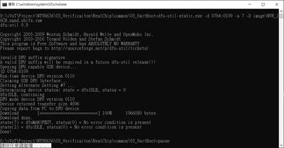

## 1 Board setup

### 1.1 Single board (Without PCIE cascade)

**  
**

### 1.2 Dual board (With PCIE cascade)

**  
**

## 2 Boot from UART

This mode will be responsible for the loader update when the flash of the board is new or can’t boot conditions.

### 2.1 Operation architecture

We will transfer the write loader(WLD9833XA.bin) to EVB to do update process, and get every image through UART, loader will update each image to specific address. Due to uart speed is slow, we suggest you can update to uboot stage only. Other images can be updated by uboot.

**  
**

### 2.2 Update flow

When you select the boot from uart setting in EVB, the boot flow is shown as below. PC FwUpgrade.exe tool will send write loader sram and jump into this entry. Write loader is incharge of raw image update process.

### 2.3 Image generation

WLD9833XA.bin is used to update other low level loader images, which is the boot from UART mode loader, it also can be compiled by loader source code.

**  
**

### 2.4 Update Tool

 Common Tools :

 FwUpgrade.exe: Running on your PC which can send write loader image to EVB

 Zadig-2.4.exe: DFU Windows driver

 Dfu-util-static: DFU tool on your PC

 NAND :

 WLD98336A.bin: write loader

 DfuBringUp.bat: Update image Windows script

 DfuBringUp_cascade.bat: Update image Windows script for PCIE cascade

 Image: The SDK image you want to update.

 Image_cascade: The SDK image you want to update for PCIE cascade

 EMMC :

 WLD98336A_for_emmc_4bit.bin: EMMC write loader for 4bit mode

 DfuBringUp_emmc.bat: Update image Windows script.

 DfuBringUp_emmc_cascade.bat: Update image Windows script for PCIE cascade.

 Image_emmc: The SDK image you want to update.

 Image_emmc_cascade: The SDK image you want to update for PCIE cascade.

 NOR :

 WLD98336A_nor.bin: EMMC write loader for 4bit mode

 DfuBringUp_nor.bat: Update image Windows script.

 Image_nor: The SDK image you want to update.

**  
**

### 2.5 Update SOP

The major steps of the update flow are two parts.

 Boot from UART SOP – In order to update loader, atf and uboot.bin

And then, you can use either one of below to update image.

 DFU SOP – In order to update images

 TFTP SOP – In order to update images

**  
**

#### 2.5.1 Boot from UART SOP

 Using FwUpgrade.exe and select “NEW INI”

 Click non-all-in-one

 Select your com port and click upgrade button.

 Remember to turn off your com port tool (e.g. Teraterm or putty)

 Load WrLoader means that select your write loader

 NAND : WLD98336A.bin

 EMMC : WLD98336A_for_emmc_4bit.bin if update 4bit emmc system board

 NOR : WLD98336A_nor.bin

 It means that your com port is blocked if the message ” [HOST][ERR] COM3 open failed” is shown. Please turn off your console tool.

 Setup partition and upgrade

 Refer to nvt-storage-partition.dtsi set loader, fdt, atf, uboot partition offset and size

 select images.

 Click the checkbox

Loader size is fixed to 0x10000, tool will aotomaticlly write loader to emmc HW partition boot0

 This message “[HOST] finished” means that update is success, you can switch jump and reboot to do further setup update.

 Switch jump with nand/nor/emmc boot mode and reboot

 You can use TFTP or DFU to do further update image procedures in uboot stage, we will introduce them separately in the following chapters.

**  
**

#### 2.5.2 DFU SOP

 Setup uboot env (if your uboot env mtdparts is null or your layout is different with SDK partition table.)

~~~~~~~~~~~~~~~~~~~~~~~~~~~~~~~~~~~~~~~~~~~~~~~~~~~~~~~~~~~~~~~~~~~~~~~~~~~~~~~~
uboot $ setenv mtdparts "spi_nand.0:0x40000@0x40000(fdt),0x40000@0xc0000(atf),0x1c0000@0x100000(uboot),0x40000@0x2c0000(uenv),0x500000@0x300000(linux),0x3160000@0x800000(rootfs0),0x2500000@0x3960000(rootfs1),0x21a0000@0x5e60000(app)"
 
uboot $ setenv mtdids "nand0=spi_nand.0"
~~~~~~~~~~~~~~~~~~~~~~~~~~~~~~~~~~~~~~~~~~~~~~~~~~~~~~~~~~~~~~~~~~~~~~~~~~~~~~~~

 DFU init in uboot shell

~~~~~~~~~~~~~~~~~~~~~~~~~~~~~~~~~~~~~~~~~~~~~~~~~~~~~~~~~~~~~~~~~~~~~~~~~~~~~~~~
uboot $ dfu 0 nand 0
~~~~~~~~~~~~~~~~~~~~~~~~~~~~~~~~~~~~~~~~~~~~~~~~~~~~~~~~~~~~~~~~~~~~~~~~~~~~~~~~

 To check whether the USB download gadget in your device management of the PC’s Windows is existed or not as below, please install the Windows drivers by zadig-2.4.exe if it does not exist.

 Running DFUBringUP.bat can update all partitions.

 You can edit this “DFUBringUP.bat” to control the update flow.

 For other partition layout or file type modification details can refer to software\\pc\\document\\DFUTools\\ NT9833x_DFU_User_Guide_en.pdf

~~~~~~~~~~~~~~~~~~~~~~~~~~~~~~~~~~~~~~~~~~~~~~~~~~~~~~~~~~~~~~~~~~~~~~~~~~~~~~~~
dfu-util-static.exe -d 07b4:0109 -a 0 -D image\LD98336A.bin
dfu-util-static.exe -d 07b4:0109 -a 1 -D image\nvt-all.bin
dfu-util-static.exe -d 07b4:0109 -a 2 -D image\atf.bin
dfu-util-static.exe -d 07b4:0109 -a 3 -D image\uboot.bin
dfu-util-static.exe -d 07b4:0109 -a 4 -D image\Image.bin
dfu-util-static.exe -d 07b4:0109 -a 5 -D image\rootfs.ramdisk.bin.raw
dfu-util-static.exe -d 07b4:0109 -a 6 -D image\rootfs_1.rw.ubifs.bin.ubi.raw
dfu-util-static.exe -d 07b4:0109 -a 7 -D image\NVR_16CH.nand.ubifs.raw
pause
~~~~~~~~~~~~~~~~~~~~~~~~~~~~~~~~~~~~~~~~~~~~~~~~~~~~~~~~~~~~~~~~~~~~~~~~~~~~~~~~

**  
**

#### 2.5.3 TFTP SOP

 Check if the serverip, ipadder, netmask and gatewayip settings are in the same LAN.

 Ping command to check network status

uboot \$ ping 192.168.1.11

 Using the TFTP download Loader, ATF, DTB, Linux and rootfs images

Please follow the document NT9833x Memory Map.xls to get Linux temp buffer address and partition table in nvt-storage-partition.dtsi.

 Partial load images command

~~~~~~~~~~~~~~~~~~~~~~~~~~~~~~~~~~~~~~~~~~~~~~~~~~~~~~~~~~~~~~~~~~~~~~~~~~~~~~~~
uboot $ setenv bootargs “YOUR_EVB_BOOTARGS” 
uboot $ setenv serverip server ip   (set TFTP server IP address) 
uboot $ setenv ipaddr evb ip        (set EVB IP address) 
uboot $ tftp <ddr_addr> <file_name> /* Download image to DDR */
/*Erase flash, must block alignment*/
uboot $ nand erase <flash_start_addr> <flash_end_addr> 
/* Write image from DDR to flash */
uboot $ nand write <ddr_addr> <flash_addr> <flash_size> 
/* Write ubifs/jffs2 image from DDR to flash */
uboot $ nand write.trimffs <ddr_addr> <flash_addr> <flash_size> 
~~~~~~~~~~~~~~~~~~~~~~~~~~~~~~~~~~~~~~~~~~~~~~~~~~~~~~~~~~~~~~~~~~~~~~~~~~~~~~~~

 Examples

Loader

~~~~~~~~~~~~~~~~~~~~~~~~~~~~~~~~~~~~~~~~~~~~~~~~~~~~~~~~~~~~~~~~~~~~~~~~~~~~~~~~
uboot $ setenv bootargs “YOUR_EVB_BOOTARGS” 
uboot $ setenv serverip server 192.168.1.20 
uboot $ setenv ipaddr 192.168.1.11 
uboot $ tftp 0x200000 LD98336A
uboot $ nand erase 0x0000000 0x40000
uboot $ nand write 0x200000 0x000000 FileSize(Hex)
~~~~~~~~~~~~~~~~~~~~~~~~~~~~~~~~~~~~~~~~~~~~~~~~~~~~~~~~~~~~~~~~~~~~~~~~~~~~~~~~

ATF

~~~~~~~~~~~~~~~~~~~~~~~~~~~~~~~~~~~~~~~~~~~~~~~~~~~~~~~~~~~~~~~~~~~~~~~~~~~~~~~~
uboot $ setenv bootargs “YOUR_EVB_BOOTARGS” 
uboot $ setenv serverip server 192.168.1.20 
uboot $ setenv ipaddr 192.168.1.11 
uboot $ tftp 0x200000 atf.bin
uboot $ nand erase 0x0C0000 0x40000
uboot $ nand write 0x200000 0x0C0000 FileSize(Hex)
~~~~~~~~~~~~~~~~~~~~~~~~~~~~~~~~~~~~~~~~~~~~~~~~~~~~~~~~~~~~~~~~~~~~~~~~~~~~~~~~

uboot

~~~~~~~~~~~~~~~~~~~~~~~~~~~~~~~~~~~~~~~~~~~~~~~~~~~~~~~~~~~~~~~~~~~~~~~~~~~~~~~~
uboot $ setenv bootargs “YOUR_EVB_BOOTARGS” 
uboot $ setenv serverip server 192.168.1.20 
uboot $ setenv ipaddr 192.168.1.11 
uboot $ tftp 0x200000 uboot.bin
uboot $ nand erase 0x100000 0x1C0000
uboot $ nand write 0x200000 0x100000 FileSize(Hex)
~~~~~~~~~~~~~~~~~~~~~~~~~~~~~~~~~~~~~~~~~~~~~~~~~~~~~~~~~~~~~~~~~~~~~~~~~~~~~~~~

Linux kernel

~~~~~~~~~~~~~~~~~~~~~~~~~~~~~~~~~~~~~~~~~~~~~~~~~~~~~~~~~~~~~~~~~~~~~~~~~~~~~~~~
uboot $ setenv bootargs “YOUR_EVB_BOOTARGS” 
uboot $ setenv serverip server 192.168.1.20 
uboot $ setenv ipaddr 192.168.1.11 
uboot $ tftp 0x200000 Image.bin
uboot $ nand erase 0x300000 0x0500000
uboot $ nand write 0x200000 0x300000 FileSize(Hex)
~~~~~~~~~~~~~~~~~~~~~~~~~~~~~~~~~~~~~~~~~~~~~~~~~~~~~~~~~~~~~~~~~~~~~~~~~~~~~~~~

Ramdisk (SDK/output/raw/)

~~~~~~~~~~~~~~~~~~~~~~~~~~~~~~~~~~~~~~~~~~~~~~~~~~~~~~~~~~~~~~~~~~~~~~~~~~~~~~~~
uboot $ setenv bootargs “YOUR_EVB_BOOTARGS” 
uboot $ setenv serverip server 192.168.1.20 
uboot $ setenv ipaddr 192.168.1.11 
uboot $ tftp 0x200000 rootfs.ramdisk.bin.raw
uboot $ nand erase 0x800000 0x3160000
uboot $ nand write 0x200000 0x800000 FileSize(Hex)
~~~~~~~~~~~~~~~~~~~~~~~~~~~~~~~~~~~~~~~~~~~~~~~~~~~~~~~~~~~~~~~~~~~~~~~~~~~~~~~~

UBIFS (SDK/output/raw/)

~~~~~~~~~~~~~~~~~~~~~~~~~~~~~~~~~~~~~~~~~~~~~~~~~~~~~~~~~~~~~~~~~~~~~~~~~~~~~~~~
uboot $ setenv bootargs “YOUR_EVB_BOOTARGS” 
uboot $ setenv serverip server 192.168.1.20 
uboot $ setenv ipaddr 192.168.1.11 
uboot $ tftp 0x200000 rootfs_1.rw.ubifs.bin.ubi.raw
uboot $ nand erase 0x3960000 0x2500000
uboot $ nand write.trimffs 0x200000 0x3960000 FileSize(Hex)
~~~~~~~~~~~~~~~~~~~~~~~~~~~~~~~~~~~~~~~~~~~~~~~~~~~~~~~~~~~~~~~~~~~~~~~~~~~~~~~~

#### 2.5.4 PCIE cascade update SOP (NAND)

 First step, it’s to follow up chapter 2.5.1 “Boot from UART SOP” let the system booting to uboot shell.

 Setup uboot env (if your uboot env mtdparts is null or your layout is different with SDK partition table.)

~~~~~~~~~~~~~~~~~~~~~~~~~~~~~~~~~~~~~~~~~~~~~~~~~~~~~~~~~~~~~~~~~~~~~~~~~~~~~~~~
uboot $ setenv mtdparts "spi_nand.0:0x40000@0x40000(fdt),0x40000@0xc0000(atf),0x1c0000@0x100000(uboot),0x40000@0x2c0000(uenv),0x500000@0x300000(linux),0x2100000@0x800000(rootfs0),0x2500000@0x2900000(rootfs1),0x1060000@0x4E00000(rootfs2),0x21a0000@0x5e60000(app)"
 
uboot $ setenv mtdids "nand0=spi_nand.0"
~~~~~~~~~~~~~~~~~~~~~~~~~~~~~~~~~~~~~~~~~~~~~~~~~~~~~~~~~~~~~~~~~~~~~~~~~~~~~~~~

 DFU init in uboot shell

~~~~~~~~~~~~~~~~~~~~~~~~~~~~~~~~~~~~~~~~~~~~~~~~~~~~~~~~~~~~~~~~~~~~~~~~~~~~~~~~
uboot $ dfu 0 nand 0
~~~~~~~~~~~~~~~~~~~~~~~~~~~~~~~~~~~~~~~~~~~~~~~~~~~~~~~~~~~~~~~~~~~~~~~~~~~~~~~~

 To check whether the USB download gadget in your device management of the PC’s Windows is existed or not as below, please install the Windows drivers by zadig-2.4.exe if it does not exist.

 Running DFUBringUP_cascade.bat can update all partitions.

 You can edit this “DFUBringUP_cascade.bat” to control the update flow.

 For other partition layout or file type modification details can refer to software\\pc\\document\\DFUTools\\ NT9833x_DFU_User_Guide_en.pdf

~~~~~~~~~~~~~~~~~~~~~~~~~~~~~~~~~~~~~~~~~~~~~~~~~~~~~~~~~~~~~~~~~~~~~~~~~~~~~~~~
dfu-util-static.exe -d 07b4:0109 -a 0 -D image_cascade\LD98336A.bin
dfu-util-static.exe -d 07b4:0109 -a 1 -D image_cascade\nvt-all.bin
dfu-util-static.exe -d 07b4:0109 -a 2 -D image_cascade\atf.bin
dfu-util-static.exe -d 07b4:0109 -a 3 -D image_cascade\uboot.bin
dfu-util-static.exe -d 07b4:0109 -a 4 -D image_cascade\Image.bin
dfu-util-static.exe -d 07b4:0109 -a 5 -D image_cascade\rootfs.ramdisk.bin.raw
dfu-util-static.exe -d 07b4:0109 -a 6 -D image_cascade\rootfs_1.rw.ubifs.bin.ubi.raw
dfu-util-static.exe -d 07b4:0109 -a 7 -D image_cascade\rootfs.ep.ramdisk.bin.raw
dfu-util-static.exe -d 07b4:0109 -a 8 -D image_cascade\DVR_DUAL_32CH.nand.ubifs.raw
pause
~~~~~~~~~~~~~~~~~~~~~~~~~~~~~~~~~~~~~~~~~~~~~~~~~~~~~~~~~~~~~~~~~~~~~~~~~~~~~~~~

 Switch jump with nand boot mode and reboot

**  
**

#### 2.5.5 EMMC update SOP

 First step, it’s to follow up chapter 2.5.1 “Boot from UART SOP” let the system booting to uboot shell.

 Setup uboot env (if your uboot env mtdparts is null or your layout is different with SDK partition table.)

~~~~~~~~~~~~~~~~~~~~~~~~~~~~~~~~~~~~~~~~~~~~~~~~~~~~~~~~~~~~~~~~~~~~~~~~~~~~~~~~
uboot $ setenv nvtemmcpart "0x200@0x0(loader),0x40000@0x40000(fdt)ro,0x40000@0x80000(fdt.restore),0x40000@0xc0000(atf)ro,0x200000@0x100000(uboot)ro,0x40000@0x300000(uenv),0x400000@0x340000(linux)ro,0xa000000@0x740000(rootfs0),0xa000000@0xa740000(rootfs1),0xc000000@0x14740000(rootfs2)"
~~~~~~~~~~~~~~~~~~~~~~~~~~~~~~~~~~~~~~~~~~~~~~~~~~~~~~~~~~~~~~~~~~~~~~~~~~~~~~~~

 DFU init in uboot shell

~~~~~~~~~~~~~~~~~~~~~~~~~~~~~~~~~~~~~~~~~~~~~~~~~~~~~~~~~~~~~~~~~~~~~~~~~~~~~~~~
uboot $ dfu 0 mmc 1
~~~~~~~~~~~~~~~~~~~~~~~~~~~~~~~~~~~~~~~~~~~~~~~~~~~~~~~~~~~~~~~~~~~~~~~~~~~~~~~~

 To check whether the USB download gadget in your device management of the PC’s Windows is existed or not as below, please install the Windows drivers by zadig-2.4.exe if it does not exist.

 Check HW bootstrap setting is 4-bit or 8-bit mode, select the corresponding loader and put it into the image_emmc folder.

 Running DFUBringUP_emmc.bat can update all partitions.

 You can edit this “DFUBringUP_emmc.bat” to control the update flow.

 For other partition layout or file type modification details can refer to software\\pc\\document\\DFUTools\\ NT9833x_DFU_User_Guide_en.pdf

~~~~~~~~~~~~~~~~~~~~~~~~~~~~~~~~~~~~~~~~~~~~~~~~~~~~~~~~~~~~~~~~~~~~~~~~~~~~~~~~
dfu-util-static.exe -d 07b4:0109 -a 0 -D image_emmc\LD98336A_4bit.bin
dfu-util-static.exe -d 07b4:0109 -a 1 -D image_emmc\nvt-all.bin
dfu-util-static.exe -d 07b4:0109 -a 2 -D image_emmc\atf.bin
dfu-util-static.exe -d 07b4:0109 -a 3 -D image_emmc\u-boot.bin
dfu-util-static.exe -d 07b4:0109 -a 4 -D image_emmc\Image.bin
dfu-util-static.exe -d 07b4:0109 -a 5 -D image_emmc\rootfs.ramdisk.bin.raw
dfu-util-static.exe -d 07b4:0109 -a 6 -D image_emmc\rootfs.rw.ext4.bin.raw
dfu-util-static.exe -d 07b4:0109 -a 7 -D image_emmc\DVR_16CH.emmc.ext4.bin.raw
pause
~~~~~~~~~~~~~~~~~~~~~~~~~~~~~~~~~~~~~~~~~~~~~~~~~~~~~~~~~~~~~~~~~~~~~~~~~~~~~~~~

 Switch jump with emmc boot mode and reboot

#### 2.5.6 PCIE cascade update SOP (EMMC)

 First step, it’s to follow up chapter 2.5.1 “Boot from UART SOP” let the system booting to uboot shell.

 Setup uboot env (if your uboot env mtdparts is null or your layout is different with SDK partition table.)

~~~~~~~~~~~~~~~~~~~~~~~~~~~~~~~~~~~~~~~~~~~~~~~~~~~~~~~~~~~~~~~~~~~~~~~~~~~~~~~~
uboot $ setenv nvtemmcpart "0x200@0x0(loader),0x40000@0x40000(fdt)ro,0x40000@0x80000(fdt.restore),0x40000@0xc0000(atf)ro,0x200000@0x100000(uboot)ro,0x40000@0x300000(uenv),0x400000@0x340000(linux)ro,0xa000000@0x740000(rootfs0),0xa000000@0xa740000(rootfs1),0xc000000@0x14740000(rootfs2),0x1060000@0x20740000(rootfs3)"
~~~~~~~~~~~~~~~~~~~~~~~~~~~~~~~~~~~~~~~~~~~~~~~~~~~~~~~~~~~~~~~~~~~~~~~~~~~~~~~~

 DFU init in uboot shell

~~~~~~~~~~~~~~~~~~~~~~~~~~~~~~~~~~~~~~~~~~~~~~~~~~~~~~~~~~~~~~~~~~~~~~~~~~~~~~~~
uboot $ dfu 0 mmc 1
~~~~~~~~~~~~~~~~~~~~~~~~~~~~~~~~~~~~~~~~~~~~~~~~~~~~~~~~~~~~~~~~~~~~~~~~~~~~~~~~

 To check whether the USB download gadget in your device management of the PC’s Windows is existed or not as below, please install the Windows drivers by zadig-2.4.exe if it does not exist.

 Running DfuBringUp_emmc_cascade.bat can update all partitions.

 You can edit this “DfuBringUp_emmc_cascade.bat” to control the update flow.

 For other partition layout or file type modification details can refer to software\\pc\\document\\DFUTools\\ NT9833x_DFU_User_Guide_en.pdf

~~~~~~~~~~~~~~~~~~~~~~~~~~~~~~~~~~~~~~~~~~~~~~~~~~~~~~~~~~~~~~~~~~~~~~~~~~~~~~~~
dfu-util-static.exe -d 07b4:0109 -a 0 -D image_emmc_cascade\LD98336A_4bit.bin
dfu-util-static.exe -d 07b4:0109 -a 1 -D image_emmc_cascade\nvt-all.bin
dfu-util-static.exe -d 07b4:0109 -a 2 -D image_emmc_cascade\atf.bin
dfu-util-static.exe -d 07b4:0109 -a 3 -D image_emmc_cascade\u-boot.bin
dfu-util-static.exe -d 07b4:0109 -a 4 -D image_emmc_cascade\Image.bin
dfu-util-static.exe -d 07b4:0109 -a 5 -D image_emmc_cascade\rootfs.ramdisk.bin.raw
dfu-util-static.exe -d 07b4:0109 -a 6 -D image_emmc_cascade\rootfs.rw.ext4.bin.raw
dfu-util-static.exe -d 07b4:0109 -a 7 -D image_emmc_cascade\DVR_DUAL_16CH.emmc.ext4.bin.raw
dfu-util-static.exe -d 07b4:0109 -a 8 -D image_emmc_cascade\rootfs.ep.ramdisk.bin.raw
pause
~~~~~~~~~~~~~~~~~~~~~~~~~~~~~~~~~~~~~~~~~~~~~~~~~~~~~~~~~~~~~~~~~~~~~~~~~~~~~~~~

 Switch jump with emmc boot mode and reboot

**  
**

#### 2.5.7 NOR update SOP

 Setup uboot env (if your uboot env mtdparts is null or your layout is different with SDK partition table.)

~~~~~~~~~~~~~~~~~~~~~~~~~~~~~~~~~~~~~~~~~~~~~~~~~~~~~~~~~~~~~~~~~~~~~~~~~~~~~~~~
uboot $ setenv mtdparts "spi_nor.0:0x20000@0x10000(fdt),0x20000@0x50000(atf),0x40000@0x70000(uboot),0x10000@0xb0000(uenv),0x300000@0xc0000(linux),0xd40000@0x3c0000(rootfs0),0xe20000@0x1100000(app)"
 
uboot $ setenv mtdids "nor0=spi_nor.0"
~~~~~~~~~~~~~~~~~~~~~~~~~~~~~~~~~~~~~~~~~~~~~~~~~~~~~~~~~~~~~~~~~~~~~~~~~~~~~~~~

 DFU init in uboot shell

~~~~~~~~~~~~~~~~~~~~~~~~~~~~~~~~~~~~~~~~~~~~~~~~~~~~~~~~~~~~~~~~~~~~~~~~~~~~~~~~
uboot $ dfu 0 sf 0:0
~~~~~~~~~~~~~~~~~~~~~~~~~~~~~~~~~~~~~~~~~~~~~~~~~~~~~~~~~~~~~~~~~~~~~~~~~~~~~~~~

 To check whether the USB download gadget in your device management of the PC’s Windows is existed or not as below, please install the Windows drivers by zadig-2.4.exe if it does not exist.

 Running DFUBringUP_nor.bat can update all partitions.

 You can edit this “DFUBringUP_nor.bat” to control the update flow.

 For other partition layout or file type modification details can refer to software\\pc\\document\\DFUTools\\ NT9833x_DFU_User_Guide_en.pdf

~~~~~~~~~~~~~~~~~~~~~~~~~~~~~~~~~~~~~~~~~~~~~~~~~~~~~~~~~~~~~~~~~~~~~~~~~~~~~~~~
dfu-util-static.exe -d 07b4:0109 -a 0 -D image_nor\LD98336A.bin
dfu-util-static.exe -d 07b4:0109 -a 1 -D image_nor\nvt-all.bin
dfu-util-static.exe -d 07b4:0109 -a 2 -D image_nor\atf.bin
dfu-util-static.exe -d 07b4:0109 -a 3 -D image_nor\u-boot.lz.bin
dfu-util-static.exe -d 07b4:0109 -a 4 -D image_nor\Image.bin
dfu-util-static.exe -d 07b4:0109 -a 5 -D image_nor\rootfs.squash.bin.raw
dfu-util-static.exe -d 07b4:0109 -a 6 -D image_nor\DVR_16CH.nor.jffs2.bin.raw
pause
~~~~~~~~~~~~~~~~~~~~~~~~~~~~~~~~~~~~~~~~~~~~~~~~~~~~~~~~~~~~~~~~~~~~~~~~~~~~~~~~

**  
**

## 3 Trouble shooting

#### 3.1.1 Ping error on uboot shell

Please follow steps as below to fix the problem :

1\. Check if your uboot config CONFIG_NOVATEK_MAC_ENET_NA51090 is enable

2\. Check if the serverip, ipadder, netmask and gatewayip settings are in the same LAN

3\. Check if your windows firewall is close

#### 3.1.2 DFU driver problem

The following message is your dfu device driver problem, please install the DFU drivers.

