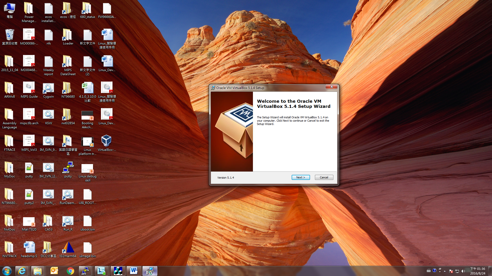
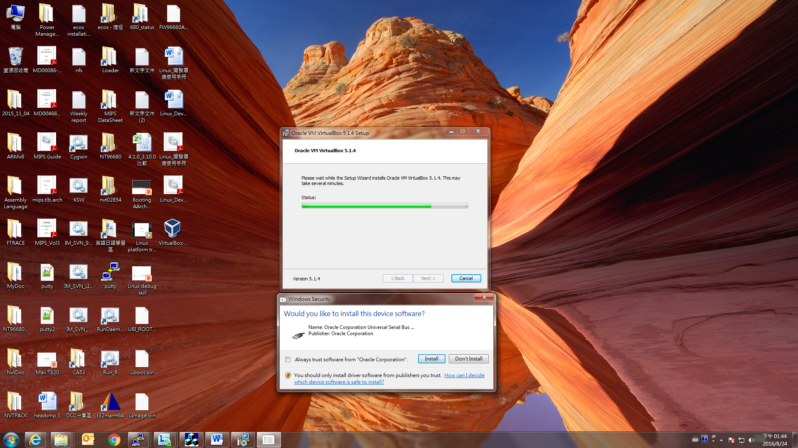
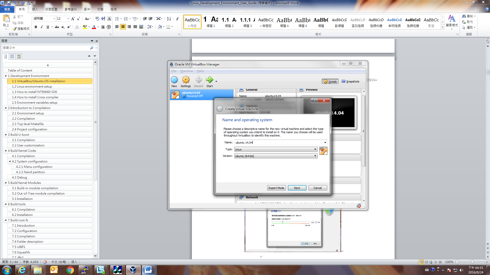
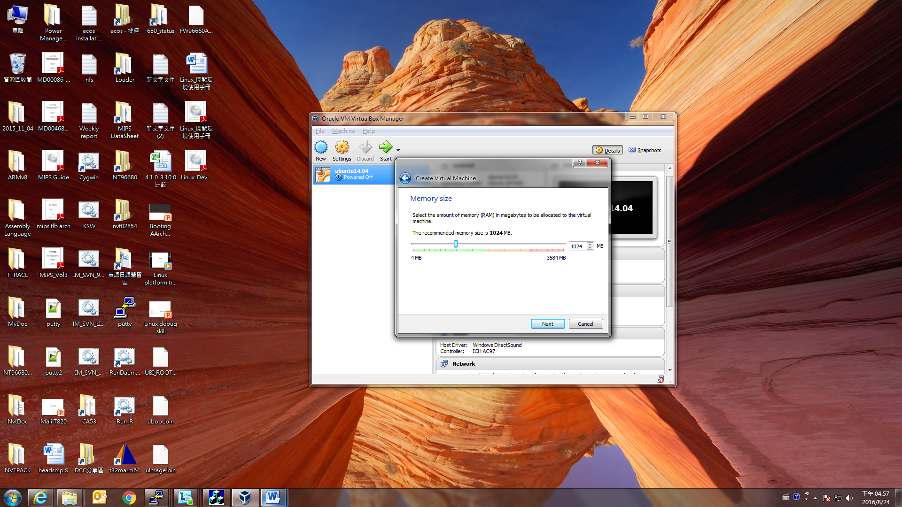
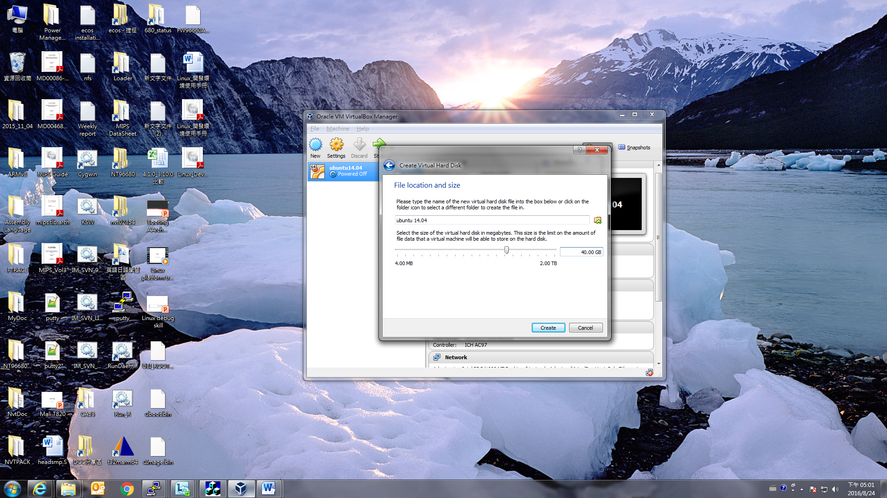
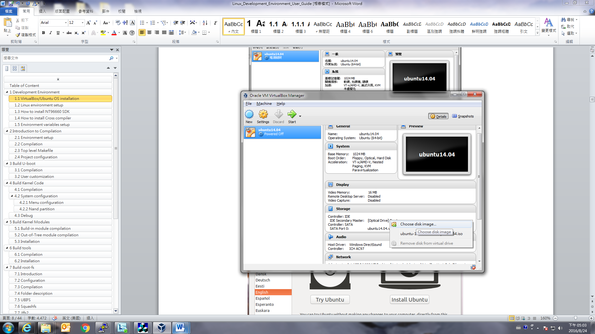
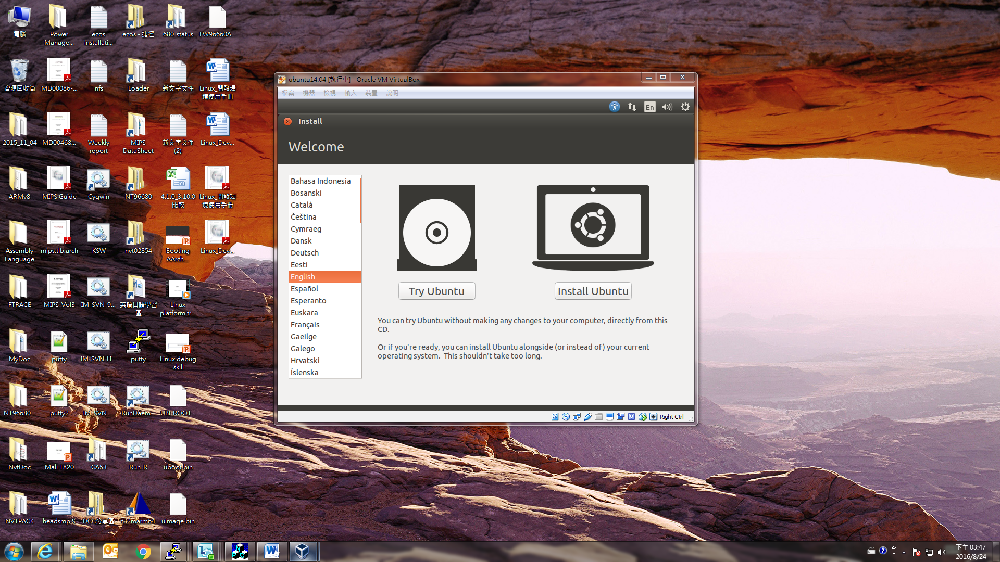
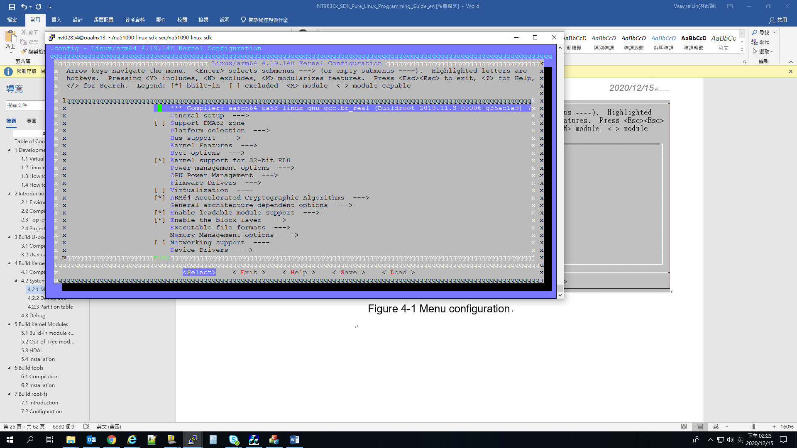
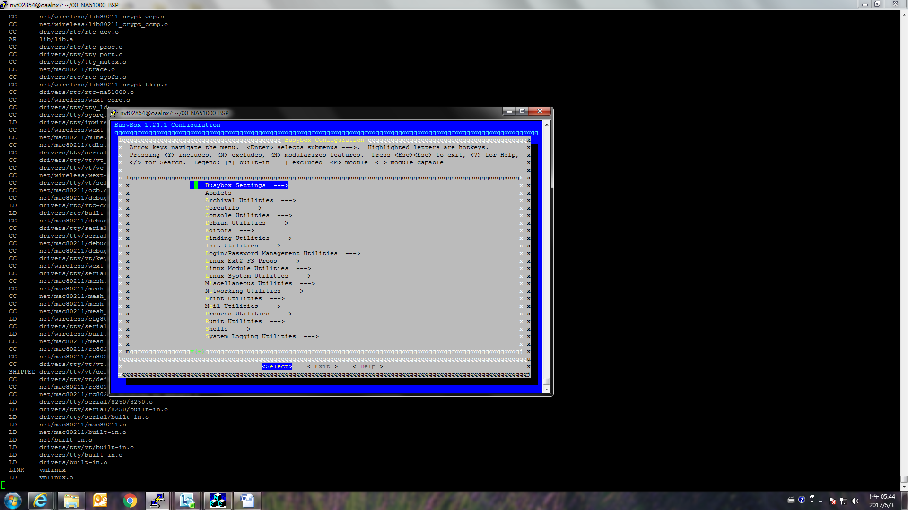

## Development Environment

### VirtualBox/Ubuntu OS installation

This section will introduce how to install Ubuntu on Windows OS, ignore this section if your environment is under single OS. Please download from VirtualBox official website (<https://www.virtualbox.org/wiki/Downloads>) and follow below instructions to install.





This step will install device driver, please select “Install”:


Create virtual machine (Version: Ubuntu 64-Bit):



Select virtual machine memory size:



Create virtual machine (If you have an existed Ubuntu image, you can select “Use an existing virtual hard disk file”):


To configure virtual disk space (At least 40GB size):



Select Optical drive and using Ubuntu ISO (Ubuntu 12.04/14.04/16.04/18.04 64-bit) startup:





### Linux environment setup

In order to prevent some complaints in the SDK compilation of the 32 Bits OS, we will use 64 Bits Ubuntu OS as our development environment. The first of all, you should install an Ubuntu based server or Ubuntu on VirtualBox which is introduced in previous section, please download the image from ([http://releases.ubuntu.com/](http://releases.ubuntu.com/12.04.5/)) to get Ubuntu 12.04/14.04/16.04/18.04 Desktop AMD64 version ISO image and use the following instructions to install necessary Ubuntu packages.

**Ubuntu 12.04:**

\$ sudo apt-get install bc build-essential libc6-dev libncurses5-dev libgl1-mesa-dev g++-multilib mingw32 tofrodos ia32-libs uboot-mkimage zlib1g-dev mtd-utils vim squashfs-tools gawk cmake cmake-data libstdc++6 device-tree-compiler android-tools-fsutils texinfo libssl-dev python3-crypto python3-pyelftools python3-pycrypto

\$ sudo add-apt-repository ppa:nathan-renniewaldock/ppa

\$ sudo apt-get update

\$ sudo apt-get install liblz4-tool

To install make-4.1 (**This will replace your original /bin/make tool**):

Download <https://ftp.gnu.org/gnu/make/make-4.1.tar.bz2>

\$ tar -jxvf make-4.1.tar.bz2

\$ cd make-4.1; ./configure; make -j4

\$ make install

**Ubuntu 14.04:**

\$ sudo apt-get install bc build-essential libc6-dev lib32ncurses5 libncurses5-dev libncurses5:i386 libgl1-mesa-dev g++-multilib mingw32 tofrodos lib32z1 lib32bz2-1.0 u-boot-tools zlib1g-dev bison libbison-dev flex mtd-utils vim squashfs-tools gawk cmake cmake-data liblz4-tool libmpc3 libstdc++6 device-tree-compiler android-tools-fsutils texinfo libssl-dev python3-crypto python3-pyelftools python3-pycrypto

To install make-4.1 (**This will replace your original /bin/make tool**):

Download <https://ftp.gnu.org/gnu/make/make-4.1.tar.bz2>

\$ tar -jxvf make-4.1.tar.bz2

\$ cd make-4.1; ./configure; make -j4

\$ make install

**Ubuntu 16.04:**

\$ sudo apt-get install bc build-essential libc6-dev lib32ncurses5 libncurses5-dev libncurses5:i386 libgl1-mesa-dev g++-multilib mingw-w64 tofrodos lib32z1 u-boot-tools zlib1g-dev bison libbison-dev flex mtd-utils vim squashfs-tools gawk cmake cmake-data liblz4-tool libmpc3 libstdc++6 device-tree-compiler android-tools-fsutils texinfo libssl-dev python3-crypto python3-pyelftools python3-pycrypto

**Ubuntu 18.04:**

\$ sudo apt-get install bc build-essential libc6-dev lib32ncurses5 libncurses5-dev libncurses5:i386 libgl1-mesa-dev g++-multilib mingw-w64 tofrodos lib32z1 u-boot-tools zlib1g-dev bison libbison-dev flex mtd-utils vim squashfs-tools gawk cmake cmake-data liblz4-tool libmpc3 libstdc++6 device-tree-compiler android-tools-fsutils texinfo libssl-dev python3-crypto python3-pyelftools python3-pycrypto

Ubuntu default shell is dash, please reconfigure the default shell with bash:

\$ sudo dpkg-reconfigure dash, and choose “No” in the window

Or

\$ sudo rm /bin/sh && sudo ln -s /bin/bash /bin/sh

Besides, the openssh-server is used to provide Windows Host PC connected to Linux server and remote building the Linux SDK, and the Samba server is to provide client get Linux SDK image from Linux server.

-   \$ apt-get install openssh-server
-   \$ apt-get install samba
-   \$ vim /etc/samba/smb.conf
-   Please reference to related Samba configuration as below: <https://help.ubuntu.com/12.04/serverguide/samba-fileserver.html>

Windows Host PC will also need Teraterm or putty to connect to Target board UART2 port with 115200/8/1/n configuration.

Figure 1-1 Linux Development Environment

### How to install NT9833x Linux SDK

Using the following instructions to decompress SDK pack under Linux:

\$ tar -jxvf na51090_linux_sdk_{version}.tar.bz2

You will get the folder tree as below:

├── na51090_linux_sdk Used to put unpacked SDK source code

├── BSP Including linux, busybox, uboot and rootfs source

├── build scripts for the environment setup

├── code HDAL, linux drivers and sample code

├── configs Model settings

├── Makefile Top level Makefile

└── tools target board tool

├── toolchains Toolchain folder

├── aarch64-ca53-linux-gnueabihf-8.4.tar.bz2

└── aarch64-ca53-linux-uclibcgnueabihf-8.4.tar.bz2

### How to install Cross compiler

We support both glibc and uclibc cross compiler toolchain, please choose and install it by using below instructions:

\$ cd toolchain

\$ sudo tar -jxvf aarch64-ca53-linux-gnueabihf-8.4.tar.bz2 -C /opt

or

\$ sudo tar -jxvf aarch64-ca53-linux-uclibcgnueabihf-8.4.tar.bz2 -C /opt

**  
**

## Introduction to Compilation

### Environment setup

Before each opened a new Terminal window needs to do compiler environment setting, the relevant variables set up, please follow the below instructions to finish it.

\$ cd na51090_linux_sdk/

\$ source build/envsetup.sh

### Compilation

Please do a complete compilation for first time.

Select your model:

\$ lunch

List your nvt build setting:

\$ get_stuff_for_environment

Build overall system:

\$ make all

It will generate the images under na51090_linux_sdk/output after the compilation. The details are listed as below.

\|-- na51090_linux_sdk Put unpacked source code and image

\| \|-- Makefile Top level Makefile

\| \|-- output Compiled output images

\| \|-- packed

\| \|-- FW(SOC)A.bin nvtpack image (All-in-one image)

\| \|-- atf.bin ATF image

\| \|-- Image.bin Linux Image

\| \|-- u-boot.bin uboot image with NVT checksum

\| \|-- u-boot.lz.bin uboot image (LZ compressed)

\| \|-- rootfs.ramdisk.bin ramdisk image (rootfs)

\| \`-- rootfs_1.rw.ubifs.bin rootfs overlay

### Top level Makefile

na51090_linux_sdk folder has a top level Makefile, it supports many of the make command, such as “make linux” is to compile linux-kernel, “make uboot” can compile u-boot, “make rootfs” can compile root-fs ... and so on, you can use “make help” to find what its commands are supported. Please use top level Makefile to do SDK compilation to avoid some link error occurred. Its help description is as follows:

\$ make help

=====================================================

make help -\> show make command info

make all -\> build all

make linux -\> build linux-kernel

make linuxram -\> build linux-kernel with ramdisk support

make modules -\> build built-in kernel modules

make driver -\> build NVT linux driver modules

make atf -\> build ARM trusted firmware

make uboot -\> build loader(uboot)

make optee_os -\> build OPTEE kernel

make optee_client -\> build OPTEE client

make library -\> build library

make busybox -\> build busybox

make rootfs -\> build rootfs

make app -\> build applications

make tools -\> build tools

make sample -\> build sample code

make post -\> run postprocessing script

make pack -\> Generate nvtpack image and preburn images

make publish -\> remove some sources for publish

=====================================================

make linux_config -\> config linux-kernel

make linux_config_gcov-\> modify kernel config for code coverage tool

make uboot_config -\> config uboot

make busybox_config -\> config busybox

make linux_header -\> generate linux-kernel out of tree headers

=====================================================

make clean -\> clean all

make linux_clean -\> clean linux-kernel & built-in kernel modules

make driver_clean -\> clean NVT linux driver modules

make atf_clean -\> clean ARM trusted firmware

make uboot_clean -\> clean loader(uboot)

make optee_os_clean -\> clean optee kernel

make optee_client_clean -\> clean optee client application

make library_clean -\> clean library

make busybox_clean -\> clean busybox

make rootfs_clean -\> clean rootfs

make app_clean -\> clean applications

make tools_clean -\> clean tools

make sample_clean -\> clean sample code

make post_clean -\> run postprocessing clean script

make pack_clean -\> Remove nvtpack image

=====================================================

### Project configuration

We provide the following file to control functionalities enable or disable, please refer to the below procedures to configure.

Check model type:

\$ get_stuff_for_environment

```
======================================== NVT Setting ======================================== NVT_PRJCFG_MODEL_CFG = /home/user1/na51090_linux_sdk/configs/Linux/cfg_xxx_NAND_EVB/ModelConfig.mk
NVT_PRJCFG_CFG = Linux
NVT_PRJCFG_MODEL_MK =
```

The ModelConfig.mk will be generated from configs/cfg_gen/nvt-info.dtsi

Enable/disable function:

\$ cd na51090_linux_sdk/

\$ vi configs/cfg_gen/nvt-info.dtsi

To find Linux related options:

```
/*
 * Novatek Ltd. BSP part of dts
 */

/ {
        nvt_info {                                              /* Get from ModelConfig.txt */
                BIN_NAME = "FW98336A";
                BIN_NAME_T = "FW98336T";
                /* EMBMEM_BLK_SIZE, Normally, 2KPageNand=0x20000, 512PageNand=0x4000, SPI=0x10000 */
                EMBMEM_BLK_SIZE = "0x20000";

                /*
                 * [EMBMEM]
                 * EMBMEM_NONE
                 * EMBMEM_NAND
                 * EMBMEM_SPI_NOR
                 * EMBMEM_SPI_NAND
                 * EMBMEM_EMMC
                 */
                EMBMEM = " EMBMEM_SPI_NAND";
                /*
                 * ======= Linux common =========
                 * application/external
                 */
                NVT_CFG_APP_EXTERNAL = "dhd_priv";
                /* application include list */
                NVT_CFG_APP = "";
                /* rootfs etc folder */
                NVT_ROOTFS_ETC = "";
                /* strip executable binary and library files: yes/no */
                NVT_BINARY_FILE_STRIP = "yes";
                /* Using customized kernel config */
                NVT_CFG_KERNEL_CFG = "";
                /* Using customized uboot config */
                NVT_CFG_UBOOT_CFG = "";

                /*
                 * ======= Linux for different code setting =========
                 * [NVT_LINUX_SMP]
                 * NVT_LINUX_SMP_ON
                 * NVT_LINUX_SMP_OFF
                 */
                NVT_LINUX_SMP = "NVT_LINUX_SMP_ON";

                /*
                 * [NVT_DEFAULT_NETWORK_BOOT_PROTOCOL]
                 * NVT_DEFAULT_NETWORK_BOOT_PROTOCOL_DHCP_SERVER
                 * NVT_DEFAULT_NETWORK_BOOT_PROTOCOL_DHCP_CLIENT
                 * NVT_DEFAULT_NETWORK_BOOT_PROTOCOL_STATIC_IP
                 */
                NVT_DEFAULT_NETWORK_BOOT_PROTOCOL = "NVT_DEFAULT_NETWORK_BOOT_PROTOCOL_STATIC_IP";

                /*
                 * [NVT_ROOTFS_TYPE]
                 * NVT_ROOTFS_TYPE_NAND_UBI
                 * NVT_ROOTFS_TYPE_NAND_SQUASH
                 * NVT_ROOTFS_TYPE_NAND_JFFS2
                 * NVT_ROOTFS_TYPE_NOR_SQUASH
                 * NVT_ROOTFS_TYPE_NOR_JFFS2
                 * NVT_ROOTFS_TYPE_RAMDISK
                 * NVT_ROOTFS_TYPE_EMMC
                 * NVT_ROOTFS_TYPE_NAND_SQUASH_NEW
                 */
                NVT_ROOTFS_TYPE = "NVT_ROOTFS_TYPE_RAMDISK";

                /*
                 * [NVT_ETHERNET]
                 * NVT_ETHERNET_NONE
                 * NVT_ETHERNET_EQOS
                 */
                NVT_ETHERNET = "NVT_ETHERNET_EQOS";

                /*
                 * [NVT_SDIO_WIFI]: Remember to update root-fs/rootfs/etc/init.d/S05_Net
                 * NVT_SDIO_WIFI_NONE
                 * NVT_SDIO_WIFI_RTK
                 * NVT_SDIO_WIFI_BRCM
                 * NVT_SDIO_WIFI_NVT
                 */
                NVT_SDIO_WIFI = "NVT_SDIO_WIFI_NONE";

                /*
                 * [NVT_USB_WIFI]
                 * NVT_USB_WIFI_NONE
                 */
                NVT_USB_WIFI = "NVT_USB_WIFI_NONE";

                /*
                 * [NVT_USB_4G]
                 * NVT_USB_4G_NONE
                 */
                NVT_USB_4G = "NVT_USB_4G_NONE";

                /*
                 * [WIFI_RTK_MDL]  : sub item for NVT_SDIO_WIFI_RTK
                 * WIFI_RTK_MDL_NONE
                 * WIFI_RTK_MDL_8189
                 */
                WIFI_RTK_MDL = "WIFI_RTK_MDL_8189";

                /*
                 * [WIFI_BRCM_MDL]  : sub item for NVT_SDIO_WIFI_BRCM
                 * WIFI_BRCM_MDL_43438a1_ampk6212axtal26
                 * WIFI_BRCM_MDL_43455c0_ampk6255c0
                 */
                WIFI_BRCM_MDL = "WIFI_BRCM_MDL_43438a1_ampk6212axtal26";

                /*
                 * [WIFI_NVT_MDL]  : sub item for NVT_SDIO_WIFI_NVT
                 * WIFI_NVT_MDL_18202
                 * WIFI_NVT_MDL_18211
                 */
                WIFI_NVT_MDL = "WIFI_NVT_MDL_18211";

                /*
                 * [NVT_CURL_SSL]
                 * NVT_CURL_SSL_OPENSSL
                 * NVT_CURL_SSL_WOLFSSL
                 */
                NVT_CURL_SSL = "NVT_CURL_SSL_OPENSSL";

                /*
                 * [NVT_UBOOT_ENV_IN_STORG_SUPPORT]
                 * NVT_UBOOT_ENV_IN_STORG_SUPPORT_NAND
                 * NVT_UBOOT_ENV_IN_STORG_SUPPORT_NOR
                 * NVT_UBOOT_ENV_IN_STORG_SUPPORT_MMC
                 * NVT_UBOOT_ENV_IN_STORG_SUPPORT_OFF
                 */
                NVT_UBOOT_ENV_IN_STORG_SUPPORT = "NVT_UBOOT_ENV_IN_STORG_SUPPORT_OFF";
        };
};
```

## Build U-boot

### Compilation

The Uboot source code is placed on “na51090_linux_sdk/u-boot”, typing “make uboot” can be used to compile Uboot, and we provide two images are u-boot.bin(non-compressed) and u-boot.lz.bin(compressed) under na51090_linux_sdk/output.

U-boot build:

\$ cd na51090_linux_sdk/

\$ make uboot

U-boot config:

\$ cd na51090_linux_sdk/

\$ make uboot_config

U-boot clean build:

\$ make uboot_clean

### User customization

The uboot have two config files will have different configured properties. One is for common function, the other is for the low level setting.

The low level setting can modify this file “include/configs/nvt-na51090-evb-a64.h” directly when you have request for the Uboot related configuration.

e.g. Uboot passed to Linux’s cmdline can be changed with this variable

```
#define CONFIG_USE_BOOTARGS
#define CONFIG_BOOTARGS_COMMON      "earlycon=nvt_serial,0x2f0280000 rootwait console=ttyS0,115200 debug_boot_weak_hash  "
#define CONFIG_BOOTARGS               CONFIG_BOOTARGS_COMMON "root=/dev/ram0 rootfstype=ramfs rdinit=/linuxrc "
```

Please reference to “SDK_UBoot_Programming_Guide_en” for more details.

## Build Kernel Code

### Compilation

The Linux kernel source code is placed on “na51090_linux_sdk/linux-kernel”, typing “make linux” can be used to compile Linux kernel, and the image name is Image.bin under na51090_linux_sdk.

\$ cd na51090_linux_sdk/

\$ make linux

Linux clean build:

\$ make linux_clean

### System configuration

#### Menu configuration

Top Makefile is already integrated the formal Linux menuconfig, to use the following instruction can do the function selection. Please avoid using formal Linux “make menuconfig” under linux-kernel directly; it will cause error because the important variables are not set correctly.

\$ make linux_config

Choose “Save” after finished function selection; it can generate a new *.config* for the Linux compilation usage.

NA51090 SDK provides two Kernel configuration file under “na51090_linux_sdk/BSP/linux-kernel/arch/arm64/configs/”, one is for the debug mode, and the other is for the release mode.

-   na51090_XXX_defconfig_debug, the debug mode will enable most of the functions for the development stage
-   na51090_XXX_defconfig_release, the release mode will only enable boot necessary parts.

Edit Top Makefile to switch the configuration file:

\$ cd na51090_linux_sdk/

\$ vi Makefile

```
## kernel & modules
CUSTBOARDCONFIG := $(strip $(shell echo $(NVT_PRJCFG_MODEL_CFG) | grep NVT_CFG_KERNEL_CFG | awk -F'=' '{print $$NF;}'))
ifeq ($(EMBMEM), EMBMEM_SPI_NOR)
#BOARDCONFIG := $(shell if [ ! -z $(NVT_CFG_KERNEL_CFG) ]; then echo $(NVT_CFG_KERNEL_CFG); else echo $(SDK_CODENAME)_evb_defconfig_nor_debug; fi)
BOARDCONFIG := $(shell if [ ! -z $(NVT_CFG_KERNEL_CFG) ]; then echo $(NVT_CFG_KERNEL_CFG); else echo $(SDK_CODENAME)_evb_defconfig_nor_release; fi)
else ifeq ($(EMBMEM), EMBMEM_EMMC)
#BOARDCONFIG := $(shell if [ ! -z $(NVT_CFG_KERNEL_CFG) ]; then echo $(NVT_CFG_KERNEL_CFG); else echo $(SDK_CODENAME)_evb_defconfig_emmc_debug; fi)
BOARDCONFIG := $(shell if [ ! -z $(NVT_CFG_KERNEL_CFG) ]; then echo $(NVT_CFG_KERNEL_CFG); else echo $(SDK_CODENAME)_evb_defconfig_emmc_release; fi)
else
#BOARDCONFIG := $(shell if [ ! -z $(NVT_CFG_KERNEL_CFG) ]; then echo $(NVT_CFG_KERNEL_CFG); else echo $(SDK_CODENAME)_evb_defconfig_debug; fi)
BOARDCONFIG := $(shell if [ ! -z $(NVT_CFG_KERNEL_CFG) ]; then echo $(NVT_CFG_KERNEL_CFG); else echo $(SDK_CODENAME)_evb_defconfig_release; fi)
endif
```



Figure 4-1 Menu configuration

#### Device tree

The device tree can be generated by dtc(device tree compiler) tool as below, you can find the \*.dtsi in “na51090_linux_sdk/configs/cfg_xxx” and users can set command “make cfg” at “na51090_linux_sdk/”. Config items detail description put at na51090_linux_sdk/configs/doc. It can be used to compile device tree, and we will output image nvt-evb.dtb under na51090_linux_sdk/output.

The merge method is Union, for example:

configs/cfg_gen/nvt-basic.dtsi

User can modify CPU clock-frequency from 1200000000(1.2GHz) to 1000000000(1GHz), or 1100000000(1.1GHz), or 1300000000(1.3GHz), or 1350000000(1.35GHz), and compiler again. Users can use new image to boot at new CPU clock-frequency.

```
#include <dt-bindings/gpio/gpio.h>
#include <dt-bindings/interrupt-controller/arm-gic.h>

/ {
	model = "Novatek NA51090";
	compatible = "novatek,na51090", "nvt,ca53";
	interrupt-parent = <&gic>;
	#address-cells = <2>;
	#size-cells = <2>;


	psci {
		compatible = "arm,psci-0.2";
		method = "smc";
	};

	cpus {
		#address-cells = <2>;
		#size-cells = <0>;

		cpu0: cpu@0 {
			device_type = "cpu";
			compatible = "arm,cortex-a53", "arm,armv8";
			reg = <0x0 0x0>;
			next-level-cache = <&A53_L2>;
			clock-frequency = <1200000000>;
			enable-method = "psci";
		};
		
		cpu1: cpu@1 {
			device_type = "cpu";
			compatible = "arm,cortex-a53", "arm,armv8";
			reg = <0x0 0x1>;
			next-level-cache = <&A53_L2>;
			clock-frequency = <1200000000>;
			enable-method = "psci";
		};

		cpu2: cpu@2 {
			device_type = "cpu";
			compatible = "arm,cortex-a53", "arm,armv8";
			reg = <0x0 0x2>;
			next-level-cache = <&A53_L2>;
			clock-frequency = <1200000000>;
			enable-method = "psci";
		};

		cpu3: cpu@3 {
			device_type = "cpu";
			compatible = "arm,cortex-a53", "arm,armv8";
			reg = <0x0 0x3>;
			next-level-cache = <&A53_L2>;
			clock-frequency = <1200000000>;
			enable-method = "psci";
		};
		

		A53_L2: l2-cache0 {
			compatible = "cache";
		};
	};
      …
```

configs/cfg_gen/nvt-peri.dtsi

```
#include <dt-bindings/gpio/nvt-gpio.h>
#include "nvt-basic.dtsi"

/ {
	chosen {
		bootargs = " ";
		stdout-path = "serial0:115200n8";
	};

	aliases {
		serial0 = &uart0;
		serial1 = &uart1;
		serial2 = &uart2;
		serial3 = &uart3;
		serial4 = &uart4;
		mmc0 = &mmc0;	/* Fixed to mmcblk0 for sdio1 */
	};

	uart0: uart@f0280000 {
		compatible = "ns16550a";
		reg = <0x2 0xf0280000 0x0 0x1000>;
		interrupts = <GIC_SPI 43 IRQ_TYPE_LEVEL_HIGH>;
		baud = <115200>;
		reg-shift = <2>;
		reg-io-width = <4>;
		no-loopback-test = <1>;
		clock-frequency = <24000000>;
		rx_trig_level = <3>;
		hw_flowctrl = <0>;
	};

	uart1: uart@f0290000 {
		compatible = "ns16550a";
		reg = <0x2 0xf0290000 0x0 0x1000>;
		interrupts = <GIC_SPI 44 IRQ_TYPE_LEVEL_HIGH>;
		baud = <115200>;
		reg-shift = <2>;
		reg-io-width = <4>;
		no-loopback-test = <1>;
		clock-frequency = <48000000>;
		rx_trig_level = <3>;
		hw_flowctrl = <0>;
	};

	uart2: uart@f02a0000 {
		compatible = "ns16550a";
		reg = <0x2 0xf02a0000 0x0 0x1000>;
		interrupts = <GIC_SPI 45 IRQ_TYPE_LEVEL_HIGH>;
		baud = <115200>;
		reg-shift = <2>;
		reg-io-width = <4>;
		no-loopback-test = <1>;
		clock-frequency = <48000000>;
		rx_trig_level = <3>;
	};

	uart3: uart@f02b0000 {
		compatible = "ns16550a";
		reg = <0x2 0xf02b0000 0x0 0x1000>;
		interrupts = <GIC_SPI 38 IRQ_TYPE_LEVEL_HIGH>;
		baud = <115200>;
		reg-shift = <2>;
		reg-io-width = <4>;
		no-loopback-test = <1>;
		clock-frequency = <48000000>;
		rx_trig_level = <3>;
	};

	uart4: uart@f02c0000 {
		compatible = "ns16550a";
		reg = <0x2 0xf02c0000 0x0 0x1000>;
		interrupts = <GIC_SPI 47 IRQ_TYPE_LEVEL_HIGH>;
		baud = <115200>;
		reg-shift = <2>;
		reg-io-width = <4>;
		no-loopback-test = <1>;
		clock-frequency = <48000000>;
		rx_trig_level = <3>;
	};
```

#### Partition table

The Nand/EMMC driver of kernel will do for the set partition initialization process as shown below, Uboot will read the partition info(nvt-storage-partition.dtsi) from dts, and then the Kernel also read it from dts to do basic initialization.

If you want to change flash partition size or add a partition, please configure device tree nvt-storage-partition.dtsi and build dtb image, burn into flash or load to dram again(default address at 0x1f00000).

Figure 4-2 Partition initialization

SPI NAND partition example:

nvt-storage-partition.dtsi for flash partition

```
&nand {
	partition_loader {      label = "loader";       reg = <0x0 0x0000000 0x0 0x40000>; }; /* Fixed */
	partition_fdt {	        label = "fdt";	        reg = <0x0 0x40000   0x0 0x40000>; }; /* Fixed */
	partition_fdt.restore {	label = "fdt.restore";	reg = <0x0 0x80000   0x0 0x40000>; }; /* Fixed */
	partition_atf {         label = "atf";          reg = <0x0 0x0C0000  0x0 0x40000>; };
	partition_uboot {       label = "uboot";        reg = <0x0 0x100000  0x0 0x1C0000>; };
	partition_uenv {        label = "uenv";         reg = <0x0 0x2C0000  0x0 0x40000>; };
	partition_kernel {      label = "kernel";       reg = <0x0 0x300000  0x0 0x0500000>; };
	partition_rootfs {      label = "rootfs";       reg = <0x0 0x800000  0x0 0x5100000>; };
	partition_rootfs1 {     label = "rootfs1";      reg = <0x0 0x5900000 0x0 0x2700000>; };
};
```

If you want to change the partition size or add a partition, please configure it from the dts info. If users want to add user partition such as app1, users can add such as follow:

```
partition_app1 {  	label = "app1";          reg = <0x0 start_addr 0x0 size>; };
```

### Debug

To debug the Kernel, you will need System.map or objects for the debug symbol loading, please get them from “linux-kernel/” as shown below:

\|-- linux-kernel

\| \|-- Makefile

\| \|-- Module.symvers

\| \|-- System.map

\| \|-- arch

\| \|-- block

\| \|-- crypto

\| \|-- drivers

\| \|-- firmware

\| \|-- fs

\| \|-- include

\| \|-- init

\| \|-- ipc

\| \|-- kernel

\| \|-- lib

\| \|-- mm

\| \|-- modules.builtin

\| \|-- modules.order

\| \|-- net

\| \|-- scripts

\| \|-- security

\| \|-- sound

\| \|-- source

\| \|-- usr

\| \|-- vmlinux

\| \`-- vmlinux.o

To add more debug information, we can turn on CONFIG_DEBUG_INFO option before compiling Linux kernel as below.

“Kernel Hacking \> Compile-time checks and compiler options \> Compile the kernel with debug info”

\$ cd na51090_linux_sdk/

\$ make linux_config

Rebuild all; this binary will contain debug symbol information.

\|-- linux-kernel

\| \|-- vmlinux

**  
**

## Build Kernel Modules

In addition to build-in drivers, Linux had also provided an external load mode called Kernel module, can be loaded by “modprobe” or “insmod”. The below will introduce to build-in modules and the out-of-tree modules.

### Build-in module compilation

Typing “make modules” under na51090_linux_sdk can do build-in modules compilation and install path is root-fs/rootfs/lib/modules/{KER_VER}/kernel/.

\$ cd na51090_linux_sdk/

\$ make modules

### Out-of-Tree module compilation

This folder under “na51090_linux_sdk/code” provides NVT platform drivers, typing “make supplement” to do the Out-of Tree modules compilation as below. And the modules will be installed on na51090_linux_sdk/BSP/root-fs/rootfs/lib/modules/{KER_VER}/extra/.

\$ cd na51090_linux_sdk/

\$ make driver

Linux Out-of-Tree driver module clean build:

\$ make driver_clean

### HDAL

HDAL is the hardware abstraction layer driver and sample code, this one can be used to build proprietary driver modules, such as video process, video capture and video codec…etc. We provide the following instructions to build.

\$ make hdal

Clean build:

\$ make hdal_clean

Please refer to the other documents for details.

**  
**

### Installation

The modules can be installed by “modprobe” or “insmod/rmmod” to install or uninstall, besides the modprobe will also install related modules automatically.

Example:

1.  modprobe (Only needs the module name)

    modprobe ehci-hcd

1.  insmod/rmmod (This method needs a full path)

    insmod /lib/modules/{KER_VER}/extra/crypto/cryptodev-linux/cryptodev.ko

## Build tools

This folder will integrate some Linux open source tools as the following description:

htop - Linux process monitoring, to provide more than top information

gdb - gdb server for the application debug

ethtool - Utility for controlling network drivers and hardware

bonnie++ - A benchmark suite that is aimed at performing a number of simple tests of hard drive and file system performance

memtester - A userspace utility for testing the memory subsystem for faults

mtd-utils - MTD device utilities

procps - A tool set to provide system analysis tools (vmstat, slabtop,…etc)

stress - System performance testing tool

stress-ng - Advanced system performance testing tool

sdcard_test.sh- To do sd driver r/w testing

iozone - IO r/w performance testing

VDBench - CPU/io performance testing

### Compilation

To select the tools what you want: mtd-utils, memtester, bonnie, ethtool, gdb, htop, netperf, iperf and procps and running below instructions:

e.g.

\$ cd na51090_linux_sdk/

\$ cd tools/

\$ make stress

Tools clean build:

\$ make clean

### Installation

\$ make install

The tools will be installed on “na51090_linux_sdk/BSP/root-fs”.

## Build root-fs

### Introduction

The root file system will be mounted by Linux kernel, the first process of the kernel is /sbin/init (PID=1). We provide several root file systems support for selection, the following are the summary features:

-   UBIFS: readable/writable file system, support Nor and Nand flash, fast mounting speed, best bad block management and better IO performance. Suitable for low memory size and large flash size use condition.

    We have a detail introduction in OSDRV/NT9833x_UBI_Filesystem_User_Guide_en.doc

-   Squashfs: read-only file system, high compression rate. Suitable for small size flash and readonly use condition.
-   JFFS2: It is a log-structured file system which can support Nand and Nor flash devices. Providing zlib, lzo and rtime compression methods. Suitable for small flash size and readable/writable use condition.
-   RAMDISK: To provide a ram based file system.

### Configuration

The root file system will generate Nand flash type image format, we support squashfs and ubifs, please follow the Nand flash specification to modify the parameters:

\$ cd na51090_linux_sdk/BSP/root-fs/

\$ vi ubi_max_leb.py

To find below lines:

```
W = 1024
SP = 128 * 1024
SL = 124 * 1024
```

According the Nand flash to modify the parameters:

-   W is the entire flash chip Physical eraseblocks numbers
-   SP is the Size of block page
-   SL= (Size of block -2) \* Size of page.

    e.g.

    128MB Nand flash = 1024 eraseblocks = 1024 \* 128KB

    W = 1024

    SP = 64 \* 2048 = 128 \* 1024

    SL = (64 – 2) \* 2048 = 124 \* 1024

\$ vi mtd_cfg.txt

We can support two mtd_cfg.txt in BSP/root-fs/ and configs/cfg_gen, the build tool will search configs/cfg_gen/mtd_cfg.txt firstly, and the second is BSP/root-fs/mtd_cfg.txt.

To find below lines:

```
ROOTFS_UBI_SUB_PAGE_SIZE=2048			## Same as page size
ROOTFS_UBI_PAGE_SIZE=2048			## Nand page size
ROOTFS_UBI_ERASE_BLK_SIZE=126976		## (64-2) * Page size=126976
ROOTFS_UBI_MAX_LEB_COUNT=361			## Size = UBI_MAX_LEB_COUNT * UBI_BLK_SIZE; It's calculated by "python ubi_max_leb.py Bytes"
ROOTFS_UBI_RW_MAX_LEB_COUNT=258			## Size = UBI_MAX_LEB_COUNT * UBI_BLK_SIZE; It's calculated by "python ubi_max_leb.py Bytes"
ROOTFS_UBI_BLK_SIZE="128KiB"			## UBIFS Nand flash block size (KiB)
ROOTFS_UBI_COMPRESS_MODE="lzo"			## UBIFS compression type: "lzo", "favor_lzo", "zlib" "none"

ROOTFS_SQ_COMPRESS_MODE="xz"			## Squashfs compression type: "gzip", "lzo" and "xz"
ROOTFS_SQ_BLK_SIZE="128K"			## Squashfs Nand flash block size (KiB): e.g. spinand: 128K, spinor: 64K

ROOTFS_JFFS2_COMPRESS_MODE="lzo"		## jffs2 compression type: "lzo" "zlib" "rtime"
ROOTFS_JFFS2_SIZE=0x3200000			## jffs2 partition size: get from /proc/mtd
ROOTFS_JFFS2_RW_SIZE=0x2500000			## jffs2 partition size: get from /proc/mtd
ROOTFS_JFFS2_BLK_SIZE="128KiB"			## jffs2 block size (KiB): spinand: 128KiB, spinor: 64KiB
ROOTFS_JFFS2_PAGE_SIZE="2048"			## jffs2 page size (Bytes): only used by nand, nor flash can be ignored.

ROOTFS_EXT4_SIZE=$(shell printf "%d\n" 0x0A000000)
ROOTFS_FAT_CACHE_SIZE=$(shell printf "%d\n" 0x0A000000)

#APPFS
ROOTFS_JFFS2_APP_SIZE=0x01E0000
ROOTFS_JFFS2_APP_NOR_SIZE=0x0E20000
ROOTFS_UBI_APP_MAX_LEB_COUNT=231
```

The necessary parameters need to be modified as below description:

-   ROOTFS_UBI_SUB_PAGE_SIZE: The sub-page size of the Nand flash
-   ROOTFS_UBI_PAGE_SIZE: The page size of the Nand flash
-   ROOTFS_UBI_ERASE_BLK_SIZE: (Nand flash block size – 2) \* Page size
-   ROOTFS_UBI_MAX_LEB_COUNT: Use ubi_max_leb.py to calculate it

    \$ Usage: ubi_max_leb.py PartitionSize (Bytes)

-   ROOTFS_UBI_RW_MAX_LEB_COUNT: Use ubi_max_leb.py to calculate it

    \$ Usage: ubi_max_leb.py PartitionSize (Bytes)

-   ROOTFS_UBI_BLK_SIZE: Nand flash block size
-   ROOTFS_UBI_COMPRESS_MODE: Compression method = LZO
-   ROOTFS_SQ_COMPRESS_MODE: Squashfs compression mode
-   ROOTFS_SQ_BLK_SIZE: Squashfs nand flsh block size
-   ROOTFS_JFFS2_COMPRESS_MODE: jffs2 compression type: "lzo" "zlib" "rtime"
-   ROOTFS_JFFS2_SIZE: Rootfs partition size
-   ROOTFS_EXT4_SIZE: EMMC boot partition size
-   ROOTFS_FAT_CACHE_SIZE: EMMC boot FAT partition size (Optional)
-   ROOTFS_JFFS2_APP_SIZE: The size of the app partition in nand flash
-   ROOTFS_JFFS2_APP_NOR_SIZE: The size of the app partition in nor flash
-   ROOTFS_UBI_APP_MAX_LEB_COUNT: The ubi image size in app partition (Use ubi_max_leb.py to calculate it)

You can modify the ubi mount parameters with your requirement, e.g.


BSP/root-fs/ubi_max_leb.py

```
def get_ubifs_max_leb(partition_size):          #Unit: Bytes
        P = partition_size/SP
        BR = math.ceil(30 * W/float(1024))      ## Sync with kernel
        B = max(BB, BR)

        ubi_overhead = (( B - BB + 4 ) * SP + O * ( P - B - 4 ))/float(SP)
        ubi_overhead = math.ceil(ubi_overhead)
        ubi_overhead = math.floor(((P - ubi_overhead) * SP) / float(SL))
	  if ubi_overhead < 0:
		return -1
	  else:
		return (ubi_overhead - 1)
```

Note: linux menuconfig Maximum expected bad eraseblock count per 1024 eraseblocks value “30” must be the same with ubi_max_leb.py value “30”. This parameter will affect the bad block management, please reserve enough blocks(e.g. 10, 20) per 1024 erase blocks.

### Modify flash filesystem partition size

Users must check mtd config definiton in configs/cfg_gen/mtd_cfg.txt, the parameters: ROOTFS_UBI_MAX_LEB_COUNT, ROOTFS_UBI_RW_MAX_LEB_COUNT and ROOTFS_UBI_APP_MAX_LEB_COUNT value must use ubi_max_leb.py to calculate.

### Compilation

Using “make rootfs” instruction to generate rootfs bin, the image type can be selected by nvt-info.dtsi in configs folder. They can be produced into “na51090_linux_sdk/output/rootfs.ubifs.bin”, “na51090_linux_sdk/output/rootfs.squash.bin” and “na51090_linux_sdk/output/rootfs.jffs2.bin” separately. The command “mr” also can be used to compile rootfs if you are not in na51090_linux_sdk root folder.

\$ cd na51090_linux_sdk/

\$ source build/envsetup.sh

\$ make rootfs

Rootfs clean build:

\$ make rootfs_clean

This command will remove busybox tools, kernel modules…etc., please follow below procedure to generate rootfs image:

\$ make busybox

\$ make app (\$ make library if necessary)

\$ make hdal

\$ make rootfs

### Folder description

-   **Architecture**

| Folder                  | Description                                                                                             |
|-------------------------|---------------------------------------------------------------------------------------------------------|
| bin                     | User binaries                                                                                           |
| dev                     | Device files                                                                                            |
| etc                     | System management configuration files                                                                   |
| home                    | User home directories                                                                                   |
| init -\> bin/busybox    | It is used to kernel boot necessary init process, for the initial environment setup.                    |
| lib                     | Standard system libraries                                                                               |
| linuxrc -\> bin/busybox |                                                                                                         |
| mnt                     | External storage device mount folder (/mnt/sd, /mnt/usb)                                                |
| proc                    | RAM based FS to provide process information                                                             |
| root                    | Root’s folder (The default shell will login here)                                                       |
| sbin                    | System management binaries                                                                              |
| srv                     | Service data                                                                                            |
| sys                     | RAM based FS to provide user space and kernel space attribute/properties link.                          |
| tmp                     | RAM based temp folder                                                                                   |
| usr                     | User libraries, binaries                                                                                |
| var                     | Service log message, including kernel, application, web server default folder(/var/www) and service…etc |

-   **/etc/passwd**

    This file can setup user account environment, below is to introduce how to enable login password.

    \$ vi /etc/inittab

```
::respawn:-/bin/login
```

Replace “::respawn:-/bin/login -f root” with “::respawn:-/bin/login” as below

Fill in the red part with the encryption password which can be generated by openssl tool:

\$ vi /etc/passwd

```
root:EncryptionCode:0:0:root:/root:/bin/sh
```

Openssl generation:

\$ openssl passwd -crypt YourPWD

-   **/etc/init.d**

    System will execute the following shell scripts according sequence.

    rcS -\> S00_PreReady -\> S05_Net -\> S10_SysInit -\> S10_hdal_init -\> S99_Sysctl

    Moreover, power off will execute deinitialization process as below.

    rcK -\> K00_Sys -\> K99_Sys

-   **/etc/sysctl.conf**

    This file is handle sysctl parameters setup.

### UBIFS

The UBIFS is our default rootfs format, UBIFS (Unsorted Block Image File System) was originally called JFFS3, is JFFS2 next generation version. The main capabilities are faster mounting, quicker access to large files, and improved write speeds. UBIFS also preserves or improves upon JFFS2's on-the-fly compression, recoverability and power fail tolerance, and data compression allows zlib or LZO. The filename is UBI.IMG after compilation.

### Squashfs

Squashfs is a read-only file system which can support gzip, lzo and xz compression modes. The main features are high compression rate, stores full 32bits uid/gids and creation time, support block size up to 1Mbytes. The filename is SQ_ROOTFS.IMG after compilation.

### Jffs2

JFFS2 was developed by Red Hat, based on the work started in the original JFFS by Axis Communications, AB, it is a readable and writable file system. JFFS2 will scan rootfs partition during mounting; the mount time depends on the rootfs size. The main features are listed as below:

-   Support compression mode
-   Mounting time will be affected by flash size
-   Not support all Nand flash devices with HW ecc, please refer to Linux driver application note

The filename is rootfs.jffs2.bin after compilation.

For the kernel configuration to add jffs2 support, you must add below configurations:

File systems

\-\> Miscellaneous filesystems

\-\> [\*] Journalling Flash File System v2 (JFFS2) support

\-\> [\*] Advanced compression options for JFFS2

\-\> [\*] JFFS2 LZO compression support

For the uboot configuration to choose root file system type, please refer to the UBoot_Programing_Guide.

### HDAL sample code

We will pack one partition named DVR_xxx.bin is under na51090_linux_sdk/configs/Linux/cfg_xxx/nvt-nvtpack.dtsi partition_name = "app" field. You could modify the partition size and recalculate the related parameters to fill in the nvt -storage-partition.dtsi partition_app field.

Please refer to 7.2 for mtd_cfg.txt description.

## Build App

### Compilation

NVT platform needs the necessary applications to perform the requested actions, please using below instructions to compile (This part doesn’t provide source code).

\$ cd na51090_linux_sdk/code/application

\$ make install

Please execute “source build/envsetup.sh” firstly when you start to build it. Please reference to Application Note for the other details.

We have fine-tuned some functions and the fpu related setting, please add \$(PLATFORM_CFLAGS) to your Makefile to get more performance.

e.g.

```
nvt02854@oaalnx13:~/na51090_linux_sdk/na51090_linux_sdk$ get_stuff_for_environment
======================================== NVT Setting ========================================
NVT_PRJCFG_CFG = Linux
NVT_PRJCFG_MODEL_CFG = /home/nvt02854/na51090_linux_sdk/na51090_linux_sdk/configs/Linux/cfg_TEST_FPGA_a64/ModelConfig.mk
LINUX_BUILD_TOP = /home/nvt02854/na51090_linux_sdk/na51090_linux_sdk
UBOOT_DIR = /home/nvt02854/na51090_linux_sdk/na51090_linux_sdk/BSP/u-boot
OPTEE_DIR = /home/nvt02854/na51090_linux_sdk/na51090_linux_sdk/BSP/optee
KERNELDIR = /home/nvt02854/na51090_linux_sdk/na51090_linux_sdk/BSP/linux-kernel
BUSYBOX_DIR = /home/nvt02854/na51090_linux_sdk/na51090_linux_sdk/BSP/busybox
TOYBOX_DIR = /home/nvt02854/na51090_linux_sdk/na51090_linux_sdk/BSP/toybox
ROOTFS_DIR = /home/nvt02854/na51090_linux_sdk/na51090_linux_sdk/BSP/root-fs
APP_DIR = /home/nvt02854/na51090_linux_sdk/na51090_linux_sdk/code/application
LIBRARY_DIR = /home/nvt02854/na51090_linux_sdk/na51090_linux_sdk/code/lib
INCLUDE_DIR = /home/nvt02854/na51090_linux_sdk/na51090_linux_sdk/code/lib/include
NVT_DRIVER_DIR = /home/nvt02854/na51090_linux_sdk/na51090_linux_sdk/code/driver
NVT_HDAL_DIR = /home/nvt02854/na51090_linux_sdk/na51090_linux_sdk/code/hdal
NVT_VOS_DIR = /home/nvt02854/na51090_linux_sdk/na51090_linux_sdk/code/vos
NVT_RTOS_MAIN_DIR = /home/nvt02854/na51090_linux_sdk/na51090_linux_sdk/code/rtos-main
SAMPLE_DIR = /home/nvt02854/na51090_linux_sdk/na51090_linux_sdk/code/sample
TOOLS_DIR = /home/nvt02854/na51090_linux_sdk/na51090_linux_sdk/tools
OUTPUT_DIR = /home/nvt02854/na51090_linux_sdk/na51090_linux_sdk/output
LOGS_DIR = /home/nvt02854/na51090_linux_sdk/na51090_linux_sdk/logs
BUILD_DIR = /home/nvt02854/na51090_linux_sdk/na51090_linux_sdk/build
CONFIG_DIR = /home/nvt02854/na51090_linux_sdk/na51090_linux_sdk/configs
PLATFORM_CFLAGS = -march=armv8-a -mtune=cortex-a53 -ftree-vectorize -fno-builtin -fno-common -Wformat=1 -D_BSP_NA51090_
PLATFORM_AFLAGS = march=armv8-a -mtune=cortex-a53 -D_BSP_NA51090_
NVT_HOST = aarch64-ca53-linux-uclibc
LINUX_CPU_TYPE = cortex-a53x64
NVT_LINUX_VER = 4.19.148
NVT_MULTI_CORES_FLAG = -j80
CROSS_COMPILE = /opt/ivot/aarch64-ca53-linux-uclibcgnueabihf-8.4/usr/bin/aarch64-ca53-linux-uclibc-
CROSS_TOOLCHAIN_PATH = /opt/ivot/aarch64-ca53-linux-uclibcgnueabihf-8.4
CROSS_TOOLCHAIN_BIN_PATH = /opt/ivot/aarch64-ca53-linux-uclibcgnueabihf-8.4/usr/bin
SYSROOT_PATH = /opt/ivot/aarch64-ca53-linux-uclibcgnueabihf-8.4/usr/aarch64-ca53-linux-uclibc/sysroot
UBOOT_CROSS_COMPILE = /opt/ivot/aarch64-ca53-linux-uclibcgnueabihf-8.4/usr/bin/aarch64-ca53-linux-uclibc-
AS = /opt/ivot/aarch64-ca53-linux-uclibcgnueabihf-8.4/usr/bin/aarch64-ca53-linux-uclibc-as
CC = /opt/ivot/aarch64-ca53-linux-uclibcgnueabihf-8.4/usr/bin/aarch64-ca53-linux-uclibc-gcc
CXX = /opt/ivot/aarch64-ca53-linux-uclibcgnueabihf-8.4/usr/bin/aarch64-ca53-linux-uclibc-g++
LD = /opt/ivot/aarch64-ca53-linux-uclibcgnueabihf-8.4/usr/bin/aarch64-ca53-linux-uclibc-ld
LDD = /opt/ivot/aarch64-ca53-linux-uclibcgnueabihf-8.4/usr/bin/aarch64-ca53-linux-uclibc-ldd
AR = /opt/ivot/aarch64-ca53-linux-uclibcgnueabihf-8.4/usr/bin/aarch64-ca53-linux-uclibc-ar
NM = /opt/ivot/aarch64-ca53-linux-uclibcgnueabihf-8.4/usr/bin/aarch64-ca53-linux-uclibc-nm
GDB = /opt/ivot/aarch64-ca53-linux-uclibcgnueabihf-8.4/usr/bin/aarch64-ca53-linux-uclibc-gdb
STRIP = /opt/ivot/aarch64-ca53-linux-uclibcgnueabihf-8.4/usr/bin/aarch64-ca53-linux-uclibc-strip
OBJCOPY = /opt/ivot/aarch64-ca53-linux-uclibcgnueabihf-8.4/usr/bin/aarch64-ca53-linux-uclibc-objcopy
OBJDUMP = /opt/ivot/aarch64-ca53-linux-uclibcgnueabihf-8.4/usr/bin/aarch64-ca53-linux-uclibc-objdump
PATH = /opt/CEVA-ToolBox/V17/XM4/CEVA-XM4:/opt/ivot/aarch64-ca53-linux-uclibcgnueabihf-8.4/usr/bin:/opt/utility/:/usr/local/sbin:/usr/local/bin:/usr/sbin:/usr/bin:/sbin:/bin:/usr/games:/snap/bin:.
LD_LIBRARY_PATH = /opt/ivot/aarch64-ca53-linux-uclibcgnueabihf-8.4/usr/local/lib
=============================================================================================
```

## Build Libraries

### Compilation

na51090_linux_sdk provides some proprietary libraries and header files for the product customization (this part doesn’t involve source code, we only provide you \*.so), please according the following instruction to compile it.

\$ cd na51090_linux_sdk/

\$ make library

Libraries clean build:

\$ make library_clean

Please execute “source build/envsetup.sh” firstly when you start to build it. Please reference to Application Note for the other details.

## Build busybox

### Compilation

Busybox can provide rootfs necessary tools, using below instruction can compile it. And the tools will be installed to na51090_linux_sdk/BSP/root-fs.

\$ cd na51090_linux_sdk/

\$ make busybox

mybusybox clean build:

\$ make busybox_clean

### Menu configuration

SDK will provide two busybox configuration files, one is normal version (busybox_cfg_normal), and the other is minimized version (busybox_cfg_small). Edit Top Makefile can change the busybox configuration, the default is normal version.

Edit Top Makefile to switch the configuration file:

\$ cd na51090_linux_sdk/

\$ vi Makefile

```
BUSYBOX_CFG:=busybox_cfg_full
#BUSYBOX_CFG:=busybox_cfg_small
```

Below instruction can handle busybox features selection:

\$ make busybox_config

Choose “Exit/Save” after you finished function selection, it can generate new .config for the Busybox compilation usage.



## Build sample code

### Compilation

The device driver testing applications will be used to test NVT peripheral devices; the following instructions can compile it. And it will be installed to na51090_linux_sdk/BSP/root-fs.

\$ cd na51090_linux_sdk/

\$ make sample

Driver test clean build:

\$ make sample_clean

## Update Firmware

We provide two OS version nvtpack image could be used, one is Linux version will be generate by Linux version nvtpack tool, the images will be generated under the output folder. Another is Windows vesion nvtpack tool, the following section can get more clearly description.

### Linux version nvtpack for all-in-one image

The nvt-nvtpack.dtsi is used to control what kinds of images want to be involved, and which files will be packed by all-in-one tool. If source_file = "", it means we don’t want to pack this image into all-in-one image. If id1 … source_file = "nvt-evb.bin", it means nvt-evb.bin file will pack into all-in-one image partition 1, partition setting we can reference nvt-storage-partition.dtsi file.

```
nvtpack {
	ver = "NVTPACK_FW_INI_16072017"; /* Fixed */
	method = <1>; /* Fixed */
	index {
			id0 { partition_name = "loader";      source_file = ""; }; /* Fixed */
			id1 { partition_name = "fdt";         source_file = "nvt-all.bin"; }; /* Fixed */
			id2 { partition_name = "fdt.restore"; source_file = "";	}; /* Fixed */
			id3 { partition_name = "atf";         source_file = "atf.bin"; };
			id4 { partition_name = "uboot";	      source_file = "u-boot.bin"; };
			id5 { partition_name = "uenv";	      source_file = ""; };
			id6 { partition_name = "kernel";      source_file = "Image.bin"; };
			id7 { partition_name = "rootfs";      source_file = "rootfs.ramdisk.bin"; };
			id8 { partition_name = "rootfs1";     source_file = "rootfs_1.rw.ubifs.bin"; };
	};
};
```

Using “make all” or “make pack” can generate the packed image is under output/packed/FW(SOC).bin.

### Update Firmware

Insert SD card including All-in-One bin to the target board and power on can update firmware.

### Update Loader

For a blank Nand flash, you need to burn loader (LD98336A.bin), by first SD card format (be sure to format), and then immediately put LD98336A.bin, then placed all in one bin (FW98336A.bin).

## Power on

### How to power on

To follow update steps to burn the desired Image, remove SD card can boot up directly.

## Debug

The following list provides comparison and classification of the debugging tools.

| Name     | Classification  | Description                                                                        |
|----------|-----------------|------------------------------------------------------------------------------------|
| Coredump | AP debug        | Generated file for the further analysis when the program has terminated abnormally |
| Messages | AP/Kernel debug | To record Linux kernel and AP booting log                                          |
| GDB      | AP debug        | To debug target board application from remote server                               |
| printk   | Kernel debug    | Basic kernel/module debug usage                                                    |
| kmemleak | Kernel debug    | To analyze if Linux kernel has memory leak issue.                                  |
| OPENOCD  | Kernel debug    | To debug/ trace kernel or uboot                                                    |

### Coredump

Provide analytical application error log, the application does not properly terminated, it generates a file in /var/log. It can record the program name, PID and time, can be loaded for analysis through a cross compiler. You should build it with debug mode when you start application analysis.

The following is related setting:

\$ cd na51090_linux_sdk/root-fs/rootfs/

\$ vi etc/profile

```
## coredump setting
echo 1 > /proc/sys/kernel/core_uses_pid
ulimit -c unlimited
echo "/var/log/core-%e-%p-%t" > /proc/sys/kernel/core_pattern
```

If the user wants to store the dump file in SD card or USB disk, linux will check the file permission, fat can not support linux permission, please format to ext4 filesystem.

### Messages

The boot log of the Linux will be stored in /var/log/messages, this file can involve Kernel and user space app. If the kernel crash occurred, please provide this file for the further analysis.

### GDB

GDB (GNU Project Debugger) can support Remote and Target mode to debug AP.

Target mode gdb/gdbserver can be generated by the following command:

\$ cd na51090_linux_sdk/tools

\$ make gdb

The connection diagram as shown below, Figure 13-1:

Figure 14-1 Target debug connection

Remote mode can debug user space application through GDB server, and the connection architecture as below. Linux server is x86_64 compile server, target board is the EVB, they can be connected by serial or TCP/IP. Linux server will use cross compiler toolchain GDB to debug target board AP, this AP must be enabled debug symbol, and target board also needs to execute gdbserver which can be find in toolchain.

The serial connection can connect USB-to-Serial cable to target board USB port, and check if there is /dev/ttyUSB0 existed.

TCP/IP connection can use Wi-Fi or Ethernet, install necessary drivers and confirm whether it can ping to server.

Figure 14-2 Remote debug connection

GDB server needs to be executed on EVB.

\$ cp tools/__install/bin/gdbserver root-fs/rootfs/bin/

\$ cp tools/__install/bin/gdb root-fs/rootfs/bin/

And then, running below procedures can debug your AP.

1.  Target Board

target \> gdbserver comm prog [args...]

The gdbserver doesn’t loading debug symbol, all of the symbols will be loaded by the Linux server cross compiler gdb. It can reduce memory space in this way.

Serial:

target \> gdbserver /dev/ttyUSB0 hello_world

Net:

target \> gdbserver Host \_IP:1234 hello_world

1.  Linux Server

Serial:

Server \> {CROSS_COMPILE}-gdb hello_world

Server \> set remotebaud 115200

Server \> target remote /dev/ttyUSB0

Net:

Server \> {CROSS_COMPILE}-gdb hello_world

Server \> target remote localhost:1234

Reference to below link can show you how to use command debug your AP: <http://sourceware.org/gdb/current/onlinedocs/gdb/index.html>

In addition to command mode debug you also can use DDD, it is a framework on top of GDB debug visualization software, you can install and use by below command:

\$ sudo apt-get install ddd

\$ sudo ddd --debugger aarch64-ca53-linux-uclibc-gdb

### Printk

Linux provides seven levels of Log printk available in the following table:

| **Level**    | **Description**                  | **Usage**  |
|--------------|----------------------------------|------------|
| KERN_EMERG   | system is unusable               | pr_emerg   |
| KERN_ALERT   | action must be taken immediately | pr_alert   |
| KERN_CRIT    | critical conditions              | pr_crit    |
| KERN_ERR     | error conditions                 | pr_err     |
| KERN_WARNING | warning conditions               | pr_warning |
| KERN_NOTICE  | normal but significant condition | pr_notice  |
| KERN_INFO    | Informational                    | pr_info    |
| KERN_DEBUG   | debug-level messages             | pr_debug   |

Above the printk level is used to decide whether or not to print the message console, the below instruction can show you the printk level, current representative of the level of the boot to be printed, default is the default level, minimum is the lowest possible print level, boot-time-default is boot stage log:

root@NVTEVM:\~\$ cat /proc/sys/kernel/printk

7 4 1 7

current default minimum boot-time-default

Kernel will compare the printed message log level, if the value is less than the current will be printed out. Therefore, to change the output level so that all messages are printed out can use this command:Kernel huì qù bǐjiào yìn chū xùnxí de log level, rúguǒ xiǎoyú current de zhí jiù huì yìn chūlái.  
Yīncǐ, yào gǎibiàn shūchū jíbié ràng suǒyǒu xùnxí dōu kěyǐ yìn chūlái kěyǐ yòng dǐxia fāngshì:您是不是要查： [Linux除了*Built*-in的Driver之外,還有提供外部載入的方式稱之為Kernel module,可透過insmod或是modprobe做載入,底下分為build-in module與out-of-tree module做編譯介紹。](javascript:void(0))

root@NVTEVM:\~\$ echo 8 \> /proc/sys/kernel/printk

### Kmemleak

Linux Kmemleak is provided for detecting a memory leak tool, it will record detect report in /sys/kernel/debug/kmemleak, to use this function as long as enable the "Kernel Hacking", "Kernel Memory Leak Detector" (CONFIG_DEBUG_KMEMLEAK) in the kernel option, and configure the "Maximum kmemleak early log entires" with 1200.

Clear current record:

root@NVTEVM:\~\$ echo clear \> /sys/kernel/debug/kmemleak

Testing your driver:

root@NVTEVM:\~\$ insert YourModule.ko

Scan:

root@NVTEVM:\~\$ echo scan \> /sys/kernel/debug/kmemleak

Check the resules:

root@NVTEVM:\~\$ cat /sys/kernel/debug/kmemleak

## FAQ

This section will list frequently problems.

### Toolchain can’t be found

We have two toolchains to build overall SDK, one is for itron, another is for Linux.

First, please use below command to check your environment setting.

\$ get_stuff_for_environment

### Operation not permitted

The SDK installation path should be under your home folder, you should use the same owner to decompressing and building, otherwise you will get “*operation not permitted*” related message.

Please use below command to check permission and owner.

\$ ls -al YOUR_FOLDER

### Linux kernel uImage can’t be generated

This is because our default setting is lz4 compression format, you should follow section 1.2 to check lz4 tool is installed.

Try to use lz4 command to check your compiling environment.

\$ lz4
