<body lang=ZH-TW link=blue vlink=purple style='text-justify-trim:punctuation'>

<h1 style='margin-left:0cm;text-indent:0cm'><a name="_Toc100570734">1&nbsp;&nbsp;&nbsp;&nbsp;&nbsp;&nbsp;&nbsp;&nbsp;&nbsp;
Overview</a></h1>

<a
name="_Toc62034812">Figure </a>1&#8209;1 NT9833x Video Flow

VPE is an independent image processing
engine in YUV domain, and it performs some pre-processing process before LCD
display or encoder to improve the image quality. The related modules are as
follows: 

l&nbsp;&nbsp;
Spatial Noise Reduction Module(SPNR, using MRNR
method)

l&nbsp;&nbsp;
Tempoarl Noise Reduction Module(TMNR)

l&nbsp;&nbsp;
Sharpen Module(SHP)

l&nbsp;&nbsp;
Scaling Module(SCA)

※ The 9833x series has removed DCE and DCTG. 

※ In the following description, the area shown
in blue is the same module as the 9831x series but the parameters are
different. Please pay special attention)

<a
name="_Toc62034813">Figure </a>1&#8209;2 VPE Image
Processing Flow

<h1 style='margin-left:0cm;text-indent:0cm'><a name="_Toc100570735">2&nbsp;&nbsp;&nbsp;&nbsp;&nbsp;&nbsp;&nbsp;&nbsp;&nbsp;
System Control</a></h1>

The processing sequence of Sharpen, SPNR(using
MRNR method) and TMNR is changeable, and user can change the processing
sequence depends on different camera charateristic to achieve the best image
quality.

<h2 style='margin-left:0cm;text-indent:0cm'><a name="_Toc100570736">2.1&nbsp;&nbsp;&nbsp;&nbsp;&nbsp;&nbsp;&nbsp;
Parameter Description</a></h2>

<table class=MsoNormalTable border=0 cellspacing=0 cellpadding=0 width=652
 style='width:489.05pt;margin-left:5.4pt;border-collapse:collapse'>
 <tr>
  <td width=180 valign=top style='width:134.7pt;border-top:solid #1D1DFF 1.5pt;
  border-left:none;border-bottom:solid #1D1DFF 1.5pt;border-right:none;
  background:#E5EAFF;padding:0cm 5.4pt 0cm 5.4pt'>
  
<b>Parameter</b>

  </td>
  <td width=85 valign=top style='width:63.75pt;border-top:solid #1D1DFF 1.5pt;
  border-left:none;border-bottom:solid #1D1DFF 1.5pt;border-right:none;
  background:#E5EAFF;padding:0cm 5.4pt 0cm 5.4pt'>
  
<b>Range</b>

  </td>
  <td width=106 valign=top style='width:79.65pt;border-top:solid #1D1DFF 1.5pt;
  border-left:none;border-bottom:solid #1D1DFF 1.5pt;border-right:none;
  background:#E5EAFF;padding:0cm 5.4pt 0cm 5.4pt'>
  
<b>Def</b>

  </td>
  <td width=281 valign=top style='width:210.95pt;border-top:solid #1D1DFF 1.5pt;
  border-left:none;border-bottom:solid #1D1DFF 1.5pt;border-right:none;
  background:#E5EAFF;padding:0cm 5.4pt 0cm 5.4pt'>
  
<b>Description</b>

  </td>
 </tr>
 <tr>
  <td width=180 style='width:134.7pt;border:none;border-bottom:solid #1D1DFF 1.0pt;
  padding:0cm 5.4pt 0cm 5.4pt'>
  
ch_fd

  </td>
  <td width=85 style='width:63.75pt;border:none;border-bottom:solid #1D1DFF 1.0pt;
  padding:0cm 5.4pt 0cm 5.4pt'>
  
&nbsp;

  </td>
  <td width=106 style='width:79.65pt;border:none;border-bottom:solid #1D1DFF 1.0pt;
  padding:0cm 5.4pt 0cm 5.4pt'>
  
&nbsp;

  </td>
  <td width=281 valign=top style='width:210.95pt;border:none;border-bottom:
  solid #1D1DFF 1.0pt;padding:0cm 5.4pt 0cm 5.4pt'>
  
Video
  graph use ch_fd to represent the connected video engine of each channel. User
  can fine tune parameter of each video engine by setting ch_fd.

  </td>
 </tr>
 <tr>
  <td width=180 style='width:134.7pt;border:none;border-bottom:solid #1D1DFF 1.0pt;
  padding:0cm 5.4pt 0cm 5.4pt'>
  
pipe_mode

  </td>
  <td width=85 style='width:63.75pt;border:none;border-bottom:solid #1D1DFF 1.0pt;
  padding:0cm 5.4pt 0cm 5.4pt'>
  
0~5

  </td>
  <td width=106 style='width:79.65pt;border:none;border-bottom:solid #1D1DFF 1.0pt;
  padding:0cm 5.4pt 0cm 5.4pt'>
  
0

  </td>
  <td width=281 valign=top style='width:210.95pt;border:none;border-bottom:
  solid #1D1DFF 1.0pt;padding:0cm 5.4pt 0cm 5.4pt'>
  
Set module processing sequence.

  
0
  : MRNR -&gt; TMNR -&gt; Sharpen

  
1
  : MRNR-&gt; Sharpen -&gt; TMNR

  
2
  : Sharpen -&gt; MRNR -&gt; TMNR

  
3
  : SHP-&gt;TMNR-&gt;MRNR 
  4 :&nbsp;TMNR-&gt;MRNR-&gt;SHP 
  5 : TMNR-&gt;SHP-&gt;MRNR

  </td>
 </tr>
</table>

&nbsp;

<h2 style='margin-left:0cm;text-indent:0cm'><a name="_Toc100570737">2.2&nbsp;&nbsp;&nbsp;&nbsp;&nbsp;&nbsp;&nbsp;
Setting Interface</a></h2>

<h3 style='margin-left:0cm;text-indent:0cm'><a name="_Toc100570738">2.2.1&nbsp;&nbsp;&nbsp;&nbsp;&nbsp;&nbsp; Proc</a></h3>

<h5 style='margin-top:0cm;margin-right:6.0pt;margin-bottom:0cm;margin-left:
28.0pt;margin-bottom:.0001pt;text-indent:-22.0pt'>l
/proc/videograph/vpe/ch_fd</h5>

<b>[Description]</b>

Read or write the current camera channel, and it only
needs to set once, the following SHP, MRNR, TMNR parameters will work on this
channel.

The following proc command will list all ch_fd of the
current video engine:

<b>[Command]</b>

<b>Write :</b>

<table class=MsoNormalTable border=1 cellspacing=0 cellpadding=0 width=625
 style='width:468.7pt;margin-left:26.7pt;border-collapse:collapse;border:none'>
 <tr>
  <td width=438 valign=top style='width:328.7pt;border:solid navy 1.0pt;
  border-bottom:none;background:#E5EAFF;padding:0cm 5.4pt 0cm 5.4pt'>
  
<b>proc command</b>

  </td>
  <td width=187 valign=top style='width:140.0pt;border-top:solid navy 1.0pt;
  border-left:none;border-bottom:none;border-right:solid navy 1.0pt;background:
  #E5EAFF;padding:0cm 5.4pt 0cm 5.4pt'>
  
<b>Target
  Parameter</b>

  </td>
 </tr>
 <tr>
  <td width=438 valign=top style='width:328.7pt;border:solid navy 1.0pt;
  border-top:none;padding:0cm 5.4pt 0cm 5.4pt'>
  
echo [fd ] &gt; /proc/videograph/vpe/ch_fd

  </td>
  <td width=187 valign=top style='width:140.0pt;border-top:none;border-left:
  none;border-bottom:solid navy 1.0pt;border-right:solid navy 1.0pt;padding:
  0cm 5.4pt 0cm 5.4pt'>
  
<b>Fw Internal
  Pointer</b>

  </td>
 </tr>
</table>

&nbsp;

Read : cat /proc/videograph/vpe/ch_fd

<b></b>

&nbsp;

<h5 style='margin-top:0cm;margin-right:6.0pt;margin-bottom:0cm;margin-left:
28.0pt;margin-bottom:.0001pt;text-indent:-22.0pt'>l
/proc/videograph/vpe/pipe_mode</h5>

[Description]

Read or write the execsuting sequence of SHP, MRNR and TMNR. 

[Command]

Write :

<table class=MsoNormalTable border=1 cellspacing=0 cellpadding=0 width=625
 style='width:468.7pt;margin-left:26.7pt;border-collapse:collapse;border:none'>
 <tr>
  <td width=438 valign=top style='width:328.7pt;border:solid navy 1.0pt;
  border-bottom:none;background:#E5EAFF;padding:0cm 5.4pt 0cm 5.4pt'>
  
<b>proc command</b>

  </td>
  <td width=187 valign=top style='width:140.0pt;border-top:solid navy 1.0pt;
  border-left:none;border-bottom:none;border-right:solid navy 1.0pt;background:
  #E5EAFF;padding:0cm 5.4pt 0cm 5.4pt'>
  
<b>Target
  Parameter</b>

  </td>
 </tr>
 <tr>
  <td width=438 valign=top style='width:328.7pt;border:solid navy 1.0pt;
  border-top:none;padding:0cm 5.4pt 0cm 5.4pt'>
  
echo [pipe_mode ] &gt; /proc/videograph/vpe/pipe_mode

  </td>
  <td width=187 valign=top style='width:140.0pt;border-top:none;border-left:
  none;border-bottom:solid navy 1.0pt;border-right:solid navy 1.0pt;padding:
  0cm 5.4pt 0cm 5.4pt'>
  
<b>src_ppo_idx&nbsp;&nbsp;&nbsp;&nbsp;&nbsp;&nbsp;&nbsp;&nbsp; </b>

  
<b>mrnr_ppi_idx&nbsp;&nbsp;&nbsp;&nbsp; </b>

  
<b>mrnr_ppo_idx&nbsp;&nbsp;&nbsp; </b>

  
<b>tmnr_ppi_idx&nbsp;&nbsp;&nbsp;&nbsp;&nbsp; </b>

  
<b>tmnr_ppo_idx&nbsp;&nbsp;&nbsp;&nbsp; </b>

  
<b>shp_ppi_idx&nbsp;&nbsp;&nbsp;&nbsp;&nbsp;&nbsp;&nbsp;&nbsp; </b>

  
<b>shp_ppo_idx&nbsp;&nbsp;&nbsp;&nbsp;&nbsp;&nbsp;&nbsp; </b>

  
<b>sca_ppi_idx</b>

  </td>
 </tr>
</table>

&nbsp;

&nbsp;

Read : cat /proc/videograph/vpe/pipe_mode

&nbsp;

<b> 
</b>

<h1 style='margin-left:0cm;text-indent:0cm'><a name="_Toc100570739">3&nbsp;&nbsp;&nbsp;&nbsp;&nbsp;&nbsp;&nbsp;&nbsp;&nbsp;
Spatial Noise Reduction</a> </h1>

This is spatial noise reduction module(abbreviation
is “SPNR”). It will divide the image into high frequency part and middle
frequency part, performing noise reduction process respectively, then combine
together to achieve the purpose of noise reduction and retain detail.&nbsp; 

<h2 style='margin-left:0cm;text-indent:0cm'><a name="_Toc100570740">3.1&nbsp;&nbsp;&nbsp;&nbsp;&nbsp;&nbsp;&nbsp;
Overview</a></h2>

Major processing flow is as follows :

Figure
3&#8209;1 The SPNR processing flow.

&nbsp;

Major processing flow :

1.&nbsp;&nbsp;&nbsp;&nbsp;&nbsp;
Divide the input image into high frequency image
and middle frequency image.

2.&nbsp;&nbsp;&nbsp;&nbsp;&nbsp;
Determine and label whether the processing
pixel is on the edge.

3.&nbsp;&nbsp;&nbsp;&nbsp;&nbsp;
Perform edge smooth process on high frequency
image and middle frequency image, respectively.

4.&nbsp;&nbsp;&nbsp;&nbsp;&nbsp;
Perform flat region noise reduction process on
middle frequency image.

5.&nbsp;&nbsp;&nbsp;&nbsp;&nbsp;
Use high/middle frequency image which had
performed noise reduction process to reconstruct image.

<h2 style='margin-left:0cm;text-indent:0cm'><a name="_Toc100570741">3.2&nbsp;&nbsp;&nbsp;&nbsp;&nbsp;&nbsp;&nbsp;
Parameter Description</a></h2>

(The blue text is
the part of the parameter difference between this module and the 9831x series,
please pay special attention)

<a name="_Toc100570781">Table </a>3&#8209;1 SPNR Parameter List

<table class=MsoNormalTable border=0 cellspacing=0 cellpadding=0 width=652
 style='width:489.05pt;margin-left:5.4pt;border-collapse:collapse'>
 <tr>
  <td width=180 valign=top style='width:134.7pt;border-top:solid #1D1DFF 1.5pt;
  border-left:none;border-bottom:solid #1D1DFF 1.5pt;border-right:none;
  background:#E5EAFF;padding:0cm 5.4pt 0cm 5.4pt'>
  
<b>Parameter</b>

  </td>
  <td width=85 valign=top style='width:63.75pt;border-top:solid #1D1DFF 1.5pt;
  border-left:none;border-bottom:solid #1D1DFF 1.5pt;border-right:none;
  background:#E5EAFF;padding:0cm 5.4pt 0cm 5.4pt'>
  
<b>Range</b>

  </td>
  <td width=106 valign=top style='width:79.65pt;border-top:solid #1D1DFF 1.5pt;
  border-left:none;border-bottom:solid #1D1DFF 1.5pt;border-right:none;
  background:#E5EAFF;padding:0cm 5.4pt 0cm 5.4pt'>
  
<b>Def</b>

  </td>
  <td width=281 valign=top style='width:210.95pt;border-top:solid #1D1DFF 1.5pt;
  border-left:none;border-bottom:solid #1D1DFF 1.5pt;border-right:none;
  background:#E5EAFF;padding:0cm 5.4pt 0cm 5.4pt'>
  
<b>Description</b>

  </td>
 </tr>
 <tr>
  <td width=180 style='width:134.7pt;border:none;border-bottom:solid #1D1DFF 1.0pt;
  padding:0cm 5.4pt 0cm 5.4pt'>
  
t_y_edge_detection
  [2][8]

  </td>
  <td width=85 style='width:63.75pt;border:none;border-bottom:solid #1D1DFF 1.0pt;
  padding:0cm 5.4pt 0cm 5.4pt'>
  
0~1023

  </td>
  <td width=106 style='width:79.65pt;border:none;border-bottom:solid #1D1DFF 1.0pt;
  padding:0cm 5.4pt 0cm 5.4pt'>
  
161,322,483,447,

  
419,320,195,130,

  
108,215,308,272,

  
246,185,125,100

  </td>
  <td width=281 valign=top style='width:210.95pt;border:none;border-bottom:
  solid #1D1DFF 1.0pt;padding:0cm 5.4pt 0cm 5.4pt'>
  
Y
  threshold for determining whether the current processing pixel is on the
  edge. 

  
It
  has eight thresholds mapping to pixel brightness from dark to bright,
  respectively.

  
[0][0~7]
  is the threshold from dark to bright for high frequency image.

  
[1][0~7]
  is the threshold from dark to bright for middle frequency image.

  </td>
 </tr>
 <tr>
  <td width=180 style='width:134.7pt;border:none;border-bottom:solid #1D1DFF 1.0pt;
  padding:0cm 5.4pt 0cm 5.4pt'>
  
t_cb_edge_detection

  </td>
  <td width=85 style='width:63.75pt;border:none;border-bottom:solid #1D1DFF 1.0pt;
  padding:0cm 5.4pt 0cm 5.4pt'>
  
0~1023

  </td>
  <td width=106 style='width:79.65pt;border:none;border-bottom:solid #1D1DFF 1.0pt;
  padding:0cm 5.4pt 0cm 5.4pt'>
  
0,249

  </td>
  <td width=281 valign=top style='width:210.95pt;border:none;border-bottom:
  solid #1D1DFF 1.0pt;padding:0cm 5.4pt 0cm 5.4pt'>
  
Cb
  threshold for determining whether the current processing pixel is on the
  edge. Only works in middle frequency image.

  </td>
 </tr>
 <tr>
  <td width=180 style='width:134.7pt;border:none;border-bottom:solid #1D1DFF 1.0pt;
  padding:0cm 5.4pt 0cm 5.4pt'>
  
t_cr_edge_detection
  [2]

  </td>
  <td width=85 style='width:63.75pt;border:none;border-bottom:solid #1D1DFF 1.0pt;
  padding:0cm 5.4pt 0cm 5.4pt'>
  
0~1023

  </td>
  <td width=106 style='width:79.65pt;border:none;border-bottom:solid #1D1DFF 1.0pt;
  padding:0cm 5.4pt 0cm 5.4pt'>
  
0,249

  </td>
  <td width=281 valign=top style='width:210.95pt;border:none;border-bottom:
  solid #1D1DFF 1.0pt;padding:0cm 5.4pt 0cm 5.4pt'>
  
Cr
  threshold for determining whether the current processing pixel is on the
  edge. Only works in middle frequency image.

  </td>
 </tr>
 <tr>
  <td width=180 style='width:134.7pt;border:none;border-bottom:solid #1D1DFF 1.0pt;
  padding:0cm 5.4pt 0cm 5.4pt'>
  
t_y_edge_smoothing[2][8]

  </td>
  <td width=85 style='width:63.75pt;border:none;border-bottom:solid #1D1DFF 1.0pt;
  padding:0cm 5.4pt 0cm 5.4pt'>
  
0~255

  </td>
  <td width=106 style='width:79.65pt;border:none;border-bottom:solid #1D1DFF 1.0pt;
  padding:0cm 5.4pt 0cm 5.4pt'>
  
66,132,161,149,

  
140,107,80,53,

  
44,88,103,91,

  
82,62,51,41

  </td>
  <td width=281 valign=top style='width:210.95pt;border:none;border-bottom:
  solid #1D1DFF 1.0pt;padding:0cm 5.4pt 0cm 5.4pt'>
  
Y threshold for
  determining whether it will perform smooth process. 

  
It has eight
  thresholds mapping to pixel brightness from dark to bright, respectively.

  
[0][0~7]
  is the threshold from dark to bright for high frequency image.

  
[1][0~7]
  is the threshold from dark to bright for middle frequency image.

  </td>
 </tr>
 <tr>
  <td width=180 style='width:134.7pt;border:none;border-bottom:solid #1D1DFF 1.0pt;
  padding:0cm 5.4pt 0cm 5.4pt'>
  
t_cb_edge_smoothing
  [2]

  </td>
  <td width=85 style='width:63.75pt;border:none;border-bottom:solid #1D1DFF 1.0pt;
  padding:0cm 5.4pt 0cm 5.4pt'>
  
0~255

  </td>
  <td width=106 style='width:79.65pt;border:none;border-bottom:solid #1D1DFF 1.0pt;
  padding:0cm 5.4pt 0cm 5.4pt'>
  
0,153

  </td>
  <td width=281 valign=top style='width:210.95pt;border:none;border-bottom:
  solid #1D1DFF 1.0pt;padding:0cm 5.4pt 0cm 5.4pt'>
  
Cb
  threshold for determining whether it will perform smooth process. Only
  works in middle frequency image.

  </td>
 </tr>
 <tr>
  <td width=180 style='width:134.7pt;border:none;border-bottom:solid #1D1DFF 1.0pt;
  padding:0cm 5.4pt 0cm 5.4pt'>
  
t_cr_edge_smoothing
  [2]

  </td>
  <td width=85 style='width:63.75pt;border:none;border-bottom:solid #1D1DFF 1.0pt;
  padding:0cm 5.4pt 0cm 5.4pt'>
  
0~255

  </td>
  <td width=106 style='width:79.65pt;border:none;border-bottom:solid #1D1DFF 1.0pt;
  padding:0cm 5.4pt 0cm 5.4pt'>
  
0,153

  </td>
  <td width=281 valign=top style='width:210.95pt;border:none;border-bottom:
  solid #1D1DFF 1.0pt;padding:0cm 5.4pt 0cm 5.4pt'>
  
Cr
  threshold for determining whether it will perform smooth process. Only
  works in middle frequency image.

  </td>
 </tr>
 <tr>
  <td width=180 style='width:134.7pt;border:none;border-bottom:solid #1D1DFF 1.0pt;
  padding:0cm 5.4pt 0cm 5.4pt'>
  
nr_strength_y[2]

  </td>
  <td width=85 style='width:63.75pt;border:none;border-bottom:solid #1D1DFF 1.0pt;
  padding:0cm 5.4pt 0cm 5.4pt'>
  
0~15

  </td>
  <td width=106 style='width:79.65pt;border:none;border-bottom:solid #1D1DFF 1.0pt;
  padding:0cm 5.4pt 0cm 5.4pt'>
  
{0,
  0}

  </td>
  <td width=281 valign=top style='width:210.95pt;border:none;border-bottom:
  solid #1D1DFF 1.0pt;padding:0cm 5.4pt 0cm 5.4pt'>
  
The
  denoise strength of spatial domain on Y channel.

  
[0]
  is denoise strength for high frequency image.

  
[1]
  is denoise strength for middle frequency image.

  </td>
 </tr>
 <tr>
  <td width=180 style='width:134.7pt;border:none;border-bottom:solid #1D1DFF 1.0pt;
  padding:0cm 5.4pt 0cm 5.4pt'>
  
nr_strength_c

  </td>
  <td width=85 style='width:63.75pt;border:none;border-bottom:solid #1D1DFF 1.0pt;
  padding:0cm 5.4pt 0cm 5.4pt'>
  
0~15

  </td>
  <td width=106 style='width:79.65pt;border:none;border-bottom:solid #1D1DFF 1.0pt;
  padding:0cm 5.4pt 0cm 5.4pt'>
  
{0,
  10}

  </td>
  <td width=281 valign=top style='width:210.95pt;border:none;border-bottom:
  solid #1D1DFF 1.0pt;padding:0cm 5.4pt 0cm 5.4pt'>
  
The
  denoise strength of spatial domain on Cb/Cr channel. Only works in middle
  frequency image.

  </td>
 </tr>
</table>

&nbsp;

<b>Advance description</b>: 

l&nbsp;&nbsp; edge_smoothing&nbsp;:
When SPNR performs smooth process, it will calculate weighting sum of neighbor
pixels along the edge direction, if the difference between the neighbor pixel
and center pixel is larger than threshold, this neighbor pixel will not be used
in the smooth process. The smooth process of Y/Cb/Cr are the same. 

<h2 style='margin-left:0cm;text-indent:0cm'><a name="_Toc100570742">3.3&nbsp;&nbsp;&nbsp;&nbsp;&nbsp;&nbsp;&nbsp;
Setting Interface</a> </h2>

<h3 style='margin-left:0cm;text-indent:0cm'><a name="_Toc100570743">3.3.1&nbsp;&nbsp;&nbsp;&nbsp;&nbsp;&nbsp; Proc</a></h3>

<h5 style='margin-top:0cm;margin-right:6.0pt;margin-bottom:0cm;margin-left:
46.0pt;margin-bottom:.0001pt;text-indent:-22.0pt'>l&nbsp;
/proc/videograph/vpe/mrnr/dump_info</h5>

<b>[Description]</b>

Read all SPNR(using MRNR method) parameters of the
current camera channel.

<b>[Command]</b>

<b>Write : Not support.</b>

<b>Read : cat /proc/videograph/vpe/mrnr/dump_info</b>

<b>Output: </b>

<h5 style='margin-top:0cm;margin-right:6.0pt;margin-bottom:0cm;margin-left:
46.0pt;margin-bottom:.0001pt;text-indent:-22.0pt'>l&nbsp;
/proc/videograph/vpe/mrnr/mrnr_en</h5>

<b>[Description]</b>

Read or write the MRNR enable status of the current
camera channel.

<b>[Command]</b>

<b>Write :</b>

<table class=MsoNormalTable border=1 cellspacing=0 cellpadding=0 width=625
 style='width:468.7pt;margin-left:26.7pt;border-collapse:collapse;border:none'>
 <tr>
  <td width=438 valign=top style='width:328.7pt;border:solid navy 1.0pt;
  border-bottom:none;background:#E5EAFF;padding:0cm 5.4pt 0cm 5.4pt'>
  
<b>proc command</b>

  </td>
  <td width=187 valign=top style='width:140.0pt;border-top:solid navy 1.0pt;
  border-left:none;border-bottom:none;border-right:solid navy 1.0pt;background:
  #E5EAFF;padding:0cm 5.4pt 0cm 5.4pt'>
  
<b>Target
  Parameter</b>

  </td>
 </tr>
 <tr>
  <td width=438 valign=top style='width:328.7pt;border:solid navy 1.0pt;
  border-top:none;padding:0cm 5.4pt 0cm 5.4pt'>
  
<b>echo [mrnr_en
  (0~1)] &gt; /proc/videograph/vpe/mrnr/mrnr_en</b>

  </td>
  <td width=187 valign=top style='width:140.0pt;border-top:none;border-left:
  none;border-bottom:solid navy 1.0pt;border-right:solid navy 1.0pt;padding:
  0cm 5.4pt 0cm 5.4pt'>
  
<b>mrnr_en</b>

  </td>
 </tr>
</table>

<b>Read : cat /proc/videograph/vpe/mrnr/mrnr_en</b>

<b>Output: </b>

<b>&nbsp;</b>

<h5 style='margin-top:0cm;margin-right:6.0pt;margin-bottom:0cm;margin-left:
46.0pt;margin-bottom:.0001pt;text-indent:-22.0pt'>l&nbsp;
/proc/videograph/vpe/mrnr/t_xx_edge_det</h5>

<b>[Description]</b>

Read or write edge_detection parameters.

<b>[Command]</b>

<b>Write : </b>

<table class=MsoNormalTable border=1 cellspacing=0 cellpadding=0 width=625
 style='width:468.7pt;margin-left:26.7pt;border-collapse:collapse;border:none'>
 <tr>
  <td width=454 valign=top style='width:12.0cm;border:solid navy 1.0pt;
  border-bottom:none;background:#E5EAFF;padding:0cm 5.4pt 0cm 5.4pt'>
  
<b>proc command</b>

  </td>
  <td width=171 valign=top style='width:128.5pt;border-top:solid navy 1.0pt;
  border-left:none;border-bottom:none;border-right:solid navy 1.0pt;background:
  #E5EAFF;padding:0cm 5.4pt 0cm 5.4pt'>
  
<b>Target
  Parameter</b>

  </td>
 </tr>
 <tr>
  <td width=454 valign=top style='width:12.0cm;border-top:none;border-left:
  solid navy 1.0pt;border-bottom:none;border-right:solid navy 1.0pt;padding:
  0cm 5.4pt 0cm 5.4pt'>
  
echo [t_y_edge_det[0][0]
  …..[0][7]] &gt; /proc/videograph/vpe/mrnr/ t_y_edge_det_1

  </td>
  <td width=171 valign=top style='width:128.5pt;border:none;border-right:solid navy 1.0pt;
  padding:0cm 5.4pt 0cm 5.4pt'>
  
<b>t_y_edge_detection[0~7]</b>

  </td>
 </tr>
 <tr>
  <td width=454 valign=top style='width:12.0cm;border-top:none;border-left:
  solid navy 1.0pt;border-bottom:none;border-right:solid navy 1.0pt;padding:
  0cm 5.4pt 0cm 5.4pt'>
  
echo [t_y_edge_det[1][0]
  …..[1][7]] &gt; /proc/videograph/vpe/mrnr/ t_y_edge_det_2

  </td>
  <td width=171 valign=top style='width:128.5pt;border:none;border-right:solid navy 1.0pt;
  padding:0cm 5.4pt 0cm 5.4pt'>
  
<b>t_y_edge_detection[8~15]</b>

  </td>
 </tr>
 <tr>
  <td width=454 valign=top style='width:12.0cm;border-top:none;border-left:
  solid navy 1.0pt;border-bottom:none;border-right:solid navy 1.0pt;padding:
  0cm 5.4pt 0cm 5.4pt'>
  
echo [t_cb_edge_det]
  &gt; /proc/videograph/vpe/mrnr/ t_cb_edge_det

  </td>
  <td width=171 valign=top style='width:128.5pt;border:none;border-right:solid navy 1.0pt;
  padding:0cm 5.4pt 0cm 5.4pt'>
  
<b>t_cb_edge_detection[0~1]</b>

  </td>
 </tr>
 <tr>
  <td width=454 valign=top style='width:12.0cm;border:solid navy 1.0pt;
  border-top:none;padding:0cm 5.4pt 0cm 5.4pt'>
  
echo [t_cr_edge_det]
  &gt; /proc/videograph/vpe/mrnr/ t_cr_edge_det

  </td>
  <td width=171 valign=top style='width:128.5pt;border-top:none;border-left:
  none;border-bottom:solid navy 1.0pt;border-right:solid navy 1.0pt;padding:
  0cm 5.4pt 0cm 5.4pt'>
  
<b>t_cr_edge_detection[0~1]</b>

  </td>
 </tr>
</table>

<b>Read : </b>

<b>cat /proc/videograph/vpe/mrnr/</b>t_y_edge_det_1

<b>cat /proc/videograph/vpe/mrnr/</b>t_y_edge_det_2

<b>cat /proc/videograph/vpe/mrnr/</b>t_cb_edge_det_1

<b>cat /proc/videograph/vpe/mrnr/</b>t_cr_edge_det_1

<b>&nbsp;</b>

<b>Output : </b>

<b></b>

&nbsp;

<h5 style='margin-top:0cm;margin-right:6.0pt;margin-bottom:0cm;margin-left:
46.0pt;margin-bottom:.0001pt;text-indent:-22.0pt'>l&nbsp;
/proc/videograph/vpe/mrnr/t_xx_edge_smooth</h5>

<b>[Description]</b>

Read or write edge_smoothing parameters.

<b>[Command]</b>

<b>Write : </b>

<table class=MsoNormalTable border=1 cellspacing=0 cellpadding=0 width=625
 style='width:468.7pt;margin-left:26.7pt;border-collapse:collapse;border:none'>
 <tr>
  <td width=454 valign=top style='width:12.0cm;border:solid navy 1.0pt;
  border-bottom:none;background:#E5EAFF;padding:0cm 5.4pt 0cm 5.4pt'>
  
<b>proc command</b>

  </td>
  <td width=171 valign=top style='width:128.5pt;border-top:solid navy 1.0pt;
  border-left:none;border-bottom:none;border-right:solid navy 1.0pt;background:
  #E5EAFF;padding:0cm 5.4pt 0cm 5.4pt'>
  
<b>Target
  Parameter</b>

  </td>
 </tr>
 <tr>
  <td width=454 valign=top style='width:12.0cm;border-top:none;border-left:
  solid navy 1.0pt;border-bottom:none;border-right:solid navy 1.0pt;padding:
  0cm 5.4pt 0cm 5.4pt'>
  
echo [t_y_edge_smooth[0][0]]
  ……..[t_y_edge_smooth [0][7]] &gt; /proc/videograph/vpe/mrnr/
  t_y_edge_smooth_1

  </td>
  <td width=171 valign=top style='width:128.5pt;border:none;border-right:solid navy 1.0pt;
  padding:0cm 5.4pt 0cm 5.4pt'>
  
<b>t_y_edge_
  smoothing[0~7]</b>

  </td>
 </tr>
 <tr>
  <td width=454 valign=top style='width:12.0cm;border-top:none;border-left:
  solid navy 1.0pt;border-bottom:none;border-right:solid navy 1.0pt;padding:
  0cm 5.4pt 0cm 5.4pt'>
  
echo [t_y_edge_smooth[1][0]
  …….. [t_y_edge_smooth[1] [7]] &gt; /proc/videograph/vpe/mrnr/t_y_edge_smooth_2

  </td>
  <td width=171 valign=top style='width:128.5pt;border:none;border-right:solid navy 1.0pt;
  padding:0cm 5.4pt 0cm 5.4pt'>
  
<b>t_y_edge_
  smoothing[8~16]</b>

  </td>
 </tr>
 <tr>
  <td width=454 valign=top style='width:12.0cm;border-top:none;border-left:
  solid navy 1.0pt;border-bottom:none;border-right:solid navy 1.0pt;padding:
  0cm 5.4pt 0cm 5.4pt'>
  
echo [t_cb_edge_smooth]
  &gt; /proc/videograph/vpe/mrnr/ t_cb_edge_smooth

  </td>
  <td width=171 valign=top style='width:128.5pt;border:none;border-right:solid navy 1.0pt;
  padding:0cm 5.4pt 0cm 5.4pt'>
  
<b>t_cb_edge_smoothing[0~1]</b>

  </td>
 </tr>
 <tr>
  <td width=454 valign=top style='width:12.0cm;border:solid navy 1.0pt;
  border-top:none;padding:0cm 5.4pt 0cm 5.4pt'>
  
echo [t_cr_edge_smooth]
  &gt; /proc/videograph/vpe/mrnr/ t_cr_edge_smooth

  </td>
  <td width=171 valign=top style='width:128.5pt;border-top:none;border-left:
  none;border-bottom:solid navy 1.0pt;border-right:solid navy 1.0pt;padding:
  0cm 5.4pt 0cm 5.4pt'>
  
<b>t_cr_edge_
  smoothing[0~1]</b>

  </td>
 </tr>
</table>

<b>Read : </b>

cat /proc/videograph/vpe/mrnr/t_y_edge_smooth_1

cat /proc/videograph/vpe/mrnr/t_y_edge_smooth_2

cat /proc/videograph/vpe/mrnr/t_cb_edge_smooth

cat /proc/videograph/vpe/mrnr/t_cr_edge_smooth

<b>Output : </b>

<b></b>

&nbsp;

<h5 style='margin-top:0cm;margin-right:6.0pt;margin-bottom:0cm;margin-left:
46.0pt;margin-bottom:.0001pt;text-indent:-22.0pt'>l&nbsp;
/proc/videograph/vpe/mrnr/nr_strength</h5>

<b>[Description]</b>

Read or write nr_strength parameters on Y/C channel.

<b>[Command]</b>

<b>Write : </b>

<table class=MsoNormalTable border=1 cellspacing=0 cellpadding=0 width=625
 style='width:468.7pt;margin-left:26.7pt;border-collapse:collapse;border:none'>
 <tr>
  <td width=438 valign=top style='width:328.7pt;border:solid navy 1.0pt;
  border-bottom:none;background:#E5EAFF;padding:0cm 5.4pt 0cm 5.4pt'>
  
<b>proc command</b>

  </td>
  <td width=187 valign=top style='width:140.0pt;border-top:solid navy 1.0pt;
  border-left:none;border-bottom:none;border-right:solid navy 1.0pt;background:
  #E5EAFF;padding:0cm 5.4pt 0cm 5.4pt'>
  
<b>Target
  Parameter</b>

  </td>
 </tr>
 <tr>
  <td width=438 valign=top style='width:328.7pt;border:solid navy 1.0pt;
  border-top:none;padding:0cm 5.4pt 0cm 5.4pt'>
  
echo [strength_y[0]]
  [strength_y [1]] [strength_c] &gt; /proc/videograph/vpe/mrnr/nr_strength

  </td>
  <td width=187 valign=top style='width:140.0pt;border-top:none;border-left:
  none;border-bottom:solid navy 1.0pt;border-right:solid navy 1.0pt;padding:
  0cm 5.4pt 0cm 5.4pt'>
  
<b>nr_strength_y[0~1],
  nr_strength_c</b>

  </td>
 </tr>
</table>

<b>Read : cat /proc/videograph/vpe/mrnr/ nr_strength</b>

<b>Output : </b>

<b></b>

&nbsp;

<h3 style='margin-left:0cm;text-indent:0cm'><a name="_Toc100570744">3.3.2&nbsp;&nbsp;&nbsp;&nbsp;&nbsp;&nbsp; Vendor API</a></h3>

<b>[Description]</b>

Get and set the 2DNR
parameters corresponding to current path_id.

<b>[Command]</b>

&nbsp;&nbsp;&nbsp;&nbsp;&nbsp;&nbsp;&nbsp; <b>Get</b><b>：</b>

HD_RESULT vendor_video_get(HD_PATH_ID path_id,
VENDOR_VIDEO_DN_2D, VENDOR_VIDEO_PARAM_MRNR *p_param);

<b>&nbsp;&nbsp;&nbsp;&nbsp;&nbsp;&nbsp;&nbsp; Set</b><b>：</b>

HD_RESULT vendor_video_set(HD_PATH_ID path_id, VENDOR_VIDEO_DN_2D,
VENDOR_VIDEO_PARAM_MRNR *p_param);

<b>[Definition]</b>

<b></b>

&nbsp;

&nbsp;

<b> 
</b>

<h1 style='margin-left:0cm;text-indent:0cm'><a name="_Toc100570745">4&nbsp;&nbsp;&nbsp;&nbsp;&nbsp;&nbsp;&nbsp;&nbsp;&nbsp;
Temporal Noise Reduction (TMNR)</a> </h1>

This
is temporal noise reduction module(abbreviation is “TMNR”). The major function
is to eliminate temporal noise in the image.

<h2 style='margin-left:0cm;text-indent:0cm'><a name="_Toc100570746">4.1&nbsp;&nbsp;&nbsp;&nbsp;&nbsp;&nbsp;&nbsp;
Overview</a></h2>

The concept of TMNR algorithm is to
determine whether the pixel status is static(MotionLevel=0) or motion(MotionLevel=2)
by Motion Detect module. The static region perform 3DNR to reduce the temporal
noise, and the motion region will not perform 3DNR to prevent from having
ghost, instead, it will perform 2DNR to reduce noise. The transition region between
static region and motion region will combine the result of 2DNR and 3DNR by
weighting. 

<h2 style='margin-left:0cm;text-indent:0cm'>4.2&nbsp;&nbsp;&nbsp;&nbsp;&nbsp;&nbsp;&nbsp;
Parameter description</h2>

(The blue text is
the part of the parameter difference between this module and the 9831x series,
please pay special attention)

<a name="_Toc100570782">Table </a>4&#8209;1 TMNR Parameter
List

<table class=MsoNormalTable border=0 cellspacing=0 cellpadding=0 width=650
 style='width:487.35pt;border-collapse:collapse'>
 <tr>
  <td width=187 valign=top style='width:140.1pt;border-top:solid #1D1DFF 1.5pt;
  border-left:none;border-bottom:solid #1D1DFF 1.5pt;border-right:none;
  background:#E5EAFF;padding:0cm 5.4pt 0cm 5.4pt'>
  
<b>Parameter</b>

  </td>
  <td width=76 valign=top style='width:2.0cm;border-top:solid #1D1DFF 1.5pt;
  border-left:none;border-bottom:solid #1D1DFF 1.5pt;border-right:none;
  background:#E5EAFF;padding:0cm 5.4pt 0cm 5.4pt'>
  
<b>Range</b>

  </td>
  <td width=85 valign=top style='width:63.75pt;border-top:solid #1D1DFF 1.5pt;
  border-left:none;border-bottom:solid #1D1DFF 1.5pt;border-right:none;
  background:#E5EAFF;padding:0cm 5.4pt 0cm 5.4pt'>
  
<b>Default</b>

  </td>
  <td width=302 valign=top style='width:8.0cm;border-top:solid #1D1DFF 1.5pt;
  border-left:none;border-bottom:solid #1D1DFF 1.5pt;border-right:none;
  background:#E5EAFF;padding:0cm 5.4pt 0cm 5.4pt'>
  
<b>Description</b>

  </td>
 </tr>
 <tr>
  <td width=187 valign=top style='width:140.1pt;border:none;border-bottom:solid #1D1DFF 1.0pt;
  padding:0cm 5.4pt 0cm 5.4pt'>
  
<b><i>tmnr_en</i></b>

  </td>
  <td width=76 valign=top style='width:2.0cm;border:none;border-bottom:solid #1D1DFF 1.0pt;
  padding:0cm 5.4pt 0cm 5.4pt'>
  
0~1

  </td>
  <td width=85 valign=top style='width:63.75pt;border:none;border-bottom:solid #1D1DFF 1.0pt;
  padding:0cm 5.4pt 0cm 5.4pt'>
  
1

  </td>
  <td width=302 valign=top style='width:8.0cm;border:none;border-bottom:solid #1D1DFF 1.0pt;
  padding:0cm 5.4pt 0cm 5.4pt'>
  
TMNR
  ON/OFF

  </td>
 </tr>
 <tr>
  <td width=187 valign=top style='width:140.1pt;border:none;border-bottom:solid #1D1DFF 1.0pt;
  padding:0cm 5.4pt 0cm 5.4pt'>
  
<b><i>luma_dn_en</i></b>

  </td>
  <td width=76 valign=top style='width:2.0cm;border:none;border-bottom:solid #1D1DFF 1.0pt;
  padding:0cm 5.4pt 0cm 5.4pt'>
  
0~1

  </td>
  <td width=85 valign=top style='width:63.75pt;border:none;border-bottom:solid #1D1DFF 1.0pt;
  padding:0cm 5.4pt 0cm 5.4pt'>
  
1

  </td>
  <td width=302 valign=top style='width:8.0cm;border:none;border-bottom:solid #1D1DFF 1.0pt;
  padding:0cm 5.4pt 0cm 5.4pt'>
  
Y
  channel TMNR ON/OFF

  </td>
 </tr>
 <tr>
  <td width=187 valign=top style='width:140.1pt;border:none;border-bottom:solid #1D1DFF 1.0pt;
  padding:0cm 5.4pt 0cm 5.4pt'>
  
<b><i>chroma_dn_en</i></b>

  </td>
  <td width=76 valign=top style='width:2.0cm;border:none;border-bottom:solid #1D1DFF 1.0pt;
  padding:0cm 5.4pt 0cm 5.4pt'>
  
0~1

  </td>
  <td width=85 valign=top style='width:63.75pt;border:none;border-bottom:solid #1D1DFF 1.0pt;
  padding:0cm 5.4pt 0cm 5.4pt'>
  
1

  </td>
  <td width=302 valign=top style='width:8.0cm;border:none;border-bottom:solid #1D1DFF 1.0pt;
  padding:0cm 5.4pt 0cm 5.4pt'>
  
Cb/Cr
  channel TMNR ON/OFF

  </td>
 </tr>
 <tr>
  <td width=187 valign=top style='width:140.1pt;border:none;border-bottom:solid #1D1DFF 1.0pt;
  padding:0cm 5.4pt 0cm 5.4pt'>
  
<b><i>tmnr_fcs_en</i></b>

  </td>
  <td width=76 valign=top style='width:2.0cm;border:none;border-bottom:solid #1D1DFF 1.0pt;
  padding:0cm 5.4pt 0cm 5.4pt'>
  
0~1

  </td>
  <td width=85 valign=top style='width:63.75pt;border:none;border-bottom:solid #1D1DFF 1.0pt;
  padding:0cm 5.4pt 0cm 5.4pt'>
  
0

  </td>
  <td width=302 valign=top style='width:8.0cm;border:none;border-bottom:solid #1D1DFF 1.0pt;
  padding:0cm 5.4pt 0cm 5.4pt'>
  
Temporal
  de-false color function ON/OFF

  
It
  only works when “chroma_dn_en” is set to 1.

  
Please
  refer to advance description.

  </td>
 </tr>
 <tr>
  <td width=187 valign=top style='width:140.1pt;border:none;border-bottom:solid #1D1DFF 1.0pt;
  padding:0cm 5.4pt 0cm 5.4pt'>
  
<b><i>nr_str_y_3d</i></b>

  </td>
  <td width=76 valign=top style='width:2.0cm;border:none;border-bottom:solid #1D1DFF 1.0pt;
  padding:0cm 5.4pt 0cm 5.4pt'>
  
0~32

  </td>
  <td width=85 valign=top style='width:63.75pt;border:none;border-bottom:solid #1D1DFF 1.0pt;
  padding:0cm 5.4pt 0cm 5.4pt'>
  
8

  </td>
  <td width=302 valign=top style='width:8.0cm;border:none;border-bottom:solid #1D1DFF 1.0pt;
  padding:0cm 5.4pt 0cm 5.4pt'>
  
Y
  channel temporal NR strength

  </td>
 </tr>
 <tr>
  <td width=187 valign=top style='width:140.1pt;border:none;border-bottom:solid #1D1DFF 1.0pt;
  padding:0cm 5.4pt 0cm 5.4pt'>
  
<b><i>nr_str_y_2d</i></b>

  </td>
  <td width=76 valign=top style='width:2.0cm;border:none;border-bottom:solid #1D1DFF 1.0pt;
  padding:0cm 5.4pt 0cm 5.4pt'>
  
0~32

  </td>
  <td width=85 valign=top style='width:63.75pt;border:none;border-bottom:solid #1D1DFF 1.0pt;
  padding:0cm 5.4pt 0cm 5.4pt'>
  
16

  </td>
  <td width=302 valign=top style='width:8.0cm;border:none;border-bottom:solid #1D1DFF 1.0pt;
  padding:0cm 5.4pt 0cm 5.4pt'>
  
Y
  channel spatial NR strength of motion object

  </td>
 </tr>
 <tr>
  <td width=187 valign=top style='width:140.1pt;border:none;border-bottom:solid #1D1DFF 1.0pt;
  padding:0cm 5.4pt 0cm 5.4pt'>
  
<b><i>nr_str _c_3d</i></b>

  </td>
  <td width=76 valign=top style='width:2.0cm;border:none;border-bottom:solid #1D1DFF 1.0pt;
  padding:0cm 5.4pt 0cm 5.4pt'>
  
0~32

  </td>
  <td width=85 valign=top style='width:63.75pt;border:none;border-bottom:solid #1D1DFF 1.0pt;
  padding:0cm 5.4pt 0cm 5.4pt'>
  
16

  </td>
  <td width=302 valign=top style='width:8.0cm;border:none;border-bottom:solid #1D1DFF 1.0pt;
  padding:0cm 5.4pt 0cm 5.4pt'>
  
Cb/Cr
  channel temporal NR strength

  </td>
 </tr>
 <tr>
  <td width=187 valign=top style='width:140.1pt;border:none;border-bottom:solid #1D1DFF 1.0pt;
  padding:0cm 5.4pt 0cm 5.4pt'>
  
<b><i>nr_str _c_2d</i></b>

  </td>
  <td width=76 valign=top style='width:2.0cm;border:none;border-bottom:solid #1D1DFF 1.0pt;
  padding:0cm 5.4pt 0cm 5.4pt'>
  
0~32

  </td>
  <td width=85 valign=top style='width:63.75pt;border:none;border-bottom:solid #1D1DFF 1.0pt;
  padding:0cm 5.4pt 0cm 5.4pt'>
  
16

  </td>
  <td width=302 valign=top style='width:8.0cm;border:none;border-bottom:solid #1D1DFF 1.0pt;
  padding:0cm 5.4pt 0cm 5.4pt'>
  
Cb/Cr
  channel spatial NR strength of motion object

  </td>
 </tr>
 <tr>
  <td width=187 valign=top style='width:140.1pt;border:none;border-bottom:solid #1D1DFF 1.0pt;
  padding:0cm 5.4pt 0cm 5.4pt'>
  
<b><i>blur_str_y</i></b>

  </td>
  <td width=76 valign=top style='width:2.0cm;border:none;border-bottom:solid #1D1DFF 1.0pt;
  padding:0cm 5.4pt 0cm 5.4pt'>
  
0~2

  </td>
  <td width=85 valign=top style='width:63.75pt;border:none;border-bottom:solid #1D1DFF 1.0pt;
  padding:0cm 5.4pt 0cm 5.4pt'>
  
1

  </td>
  <td width=302 valign=top style='width:8.0cm;border:none;border-bottom:solid #1D1DFF 1.0pt;
  padding:0cm 5.4pt 0cm 5.4pt'>
  
Y
  image blurred strength

  
0:
  No blur

  
1:
  low-strength blur

  
2:
  high-strength blur

  
※It is
  recommend to set enable, if the executing sequence of 3DNR is after Sharpness;
  otherwise, it is recommend to set disable. For DVR/NVR application, due to in
  most case the front-end camera had perfomed sharpen process, it is recommend
  to set 1. 

  </td>
 </tr>
 <tr>
  <td width=187 valign=top style='width:140.1pt;border:none;border-bottom:solid #1D1DFF 1.0pt;
  padding:0cm 5.4pt 0cm 5.4pt'>
  
<b><i>center_wzero_y_2d_en</i></b>

  </td>
  <td width=76 valign=top style='width:2.0cm;border:none;border-bottom:solid #1D1DFF 1.0pt;
  padding:0cm 5.4pt 0cm 5.4pt'>
  
0~1

  </td>
  <td width=85 valign=top style='width:63.75pt;border:none;border-bottom:solid #1D1DFF 1.0pt;
  padding:0cm 5.4pt 0cm 5.4pt'>
  
1

  </td>
  <td width=302 valign=top style='width:8.0cm;border:none;border-bottom:solid #1D1DFF 1.0pt;
  padding:0cm 5.4pt 0cm 5.4pt'>
  
Set
  to enable represents when performing the 2DNR, the weighting of center point
  is 0. It will increase NR strength, but might lose detail. Due to 2DNR only
  works on motion region, the detail loss is not obvious, it is recommend to
  fix enable.

  </td>
 </tr>
 <tr>
  <td width=187 valign=top style='width:140.1pt;border:none;border-bottom:solid #1D1DFF 1.0pt;
  padding:0cm 5.4pt 0cm 5.4pt'>
  
<b><i>center_wzero_y_3d_en</i></b>

  </td>
  <td width=76 valign=top style='width:2.0cm;border:none;border-bottom:solid #1D1DFF 1.0pt;
  padding:0cm 5.4pt 0cm 5.4pt'>
  
0~1

  </td>
  <td width=85 valign=top style='width:63.75pt;border:none;border-bottom:solid #1D1DFF 1.0pt;
  padding:0cm 5.4pt 0cm 5.4pt'>
  
1

  </td>
  <td width=302 valign=top style='width:8.0cm;border:none;border-bottom:solid #1D1DFF 1.0pt;
  padding:0cm 5.4pt 0cm 5.4pt'>
  
Set
  to enable represents when performing 3DNR, the weighting of center point is
  0. It is recommend to fix enable. 

  </td>
 </tr>
 <tr>
  <td width=187 valign=top style='width:140.1pt;border:none;border-bottom:solid #1D1DFF 1.0pt;
  padding:0cm 5.4pt 0cm 5.4pt'>
  
<b><i>small_vibrat_supp_y_en</i></b>

  </td>
  <td width=76 valign=top style='width:2.0cm;border:none;border-bottom:solid #1D1DFF 1.0pt;
  padding:0cm 5.4pt 0cm 5.4pt'>
  
0~1

  </td>
  <td width=85 valign=top style='width:63.75pt;border:none;border-bottom:solid #1D1DFF 1.0pt;
  padding:0cm 5.4pt 0cm 5.4pt'>
  
0

  </td>
  <td width=302 valign=top style='width:8.0cm;border:none;border-bottom:solid #1D1DFF 1.0pt;
  padding:0cm 5.4pt 0cm 5.4pt'>
  
Y
  channel small vibration suppresiioon ON/OFF. This function will enhance
  suppression on small vibration noise to make the image more stable. However,
  it also causes slower ghost removal. It is recommend to enable at normal
  luminance, and disable at dark luminance.

  </td>
 </tr>
 <tr>
  <td width=187 valign=top style='width:140.1pt;border:none;border-bottom:solid #1D1DFF 1.0pt;
  padding:0cm 5.4pt 0cm 5.4pt'>
  
<b><i>avoid_residue_th_y</i></b>

  </td>
  <td width=76 valign=top style='width:2.0cm;border:none;border-bottom:solid #1D1DFF 1.0pt;
  padding:0cm 5.4pt 0cm 5.4pt'>
  
1~4

  </td>
  <td width=85 valign=top style='width:63.75pt;border:none;border-bottom:solid #1D1DFF 1.0pt;
  padding:0cm 5.4pt 0cm 5.4pt'>
  
2

  </td>
  <td width=302 valign=top style='width:8.0cm;border:none;border-bottom:solid #1D1DFF 1.0pt;
  padding:0cm 5.4pt 0cm 5.4pt'>
  
Upper
  threshold for Y channel small noise putting back.

  
If <b>err_compen</b><b><i>sate</i></b> = 0, bigger this value will cause smaller temporal noise. On
  the other hand, if err_compensate = 1, bigger this value will cause bigger
  temporal noise.

  </td>
 </tr>
 <tr>
  <td width=187 valign=top style='width:140.1pt;border:none;border-bottom:solid #1D1DFF 1.0pt;
  padding:0cm 5.4pt 0cm 5.4pt'>
  
<b><i>avoid_residue_th_c</i></b>

  </td>
  <td width=76 valign=top style='width:2.0cm;border:none;border-bottom:solid #1D1DFF 1.0pt;
  padding:0cm 5.4pt 0cm 5.4pt'>
  
1~4

  </td>
  <td width=85 valign=top style='width:63.75pt;border:none;border-bottom:solid #1D1DFF 1.0pt;
  padding:0cm 5.4pt 0cm 5.4pt'>
  
1

  </td>
  <td width=302 valign=top style='width:8.0cm;border:none;border-bottom:solid #1D1DFF 1.0pt;
  padding:0cm 5.4pt 0cm 5.4pt'>
  
Upper threshold for Vb/Cr channel small noise putting back.

  
If <b>err_compensate</b> = 0, bigger this value will cause
  smaller temporal noise. On the other hand, if err_compensate = 1, bigger this
  value will cause bigger temporal noise.

  </td>
 </tr>
 <tr>
  <td width=187 valign=top style='width:140.1pt;border:none;border-bottom:solid #1D1DFF 1.0pt;
  padding:0cm 5.4pt 0cm 5.4pt'>
  
<b><i>display_motion_map_en</i></b>

  </td>
  <td width=76 valign=top style='width:2.0cm;border:none;border-bottom:solid #1D1DFF 1.0pt;
  padding:0cm 5.4pt 0cm 5.4pt'>
  
0~1

  </td>
  <td width=85 valign=top style='width:63.75pt;border:none;border-bottom:solid #1D1DFF 1.0pt;
  padding:0cm 5.4pt 0cm 5.4pt'>
  
0

  </td>
  <td width=302 valign=top style='width:8.0cm;border:none;border-bottom:solid #1D1DFF 1.0pt;
  padding:0cm 5.4pt 0cm 5.4pt'>
  
Debug
  mode. Show motion detection result on the image to assist to judge the
  correctness of motion detect parameters.

  
Please
  refer to advance description.

  </td>
 </tr>
 <tr>
  <td width=187 valign=top style='width:140.1pt;border:none;border-bottom:solid #1D1DFF 1.0pt;
  padding:0cm 5.4pt 0cm 5.4pt'>
  
<b><i>motion_map_channel</i></b>

  </td>
  <td width=76 valign=top style='width:2.0cm;border:none;border-bottom:solid #1D1DFF 1.0pt;
  padding:0cm 5.4pt 0cm 5.4pt'>
  
0~4

  </td>
  <td width=85 valign=top style='width:63.75pt;border:none;border-bottom:solid #1D1DFF 1.0pt;
  padding:0cm 5.4pt 0cm 5.4pt'>
  
0

  </td>
  <td width=302 valign=top style='width:8.0cm;border:none;border-bottom:solid #1D1DFF 1.0pt;
  padding:0cm 5.4pt 0cm 5.4pt'>
  
Select
  debug signal channel.

  
0:
  Y channel

  
1:
  Cb channel

  
2:
  Cr channel

  
3:
  temporal de-false color Cb channel

  
4:
  temporal de-false color Cr channel

  </td>
 </tr>
 <tr>
  <td width=187 valign=top style='width:140.1pt;border:none;border-bottom:solid #1D1DFF 1.0pt;
  padding:0cm 5.4pt 0cm 5.4pt'>
  
<b><i>y_base[8]</i></b>

  </td>
  <td width=76 valign=top style='width:2.0cm;border:none;border-bottom:solid #1D1DFF 1.0pt;
  padding:0cm 5.4pt 0cm 5.4pt'>
  
0~16320

  </td>
  <td width=85 valign=top style='width:63.75pt;border:none;border-bottom:solid #1D1DFF 1.0pt;
  padding:0cm 5.4pt 0cm 5.4pt'>
  
{146,147,107,110,102,104,104,104}

  </td>
  <td width=302 valign=top style='width:8.0cm;border:none;border-bottom:solid #1D1DFF 1.0pt;
  padding:0cm 5.4pt 0cm 5.4pt'>
  
y_base[0]-[7]
  are NoiseSAD mapping to pixel brightness from dark to bright. When performing
  2DNR, the internal algorithm will automatically fine tune strength based on y_base.
  The larger the y_base, the stronger strength of 2DNR of motion object. It is
  recommend to increase y_base as sensor gain increases.

  </td>
 </tr>
 <tr>
  <td width=187 valign=top style='width:140.1pt;border:none;border-bottom:solid #1D1DFF 1.0pt;
  padding:0cm 5.4pt 0cm 5.4pt'>
  
<b><i>motion_level_th_y_k1</i></b>

  </td>
  <td width=76 valign=top style='width:2.0cm;border:none;border-bottom:solid #1D1DFF 1.0pt;
  padding:0cm 5.4pt 0cm 5.4pt'>
  
0~32

  </td>
  <td width=85 valign=top style='width:63.75pt;border:none;border-bottom:solid #1D1DFF 1.0pt;
  padding:0cm 5.4pt 0cm 5.4pt'>
  
8

  </td>
  <td width=302 valign=top style='width:8.0cm;border:none;border-bottom:solid #1D1DFF 1.0pt;
  padding:0cm 5.4pt 0cm 5.4pt'>
  
Threshold
  (motion_level_th_y_k1*Y_NOISE) for determining transition region on Y
  channel. Y_NOISE please refer to advance description.

  </td>
 </tr>
 <tr>
  <td width=187 valign=top style='width:140.1pt;border:none;border-bottom:solid #1D1DFF 1.0pt;
  padding:0cm 5.4pt 0cm 5.4pt'>
  
<b><i>motion_level_th_y_k2</i></b>

  </td>
  <td width=76 valign=top style='width:2.0cm;border:none;border-bottom:solid #1D1DFF 1.0pt;
  padding:0cm 5.4pt 0cm 5.4pt'>
  
0~32

  </td>
  <td width=85 valign=top style='width:63.75pt;border:none;border-bottom:solid #1D1DFF 1.0pt;
  padding:0cm 5.4pt 0cm 5.4pt'>
  
8

  </td>
  <td width=302 valign=top style='width:8.0cm;border:none;border-bottom:solid #1D1DFF 1.0pt;
  padding:0cm 5.4pt 0cm 5.4pt'>
  
Threshold
  (motion_level_th_y_k2*Y_NOISE) for determining motion region on Y channel. 

  
K2
  must larger or equal to K1.

  </td>
 </tr>
 <tr>
  <td width=187 valign=top style='width:140.1pt;border:none;border-bottom:solid #1D1DFF 1.0pt;
  padding:0cm 5.4pt 0cm 5.4pt'>
  
<b><i>y_coefa[8]</i></b>

  </td>
  <td width=76 valign=top style='width:2.0cm;border:none;border-bottom:solid #1D1DFF 1.0pt;
  padding:0cm 5.4pt 0cm 5.4pt'>
  
0~48

  </td>
  <td width=85 valign=top style='width:63.75pt;border:none;border-bottom:solid #1D1DFF 1.0pt;
  padding:0cm 5.4pt 0cm 5.4pt'>
  
{0,0,0,0,0,0,0,0}

  </td>
  <td width=302 valign=top style='width:8.0cm;border:none;border-bottom:solid #1D1DFF 1.0pt;
  padding:0cm 5.4pt 0cm 5.4pt'>
  
The
  slope of NoiseSAD from flat region to detail region on Y channel. y_coefa[0]-[7]
  mapping to pixel brightness from dark to bright.

  </td>
 </tr>
 <tr>
  <td width=187 valign=top style='width:140.1pt;border:none;border-bottom:solid #1D1DFF 1.0pt;
  padding:0cm 5.4pt 0cm 5.4pt'>
  
<b><i>y_coefb[8]</i></b>

  </td>
  <td width=76 valign=top style='width:2.0cm;border:none;border-bottom:solid #1D1DFF 1.0pt;
  padding:0cm 5.4pt 0cm 5.4pt'>
  
0~16320

  </td>
  <td width=85 valign=top style='width:63.75pt;border:none;border-bottom:solid #1D1DFF 1.0pt;
  padding:0cm 5.4pt 0cm 5.4pt'>
  
{27,27,20,12,7,10,10,10}

  </td>
  <td width=302 valign=top style='width:8.0cm;border:none;border-bottom:solid #1D1DFF 1.0pt;
  padding:0cm 5.4pt 0cm 5.4pt'>
  
NoiseSAD
  of flat region on Y channel. y_coefb[0]-[7] mapping to pixel brightness from
  dark to bright.

  </td>
 </tr>
 <tr>
  <td width=187 valign=top style='width:140.1pt;border:none;border-bottom:solid #1D1DFF 1.0pt;
  padding:0cm 5.4pt 0cm 5.4pt'>
  
<b><i>y_std[8]</i></b>

  </td>
  <td width=76 valign=top style='width:2.0cm;border:none;border-bottom:solid #1D1DFF 1.0pt;
  padding:0cm 5.4pt 0cm 5.4pt'>
  
0~16320

  </td>
  <td width=85 valign=top style='width:63.75pt;border:none;border-bottom:solid #1D1DFF 1.0pt;
  padding:0cm 5.4pt 0cm 5.4pt'>
  
{20,70,70,70,70,50,28,18}

  </td>
  <td width=302 valign=top style='width:8.0cm;border:none;border-bottom:solid #1D1DFF 1.0pt;
  padding:0cm 5.4pt 0cm 5.4pt'>
  
The
  standard deviation of NoiseSAD on Y channel. y_std[0]-[7] mapping to pixel
  brightness from dark to bright.

  </td>
 </tr>
 <tr>
  <td width=187 valign=top style='width:140.1pt;border:none;border-bottom:solid #1D1DFF 1.0pt;
  padding:0cm 5.4pt 0cm 5.4pt'>
  
<b><i>motion_level_th_c_k1</i></b>

  </td>
  <td width=76 valign=top style='width:2.0cm;border:none;border-bottom:solid #1D1DFF 1.0pt;
  padding:0cm 5.4pt 0cm 5.4pt'>
  
0~32

  </td>
  <td width=85 valign=top style='width:63.75pt;border:none;border-bottom:solid #1D1DFF 1.0pt;
  padding:0cm 5.4pt 0cm 5.4pt'>
  
8

  </td>
  <td width=302 valign=top style='width:8.0cm;border:none;border-bottom:solid #1D1DFF 1.0pt;
  padding:0cm 5.4pt 0cm 5.4pt'>
  
Threshold
  for determining transition region on Cb/Cr channel.

  </td>
 </tr>
 <tr>
  <td width=187 valign=top style='width:140.1pt;border:none;border-bottom:solid #1D1DFF 1.0pt;
  padding:0cm 5.4pt 0cm 5.4pt'>
  
<b><i>motion_level_th_c_k2</i></b>

  </td>
  <td width=76 valign=top style='width:2.0cm;border:none;border-bottom:solid #1D1DFF 1.0pt;
  padding:0cm 5.4pt 0cm 5.4pt'>
  
0~32

  </td>
  <td width=85 valign=top style='width:63.75pt;border:none;border-bottom:solid #1D1DFF 1.0pt;
  padding:0cm 5.4pt 0cm 5.4pt'>
  
8

  </td>
  <td width=302 valign=top style='width:8.0cm;border:none;border-bottom:solid #1D1DFF 1.0pt;
  padding:0cm 5.4pt 0cm 5.4pt'>
  
Threshold
  for determining motion region on Cb/Cr channel, K2 must larger or equal to
  K1.

  </td>
 </tr>
 <tr>
  <td width=187 valign=top style='width:140.1pt;border:none;border-bottom:solid #1D1DFF 1.0pt;
  padding:0cm 5.4pt 0cm 5.4pt'>
  
<b><i>cb_mean[8]</i></b>

  </td>
  <td width=76 valign=top style='width:2.0cm;border:none;border-bottom:solid #1D1DFF 1.0pt;
  padding:0cm 5.4pt 0cm 5.4pt'>
  
0~6375

  </td>
  <td width=85 valign=top style='width:63.75pt;border:none;border-bottom:solid #1D1DFF 1.0pt;
  padding:0cm 5.4pt 0cm 5.4pt'>
  
{33,33,34,32,29,28,28,28}

  </td>
  <td width=302 valign=top style='width:8.0cm;border:none;border-bottom:solid #1D1DFF 1.0pt;
  padding:0cm 5.4pt 0cm 5.4pt'>
  
The
  NoiseSAD mean value on Cb channel. cb_mean[0]-[7] mapping to pixel brightness
  from dark to bright.

  </td>
 </tr>
 <tr>
  <td width=187 valign=top style='width:140.1pt;border:none;border-bottom:solid #1D1DFF 1.0pt;
  padding:0cm 5.4pt 0cm 5.4pt'>
  
<b><i>cb_std[8]</i></b>

  </td>
  <td width=76 valign=top style='width:2.0cm;border:none;border-bottom:solid #1D1DFF 1.0pt;
  padding:0cm 5.4pt 0cm 5.4pt'>
  
0~6375

  </td>
  <td width=85 valign=top style='width:63.75pt;border:none;border-bottom:solid #1D1DFF 1.0pt;
  padding:0cm 5.4pt 0cm 5.4pt'>
  
{10,9,10,10,9,9,9,9}

  </td>
  <td width=302 valign=top style='width:8.0cm;border:none;border-bottom:solid #1D1DFF 1.0pt;
  padding:0cm 5.4pt 0cm 5.4pt'>
  
The
  standard deviation of NoiseSAD on Cb channel. cb_std[0]-[7] mapping to pixel
  brightness from dark to bright.

  </td>
 </tr>
 <tr>
  <td width=187 valign=top style='width:140.1pt;border:none;border-bottom:solid #1D1DFF 1.0pt;
  padding:0cm 5.4pt 0cm 5.4pt'>
  
<b><i>cr_mean[8]</i></b>

  </td>
  <td width=76 valign=top style='width:2.0cm;border:none;border-bottom:solid #1D1DFF 1.0pt;
  padding:0cm 5.4pt 0cm 5.4pt'>
  
0~6375

  </td>
  <td width=85 valign=top style='width:63.75pt;border:none;border-bottom:solid #1D1DFF 1.0pt;
  padding:0cm 5.4pt 0cm 5.4pt'>
  
{23,23,25,23,20,20,21,21}

  </td>
  <td width=302 valign=top style='width:8.0cm;border:none;border-bottom:solid #1D1DFF 1.0pt;
  padding:0cm 5.4pt 0cm 5.4pt'>
  
The
  NoiseSAD mean value on Cr channel. cr_mean[0]-[7] mapping to pixel brightness
  from dark to bright.

  </td>
 </tr>
 <tr>
  <td width=187 valign=top style='width:140.1pt;border:none;border-bottom:solid #1D1DFF 1.0pt;
  padding:0cm 5.4pt 0cm 5.4pt'>
  
<b><i>cr_std[8]</i></b>

  </td>
  <td width=76 valign=top style='width:2.0cm;border:none;border-bottom:solid #1D1DFF 1.0pt;
  padding:0cm 5.4pt 0cm 5.4pt'>
  
0~6375

  </td>
  <td width=85 valign=top style='width:63.75pt;border:none;border-bottom:solid #1D1DFF 1.0pt;
  padding:0cm 5.4pt 0cm 5.4pt'>
  
{7,7,8,7,7,77,7}

  </td>
  <td width=302 valign=top style='width:8.0cm;border:none;border-bottom:solid #1D1DFF 1.0pt;
  padding:0cm 5.4pt 0cm 5.4pt'>
  
The
  standard deviation of NoiseSAD on Cr channel. cr_std[0]-[7] mapping to pixel
  brightness from dark to bright. 

  </td>
 </tr>
 <tr>
  <td width=187 valign=top style='width:140.1pt;border:none;border-bottom:solid #1D1DFF 1.0pt;
  padding:0cm 5.4pt 0cm 5.4pt'>
  
<b><i>lut_y_3d_1_Th[4]</i></b>

  </td>
  <td width=76 valign=top style='width:2.0cm;border:none;border-bottom:solid #1D1DFF 1.0pt;
  padding:0cm 5.4pt 0cm 5.4pt'>
  
0~127

  </td>
  <td width=85 valign=top style='width:63.75pt;border:none;border-bottom:solid #1D1DFF 1.0pt;
  padding:0cm 5.4pt 0cm 5.4pt'>
  
{11,33,55,77}

  </td>
  <td width=302 valign=top style='width:8.0cm;border:none;border-bottom:solid #1D1DFF 1.0pt;
  padding:0cm 5.4pt 0cm 5.4pt'>
  
Lut
  of Y channel 3D_1 filter

  
Please
  refer to advance description.

  </td>
 </tr>
 <tr>
  <td width=187 valign=top style='width:140.1pt;border:none;border-bottom:solid #1D1DFF 1.0pt;
  padding:0cm 5.4pt 0cm 5.4pt'>
  
<b><i>lut_y _3d_2_Th[4]</i></b>

  </td>
  <td width=76 valign=top style='width:2.0cm;border:none;border-bottom:solid #1D1DFF 1.0pt;
  padding:0cm 5.4pt 0cm 5.4pt'>
  
0~127

  </td>
  <td width=85 valign=top style='width:63.75pt;border:none;border-bottom:solid #1D1DFF 1.0pt;
  padding:0cm 5.4pt 0cm 5.4pt'>
  
{40,14,7,3}

  </td>
  <td width=302 valign=top style='width:8.0cm;border:none;border-bottom:solid #1D1DFF 1.0pt;
  padding:0cm 5.4pt 0cm 5.4pt'>
  
Lut
  of Y channel 3D_2 filter

  
Please
  refer to advance description.

  </td>
 </tr>
 <tr>
  <td width=187 valign=top style='width:140.1pt;border:none;border-bottom:solid #1D1DFF 1.0pt;
  padding:0cm 5.4pt 0cm 5.4pt'>
  
<b><i>lut_y_2d_Th[4]</i></b>

  </td>
  <td width=76 valign=top style='width:2.0cm;border:none;border-bottom:solid #1D1DFF 1.0pt;
  padding:0cm 5.4pt 0cm 5.4pt'>
  
0~127

  </td>
  <td width=85 valign=top style='width:63.75pt;border:none;border-bottom:solid #1D1DFF 1.0pt;
  padding:0cm 5.4pt 0cm 5.4pt'>
  
{11,33,55,77}

  </td>
  <td width=302 valign=top style='width:8.0cm;border:none;border-bottom:solid #1D1DFF 1.0pt;
  padding:0cm 5.4pt 0cm 5.4pt'>
  
Lut
  of Y channel 2D filter

  
Please
  refer to advance description.

  </td>
 </tr>
 <tr>
  <td width=187 valign=top style='width:140.1pt;border:none;border-bottom:solid #1D1DFF 1.0pt;
  padding:0cm 5.4pt 0cm 5.4pt'>
  
<b><i>lut_c_3d_Th[4]</i></b>

  </td>
  <td width=76 valign=top style='width:2.0cm;border:none;border-bottom:solid #1D1DFF 1.0pt;
  padding:0cm 5.4pt 0cm 5.4pt'>
  
0~127

  </td>
  <td width=85 valign=top style='width:63.75pt;border:none;border-bottom:solid #1D1DFF 1.0pt;
  padding:0cm 5.4pt 0cm 5.4pt'>
  
{37,19,11,7}

  </td>
  <td width=302 valign=top style='width:8.0cm;border:none;border-bottom:solid #1D1DFF 1.0pt;
  padding:0cm 5.4pt 0cm 5.4pt'>
  
Lut
  of Cb/Cr channel 3D filter

  
Please
  refer to advance description.

  </td>
 </tr>
 <tr>
  <td width=187 valign=top style='width:140.1pt;border:none;border-bottom:solid #1D1DFF 1.0pt;
  padding:0cm 5.4pt 0cm 5.4pt'>
  
<b><i>lut_c_2d_Th[4]</i></b>

  </td>
  <td width=76 valign=top style='width:2.0cm;border:none;border-bottom:solid #1D1DFF 1.0pt;
  padding:0cm 5.4pt 0cm 5.4pt'>
  
0~127

  </td>
  <td width=85 valign=top style='width:63.75pt;border:none;border-bottom:solid #1D1DFF 1.0pt;
  padding:0cm 5.4pt 0cm 5.4pt'>
  
{11,33,55,77}

  </td>
  <td width=302 valign=top style='width:8.0cm;border:none;border-bottom:solid #1D1DFF 1.0pt;
  padding:0cm 5.4pt 0cm 5.4pt'>
  
Lut
  of Cb/Cr channel 2D filter

  
Please
  refer to advance description.

  </td>
 </tr>
 <tr>
  <td width=187 valign=top style='width:140.1pt;border:none;border-bottom:solid #1D1DFF 1.0pt;
  padding:0cm 5.4pt 0cm 5.4pt'>
  
<b><i>tmnr_fcs_str</i></b>

  </td>
  <td width=76 valign=top style='width:2.0cm;border:none;border-bottom:solid #1D1DFF 1.0pt;
  padding:0cm 5.4pt 0cm 5.4pt'>
  
0~15

  </td>
  <td width=85 valign=top style='width:63.75pt;border:none;border-bottom:solid #1D1DFF 1.0pt;
  padding:0cm 5.4pt 0cm 5.4pt'>
  
4

  </td>
  <td width=302 valign=top style='width:8.0cm;border:none;border-bottom:solid #1D1DFF 1.0pt;
  padding:0cm 5.4pt 0cm 5.4pt'>
  
The
  strength of temporal de-false color function.

  </td>
 </tr>
 <tr>
  <td width=187 valign=top style='width:140.1pt;border:none;border-bottom:solid #1D1DFF 1.0pt;
  padding:0cm 5.4pt 0cm 5.4pt'>
  
<b><i>tmnr_fcs_th</i></b>

  </td>
  <td width=76 valign=top style='width:2.0cm;border:none;border-bottom:solid #1D1DFF 1.0pt;
  padding:0cm 5.4pt 0cm 5.4pt'>
  
0~255

  </td>
  <td width=85 valign=top style='width:63.75pt;border:none;border-bottom:solid #1D1DFF 1.0pt;
  padding:0cm 5.4pt 0cm 5.4pt'>
  
32

  </td>
  <td width=302 valign=top style='width:8.0cm;border:none;border-bottom:solid #1D1DFF 1.0pt;
  padding:0cm 5.4pt 0cm 5.4pt'>
  
Threshold
  for the difference between the previous frame and the current frame to
  determine whether it is false color.

  </td>
 </tr>
 <tr>
  <td width=187 valign=top style='width:140.1pt;border:none;border-bottom:solid #1D1DFF 1.0pt;
  padding:0cm 5.4pt 0cm 5.4pt'>
  
<b><i>dithering_en</i></b>

  </td>
  <td width=76 valign=top style='width:2.0cm;border:none;border-bottom:solid #1D1DFF 1.0pt;
  padding:0cm 5.4pt 0cm 5.4pt'>
  
0~1

  </td>
  <td width=85 valign=top style='width:63.75pt;border:none;border-bottom:solid #1D1DFF 1.0pt;
  padding:0cm 5.4pt 0cm 5.4pt'>
  
1

  </td>
  <td width=302 valign=top style='width:8.0cm;border:none;border-bottom:solid #1D1DFF 1.0pt;
  padding:0cm 5.4pt 0cm 5.4pt'>
  
<a name="OLE_LINK3">Dithering enable</a>. This function can be
  used to eliminate slight power noise or flicker phenomenon. 

  </td>
 </tr>
 <tr>
  <td width=187 valign=top style='width:140.1pt;border:none;border-bottom:solid #1D1DFF 1.0pt;
  padding:0cm 5.4pt 0cm 5.4pt'>
  
<b><i>dithering_bit_y</i></b>

  </td>
  <td width=76 valign=top style='width:2.0cm;border:none;border-bottom:solid #1D1DFF 1.0pt;
  padding:0cm 5.4pt 0cm 5.4pt'>
  
0~3

  </td>
  <td width=85 valign=top style='width:63.75pt;border:none;border-bottom:solid #1D1DFF 1.0pt;
  padding:0cm 5.4pt 0cm 5.4pt'>
  
2

  </td>
  <td width=302 valign=top style='width:8.0cm;border:none;border-bottom:solid #1D1DFF 1.0pt;
  padding:0cm 5.4pt 0cm 5.4pt'>
  
<a name="OLE_LINK5">Y channel random bit number</a>. The
  higher the value, the stronger the ability to eliminate the power noiser and
  filcker phenomenon, but the picture may appear larger fine noise.

  </td>
 </tr>
 <tr>
  <td width=187 valign=top style='width:140.1pt;border:none;border-bottom:solid #1D1DFF 1.0pt;
  padding:0cm 5.4pt 0cm 5.4pt'>
  
<b><i>dithering_bit_u</i></b>

  </td>
  <td width=76 valign=top style='width:2.0cm;border:none;border-bottom:solid #1D1DFF 1.0pt;
  padding:0cm 5.4pt 0cm 5.4pt'>
  
0~3

  </td>
  <td width=85 valign=top style='width:63.75pt;border:none;border-bottom:solid #1D1DFF 1.0pt;
  padding:0cm 5.4pt 0cm 5.4pt'>
  
1

  </td>
  <td width=302 valign=top style='width:8.0cm;border:none;border-bottom:solid #1D1DFF 1.0pt;
  padding:0cm 5.4pt 0cm 5.4pt'>
  
U channel random bit number. The higher the value, the
  stronger the ability to eliminate the power noiser and filcker phenomenon,
  but the picture may appear larger fine noise.

  </td>
 </tr>
 <tr>
  <td width=187 valign=top style='width:140.1pt;border:none;border-bottom:solid #1D1DFF 1.0pt;
  padding:0cm 5.4pt 0cm 5.4pt'>
  
<b><i>dithering_bit_v</i></b>

  </td>
  <td width=76 valign=top style='width:2.0cm;border:none;border-bottom:solid #1D1DFF 1.0pt;
  padding:0cm 5.4pt 0cm 5.4pt'>
  
0~3

  </td>
  <td width=85 valign=top style='width:63.75pt;border:none;border-bottom:solid #1D1DFF 1.0pt;
  padding:0cm 5.4pt 0cm 5.4pt'>
  
1

  </td>
  <td width=302 valign=top style='width:8.0cm;border:none;border-bottom:solid #1D1DFF 1.0pt;
  padding:0cm 5.4pt 0cm 5.4pt'>
  
V channel random bit number. The higher the value, the
  stronger the ability to eliminate the power noiser and filcker phenomenon,
  but the picture may appear larger fine noise.

  </td>
 </tr>
 <tr>
  <td width=187 valign=top style='width:140.1pt;border:none;border-bottom:solid #1D1DFF 1.0pt;
  padding:0cm 5.4pt 0cm 5.4pt'>
  
<b><i>err_compensate</i></b>

  </td>
  <td width=76 valign=top style='width:2.0cm;border:none;border-bottom:solid #1D1DFF 1.0pt;
  padding:0cm 5.4pt 0cm 5.4pt'>
  
0~1

  </td>
  <td width=85 valign=top style='width:63.75pt;border:none;border-bottom:solid #1D1DFF 1.0pt;
  padding:0cm 5.4pt 0cm 5.4pt'>
  
1

  </td>
  <td width=302 valign=top style='width:8.0cm;border:none;border-bottom:solid #1D1DFF 1.0pt;
  padding:0cm 5.4pt 0cm 5.4pt'>
  
YC Compression
  error compensation. 

  
0: Antiflicker
  mode. (Larger anti-flicker effect)

  
1: Compensation
  mode. (Data Compression Error Compensation)

  </td>
 </tr>
</table>

<b>&nbsp;</b>

<b>Advance Description:</b>

l&nbsp;&nbsp;
<b><i>tmnr_fcs_en:</i></b><b><i> </i></b>Temporal de-false color ON/OFF. This function will
eliminate color-flash phenomenon in high frequency region.

&nbsp;

<table class=MsoNormalTable border=1 cellspacing=0 cellpadding=0
 style='margin-left:24.0pt;border-collapse:collapse;border:none'>
 <tr>
  <td width=323 valign=top style='width:242.35pt;border:solid windowtext 1.0pt;
  padding:0cm 5.4pt 0cm 5.4pt'>
  
<b>FCS off</b>

  </td>
  <td width=323 valign=top style='width:242.35pt;border:solid windowtext 1.0pt;
  border-left:none;padding:0cm 5.4pt 0cm 5.4pt'>
  
<b>FCS on</b>

  </td>
 </tr>
 <tr>
  <td width=323 valign=top style='width:242.35pt;border:solid windowtext 1.0pt;
  border-top:none;padding:0cm 5.4pt 0cm 5.4pt'>
  

  </td>
  <td width=323 valign=top style='width:242.35pt;border-top:none;border-left:
  none;border-bottom:solid windowtext 1.0pt;border-right:solid windowtext 1.0pt;
  padding:0cm 5.4pt 0cm 5.4pt'>
  

  </td>
 </tr>
</table>

<b><i></i></b>

l&nbsp;&nbsp; <b><i>display_motion_map_en:</i></b>。

Motion region will label with red color, static region
will label with black color, and transition region will label with white color.

&nbsp;

<table class=MsoNormalTable border=1 cellspacing=0 cellpadding=0
 style='border-collapse:collapse;border:none'>
 <tr>
  <td width=253 valign=top style='width:189.7pt;border:solid windowtext 1.0pt;
  padding:0cm 5.4pt 0cm 5.4pt'>
  
Original image

  </td>
  <td width=255 valign=top style='width:191.35pt;border:solid windowtext 1.0pt;
  border-left:none;padding:0cm 5.4pt 0cm 5.4pt'>
  
Motion Map

  </td>
 </tr>
 <tr>
  <td width=253 valign=top style='width:189.7pt;border:solid windowtext 1.0pt;
  border-top:none;padding:0cm 5.4pt 0cm 5.4pt'>
  

  </td>
  <td width=255 valign=top style='width:191.35pt;border-top:none;border-left:
  none;border-bottom:solid windowtext 1.0pt;border-right:solid windowtext 1.0pt;
  padding:0cm 5.4pt 0cm 5.4pt'>
  

  </td>
 </tr>
</table>

&nbsp;

l&nbsp;&nbsp; <b><i>Y_NOISE</i></b><b>:</b>
Block SAD is the summation of
pixel difference between the previous frame and current frame at the same
location. If the Block SAD is larger than K2*NoiseSAD_STD(NoiseSAD_STD is the input parameter),
it determines as motion region. If
the Block SAD is smaller than K1*NoiseSAD_STD, it determines as static region. If the Block SAD is larger than K1*NoiseSAD_STD
and smaller than K2*NoiseSAD_STD, it determines as transition region.

As follows :

l&nbsp;&nbsp; Cb_NOISE, Cr_NOISE:

Different from Y channel, the NoiseSAD of
Cb/Cr channel has no relationship with detail. Therefore, it has no slope
parameter. 

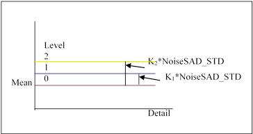

l&nbsp;&nbsp; <b><i>lut_Y_3d_1_Th:</i></b><b><i> </i></b>Weighting Lut for stage 1 3DNR on Y channel, the
x-axis is delta difference of neighbor pixel, the y-axis is weighting. As the
following figure, the larger the difference, the smaller the weighting. The
smaller the difference, the larger the weighting. Then, based on each weighting
to perform weighting sum.

&nbsp;

<b><i></i></b>

<b><i>&nbsp;</i></b>

l&nbsp;&nbsp; <b><i>lut_Y_3d_2_Th:</i></b><b><i> </i></b>Weighting Lut for Stage 2 3DNR on Y channel, the
x-axis is difference of the reference point between the previous frame and
current frame, the y-axis is weighting. As the following figure, those with
smaller difference might be static region, and set smaller weighting, the
output will close to the reference frame. On the contrast, those with larger
difference might be motion region, and set larger weighting, the output will
close to the current frame.

<b><i></i></b>

l&nbsp;&nbsp; <b><i>lut_Y_2d_Th:</i></b><b><i> </i></b>Weighting Lut of neighbor pixel for 2DNR on Y channel,
the x-axis is difference, the y-axis is weighting. As the following figure, the
larger the difference, the smaller the weighting. The smaller the difference,
the larger the weighting. Then, based on each weighting to perform weighting
sum.

<b><i>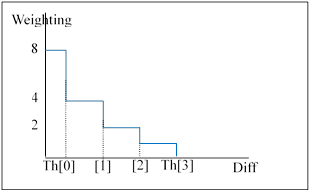</i></b>

l&nbsp;&nbsp; <b><i>lut_c_3d_Th:
</i></b>Suppression Level Lut
for 3DNR on Cb/Cr channel, the x-axis is the difference of the reference point
between the previous frame and current frame, the y-axis is the suppression
level. The concept is the same with “<b><i>LUT_Y_3d_2_Th</i></b>”.

l&nbsp;&nbsp; <b><i>lut_c_2d_Th:</i></b><b><i> </i></b>Weighting Lut of neighbor pixel for 2DNR on Cb/Cr
channel, the x-axis is difference, the y-axis is weighting. The concept is the
same with “<b><i>lut_Y_2d_Th</i></b>”.

<b>&nbsp;</b>

<h2 style='margin-left:0cm;text-indent:0cm'><a name="_Toc100570748">4.3&nbsp;&nbsp;&nbsp;&nbsp;&nbsp;&nbsp;&nbsp;
Setting Interface</a></h2>

<h3 style='margin-left:0cm;text-indent:0cm'><a name="_Toc100570749">4.3.1&nbsp;&nbsp;&nbsp;&nbsp;&nbsp;&nbsp;&nbsp;&nbsp;
Proc</a></h3>

<h5 style='margin-top:0cm;margin-right:6.0pt;margin-bottom:0cm;margin-left:
46.0pt;margin-bottom:.0001pt;text-indent:-22.0pt'>l&nbsp;
/proc/videograph/vpe/tmnr/dump_info</h5>

<b>[Description]</b>

Read all parameters of the current camera channel.

<b>[Command]</b>

<b>Write : Not support.</b>

<b>Read : </b>

cat /proc/videograph/vpe/tmnr/dump_info

<b>Output : </b>

<b></b>

<b>&nbsp;</b>

<h5 style='margin-top:0cm;margin-right:6.0pt;margin-bottom:0cm;margin-left:
46.0pt;margin-bottom:.0001pt;text-indent:-22.0pt'>l&nbsp;
/proc/videograph/vpe/tmnr/ch_en_status</h5>

<b>[Description]</b>

Read or write the enable status of the current
channel.

<b>[Command]</b>

<b>Write : </b>

<table class=MsoNormalTable border=1 cellspacing=0 cellpadding=0 width=625
 style='width:468.7pt;margin-left:26.7pt;border-collapse:collapse;border:none'>
 <tr>
  <td width=454 valign=top style='width:12.0cm;border:solid navy 1.0pt;
  border-bottom:none;background:#E5EAFF;padding:0cm 5.4pt 0cm 5.4pt'>
  
<b>proc command</b>

  </td>
  <td width=171 valign=top style='width:128.5pt;border-top:solid navy 1.0pt;
  border-left:none;border-bottom:none;border-right:solid navy 1.0pt;background:
  #E5EAFF;padding:0cm 5.4pt 0cm 5.4pt'>
  
<b>Target
  Parameter</b>

  </td>
 </tr>
 <tr>
  <td width=454 valign=top style='width:12.0cm;border:solid navy 1.0pt;
  border-top:none;padding:0cm 5.4pt 0cm 5.4pt'>
  
echo [luma_en] [chroma_en]
  [fcs_en] &gt; /proc/videograph/vpe/tmnr/ch_en_status

  </td>
  <td width=171 valign=top style='width:128.5pt;border-top:none;border-left:
  none;border-bottom:solid navy 1.0pt;border-right:solid navy 1.0pt;padding:
  0cm 5.4pt 0cm 5.4pt'>
  
<b>luma_dn_en</b>

  
<b>chroma_dn_en</b>

  
<b>tmnr_fcs_en</b>

  </td>
 </tr>
</table>

<b>Read : </b>

<b>cat /proc/videograph/vpe/tmnr/ch_en_status</b>

<b>Output : </b>

<b>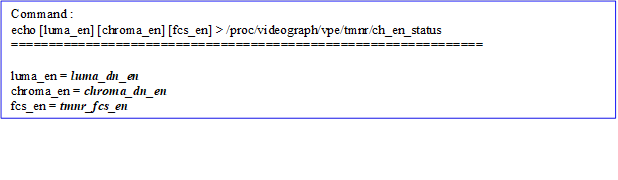</b>

<b>&nbsp;</b>

<h5 style='margin-top:0cm;margin-right:6.0pt;margin-bottom:0cm;margin-left:
46.0pt;margin-bottom:.0001pt;text-indent:-22.0pt'>l&nbsp;
/proc/videograph/vpe/tmnr/nr_strength</h5>

<b>[Description]</b>

Read or write the TMNR strength of the current
channel.

<b>[Command]</b>

<b>Write : </b>

<table class=MsoNormalTable border=1 cellspacing=0 cellpadding=0 width=625
 style='width:468.7pt;margin-left:26.7pt;border-collapse:collapse;border:none'>
 <tr>
  <td width=454 valign=top style='width:12.0cm;border:solid navy 1.0pt;
  border-bottom:none;background:#E5EAFF;padding:0cm 5.4pt 0cm 5.4pt'>
  
<b>proc command</b>

  </td>
  <td width=171 valign=top style='width:128.5pt;border-top:solid navy 1.0pt;
  border-left:none;border-bottom:none;border-right:solid navy 1.0pt;background:
  #E5EAFF;padding:0cm 5.4pt 0cm 5.4pt'>
  
<b>Target
  Parameter</b>

  </td>
 </tr>
 <tr>
  <td width=454 valign=top style='width:12.0cm;border:solid navy 1.0pt;
  border-top:none;padding:0cm 5.4pt 0cm 5.4pt'>
  
echo [y_3d_str]
  [y_2d_str] [c_3d_str] [c_2d_str] &gt; /proc/videograph/vpe/tmnr/nr_strength

  </td>
  <td width=171 valign=top style='width:128.5pt;border-top:none;border-left:
  none;border-bottom:solid navy 1.0pt;border-right:solid navy 1.0pt;padding:
  0cm 5.4pt 0cm 5.4pt'>
  
<b>nr_str_y_3d,
  nr_str_y_2d</b>

  
<b>nr_str_c_3d,
  nr_str_c_2d</b>

  </td>
 </tr>
</table>

<b>Read : </b>

<b>cat /proc/videograph/vpe/tmnr/nr_strength</b>

<b>Output : </b>

<b></b>

<h5 style='margin-top:0cm;margin-right:6.0pt;margin-bottom:0cm;margin-left:
46.0pt;margin-bottom:.0001pt;text-indent:-22.0pt'>l&nbsp;
/proc/videograph/vpe/tmnr/y_base</h5>

<b>[Description]</b>

Read or write the base noise level of TMNR of the
current channel.

<b>[Command]</b>

<b>Write : </b>

<table class=MsoNormalTable border=1 cellspacing=0 cellpadding=0 width=625
 style='width:468.7pt;margin-left:26.7pt;border-collapse:collapse;border:none'>
 <tr>
  <td width=454 valign=top style='width:12.0cm;border:solid navy 1.0pt;
  border-bottom:none;background:#E5EAFF;padding:0cm 5.4pt 0cm 5.4pt'>
  
<b>proc command</b>

  </td>
  <td width=171 valign=top style='width:128.5pt;border-top:solid navy 1.0pt;
  border-left:none;border-bottom:none;border-right:solid navy 1.0pt;background:
  #E5EAFF;padding:0cm 5.4pt 0cm 5.4pt'>
  
<b>Target
  Parameter</b>

  </td>
 </tr>
 <tr>
  <td width=454 valign=top style='width:12.0cm;border:solid navy 1.0pt;
  border-top:none;padding:0cm 5.4pt 0cm 5.4pt'>
  
echo [y_base0] [y_base1]………[y_base7]
  &gt; /proc/videograph/vpe/tmnr/y_base

  </td>
  <td width=171 valign=top style='width:128.5pt;border-top:none;border-left:
  none;border-bottom:solid navy 1.0pt;border-right:solid navy 1.0pt;padding:
  0cm 5.4pt 0cm 5.4pt'>
  
<b>y_base[0]~[7]</b>

  </td>
 </tr>
</table>

<b>Read : </b>

<b>cat /proc/videograph/vpe/tmnr/y_base</b>

<b>Output : </b>

<b></b>

<h5 style='margin-top:0cm;margin-right:6.0pt;margin-bottom:0cm;margin-left:
46.0pt;margin-bottom:.0001pt;text-indent:-22.0pt'>l&nbsp;
/proc/videograph/vpe/tmnr/motion_level_th</h5>

<b>[Description]</b>

Read or write the noise model parameters of TMNR of
the current channel.

<b>[Command]</b>

<b>Write : </b>

<table class=MsoNormalTable border=1 cellspacing=0 cellpadding=0 width=625
 style='width:468.7pt;margin-left:26.7pt;border-collapse:collapse;border:none'>
 <tr>
  <td width=454 valign=top style='width:12.0cm;border:solid navy 1.0pt;
  border-bottom:none;background:#E5EAFF;padding:0cm 5.4pt 0cm 5.4pt'>
  
<b>proc command</b>

  </td>
  <td width=171 valign=top style='width:128.5pt;border-top:solid navy 1.0pt;
  border-left:none;border-bottom:none;border-right:solid navy 1.0pt;background:
  #E5EAFF;padding:0cm 5.4pt 0cm 5.4pt'>
  
<b>Target
  Parameter</b>

  </td>
 </tr>
 <tr>
  <td width=454 valign=top style='width:12.0cm;border:solid navy 1.0pt;
  border-top:none;padding:0cm 5.4pt 0cm 5.4pt'>
  
echo [y_k1] [y_k2]
  [c_k1] [c_k2] &gt; /proc/videograph/vpe/tmnr/motion_level_th

  </td>
  <td width=171 valign=top style='width:128.5pt;border-top:none;border-left:
  none;border-bottom:solid navy 1.0pt;border-right:solid navy 1.0pt;padding:
  0cm 5.4pt 0cm 5.4pt'>
  
<b>motion_level_th_y_k1</b>

  
<b>motion_level_th_y_k2</b>

  
<b>motion_level_th_c_k1</b>

  
<b>motion_level_th_c_k2</b>

  </td>
 </tr>
</table>

<b>Read : </b>

<b>cat /proc/videograph/vpe/tmnr/motion_level_th</b>

<b>Output : </b>

<b></b>

<h5 style='margin-top:0cm;margin-right:6.0pt;margin-bottom:0cm;margin-left:
46.0pt;margin-bottom:.0001pt;text-indent:-22.0pt'>l&nbsp;
/proc/videograph/vpe/tmnr/y_coeffa</h5>

<b>[Description]</b>

Read or write the noise model parameters of TMNR of
the current channel.

<b>[Command]</b>

<b>Write : </b>

<table class=MsoNormalTable border=1 cellspacing=0 cellpadding=0 width=625
 style='width:468.7pt;margin-left:26.7pt;border-collapse:collapse;border:none'>
 <tr>
  <td width=454 valign=top style='width:12.0cm;border:solid navy 1.0pt;
  border-bottom:none;background:#E5EAFF;padding:0cm 5.4pt 0cm 5.4pt'>
  
<b>proc command</b>

  </td>
  <td width=171 valign=top style='width:128.5pt;border-top:solid navy 1.0pt;
  border-left:none;border-bottom:none;border-right:solid navy 1.0pt;background:
  #E5EAFF;padding:0cm 5.4pt 0cm 5.4pt'>
  
<b>Target
  Parameter</b>

  </td>
 </tr>
 <tr>
  <td width=454 valign=top style='width:12.0cm;border:solid navy 1.0pt;
  border-top:none;padding:0cm 5.4pt 0cm 5.4pt'>
  
echo [y_coeffa0]
  [y_coeffa1]………[y_coeffa7] &gt; /proc/videograph/vpe/tmnr/y_coeffa

  </td>
  <td width=171 valign=top style='width:128.5pt;border-top:none;border-left:
  none;border-bottom:solid navy 1.0pt;border-right:solid navy 1.0pt;padding:
  0cm 5.4pt 0cm 5.4pt'>
  
<b>y_coeffa[0]~[7]</b>

  </td>
 </tr>
</table>

<b>Read : </b>

<b>cat /proc/videograph/vpe/tmnr/y_coeffa</b>

<b>Output : </b>

<b></b>

<h5 style='margin-top:0cm;margin-right:6.0pt;margin-bottom:0cm;margin-left:
46.0pt;margin-bottom:.0001pt;text-indent:-22.0pt'>l&nbsp;
/proc/videograph/vpe/tmnr/y_coeffb</h5>

<b>[Description]</b>

Read or write the noise model parameters of TMNR of
the current channel.

<b>[Command]</b>

<b>Write : </b>

<table class=MsoNormalTable border=1 cellspacing=0 cellpadding=0 width=625
 style='width:468.7pt;margin-left:26.7pt;border-collapse:collapse;border:none'>
 <tr>
  <td width=454 valign=top style='width:12.0cm;border:solid navy 1.0pt;
  border-bottom:none;background:#E5EAFF;padding:0cm 5.4pt 0cm 5.4pt'>
  
<b>proc command</b>

  </td>
  <td width=171 valign=top style='width:128.5pt;border-top:solid navy 1.0pt;
  border-left:none;border-bottom:none;border-right:solid navy 1.0pt;background:
  #E5EAFF;padding:0cm 5.4pt 0cm 5.4pt'>
  
<b>Target
  Parameter</b>

  </td>
 </tr>
 <tr>
  <td width=454 valign=top style='width:12.0cm;border:solid navy 1.0pt;
  border-top:none;padding:0cm 5.4pt 0cm 5.4pt'>
  
echo [y_coeffb0]
  [y_coeffb1]………[y_coeffb7] &gt; /proc/videograph/vpe/tmnr/y_coeffb

  </td>
  <td width=171 valign=top style='width:128.5pt;border-top:none;border-left:
  none;border-bottom:solid navy 1.0pt;border-right:solid navy 1.0pt;padding:
  0cm 5.4pt 0cm 5.4pt'>
  
<b>y_coeffb[0]~[7]</b>

  </td>
 </tr>
</table>

<b>Read : </b>

<b>cat /proc/videograph/vpe/tmnr/y_coeffb</b>

<b>Output : </b>

<b></b>

<h5 style='margin-top:0cm;margin-right:6.0pt;margin-bottom:0cm;margin-left:
46.0pt;margin-bottom:.0001pt;text-indent:-22.0pt'>l&nbsp;
/proc/videograph/vpe/tmnr/y_std</h5>

<b>[Description]</b>

Read or write the noise model parameters of TMNR of
the current channel.

<b>[Command]</b>

<b>Write : </b>

<table class=MsoNormalTable border=1 cellspacing=0 cellpadding=0 width=625
 style='width:468.7pt;margin-left:26.7pt;border-collapse:collapse;border:none'>
 <tr>
  <td width=454 valign=top style='width:12.0cm;border:solid navy 1.0pt;
  border-bottom:none;background:#E5EAFF;padding:0cm 5.4pt 0cm 5.4pt'>
  
<b>proc command</b>

  </td>
  <td width=171 valign=top style='width:128.5pt;border-top:solid navy 1.0pt;
  border-left:none;border-bottom:none;border-right:solid navy 1.0pt;background:
  #E5EAFF;padding:0cm 5.4pt 0cm 5.4pt'>
  
<b>Target
  Parameter</b>

  </td>
 </tr>
 <tr>
  <td width=454 valign=top style='width:12.0cm;border:solid navy 1.0pt;
  border-top:none;padding:0cm 5.4pt 0cm 5.4pt'>
  
echo [y_std0] [y_std1]………[y_std7]
  &gt; /proc/videograph/vpe/tmnr/y_std

  </td>
  <td width=171 valign=top style='width:128.5pt;border-top:none;border-left:
  none;border-bottom:solid navy 1.0pt;border-right:solid navy 1.0pt;padding:
  0cm 5.4pt 0cm 5.4pt'>
  
<b>y_std[0]~[7]</b>

  </td>
 </tr>
</table>

<b>Read : </b>

<b>cat /proc/videograph/vpe/tmnr/y_std</b>

<b>Output : </b>

<b></b>

<h5 style='margin-top:0cm;margin-right:6.0pt;margin-bottom:0cm;margin-left:
46.0pt;margin-bottom:.0001pt;text-indent:-22.0pt'>l&nbsp;
/proc/videograph/vpe/tmnr/cb_mean</h5>

<b>[Description]</b>

Read or write the noise model parameters of TMNR of
the current channel.

<b>[Command]</b>

<b>Write : </b>

<table class=MsoNormalTable border=1 cellspacing=0 cellpadding=0 width=625
 style='width:468.7pt;margin-left:26.7pt;border-collapse:collapse;border:none'>
 <tr>
  <td width=454 valign=top style='width:12.0cm;border:solid navy 1.0pt;
  border-bottom:none;background:#E5EAFF;padding:0cm 5.4pt 0cm 5.4pt'>
  
<b>proc command</b>

  </td>
  <td width=171 valign=top style='width:128.5pt;border-top:solid navy 1.0pt;
  border-left:none;border-bottom:none;border-right:solid navy 1.0pt;background:
  #E5EAFF;padding:0cm 5.4pt 0cm 5.4pt'>
  
<b>Target
  Parameter</b>

  </td>
 </tr>
 <tr>
  <td width=454 valign=top style='width:12.0cm;border:solid navy 1.0pt;
  border-top:none;padding:0cm 5.4pt 0cm 5.4pt'>
  
echo [cb_mean0]
  [cb_mean1]………[cb_mean 7] &gt; /proc/videograph/vpe/tmnr/cb_mean

  </td>
  <td width=171 valign=top style='width:128.5pt;border-top:none;border-left:
  none;border-bottom:solid navy 1.0pt;border-right:solid navy 1.0pt;padding:
  0cm 5.4pt 0cm 5.4pt'>
  
<b>cb_mean[0]~[7]</b>

  </td>
 </tr>
</table>

<b>Read : </b>

<b>cat /proc/videograph/vpe/tmnr/cb_mean</b>

<b>Output : </b>

<b>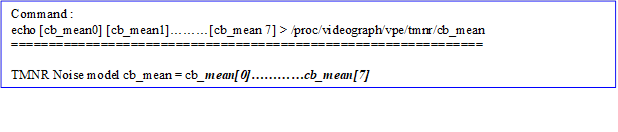</b>

<h5 style='margin-top:0cm;margin-right:6.0pt;margin-bottom:0cm;margin-left:
46.0pt;margin-bottom:.0001pt;text-indent:-22.0pt'>l&nbsp;
/proc/videograph/vpe/tmnr/cb_std</h5>

<b>[Description]</b>

Read or write the noise model parameters of TMNR of
the current channel.

<b>[Command]</b>

<b>Write : </b>

<table class=MsoNormalTable border=1 cellspacing=0 cellpadding=0 width=625
 style='width:468.7pt;margin-left:26.7pt;border-collapse:collapse;border:none'>
 <tr>
  <td width=454 valign=top style='width:12.0cm;border:solid navy 1.0pt;
  border-bottom:none;background:#E5EAFF;padding:0cm 5.4pt 0cm 5.4pt'>
  
<b>proc command</b>

  </td>
  <td width=171 valign=top style='width:128.5pt;border-top:solid navy 1.0pt;
  border-left:none;border-bottom:none;border-right:solid navy 1.0pt;background:
  #E5EAFF;padding:0cm 5.4pt 0cm 5.4pt'>
  
<b>Target
  Parameter</b>

  </td>
 </tr>
 <tr>
  <td width=454 valign=top style='width:12.0cm;border:solid navy 1.0pt;
  border-top:none;padding:0cm 5.4pt 0cm 5.4pt'>
  
echo [cb_std0] [cb_std1]………[cb_std7]
  &gt; /proc/videograph/vpe/tmnr/cb_std

  </td>
  <td width=171 valign=top style='width:128.5pt;border-top:none;border-left:
  none;border-bottom:solid navy 1.0pt;border-right:solid navy 1.0pt;padding:
  0cm 5.4pt 0cm 5.4pt'>
  
<b>cb_std[0]~[7]</b>

  </td>
 </tr>
</table>

<b>Read : </b>

<b>cat /proc/videograph/vpe/tmnr/cb_std</b>

<b>Output : </b>

<b></b>

<h5 style='margin-top:0cm;margin-right:6.0pt;margin-bottom:0cm;margin-left:
46.0pt;margin-bottom:.0001pt;text-indent:-22.0pt'>l&nbsp;
/proc/videograph/vpe/tmnr/cr_mean</h5>

<b>[Description]</b>

Read or write the noise model parameters of TMNR of
the current channel.

<b>[Command]</b>

<b>Write : </b>

<table class=MsoNormalTable border=1 cellspacing=0 cellpadding=0 width=625
 style='width:468.7pt;margin-left:26.7pt;border-collapse:collapse;border:none'>
 <tr>
  <td width=454 valign=top style='width:12.0cm;border:solid navy 1.0pt;
  border-bottom:none;background:#E5EAFF;padding:0cm 5.4pt 0cm 5.4pt'>
  
<b>proc command</b>

  </td>
  <td width=171 valign=top style='width:128.5pt;border-top:solid navy 1.0pt;
  border-left:none;border-bottom:none;border-right:solid navy 1.0pt;background:
  #E5EAFF;padding:0cm 5.4pt 0cm 5.4pt'>
  
<b>Target
  Parameter</b>

  </td>
 </tr>
 <tr>
  <td width=454 valign=top style='width:12.0cm;border:solid navy 1.0pt;
  border-top:none;padding:0cm 5.4pt 0cm 5.4pt'>
  
echo [cr_mean0]
  [cr_mean1]………[cr_std7] &gt; /proc/videograph/vpe/tmnr/cr_mean

  </td>
  <td width=171 valign=top style='width:128.5pt;border-top:none;border-left:
  none;border-bottom:solid navy 1.0pt;border-right:solid navy 1.0pt;padding:
  0cm 5.4pt 0cm 5.4pt'>
  
<b>cr_std[0]~[7]</b>

  </td>
 </tr>
</table>

<b>Read : </b>

<b>cat /proc/videograph/vpe/tmnr/cr_mean</b>

<b>Output : </b>

<b></b>

<h5 style='margin-top:0cm;margin-right:6.0pt;margin-bottom:0cm;margin-left:
46.0pt;margin-bottom:.0001pt;text-indent:-22.0pt'>l&nbsp;
/proc/videograph/vpe/tmnr/cr_std</h5>

<b>[Description]</b>

Read or write the noise model parameters of TMNR of
the current channel.

<b>[Command]</b>

<b>Write : </b>

<table class=MsoNormalTable border=1 cellspacing=0 cellpadding=0 width=625
 style='width:468.7pt;margin-left:26.7pt;border-collapse:collapse;border:none'>
 <tr>
  <td width=454 valign=top style='width:12.0cm;border:solid navy 1.0pt;
  border-bottom:none;background:#E5EAFF;padding:0cm 5.4pt 0cm 5.4pt'>
  
<b>proc command</b>

  </td>
  <td width=171 valign=top style='width:128.5pt;border-top:solid navy 1.0pt;
  border-left:none;border-bottom:none;border-right:solid navy 1.0pt;background:
  #E5EAFF;padding:0cm 5.4pt 0cm 5.4pt'>
  
<b>Target
  Parameter</b>

  </td>
 </tr>
 <tr>
  <td width=454 valign=top style='width:12.0cm;border:solid navy 1.0pt;
  border-top:none;padding:0cm 5.4pt 0cm 5.4pt'>
  
echo [cr_std0] [cr_std1]………[cr_std7]
  ] &gt; /proc/videograph/vpe/tmnr/cr_std

  </td>
  <td width=171 valign=top style='width:128.5pt;border-top:none;border-left:
  none;border-bottom:solid navy 1.0pt;border-right:solid navy 1.0pt;padding:
  0cm 5.4pt 0cm 5.4pt'>
  
<b>cr_std[0]~[7]</b>

  </td>
 </tr>
</table>

<b>Read : </b>

<b>cat /proc/videograph/vpe/tmnr/cr_std</b>

<b>Output : </b>

<b></b>

&nbsp;

<h5 style='margin-top:0cm;margin-right:6.0pt;margin-bottom:0cm;margin-left:
46.0pt;margin-bottom:.0001pt;text-indent:-22.0pt'>l&nbsp;
/proc/videograph/vpe/tmnr/lut_y_3d_1_th</h5>

<b>[Description]</b>

Read or write the 3D noise reduction parameters of
TMNR of the current channel.

<b>[Command]</b>

<b>Write : </b>

<table class=MsoNormalTable border=1 cellspacing=0 cellpadding=0 width=625
 style='width:468.7pt;margin-left:26.7pt;border-collapse:collapse;border:none'>
 <tr>
  <td width=454 valign=top style='width:12.0cm;border:solid navy 1.0pt;
  border-bottom:none;background:#E5EAFF;padding:0cm 5.4pt 0cm 5.4pt'>
  
<b>proc command</b>

  </td>
  <td width=171 valign=top style='width:128.5pt;border-top:solid navy 1.0pt;
  border-left:none;border-bottom:none;border-right:solid navy 1.0pt;background:
  #E5EAFF;padding:0cm 5.4pt 0cm 5.4pt'>
  
<b>Target
  Parameter</b>

  </td>
 </tr>
 <tr>
  <td width=454 valign=top style='width:12.0cm;border:solid navy 1.0pt;
  border-top:none;padding:0cm 5.4pt 0cm 5.4pt'>
  
echo [th0] [th1]
  [th2] [th3] &gt; /proc/videograph/vpe/tmnr/lut_y_3d_1_th

  </td>
  <td width=171 valign=top style='width:128.5pt;border-top:none;border-left:
  none;border-bottom:solid navy 1.0pt;border-right:solid navy 1.0pt;padding:
  0cm 5.4pt 0cm 5.4pt'>
  
<b>lut_y_3d_1_th[0]~[3]</b>

  </td>
 </tr>
</table>

<b>Read : </b>

<b>cat /proc/videograph/vpe/tmnr/lut_y_3d_1_th</b>

<b>Output : </b>

<b></b>

&nbsp;

<h5 style='margin-top:0cm;margin-right:6.0pt;margin-bottom:0cm;margin-left:
46.0pt;margin-bottom:.0001pt;text-indent:-22.0pt'>l&nbsp;
/proc/videograph/vpe/tmnr/lut_y_3d_2_th</h5>

<b>[Description]</b>

Read or write the 3D noise reduction parameters of
TMNR of the current channel.

<b>[Command]</b>

<b>Write : </b>

<table class=MsoNormalTable border=1 cellspacing=0 cellpadding=0 width=625
 style='width:468.7pt;margin-left:26.7pt;border-collapse:collapse;border:none'>
 <tr>
  <td width=454 valign=top style='width:12.0cm;border:solid navy 1.0pt;
  border-bottom:none;background:#E5EAFF;padding:0cm 5.4pt 0cm 5.4pt'>
  
<b>proc command</b>

  </td>
  <td width=171 valign=top style='width:128.5pt;border-top:solid navy 1.0pt;
  border-left:none;border-bottom:none;border-right:solid navy 1.0pt;background:
  #E5EAFF;padding:0cm 5.4pt 0cm 5.4pt'>
  
<b>Target
  Parameter</b>

  </td>
 </tr>
 <tr>
  <td width=454 valign=top style='width:12.0cm;border:solid navy 1.0pt;
  border-top:none;padding:0cm 5.4pt 0cm 5.4pt'>
  
echo [th0] [th1]
  [th2] [th3] &gt; /proc/videograph/vpe/tmnr/lut_y_3d_2_th

  </td>
  <td width=171 valign=top style='width:128.5pt;border-top:none;border-left:
  none;border-bottom:solid navy 1.0pt;border-right:solid navy 1.0pt;padding:
  0cm 5.4pt 0cm 5.4pt'>
  
<b>lut_y_3d_2_th[0]~[3]</b>

  </td>
 </tr>
</table>

<b>Read : </b>

<b>cat /proc/videograph/vpe/tmnr/lut_y_3d_2_th</b>

<b>Output : </b>

<b></b>

&nbsp;

<h5 style='margin-top:0cm;margin-right:6.0pt;margin-bottom:0cm;margin-left:
46.0pt;margin-bottom:.0001pt;text-indent:-22.0pt'>l&nbsp;
/proc/videograph/vpe/tmnr/lut_y_2d_th</h5>

<b>[Description]</b>

Read or write the 2D noise reduction parameters of
TMNR of the current channel.

<b>[Command]</b>

<b>Write : </b>

<table class=MsoNormalTable border=1 cellspacing=0 cellpadding=0 width=625
 style='width:468.7pt;margin-left:26.7pt;border-collapse:collapse;border:none'>
 <tr>
  <td width=454 valign=top style='width:12.0cm;border:solid navy 1.0pt;
  border-bottom:none;background:#E5EAFF;padding:0cm 5.4pt 0cm 5.4pt'>
  
<b>proc command</b>

  </td>
  <td width=171 valign=top style='width:128.5pt;border-top:solid navy 1.0pt;
  border-left:none;border-bottom:none;border-right:solid navy 1.0pt;background:
  #E5EAFF;padding:0cm 5.4pt 0cm 5.4pt'>
  
<b>Target
  Parameter</b>

  </td>
 </tr>
 <tr>
  <td width=454 valign=top style='width:12.0cm;border:solid navy 1.0pt;
  border-top:none;padding:0cm 5.4pt 0cm 5.4pt'>
  
echo [th0] [th1]
  [th2] [th3] &gt; /proc/videograph/vpe/tmnr/lut_y_2d_th

  </td>
  <td width=171 valign=top style='width:128.5pt;border-top:none;border-left:
  none;border-bottom:solid navy 1.0pt;border-right:solid navy 1.0pt;padding:
  0cm 5.4pt 0cm 5.4pt'>
  
<b>lut_y_2d_th[0]~[3]</b>

  </td>
 </tr>
</table>

<b>Read : </b>

cat /proc/videograph/vpe/tmnr/lut_y_2d_th

<b>Output : </b>

<b></b>

<h5 style='margin-top:0cm;margin-right:6.0pt;margin-bottom:0cm;margin-left:
46.0pt;margin-bottom:.0001pt;text-indent:-22.0pt'>l&nbsp;
/proc/videograph/vpe/tmnr/lut_c_3d_th</h5>

<b>[Description]</b>

Read or write the 3D noise reduction parameters of
3DNR of the current channel.

<b>[Command]</b>

<b>Write : </b>

<table class=MsoNormalTable border=1 cellspacing=0 cellpadding=0 width=625
 style='width:468.7pt;margin-left:26.7pt;border-collapse:collapse;border:none'>
 <tr>
  <td width=454 valign=top style='width:12.0cm;border:solid navy 1.0pt;
  border-bottom:none;background:#E5EAFF;padding:0cm 5.4pt 0cm 5.4pt'>
  
<b>proc command</b>

  </td>
  <td width=171 valign=top style='width:128.5pt;border-top:solid navy 1.0pt;
  border-left:none;border-bottom:none;border-right:solid navy 1.0pt;background:
  #E5EAFF;padding:0cm 5.4pt 0cm 5.4pt'>
  
<b>Target
  Parameter</b>

  </td>
 </tr>
 <tr>
  <td width=454 valign=top style='width:12.0cm;border:solid navy 1.0pt;
  border-top:none;padding:0cm 5.4pt 0cm 5.4pt'>
  
echo [th0] [th1]
  [th2] [th3] &gt; /proc/videograph/vpe/tmnr/lut_c_3d_th

  </td>
  <td width=171 valign=top style='width:128.5pt;border-top:none;border-left:
  none;border-bottom:solid navy 1.0pt;border-right:solid navy 1.0pt;padding:
  0cm 5.4pt 0cm 5.4pt'>
  
<b>lut_c_3d_th[0]~[3]</b>

  </td>
 </tr>
</table>

<b>Read : </b>

<b>cat /proc/videograph/vpe/tmnr/lut_c_3d_th</b>

<b>Output : </b>

<b></b>

<h5 style='margin-top:0cm;margin-right:6.0pt;margin-bottom:0cm;margin-left:
46.0pt;margin-bottom:.0001pt;text-indent:-22.0pt'>l&nbsp;
/proc/videograph/vpe/tmnr/lut_c_2d_th</h5>

<b>[Description]</b>

Read or write the 2D noise reduction parameters of
TMNR of the current channel.

<b>[Command]</b>

<b>Write : </b>

<table class=MsoNormalTable border=1 cellspacing=0 cellpadding=0 width=625
 style='width:468.7pt;margin-left:26.7pt;border-collapse:collapse;border:none'>
 <tr>
  <td width=454 valign=top style='width:12.0cm;border:solid navy 1.0pt;
  border-bottom:none;background:#E5EAFF;padding:0cm 5.4pt 0cm 5.4pt'>
  
<b>proc command</b>

  </td>
  <td width=171 valign=top style='width:128.5pt;border-top:solid navy 1.0pt;
  border-left:none;border-bottom:none;border-right:solid navy 1.0pt;background:
  #E5EAFF;padding:0cm 5.4pt 0cm 5.4pt'>
  
<b>Target
  Parameter</b>

  </td>
 </tr>
 <tr>
  <td width=454 valign=top style='width:12.0cm;border:solid navy 1.0pt;
  border-top:none;padding:0cm 5.4pt 0cm 5.4pt'>
  
echo [th0] [th1]
  [th2] [th3] &gt; /proc/videograph/vpe/tmnr/lut_c_2d_th

  </td>
  <td width=171 valign=top style='width:128.5pt;border-top:none;border-left:
  none;border-bottom:solid navy 1.0pt;border-right:solid navy 1.0pt;padding:
  0cm 5.4pt 0cm 5.4pt'>
  
<b>lut_c_2d_th[0]~[3]</b>

  </td>
 </tr>
</table>

<b>Read : </b>

<b>cat /proc/videograph/vpe/tmnr/lut_c_2d_th</b>

<b>Output : </b>

<b></b>

<b>&nbsp;</b>

<h5 style='margin-top:0cm;margin-right:6.0pt;margin-bottom:0cm;margin-left:
46.0pt;margin-bottom:.0001pt;text-indent:-22.0pt'>l&nbsp;
/proc/videograph/vpe/tmnr/fcs_str</h5>

<b>[Description]</b>

Read or write the false color suppression strength of
TMNR of the current channel.

<b>[Command]</b>

<b>Write : </b>

<table class=MsoNormalTable border=1 cellspacing=0 cellpadding=0 width=625
 style='width:468.7pt;margin-left:26.7pt;border-collapse:collapse;border:none'>
 <tr>
  <td width=454 valign=top style='width:12.0cm;border:solid navy 1.0pt;
  border-bottom:none;background:#E5EAFF;padding:0cm 5.4pt 0cm 5.4pt'>
  
<b>proc command</b>

  </td>
  <td width=171 valign=top style='width:128.5pt;border-top:solid navy 1.0pt;
  border-left:none;border-bottom:none;border-right:solid navy 1.0pt;background:
  #E5EAFF;padding:0cm 5.4pt 0cm 5.4pt'>
  
<b>Target
  Parameter</b>

  </td>
 </tr>
 <tr>
  <td width=454 valign=top style='width:12.0cm;border:solid navy 1.0pt;
  border-top:none;padding:0cm 5.4pt 0cm 5.4pt'>
  
echo [fcs_str (0~15)
  ] &gt; /proc/videograph/vpe/tmnr/fcs_str

  </td>
  <td width=171 valign=top style='width:128.5pt;border-top:none;border-left:
  none;border-bottom:solid navy 1.0pt;border-right:solid navy 1.0pt;padding:
  0cm 5.4pt 0cm 5.4pt'>
  
<b>tmnr_fcs_str</b>

  </td>
 </tr>
</table>

<b>Read : </b>

cat /proc/videograph/vpe/tmnr/fcs_str

<b>Output : </b>

<b>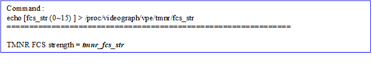</b>

<h5 style='margin-top:0cm;margin-right:6.0pt;margin-bottom:0cm;margin-left:
46.0pt;margin-bottom:.0001pt;text-indent:-22.0pt'>l&nbsp;
/proc/videograph/vpe/tmnr/fcs_th</h5>

<b>[Description]</b>

Read or write the threshold for determining whether it
is false color of TMNR of the current channel.

<b>[Command]</b>

<b>Write : </b>

<table class=MsoNormalTable border=1 cellspacing=0 cellpadding=0 width=625
 style='width:468.7pt;margin-left:26.7pt;border-collapse:collapse;border:none'>
 <tr>
  <td width=454 valign=top style='width:12.0cm;border:solid navy 1.0pt;
  border-bottom:none;background:#E5EAFF;padding:0cm 5.4pt 0cm 5.4pt'>
  
<b>proc command</b>

  </td>
  <td width=171 valign=top style='width:128.5pt;border-top:solid navy 1.0pt;
  border-left:none;border-bottom:none;border-right:solid navy 1.0pt;background:
  #E5EAFF;padding:0cm 5.4pt 0cm 5.4pt'>
  
<b>Target
  Parameter</b>

  </td>
 </tr>
 <tr>
  <td width=454 valign=top style='width:12.0cm;border:solid navy 1.0pt;
  border-top:none;padding:0cm 5.4pt 0cm 5.4pt'>
  
echo [fcs_th (0~255)
  ] &gt; /proc/videograph/vpe/tmnr/fcs_th

  </td>
  <td width=171 valign=top style='width:128.5pt;border-top:none;border-left:
  none;border-bottom:solid navy 1.0pt;border-right:solid navy 1.0pt;padding:
  0cm 5.4pt 0cm 5.4pt'>
  
<b>tmnr_fcs_th</b>

  </td>
 </tr>
</table>

<b>Read : </b>

cat /proc/videograph/vpe/tmnr/fcs_th

<b>Output : </b>

<b></b>

<b>&nbsp;</b>

<h5 style='margin-top:0cm;margin-right:6.0pt;margin-bottom:0cm;margin-left:
46.0pt;margin-bottom:.0001pt;text-indent:-22.0pt'>l&nbsp;
/proc/videograph/vpe/tmnr/motion_map</h5>

<b>[Description]</b>

Read or write the motion map of TMNR of the current
channel.

<b>[Command]</b>

<b>Write : </b>

<table class=MsoNormalTable border=1 cellspacing=0 cellpadding=0 width=625
 style='width:468.7pt;margin-left:26.7pt;border-collapse:collapse;border:none'>
 <tr>
  <td width=454 valign=top style='width:12.0cm;border:solid navy 1.0pt;
  border-bottom:none;background:#E5EAFF;padding:0cm 5.4pt 0cm 5.4pt'>
  
<b>proc command</b>

  </td>
  <td width=171 valign=top style='width:128.5pt;border-top:solid navy 1.0pt;
  border-left:none;border-bottom:none;border-right:solid navy 1.0pt;background:
  #E5EAFF;padding:0cm 5.4pt 0cm 5.4pt'>
  
<b>Target
  Parameter</b>

  </td>
 </tr>
 <tr>
  <td width=454 valign=top style='width:12.0cm;border:solid navy 1.0pt;
  border-top:none;padding:0cm 5.4pt 0cm 5.4pt'>
  
echo [map_en (0~1)]
  &gt; [map_idx] &gt; /proc/videograph/vpe/tmnr/motion_map

  
map_en:

  
0: display_motion_map_en = 0

  
1: display_motion_map_en = 1

  
map_idx :

  
&nbsp;0: motion_map_channel=Y

  
&nbsp;1: motion_map_channel=Cb 

  
2: motion_map_channel=Cr

  
3: motion_map_channel=FCS_Cb

  
4: motion_map_channel=FCS_Cr

  </td>
  <td width=171 valign=top style='width:128.5pt;border-top:none;border-left:
  none;border-bottom:solid navy 1.0pt;border-right:solid navy 1.0pt;padding:
  0cm 5.4pt 0cm 5.4pt'>
  
<b>display_motion_map_en,</b>

  
<b>motion_map_channel</b>

  </td>
 </tr>
</table>

<b>Read : </b>

cat /proc/videograph/vpe/tmnr/motion_map

<b>Output : </b>

<b></b>

<b>&nbsp;</b>

<h5 style='margin-top:0cm;margin-right:6.0pt;margin-bottom:0cm;margin-left:
46.0pt;margin-bottom:.0001pt;text-indent:-22.0pt'>l&nbsp;
/proc/videograph/vpe/tmnr/diff_blur_str</h5>

<b>[Description]</b>

Read or write the Diff. image blur strength of TMNR of
the current channel.

<b>[Command]</b>

<b>Write : </b>

<table class=MsoNormalTable border=1 cellspacing=0 cellpadding=0 width=625
 style='width:468.7pt;margin-left:26.7pt;border-collapse:collapse;border:none'>
 <tr>
  <td width=454 valign=top style='width:12.0cm;border:solid navy 1.0pt;
  border-bottom:none;background:#E5EAFF;padding:0cm 5.4pt 0cm 5.4pt'>
  
<b>proc command</b>

  </td>
  <td width=171 valign=top style='width:128.5pt;border-top:solid navy 1.0pt;
  border-left:none;border-bottom:none;border-right:solid navy 1.0pt;background:
  #E5EAFF;padding:0cm 5.4pt 0cm 5.4pt'>
  
<b>Target Parameter</b>

  </td>
 </tr>
 <tr>
  <td width=454 valign=top style='width:12.0cm;border:solid navy 1.0pt;
  border-top:none;padding:0cm 5.4pt 0cm 5.4pt'>
  
echo [str (0~2)]
  &gt; /proc/videograph/vpe/tmnr/diff_blur_str

  
str: blur
  strength 0 ~2

  </td>
  <td width=171 valign=top style='width:128.5pt;border-top:none;border-left:
  none;border-bottom:solid navy 1.0pt;border-right:solid navy 1.0pt;padding:
  0cm 5.4pt 0cm 5.4pt'>
  
<b>blur_str_y</b>

  </td>
 </tr>
</table>

<b>Read : </b>

cat /proc/videograph/vpe/tmnr/diff_blur_str

<b>Output : </b>

<b></b>

<b>&nbsp;</b>

<h5 style='margin-top:0cm;margin-right:6.0pt;margin-bottom:0cm;margin-left:
46.0pt;margin-bottom:.0001pt;text-indent:-22.0pt'>l&nbsp;
/proc/videograph/vpe/tmnr/avoid_residue_th</h5>

<b>[Description]</b>

<a
name="OLE_LINK11">Read or write the Diff.
image blur strength of TMNR of the current channel.</a>

<b>[Command]</b>

<b>Write : </b>

<table class=MsoNormalTable border=1 cellspacing=0 cellpadding=0 width=625
 style='width:468.7pt;margin-left:26.7pt;border-collapse:collapse;border:none'>
 <tr>
  <td width=454 valign=top style='width:12.0cm;border:solid navy 1.0pt;
  border-bottom:none;background:#E5EAFF;padding:0cm 5.4pt 0cm 5.4pt'>
  
<b>proc command</b>

  </td>
  <td width=171 valign=top style='width:128.5pt;border-top:solid navy 1.0pt;
  border-left:none;border-bottom:none;border-right:solid navy 1.0pt;background:
  #E5EAFF;padding:0cm 5.4pt 0cm 5.4pt'>
  
<a name="OLE_LINK15"><b>Target Parameter</b></a>

  </td>
 </tr>
 <tr>
  <td width=454 valign=top style='width:12.0cm;border:solid navy 1.0pt;
  border-top:none;padding:0cm 5.4pt 0cm 5.4pt'>
  
echo [avoid_residue_th_y
  (1~4)] [avoid_residue_th_c (1~4)] &gt; /proc/videograph/vpe/tmnr/avoid_residue_th

  </td>
  <td width=171 valign=top style='width:128.5pt;border-top:none;border-left:
  none;border-bottom:solid navy 1.0pt;border-right:solid navy 1.0pt;padding:
  0cm 5.4pt 0cm 5.4pt'>
  
<b>avoid_residue_th_y,
  avoid_residue_th_c</b>

  </td>
 </tr>
</table>

<b>Read : </b>

cat /proc/videograph/vpe/tmnr/avoid_residue_th

<b>Output : </b>

<b></b>

<b>&nbsp;</b>

<h5 style='margin-top:0cm;margin-right:6.0pt;margin-bottom:0cm;margin-left:
46.0pt;margin-bottom:.0001pt;text-indent:-22.0pt'>l&nbsp;
/proc/videograph/vpe/tmnr/dithering</h5>

<b>[Description]</b>

&nbsp;&nbsp;&nbsp;&nbsp;&nbsp;&nbsp;&nbsp; <a name="OLE_LINK13">Read or write the dithering relative parameters of the current channel.</a>

<b>[Command]</b>

<b>Write : </b>

<table class=MsoNormalTable border=1 cellspacing=0 cellpadding=0 width=625
 style='width:468.7pt;margin-left:26.7pt;border-collapse:collapse;border:none'>
 <tr>
  <td width=454 valign=top style='width:12.0cm;border:solid navy 1.0pt;
  border-bottom:none;background:#E5EAFF;padding:0cm 5.4pt 0cm 5.4pt'>
  
<b>proc command</b>

  </td>
  <td width=171 valign=top style='width:128.5pt;border-top:solid navy 1.0pt;
  border-left:none;border-bottom:none;border-right:solid navy 1.0pt;background:
  #E5EAFF;padding:0cm 5.4pt 0cm 5.4pt'>
  
<b>Target
  Parameter</b>

  </td>
 </tr>
 <tr>
  <td width=454 valign=top style='width:12.0cm;border:solid navy 1.0pt;
  border-top:none;padding:0cm 5.4pt 0cm 5.4pt'>
  
echo [dithering_en
  (0~1)] [dithering_bit_y (0~7)] [dithering_bit_u (0~7)] [dithering_bit_v (0~7)]
  &gt; /proc/videograph/vpe/tmnr/dithering

  </td>
  <td width=171 valign=top style='width:128.5pt;border-top:none;border-left:
  none;border-bottom:solid navy 1.0pt;border-right:solid navy 1.0pt;padding:
  0cm 5.4pt 0cm 5.4pt'>
  
<b>dithering_en</b>

  
<b>dithering_bit_y</b>

  
<b>dithering_bit_u</b>

  
<b>dithering_bit_v</b>

  </td>
 </tr>
</table>

<b>Read : </b>

cat /proc/videograph/vpe/tmnr/ dithering

<b>Output : </b>

<b></b>

<b>&nbsp;</b>

<h5 style='margin-top:0cm;margin-right:6.0pt;margin-bottom:0cm;margin-left:
46.0pt;margin-bottom:.0001pt;text-indent:-22.0pt'>l&nbsp;
/proc/videograph/vpe/tmnr/err_compensate</h5>

<b>[Description]</b>

Read or write the err_compensate parameter of the
current channel.

<b>[Command]</b>

<b>Write : </b>

<table class=MsoNormalTable border=1 cellspacing=0 cellpadding=0 width=625
 style='width:468.7pt;margin-left:26.7pt;border-collapse:collapse;border:none'>
 <tr>
  <td width=454 valign=top style='width:12.0cm;border:solid navy 1.0pt;
  border-bottom:none;background:#E5EAFF;padding:0cm 5.4pt 0cm 5.4pt'>
  
<b>proc command</b>

  </td>
  <td width=171 valign=top style='width:128.5pt;border-top:solid navy 1.0pt;
  border-left:none;border-bottom:none;border-right:solid navy 1.0pt;background:
  #E5EAFF;padding:0cm 5.4pt 0cm 5.4pt'>
  
<b>Target
  Parameter</b>

  </td>
 </tr>
 <tr>
  <td width=454 valign=top style='width:12.0cm;border:solid navy 1.0pt;
  border-top:none;padding:0cm 5.4pt 0cm 5.4pt'>
  
echo [err_compensate (0~1)] &gt; /proc/videograph/vpe/tmnr/err_compensate

  </td>
  <td width=171 valign=top style='width:128.5pt;border-top:none;border-left:
  none;border-bottom:solid navy 1.0pt;border-right:solid navy 1.0pt;padding:
  0cm 5.4pt 0cm 5.4pt'>
  
<b>err_compensate</b>

  </td>
 </tr>
</table>

<b>Read : </b>

cat /proc/videograph/vpe/tmnr/err_compensate

<b>Output : </b>

<b>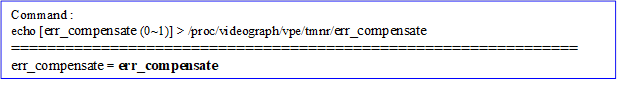</b>

&nbsp;

<h3 style='margin-left:0cm;text-indent:0cm'><a name="_Toc100570750">4.3.2&nbsp;&nbsp;&nbsp;&nbsp;&nbsp;&nbsp;&nbsp;&nbsp;
Vendor API</a></h3>

<b>[Description]</b>

Get and set the TMNR
parameters corresponding to current path_id.

<b>[Command]</b>

&nbsp;&nbsp;&nbsp;&nbsp;&nbsp;&nbsp;&nbsp; <b>Get</b><b>：</b>

HD_RESULT vendor_video_get(HD_PATH_ID path_id, VENDOR_VIDEO_TMNR_CTRL,
VENDOR_VIDEO_PARAM_TMNR_EXT *p_param);

&nbsp;&nbsp;&nbsp;&nbsp;&nbsp;&nbsp;&nbsp; <b>Set</b><b>：</b>

HD_RESULT vendor_video_set(HD_PATH_ID path_id, VENDOR_VIDEO_DN_2D,
VENDOR_VIDEO_PARAM_TMNR_EXT *p_param);

<b>[Definition]</b>

<b></b>

&nbsp;

&nbsp;

<b> 
</b>

<h1 style='margin-left:0cm;text-indent:0cm'><a name="_Toc100570751">5&nbsp;&nbsp;&nbsp;&nbsp;&nbsp;&nbsp;&nbsp;&nbsp;&nbsp;
Sharpen (SHP)</a></h1>

This is texture enhancement module.

<h2 style='margin-left:0cm;text-indent:0cm'><a name="_Toc100570752">5.1&nbsp;&nbsp;&nbsp;&nbsp;&nbsp;&nbsp;&nbsp;
Overview</a></h2>

This algorithm
adopts inverse gamma information and after gamma information to perform texture
enhancement, respectively, to improve the enhancement strength not smooth
problem of the bright/dark region. Besides, it adopts 3x3 and 5x5 filter to
enhance thin edge and thick edge, repectively, to take care of the detail and
contrast of image. Calculating “Edge Weight” to determine this is detail region
or flat region(thinner edge) and automatically adjusting weighting of detail
enhancement result and flat region enhancement result to take care of texture
enhancement and avoid noise enhancement. The “Halo clip” is used to control the
overshootong phenomenon caused by edge enhancement.

The major flow please refer to the following
figure:

&nbsp;

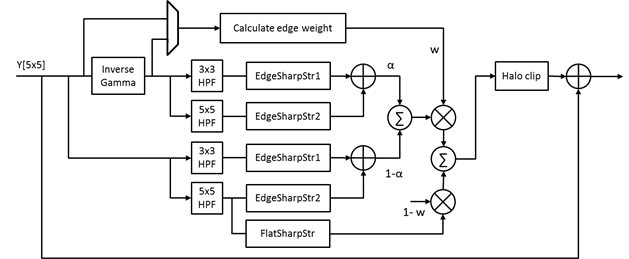

Parameter
Description

<a name="_Toc100570783">Table </a>5&#8209;1 SHP Parameter List

<table class=MsoNormalTable border=0 cellspacing=0 cellpadding=0 width=652
 style='width:489.05pt;margin-left:5.4pt;border-collapse:collapse'>
 <tr>
  <td width=142 valign=top style='width:106.4pt;border-top:solid #1D1DFF 1.5pt;
  border-left:none;border-bottom:solid #1D1DFF 1.5pt;border-right:none;
  background:#E5EAFF;padding:0cm 5.4pt 0cm 5.4pt'>
  
<b>Parameter</b>

  </td>
  <td width=96 valign=top style='width:71.95pt;border-top:solid #1D1DFF 1.5pt;
  border-left:none;border-bottom:solid #1D1DFF 1.5pt;border-right:none;
  background:#E5EAFF;padding:0cm 5.4pt 0cm 5.4pt'>
  
<b>Range</b>

  </td>
  <td width=113 valign=top style='width:85.0pt;border-top:solid #1D1DFF 1.5pt;
  border-left:none;border-bottom:solid #1D1DFF 1.5pt;border-right:none;
  background:#E5EAFF;padding:0cm 5.4pt 0cm 5.4pt'>
  
<b>Def</b>

  </td>
  <td width=301 valign=top style='width:225.7pt;border-top:solid #1D1DFF 1.5pt;
  border-left:none;border-bottom:solid #1D1DFF 1.5pt;border-right:none;
  background:#E5EAFF;padding:0cm 5.4pt 0cm 5.4pt'>
  
<b>Description</b>

  </td>
 </tr>
 <tr>
  <td width=142 style='width:106.4pt;border:none;border-bottom:solid #1D1DFF 1.0pt;
  background:white;padding:0cm 5.4pt 0cm 5.4pt'>
  
<b><i>sharpen_en</i></b>

  </td>
  <td width=96 style='width:71.95pt;border:none;border-bottom:solid #1D1DFF 1.0pt;
  background:white;padding:0cm 5.4pt 0cm 5.4pt'>
  
0~1

  </td>
  <td width=113 style='width:85.0pt;border:none;border-bottom:solid #1D1DFF 1.0pt;
  background:white;padding:0cm 5.4pt 0cm 5.4pt'>
  
0

  </td>
  <td width=301 valign=top style='width:225.7pt;border:none;border-bottom:solid #1D1DFF 1.0pt;
  background:white;padding:0cm 5.4pt 0cm 5.4pt'>
  
Edge enhance ON/OFF

  </td>
 </tr>
 <tr>
  <td width=142 style='width:106.4pt;border:none;border-bottom:solid #1D1DFF 1.0pt;
  background:white;padding:0cm 5.4pt 0cm 5.4pt'>
  
<b><i>edge_weight_src_sel</i></b>

  </td>
  <td width=96 style='width:71.95pt;border:none;border-bottom:solid #1D1DFF 1.0pt;
  background:white;padding:0cm 5.4pt 0cm 5.4pt'>
  
0~1

  </td>
  <td width=113 style='width:85.0pt;border:none;border-bottom:solid #1D1DFF 1.0pt;
  background:white;padding:0cm 5.4pt 0cm 5.4pt'>
  
0

  </td>
  <td width=301 valign=top style='width:225.7pt;border:none;border-bottom:solid #1D1DFF 1.0pt;
  background:white;padding:0cm 5.4pt 0cm 5.4pt'>
  
Select the image source to calculate “Edge Weight ”.
  

  
0: after gamma, 1: inverse gamma.

  
Please
  refer to description.

  </td>
 </tr>
 <tr>
  <td width=142 style='width:106.4pt;border:none;border-bottom:solid #1D1DFF 1.0pt;
  background:white;padding:0cm 5.4pt 0cm 5.4pt'>
  
<b><i>edge_weight_th</i></b>

  </td>
  <td width=96 style='width:71.95pt;border:none;border-bottom:solid #1D1DFF 1.0pt;
  background:white;padding:0cm 5.4pt 0cm 5.4pt'>
  
0~255

  </td>
  <td width=113 style='width:85.0pt;border:none;border-bottom:solid #1D1DFF 1.0pt;
  background:white;padding:0cm 5.4pt 0cm 5.4pt'>
  
2

  </td>
  <td width=301 valign=top style='width:225.7pt;border:none;border-bottom:solid #1D1DFF 1.0pt;
  background:white;padding:0cm 5.4pt 0cm 5.4pt'>
  
Threshold for calculating “Edge Weight”, those
  smaller than threshold will be considered as flat region, and the output all adopt
  flat region enhancement result.

  </td>
 </tr>
 <tr>
  <td width=142 style='width:106.4pt;border:none;border-bottom:solid #1D1DFF 1.0pt;
  background:white;padding:0cm 5.4pt 0cm 5.4pt'>
  
<b><i>edge_weight_gain</i></b>

  </td>
  <td width=96 style='width:71.95pt;border:none;border-bottom:solid #1D1DFF 1.0pt;
  background:white;padding:0cm 5.4pt 0cm 5.4pt'>
  
0~255

  </td>
  <td width=113 style='width:85.0pt;border:none;border-bottom:solid #1D1DFF 1.0pt;
  background:white;padding:0cm 5.4pt 0cm 5.4pt'>
  
175

  </td>
  <td width=301 valign=top style='width:225.7pt;border:none;border-bottom:solid #1D1DFF 1.0pt;
  background:white;padding:0cm 5.4pt 0cm 5.4pt'>
  
Adjust the weighting of detail enhancement result
  and flat region(thin edge) enhancement result. Based on the setting of “noise_level+noise_curve”
  to adjust EdgeWeight for different pixel brightness. The larger the Edge
  Weight, the larger weighting of detail enhancement result, repersenting the edge
  enhance is more stronger(more noise). In the contrast, the smaller the edge
  weight, the larger weighting of flat region enhancement result, representing
  the edge enhancement is less stronger.

  </td>
 </tr>
 <tr>
  <td width=142 style='width:106.4pt;border:none;border-bottom:solid #1D1DFF 1.0pt;
  background:white;padding:0cm 5.4pt 0cm 5.4pt'>
  
<b><i>noise_level</i></b>

  </td>
  <td width=96 style='width:71.95pt;border:none;border-bottom:solid #1D1DFF 1.0pt;
  background:white;padding:0cm 5.4pt 0cm 5.4pt'>
  
0~255

  </td>
  <td width=113 style='width:85.0pt;border:none;border-bottom:solid #1D1DFF 1.0pt;
  background:white;padding:0cm 5.4pt 0cm 5.4pt'>
  
25

  </td>
  <td width=301 valign=top style='width:225.7pt;border:none;border-bottom:solid #1D1DFF 1.0pt;
  background:white;padding:0cm 5.4pt 0cm 5.4pt'>
  
Please refer to advance description.

  </td>
 </tr>
 <tr>
  <td width=142 style='width:106.4pt;border:none;border-bottom:solid #1D1DFF 1.0pt;
  background:white;padding:0cm 5.4pt 0cm 5.4pt'>
  
<b><i>noise_curve[17]</i></b>

  </td>
  <td width=96 style='width:71.95pt;border:none;border-bottom:solid #1D1DFF 1.0pt;
  background:white;padding:0cm 5.4pt 0cm 5.4pt'>
  
0~255

  </td>
  <td width=113 style='width:85.0pt;border:none;border-bottom:solid #1D1DFF 1.0pt;
  background:white;padding:0cm 5.4pt 0cm 5.4pt'>
  
{50, 50, 50, 48, 47, 44, 39, 38, 37, 36,
  35, 35, 35, 35, 35, 35, 35}

  </td>
  <td width=301 valign=top style='width:225.7pt;border:none;border-bottom:solid #1D1DFF 1.0pt;
  background:white;padding:0cm 5.4pt 0cm 5.4pt'>
  
Please refer to advance description.

  </td>
 </tr>
 <tr>
  <td width=142 style='width:106.4pt;border:none;border-bottom:solid #1D1DFF 1.0pt;
  background:white;padding:0cm 5.4pt 0cm 5.4pt'>
  
<b><i>blend_inv_gamma</i></b>

  </td>
  <td width=96 style='width:71.95pt;border:none;border-bottom:solid #1D1DFF 1.0pt;
  background:white;padding:0cm 5.4pt 0cm 5.4pt'>
  
0~128

  </td>
  <td width=113 style='width:85.0pt;border:none;border-bottom:solid #1D1DFF 1.0pt;
  background:white;padding:0cm 5.4pt 0cm 5.4pt'>
  
64

  </td>
  <td width=301 valign=top style='width:225.7pt;border:none;border-bottom:solid #1D1DFF 1.0pt;
  background:white;padding:0cm 5.4pt 0cm 5.4pt'>
  
The blending weight of inverse gamma edge
  enhancement result and after gamma edge enhancement result. This parameter is
  equal to adjust the ratio of edge enhancement between bright region and dark
  region, let the edge enhancement level of bright region and dark region is
  more even. The larger the value, the stronger strength of bright region
  enhancement, but the weaker strength of dark region enhancement. 

  </td>
 </tr>
 <tr>
  <td width=142 style='width:106.4pt;border:none;border-bottom:solid #1D1DFF 1.0pt;
  background:white;padding:0cm 5.4pt 0cm 5.4pt'>
  
<b><i>edge_sharp_str1</i></b>

  </td>
  <td width=96 style='width:71.95pt;border:none;border-bottom:solid #1D1DFF 1.0pt;
  background:white;padding:0cm 5.4pt 0cm 5.4pt'>
  
0~255

  </td>
  <td width=113 style='width:85.0pt;border:none;border-bottom:solid #1D1DFF 1.0pt;
  background:white;padding:0cm 5.4pt 0cm 5.4pt'>
  
25

  </td>
  <td width=301 valign=top style='width:225.7pt;border:none;border-bottom:solid #1D1DFF 1.0pt;
  background:white;padding:0cm 5.4pt 0cm 5.4pt'>
  
Adjust the strength of thin edge enhancement

  </td>
 </tr>
 <tr>
  <td width=142 style='width:106.4pt;border:none;border-bottom:solid #1D1DFF 1.0pt;
  background:white;padding:0cm 5.4pt 0cm 5.4pt'>
  
<b><i>edge_sharp_str2</i></b>

  </td>
  <td width=96 style='width:71.95pt;border:none;border-bottom:solid #1D1DFF 1.0pt;
  background:white;padding:0cm 5.4pt 0cm 5.4pt'>
  
0~255

  </td>
  <td width=113 style='width:85.0pt;border:none;border-bottom:solid #1D1DFF 1.0pt;
  background:white;padding:0cm 5.4pt 0cm 5.4pt'>
  
10

  </td>
  <td width=301 valign=top style='width:225.7pt;border:none;border-bottom:solid #1D1DFF 1.0pt;
  background:white;padding:0cm 5.4pt 0cm 5.4pt'>
  
Adjust the strength of thick edge enhancement

  </td>
 </tr>
 <tr>
  <td width=142 style='width:106.4pt;border:none;border-bottom:solid #1D1DFF 1.0pt;
  background:white;padding:0cm 5.4pt 0cm 5.4pt'>
  
<b><i>flat_sharp_str</i></b>

  </td>
  <td width=96 style='width:71.95pt;border:none;border-bottom:solid #1D1DFF 1.0pt;
  background:white;padding:0cm 5.4pt 0cm 5.4pt'>
  
0~255

  </td>
  <td width=113 style='width:85.0pt;border:none;border-bottom:solid #1D1DFF 1.0pt;
  background:white;padding:0cm 5.4pt 0cm 5.4pt'>
  
0

  </td>
  <td width=301 valign=top style='width:225.7pt;border:none;border-bottom:solid #1D1DFF 1.0pt;
  background:white;padding:0cm 5.4pt 0cm 5.4pt'>
  
Adjust the strength of flat region(thin detail)
  enhancement.

  </td>
 </tr>
 <tr>
  <td width=142 style='width:106.4pt;border:none;border-bottom:solid #1D1DFF 1.0pt;
  background:white;padding:0cm 5.4pt 0cm 5.4pt'>
  
<b><i>coring_th</i></b>

  </td>
  <td width=96 style='width:71.95pt;border:none;border-bottom:solid #1D1DFF 1.0pt;
  background:white;padding:0cm 5.4pt 0cm 5.4pt'>
  
0~255

  </td>
  <td width=113 style='width:85.0pt;border:none;border-bottom:solid #1D1DFF 1.0pt;
  background:white;padding:0cm 5.4pt 0cm 5.4pt'>
  
0

  </td>
  <td width=301 valign=top style='width:225.7pt;border:none;border-bottom:solid #1D1DFF 1.0pt;
  background:white;padding:0cm 5.4pt 0cm 5.4pt'>
  
Threshold for determing whether to perform
  enhancement. For those edge value smaller than threshold, they will not
  perform edge enhancement to avoid enhancing noise.

  </td>
 </tr>
 <tr>
  <td width=142 style='width:106.4pt;border:none;border-bottom:solid #1D1DFF 1.0pt;
  background:white;padding:0cm 5.4pt 0cm 5.4pt'>
  
<b><i>bright_halo_clip</i></b>

  </td>
  <td width=96 style='width:71.95pt;border:none;border-bottom:solid #1D1DFF 1.0pt;
  background:white;padding:0cm 5.4pt 0cm 5.4pt'>
  
0~128

  </td>
  <td width=113 style='width:85.0pt;border:none;border-bottom:solid #1D1DFF 1.0pt;
  background:white;padding:0cm 5.4pt 0cm 5.4pt'>
  
32

  </td>
  <td width=301 valign=top style='width:225.7pt;border:none;border-bottom:solid #1D1DFF 1.0pt;
  background:white;padding:0cm 5.4pt 0cm 5.4pt'>
  
Remove
  bright halo edge caused by edge enhancement. The smaller the “bright_halo_clip”,
  the less bright halo edge, but the sharpness might be decreased.

  </td>
 </tr>
 <tr>
  <td width=142 style='width:106.4pt;border:none;border-bottom:solid #1D1DFF 1.0pt;
  background:white;padding:0cm 5.4pt 0cm 5.4pt'>
  
<b><i>dark_halo_clip</i></b>

  </td>
  <td width=96 style='width:71.95pt;border:none;border-bottom:solid #1D1DFF 1.0pt;
  background:white;padding:0cm 5.4pt 0cm 5.4pt'>
  
0~128

  </td>
  <td width=113 style='width:85.0pt;border:none;border-bottom:solid #1D1DFF 1.0pt;
  background:white;padding:0cm 5.4pt 0cm 5.4pt'>
  
96

  </td>
  <td width=301 valign=top style='width:225.7pt;border:none;border-bottom:solid #1D1DFF 1.0pt;
  background:white;padding:0cm 5.4pt 0cm 5.4pt'>
  
Remove dark halo edge caused by edge enhancement.
  The smaller the “dark_halo_clip”, the less dark halo edge, but the sharpness
  might be decreased.

  </td>
 </tr>
</table>

<b>&nbsp;</b>

<b>Advance description</b>

l&nbsp;&nbsp; <b><i>noise_level,
noise_curve[17]:</i></b>

noise_level = noise_level
+ NoiseofPixel, wherein the NoiseofPixel is the y-axis of noise_curve.

The noise_curve may
depend on the pixel brightness to set the noise size, respectively. Normally,
human eyes are less sensitive to the noise in high bright region; thus, it can
set small value to increase the edge enhancement strength to enhance detail. It
is recommend to use the following default value. If user want to adjust the
noise size at all Y range(0-255), it just needs to adjust noise_level.

&nbsp;

 

Default value:

<b><i>edge_weight_src_sel</i></b> =0

noise_curve[17] ={50,50,50,48,47,44,39,38,37,36,35,35,35,35,35,35,35}

&eth;&nbsp; More strengthen on
detail in bright region to avoid enhancing noise.

<b><i>edge_weight_src_sel</i></b> =1

noise_curve[17] = {0, 38, 46, 51, 54, 57, 59, 61, 62,
62, 62, 62, 62, 62, 62, 62, 62}

&eth;&nbsp; More strengthen on
detail in dark region to enhance thin detail, but the noise in dark region will
be enhanced, either.

&nbsp;

<h2 style='margin-left:0cm;text-indent:0cm'><a name="_Toc100570753">5.2&nbsp;&nbsp;&nbsp;&nbsp;&nbsp;&nbsp;&nbsp;
Setting Interface</a></h2>

<h3 style='margin-left:0cm;text-indent:0cm'><a name="_Toc100570754">5.2.1&nbsp;&nbsp;&nbsp;&nbsp;&nbsp;&nbsp; Proc</a></h3>

<h5 style='margin-top:0cm;margin-right:6.0pt;margin-bottom:0cm;margin-left:
46.0pt;margin-bottom:.0001pt;text-indent:-22.0pt'>l&nbsp;
/proc/videograph/vpe/sharpen/dump_info</h5>

<b>[Description]</b>

Read all Sharpen parameters of the current camera
channel.

<b>[Command]</b>

<b>Write : Not support.</b>

Read : cat /proc/videograph/vpe/sharpen/dump_info

<b></b>

<b>&nbsp;</b>

<h5 style='margin-top:0cm;margin-right:6.0pt;margin-bottom:0cm;margin-left:
46.0pt;margin-bottom:.0001pt;text-indent:-22.0pt'>l&nbsp;
/proc/videograph/vpe/sharpen/sharp_en</h5>

<b>[Description]</b>

Read or write the enable status of the cuurent
channel.

<b>[Command]</b>

<b>Write : </b>

<table class=MsoNormalTable border=1 cellspacing=0 cellpadding=0 width=625
 style='width:468.7pt;margin-left:26.7pt;border-collapse:collapse;border:none'>
 <tr>
  <td width=454 valign=top style='width:12.0cm;border:solid navy 1.0pt;
  border-bottom:none;background:#E5EAFF;padding:0cm 5.4pt 0cm 5.4pt'>
  
<b>proc command</b>

  </td>
  <td width=171 valign=top style='width:128.5pt;border-top:solid navy 1.0pt;
  border-left:none;border-bottom:none;border-right:solid navy 1.0pt;background:
  #E5EAFF;padding:0cm 5.4pt 0cm 5.4pt'>
  
<b>Target
  Parameter</b>

  </td>
 </tr>
 <tr>
  <td width=454 valign=top style='width:12.0cm;border:solid navy 1.0pt;
  border-top:none;padding:0cm 5.4pt 0cm 5.4pt'>
  
echo [ sharp_en
  (0~1) ] &gt; /proc/videograph/vpe/sharpen/sharp_en

  </td>
  <td width=171 valign=top style='width:128.5pt;border-top:none;border-left:
  none;border-bottom:solid navy 1.0pt;border-right:solid navy 1.0pt;padding:
  0cm 5.4pt 0cm 5.4pt'>
  
<b>sharpen_en</b>

  </td>
 </tr>
</table>

<b>Read : </b>

<b>cat /proc/videograph/vpe/sharpen/shp_en</b>

<b>Output : </b>

<b></b>

<h5 style='margin-top:0cm;margin-right:6.0pt;margin-bottom:0cm;margin-left:
46.0pt;margin-bottom:.0001pt;text-indent:-22.0pt'>l&nbsp;
/proc/videograph/vpe/sharpen/edge_weight_src_sel</h5>

<b>[Description]</b>

Read or write the sharpen parameter of the current
channel.

<b>[Command]</b>

<b>Write : </b>

<table class=MsoNormalTable border=1 cellspacing=0 cellpadding=0 width=625
 style='width:468.7pt;margin-left:26.7pt;border-collapse:collapse;border:none'>
 <tr>
  <td width=454 valign=top style='width:12.0cm;border:solid navy 1.0pt;
  border-bottom:none;background:#E5EAFF;padding:0cm 5.4pt 0cm 5.4pt'>
  
<b>proc command</b>

  </td>
  <td width=171 valign=top style='width:128.5pt;border-top:solid navy 1.0pt;
  border-left:none;border-bottom:none;border-right:solid navy 1.0pt;background:
  #E5EAFF;padding:0cm 5.4pt 0cm 5.4pt'>
  
<b>Target
  Parameter</b>

  </td>
 </tr>
 <tr>
  <td width=454 valign=top style='width:12.0cm;border:solid navy 1.0pt;
  border-top:none;padding:0cm 5.4pt 0cm 5.4pt'>
  
echo [src_sel (0
  ~ 1) ] &gt; /proc/videograph/vpe/sharpen/edge_weight_src_sel

  </td>
  <td width=171 valign=top style='width:128.5pt;border-top:none;border-left:
  none;border-bottom:solid navy 1.0pt;border-right:solid navy 1.0pt;padding:
  0cm 5.4pt 0cm 5.4pt'>
  
<b>edge_weight_src_sel</b>

  </td>
 </tr>
</table>

<b>Read : </b>

cat /proc/videograph/vpe/sharpen/edge_weight_src_sel

<b>Output : </b>

<b></b>

&nbsp;

<h5 style='margin-top:0cm;margin-right:6.0pt;margin-bottom:0cm;margin-left:
46.0pt;margin-bottom:.0001pt;text-indent:-22.0pt'>l&nbsp;
/proc/videograph/vpe/sharpen/edge_weigt_gain</h5>

<b>[Description]</b>

Read or write the sharpen parameter of the current
channel.

<b>[Command]</b>

<b>Write : </b>

<table class=MsoNormalTable border=1 cellspacing=0 cellpadding=0 width=625
 style='width:468.7pt;margin-left:26.7pt;border-collapse:collapse;border:none'>
 <tr>
  <td width=454 valign=top style='width:12.0cm;border:solid navy 1.0pt;
  border-bottom:none;background:#E5EAFF;padding:0cm 5.4pt 0cm 5.4pt'>
  
<b>proc command</b>

  </td>
  <td width=171 valign=top style='width:128.5pt;border-top:solid navy 1.0pt;
  border-left:none;border-bottom:none;border-right:solid navy 1.0pt;background:
  #E5EAFF;padding:0cm 5.4pt 0cm 5.4pt'>
  
<b>Target
  Parameter</b>

  </td>
 </tr>
 <tr>
  <td width=454 valign=top style='width:12.0cm;border:solid navy 1.0pt;
  border-top:none;padding:0cm 5.4pt 0cm 5.4pt'>
  
echo [gain
  (0~255) ] &gt; /proc/videograph/vpe/sharpen/edge_weight_gain

  </td>
  <td width=171 valign=top style='width:128.5pt;border-top:none;border-left:
  none;border-bottom:solid navy 1.0pt;border-right:solid navy 1.0pt;padding:
  0cm 5.4pt 0cm 5.4pt'>
  
<b><i>edge_weight_gain</i></b>

  </td>
 </tr>
</table>

<b>Read : </b>

cat /proc/videograph/vpe/sharpen/edge_weight_gain

<b>Output : </b>

<b>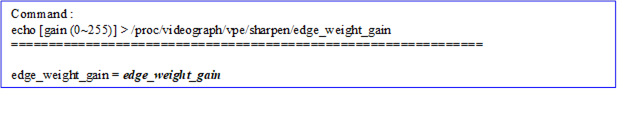</b>

<h5 style='margin-top:0cm;margin-right:6.0pt;margin-bottom:0cm;margin-left:
46.0pt;margin-bottom:.0001pt;text-indent:-22.0pt'>l&nbsp;
/proc/videograph/vpe/sharpen/edge_weight_th</h5>

<b>[Description]</b>

Read or write the sharpen parameter of the current
channel.

<b>[Command]</b>

<b>Write : </b>

<table class=MsoNormalTable border=1 cellspacing=0 cellpadding=0 width=625
 style='width:468.7pt;margin-left:26.7pt;border-collapse:collapse;border:none'>
 <tr>
  <td width=454 valign=top style='width:12.0cm;border:solid navy 1.0pt;
  border-bottom:none;background:#E5EAFF;padding:0cm 5.4pt 0cm 5.4pt'>
  
<b>proc command</b>

  </td>
  <td width=171 valign=top style='width:128.5pt;border-top:solid navy 1.0pt;
  border-left:none;border-bottom:none;border-right:solid navy 1.0pt;background:
  #E5EAFF;padding:0cm 5.4pt 0cm 5.4pt'>
  
<b>Target
  Parameter</b>

  </td>
 </tr>
 <tr>
  <td width=454 valign=top style='width:12.0cm;border:solid navy 1.0pt;
  border-top:none;padding:0cm 5.4pt 0cm 5.4pt'>
  
echo [th
  (0~255) ] &gt; /proc/videograph/vpe/sharpen/edge_weight_th

  </td>
  <td width=171 valign=top style='width:128.5pt;border-top:none;border-left:
  none;border-bottom:solid navy 1.0pt;border-right:solid navy 1.0pt;padding:
  0cm 5.4pt 0cm 5.4pt'>
  
<b><i>edge_weight_th</i></b>

  </td>
 </tr>
</table>

<b>Read : </b>

cat /proc/videograph/vpe/sharpen/edge_weight_th

<b>Output : </b>

<b></b>

<h5 style='margin-top:0cm;margin-right:6.0pt;margin-bottom:0cm;margin-left:
46.0pt;margin-bottom:.0001pt;text-indent:-22.0pt'>l&nbsp;
/proc/videograph/vpe/sharpen/blend_inv_gamma</h5>

<b>[Description]</b>

Read or write the sharpen parameter of the current
channel.

<b>[Command]</b>

<b>Write : </b>

<table class=MsoNormalTable border=1 cellspacing=0 cellpadding=0 width=625
 style='width:468.7pt;margin-left:26.7pt;border-collapse:collapse;border:none'>
 <tr>
  <td width=454 valign=top style='width:12.0cm;border:solid navy 1.0pt;
  border-bottom:none;background:#E5EAFF;padding:0cm 5.4pt 0cm 5.4pt'>
  
<b>proc command</b>

  </td>
  <td width=171 valign=top style='width:128.5pt;border-top:solid navy 1.0pt;
  border-left:none;border-bottom:none;border-right:solid navy 1.0pt;background:
  #E5EAFF;padding:0cm 5.4pt 0cm 5.4pt'>
  
<b>Target
  Parameter</b>

  </td>
 </tr>
 <tr>
  <td width=454 valign=top style='width:12.0cm;border:solid navy 1.0pt;
  border-top:none;padding:0cm 5.4pt 0cm 5.4pt'>
  
echo [th
  (0~128) ] &gt; /proc/videograph/vpe/sharpen/blend_inv_gamma

  </td>
  <td width=171 valign=top style='width:128.5pt;border-top:none;border-left:
  none;border-bottom:solid navy 1.0pt;border-right:solid navy 1.0pt;padding:
  0cm 5.4pt 0cm 5.4pt'>
  
<b><i>blend_inv_gamma</i></b>

  </td>
 </tr>
</table>

<b>Read : </b>

cat /proc/videograph/vpe/sharpen/blend_inv_gamma

<b>Output : </b>

<b></b>

<h5 style='margin-top:0cm;margin-right:6.0pt;margin-bottom:0cm;margin-left:
46.0pt;margin-bottom:.0001pt;text-indent:-22.0pt'>l&nbsp;
/proc/videograph/vpe/sharpen/edge_sharp_str</h5>

<b>[Description]</b>

Read or write the sharpen parameter of the current
channel.

<b>[Command]</b>

<b>Write : </b>

<table class=MsoNormalTable border=1 cellspacing=0 cellpadding=0 width=625
 style='width:468.7pt;margin-left:26.7pt;border-collapse:collapse;border:none'>
 <tr>
  <td width=454 valign=top style='width:12.0cm;border:solid navy 1.0pt;
  border-bottom:none;background:#E5EAFF;padding:0cm 5.4pt 0cm 5.4pt'>
  
<b>proc command</b>

  </td>
  <td width=171 valign=top style='width:128.5pt;border-top:solid navy 1.0pt;
  border-left:none;border-bottom:none;border-right:solid navy 1.0pt;background:
  #E5EAFF;padding:0cm 5.4pt 0cm 5.4pt'>
  
<b>Target
  Parameter</b>

  </td>
 </tr>
 <tr>
  <td width=454 valign=top style='width:12.0cm;border:solid navy 1.0pt;
  border-top:none;padding:0cm 5.4pt 0cm 5.4pt'>
  
echo [str1
  (0~255)] [str2 (0~255)] &gt; /proc/videograph/vpe/sharpen/edge_sharp_str

  </td>
  <td width=171 valign=top style='width:128.5pt;border-top:none;border-left:
  none;border-bottom:solid navy 1.0pt;border-right:solid navy 1.0pt;padding:
  0cm 5.4pt 0cm 5.4pt'>
  
<b><i>edge_sharp_str1</i></b>

  
<b><i>edge_sharp_str2</i></b>

  </td>
 </tr>
</table>

<b>Read : </b>

cat /proc/videograph/vpe/sharpen/edge_sharp_str

<b>Output : </b>

<b>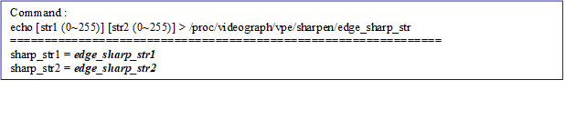</b>

<h5 style='margin-top:0cm;margin-right:6.0pt;margin-bottom:0cm;margin-left:
46.0pt;margin-bottom:.0001pt;text-indent:-22.0pt'>l&nbsp;
/proc/videograph/vpe/sharpen/flat_sharp_str</h5>

<b>[Description]</b>

Read or write the sharpen parameter of the current
channel.

<b>[Command]</b>

<b>Write : </b>

<table class=MsoNormalTable border=1 cellspacing=0 cellpadding=0 width=625
 style='width:468.7pt;margin-left:26.7pt;border-collapse:collapse;border:none'>
 <tr>
  <td width=454 valign=top style='width:12.0cm;border:solid navy 1.0pt;
  border-bottom:none;background:#E5EAFF;padding:0cm 5.4pt 0cm 5.4pt'>
  
<b>proc command</b>

  </td>
  <td width=171 valign=top style='width:128.5pt;border-top:solid navy 1.0pt;
  border-left:none;border-bottom:none;border-right:solid navy 1.0pt;background:
  #E5EAFF;padding:0cm 5.4pt 0cm 5.4pt'>
  
<b>Target
  Parameter</b>

  </td>
 </tr>
 <tr>
  <td width=454 valign=top style='width:12.0cm;border:solid navy 1.0pt;
  border-top:none;padding:0cm 5.4pt 0cm 5.4pt'>
  
echo [str
  (0~255)] &gt; /proc/videograph/vpe/sharpen/flat_sharp_str

  </td>
  <td width=171 valign=top style='width:128.5pt;border-top:none;border-left:
  none;border-bottom:solid navy 1.0pt;border-right:solid navy 1.0pt;padding:
  0cm 5.4pt 0cm 5.4pt'>
  
<b><i>flat_sharp_str</i></b>

  </td>
 </tr>
</table>

<b>Read : </b>

cat /proc/videograph/vpe/sharpen/flat_sharp_str

<b>Output : </b>

<b></b>

<h5 style='margin-top:0cm;margin-right:6.0pt;margin-bottom:0cm;margin-left:
46.0pt;margin-bottom:.0001pt;text-indent:-22.0pt'>l&nbsp;
/proc/videograph/vpe/sharpen/coring_th</h5>

<b>[Description]</b>

Read or write the sharpen parameter of the current
channel.

<b>[Command]</b>

<b>Write : </b>

<table class=MsoNormalTable border=1 cellspacing=0 cellpadding=0 width=625
 style='width:468.7pt;margin-left:26.7pt;border-collapse:collapse;border:none'>
 <tr>
  <td width=454 valign=top style='width:12.0cm;border:solid navy 1.0pt;
  border-bottom:none;background:#E5EAFF;padding:0cm 5.4pt 0cm 5.4pt'>
  
<b>proc command</b>

  </td>
  <td width=171 valign=top style='width:128.5pt;border-top:solid navy 1.0pt;
  border-left:none;border-bottom:none;border-right:solid navy 1.0pt;background:
  #E5EAFF;padding:0cm 5.4pt 0cm 5.4pt'>
  
<b>Target
  Parameter</b>

  </td>
 </tr>
 <tr>
  <td width=454 valign=top style='width:12.0cm;border:solid navy 1.0pt;
  border-top:none;padding:0cm 5.4pt 0cm 5.4pt'>
  
echo [coring_th
  (0~255)] &gt; /proc/videograph/vpe/sharpen/coring_th

  </td>
  <td width=171 valign=top style='width:128.5pt;border-top:none;border-left:
  none;border-bottom:solid navy 1.0pt;border-right:solid navy 1.0pt;padding:
  0cm 5.4pt 0cm 5.4pt'>
  
<b><i>coring_th</i></b>

  </td>
 </tr>
</table>

<b>Read : </b>

cat /proc/videograph/vpe/sharpen/coring_th

<b>Output : </b>

<b>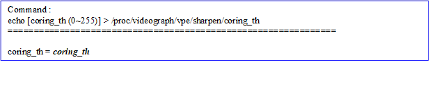</b>

<h5 style='margin-top:0cm;margin-right:6.0pt;margin-bottom:0cm;margin-left:
46.0pt;margin-bottom:.0001pt;text-indent:-22.0pt'>l&nbsp;
/proc/videograph/vpe/sharpen/halo_clip</h5>

<b>[Description]</b>

Read or write the sharpen parameter of the current
channel.

<b>[Command]</b>

<b>Write : </b>

<table class=MsoNormalTable border=1 cellspacing=0 cellpadding=0 width=625
 style='width:468.7pt;margin-left:26.7pt;border-collapse:collapse;border:none'>
 <tr>
  <td width=454 valign=top style='width:12.0cm;border:solid navy 1.0pt;
  border-bottom:none;background:#E5EAFF;padding:0cm 5.4pt 0cm 5.4pt'>
  
<b>proc command</b>

  </td>
  <td width=171 valign=top style='width:128.5pt;border-top:solid navy 1.0pt;
  border-left:none;border-bottom:none;border-right:solid navy 1.0pt;background:
  #E5EAFF;padding:0cm 5.4pt 0cm 5.4pt'>
  
<b>Target
  Parameter</b>

  </td>
 </tr>
 <tr>
  <td width=454 valign=top style='width:12.0cm;border:solid navy 1.0pt;
  border-top:none;padding:0cm 5.4pt 0cm 5.4pt'>
  
echo [bright_clip
  (0~128)] [dark_clip(0~128)] &gt; /proc/videograph/vpe/sharpen/halo_clip

  </td>
  <td width=171 valign=top style='width:128.5pt;border-top:none;border-left:
  none;border-bottom:solid navy 1.0pt;border-right:solid navy 1.0pt;padding:
  0cm 5.4pt 0cm 5.4pt'>
  
<b><i>bright_halo_clip</i></b>

  
<b><i>drak_halo_clip</i></b>

  </td>
 </tr>
</table>

<b>Read : </b>

cat /proc/videograph/vpe/sharpen/halo_clip

<b>Output : </b>

<b>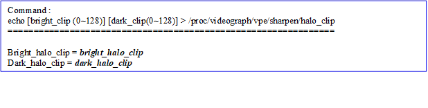</b>

<h5 style='margin-top:0cm;margin-right:6.0pt;margin-bottom:0cm;margin-left:
46.0pt;margin-bottom:.0001pt;text-indent:-22.0pt'>l&nbsp;
/proc/videograph/vpe/sharpen/noise_curve</h5>

<b>[Description]</b>

Read or write the sharpen parameter of the current
channel.

<b>[Command]</b>

<b>Write :</b>

<table class=MsoNormalTable border=1 cellspacing=0 cellpadding=0 width=625
 style='width:468.7pt;margin-left:26.7pt;border-collapse:collapse;border:none'>
 <tr>
  <td width=454 valign=top style='width:12.0cm;border:solid navy 1.0pt;
  border-bottom:none;background:#E5EAFF;padding:0cm 5.4pt 0cm 5.4pt'>
  
<b>proc command</b>

  </td>
  <td width=171 valign=top style='width:128.5pt;border-top:solid navy 1.0pt;
  border-left:none;border-bottom:none;border-right:solid navy 1.0pt;background:
  #E5EAFF;padding:0cm 5.4pt 0cm 5.4pt'>
  
<b>Target
  Parameter</b>

  </td>
 </tr>
 <tr>
  <td width=454 valign=top style='width:12.0cm;border:solid navy 1.0pt;
  border-top:none;padding:0cm 5.4pt 0cm 5.4pt'>
  
echo [noise_curve[0]
  (0~255)]…. [noise_curve [16] (0~255)] &gt; /proc/videograph/vpe/sharpen/noise_curve

  </td>
  <td width=171 valign=top style='width:128.5pt;border-top:none;border-left:
  none;border-bottom:solid navy 1.0pt;border-right:solid navy 1.0pt;padding:
  0cm 5.4pt 0cm 5.4pt'>
  
<b><i>noise_curve[17]</i></b>

  </td>
 </tr>
</table>

<b>Read : </b>

cat /proc/videograph/vpe/sharpen/noise_curve

<b>Output : </b>

<b>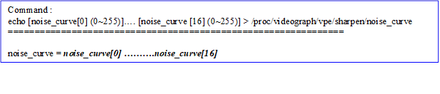</b>

&nbsp;

<h3 style='margin-left:0cm;text-indent:0cm'><a name="_Toc100570755">5.2.2&nbsp;&nbsp;&nbsp;&nbsp;&nbsp;&nbsp;&nbsp;&nbsp;
Vendor API</a></h3>

<b>[Description]</b>

Get and set the
sharpen parameters corresponding to current path_id.

<b>[Command]</b>

&nbsp;&nbsp;&nbsp;&nbsp;&nbsp;&nbsp;&nbsp; <b>Get</b><b>：</b>

HD_RESULT vendor_video_get(HD_PATH_ID path_id, VENDOR_VIDEO_SHARP,
VENDOR_VIDEO_PARAM_SHARP *p_param);

&nbsp;&nbsp;&nbsp;&nbsp;&nbsp;&nbsp;&nbsp; <b>Set</b><b>：</b>

HD_RESULT vendor_video_set(HD_PATH_ID path_id, VENDOR_VIDEO_SHARP,
VENDOR_VIDEO_PARAM_SHARP *p_param);

<b>[</b><b>定義</b><b>]</b>

<b></b>

&nbsp;

<h1 style='margin-left:0cm;text-indent:0cm'>6&nbsp;&nbsp;&nbsp;&nbsp;&nbsp;&nbsp;&nbsp;&nbsp;&nbsp;
Edge Smoothing (ES)</h1>

<a name="OLE_LINK19">This module is edge
smoothing. The main function is to eliminate aliasing in the picture to improve
the smoothness of the picture.</a>

<h2 style='margin-left:0cm;text-indent:0cm'><a name="_Toc100570757">6.1&nbsp;&nbsp;&nbsp;&nbsp;&nbsp;&nbsp;&nbsp;
Overview</a></h2>

<a name="OLE_LINK21">The characteristics of this algorithm are to effectively smooth the
edges of the input image, correct the jaggedness in the edge area of the input
image, and avoid the Sharpen module to enhance the degree of jaggedness in the
image edge again. The algorithm divides the input image into edge area and
detail area, calculates the direction of the edge on the edge area, and then
performs LPF convolution adaptively along the edge direction to smooth the edge
of the image. The Edge Mask can be adjusted to avoid high-frequency areas being
blurred due to smoothing.</a>

Please refer to the following figure for
the main process:

&nbsp;

<h2 style='margin-left:0cm;text-indent:0cm'><a name="_Toc100570758">6.2&nbsp;&nbsp;&nbsp;&nbsp;&nbsp;&nbsp;&nbsp;
Parameter Description</a></h2>

Table 6&#8209;1 ES Parameter List

<table class=MsoNormalTable border=0 cellspacing=0 cellpadding=0 width=652
 style='width:489.05pt;margin-left:5.4pt;border-collapse:collapse'>
 <tr>
  <td width=195 valign=top style='width:146.6pt;border-top:solid #1D1DFF 1.5pt;
  border-left:none;border-bottom:solid #1D1DFF 1.5pt;border-right:none;
  background:#E5EAFF;padding:0cm 5.4pt 0cm 5.4pt'>
  
<b>Parameter</b>

  </td>
  <td width=89 valign=top style='width:66.4pt;border-top:solid #1D1DFF 1.5pt;
  border-left:none;border-bottom:solid #1D1DFF 1.5pt;border-right:none;
  background:#E5EAFF;padding:0cm 5.4pt 0cm 5.4pt'>
  
<b>Range</b>

  </td>
  <td width=100 valign=top style='width:75.0pt;border-top:solid #1D1DFF 1.5pt;
  border-left:none;border-bottom:solid #1D1DFF 1.5pt;border-right:none;
  background:#E5EAFF;padding:0cm 5.4pt 0cm 5.4pt'>
  
<b>Def</b>

  </td>
  <td width=268 valign=top style='width:201.05pt;border-top:solid #1D1DFF 1.5pt;
  border-left:none;border-bottom:solid #1D1DFF 1.5pt;border-right:none;
  background:#E5EAFF;padding:0cm 5.4pt 0cm 5.4pt'>
  
<b>Description</b>

  </td>
 </tr>
 <tr>
  <td width=195 style='width:146.6pt;border:none;border-bottom:solid #1D1DFF 1.0pt;
  background:white;padding:0cm 5.4pt 0cm 5.4pt'>
  
<b><i>edge_smooth_en</i></b>

  </td>
  <td width=89 style='width:66.4pt;border:none;border-bottom:solid #1D1DFF 1.0pt;
  background:white;padding:0cm 5.4pt 0cm 5.4pt'>
  
0~1

  </td>
  <td width=100 style='width:75.0pt;border:none;border-bottom:solid #1D1DFF 1.0pt;
  background:white;padding:0cm 5.4pt 0cm 5.4pt'>
  
0

  </td>
  <td width=268 valign=top style='width:201.05pt;border:none;border-bottom:
  solid #1D1DFF 1.0pt;background:white;padding:0cm 5.4pt 0cm 5.4pt'>
  
Edge smooth enable

  </td>
 </tr>
 <tr>
  <td width=195 style='width:146.6pt;border:none;border-bottom:solid #1D1DFF 1.0pt;
  background:white;padding:0cm 5.4pt 0cm 5.4pt'>
  
<b><i>edge_smooth_y_edeng_th_lo</i></b>

  </td>
  <td width=89 style='width:66.4pt;border:none;border-bottom:solid #1D1DFF 1.0pt;
  background:white;padding:0cm 5.4pt 0cm 5.4pt'>
  
0~255

  </td>
  <td width=100 style='width:75.0pt;border:none;border-bottom:solid #1D1DFF 1.0pt;
  background:white;padding:0cm 5.4pt 0cm 5.4pt'>
  
10

  </td>
  <td width=268 valign=top style='width:201.05pt;border:none;border-bottom:
  solid #1D1DFF 1.0pt;background:white;padding:0cm 5.4pt 0cm 5.4pt'>
  
Adjust the strength
  threshold of detail areas in the picture

  
Please refer to the
  advanced instructions

  </td>
 </tr>
 <tr>
  <td width=195 style='width:146.6pt;border:none;border-bottom:solid #1D1DFF 1.0pt;
  background:white;padding:0cm 5.4pt 0cm 5.4pt'>
  
<b><i>edge_smooth_y_edeng_th_hi</i></b>

  </td>
  <td width=89 style='width:66.4pt;border:none;border-bottom:solid #1D1DFF 1.0pt;
  background:white;padding:0cm 5.4pt 0cm 5.4pt'>
  
0~255

  </td>
  <td width=100 style='width:75.0pt;border:none;border-bottom:solid #1D1DFF 1.0pt;
  background:white;padding:0cm 5.4pt 0cm 5.4pt'>
  
70

  </td>
  <td width=268 valign=top style='width:201.05pt;border:none;border-bottom:
  solid #1D1DFF 1.0pt;background:white;padding:0cm 5.4pt 0cm 5.4pt'>
  
Adjust the strength
  threshold of the edge area in the picture

  
Please
  refer to the advanced instructions

  </td>
 </tr>
 <tr>
  <td width=195 style='width:146.6pt;border:none;border-bottom:solid #1D1DFF 1.0pt;
  background:white;padding:0cm 5.4pt 0cm 5.4pt'>
  
<b><i>edge_smooth_y_ew_lo</i></b>

  </td>
  <td width=89 style='width:66.4pt;border:none;border-bottom:solid #1D1DFF 1.0pt;
  background:white;padding:0cm 5.4pt 0cm 5.4pt'>
  
0~255

  </td>
  <td width=100 style='width:75.0pt;border:none;border-bottom:solid #1D1DFF 1.0pt;
  background:white;padding:0cm 5.4pt 0cm 5.4pt'>
  
2

  </td>
  <td width=268 valign=top style='width:201.05pt;border:none;border-bottom:
  solid #1D1DFF 1.0pt;background:white;padding:0cm 5.4pt 0cm 5.4pt'>
  
Adjust the smoothing strength
  weight of detail areas in the picture

  
Please refer to the
  advanced instructions

  </td>
 </tr>
 <tr>
  <td width=195 style='width:146.6pt;border:none;border-bottom:solid #1D1DFF 1.0pt;
  background:white;padding:0cm 5.4pt 0cm 5.4pt'>
  
<b><i>edge_smooth_y_ew_hi</i></b>

  </td>
  <td width=89 style='width:66.4pt;border:none;border-bottom:solid #1D1DFF 1.0pt;
  background:white;padding:0cm 5.4pt 0cm 5.4pt'>
  
0~255

  </td>
  <td width=100 style='width:75.0pt;border:none;border-bottom:solid #1D1DFF 1.0pt;
  background:white;padding:0cm 5.4pt 0cm 5.4pt'>
  
32

  </td>
  <td width=268 valign=top style='width:201.05pt;border:none;border-bottom:
  solid #1D1DFF 1.0pt;background:white;padding:0cm 5.4pt 0cm 5.4pt'>
  
Adjust
  the suppression threshold for the smoothing of high-frequency areas in the
  picture. The larger the value, the easier it is to determine and smooth the high-frequency
  area. Therefore, the larger the value, the smoother the high-frequency area,
  and the smaller the value, the clearer the high-frequency area

  </td>
 </tr>
 <tr>
  <td width=195 style='width:146.6pt;border:none;border-bottom:solid #1D1DFF 1.0pt;
  background:white;padding:0cm 5.4pt 0cm 5.4pt'>
  
<b><i>edge_smooth_y_edi_th</i></b>

  </td>
  <td width=89 style='width:66.4pt;border:none;border-bottom:solid #1D1DFF 1.0pt;
  background:white;padding:0cm 5.4pt 0cm 5.4pt'>
  
0~63

  </td>
  <td width=100 style='width:75.0pt;border:none;border-bottom:solid #1D1DFF 1.0pt;
  background:white;padding:0cm 5.4pt 0cm 5.4pt'>
  
31

  </td>
  <td width=268 valign=top style='width:201.05pt;border:none;border-bottom:
  solid #1D1DFF 1.0pt;background:white;padding:0cm 5.4pt 0cm 5.4pt'>
  
Suppresses the strength of
  smoothing in the high-frequency region. The larger the value, the stronger
  the smoothing in the high-frequency region.

  </td>
 </tr>
 <tr>
  <td width=195 style='width:146.6pt;border:none;border-bottom:solid #1D1DFF 1.0pt;
  background:white;padding:0cm 5.4pt 0cm 5.4pt'>
  
<b><i>edge_smooth_y_ds_str</i></b>

  </td>
  <td width=89 style='width:66.4pt;border:none;border-bottom:solid #1D1DFF 1.0pt;
  background:white;padding:0cm 5.4pt 0cm 5.4pt'>
  
0~7

  </td>
  <td width=100 style='width:75.0pt;border:none;border-bottom:solid #1D1DFF 1.0pt;
  background:white;padding:0cm 5.4pt 0cm 5.4pt'>
  
5

  </td>
  <td width=268 valign=top style='width:201.05pt;border:none;border-bottom:
  solid #1D1DFF 1.0pt;background:white;padding:0cm 5.4pt 0cm 5.4pt'>
  
Adjust the strength of the
  smoothing filter in the picture. The larger the value, the stronger the
  smoothing degree.

  </td>
 </tr>
</table>

<b>&nbsp;</b>

<b>Advance description:</b>

l&nbsp;&nbsp; <b><i>edge_smooth_y_edeng_th_lo</i></b><b><i>, </i></b><b><i>edge_smooth_y_edeng_th_hi, edge_smooth_y_ew_lo,
edge_smooth_y_ew_hi</i></b><b><i>:
</i></b>The
strength of edge smooth is controlled by the edge energy intensity of the input
image, where edge_smooth_y_edeng_th_hi and edge_smooth_y_edeng_th_lo are the
ranges that set the edge area and the detail area, and edge_smooth_y_ew_hi and
edge_smooth_y_ew_lo set the smoothness strength of the edge area and detail
area. The larger the number, the stronger of the smoothness. 

The relationship
between the edge area and the detail area is a continuous linear change, and
the corresponding relationship is shown in the following figure:

&nbsp;

<h2 style='margin-left:0cm;text-indent:0cm'><a name="_Toc100570759">6.3&nbsp;&nbsp;&nbsp;&nbsp;&nbsp;&nbsp;&nbsp;
Setting Interface</a></h2>

<h3 style='margin-left:0cm;text-indent:0cm'><a name="_Toc100570760">6.3.1&nbsp;&nbsp;&nbsp;&nbsp;&nbsp;&nbsp; Proc</a></h3>

<h5 style='margin-top:0cm;margin-right:6.0pt;margin-bottom:0cm;margin-left:
46.0pt;margin-bottom:.0001pt;text-indent:-22.0pt'>l&nbsp;
/proc/videograph/vpe/es/param</h5>

<b>[Description]</b>

Read all edge smoothing parameters of the current camera
channel.

<b>[Command]</b>

<b>Write : Not support.</b>

&nbsp;

Read : cat /proc/videograph/vpe/es/param

<b></b>

&nbsp;

<h5 style='margin-top:0cm;margin-right:6.0pt;margin-bottom:0cm;margin-left:
46.0pt;margin-bottom:.0001pt;text-indent:-22.0pt'>l&nbsp;
/proc/videograph/vpe/es/edge_smooth_en</h5>

<b>[Description]</b>

Set the edge smooth switch of the current camera channel.

<b>[Command]</b>

<b>Write : </b>

<table class=MsoNormalTable border=1 cellspacing=0 cellpadding=0 width=625
 style='width:468.7pt;margin-left:26.7pt;border-collapse:collapse;border:none'>
 <tr>
  <td width=438 valign=top style='width:328.7pt;border:solid navy 1.0pt;
  border-bottom:none;background:#E5EAFF;padding:0cm 5.4pt 0cm 5.4pt'>
  
<b>proc command</b>

  </td>
  <td width=187 valign=top style='width:140.0pt;border-top:solid navy 1.0pt;
  border-left:none;border-bottom:none;border-right:solid navy 1.0pt;background:
  #E5EAFF;padding:0cm 5.4pt 0cm 5.4pt'>
  
<b>Target
  Parameter</b>

  </td>
 </tr>
 <tr style='height:42.85pt'>
  <td width=438 valign=top style='width:328.7pt;border:solid navy 1.0pt;
  border-top:none;padding:0cm 5.4pt 0cm 5.4pt;height:42.85pt'>
  
echo [edge_smooth_en (0~1)] &gt;
  /proc/videograph/vpe/es/edge_smooth_en

  </td>
  <td width=187 valign=top style='width:140.0pt;border-top:none;border-left:
  none;border-bottom:solid navy 1.0pt;border-right:solid navy 1.0pt;padding:
  0cm 5.4pt 0cm 5.4pt;height:42.85pt'>
  
<b>edge_smooth_en</b>

  </td>
 </tr>
</table>

&nbsp;

<h5 style='margin-top:0cm;margin-right:6.0pt;margin-bottom:0cm;margin-left:
46.0pt;margin-bottom:.0001pt;text-indent:-22.0pt'>l&nbsp;
/proc/videograph/vpe/es/edge_smooth_out_sel</h5>

<b>[Description]</b>

Set the edge smooth debugging switch of the current camera
channel.

<b>[Command]</b>

<b>Write : </b>

<table class=MsoNormalTable border=1 cellspacing=0 cellpadding=0 width=625
 style='width:468.7pt;margin-left:26.7pt;border-collapse:collapse;border:none'>
 <tr>
  <td width=438 valign=top style='width:328.7pt;border:solid navy 1.0pt;
  border-bottom:none;background:#E5EAFF;padding:0cm 5.4pt 0cm 5.4pt'>
  
<b>proc command</b>

  </td>
  <td width=187 valign=top style='width:140.0pt;border-top:solid navy 1.0pt;
  border-left:none;border-bottom:none;border-right:solid navy 1.0pt;background:
  #E5EAFF;padding:0cm 5.4pt 0cm 5.4pt'>
  
<b>Target
  Parameter</b>

  </td>
 </tr>
 <tr style='height:42.85pt'>
  <td width=438 valign=top style='width:328.7pt;border:solid navy 1.0pt;
  border-top:none;padding:0cm 5.4pt 0cm 5.4pt;height:42.85pt'>
  
echo [edge_smooth_out_sel (0~1)] &gt;
  /proc/videograph/vpe/es/edge_smooth_out_sel

  </td>
  <td width=187 valign=top style='width:140.0pt;border-top:none;border-left:
  none;border-bottom:solid navy 1.0pt;border-right:solid navy 1.0pt;padding:
  0cm 5.4pt 0cm 5.4pt;height:42.85pt'>
  
<b>edge_smooth_out_sel</b>

  </td>
 </tr>
</table>

&nbsp;

<b>Read : </b>

cat /proc/videograph/vpe/es/edge_smooth_out_sel

<b>Output : </b>

<b></b>

&nbsp;

<h5 style='margin-top:0cm;margin-right:6.0pt;margin-bottom:0cm;margin-left:
46.0pt;margin-bottom:.0001pt;text-indent:-22.0pt'>l&nbsp;
/proc/videograph/vpe/es/edge_smooth_th</h5>

<b>[Description]</b>

Set the edge smooth related threshold of the current camera
channel.

<b>[Command]</b>

<b>Write : </b>

<table class=MsoNormalTable border=1 cellspacing=0 cellpadding=0 width=625
 style='width:468.7pt;margin-left:26.7pt;border-collapse:collapse;border:none'>
 <tr>
  <td width=438 valign=top style='width:328.7pt;border:solid navy 1.0pt;
  border-bottom:none;background:#E5EAFF;padding:0cm 5.4pt 0cm 5.4pt'>
  
<b>proc command</b>

  </td>
  <td width=187 valign=top style='width:140.0pt;border-top:solid navy 1.0pt;
  border-left:none;border-bottom:none;border-right:solid navy 1.0pt;background:
  #E5EAFF;padding:0cm 5.4pt 0cm 5.4pt'>
  
<b>Target
  Parameter</b>

  </td>
 </tr>
 <tr style='height:42.85pt'>
  <td width=438 valign=top style='width:328.7pt;border:solid navy 1.0pt;
  border-top:none;padding:0cm 5.4pt 0cm 5.4pt;height:42.85pt'>
  
echo [y_edeng_th_lo (0~255)] [y_edeng_th_hi (0~255)]
  [y_ew_lo (0~255)] [y_ew_hi (0~255)] &gt;
  /proc/videograph/vpe/es/edge_smooth_th

  </td>
  <td width=187 valign=top style='width:140.0pt;border-top:none;border-left:
  none;border-bottom:solid navy 1.0pt;border-right:solid navy 1.0pt;padding:
  0cm 5.4pt 0cm 5.4pt;height:42.85pt'>
  
<b>edge_smooth_y_edeng_th_l</b>

  
<b>edge_smooth_y_edeng_th_hi</b>

  
<b>edge_smooth_y_ew_lo</b>

  
<b>edge_smooth_y_ew_hi</b>

  </td>
 </tr>
</table>

&nbsp;

<b>Read : </b>

cat /proc/videograph/vpe/es/edge_smooth_th

<b>Output : </b>

<b></b>

&nbsp;

<h5 style='margin-top:0cm;margin-right:6.0pt;margin-bottom:0cm;margin-left:
46.0pt;margin-bottom:.0001pt;text-indent:-22.0pt'>l&nbsp;
/proc/videograph/vpe/es/edge_smooth_y_edi_th</h5>

<b>[Description]</b>

Set the edge smooth mask related parameters of the current camera channel.

<b>[Command]</b>

<b>Write : </b>

<table class=MsoNormalTable border=1 cellspacing=0 cellpadding=0 width=625
 style='width:468.7pt;margin-left:26.7pt;border-collapse:collapse;border:none'>
 <tr>
  <td width=438 valign=top style='width:328.7pt;border:solid navy 1.0pt;
  border-bottom:none;background:#E5EAFF;padding:0cm 5.4pt 0cm 5.4pt'>
  
<b>proc command</b>

  </td>
  <td width=187 valign=top style='width:140.0pt;border-top:solid navy 1.0pt;
  border-left:none;border-bottom:none;border-right:solid navy 1.0pt;background:
  #E5EAFF;padding:0cm 5.4pt 0cm 5.4pt'>
  
<b>Target
  Parameter</b>

  </td>
 </tr>
 <tr style='height:42.85pt'>
  <td width=438 valign=top style='width:328.7pt;border:solid navy 1.0pt;
  border-top:none;padding:0cm 5.4pt 0cm 5.4pt;height:42.85pt'>
  
echo [edge_smooth_y_edi_th (0~63)] &gt;
  /proc/videograph/vpe/es/edge_smooth_y_edi_th

  </td>
  <td width=187 valign=top style='width:140.0pt;border-top:none;border-left:
  none;border-bottom:solid navy 1.0pt;border-right:solid navy 1.0pt;padding:
  0cm 5.4pt 0cm 5.4pt;height:42.85pt'>
  
<b>edge_smooth_y_edi_th</b>

  </td>
 </tr>
</table>

&nbsp;

<b>Read : </b>

cat /proc/videograph/vpe/es/edge_smooth_y_edi_th

<b>Output : </b>

<b></b>

&nbsp;

<h5 style='margin-top:0cm;margin-right:6.0pt;margin-bottom:0cm;margin-left:
46.0pt;margin-bottom:.0001pt;text-indent:-22.0pt'>l&nbsp;
/proc/videograph/vpe/es/edge_smooth_y_ds_str</h5>

<b>[Description]</b>

Sets the filter strength of the edge smooth of the
current camera channel.

<b>[Command]</b>

<b>Write : </b>

<table class=MsoNormalTable border=1 cellspacing=0 cellpadding=0 width=625
 style='width:468.7pt;margin-left:26.7pt;border-collapse:collapse;border:none'>
 <tr>
  <td width=438 valign=top style='width:328.7pt;border:solid navy 1.0pt;
  border-bottom:none;background:#E5EAFF;padding:0cm 5.4pt 0cm 5.4pt'>
  
<b>proc command</b>

  </td>
  <td width=187 valign=top style='width:140.0pt;border-top:solid navy 1.0pt;
  border-left:none;border-bottom:none;border-right:solid navy 1.0pt;background:
  #E5EAFF;padding:0cm 5.4pt 0cm 5.4pt'>
  
<b>Target
  Parameter</b>

  </td>
 </tr>
 <tr style='height:42.85pt'>
  <td width=438 valign=top style='width:328.7pt;border:solid navy 1.0pt;
  border-top:none;padding:0cm 5.4pt 0cm 5.4pt;height:42.85pt'>
  
echo [edge_smooth_y_ds_str (0~7)] &gt;
  /proc/videograph/vpe/es/edge_smooth_y_ds_str

  </td>
  <td width=187 valign=top style='width:140.0pt;border-top:none;border-left:
  none;border-bottom:solid navy 1.0pt;border-right:solid navy 1.0pt;padding:
  0cm 5.4pt 0cm 5.4pt;height:42.85pt'>
  
<b>edge_smooth_y_ds_str</b>

  </td>
 </tr>
</table>

&nbsp;

<b>Read : </b>

cat /proc/videograph/vpe/es/edge_smooth_y_ds_str

<b>Output : </b>

<b></b>

&nbsp;

<h3 style='margin-left:0cm;text-indent:0cm'><a name="_Toc100570761">6.3.2&nbsp;&nbsp;&nbsp;&nbsp;&nbsp;&nbsp; Vendor API</a></h3>

<b>[Description]</b>

Get and set the edge
smooth parameters corresponding to current path_id.

<b>[Command]</b>

&nbsp;&nbsp;&nbsp;&nbsp;&nbsp;&nbsp;&nbsp; <b>Get</b><b>：</b>

HD_RESULT vendor_video_get(HD_PATH_ID path_id, VENDOR_VIDEO_EDGE_SMOOTH,
VENDOR_VIDEO_PARAM_SHARP *p_param);

&nbsp;&nbsp;&nbsp;&nbsp;&nbsp;&nbsp;&nbsp; <b>Set</b><b>：</b>

HD_RESULT vendor_video_set(HD_PATH_ID path_id, VENDOR_VIDEO_EDGE_SMOOTH,
VENDOR_VIDEO_PARAM_SHARP *p_param);

<b>[Definition]</b>

<b></b>

&nbsp;

&nbsp;

<b> 
</b>

<h1 style='margin-left:0cm;text-indent:0cm'><a
name="_Toc100570762">7&nbsp;&nbsp;&nbsp;&nbsp;&nbsp;&nbsp;&nbsp;&nbsp;&nbsp;
Scaling (SCA)</a></h1>

Inupt/Output low pass filter process with
different resolution. The recommend maximum scaling down ratio is 8, and the
recommend maximum scaling up ratio is 8. 

<h2 style='margin-left:0cm;text-indent:0cm'><a name="_Toc100570763">7.1&nbsp;&nbsp;&nbsp;&nbsp;&nbsp;&nbsp;&nbsp;
Overview</a></h2>

This is image scaling module, the major
concept is interpolation and smooth process.

<h2 style='margin-left:0cm;text-indent:0cm'><a name="_Toc100570764">7.2&nbsp;&nbsp;&nbsp;&nbsp;&nbsp;&nbsp;&nbsp;
Parameter Description</a></h2>

<a name="_Toc100570784">Table 7&#8209;</a>1 SCA Parameter List

<table class=MsoNormalTable border=0 cellspacing=0 cellpadding=0 width=652
 style='width:489.05pt;margin-left:5.4pt;border-collapse:collapse'>
 <tr>
  <td width=158 valign=top style='width:118.5pt;border-top:solid #1D1DFF 1.5pt;
  border-left:none;border-bottom:solid #1D1DFF 1.5pt;border-right:none;
  background:#E5EAFF;padding:0cm 5.4pt 0cm 5.4pt'>
  
<b>Parameter</b>

  </td>
  <td width=93 valign=top style='width:69.95pt;border-top:solid #1D1DFF 1.5pt;
  border-left:none;border-bottom:solid #1D1DFF 1.5pt;border-right:none;
  background:#E5EAFF;padding:0cm 5.4pt 0cm 5.4pt'>
  
<b>Range</b>

  </td>
  <td width=108 valign=top style='width:81.25pt;border-top:solid #1D1DFF 1.5pt;
  border-left:none;border-bottom:solid #1D1DFF 1.5pt;border-right:none;
  background:#E5EAFF;padding:0cm 5.4pt 0cm 5.4pt'>
  
<b>Def</b>

  </td>
  <td width=292 valign=top style='width:219.35pt;border-top:solid #1D1DFF 1.5pt;
  border-left:none;border-bottom:solid #1D1DFF 1.5pt;border-right:none;
  background:#E5EAFF;padding:0cm 5.4pt 0cm 5.4pt'>
  
<b>Description</b>

  </td>
 </tr>
 <tr>
  <td width=158 style='width:118.5pt;border:none;border-bottom:solid #1D1DFF 1.0pt;
  background:white;padding:0cm 5.4pt 0cm 5.4pt'>
  
<b><i>sca_y_luma_algo_en</i></b>

  </td>
  <td width=93 style='width:69.95pt;border:none;border-bottom:solid #1D1DFF 1.0pt;
  background:white;padding:0cm 5.4pt 0cm 5.4pt'>
  
0~3

  </td>
  <td width=108 style='width:81.25pt;border:none;border-bottom:solid #1D1DFF 1.0pt;
  background:white;padding:0cm 5.4pt 0cm 5.4pt'>
  
0

  </td>
  <td width=292 valign=top style='width:219.35pt;border:none;border-bottom:
  solid #1D1DFF 1.0pt;background:white;padding:0cm 5.4pt 0cm 5.4pt'>
  
Algorithm select for vertical luma scaler.

  
0: judge by HW algorithm

  
1: select the nearest point on the left side

  
2: select the left side point and perform low pass
  filter process

  
3:
  the same as option 0

  
It
  is recommend to set 0.

  </td>
 </tr>
 <tr>
  <td width=158 style='width:118.5pt;border:none;border-bottom:solid #1D1DFF 1.0pt;
  background:white;padding:0cm 5.4pt 0cm 5.4pt'>
  
<b><i>sca_x_luma_algo_en</i></b>

  </td>
  <td width=93 style='width:69.95pt;border:none;border-bottom:solid #1D1DFF 1.0pt;
  background:white;padding:0cm 5.4pt 0cm 5.4pt'>
  
0~3

  </td>
  <td width=108 style='width:81.25pt;border:none;border-bottom:solid #1D1DFF 1.0pt;
  background:white;padding:0cm 5.4pt 0cm 5.4pt'>
  
0

  </td>
  <td width=292 valign=top style='width:219.35pt;border:none;border-bottom:
  solid #1D1DFF 1.0pt;background:white;padding:0cm 5.4pt 0cm 5.4pt'>
  
Algorithm select for horizontal luma scaler.

  
0: judge by HW algorithm

  
1: select the nearest point on the left side

  
2: select the left side point and perform low pass
  filter process

  
3:
  the same as option 0

  
It is recommend to set 0.

  </td>
 </tr>
 <tr>
  <td width=158 style='width:118.5pt;border:none;border-bottom:solid #1D1DFF 1.0pt;
  background:white;padding:0cm 5.4pt 0cm 5.4pt'>
  
<b><i>sca_y_chroma_algo_en</i></b>

  </td>
  <td width=93 style='width:69.95pt;border:none;border-bottom:solid #1D1DFF 1.0pt;
  background:white;padding:0cm 5.4pt 0cm 5.4pt'>
  
0~3

  </td>
  <td width=108 style='width:81.25pt;border:none;border-bottom:solid #1D1DFF 1.0pt;
  background:white;padding:0cm 5.4pt 0cm 5.4pt'>
  
0

  </td>
  <td width=292 valign=top style='width:219.35pt;border:none;border-bottom:
  solid #1D1DFF 1.0pt;background:white;padding:0cm 5.4pt 0cm 5.4pt'>
  
Algorithm select for vertical chroma scaler.

  
0: judge by HW algorithm

  
1: select the nearest point on the left side

  
2: bilinear interpolation

  
3:
  average

  
It is recommend to set 0.

  </td>
 </tr>
 <tr>
  <td width=158 style='width:118.5pt;border:none;border-bottom:solid #1D1DFF 1.0pt;
  background:white;padding:0cm 5.4pt 0cm 5.4pt'>
  
<b><i>sca_x_chroma_algo_en</i></b>

  </td>
  <td width=93 style='width:69.95pt;border:none;border-bottom:solid #1D1DFF 1.0pt;
  background:white;padding:0cm 5.4pt 0cm 5.4pt'>
  
0~3

  </td>
  <td width=108 style='width:81.25pt;border:none;border-bottom:solid #1D1DFF 1.0pt;
  background:white;padding:0cm 5.4pt 0cm 5.4pt'>
  
0

  </td>
  <td width=292 valign=top style='width:219.35pt;border:none;border-bottom:
  solid #1D1DFF 1.0pt;background:white;padding:0cm 5.4pt 0cm 5.4pt'>
  
Algorithm select for horizontal chroma scaler.

  
0: judge by HW algorithm

  
1: select the nearest point on the left side

  
2: bilinear interpolation

  
3:
  average

  
It is recommend to set 0.

  </td>
 </tr>
 <tr>
  <td width=158 style='width:118.5pt;border:none;border-bottom:solid #1D1DFF 1.0pt;
  background:white;padding:0cm 5.4pt 0cm 5.4pt'>
  
<b><i>sca_map_sel</i></b>

  </td>
  <td width=93 style='width:69.95pt;border:none;border-bottom:solid #1D1DFF 1.0pt;
  background:white;padding:0cm 5.4pt 0cm 5.4pt'>
  
0~1

  </td>
  <td width=108 style='width:81.25pt;border:none;border-bottom:solid #1D1DFF 1.0pt;
  background:white;padding:0cm 5.4pt 0cm 5.4pt'>
  
0

  </td>
  <td width=292 valign=top style='width:219.35pt;border:none;border-bottom:
  solid #1D1DFF 1.0pt;background:white;padding:0cm 5.4pt 0cm 5.4pt'>
  
Select scaler source mapping format. 

  
0:
  without 0.5 pixel distance shift(start from the 0th pixel of image image)

  
1:
  with 0.5 pixel distance shift(start from the 0.5th pixel of image image)

  
If set to 1, when the size of input image and output
  image is the same or the size is multiple of 2, the scaling performance of
  output image will similar to perform low pass filter.

  
It
  is recommend to set 0.

  </td>
 </tr>
 <tr>
  <td width=158 style='width:118.5pt;border:none;border-bottom:solid #1D1DFF 1.0pt;
  background:white;padding:0cm 5.4pt 0cm 5.4pt'>
  
<b><i>sca_ceffH_0~3</i></b>

  </td>
  <td width=93 style='width:69.95pt;border:none;border-bottom:solid #1D1DFF 1.0pt;
  background:white;padding:0cm 5.4pt 0cm 5.4pt'>
  
-128~127

  </td>
  <td width=108 style='width:81.25pt;border:none;border-bottom:solid #1D1DFF 1.0pt;
  background:white;padding:0cm 5.4pt 0cm 5.4pt'>
  
[0, 0, 0, 64]

  </td>
  <td width=292 valign=top style='width:219.35pt;border:none;border-bottom:
  solid #1D1DFF 1.0pt;background:white;padding:0cm 5.4pt 0cm 5.4pt'>
  
LPF coefficient in horizontal direction.

  
Please
  refer to advance description.

  
※The software limit range is between -128~127, to reduce memory usage.

  </td>
 </tr>
 <tr>
  <td width=158 style='width:118.5pt;border:none;border-bottom:solid #1D1DFF 1.0pt;
  background:white;padding:0cm 5.4pt 0cm 5.4pt'>
  
<b><i>sca_ceffv_0~3</i></b>

  </td>
  <td width=93 style='width:69.95pt;border:none;border-bottom:solid #1D1DFF 1.0pt;
  background:white;padding:0cm 5.4pt 0cm 5.4pt'>
  
-128~127

  </td>
  <td width=108 style='width:81.25pt;border:none;border-bottom:solid #1D1DFF 1.0pt;
  background:white;padding:0cm 5.4pt 0cm 5.4pt'>
  
[0, 0, 0, 64]

  </td>
  <td width=292 valign=top style='width:219.35pt;border:none;border-bottom:
  solid #1D1DFF 1.0pt;background:white;padding:0cm 5.4pt 0cm 5.4pt'>
  
LPF coefficient in vertical direction.

  
Please
  refer to advance description.

  
※The software limit range is between -128~127, to reduce memory usage.

  </td>
 </tr>
 <tr>
  <td width=158 style='width:118.5pt;border:none;border-bottom:solid #1D1DFF 1.0pt;
  background:white;padding:0cm 5.4pt 0cm 5.4pt'>
  
<b><i>des_drt</i></b>

  </td>
  <td width=93 style='width:69.95pt;border:none;border-bottom:solid #1D1DFF 1.0pt;
  background:white;padding:0cm 5.4pt 0cm 5.4pt'>
  
0, 2,3

  </td>
  <td width=108 style='width:81.25pt;border:none;border-bottom:solid #1D1DFF 1.0pt;
  background:white;padding:0cm 5.4pt 0cm 5.4pt'>
  
0

  </td>
  <td width=292 valign=top style='width:219.35pt;border:none;border-bottom:
  solid #1D1DFF 1.0pt;background:white;padding:0cm 5.4pt 0cm 5.4pt'>
  
YUV domain transform

  
0:
  bypass

  
2:
  PC level to TV level (Y: 16~235 / C:16~240)

  
3:
  TV level to PC level&nbsp; (Y: 0~235 C:0~255)

  
255:
  decide by job parameter of AP rather than driver 
  (default value is 255, other settings are used for debug)

  </td>
 </tr>
</table>

<b>&nbsp;</b>

<b>Advance description:</b>

l&nbsp;&nbsp; <b><i>sca_ceffH_0~3,
sca_ceffV_0~3: </i></b>LPF
coefficients in horizontal direction and vertical direction. User can adjust
LPF coefficients to fine tune sawtooth phenomenon in oblique line caused by
scaling. 

&nbsp;<a
name="_Toc100570785">Table 7&#8209;</a>2 Scaler Low pass filter default
parameter list

<table class=MsoNormalTable border=0 cellspacing=0 cellpadding=0 width=520
 style='width:389.8pt;margin-left:21.35pt;border-collapse:collapse'>
 <tr>
  <td width=139 valign=top style='width:104.55pt;border-top:solid #1D1DFF 1.5pt;
  border-left:solid windowtext 1.0pt;border-bottom:solid #1D1DFF 1.5pt;
  border-right:none;background:#E5EAFF;padding:0cm 5.4pt 0cm 5.4pt'>
  
<b>Scaling Ratio (R)</b>

  </td>
  <td width=56 valign=top style='width:42.1pt;border-top:solid #1D1DFF 1.5pt;
  border-left:solid windowtext 1.0pt;border-bottom:solid #1D1DFF 1.5pt;
  border-right:none;background:#E5EAFF;padding:0cm 5.4pt 0cm 5.4pt'>
  
<b>HCoef0</b>

  </td>
  <td width=46 valign=top style='width:34.75pt;border-top:solid #1D1DFF 1.5pt;
  border-left:none;border-bottom:solid #1D1DFF 1.5pt;border-right:none;
  background:#E5EAFF;padding:0cm 5.4pt 0cm 5.4pt'>
  
<b>HCoef1</b>

  </td>
  <td width=46 valign=top style='width:34.75pt;border-top:solid #1D1DFF 1.5pt;
  border-left:none;border-bottom:solid #1D1DFF 1.5pt;border-right:none;
  background:#E5EAFF;padding:0cm 5.4pt 0cm 5.4pt'>
  
<b>HCoef2</b>

  </td>
  <td width=46 valign=top style='width:34.7pt;border-top:solid #1D1DFF 1.5pt;
  border-left:none;border-bottom:solid #1D1DFF 1.5pt;border-right:solid windowtext 1.0pt;
  background:#E5EAFF;padding:0cm 5.4pt 0cm 5.4pt'>
  
<b>HCoef3</b>

  </td>
  <td width=46 valign=top style='width:34.75pt;border-top:solid #1D1DFF 1.5pt;
  border-left:none;border-bottom:solid #1D1DFF 1.5pt;border-right:none;
  background:#E5EAFF;padding:0cm 5.4pt 0cm 5.4pt'>
  
<b>VCoef0</b>

  </td>
  <td width=46 valign=top style='width:34.7pt;border-top:solid #1D1DFF 1.5pt;
  border-left:none;border-bottom:solid #1D1DFF 1.5pt;border-right:none;
  background:#E5EAFF;padding:0cm 5.4pt 0cm 5.4pt'>
  
<b>VCoef1</b>

  </td>
  <td width=46 valign=top style='width:34.75pt;border-top:solid #1D1DFF 1.5pt;
  border-left:none;border-bottom:solid #1D1DFF 1.5pt;border-right:none;
  background:#E5EAFF;padding:0cm 5.4pt 0cm 5.4pt'>
  
<b>VCoef2</b>

  </td>
  <td width=46 valign=top style='width:34.75pt;border-top:solid #1D1DFF 1.5pt;
  border-left:none;border-bottom:solid #1D1DFF 1.5pt;border-right:solid windowtext 1.0pt;
  background:#E5EAFF;padding:0cm 5.4pt 0cm 5.4pt'>
  
<b>VCoef3</b>

  </td>
 </tr>
 <tr>
  <td width=139 style='width:104.55pt;border-top:none;border-left:solid windowtext 1.0pt;
  border-bottom:solid #1D1DFF 1.0pt;border-right:none;background:#DBE5F1;
  padding:0cm 5.4pt 0cm 5.4pt'>
  
<b>≧</b><b> 1x</b>

  </td>
  <td width=56 valign=top style='width:42.1pt;border-top:none;border-left:solid windowtext 1.0pt;
  border-bottom:solid #1D1DFF 1.0pt;border-right:none;background:white;
  padding:0cm 5.4pt 0cm 5.4pt'>
  
0

  </td>
  <td width=46 valign=top style='width:34.75pt;border:none;border-bottom:solid #1D1DFF 1.0pt;
  background:white;padding:0cm 5.4pt 0cm 5.4pt'>
  
0

  </td>
  <td width=46 valign=top style='width:34.75pt;border:none;border-bottom:solid #1D1DFF 1.0pt;
  background:white;padding:0cm 5.4pt 0cm 5.4pt'>
  
0

  </td>
  <td width=46 valign=top style='width:34.7pt;border-top:none;border-left:none;
  border-bottom:solid #1D1DFF 1.0pt;border-right:solid windowtext 1.0pt;
  background:white;padding:0cm 5.4pt 0cm 5.4pt'>
  
64

  </td>
  <td width=46 valign=top style='width:34.75pt;border:none;border-bottom:solid #1D1DFF 1.0pt;
  background:white;padding:0cm 5.4pt 0cm 5.4pt'>
  
0

  </td>
  <td width=46 valign=top style='width:34.7pt;border:none;border-bottom:solid #1D1DFF 1.0pt;
  background:white;padding:0cm 5.4pt 0cm 5.4pt'>
  
0

  </td>
  <td width=46 valign=top style='width:34.75pt;border:none;border-bottom:solid #1D1DFF 1.0pt;
  background:white;padding:0cm 5.4pt 0cm 5.4pt'>
  
0

  </td>
  <td width=46 valign=top style='width:34.75pt;border-top:none;border-left:
  none;border-bottom:solid #1D1DFF 1.0pt;border-right:solid windowtext 1.0pt;
  background:white;padding:0cm 5.4pt 0cm 5.4pt'>
  
64

  </td>
 </tr>
 <tr>
  <td width=139 style='width:104.55pt;border-top:none;border-left:solid windowtext 1.0pt;
  border-bottom:solid #1D1DFF 1.0pt;border-right:none;background:#DBE5F1;
  padding:0cm 5.4pt 0cm 5.4pt'>
  
<b>1 &lt; R </b><b>≦</b><b> 1.25x</b>

  </td>
  <td width=56 valign=top style='width:42.1pt;border-top:none;border-left:solid windowtext 1.0pt;
  border-bottom:solid #1D1DFF 1.0pt;border-right:none;background:white;
  padding:0cm 5.4pt 0cm 5.4pt'>
  
0

  </td>
  <td width=46 valign=top style='width:34.75pt;border:none;border-bottom:solid #1D1DFF 1.0pt;
  background:white;padding:0cm 5.4pt 0cm 5.4pt'>
  
0

  </td>
  <td width=46 valign=top style='width:34.75pt;border:none;border-bottom:solid #1D1DFF 1.0pt;
  background:white;padding:0cm 5.4pt 0cm 5.4pt'>
  
3

  </td>
  <td width=46 valign=top style='width:34.7pt;border-top:none;border-left:none;
  border-bottom:solid #1D1DFF 1.0pt;border-right:solid windowtext 1.0pt;
  background:white;padding:0cm 5.4pt 0cm 5.4pt'>
  
58

  </td>
  <td width=46 valign=top style='width:34.75pt;border:none;border-bottom:solid #1D1DFF 1.0pt;
  background:white;padding:0cm 5.4pt 0cm 5.4pt'>
  
0

  </td>
  <td width=46 valign=top style='width:34.7pt;border:none;border-bottom:solid #1D1DFF 1.0pt;
  background:white;padding:0cm 5.4pt 0cm 5.4pt'>
  
0

  </td>
  <td width=46 valign=top style='width:34.75pt;border:none;border-bottom:solid #1D1DFF 1.0pt;
  background:white;padding:0cm 5.4pt 0cm 5.4pt'>
  
3

  </td>
  <td width=46 valign=top style='width:34.75pt;border-top:none;border-left:
  none;border-bottom:solid #1D1DFF 1.0pt;border-right:solid windowtext 1.0pt;
  background:white;padding:0cm 5.4pt 0cm 5.4pt'>
  
58

  </td>
 </tr>
 <tr>
  <td width=139 style='width:104.55pt;border-top:none;border-left:solid windowtext 1.0pt;
  border-bottom:solid #1D1DFF 1.0pt;border-right:none;background:#DBE5F1;
  padding:0cm 5.4pt 0cm 5.4pt'>
  
<b>1.25 &lt; R </b><b>≦</b><b> 1.5x</b>

  </td>
  <td width=56 valign=top style='width:42.1pt;border-top:none;border-left:solid windowtext 1.0pt;
  border-bottom:solid #1D1DFF 1.0pt;border-right:none;background:white;
  padding:0cm 5.4pt 0cm 5.4pt'>
  
0

  </td>
  <td width=46 valign=top style='width:34.75pt;border:none;border-bottom:solid #1D1DFF 1.0pt;
  background:white;padding:0cm 5.4pt 0cm 5.4pt'>
  
0

  </td>
  <td width=46 valign=top style='width:34.75pt;border:none;border-bottom:solid #1D1DFF 1.0pt;
  background:white;padding:0cm 5.4pt 0cm 5.4pt'>
  
7

  </td>
  <td width=46 valign=top style='width:34.7pt;border-top:none;border-left:none;
  border-bottom:solid #1D1DFF 1.0pt;border-right:solid windowtext 1.0pt;
  background:white;padding:0cm 5.4pt 0cm 5.4pt'>
  
50

  </td>
  <td width=46 valign=top style='width:34.75pt;border:none;border-bottom:solid #1D1DFF 1.0pt;
  background:white;padding:0cm 5.4pt 0cm 5.4pt'>
  
0

  </td>
  <td width=46 valign=top style='width:34.7pt;border:none;border-bottom:solid #1D1DFF 1.0pt;
  background:white;padding:0cm 5.4pt 0cm 5.4pt'>
  
0

  </td>
  <td width=46 valign=top style='width:34.75pt;border:none;border-bottom:solid #1D1DFF 1.0pt;
  background:white;padding:0cm 5.4pt 0cm 5.4pt'>
  
7

  </td>
  <td width=46 valign=top style='width:34.75pt;border-top:none;border-left:
  none;border-bottom:solid #1D1DFF 1.0pt;border-right:solid windowtext 1.0pt;
  background:white;padding:0cm 5.4pt 0cm 5.4pt'>
  
50

  </td>
 </tr>
 <tr>
  <td width=139 style='width:104.55pt;border-top:none;border-left:solid windowtext 1.0pt;
  border-bottom:solid #1D1DFF 1.0pt;border-right:none;background:#DBE5F1;
  padding:0cm 5.4pt 0cm 5.4pt'>
  
<b>1.5 &lt; R </b><b>≦</b><b> 1.75x</b>

  </td>
  <td width=56 valign=top style='width:42.1pt;border-top:none;border-left:solid windowtext 1.0pt;
  border-bottom:solid #1D1DFF 1.0pt;border-right:none;background:white;
  padding:0cm 5.4pt 0cm 5.4pt'>
  
0

  </td>
  <td width=46 valign=top style='width:34.75pt;border:none;border-bottom:solid #1D1DFF 1.0pt;
  background:white;padding:0cm 5.4pt 0cm 5.4pt'>
  
0

  </td>
  <td width=46 valign=top style='width:34.75pt;border:none;border-bottom:solid #1D1DFF 1.0pt;
  background:white;padding:0cm 5.4pt 0cm 5.4pt'>
  
11

  </td>
  <td width=46 valign=top style='width:34.7pt;border-top:none;border-left:none;
  border-bottom:solid #1D1DFF 1.0pt;border-right:solid windowtext 1.0pt;
  background:white;padding:0cm 5.4pt 0cm 5.4pt'>
  
42

  </td>
  <td width=46 valign=top style='width:34.75pt;border:none;border-bottom:solid #1D1DFF 1.0pt;
  background:white;padding:0cm 5.4pt 0cm 5.4pt'>
  
0

  </td>
  <td width=46 valign=top style='width:34.7pt;border:none;border-bottom:solid #1D1DFF 1.0pt;
  background:white;padding:0cm 5.4pt 0cm 5.4pt'>
  
0

  </td>
  <td width=46 valign=top style='width:34.75pt;border:none;border-bottom:solid #1D1DFF 1.0pt;
  background:white;padding:0cm 5.4pt 0cm 5.4pt'>
  
11

  </td>
  <td width=46 valign=top style='width:34.75pt;border-top:none;border-left:
  none;border-bottom:solid #1D1DFF 1.0pt;border-right:solid windowtext 1.0pt;
  background:white;padding:0cm 5.4pt 0cm 5.4pt'>
  
42

  </td>
 </tr>
 <tr>
  <td width=139 style='width:104.55pt;border-top:none;border-left:solid windowtext 1.0pt;
  border-bottom:solid #1D1DFF 1.0pt;border-right:none;background:#DBE5F1;
  padding:0cm 5.4pt 0cm 5.4pt'>
  
<b>1.75 &lt; R </b><b>≦</b><b> 2x</b>

  </td>
  <td width=56 valign=top style='width:42.1pt;border-top:none;border-left:solid windowtext 1.0pt;
  border-bottom:solid #1D1DFF 1.0pt;border-right:none;background:white;
  padding:0cm 5.4pt 0cm 5.4pt'>
  
0

  </td>
  <td width=46 valign=top style='width:34.75pt;border:none;border-bottom:solid #1D1DFF 1.0pt;
  background:white;padding:0cm 5.4pt 0cm 5.4pt'>
  
1

  </td>
  <td width=46 valign=top style='width:34.75pt;border:none;border-bottom:solid #1D1DFF 1.0pt;
  background:white;padding:0cm 5.4pt 0cm 5.4pt'>
  
13

  </td>
  <td width=46 valign=top style='width:34.7pt;border-top:none;border-left:none;
  border-bottom:solid #1D1DFF 1.0pt;border-right:solid windowtext 1.0pt;
  background:white;padding:0cm 5.4pt 0cm 5.4pt'>
  
36

  </td>
  <td width=46 valign=top style='width:34.75pt;border:none;border-bottom:solid #1D1DFF 1.0pt;
  background:white;padding:0cm 5.4pt 0cm 5.4pt'>
  
0

  </td>
  <td width=46 valign=top style='width:34.7pt;border:none;border-bottom:solid #1D1DFF 1.0pt;
  background:white;padding:0cm 5.4pt 0cm 5.4pt'>
  
1

  </td>
  <td width=46 valign=top style='width:34.75pt;border:none;border-bottom:solid #1D1DFF 1.0pt;
  background:white;padding:0cm 5.4pt 0cm 5.4pt'>
  
13

  </td>
  <td width=46 valign=top style='width:34.75pt;border-top:none;border-left:
  none;border-bottom:solid #1D1DFF 1.0pt;border-right:solid windowtext 1.0pt;
  background:white;padding:0cm 5.4pt 0cm 5.4pt'>
  
36

  </td>
 </tr>
 <tr>
  <td width=139 style='width:104.55pt;border-top:none;border-left:solid windowtext 1.0pt;
  border-bottom:solid #1D1DFF 1.0pt;border-right:none;background:#DBE5F1;
  padding:0cm 5.4pt 0cm 5.4pt'>
  
<b>2 &lt; R </b><b>≦</b><b> 2.25x</b>

  </td>
  <td width=56 valign=top style='width:42.1pt;border-top:none;border-left:solid windowtext 1.0pt;
  border-bottom:solid #1D1DFF 1.0pt;border-right:none;background:white;
  padding:0cm 5.4pt 0cm 5.4pt'>
  
0

  </td>
  <td width=46 valign=top style='width:34.75pt;border:none;border-bottom:solid #1D1DFF 1.0pt;
  background:white;padding:0cm 5.4pt 0cm 5.4pt'>
  
1

  </td>
  <td width=46 valign=top style='width:34.75pt;border:none;border-bottom:solid #1D1DFF 1.0pt;
  background:white;padding:0cm 5.4pt 0cm 5.4pt'>
  
15

  </td>
  <td width=46 valign=top style='width:34.7pt;border-top:none;border-left:none;
  border-bottom:solid #1D1DFF 1.0pt;border-right:solid windowtext 1.0pt;
  background:white;padding:0cm 5.4pt 0cm 5.4pt'>
  
32

  </td>
  <td width=46 valign=top style='width:34.75pt;border:none;border-bottom:solid #1D1DFF 1.0pt;
  background:white;padding:0cm 5.4pt 0cm 5.4pt'>
  
0

  </td>
  <td width=46 valign=top style='width:34.7pt;border:none;border-bottom:solid #1D1DFF 1.0pt;
  background:white;padding:0cm 5.4pt 0cm 5.4pt'>
  
1

  </td>
  <td width=46 valign=top style='width:34.75pt;border:none;border-bottom:solid #1D1DFF 1.0pt;
  background:white;padding:0cm 5.4pt 0cm 5.4pt'>
  
15

  </td>
  <td width=46 valign=top style='width:34.75pt;border-top:none;border-left:
  none;border-bottom:solid #1D1DFF 1.0pt;border-right:solid windowtext 1.0pt;
  background:white;padding:0cm 5.4pt 0cm 5.4pt'>
  
32

  </td>
 </tr>
 <tr>
  <td width=139 style='width:104.55pt;border-top:none;border-left:solid windowtext 1.0pt;
  border-bottom:solid #1D1DFF 1.0pt;border-right:none;background:#DBE5F1;
  padding:0cm 5.4pt 0cm 5.4pt'>
  
<b>2.25 &lt; R </b><b>≦</b><b> 2.5x</b>

  </td>
  <td width=56 valign=top style='width:42.1pt;border-top:none;border-left:solid windowtext 1.0pt;
  border-bottom:solid #1D1DFF 1.0pt;border-right:none;background:white;
  padding:0cm 5.4pt 0cm 5.4pt'>
  
0

  </td>
  <td width=46 valign=top style='width:34.75pt;border:none;border-bottom:solid #1D1DFF 1.0pt;
  background:white;padding:0cm 5.4pt 0cm 5.4pt'>
  
2

  </td>
  <td width=46 valign=top style='width:34.75pt;border:none;border-bottom:solid #1D1DFF 1.0pt;
  background:white;padding:0cm 5.4pt 0cm 5.4pt'>
  
15

  </td>
  <td width=46 valign=top style='width:34.7pt;border-top:none;border-left:none;
  border-bottom:solid #1D1DFF 1.0pt;border-right:solid windowtext 1.0pt;
  background:white;padding:0cm 5.4pt 0cm 5.4pt'>
  
30

  </td>
  <td width=46 valign=top style='width:34.75pt;border:none;border-bottom:solid #1D1DFF 1.0pt;
  background:white;padding:0cm 5.4pt 0cm 5.4pt'>
  
0

  </td>
  <td width=46 valign=top style='width:34.7pt;border:none;border-bottom:solid #1D1DFF 1.0pt;
  background:white;padding:0cm 5.4pt 0cm 5.4pt'>
  
2

  </td>
  <td width=46 valign=top style='width:34.75pt;border:none;border-bottom:solid #1D1DFF 1.0pt;
  background:white;padding:0cm 5.4pt 0cm 5.4pt'>
  
15

  </td>
  <td width=46 valign=top style='width:34.75pt;border-top:none;border-left:
  none;border-bottom:solid #1D1DFF 1.0pt;border-right:solid windowtext 1.0pt;
  background:white;padding:0cm 5.4pt 0cm 5.4pt'>
  
30

  </td>
 </tr>
 <tr>
  <td width=139 style='width:104.55pt;border-top:none;border-left:solid windowtext 1.0pt;
  border-bottom:solid #1D1DFF 1.0pt;border-right:none;background:#DBE5F1;
  padding:0cm 5.4pt 0cm 5.4pt'>
  
<b>2.5 &lt; R </b><b>≦</b><b> 2.75x</b>

  </td>
  <td width=56 valign=top style='width:42.1pt;border-top:none;border-left:solid windowtext 1.0pt;
  border-bottom:solid #1D1DFF 1.0pt;border-right:none;background:white;
  padding:0cm 5.4pt 0cm 5.4pt'>
  
0

  </td>
  <td width=46 valign=top style='width:34.75pt;border:none;border-bottom:solid #1D1DFF 1.0pt;
  background:white;padding:0cm 5.4pt 0cm 5.4pt'>
  
3

  </td>
  <td width=46 valign=top style='width:34.75pt;border:none;border-bottom:solid #1D1DFF 1.0pt;
  background:white;padding:0cm 5.4pt 0cm 5.4pt'>
  
15

  </td>
  <td width=46 valign=top style='width:34.7pt;border-top:none;border-left:none;
  border-bottom:solid #1D1DFF 1.0pt;border-right:solid windowtext 1.0pt;
  background:white;padding:0cm 5.4pt 0cm 5.4pt'>
  
28

  </td>
  <td width=46 valign=top style='width:34.75pt;border:none;border-bottom:solid #1D1DFF 1.0pt;
  background:white;padding:0cm 5.4pt 0cm 5.4pt'>
  
0

  </td>
  <td width=46 valign=top style='width:34.7pt;border:none;border-bottom:solid #1D1DFF 1.0pt;
  background:white;padding:0cm 5.4pt 0cm 5.4pt'>
  
3

  </td>
  <td width=46 valign=top style='width:34.75pt;border:none;border-bottom:solid #1D1DFF 1.0pt;
  background:white;padding:0cm 5.4pt 0cm 5.4pt'>
  
15

  </td>
  <td width=46 valign=top style='width:34.75pt;border-top:none;border-left:
  none;border-bottom:solid #1D1DFF 1.0pt;border-right:solid windowtext 1.0pt;
  background:white;padding:0cm 5.4pt 0cm 5.4pt'>
  
28

  </td>
 </tr>
 <tr>
  <td width=139 style='width:104.55pt;border-top:none;border-left:solid windowtext 1.0pt;
  border-bottom:solid #1D1DFF 1.0pt;border-right:none;background:#DBE5F1;
  padding:0cm 5.4pt 0cm 5.4pt'>
  
<b>2.75 &lt; R </b><b>≦</b><b> 3x</b>

  </td>
  <td width=56 valign=top style='width:42.1pt;border-top:none;border-left:solid windowtext 1.0pt;
  border-bottom:solid #1D1DFF 1.0pt;border-right:none;background:white;
  padding:0cm 5.4pt 0cm 5.4pt'>
  
0

  </td>
  <td width=46 valign=top style='width:34.75pt;border:none;border-bottom:solid #1D1DFF 1.0pt;
  background:white;padding:0cm 5.4pt 0cm 5.4pt'>
  
4

  </td>
  <td width=46 valign=top style='width:34.75pt;border:none;border-bottom:solid #1D1DFF 1.0pt;
  background:white;padding:0cm 5.4pt 0cm 5.4pt'>
  
15

  </td>
  <td width=46 valign=top style='width:34.7pt;border-top:none;border-left:none;
  border-bottom:solid #1D1DFF 1.0pt;border-right:solid windowtext 1.0pt;
  background:white;padding:0cm 5.4pt 0cm 5.4pt'>
  
26

  </td>
  <td width=46 valign=top style='width:34.75pt;border:none;border-bottom:solid #1D1DFF 1.0pt;
  background:white;padding:0cm 5.4pt 0cm 5.4pt'>
  
0

  </td>
  <td width=46 valign=top style='width:34.7pt;border:none;border-bottom:solid #1D1DFF 1.0pt;
  background:white;padding:0cm 5.4pt 0cm 5.4pt'>
  
4

  </td>
  <td width=46 valign=top style='width:34.75pt;border:none;border-bottom:solid #1D1DFF 1.0pt;
  background:white;padding:0cm 5.4pt 0cm 5.4pt'>
  
15

  </td>
  <td width=46 valign=top style='width:34.75pt;border-top:none;border-left:
  none;border-bottom:solid #1D1DFF 1.0pt;border-right:solid windowtext 1.0pt;
  background:white;padding:0cm 5.4pt 0cm 5.4pt'>
  
26

  </td>
 </tr>
 <tr>
  <td width=139 style='width:104.55pt;border-top:none;border-left:solid windowtext 1.0pt;
  border-bottom:solid #1D1DFF 1.0pt;border-right:none;background:#DBE5F1;
  padding:0cm 5.4pt 0cm 5.4pt'>
  
<b>3 &lt; R </b><b>≦</b><b> 3.25x</b>

  </td>
  <td width=56 valign=top style='width:42.1pt;border-top:none;border-left:solid windowtext 1.0pt;
  border-bottom:solid #1D1DFF 1.0pt;border-right:none;background:white;
  padding:0cm 5.4pt 0cm 5.4pt'>
  
1

  </td>
  <td width=46 valign=top style='width:34.75pt;border:none;border-bottom:solid #1D1DFF 1.0pt;
  background:white;padding:0cm 5.4pt 0cm 5.4pt'>
  
4

  </td>
  <td width=46 valign=top style='width:34.75pt;border:none;border-bottom:solid #1D1DFF 1.0pt;
  background:white;padding:0cm 5.4pt 0cm 5.4pt'>
  
15

  </td>
  <td width=46 valign=top style='width:34.7pt;border-top:none;border-left:none;
  border-bottom:solid #1D1DFF 1.0pt;border-right:solid windowtext 1.0pt;
  background:white;padding:0cm 5.4pt 0cm 5.4pt'>
  
24

  </td>
  <td width=46 valign=top style='width:34.75pt;border:none;border-bottom:solid #1D1DFF 1.0pt;
  background:white;padding:0cm 5.4pt 0cm 5.4pt'>
  
1

  </td>
  <td width=46 valign=top style='width:34.7pt;border:none;border-bottom:solid #1D1DFF 1.0pt;
  background:white;padding:0cm 5.4pt 0cm 5.4pt'>
  
4

  </td>
  <td width=46 valign=top style='width:34.75pt;border:none;border-bottom:solid #1D1DFF 1.0pt;
  background:white;padding:0cm 5.4pt 0cm 5.4pt'>
  
15

  </td>
  <td width=46 valign=top style='width:34.75pt;border-top:none;border-left:
  none;border-bottom:solid #1D1DFF 1.0pt;border-right:solid windowtext 1.0pt;
  background:white;padding:0cm 5.4pt 0cm 5.4pt'>
  
24

  </td>
 </tr>
 <tr>
  <td width=139 style='width:104.55pt;border-top:none;border-left:solid windowtext 1.0pt;
  border-bottom:solid #1D1DFF 1.0pt;border-right:none;background:#DBE5F1;
  padding:0cm 5.4pt 0cm 5.4pt'>
  
<b>3.25 &lt; R </b><b>≦</b><b> 3.5x</b>

  </td>
  <td width=56 valign=top style='width:42.1pt;border-top:none;border-left:solid windowtext 1.0pt;
  border-bottom:solid #1D1DFF 1.0pt;border-right:none;background:white;
  padding:0cm 5.4pt 0cm 5.4pt'>
  
1

  </td>
  <td width=46 valign=top style='width:34.75pt;border:none;border-bottom:solid #1D1DFF 1.0pt;
  background:white;padding:0cm 5.4pt 0cm 5.4pt'>
  
5

  </td>
  <td width=46 valign=top style='width:34.75pt;border:none;border-bottom:solid #1D1DFF 1.0pt;
  background:white;padding:0cm 5.4pt 0cm 5.4pt'>
  
15

  </td>
  <td width=46 valign=top style='width:34.7pt;border-top:none;border-left:none;
  border-bottom:solid #1D1DFF 1.0pt;border-right:solid windowtext 1.0pt;
  background:white;padding:0cm 5.4pt 0cm 5.4pt'>
  
22

  </td>
  <td width=46 valign=top style='width:34.75pt;border:none;border-bottom:solid #1D1DFF 1.0pt;
  background:white;padding:0cm 5.4pt 0cm 5.4pt'>
  
1

  </td>
  <td width=46 valign=top style='width:34.7pt;border:none;border-bottom:solid #1D1DFF 1.0pt;
  background:white;padding:0cm 5.4pt 0cm 5.4pt'>
  
5

  </td>
  <td width=46 valign=top style='width:34.75pt;border:none;border-bottom:solid #1D1DFF 1.0pt;
  background:white;padding:0cm 5.4pt 0cm 5.4pt'>
  
15

  </td>
  <td width=46 valign=top style='width:34.75pt;border-top:none;border-left:
  none;border-bottom:solid #1D1DFF 1.0pt;border-right:solid windowtext 1.0pt;
  background:white;padding:0cm 5.4pt 0cm 5.4pt'>
  
22

  </td>
 </tr>
 <tr>
  <td width=139 style='width:104.55pt;border-top:none;border-left:solid windowtext 1.0pt;
  border-bottom:solid #1D1DFF 1.0pt;border-right:none;background:#DBE5F1;
  padding:0cm 5.4pt 0cm 5.4pt'>
  
<b>3.5 &lt; R </b><b>≦</b><b> 3.75x</b>

  </td>
  <td width=56 valign=top style='width:42.1pt;border-top:none;border-left:solid windowtext 1.0pt;
  border-bottom:solid #1D1DFF 1.0pt;border-right:none;background:white;
  padding:0cm 5.4pt 0cm 5.4pt'>
  
2

  </td>
  <td width=46 valign=top style='width:34.75pt;border:none;border-bottom:solid #1D1DFF 1.0pt;
  background:white;padding:0cm 5.4pt 0cm 5.4pt'>
  
7

  </td>
  <td width=46 valign=top style='width:34.75pt;border:none;border-bottom:solid #1D1DFF 1.0pt;
  background:white;padding:0cm 5.4pt 0cm 5.4pt'>
  
14

  </td>
  <td width=46 valign=top style='width:34.7pt;border-top:none;border-left:none;
  border-bottom:solid #1D1DFF 1.0pt;border-right:solid windowtext 1.0pt;
  background:white;padding:0cm 5.4pt 0cm 5.4pt'>
  
18

  </td>
  <td width=46 valign=top style='width:34.75pt;border:none;border-bottom:solid #1D1DFF 1.0pt;
  background:white;padding:0cm 5.4pt 0cm 5.4pt'>
  
2

  </td>
  <td width=46 valign=top style='width:34.7pt;border:none;border-bottom:solid #1D1DFF 1.0pt;
  background:white;padding:0cm 5.4pt 0cm 5.4pt'>
  
7

  </td>
  <td width=46 valign=top style='width:34.75pt;border:none;border-bottom:solid #1D1DFF 1.0pt;
  background:white;padding:0cm 5.4pt 0cm 5.4pt'>
  
14

  </td>
  <td width=46 valign=top style='width:34.75pt;border-top:none;border-left:
  none;border-bottom:solid #1D1DFF 1.0pt;border-right:solid windowtext 1.0pt;
  background:white;padding:0cm 5.4pt 0cm 5.4pt'>
  
18

  </td>
 </tr>
 <tr>
  <td width=139 style='width:104.55pt;border-top:none;border-left:solid windowtext 1.0pt;
  border-bottom:solid #1D1DFF 1.0pt;border-right:none;background:#DBE5F1;
  padding:0cm 5.4pt 0cm 5.4pt'>
  
<b>3.75 &lt; R </b><b>≦</b><b> 4x</b>

  </td>
  <td width=56 valign=top style='width:42.1pt;border-top:none;border-left:solid windowtext 1.0pt;
  border-bottom:solid #1D1DFF 1.0pt;border-right:none;background:white;
  padding:0cm 5.4pt 0cm 5.4pt'>
  
3

  </td>
  <td width=46 valign=top style='width:34.75pt;border:none;border-bottom:solid #1D1DFF 1.0pt;
  background:white;padding:0cm 5.4pt 0cm 5.4pt'>
  
8

  </td>
  <td width=46 valign=top style='width:34.75pt;border:none;border-bottom:solid #1D1DFF 1.0pt;
  background:white;padding:0cm 5.4pt 0cm 5.4pt'>
  
13

  </td>
  <td width=46 valign=top style='width:34.7pt;border-top:none;border-left:none;
  border-bottom:solid #1D1DFF 1.0pt;border-right:solid windowtext 1.0pt;
  background:white;padding:0cm 5.4pt 0cm 5.4pt'>
  
16

  </td>
  <td width=46 valign=top style='width:34.75pt;border:none;border-bottom:solid #1D1DFF 1.0pt;
  background:white;padding:0cm 5.4pt 0cm 5.4pt'>
  
3

  </td>
  <td width=46 valign=top style='width:34.7pt;border:none;border-bottom:solid #1D1DFF 1.0pt;
  background:white;padding:0cm 5.4pt 0cm 5.4pt'>
  
8

  </td>
  <td width=46 valign=top style='width:34.75pt;border:none;border-bottom:solid #1D1DFF 1.0pt;
  background:white;padding:0cm 5.4pt 0cm 5.4pt'>
  
13

  </td>
  <td width=46 valign=top style='width:34.75pt;border-top:none;border-left:
  none;border-bottom:solid #1D1DFF 1.0pt;border-right:solid windowtext 1.0pt;
  background:white;padding:0cm 5.4pt 0cm 5.4pt'>
  
16

  </td>
 </tr>
 <tr>
  <td width=139 style='width:104.55pt;border-top:none;border-left:solid windowtext 1.0pt;
  border-bottom:solid #1D1DFF 1.0pt;border-right:none;background:#DBE5F1;
  padding:0cm 5.4pt 0cm 5.4pt'>
  
<b>4 &lt; R </b><b>≦</b><b> 5x</b>

  </td>
  <td width=56 valign=top style='width:42.1pt;border-top:none;border-left:solid windowtext 1.0pt;
  border-bottom:solid #1D1DFF 1.0pt;border-right:none;background:white;
  padding:0cm 5.4pt 0cm 5.4pt'>
  
4

  </td>
  <td width=46 valign=top style='width:34.75pt;border:none;border-bottom:solid #1D1DFF 1.0pt;
  background:white;padding:0cm 5.4pt 0cm 5.4pt'>
  
8

  </td>
  <td width=46 valign=top style='width:34.75pt;border:none;border-bottom:solid #1D1DFF 1.0pt;
  background:white;padding:0cm 5.4pt 0cm 5.4pt'>
  
13

  </td>
  <td width=46 valign=top style='width:34.7pt;border-top:none;border-left:none;
  border-bottom:solid #1D1DFF 1.0pt;border-right:solid windowtext 1.0pt;
  background:white;padding:0cm 5.4pt 0cm 5.4pt'>
  
14

  </td>
  <td width=46 valign=top style='width:34.75pt;border:none;border-bottom:solid #1D1DFF 1.0pt;
  background:white;padding:0cm 5.4pt 0cm 5.4pt'>
  
4

  </td>
  <td width=46 valign=top style='width:34.7pt;border:none;border-bottom:solid #1D1DFF 1.0pt;
  background:white;padding:0cm 5.4pt 0cm 5.4pt'>
  
8

  </td>
  <td width=46 valign=top style='width:34.75pt;border:none;border-bottom:solid #1D1DFF 1.0pt;
  background:white;padding:0cm 5.4pt 0cm 5.4pt'>
  
13

  </td>
  <td width=46 valign=top style='width:34.75pt;border-top:none;border-left:
  none;border-bottom:solid #1D1DFF 1.0pt;border-right:solid windowtext 1.0pt;
  background:white;padding:0cm 5.4pt 0cm 5.4pt'>
  
14

  </td>
 </tr>
 <tr>
  <td width=139 style='width:104.55pt;border-top:none;border-left:solid windowtext 1.0pt;
  border-bottom:solid #1D1DFF 1.0pt;border-right:none;background:#DBE5F1;
  padding:0cm 5.4pt 0cm 5.4pt'>
  
<b>5 &lt; R </b><b>≦</b><b> 6x</b>

  </td>
  <td width=56 valign=top style='width:42.1pt;border-top:none;border-left:solid windowtext 1.0pt;
  border-bottom:solid #1D1DFF 1.0pt;border-right:none;background:white;
  padding:0cm 5.4pt 0cm 5.4pt'>
  
4

  </td>
  <td width=46 valign=top style='width:34.75pt;border:none;border-bottom:solid #1D1DFF 1.0pt;
  background:white;padding:0cm 5.4pt 0cm 5.4pt'>
  
9

  </td>
  <td width=46 valign=top style='width:34.75pt;border:none;border-bottom:solid #1D1DFF 1.0pt;
  background:white;padding:0cm 5.4pt 0cm 5.4pt'>
  
12

  </td>
  <td width=46 valign=top style='width:34.7pt;border-top:none;border-left:none;
  border-bottom:solid #1D1DFF 1.0pt;border-right:solid windowtext 1.0pt;
  background:white;padding:0cm 5.4pt 0cm 5.4pt'>
  
14

  </td>
  <td width=46 valign=top style='width:34.75pt;border:none;border-bottom:solid #1D1DFF 1.0pt;
  background:white;padding:0cm 5.4pt 0cm 5.4pt'>
  
4

  </td>
  <td width=46 valign=top style='width:34.7pt;border:none;border-bottom:solid #1D1DFF 1.0pt;
  background:white;padding:0cm 5.4pt 0cm 5.4pt'>
  
9

  </td>
  <td width=46 valign=top style='width:34.75pt;border:none;border-bottom:solid #1D1DFF 1.0pt;
  background:white;padding:0cm 5.4pt 0cm 5.4pt'>
  
12

  </td>
  <td width=46 valign=top style='width:34.75pt;border-top:none;border-left:
  none;border-bottom:solid #1D1DFF 1.0pt;border-right:solid windowtext 1.0pt;
  background:white;padding:0cm 5.4pt 0cm 5.4pt'>
  
14

  </td>
 </tr>
 <tr>
  <td width=139 style='width:104.55pt;border-top:none;border-left:solid windowtext 1.0pt;
  border-bottom:solid #1D1DFF 1.0pt;border-right:none;background:#DBE5F1;
  padding:0cm 5.4pt 0cm 5.4pt'>
  
<b>6x &lt; R </b><b>≦</b><b> 7x</b>

  </td>
  <td width=56 valign=top style='width:42.1pt;border-top:none;border-left:solid windowtext 1.0pt;
  border-bottom:solid #1D1DFF 1.0pt;border-right:none;background:white;
  padding:0cm 5.4pt 0cm 5.4pt'>
  
6

  </td>
  <td width=46 valign=top style='width:34.75pt;border:none;border-bottom:solid #1D1DFF 1.0pt;
  background:white;padding:0cm 5.4pt 0cm 5.4pt'>
  
9

  </td>
  <td width=46 valign=top style='width:34.75pt;border:none;border-bottom:solid #1D1DFF 1.0pt;
  background:white;padding:0cm 5.4pt 0cm 5.4pt'>
  
11

  </td>
  <td width=46 valign=top style='width:34.7pt;border-top:none;border-left:none;
  border-bottom:solid #1D1DFF 1.0pt;border-right:solid windowtext 1.0pt;
  background:white;padding:0cm 5.4pt 0cm 5.4pt'>
  
12

  </td>
  <td width=46 valign=top style='width:34.75pt;border:none;border-bottom:solid #1D1DFF 1.0pt;
  background:white;padding:0cm 5.4pt 0cm 5.4pt'>
  
6

  </td>
  <td width=46 valign=top style='width:34.7pt;border:none;border-bottom:solid #1D1DFF 1.0pt;
  background:white;padding:0cm 5.4pt 0cm 5.4pt'>
  
9

  </td>
  <td width=46 valign=top style='width:34.75pt;border:none;border-bottom:solid #1D1DFF 1.0pt;
  background:white;padding:0cm 5.4pt 0cm 5.4pt'>
  
11

  </td>
  <td width=46 valign=top style='width:34.75pt;border-top:none;border-left:
  none;border-bottom:solid #1D1DFF 1.0pt;border-right:solid windowtext 1.0pt;
  background:white;padding:0cm 5.4pt 0cm 5.4pt'>
  
12

  </td>
 </tr>
 <tr>
  <td width=139 style='width:104.55pt;border-top:none;border-left:solid windowtext 1.0pt;
  border-bottom:solid #1D1DFF 1.0pt;border-right:none;background:#DBE5F1;
  padding:0cm 5.4pt 0cm 5.4pt'>
  
<b>7x &lt; R</b>

  </td>
  <td width=56 valign=top style='width:42.1pt;border-top:none;border-left:solid windowtext 1.0pt;
  border-bottom:solid #1D1DFF 1.0pt;border-right:none;background:white;
  padding:0cm 5.4pt 0cm 5.4pt'>
  
6

  </td>
  <td width=46 valign=top style='width:34.75pt;border:none;border-bottom:solid #1D1DFF 1.0pt;
  background:white;padding:0cm 5.4pt 0cm 5.4pt'>
  
9

  </td>
  <td width=46 valign=top style='width:34.75pt;border:none;border-bottom:solid #1D1DFF 1.0pt;
  background:white;padding:0cm 5.4pt 0cm 5.4pt'>
  
11

  </td>
  <td width=46 valign=top style='width:34.7pt;border-top:none;border-left:none;
  border-bottom:solid #1D1DFF 1.0pt;border-right:solid windowtext 1.0pt;
  background:white;padding:0cm 5.4pt 0cm 5.4pt'>
  
12

  </td>
  <td width=46 valign=top style='width:34.75pt;border:none;border-bottom:solid #1D1DFF 1.0pt;
  background:white;padding:0cm 5.4pt 0cm 5.4pt'>
  
6

  </td>
  <td width=46 valign=top style='width:34.7pt;border:none;border-bottom:solid #1D1DFF 1.0pt;
  background:white;padding:0cm 5.4pt 0cm 5.4pt'>
  
9

  </td>
  <td width=46 valign=top style='width:34.75pt;border:none;border-bottom:solid #1D1DFF 1.0pt;
  background:white;padding:0cm 5.4pt 0cm 5.4pt'>
  
11

  </td>
  <td width=46 valign=top style='width:34.75pt;border-top:none;border-left:
  none;border-bottom:solid #1D1DFF 1.0pt;border-right:solid windowtext 1.0pt;
  background:white;padding:0cm 5.4pt 0cm 5.4pt'>
  
12

  </td>
 </tr>
</table>

&nbsp;

<h2 style='margin-left:0cm;text-indent:0cm'><a name="_Toc100570765">7.3&nbsp;&nbsp;&nbsp;&nbsp;&nbsp;&nbsp;&nbsp;
Setting Interface</a></h2>

<h3 style='margin-left:0cm;text-indent:0cm'><a name="_Toc100570766">7.3.1&nbsp;&nbsp;&nbsp;&nbsp;&nbsp;&nbsp; Proc</a></h3>

<h5 style='margin-top:0cm;margin-right:6.0pt;margin-bottom:0cm;margin-left:
46.0pt;margin-bottom:.0001pt;text-indent:-22.0pt'>l&nbsp;
/proc/videograph/vpe/sca/param</h5>

<b>[Description]</b>

Read all SCA parameters of the cuurent scaling ratio

<b>[Command]</b>

<b>Write : Not support.</b>

&nbsp;

Read : cat /proc/videograph/vpe/sca/param

<b></b>

&nbsp;

<h5 style='margin-top:0cm;margin-right:6.0pt;margin-bottom:0cm;margin-left:
46.0pt;margin-bottom:.0001pt;text-indent:-22.0pt'>l&nbsp;
/proc/videograph/vpe/sca/ctrl_param</h5>

<b>[Description]</b>

Set SCA controlling parameter for specific ratio.

<b>[Command]</b>

<b>Write : </b>

<table class=MsoNormalTable border=1 cellspacing=0 cellpadding=0 width=625
 style='width:468.7pt;margin-left:26.7pt;border-collapse:collapse;border:none'>
 <tr>
  <td width=406 valign=top style='width:304.75pt;border:solid navy 1.0pt;
  border-bottom:none;background:#E5EAFF;padding:0cm 5.4pt 0cm 5.4pt'>
  
<b>proc command</b>

  </td>
  <td width=219 valign=top style='width:163.95pt;border-top:solid navy 1.0pt;
  border-left:none;border-bottom:none;border-right:solid navy 1.0pt;background:
  #E5EAFF;padding:0cm 5.4pt 0cm 5.4pt'>
  
<b>Target
  Parameter</b>

  </td>
 </tr>
 <tr style='height:47.55pt'>
  <td width=406 valign=top style='width:304.75pt;border:solid navy 1.0pt;
  border-top:none;padding:0cm 5.4pt 0cm 5.4pt;height:47.55pt'>
  
echo [sca_luma_algo (0~3)] [sca_chroma_algo (0~3)] [sca_map_sel
  (0~1)] &gt; /proc/videograph/vpe/sca/ctrl_param

  </td>
  <td width=219 valign=top style='width:163.95pt;border-top:none;border-left:
  none;border-bottom:solid navy 1.0pt;border-right:solid navy 1.0pt;padding:
  0cm 5.4pt 0cm 5.4pt;height:47.55pt'>
  
index: Target ratio

  
The command “sca_luma_algo” set
  parameters “sca_y_luma_algo_en” and “sca_x_luma_algo_en” at the same time.

  
The command “sca_chroma_algo” set
  parameters

  
“sca_y_chroma_algo_en” and

  
“sca_x_chroma_algo_en” at the same time.

  
The command “sca_map_sel”
  set “sca_map_sel” parameter.

  </td>
 </tr>
</table>

&nbsp;

Read : Not support

&nbsp;

<h5 style='margin-top:0cm;margin-right:6.0pt;margin-bottom:0cm;margin-left:
46.0pt;margin-bottom:.0001pt;text-indent:-22.0pt'>l&nbsp;
/proc/videograph/vpe/sca/lpf_param</h5>

<b>[Description]</b>

Set SCA low pass filter parameter for specific ratio.

<b>[Command]</b>

<b>Write : </b>

<table class=MsoNormalTable border=1 cellspacing=0 cellpadding=0 width=625
 style='width:468.7pt;margin-left:26.7pt;border-collapse:collapse;border:none'>
 <tr>
  <td width=438 valign=top style='width:328.7pt;border:solid navy 1.0pt;
  border-bottom:none;background:#E5EAFF;padding:0cm 5.4pt 0cm 5.4pt'>
  
<b>proc command</b>

  </td>
  <td width=187 valign=top style='width:140.0pt;border-top:solid navy 1.0pt;
  border-left:none;border-bottom:none;border-right:solid navy 1.0pt;background:
  #E5EAFF;padding:0cm 5.4pt 0cm 5.4pt'>
  
<b>Target
  Parameter</b>

  </td>
 </tr>
 <tr style='height:20.0pt'>
  <td width=438 valign=top style='width:328.7pt;border:solid navy 1.0pt;
  border-top:none;padding:0cm 5.4pt 0cm 5.4pt;height:20.0pt'>
  
echo [index (0~16)]
  [coeffH[0]] [coeffH[1]] [coeffH[2]] ]coeffH[3]] [coeffV[0]] [coeffV[1]] [coeffV[2]]
  [coeffV[3]] (-128 ~ 127) &gt;&nbsp; /proc/videograph/vpe/sca/lpf_param

  </td>
  <td width=187 valign=top style='width:140.0pt;border-top:none;border-left:
  none;border-bottom:solid windowtext 1.0pt;border-right:solid navy 1.0pt;
  padding:0cm 5.4pt 0cm 5.4pt;height:20.0pt'>
  
index: Target
  ratio

  
coeffH : sca_ceffH[4]

  
coeffV:
  sca_ceffV[4]

  
※The software limit range is between
  -128~127, to reduce memory usage.

  </td>
 </tr>
</table>

&nbsp;

Read : Not support

&nbsp;

<h5 style='margin-top:0cm;margin-right:6.0pt;margin-bottom:0cm;margin-left:
46.0pt;margin-bottom:.0001pt;text-indent:-22.0pt'>l&nbsp;
/proc/videograph/vpe/sca/yuv_range</h5>

<b>[Description]</b>

Read or write YUV range of SCA at each one of the
channel.

<b>※</b><b>Parameter can be set by put job
of AP depends on channel requests, it is not recommend to be set by this proc
command or ioctl to avoid conflicts. This command is used for debugging.</b> 

<b>[Command]</b>

<b>Write : </b>

<table class=MsoNormalTable border=1 cellspacing=0 cellpadding=0 width=625
 style='width:468.7pt;margin-left:26.7pt;border-collapse:collapse;border:none'>
 <tr>
  <td width=454 valign=top style='width:12.0cm;border:solid navy 1.0pt;
  border-bottom:none;background:#E5EAFF;padding:0cm 5.4pt 0cm 5.4pt'>
  
<b>proc command</b>

  </td>
  <td width=171 valign=top style='width:128.5pt;border-top:solid navy 1.0pt;
  border-left:none;border-bottom:none;border-right:solid navy 1.0pt;background:
  #E5EAFF;padding:0cm 5.4pt 0cm 5.4pt'>
  
<b>Target
  Parameter</b>

  </td>
 </tr>
 <tr>
  <td width=454 valign=top style='width:12.0cm;border:solid navy 1.0pt;
  border-top:none;padding:0cm 5.4pt 0cm 5.4pt'>
  
echo [fd range]
  &gt; /proc/videograph/vpe/sca /yuv_range

  
yuv_range: 0, 2,
  3, 255 (disable)

  
※disable represent AP directly control
  parameters

  </td>
  <td width=171 valign=top style='width:128.5pt;border-top:none;border-left:
  none;border-bottom:solid navy 1.0pt;border-right:solid navy 1.0pt;padding:
  0cm 5.4pt 0cm 5.4pt'>
  
<b>des_drt</b>

  </td>
 </tr>
</table>

<b>Read : </b>

cat /proc/videograph/vpe/sca/yuv_range

<b>Output : </b>

<b></b>

&nbsp;

<h3 style='margin-left:0cm;text-indent:0cm'><a name="_Toc100570767">7.3.2&nbsp;&nbsp;&nbsp;&nbsp;&nbsp;&nbsp; Vendor API</a></h3>

<b>[Description]</b>

Get and set the
scaling parameters corresponding to current path_id.

<b>[Command]</b>

&nbsp;&nbsp;&nbsp;&nbsp;&nbsp;&nbsp;&nbsp; <b>Get</b><b>：</b>

HD_RESULT vendor_video_get(HD_PATH_ID path_id, VENDOR_VIDEO_SCA,
VENDOR_VIDEO_PARAM_SCA_SET *p_param);

&nbsp;&nbsp;&nbsp;&nbsp;&nbsp;&nbsp;&nbsp; <b>Set</b><b>：</b>

HD_RESULT vendor_video_set(HD_PATH_ID path_id, VENDOR_VIDEO_SCA,
VENDOR_VIDEO_PARAM_SCA_SET *p_param);

<b>[Definition]</b>

<b></b>

<h1 style='margin-left:0cm;text-indent:0cm'><a
name="_Toc42699393">8&nbsp;&nbsp;&nbsp;&nbsp;&nbsp;&nbsp;&nbsp;&nbsp;&nbsp;
Distortion Correction Engine (DCE)</a></h1>

<h2 style='margin-left:0cm;text-indent:0cm'><a
name="_Toc42699394">8.1&nbsp;&nbsp;&nbsp;&nbsp;&nbsp;&nbsp;&nbsp;
Overview</a></h2>

This is lens distortion calibration module,
it can perform calibration on wide-angle lens and fish-eye lens.

<h2 style='margin-left:0cm;text-indent:0cm'><a
name="_Toc42699395">8.2&nbsp;&nbsp;&nbsp;&nbsp;&nbsp;&nbsp;&nbsp;
DCE Parameter Description</a></h2>

<a name="_Toc14368634">Table 8&#8209;</a>1 DCE Parameter List

<table class=MsoNormalTable border=0 cellspacing=0 cellpadding=0 width=652
 style='width:489.05pt;margin-left:5.4pt;border-collapse:collapse'>
 <tr>
  <td width=140 valign=top style='width:105.25pt;border-top:solid #1D1DFF 1.5pt;
  border-left:none;border-bottom:solid #1D1DFF 1.5pt;border-right:none;
  background:#E5EAFF;padding:0cm 5.4pt 0cm 5.4pt'>
  
<b>Parameter</b>

  </td>
  <td width=96 valign=top style='width:72.15pt;border-top:solid #1D1DFF 1.5pt;
  border-left:none;border-bottom:solid #1D1DFF 1.5pt;border-right:none;
  background:#E5EAFF;padding:0cm 5.4pt 0cm 5.4pt'>
  
<b>Range</b>

  </td>
  <td width=114 valign=top style='width:85.35pt;border-top:solid #1D1DFF 1.5pt;
  border-left:none;border-bottom:solid #1D1DFF 1.5pt;border-right:none;
  background:#E5EAFF;padding:0cm 5.4pt 0cm 5.4pt'>
  
<b>Def</b>

  </td>
  <td width=302 valign=top style='width:226.3pt;border-top:solid #1D1DFF 1.5pt;
  border-left:none;border-bottom:solid #1D1DFF 1.5pt;border-right:none;
  background:#E5EAFF;padding:0cm 5.4pt 0cm 5.4pt'>
  
<b>Description</b>

  </td>
 </tr>
 <tr>
  <td width=140 style='width:105.25pt;border:none;border-bottom:solid #1D1DFF 1.0pt;
  background:white;padding:0cm 5.4pt 0cm 5.4pt'>
  
<b><i>dce_mode</i></b>

  </td>
  <td width=96 style='width:72.15pt;border:none;border-bottom:solid #1D1DFF 1.0pt;
  background:white;padding:0cm 5.4pt 0cm 5.4pt'>
  
0~1

  </td>
  <td width=114 style='width:85.35pt;border:none;border-bottom:solid #1D1DFF 1.0pt;
  background:white;padding:0cm 5.4pt 0cm 5.4pt'>
  
0

  </td>
  <td width=302 valign=top style='width:226.3pt;border:none;border-bottom:solid #1D1DFF 1.0pt;
  background:white;padding:0cm 5.4pt 0cm 5.4pt'>
  
Select distortion function

  
0: GDC lens calibration

  
1: 2DLUT self-define XY coordinate
  distortion

  </td>
 </tr>
 <tr>
  <td width=140 style='width:105.25pt;border:none;border-bottom:solid #1D1DFF 1.0pt;
  background:white;padding:0cm 5.4pt 0cm 5.4pt'>
  
<b><i>lut2d_sz</i></b>

  </td>
  <td width=96 style='width:72.15pt;border:none;border-bottom:solid #1D1DFF 1.0pt;
  background:white;padding:0cm 5.4pt 0cm 5.4pt'>
  
0~5

  </td>
  <td width=114 style='width:85.35pt;border:none;border-bottom:solid #1D1DFF 1.0pt;
  background:white;padding:0cm 5.4pt 0cm 5.4pt'>
  
0

  </td>
  <td width=302 valign=top style='width:226.3pt;border:none;border-bottom:solid #1D1DFF 1.0pt;
  background:white;padding:0cm 5.4pt 0cm 5.4pt'>
  
Size selection of 2D look-up table. The
  larger the size, the more precision to describe distortion.

  
0: 9x9

  
3: 65x65

  
4: 129x129

  
5: 257x257

  </td>
 </tr>
 <tr>
  <td width=140 style='width:105.25pt;border:none;border-bottom:solid #1D1DFF 1.0pt;
  background:white;padding:0cm 5.4pt 0cm 5.4pt'>
  
<b><i>lsb_rand</i></b>

  </td>
  <td width=96 style='width:72.15pt;border:none;border-bottom:solid #1D1DFF 1.0pt;
  background:white;padding:0cm 5.4pt 0cm 5.4pt'>
  
0~1

  </td>
  <td width=114 style='width:85.35pt;border:none;border-bottom:solid #1D1DFF 1.0pt;
  background:white;padding:0cm 5.4pt 0cm 5.4pt'>
  
0

  </td>
  <td width=302 valign=top style='width:226.3pt;border:none;border-bottom:solid #1D1DFF 1.0pt;
  background:white;padding:0cm 5.4pt 0cm 5.4pt'>
  
LSB 2 bit random generation for internal 10
  bit-&gt;8 bit image.

  
0: fixed fill 0

  
1: random generate 0~3

  </td>
 </tr>
 <tr>
  <td width=140 style='width:105.25pt;border:none;border-bottom:solid #1D1DFF 1.0pt;
  background:white;padding:0cm 5.4pt 0cm 5.4pt'>
  
<b><i>fovbound</i></b>

  </td>
  <td width=96 style='width:72.15pt;border:none;border-bottom:solid #1D1DFF 1.0pt;
  background:white;padding:0cm 5.4pt 0cm 5.4pt'>
  
0~1

  </td>
  <td width=114 style='width:85.35pt;border:none;border-bottom:solid #1D1DFF 1.0pt;
  background:white;padding:0cm 5.4pt 0cm 5.4pt'>
  
0

  </td>
  <td width=302 valign=top style='width:226.3pt;border:none;border-bottom:solid #1D1DFF 1.0pt;
  background:white;padding:0cm 5.4pt 0cm 5.4pt'>
  
FOV boundary process method selection.

  
When the distortion result can not fill the total
  output image, select different way to proceed the exceed range.

  
0: Replace out of boundary pixels with duplicate
  nearest pixel

  
1:
  Replace out of boundary pixels with bound pixels

  </td>
 </tr>
 <tr>
  <td width=140 style='width:105.25pt;border:none;border-bottom:solid #1D1DFF 1.0pt;
  background:white;padding:0cm 5.4pt 0cm 5.4pt'>
  
<b><i>boundy</i></b>

  </td>
  <td width=96 style='width:72.15pt;border:none;border-bottom:solid #1D1DFF 1.0pt;
  background:white;padding:0cm 5.4pt 0cm 5.4pt'>
  
0~1023

  </td>
  <td width=114 style='width:85.35pt;border:none;border-bottom:solid #1D1DFF 1.0pt;
  background:white;padding:0cm 5.4pt 0cm 5.4pt'>
  
0

  </td>
  <td width=302 valign=top style='width:226.3pt;border:none;border-bottom:solid #1D1DFF 1.0pt;
  background:white;padding:0cm 5.4pt 0cm 5.4pt'>
  
Bound value for Y component(u8.2)

  </td>
 </tr>
 <tr>
  <td width=140 style='width:105.25pt;border:none;border-bottom:solid #1D1DFF 1.0pt;
  background:white;padding:0cm 5.4pt 0cm 5.4pt'>
  
<b><i>boundu</i></b>

  </td>
  <td width=96 style='width:72.15pt;border:none;border-bottom:solid #1D1DFF 1.0pt;
  background:white;padding:0cm 5.4pt 0cm 5.4pt'>
  
0~1023

  </td>
  <td width=114 style='width:85.35pt;border:none;border-bottom:solid #1D1DFF 1.0pt;
  background:white;padding:0cm 5.4pt 0cm 5.4pt'>
  
0

  </td>
  <td width=302 valign=top style='width:226.3pt;border:none;border-bottom:solid #1D1DFF 1.0pt;
  background:white;padding:0cm 5.4pt 0cm 5.4pt'>
  
Bound value for U component(u8.2)

  </td>
 </tr>
 <tr>
  <td width=140 style='width:105.25pt;border:none;border-bottom:solid #1D1DFF 1.0pt;
  background:white;padding:0cm 5.4pt 0cm 5.4pt'>
  
<b><i>boundv</i></b>

  </td>
  <td width=96 style='width:72.15pt;border:none;border-bottom:solid #1D1DFF 1.0pt;
  background:white;padding:0cm 5.4pt 0cm 5.4pt'>
  
0~1023

  </td>
  <td width=114 style='width:85.35pt;border:none;border-bottom:solid #1D1DFF 1.0pt;
  background:white;padding:0cm 5.4pt 0cm 5.4pt'>
  
0

  </td>
  <td width=302 valign=top style='width:226.3pt;border:none;border-bottom:solid #1D1DFF 1.0pt;
  background:white;padding:0cm 5.4pt 0cm 5.4pt'>
  
Bound value for V component(u8.2)

  </td>
 </tr>
 <tr>
  <td width=140 style='width:105.25pt;border:none;border-bottom:solid #1D1DFF 1.0pt;
  background:white;padding:0cm 5.4pt 0cm 5.4pt'>
  
<b><i>cent_x_s</i></b>

  </td>
  <td width=96 style='width:72.15pt;border:none;border-bottom:solid #1D1DFF 1.0pt;
  background:white;padding:0cm 5.4pt 0cm 5.4pt'>
  
213-1

  </td>
  <td width=114 style='width:85.35pt;border:none;border-bottom:solid #1D1DFF 1.0pt;
  background:white;padding:0cm 5.4pt 0cm 5.4pt'>
  
0

  </td>
  <td width=302 valign=top style='width:226.3pt;border:none;border-bottom:solid #1D1DFF 1.0pt;
  background:white;padding:0cm 5.4pt 0cm 5.4pt'>
  
Define lens center of x-axis.

  
It
  is recommend to set width/2.

  </td>
 </tr>
 <tr>
  <td width=140 style='width:105.25pt;border:none;border-bottom:solid #1D1DFF 1.0pt;
  background:white;padding:0cm 5.4pt 0cm 5.4pt'>
  
<b><i>cent_y_s</i></b>

  </td>
  <td width=96 style='width:72.15pt;border:none;border-bottom:solid #1D1DFF 1.0pt;
  background:white;padding:0cm 5.4pt 0cm 5.4pt'>
  
213-1

  </td>
  <td width=114 style='width:85.35pt;border:none;border-bottom:solid #1D1DFF 1.0pt;
  background:white;padding:0cm 5.4pt 0cm 5.4pt'>
  
0

  </td>
  <td width=302 valign=top style='width:226.3pt;border:none;border-bottom:solid #1D1DFF 1.0pt;
  background:white;padding:0cm 5.4pt 0cm 5.4pt'>
  
Define lens center of y-axis.

  
It is recommend to set height/2.

  </td>
 </tr>
 <tr>
  <td width=140 style='width:105.25pt;border:none;border-bottom:solid #1D1DFF 1.0pt;
  background:white;padding:0cm 5.4pt 0cm 5.4pt'>
  
<b><i>xdist</i></b>

  </td>
  <td width=96 style='width:72.15pt;border:none;border-bottom:solid #1D1DFF 1.0pt;
  background:white;padding:0cm 5.4pt 0cm 5.4pt'>
  
0~4095

  </td>
  <td width=114 style='width:85.35pt;border:none;border-bottom:solid #1D1DFF 1.0pt;
  background:white;padding:0cm 5.4pt 0cm 5.4pt'>
  
0

  </td>
  <td width=302 valign=top style='width:226.3pt;border:none;border-bottom:solid #1D1DFF 1.0pt;
  background:white;padding:0cm 5.4pt 0cm 5.4pt'>
  
X input distance factor, for oval shape modeling.

  
It is recommend to set 4095, which is suitable for
  most situation.

  </td>
 </tr>
 <tr>
  <td width=140 style='width:105.25pt;border:none;border-bottom:solid #1D1DFF 1.0pt;
  background:white;padding:0cm 5.4pt 0cm 5.4pt'>
  
<b><i>ydist</i></b>

  </td>
  <td width=96 style='width:72.15pt;border:none;border-bottom:solid #1D1DFF 1.0pt;
  background:white;padding:0cm 5.4pt 0cm 5.4pt'>
  
0~4095

  </td>
  <td width=114 style='width:85.35pt;border:none;border-bottom:solid #1D1DFF 1.0pt;
  background:white;padding:0cm 5.4pt 0cm 5.4pt'>
  
0

  </td>
  <td width=302 valign=top style='width:226.3pt;border:none;border-bottom:solid #1D1DFF 1.0pt;
  background:white;padding:0cm 5.4pt 0cm 5.4pt'>
  
Y input distance factor, for oval shape modeling.

  
It is recommend to set 4095, which is suitable for
  most situation.

  </td>
 </tr>
 <tr>
  <td width=140 style='width:105.25pt;border:none;border-bottom:solid #1D1DFF 1.0pt;
  background:white;padding:0cm 5.4pt 0cm 5.4pt'>
  
<b><i>geo_lut </i></b>

  </td>
  <td width=96 style='width:72.15pt;border:none;border-bottom:solid #1D1DFF 1.0pt;
  background:white;padding:0cm 5.4pt 0cm 5.4pt'>
  
0~65535

  </td>
  <td width=114 style='width:85.35pt;border:none;border-bottom:solid #1D1DFF 1.0pt;
  background:white;padding:0cm 5.4pt 0cm 5.4pt'>
  
0

  </td>
  <td width=302 valign=top style='width:226.3pt;border:none;border-bottom:solid #1D1DFF 1.0pt;
  background:white;padding:0cm 5.4pt 0cm 5.4pt'>
  
The GEO deformation gain table, a total of 65
  points, indicates the magnification of each pixel in the image at a different
  distance from the deformation center (magnification = 65535 * input radius /
  output radius), the gainbase is 65535, please refer to Note 2 for the gain
  table example. 

  
Value range：[0,
  65535]。

  </td>
 </tr>
 <tr>
  <td width=140 style='width:105.25pt;border:none;border-bottom:solid #1D1DFF 1.0pt;
  background:white;padding:0cm 5.4pt 0cm 5.4pt'>
  
<b><i>normfact</i></b>

  </td>
  <td width=96 style='width:72.15pt;border:none;border-bottom:solid #1D1DFF 1.0pt;
  background:white;padding:0cm 5.4pt 0cm 5.4pt'>
  
0~255

  </td>
  <td width=114 style='width:85.35pt;border:none;border-bottom:solid #1D1DFF 1.0pt;
  background:white;padding:0cm 5.4pt 0cm 5.4pt'>
  
128

  </td>
  <td width=302 valign=top style='width:226.3pt;border:none;border-bottom:solid #1D1DFF 1.0pt;
  background:white;padding:0cm 5.4pt 0cm 5.4pt'>
  
Radius normalization factor.

  
Normfact = 1 &lt;&lt; (normbit + 7) / R2

  </td>
 </tr>
 <tr>
  <td width=140 style='width:105.25pt;border:none;border-bottom:solid #1D1DFF 1.0pt;
  background:white;padding:0cm 5.4pt 0cm 5.4pt'>
  
<b><i>normbit</i></b>

  </td>
  <td width=96 style='width:72.15pt;border:none;border-bottom:solid #1D1DFF 1.0pt;
  background:white;padding:0cm 5.4pt 0cm 5.4pt'>
  
0~31

  </td>
  <td width=114 style='width:85.35pt;border:none;border-bottom:solid #1D1DFF 1.0pt;
  background:white;padding:0cm 5.4pt 0cm 5.4pt'>
  
31

  </td>
  <td width=302 valign=top style='width:226.3pt;border:none;border-bottom:solid #1D1DFF 1.0pt;
  background:white;padding:0cm 5.4pt 0cm 5.4pt'>
  
Radius normalization shift bit.

  
R2 = (width/2)2+(height/2)2

  
The
  total bit number of R2 is normbit.

  
Example: 9602+5402 = 1213200 (21
  bits)

  </td>
 </tr>
 <tr>
  <td width=140 style='width:105.25pt;border:none;border-bottom:solid #1D1DFF 1.0pt;
  background:white;padding:0cm 5.4pt 0cm 5.4pt'>
  
<b><i>fovgain</i></b>

  </td>
  <td width=96 style='width:72.15pt;border:none;border-bottom:solid #1D1DFF 1.0pt;
  background:white;padding:0cm 5.4pt 0cm 5.4pt'>
  
0~4095

  </td>
  <td width=114 style='width:85.35pt;border:none;border-bottom:solid #1D1DFF 1.0pt;
  background:white;padding:0cm 5.4pt 0cm 5.4pt'>
  
0

  </td>
  <td width=302 valign=top style='width:226.3pt;border:none;border-bottom:solid #1D1DFF 1.0pt;
  background:white;padding:0cm 5.4pt 0cm 5.4pt'>
  
Adjust the scaling ratio of the final distortion
  coordinate to preserve FOV.

  
Scale down factor for FOV preservation.

  
Due
  to it will effect the calibration performance, it is recommend to set 1024.

  </td>
 </tr>
 <tr>
  <td width=140 style='width:105.25pt;border:none;border-bottom:solid #1D1DFF 1.0pt;
  background:white;padding:0cm 5.4pt 0cm 5.4pt'>
  
<b><i>hfact</i></b>

  </td>
  <td width=96 style='width:72.15pt;border:none;border-bottom:solid #1D1DFF 1.0pt;
  background:white;padding:0cm 5.4pt 0cm 5.4pt'>
  
0 ~ 224 -1

  </td>
  <td width=114 style='width:85.35pt;border:none;border-bottom:solid #1D1DFF 1.0pt;
  background:white;padding:0cm 5.4pt 0cm 5.4pt'>
  
0

  </td>
  <td width=302 valign=top style='width:226.3pt;border:none;border-bottom:solid #1D1DFF 1.0pt;
  background:white;padding:0cm 5.4pt 0cm 5.4pt'>
  
Horizontal scaling factor for 2DLut scaling
  up(u0.24).

  
((2DLUT
  horizontal pixel number – 1) &lt;&lt; 24) / (width – 1)

  </td>
 </tr>
 <tr>
  <td width=140 style='width:105.25pt;border:none;border-bottom:solid #1D1DFF 1.0pt;
  background:white;padding:0cm 5.4pt 0cm 5.4pt'>
  
<b><i>vfact</i></b>

  </td>
  <td width=96 style='width:72.15pt;border:none;border-bottom:solid #1D1DFF 1.0pt;
  background:white;padding:0cm 5.4pt 0cm 5.4pt'>
  
0 ~ 224 -1

  </td>
  <td width=114 style='width:85.35pt;border:none;border-bottom:solid #1D1DFF 1.0pt;
  background:white;padding:0cm 5.4pt 0cm 5.4pt'>
  
0

  </td>
  <td width=302 valign=top style='width:226.3pt;border:none;border-bottom:solid #1D1DFF 1.0pt;
  background:white;padding:0cm 5.4pt 0cm 5.4pt'>
  
Vertical scaling factor for 2DLut scaling up(u0.24).

  
((2DLUT vertical pixel number – 1) &lt;&lt; 24) /
  (height – 1)

  </td>
 </tr>
 <tr>
  <td width=140 style='width:105.25pt;border:none;border-bottom:solid #1D1DFF 1.0pt;
  background:white;padding:0cm 5.4pt 0cm 5.4pt'>
  
<b><i>xofs_i</i></b>

  </td>
  <td width=96 style='width:72.15pt;border:none;border-bottom:solid #1D1DFF 1.0pt;
  background:white;padding:0cm 5.4pt 0cm 5.4pt'>
  
0~127

  </td>
  <td width=114 style='width:85.35pt;border:none;border-bottom:solid #1D1DFF 1.0pt;
  background:white;padding:0cm 5.4pt 0cm 5.4pt'>
  
0

  </td>
  <td width=302 valign=top style='width:226.3pt;border:none;border-bottom:solid #1D1DFF 1.0pt;
  background:white;padding:0cm 5.4pt 0cm 5.4pt'>
  
2DLut x offset, integer part.

  
It is recommend to set 0, if user need to adjust the
  DCE performance, user need to change the 2DLUT value.&nbsp; &nbsp;&nbsp;

  </td>
 </tr>
 <tr>
  <td width=140 style='width:105.25pt;border:none;border-bottom:solid #1D1DFF 1.0pt;
  background:white;padding:0cm 5.4pt 0cm 5.4pt'>
  
<b><i>xofs_f</i></b>

  </td>
  <td width=96 style='width:72.15pt;border:none;border-bottom:solid #1D1DFF 1.0pt;
  background:white;padding:0cm 5.4pt 0cm 5.4pt'>
  
0~224-1

  </td>
  <td width=114 style='width:85.35pt;border:none;border-bottom:solid #1D1DFF 1.0pt;
  background:white;padding:0cm 5.4pt 0cm 5.4pt'>
  
0

  </td>
  <td width=302 valign=top style='width:226.3pt;border:none;border-bottom:solid #1D1DFF 1.0pt;
  background:white;padding:0cm 5.4pt 0cm 5.4pt'>
  
2DLut x offset, fraction part.

  
It
  is recommend to set 0, if user need to adjust the DCE performance, user need
  to change the 2DLUT value.

  </td>
 </tr>
 <tr>
  <td width=140 style='width:105.25pt;border:none;border-bottom:solid #1D1DFF 1.0pt;
  background:white;padding:0cm 5.4pt 0cm 5.4pt'>
  
<b><i>yofs_i</i></b>

  </td>
  <td width=96 style='width:72.15pt;border:none;border-bottom:solid #1D1DFF 1.0pt;
  background:white;padding:0cm 5.4pt 0cm 5.4pt'>
  
0~127

  </td>
  <td width=114 style='width:85.35pt;border:none;border-bottom:solid #1D1DFF 1.0pt;
  background:white;padding:0cm 5.4pt 0cm 5.4pt'>
  
0

  </td>
  <td width=302 valign=top style='width:226.3pt;border:none;border-bottom:solid #1D1DFF 1.0pt;
  background:white;padding:0cm 5.4pt 0cm 5.4pt'>
  
2DLut y offset, integer part.

  
It is recommend to set 0, if user need to adjust the
  DCE performance, user need to change the 2DLUT value.

  </td>
 </tr>
 <tr>
  <td width=140 style='width:105.25pt;border:none;border-bottom:solid #1D1DFF 1.0pt;
  background:white;padding:0cm 5.4pt 0cm 5.4pt'>
  
<b><i>yofs_f</i></b>

  </td>
  <td width=96 style='width:72.15pt;border:none;border-bottom:solid #1D1DFF 1.0pt;
  background:white;padding:0cm 5.4pt 0cm 5.4pt'>
  
0~224-1

  </td>
  <td width=114 style='width:85.35pt;border:none;border-bottom:solid #1D1DFF 1.0pt;
  background:white;padding:0cm 5.4pt 0cm 5.4pt'>
  
0

  </td>
  <td width=302 valign=top style='width:226.3pt;border:none;border-bottom:solid #1D1DFF 1.0pt;
  background:white;padding:0cm 5.4pt 0cm 5.4pt'>
  
2DLut y offset, fraction part.

  
It is recommend to set 0, if user need to adjust the
  DCE performance, user need to change the 2DLUT value.

  </td>
 </tr>
</table>

<b>[Note 1] </b>

Adjust geo_fov_gain, the left side is 1024,
the right side is 1320, you can observe the increase in the field of view on
the right side. 

&nbsp;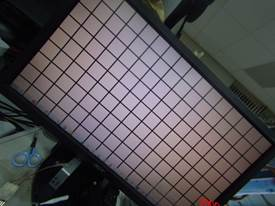

<b>[Note 2] </b>

The example of the GEO deformation gain
table, from left to right, corresponds to the deformation amount from the
center of the image to the edge. This parameter group indicates that the larger
the deformation amount toward the edge is. This example is a barrel deformation
correction. 

R is the distance from the center of the
image to each point. This distance can be understood as the radius of the
circle.

Ri represents the radius of each point of
the input (before correction) image.

Ro represents the radius of each point of
the output (corrected) image.

RoMax represents the longest distance from
the center of the output image to the four corners. If the center of the image
falls at 1/2 of the width and height, the four corners are all equal, and they
are the longest distances. 

&nbsp;

<h2 style='margin-left:0cm;text-indent:0cm'><a
name="_Toc42699396">8.3&nbsp;&nbsp;&nbsp;&nbsp;&nbsp;&nbsp;&nbsp;
Setting Interface</a></h2>

<h3 style='margin-left:0cm;text-indent:0cm'><a
name="_Toc42699397">8.3.1&nbsp;&nbsp;&nbsp;&nbsp;&nbsp;&nbsp; Proc</a></h3>

<h5 style='margin-top:0cm;margin-right:6.0pt;margin-bottom:0cm;margin-left:
46.0pt;margin-bottom:.0001pt;text-indent:-22.0pt'>l&nbsp;
/proc/videograph/vpe/dce/dump_info</h5>

<b>[Description]</b>

Read all DCE parameters at the current camera channel.

<b>[Command]</b>

<b>Write : Not support.</b>

Read : cat /proc/videograph/vpe/dce/dump_info

<b></b>

<b>&nbsp;</b>

<h5 style='margin-top:6.0pt;margin-right:6.0pt;margin-bottom:0cm;margin-left:
46.0pt;margin-bottom:.0001pt;text-indent:-22.0pt'>l&nbsp;
/proc/videograph/vpe/dce/ch_en</h5>

<b>[Description]</b>

Read or write the enable status of the current channel.

<b>[Command]</b>

<b>Write : </b>

<table class=MsoNormalTable border=1 cellspacing=0 cellpadding=0 width=625
 style='width:468.7pt;margin-left:26.7pt;border-collapse:collapse;border:none'>
 <tr>
  <td width=454 valign=top style='width:12.0cm;border:solid navy 1.0pt;
  border-bottom:none;background:#E5EAFF;padding:0cm 5.4pt 0cm 5.4pt'>
  
<b>proc command</b>

  </td>
  <td width=171 valign=top style='width:128.5pt;border-top:solid navy 1.0pt;
  border-left:none;border-bottom:none;border-right:solid navy 1.0pt;background:
  #E5EAFF;padding:0cm 5.4pt 0cm 5.4pt'>
  
<b>Target Parameter</b>

  </td>
 </tr>
 <tr>
  <td width=454 valign=top style='width:12.0cm;border:solid navy 1.0pt;
  border-top:none;padding:0cm 5.4pt 0cm 5.4pt'>
  
echo [ dc_en
  0~1 ] &gt; /proc/videograph/vpe/dce/ch_en

  </td>
  <td width=171 valign=top style='width:128.5pt;border-top:none;border-left:
  none;border-bottom:solid navy 1.0pt;border-right:solid navy 1.0pt;padding:
  0cm 5.4pt 0cm 5.4pt'>
  
<b>dc_en</b>

  </td>
 </tr>
</table>

<b>Read : </b>

<b>cat /proc/videograph/vpe/dce/ch_en</b>

<b>Output : </b>

<b></b>

<h3 style='margin-left:0cm;text-indent:0cm'><a name="_Toc100570773">8.3.2&nbsp;&nbsp;&nbsp;&nbsp;&nbsp;&nbsp; Vendor API</a></h3>

<b>[Description]</b>

Get and set the dce
parameters corresponding to current path_id.

<b>[Command]</b>

&nbsp;&nbsp;&nbsp;&nbsp;&nbsp;&nbsp;&nbsp; Get：

HD_RESULT vendor_video_get(HD_PATH_ID path_id, VENDOR_VIDEOPROC_DEWARP_INFO,
VENDOR_DEWARP_INFO *p_param); 

&nbsp;

&nbsp;&nbsp;&nbsp;&nbsp;&nbsp;&nbsp;&nbsp; Set：

HD_RESULT c(HD_PATH_ID path_id, VENDOR_ VENDOR_VIDEOPROC_DEWARP_INFO,
VENDOR_DEWARP_INFO *p_param);

<b>[Define]</b>

<b></b>

<b></b>

<h1 style='margin-left:0cm;text-indent:0cm'><a name="_Toc100570774">9&nbsp;&nbsp;&nbsp;&nbsp;&nbsp;&nbsp;&nbsp;&nbsp;&nbsp;
DC Table </a>Generator(DCTG)</h1>

<h2 style='margin-left:0cm;text-indent:0cm'><a name="_Toc100570775">9.1&nbsp;&nbsp;&nbsp;&nbsp;&nbsp;&nbsp;&nbsp;
Overview</a></h2>

<a name="_Hlk99728570">For perspective
projection application, in order to increase the convenience of usage, DCTG
module let user to set the desired angle and size with an instinct way to
generate DCTG parameters automatically. </a>Whenever this function is enabled, manual set
DCE 2D-LUT function will be invalid.

&nbsp;

<b>[Note]</b>

&nbsp;&nbsp;When using DCTG function, user
needs to set two parameters enable, one is dc_enable, the other is dctg_en.

&nbsp;

Please refer to the following description:

&nbsp;

The “theta” is the top/bottom angle.

The “phi” is the rotate angle. 

The “rot_y” is the rotate offset of (x, z)
plane towards Y-axis. 

The “rot_z” is the rotate offset of (x, y)
plane towards Z-axis.

&nbsp;

Generate LUT:

Define the rotate angle of FOV by
phi_st/phi_ed, and then rotate to FOV location by rot_y.

Define the top/bottom angle of FOV by theta_st/theta_ed,
and then rotate to FOV location by rot_z.

<h2 style='margin-left:0cm;text-indent:0cm'><a name="_Toc100570776">9.2&nbsp;&nbsp;&nbsp;&nbsp;&nbsp;&nbsp;&nbsp;
Parameter Description</a></h2>

<a name="_Toc100570787">Table 9&#8209;</a>1 DCTG parameter list

<table class=MsoNormalTable border=0 cellspacing=0 cellpadding=0 width=652
 style='width:489.05pt;margin-left:5.4pt;border-collapse:collapse'>
 <tr>
  <td width=140 valign=top style='width:105.25pt;border-top:solid #1D1DFF 1.5pt;
  border-left:none;border-bottom:solid #1D1DFF 1.5pt;border-right:none;
  background:#E5EAFF;padding:0cm 5.4pt 0cm 5.4pt'>
  
<b>Parameter</b>

  </td>
  <td width=96 valign=top style='width:72.15pt;border-top:solid #1D1DFF 1.5pt;
  border-left:none;border-bottom:solid #1D1DFF 1.5pt;border-right:none;
  background:#E5EAFF;padding:0cm 5.4pt 0cm 5.4pt'>
  
<b>Range</b>

  </td>
  <td width=114 valign=top style='width:85.35pt;border-top:solid #1D1DFF 1.5pt;
  border-left:none;border-bottom:solid #1D1DFF 1.5pt;border-right:none;
  background:#E5EAFF;padding:0cm 5.4pt 0cm 5.4pt'>
  
<b>Def</b>

  </td>
  <td width=302 valign=top style='width:226.3pt;border-top:solid #1D1DFF 1.5pt;
  border-left:none;border-bottom:solid #1D1DFF 1.5pt;border-right:none;
  background:#E5EAFF;padding:0cm 5.4pt 0cm 5.4pt'>
  
<b>Description</b>

  </td>
 </tr>
 <tr>
  <td width=140 style='width:105.25pt;border:none;border-bottom:solid #1D1DFF 1.0pt;
  background:white;padding:0cm 5.4pt 0cm 5.4pt'>
  
<b><i>dctg_en</i></b>

  </td>
  <td width=96 style='width:72.15pt;border:none;border-bottom:solid #1D1DFF 1.0pt;
  background:white;padding:0cm 5.4pt 0cm 5.4pt'>
  
0-1

  </td>
  <td width=114 style='width:85.35pt;border:none;border-bottom:solid #1D1DFF 1.0pt;
  background:white;padding:0cm 5.4pt 0cm 5.4pt'>
  
0

  </td>
  <td width=302 valign=top style='width:226.3pt;border:none;border-bottom:solid #1D1DFF 1.0pt;
  background:white;padding:0cm 5.4pt 0cm 5.4pt'>
  
DCTG ON/OFF

  </td>
 </tr>
 <tr>
  <td width=140 style='width:105.25pt;border:none;border-bottom:solid #1D1DFF 1.0pt;
  background:white;padding:0cm 5.4pt 0cm 5.4pt'>
  
<b><i>mount_type</i></b>

  </td>
  <td width=96 style='width:72.15pt;border:none;border-bottom:solid #1D1DFF 1.0pt;
  background:white;padding:0cm 5.4pt 0cm 5.4pt'>
  
0~1

  </td>
  <td width=114 style='width:85.35pt;border:none;border-bottom:solid #1D1DFF 1.0pt;
  background:white;padding:0cm 5.4pt 0cm 5.4pt'>
  
0

  </td>
  <td width=302 valign=top style='width:226.3pt;border:none;border-bottom:solid #1D1DFF 1.0pt;
  background:white;padding:0cm 5.4pt 0cm 5.4pt'>
  
Camera mount type. 

  
0: Ceiling mount

  
1: Floor mount

  </td>
 </tr>
 <tr>
  <td width=140 style='width:105.25pt;border:none;border-bottom:solid #1D1DFF 1.0pt;
  background:white;padding:0cm 5.4pt 0cm 5.4pt'>
  
<b><i>lut2d_sz</i></b>

  </td>
  <td width=96 style='width:72.15pt;border:none;border-bottom:solid #1D1DFF 1.0pt;
  background:white;padding:0cm 5.4pt 0cm 5.4pt'>
  
0, 3

  </td>
  <td width=114 style='width:85.35pt;border:none;border-bottom:solid #1D1DFF 1.0pt;
  background:white;padding:0cm 5.4pt 0cm 5.4pt'>
  
3

  </td>
  <td width=302 valign=top style='width:226.3pt;border:none;border-bottom:solid #1D1DFF 1.0pt;
  background:white;padding:0cm 5.4pt 0cm 5.4pt'>
  
Select size of 2D look-up table, this
  parameter must the same with DCE parameter.

  
0: 9x9

  
3: 65x65

  </td>
 </tr>
 <tr>
  <td width=140 style='width:105.25pt;border:none;border-bottom:solid #1D1DFF 1.0pt;
  background:white;padding:0cm 5.4pt 0cm 5.4pt'>
  
<b><i>lens_r</i></b>

  </td>
  <td width=96 style='width:72.15pt;border:none;border-bottom:solid #1D1DFF 1.0pt;
  background:white;padding:0cm 5.4pt 0cm 5.4pt'>
  
0~215-1

  </td>
  <td width=114 style='width:85.35pt;border:none;border-bottom:solid #1D1DFF 1.0pt;
  background:white;padding:0cm 5.4pt 0cm 5.4pt'>
  
0

  </td>
  <td width=302 valign=top style='width:226.3pt;border:none;border-bottom:solid #1D1DFF 1.0pt;
  background:white;padding:0cm 5.4pt 0cm 5.4pt'>
  
Valid radius of fish-eye lens, the unit
  is pixel.

  
Please refer to advance description.

  </td>
 </tr>
 <tr>
  <td width=140 style='width:105.25pt;border:none;border-bottom:solid #1D1DFF 1.0pt;
  background:white;padding:0cm 5.4pt 0cm 5.4pt'>
  
<b><i>lens_x_st</i></b>

  </td>
  <td width=96 style='width:72.15pt;border:none;border-bottom:solid #1D1DFF 1.0pt;
  background:white;padding:0cm 5.4pt 0cm 5.4pt'>
  
0~214-1

  </td>
  <td width=114 style='width:85.35pt;border:none;border-bottom:solid #1D1DFF 1.0pt;
  background:white;padding:0cm 5.4pt 0cm 5.4pt'>
  
0

  </td>
  <td width=302 valign=top style='width:226.3pt;border:none;border-bottom:solid #1D1DFF 1.0pt;
  background:white;padding:0cm 5.4pt 0cm 5.4pt'>
  
The start x position of fish-eye lens at the source
  image, the unit is pixel.

  </td>
 </tr>
 <tr>
  <td width=140 style='width:105.25pt;border:none;border-bottom:solid #1D1DFF 1.0pt;
  background:white;padding:0cm 5.4pt 0cm 5.4pt'>
  
<b><i>lens_y_st</i></b>

  </td>
  <td width=96 style='width:72.15pt;border:none;border-bottom:solid #1D1DFF 1.0pt;
  background:white;padding:0cm 5.4pt 0cm 5.4pt'>
  
0~214-1

  </td>
  <td width=114 style='width:85.35pt;border:none;border-bottom:solid #1D1DFF 1.0pt;
  background:white;padding:0cm 5.4pt 0cm 5.4pt'>
  
0

  </td>
  <td width=302 valign=top style='width:226.3pt;border:none;border-bottom:solid #1D1DFF 1.0pt;
  background:white;padding:0cm 5.4pt 0cm 5.4pt'>
  
The start y position of fish-eye lens at the source
  image, the unit is pixel.

  </td>
 </tr>
 <tr>
  <td width=140 style='width:105.25pt;border:none;border-bottom:solid #1D1DFF 1.0pt;
  background:white;padding:0cm 5.4pt 0cm 5.4pt'>
  
<b><i>theta_st</i></b>

  </td>
  <td width=96 style='width:72.15pt;border:none;border-bottom:solid #1D1DFF 1.0pt;
  background:white;padding:0cm 5.4pt 0cm 5.4pt'>
  
-180 ~ 180

  
(-*pi ~ *pi)

  </td>
  <td width=114 style='width:85.35pt;border:none;border-bottom:solid #1D1DFF 1.0pt;
  background:white;padding:0cm 5.4pt 0cm 5.4pt'>
  
0

  </td>
  <td width=302 valign=top style='width:226.3pt;border:none;border-bottom:solid #1D1DFF 1.0pt;
  background:white;padding:0cm 5.4pt 0cm 5.4pt'>
  
FOV theta start radian.

  </td>
 </tr>
 <tr>
  <td width=140 style='width:105.25pt;border:none;border-bottom:solid #1D1DFF 1.0pt;
  background:white;padding:0cm 5.4pt 0cm 5.4pt'>
  
<b><i>theta_ed</i></b>

  </td>
  <td width=96 style='width:72.15pt;border:none;border-bottom:solid #1D1DFF 1.0pt;
  background:white;padding:0cm 5.4pt 0cm 5.4pt'>
  
-180 ~ 180

  
(-*pi ~ *pi)

  </td>
  <td width=114 style='width:85.35pt;border:none;border-bottom:solid #1D1DFF 1.0pt;
  background:white;padding:0cm 5.4pt 0cm 5.4pt'>
  
0

  </td>
  <td width=302 valign=top style='width:226.3pt;border:none;border-bottom:solid #1D1DFF 1.0pt;
  background:white;padding:0cm 5.4pt 0cm 5.4pt'>
  
FOV theta end radian.

  
theta_end
  &gt; theta_st: normal image

  
theta_end &lt; theta_st: flip image

  </td>
 </tr>
 <tr>
  <td width=140 style='width:105.25pt;border:none;border-bottom:solid #1D1DFF 1.0pt;
  background:white;padding:0cm 5.4pt 0cm 5.4pt'>
  
<b><i>phi_st</i></b>

  </td>
  <td width=96 style='width:72.15pt;border:none;border-bottom:solid #1D1DFF 1.0pt;
  background:white;padding:0cm 5.4pt 0cm 5.4pt'>
  
-360 ~ 360 
  (-2*pi ~ 2*pi)

  </td>
  <td width=114 style='width:85.35pt;border:none;border-bottom:solid #1D1DFF 1.0pt;
  background:white;padding:0cm 5.4pt 0cm 5.4pt'>
  
0

  </td>
  <td width=302 valign=top style='width:226.3pt;border:none;border-bottom:solid #1D1DFF 1.0pt;
  background:white;padding:0cm 5.4pt 0cm 5.4pt'>
  
OV phi start radian.

  </td>
 </tr>
 <tr>
  <td width=140 style='width:105.25pt;border:none;border-bottom:solid #1D1DFF 1.0pt;
  background:white;padding:0cm 5.4pt 0cm 5.4pt'>
  
<b><i>phi_ed</i></b>

  </td>
  <td width=96 style='width:72.15pt;border:none;border-bottom:solid #1D1DFF 1.0pt;
  background:white;padding:0cm 5.4pt 0cm 5.4pt'>
  
-360 ~ 360 
  (-2*pi ~ 2*pi)

  </td>
  <td width=114 style='width:85.35pt;border:none;border-bottom:solid #1D1DFF 1.0pt;
  background:white;padding:0cm 5.4pt 0cm 5.4pt'>
  
0

  </td>
  <td width=302 valign=top style='width:226.3pt;border:none;border-bottom:solid #1D1DFF 1.0pt;
  background:white;padding:0cm 5.4pt 0cm 5.4pt'>
  
FOV phi end radian.

  
(-2*pi
  ~ 2*pi)

  
phi_end
  &gt; theta_st: normal image

  
phi_end &lt; theta_st: flip image

  </td>
 </tr>
 <tr>
  <td width=140 style='width:105.25pt;border:none;border-bottom:solid #1D1DFF 1.0pt;
  background:white;padding:0cm 5.4pt 0cm 5.4pt'>
  
<b><i>rot_z</i></b>

  </td>
  <td width=96 style='width:72.15pt;border:none;border-bottom:solid #1D1DFF 1.0pt;
  background:white;padding:0cm 5.4pt 0cm 5.4pt'>
  
-360 ~ 360 
  (-2*pi ~ 2*pi)

  </td>
  <td width=114 style='width:85.35pt;border:none;border-bottom:solid #1D1DFF 1.0pt;
  background:white;padding:0cm 5.4pt 0cm 5.4pt'>
  
0

  </td>
  <td width=302 valign=top style='width:226.3pt;border:none;border-bottom:solid #1D1DFF 1.0pt;
  background:white;padding:0cm 5.4pt 0cm 5.4pt'>
  
Z-axis rotate radian

  </td>
 </tr>
 <tr>
  <td width=140 style='width:105.25pt;border:none;border-bottom:solid #1D1DFF 1.0pt;
  background:white;padding:0cm 5.4pt 0cm 5.4pt'>
  
<b><i>rot_y</i></b>

  </td>
  <td width=96 style='width:72.15pt;border:none;border-bottom:solid #1D1DFF 1.0pt;
  background:white;padding:0cm 5.4pt 0cm 5.4pt'>
  
-360 ~ 360 
  (-2*pi ~ 2*pi)

  </td>
  <td width=114 style='width:85.35pt;border:none;border-bottom:solid #1D1DFF 1.0pt;
  background:white;padding:0cm 5.4pt 0cm 5.4pt'>
  
0

  </td>
  <td width=302 valign=top style='width:226.3pt;border:none;border-bottom:solid #1D1DFF 1.0pt;
  background:white;padding:0cm 5.4pt 0cm 5.4pt'>
  
Y-zxis rotate radian.

  </td>
 </tr>
</table>

<b>&nbsp;</b>

<b>Advance description:</b>

l&nbsp;&nbsp; <b><i>lens_r: </i></b>The valid radius of fish-eye device.

l&nbsp;&nbsp; <b><i>lens_x_st :
</i></b>The start x position
of fish-eye lens at the source image, the unit is pixel.

l&nbsp;&nbsp; <b><i>lens_y_st :</i></b> The start y position of fish-eye lens at
the source image, the unit is pixel.

<h2 style='margin-left:0cm;text-indent:0cm'><a name="_Toc100570777">9.3&nbsp;&nbsp;&nbsp;&nbsp;&nbsp;&nbsp;&nbsp;
Setting Interface</a></h2>

<h3 style='margin-left:0cm;text-indent:0cm'><a
name="_Toc99727896">9.3.1&nbsp;&nbsp;&nbsp;&nbsp;&nbsp;&nbsp; Proc</a></h3>

<h5 style='margin-top:0cm;margin-right:6.0pt;margin-bottom:0cm;margin-left:
46.0pt;margin-bottom:.0001pt;text-indent:-22.0pt'>l&nbsp;
/proc/videograph/vpe/dctg/dump_info</h5>

<b>[Description]</b>

Read all dctg parameters of the current channel.

<b>[Command]</b>

<b>Write : Not support.</b>

&nbsp;

Read :
cat /proc/videograph/vpe/dctg/dump_info

<b></b>

&nbsp;

<h5 style='margin-top:0cm;margin-right:6.0pt;margin-bottom:0cm;margin-left:
46.0pt;margin-bottom:.0001pt;text-indent:-22.0pt'>l&nbsp;
/proc/videograph/vpe/dctg/ch_en</h5>

<b>[Description]</b>

&nbsp;&nbsp;&nbsp;&nbsp;&nbsp;&nbsp;&nbsp; Set
dctg enable.

<b>[Command]</b>

<b>Write : </b>

<table class=MsoNormalTable border=1 cellspacing=0 cellpadding=0 width=625
 style='width:468.7pt;margin-left:26.7pt;border-collapse:collapse;border:none'>
 <tr>
  <td width=438 valign=top style='width:328.7pt;border:solid navy 1.0pt;
  border-bottom:none;background:#E5EAFF;padding:0cm 5.4pt 0cm 5.4pt'>
  
<b>proc command</b>

  </td>
  <td width=187 valign=top style='width:140.0pt;border-top:solid navy 1.0pt;
  border-left:none;border-bottom:none;border-right:solid navy 1.0pt;background:
  #E5EAFF;padding:0cm 5.4pt 0cm 5.4pt'>
  
<b>Target Parameter</b>

  </td>
 </tr>
 <tr style='height:19.2pt'>
  <td width=438 valign=top style='width:328.7pt;border:solid navy 1.0pt;
  border-top:none;padding:0cm 5.4pt 0cm 5.4pt;height:19.2pt'>
  
echo [dctg_en] &gt;
  /proc/videograph/vpe/dctg/ch_en

  </td>
  <td width=187 valign=top style='width:140.0pt;border-top:none;border-left:
  none;border-bottom:solid navy 1.0pt;border-right:solid navy 1.0pt;padding:
  0cm 5.4pt 0cm 5.4pt;height:19.2pt'>
  
dctg_en:
  dctg enable

  </td>
 </tr>
</table>

<b>Read : </b>

cat
/proc/videograph/vpe/dctg/ch_en

<b>Output : </b>

<b></b>

&nbsp;

<h5 style='margin-top:0cm;margin-right:6.0pt;margin-bottom:0cm;margin-left:
46.0pt;margin-bottom:.0001pt;text-indent:-22.0pt'>l&nbsp;
/proc/videograph/vpe/dctg/phi</h5>

<b>[Description]</b>

Set FOV phi start radian

<b>[Command]</b>

<b>Write : </b>

<table class=MsoNormalTable border=1 cellspacing=0 cellpadding=0 width=625
 style='width:468.7pt;margin-left:26.7pt;border-collapse:collapse;border:none'>
 <tr>
  <td width=438 valign=top style='width:328.7pt;border:solid navy 1.0pt;
  border-bottom:none;background:#E5EAFF;padding:0cm 5.4pt 0cm 5.4pt'>
  
<b>proc command</b>

  </td>
  <td width=187 valign=top style='width:140.0pt;border-top:solid navy 1.0pt;
  border-left:none;border-bottom:none;border-right:solid navy 1.0pt;background:
  #E5EAFF;padding:0cm 5.4pt 0cm 5.4pt'>
  
<b>Target Parameter</b>

  </td>
 </tr>
 <tr style='height:20.0pt'>
  <td width=438 valign=top style='width:328.7pt;border:solid navy 1.0pt;
  border-top:none;padding:0cm 5.4pt 0cm 5.4pt;height:20.0pt'>
  
echo [st] [ed] &gt; /proc/videograph/vpe/dctg/phi

  </td>
  <td width=187 valign=top style='width:140.0pt;border-top:none;border-left:
  none;border-bottom:solid windowtext 1.0pt;border-right:solid navy 1.0pt;
  padding:0cm 5.4pt 0cm 5.4pt;height:20.0pt'>
  
st:
  <a name="_Hlk99729192">FOV
  phi start radian</a>

  
ed : FOV
  phi end radian

  
※angle range: -360 ~ 360

  </td>
 </tr>
</table>

&nbsp;

<b>Read : </b>

cat
/proc/videograph/vpe/dctg/phi

<b>Output : </b>

<b></b>

&nbsp;

<h5 style='margin-top:0cm;margin-right:6.0pt;margin-bottom:0cm;margin-left:
46.0pt;margin-bottom:.0001pt;text-indent:-22.0pt'>l&nbsp;
/proc/videograph/vpe/dctg/rot</h5>

<b>[Description]</b>

&nbsp;&nbsp;&nbsp;&nbsp;&nbsp;&nbsp;&nbsp; Set
Z-axis and Y-zxis rotate
radian.

<b>[Command]</b>

<b>Write : </b>

<table class=MsoNormalTable border=1 cellspacing=0 cellpadding=0 width=625
 style='width:468.7pt;margin-left:26.7pt;border-collapse:collapse;border:none'>
 <tr>
  <td width=454 valign=top style='width:12.0cm;border:solid navy 1.0pt;
  border-bottom:none;background:#E5EAFF;padding:0cm 5.4pt 0cm 5.4pt'>
  
<b>proc command</b>

  </td>
  <td width=171 valign=top style='width:128.5pt;border-top:solid navy 1.0pt;
  border-left:none;border-bottom:none;border-right:solid navy 1.0pt;background:
  #E5EAFF;padding:0cm 5.4pt 0cm 5.4pt'>
  
<b>Target Parameter</b>

  </td>
 </tr>
 <tr>
  <td width=454 valign=top style='width:12.0cm;border:solid navy 1.0pt;
  border-top:none;padding:0cm 5.4pt 0cm 5.4pt'>
  
echo [z] [y] &gt; /prc/videograph/vpe/dctg/rot

  
&nbsp;

  </td>
  <td width=171 valign=top style='width:128.5pt;border-top:none;border-left:
  none;border-bottom:solid navy 1.0pt;border-right:solid navy 1.0pt;padding:
  0cm 5.4pt 0cm 5.4pt'>
  
z:
  <a name="_Hlk99729311">Z-axis
  rotate radian.</a>

  
y: Y-zxis
  rotate radian

  
※angle range: -360 ~ 360

  </td>
 </tr>
</table>

<b>Read : </b>

cat
/proc/videograph/vpe/dctg/rot

<b>Output : </b>

<h5 style='margin-top:0cm;margin-right:6.0pt;margin-bottom:0cm;margin-left:
46.0pt;margin-bottom:.0001pt;text-indent:-22.0pt'>l&nbsp;
/proc/videograph/vpe/dctg/theta</h5>

<b>[Description]</b>

Set FOV theta start radian.

<b>[Command]</b>

<b>Write : </b>

<table class=MsoNormalTable border=1 cellspacing=0 cellpadding=0 width=625
 style='width:468.7pt;margin-left:26.7pt;border-collapse:collapse;border:none'>
 <tr>
  <td width=454 valign=top style='width:12.0cm;border:solid navy 1.0pt;
  border-bottom:none;background:#E5EAFF;padding:0cm 5.4pt 0cm 5.4pt'>
  
<b>proc command</b>

  </td>
  <td width=171 valign=top style='width:128.5pt;border-top:solid navy 1.0pt;
  border-left:none;border-bottom:none;border-right:solid navy 1.0pt;background:
  #E5EAFF;padding:0cm 5.4pt 0cm 5.4pt'>
  
<b>目標參數</b>

  </td>
 </tr>
 <tr>
  <td width=454 valign=top style='width:12.0cm;border:solid navy 1.0pt;
  border-top:none;padding:0cm 5.4pt 0cm 5.4pt'>
  
echo [st] [ed] &gt; /prc/videograph/vpe/dctg/theta

  
&nbsp;

  </td>
  <td width=171 valign=top style='width:128.5pt;border-top:none;border-left:
  none;border-bottom:solid navy 1.0pt;border-right:solid navy 1.0pt;padding:
  0cm 5.4pt 0cm 5.4pt'>
  
st:
  FOV theta start radian.

  
ed : FOV
  theta end radian

  
※angle range: -180 ~ 180

  </td>
 </tr>
</table>

<b>Read : </b>

cat
/proc/videograph/vpe/dctg/theta

<b>Output :</b>

<b></b>

<h3 style='margin-left:0cm;text-indent:0cm'><a
name="_Toc99727897">9.3.2&nbsp;&nbsp;&nbsp;&nbsp;&nbsp;&nbsp; Vendor API</a></h3>

<b>[Description]</b>

Get and set the dctg
parameters corresponding to current path_id.

<b>[Command]</b>

&nbsp;&nbsp;&nbsp;&nbsp;&nbsp;&nbsp;&nbsp; Get：

HD_RESULT vendor_videoproc_get(HD_PATH_ID path_id,
VENDOR_VIDEOPROC_DEWARP_DCTG_INFO, VENDOR_DEWARP_DCTG_INFO
*p_param); 

&nbsp;

&nbsp;&nbsp;&nbsp;&nbsp;&nbsp;&nbsp;&nbsp; Set：

HD_RESULT vendor_videoproc_set(HD_PATH_ID path_id,
VENDOR_VIDEOPROC_DEWARP_DCTG_INFO, VENDOR_DEWARP_DCTG_INFO
*p_param);

<b>[Define]</b>

<b></b>

<b> 
</b>

<h1 style='margin-left:0cm;text-indent:0cm'><a name="_Toc100570780">10&nbsp;&nbsp;&nbsp;&nbsp;
Revise History</a></h1>

<table class=MsoNormalTable border=1 cellspacing=0 cellpadding=0
 style='margin-left:1.4pt;border-collapse:collapse;border:none'>
 <tr>
  <td width=72 style='width:53.85pt;border:solid windowtext 1.0pt;padding:0cm 1.4pt 0cm 1.4pt'>
  
<b>Version</b>

  </td>
  <td width=84 style='width:63.15pt;border:solid windowtext 1.0pt;border-left:
  none;padding:0cm 1.4pt 0cm 1.4pt'>
  
<b>Date</b>

  </td>
  <td width=178 style='width:133.4pt;border:solid windowtext 1.0pt;border-left:
  none;padding:0cm 1.4pt 0cm 1.4pt'>
  
<b>Advisor</b>

  </td>
  <td width=280 valign=top style='width:210.0pt;border:solid windowtext 1.0pt;
  border-left:none;padding:0cm 1.4pt 0cm 1.4pt'>
  
<b>Description</b>

  </td>
 </tr>
 <tr>
  <td width=72 style='width:53.85pt;border:solid windowtext 1.0pt;border-top:
  none;padding:0cm 1.4pt 0cm 1.4pt'>
  
0.1.00

  </td>
  <td width=84 style='width:63.15pt;border-top:none;border-left:none;
  border-bottom:solid windowtext 1.0pt;border-right:solid windowtext 1.0pt;
  padding:0cm 1.4pt 0cm 1.4pt'>
  
2021/01/20

  </td>
  <td width=178 style='width:133.4pt;border-top:none;border-left:none;
  border-bottom:solid windowtext 1.0pt;border-right:solid windowtext 1.0pt;
  padding:0cm 1.4pt 0cm 1.4pt'>
  
Allen
  Hsu

  </td>
  <td width=280 valign=top style='width:210.0pt;border-top:none;border-left:
  none;border-bottom:solid windowtext 1.0pt;border-right:solid windowtext 1.0pt;
  padding:0cm 1.4pt 0cm 1.4pt'>
  
First
  version.

  </td>
 </tr>
 <tr>
  <td width=72 style='width:53.85pt;border:solid windowtext 1.0pt;border-top:
  none;padding:0cm 1.4pt 0cm 1.4pt'>
  
0.2.00

  </td>
  <td width=84 style='width:63.15pt;border-top:none;border-left:none;
  border-bottom:solid windowtext 1.0pt;border-right:solid windowtext 1.0pt;
  padding:0cm 1.4pt 0cm 1.4pt'>
  
2021/3/26

  </td>
  <td width=178 style='width:133.4pt;border-top:none;border-left:none;
  border-bottom:solid windowtext 1.0pt;border-right:solid windowtext 1.0pt;
  padding:0cm 1.4pt 0cm 1.4pt'>
  
Allen
  Hsu

  </td>
  <td width=280 valign=top style='width:210.0pt;border-top:none;border-left:
  none;border-bottom:solid windowtext 1.0pt;border-right:solid windowtext 1.0pt;
  padding:0cm 1.4pt 0cm 1.4pt'>
  
Add
  description of Vendor command.

  </td>
 </tr>
 <tr>
  <td width=72 style='width:53.85pt;border:solid windowtext 1.0pt;border-top:
  none;padding:0cm 1.4pt 0cm 1.4pt'>
  
0.3.00

  </td>
  <td width=84 style='width:63.15pt;border-top:none;border-left:none;
  border-bottom:solid windowtext 1.0pt;border-right:solid windowtext 1.0pt;
  padding:0cm 1.4pt 0cm 1.4pt'>
  
2022/4/11

  </td>
  <td width=178 style='width:133.4pt;border-top:none;border-left:none;
  border-bottom:solid windowtext 1.0pt;border-right:solid windowtext 1.0pt;
  padding:0cm 1.4pt 0cm 1.4pt'>
  
Mina
  Wang

  </td>
  <td width=280 valign=top style='width:210.0pt;border-top:none;border-left:
  none;border-bottom:solid windowtext 1.0pt;border-right:solid windowtext 1.0pt;
  padding:0cm 1.4pt 0cm 1.4pt'>
  
Add
  description for dce and dctg

  </td>
 </tr>
</table>

&nbsp;

&nbsp;

</body>

